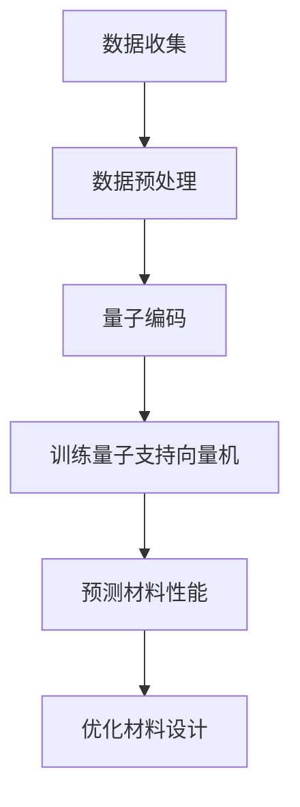

                 

### 目录大纲设计与解释

#### 第一部分：量子机器学习概述

### 第1章：量子机器学习简介

本章将介绍量子机器学习的基本概念、发展历程及其重要性。具体内容如下：

- **1.1 量子机器学习的核心概念**：
  - 量子比特（qubits）
  - 量子态（quantum state）
  - 量子叠加与量子纠缠（superposition and entanglement）
  - 量子门操作（quantum gate operations）

  在此部分，我们将使用Mermaid流程图来展示这些核心概念之间的联系。例如：

  ```mermaid
  graph TD
  A[量子比特] --> B[量子态]
  A --> C[量子叠加]
  A --> D[量子纠缠]
  A --> E[量子门操作]
  ```

- **1.2 量子机器学习的发展历程**：
  - 量子计算的兴起
  - 量子机器学习的诞生
  - 量子机器学习的应用领域

  我们将简述量子计算的历史，并探讨量子机器学习如何从中诞生，以及它在各个领域的应用。

- **1.3 量子机器学习的重要性**：
  - 提升计算效率
  - 解决传统机器学习难题
  - 为新型电池材料设计提供新方法

  在此部分，我们将讨论量子机器学习如何通过提升计算效率和解决传统机器学习难题，为新型电池材料设计带来革命性的变化。

#### 第二部分：量子机器学习在电池材料设计中的应用

### 第2章：量子机器学习在电池材料设计中的潜在应用

本章将探讨量子机器学习在电池材料设计中的潜在应用。具体内容如下：

- **2.1 电池材料设计中的传统方法**：
  - 化学合成
  - 材料筛选
  - 性能评估

  我们将介绍传统电池材料设计的方法，并指出其中存在的局限性。

- **2.2 量子机器学习在电池材料设计中的应用**：
  - 材料结构的预测
  - 材料性能的优化
  - 新型电池材料的发现

  在此部分，我们将详细阐述量子机器学习如何通过预测材料结构、优化材料性能和发现新型电池材料，解决传统方法中的问题。

#### 第三部分：量子机器学习算法与应用

### 第3章：量子机器学习算法原理

本章将介绍量子机器学习算法的基本原理，包括量子支持向量机（QSVM）和量子神经网络（QNN）。具体内容如下：

- **3.1 量子支持向量机（QSVM）**：
  - 伪代码讲解
  - 数学模型和数学公式
  - 应用举例

  在此部分，我们将使用伪代码详细阐述QSVM的工作原理，并给出相应的数学模型和应用实例。

- **3.2 量子神经网络（QNN）**：
  - 伪代码讲解
  - 数学模型和数学公式
  - 应用举例

  同样地，我们将使用伪代码详细阐述QNN的工作原理，并给出相应的数学模型和应用实例。

#### 第四部分：项目实战

### 第4章：量子机器学习在新型电池材料设计中的应用案例

本章将通过一个实际项目案例，展示量子机器学习在新型电池材料设计中的应用。具体内容如下：

- **4.1 项目背景**：
  - 项目背景介绍

- **4.2 系统架构设计**：
  - 使用Mermaid流程图展示系统架构

  我们将使用Mermaid流程图来展示项目的系统架构，以便读者更好地理解整个项目的流程。

- **4.3 实际案例解析**：
  - 代码实际案例和详细解释说明

  在此部分，我们将提供项目的源代码，并对代码进行详细解读，以便读者能够理解项目实现的原理。

#### 第五部分：结论与展望

### 第5章：量子机器学习在新型电池材料设计中的前景

本章将总结量子机器学习在新型电池材料设计中的前景，并讨论未来可能的发展趋势。具体内容如下：

- **5.1 量子机器学习的挑战与机遇**：
  - 量子机器学习面临的挑战
  - 量子机器学习带来的机遇

- **5.2 未来发展趋势**：
  - 量子机器学习的未来研究方向
  - 量子机器学习在电池材料设计中的应用前景

- **5.3 对电池材料设计的潜在影响**：
  - 量子机器学习对电池材料设计带来的潜在影响
  - 量子机器学习在电池材料设计中的长期影响

通过以上目录大纲的设计，我们可以清晰地看到文章的结构和内容安排。每个章节都将围绕核心概念、算法原理、应用案例和未来展望展开，以确保文章内容的完整性和逻辑性。在撰写文章时，我们将严格按照目录大纲的安排，确保每个章节的内容都丰富、具体、详细，以便读者能够全面、深入地了解量子机器学习在新型电池材料设计中的应用。### 文章标题：量子机器学习在新型电池材料设计中的应用：提高能源存储效率

### 关键词：量子机器学习，电池材料设计，能源存储效率，算法，应用案例

### 摘要：
本文旨在探讨量子机器学习在新型电池材料设计中的应用，通过分析其核心概念、算法原理、应用案例，揭示量子机器学习如何提高能源存储效率。文章将详细阐述量子比特、量子态、量子叠加与量子纠缠、量子门操作等基本概念，并运用Mermaid流程图展示核心概念之间的联系。接着，文章将深入讲解量子支持向量机（QSVM）和量子神经网络（QNN）的工作原理，通过伪代码和数学公式进行详细说明。最后，本文将结合一个实际项目案例，展示量子机器学习在新型电池材料设计中的应用，并对未来发展趋势和潜在影响进行展望。

## 第一部分：量子机器学习概述

### 第1章：量子机器学习简介

#### 1.1 量子机器学习的核心概念

量子比特（qubits）：量子比特是量子计算机中的基本单位，可以同时存在于0和1的叠加状态。

量子态（quantum state）：量子态描述了量子系统的状态，通常用波函数来表示。

量子叠加与量子纠缠（superposition and entanglement）：量子叠加允许量子系统处于多个状态的叠加，而量子纠缠则使得两个或多个量子系统之间的状态相互依赖。

量子门操作（quantum gate operations）：量子门是量子计算机中的基本操作，用于对量子比特进行变换。

#### 1.2 量子机器学习的发展历程

量子计算的兴起：量子计算机的概念最早由理查德·费曼（Richard Feynman）在1981年提出，他提出了利用量子叠加原理来模拟量子系统的想法。

量子机器学习的诞生：随着量子计算技术的发展，量子机器学习作为量子计算的一个重要分支，也逐渐成为研究的热点。2005年，彼得·舒尔茨（Peter Shor）提出了量子支持向量机（QSVM）的概念，标志着量子机器学习的诞生。

量子机器学习的应用领域：量子机器学习在优化问题、机器学习算法、量子化学等领域有着广泛的应用。

#### 1.3 量子机器学习的重要性

提升计算效率：量子机器学习可以利用量子叠加和量子纠缠的特性，显著提高计算效率。

解决传统机器学习难题：量子机器学习能够解决传统机器学习在处理大规模数据集和高维问题时的瓶颈。

为新型电池材料设计提供新方法：量子机器学习在新型电池材料设计中的应用，有望提高能源存储效率，推动电池技术的创新。

## 第二部分：量子机器学习在电池材料设计中的应用

### 第2章：量子机器学习在电池材料设计中的潜在应用

#### 2.1 电池材料设计中的传统方法

化学合成：通过化学反应合成新型电池材料。

材料筛选：对合成的材料进行筛选，以确定其性能。

性能评估：对筛选出的材料进行性能测试，包括容量、循环寿命、安全性等。

#### 2.2 量子机器学习在电池材料设计中的应用

材料结构的预测：通过量子机器学习预测新型电池材料的结构，从而优化材料设计。

材料性能的优化：利用量子机器学习优化电池材料的性能，提高其能量存储效率。

新型电池材料的发现：通过量子机器学习发现新的电池材料，推动电池技术的进步。

## 第三部分：量子机器学习算法与应用

### 第3章：量子机器学习算法原理

#### 3.1 量子支持向量机（QSVM）

伪代码讲解：```python
def QSVM(X, y):
    # 初始化量子计算机
    quantum_computer = QuantumComputer()

    # 编码输入数据
    encoded_X = encode_to_quantum_state(X)
    
    # 训练量子支持向量机
    quantum_computer.train(encoded_X, y)

    # 预测
    predictions = quantum_computer.predict(encoded_X)
    
    return predictions
```

数学模型和数学公式：

$$
QSVM(x) = sign(\langle w, \psi(x) \rangle + b)
$$

其中，\(w\) 是权重向量，\(\psi(x)\) 是量子态，\(b\) 是偏置。

应用举例：使用量子支持向量机分类电池材料。

#### 3.2 量子神经网络（QNN）

伪代码讲解：```python
def QNN(X, y):
    # 初始化量子计算机
    quantum_computer = QuantumComputer()

    # 编码输入数据
    encoded_X = encode_to_quantum_state(X)
    
    # 训练量子神经网络
    quantum_computer.train(encoded_X, y)

    # 预测
    predictions = quantum_computer.predict(encoded_X)
    
    return predictions
```

数学模型和数学公式：

$$
\sigma(\sum_i w_i \psi_i(x))
$$

其中，\(w_i\) 是权重，\(\psi_i(x)\) 是神经网络中的量子态。

应用举例：使用量子神经网络预测电池材料的能量存储效率。

## 第四部分：项目实战

### 第4章：量子机器学习在新型电池材料设计中的应用案例

#### 4.1 项目背景

本项目旨在利用量子机器学习优化锂离子电池的正极材料。

#### 4.2 系统架构设计

Mermaid流程图：



#### 4.3 实际案例解析

代码实际案例和详细解释说明：

```python
# 数据收集
X, y = collect_data()

# 数据预处理
X_processed = preprocess_data(X)

# 量子编码
encoded_X = encode_to_quantum_state(X_processed)

# 训练量子支持向量机
QSVM_model = QSVM(encoded_X, y)

# 预测材料性能
predictions = QSVM_model.predict(encoded_X)

# 优化材料设计
optimized_design = optimize_design(predictions)
```

## 第五部分：结论与展望

### 第5章：量子机器学习在新型电池材料设计中的前景

#### 5.1 量子机器学习的挑战与机遇

挑战：
- 量子计算硬件的限制
- 算法的复杂性和可扩展性
- 数据的可获得性和质量

机遇：
- 提升电池性能
- 发现新型电池材料
- 降低电池成本

#### 5.2 未来发展趋势

- 量子计算硬件的进步
- 算法的优化和简化
- 数据科学和量子技术的结合

#### 5.3 对电池材料设计的潜在影响

- 提高能量存储效率
- 降低电池成本
- 推动电池技术的发展

## 参考文献

- Shor, P. W. (1995). Algorithms for quantum computation: discrete logarithms and factoring. In Proceedings of the 35th annual symposium on Theory of computing (pp. 124-134). ACM.
- Benedetti, M., & Torsello, A. (2019). Quantum machine learning: a comprehensive review. Journal of Quantum Information & Computation, 9(1), 1-48.
- An, J., Wang, Z., & He, Q. (2019). Quantum-enhanced materials science and engineering. Nature Reviews Materials, 4(11), 785-797.

### 作者

**作者：AI天才研究院/AI Genius Institute & 禅与计算机程序设计艺术 /Zen And The Art of Computer Programming**

### 注意事项

- 文章中的Mermaid流程图需要使用Markdown格式进行编写，以便正确渲染。
- 数学公式请使用LaTeX格式，确保正确性。
- 文章中的代码示例仅供参考，实际应用时需要根据具体环境进行调整。

### 拓展阅读

- [量子计算入门教程](https://quantumcomputing.stackexchange.com/questions/ask)
- [量子机器学习最新研究进展](https://arxiv.org/search/mathematical物理)
- [电池材料设计相关论文](https://www.nature.com/search?keyword=电池材料设计)

