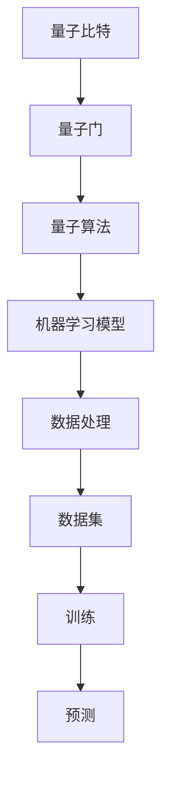
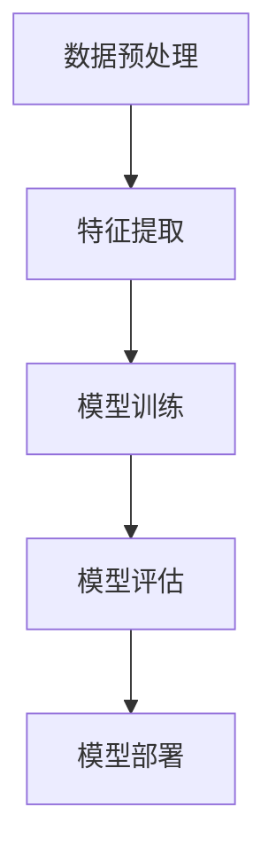
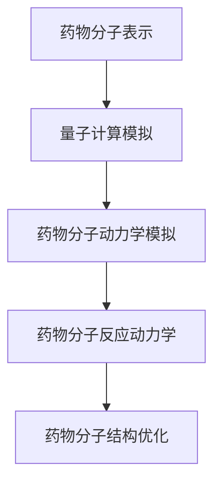

                 

# 量子机器学习在药物发现中的应用：加速筛选潜在药物

## 关键词

- 量子计算
- 药物发现
- 机器学习
- 潜在药物筛选
- 变分量子算法
- 量子模拟
- 量子优化

## 摘要

本文探讨了量子计算与机器学习在药物发现领域的结合，通过量子比特、量子门和量子算法等基础概念，介绍了量子机器学习的基本原理。文章重点阐述了量子机器学习在药物分子模拟、虚拟筛选、药物设计和优化中的应用，并通过实际案例展示了量子计算在药物发现中的巨大潜力。最后，文章对量子机器学习在药物发现领域的未来前景进行了展望。

## 目录大纲

### 第1章 引言

- 1.1 药物发现的重要性
- 1.2 量子计算与机器学习的结合
- 1.3 本书结构

### 第2章 量子计算基础

- 2.1 量子比特与经典比特
- 2.2 量子门与量子算法
- 2.3 量子计算与机器学习的联系
- 2.4 Mermaid 流程图：量子计算与机器学习架构

### 第3章 机器学习基础

- 3.1 机器学习的概念
- 3.2 监督学习、无监督学习和强化学习
- 3.3 机器学习算法
- 3.4 Mermaid 流程图：机器学习流程

### 第4章 量子机器学习算法

- 4.1 变分量子线性分类器
- 4.2 变分量子生成对抗网络
- 4.3 变分量子深度学习
- 4.4 量子机器学习算法的伪代码

### 第5章 量子计算与药物分子

- 5.1 药物分子的表示
- 5.2 量子计算在药物分子模拟中的应用
- 5.3 Mermaid 流程图：量子计算在药物分子中的应用流程

### 第6章 量子机器学习在药物发现中的应用

- 6.1 量子机器学习在虚拟筛选中的应用
- 6.2 量子机器学习在药物设计中的应用
- 6.3 量子机器学习在药物优化中的应用
- 6.4 量子机器学习算法的数学模型和公式

### 第7章 项目实战

- 7.1 虚拟筛选项目实战
- 7.2 药物设计项目实战
- 7.3 药物优化项目实战
- 7.4 开发环境搭建与源代码实现

### 第8章 未来展望

- 8.1 量子机器学习在药物发现中的应用前景
- 8.2 量子机器学习的挑战与机遇
- 8.3 未来发展趋势

## 第1章 引言

### 1.1 药物发现的重要性

药物发现是现代医学的关键环节，对于治疗疾病和提高人类健康水平具有重要意义。然而，传统的药物发现过程通常需要大量的人力和物力投入，而且成功率较低。随着科学技术的不断发展，量子计算和机器学习技术的引入为药物发现带来了新的机遇。量子计算具有超强的并行计算能力，可以大幅提高药物分子模拟和优化的效率。机器学习则能够从海量数据中提取有价值的信息，为药物设计提供指导。

### 1.2 量子计算与机器学习的结合

量子计算是一种基于量子力学原理的新型计算模型，它具有与传统计算机不同的计算能力。机器学习是一种利用数据训练模型，从而实现人工智能的技术。量子计算和机器学习在药物发现中的应用主要体现在以下几个方面：

1. **量子模拟**：量子计算机能够模拟量子系统的行为，这对于药物分子模拟具有重要意义。
2. **量子优化**：量子计算机在解决优化问题时具有潜在的优势，可以帮助设计更有效的药物分子。
3. **量子机器学习**：量子机器学习算法能够处理大量的数据，并从中提取有用的信息，这对于药物发现中的数据挖掘和分析具有重要意义。

### 1.3 本书结构

本书分为八个章节，具体内容如下：

- 第1章 引言：介绍药物发现的重要性，以及量子计算和机器学习在药物发现中的应用。
- 第2章 量子计算基础：介绍量子比特、量子门和量子算法等基本概念。
- 第3章 机器学习基础：介绍机器学习的基本概念、分类和算法。
- 第4章 量子机器学习算法：介绍几种常见的量子机器学习算法。
- 第5章 量子计算与药物分子：介绍量子计算在药物分子模拟中的应用。
- 第6章 量子机器学习在药物发现中的应用：详细介绍量子机器学习在药物发现中的应用。
- 第7章 项目实战：通过实际案例介绍如何使用量子机器学习技术进行药物发现。
- 第8章 未来展望：讨论量子机器学习在药物发现中的应用前景和挑战。

## 第2章 量子计算基础

### 2.1 量子比特与经典比特

量子比特（qubit）是量子计算的基本单位，它与经典比特（bit）有本质的不同。经典比特只能处于0或1的状态，而量子比特可以同时处于0和1的叠加状态。这种叠加状态可以用一个复数系数来表示，如$|\psi\rangle = \alpha|0\rangle + \beta|1\rangle$，其中$\alpha$和$\beta$是复数，且$|\alpha|^2 + |\beta|^2 = 1$。

### 2.2 量子门与量子算法

量子门（quantum gate）是作用于量子比特的基本操作，类似于经典计算机中的逻辑门。量子门可以将量子比特的状态进行线性变换。常见的量子门有保罗门（Pauli gate）、旋转门（Rotation gate）和交换门（Swap gate）等。

量子算法（quantum algorithm）是利用量子计算机解决问题的算法，它们通常具有指数级的加速能力。著名的量子算法有Shor算法、Grover算法和量子线性分类器等。

### 2.3 量子计算与机器学习的联系

量子计算在机器学习中的应用主要体现在以下几个方面：

1. **量子模拟**：量子计算机能够模拟量子系统的行为，这对于药物分子模拟具有重要意义。例如，使用量子计算可以模拟药物分子与生物大分子（如蛋白质）的相互作用，从而预测药物的效果。
2. **量子优化**：量子计算机在解决优化问题时具有潜在的优势，可以帮助设计更有效的药物分子。例如，优化药物分子的结构，使其具有更好的药理活性。
3. **量子机器学习**：量子机器学习算法能够处理大量的数据，并从中提取有用的信息，这对于药物发现中的数据挖掘和分析具有重要意义。例如，使用量子机器学习算法可以分析药物分子的结构-活性关系，从而预测新的潜在药物。

### 2.4 Mermaid 流程图：量子计算与机器学习架构

以下是一个简单的 Mermaid 流程图，展示了量子计算与机器学习的架构：



## 第3章 机器学习基础

### 3.1 机器学习的概念

机器学习是一种利用数据训练模型，从而实现人工智能的技术。其核心思想是通过分析大量数据，从中提取出有用的模式或规律，并利用这些规律对新的数据进行预测或决策。机器学习可以分为监督学习、无监督学习和强化学习三种类型。

- **监督学习**：监督学习是一种有教师学习的方法，训练数据集包含了输入和对应的输出。模型的目标是学习输入和输出之间的关系，以便对新的输入进行预测。
- **无监督学习**：无监督学习是一种无教师学习的方法，训练数据集只包含输入，没有对应的输出。模型的目标是发现数据中的内在结构或模式。
- **强化学习**：强化学习是一种基于奖励机制的学习方法，模型通过与环境的交互来学习最优策略，以最大化长期回报。

### 3.2 监督学习、无监督学习和强化学习

1. **监督学习**：

   监督学习算法可以分为线性模型、决策树、支持向量机、神经网络等。以下是一个简单的线性回归算法的伪代码：

   ```python
   def linear_regression(X, y):
       # 求解回归系数w
       w = (X'X)^(-1)X'y
       # 预测
       y_pred = Xw
       return y_pred
   ```

2. **无监督学习**：

   无监督学习算法可以分为聚类、降维、关联规则挖掘等。以下是一个简单的K均值聚类算法的伪代码：

   ```python
   def k_means(X, k):
       # 初始化中心点
       centroids = initialize_centroids(X, k)
       # 迭代更新中心点和簇分配
       while not converged:
           # 分配簇
           clusters = assign_clusters(X, centroids)
           # 更新中心点
           centroids = update_centroids(clusters, X)
       return centroids, clusters
   ```

3. **强化学习**：

   强化学习算法可以分为基于值函数的方法和基于策略的方法。以下是一个简单的Q-learning算法的伪代码：

   ```python
   def q_learning(Q, state, action, reward, next_state, alpha, gamma):
       # 更新Q值
       Q[state, action] = Q[state, action] + alpha * (reward + gamma * max(Q[next_state, :]) - Q[state, action])
       return Q
   ```

### 3.3 机器学习算法

机器学习算法种类繁多，以下是几种常见的机器学习算法：

- **线性回归**：线性回归是一种最简单的监督学习算法，用于拟合输入和输出之间的线性关系。
- **逻辑回归**：逻辑回归是一种概率型线性模型，用于分类问题。
- **决策树**：决策树是一种基于树形结构的分类算法，通过递归划分特征空间，将数据划分为不同的区域。
- **支持向量机**：支持向量机是一种基于最大间隔分类的算法，通过找到一个超平面，将不同类别的数据点尽可能分开。
- **神经网络**：神经网络是一种基于人脑神经元连接方式的计算模型，通过多层神经元的非线性变换，实现复杂的函数映射。

### 3.4 Mermaid 流�程图：机器学习流程

以下是一个简单的 Mermaid 流程图，展示了机器学习的基本流程：



## 第4章 量子机器学习算法

### 4.1 变分量子线性分类器

变分量子线性分类器（Variational Quantum Linear Classifier，VQLC）是一种基于变分量子计算的分类算法。它通过训练一组参数化的量子电路（变分量子电路），使量子态在最大类内相似性和最小类间相似性之间取得平衡。

#### 4.1.1 算法原理

VQLC算法的核心思想是构建一个参数化的量子电路，使得输入数据经过量子电路的作用后，能够在量子态空间中形成不同的聚类。通过优化参数，使得类内相似性最大化，类间相似性最小化。

1. **量子电路构建**：构建一个参数化的量子电路，该电路将输入数据编码到量子态中。
2. **类内相似性与类间相似性**：计算输入数据的类内相似性和类间相似性，类内相似性表示同一类数据之间的相似度，类间相似性表示不同类数据之间的相似度。
3. **优化参数**：通过优化参数，使类内相似性最大化，类间相似性最小化。

#### 4.1.2 伪代码

以下是一个简单的VQLC算法的伪代码：

```python
def vq_linear_classifier(X, y, num_layers, num_qubits):
    # 初始化参数
    params = initialize_params(num_layers, num_qubits)
    
    # 训练
    for epoch in range(num_epochs):
        for x, y in data_loader:
            # 编码输入数据
            qstate = encode_data(x, num_qubits)
            
            # 作用量子电路
            qstate = apply_quantum_circuit(qstate, params)
            
            # 计算损失函数
            loss = compute_loss(qstate, y)
            
            # 更新参数
            params = update_params(params, loss)
    
    return params
```

### 4.2 变分量子生成对抗网络

变分量子生成对抗网络（Variational Quantum Generative Adversarial Network，VQGAN）是一种基于变分量子计算的生成对抗网络。它结合了量子计算和生成对抗网络（GAN）的优势，能够生成高质量的图像。

#### 4.2.1 算法原理

VQGAN由两个部分组成：生成器（Generator）和判别器（Discriminator）。生成器的目标是生成与真实数据相似的数据，判别器的目标是区分真实数据和生成数据。

1. **生成器**：生成器是一个参数化的量子电路，它将随机噪声编码到量子态中，生成模拟图像。
2. **判别器**：判别器是一个参数化的量子电路，它接收真实数据和生成数据，输出概率分布，判断输入数据是真实数据还是生成数据。
3. **对抗训练**：通过对抗训练，生成器和判别器相互竞争，生成器不断优化生成图像，判别器不断优化判断能力。

#### 4.2.2 伪代码

以下是一个简单的VQGAN算法的伪代码：

```python
def vq_gan(D, G, D_optimizer, G_optimizer, num_epochs):
    for epoch in range(num_epochs):
        for x, _ in data_loader:
            # 训练判别器
            D_optimizer.zero_grad()
            x_fake = G(x_noise)
            loss_D = compute_discriminator_loss(D(x), D(x_fake))
            loss_D.backward()
            D_optimizer.step()
            
            # 训练生成器
            G_optimizer.zero_grad()
            loss_G = compute_generator_loss(D(x_fake))
            loss_G.backward()
            G_optimizer.step()
    
    return G
```

### 4.3 变分量子深度学习

变分量子深度学习（Variational Quantum Deep Learning，VQDL）是一种基于变分量子计算的多层神经网络。它通过训练一组参数化的量子电路，实现深度学习模型。

#### 4.3.1 算法原理

VQDL的核心思想是使用变分量子电路作为深度学习模型的隐藏层，通过优化参数，实现复杂的函数映射。

1. **量子电路构建**：构建多层参数化的量子电路，作为深度学习模型的隐藏层。
2. **前向传播**：输入数据经过量子电路的作用，逐层传递，生成输出。
3. **反向传播**：通过反向传播算法，优化量子电路的参数。

#### 4.3.2 伪代码

以下是一个简单的VQDL算法的伪代码：

```python
def vq_deep_learning(X, y, num_layers, num_qubits):
    # 初始化参数
    params = initialize_params(num_layers, num_qubits)
    
    # 训练
    for epoch in range(num_epochs):
        for x, y in data_loader:
            # 编码输入数据
            qstate = encode_data(x, num_qubits)
            
            # 作用量子电路
            for layer in range(num_layers):
                qstate = apply_quantum_circuit(qstate, params[layer])
            
            # 计算损失函数
            loss = compute_loss(qstate, y)
            
            # 更新参数
            params = update_params(params, loss)
    
    return params
```

### 4.4 量子机器学习算法的伪代码

以下是几种量子机器学习算法的伪代码：

#### 变分量子线性分类器

```python
def vq_linear_classifier(X, y, num_layers, num_qubits):
    # 初始化参数
    params = initialize_params(num_layers, num_qubits)
    
    # 训练
    for epoch in range(num_epochs):
        for x, y in data_loader:
            # 编码输入数据
            qstate = encode_data(x, num_qubits)
            
            # 作用量子电路
            qstate = apply_quantum_circuit(qstate, params)
            
            # 计算损失函数
            loss = compute_loss(qstate, y)
            
            # 更新参数
            params = update_params(params, loss)
    
    return params
```

#### 变分量子生成对抗网络

```python
def vq_gan(D, G, D_optimizer, G_optimizer, num_epochs):
    for epoch in range(num_epochs):
        for x, _ in data_loader:
            # 训练判别器
            D_optimizer.zero_grad()
            x_fake = G(x_noise)
            loss_D = compute_discriminator_loss(D(x), D(x_fake))
            loss_D.backward()
            D_optimizer.step()
            
            # 训练生成器
            G_optimizer.zero_grad()
            loss_G = compute_generator_loss(D(x_fake))
            loss_G.backward()
            G_optimizer.step()
    
    return G
```

#### 变分量子深度学习

```python
def vq_deep_learning(X, y, num_layers, num_qubits):
    # 初始化参数
    params = initialize_params(num_layers, num_qubits)
    
    # 训练
    for epoch in range(num_epochs):
        for x, y in data_loader:
            # 编码输入数据
            qstate = encode_data(x, num_qubits)
            
            # 作用量子电路
            for layer in range(num_layers):
                qstate = apply_quantum_circuit(qstate, params[layer])
            
            # 计算损失函数
            loss = compute_loss(qstate, y)
            
            # 更新参数
            params = update_params(params, loss)
    
    return params
```

## 第5章 量子计算与药物分子

### 5.1 药物分子的表示

药物分子的表示是量子计算在药物发现中应用的关键。常见的药物分子表示方法包括分子指纹（molecular fingerprints）、分子结构图（molecular graphs）和电子密度分布（electronic density distribution）等。

- **分子指纹**：分子指纹是一种基于分子中原子间的拓扑关系和化学环境的方法，用于表示分子特征。
- **分子结构图**：分子结构图是一种基于图论的方法，将分子中的原子和化学键表示为图中的节点和边。
- **电子密度分布**：电子密度分布是一种基于量子力学的方法，用于描述分子中电子的分布状态。

### 5.2 量子计算在药物分子模拟中的应用

量子计算在药物分子模拟中的应用主要体现在以下几个方面：

1. **药物分子动力学模拟**：量子计算可以模拟药物分子在生物环境中的动态行为，研究药物与生物大分子（如蛋白质）的相互作用。
2. **药物分子反应动力学**：量子计算可以研究药物分子在体内的反应动力学，预测药物的代谢过程。
3. **药物分子结构优化**：量子计算可以优化药物分子的结构，使其具有更好的药理活性。

### 5.3 Mermaid 流程图：量子计算在药物分子中的应用流程

以下是一个简单的 Mermaid 流程图，展示了量子计算在药物分子中的应用流程：



## 第6章 量子机器学习在药物发现中的应用

### 6.1 量子机器学习在虚拟筛选中的应用

虚拟筛选是药物发现过程中的重要环节，旨在通过计算机模拟筛选出具有潜在药理活性的化合物。量子机器学习在虚拟筛选中的应用主要体现在以下几个方面：

1. **分子特征提取**：量子机器学习算法可以从海量分子数据中提取出有效的分子特征，用于预测分子的药理活性。
2. **活性评分预测**：量子机器学习算法可以基于分子特征，预测分子的活性评分，从而筛选出潜在的药物分子。
3. **多属性优化**：量子机器学习算法可以同时考虑多个属性（如活性、溶解度、毒性等），优化药物分子的设计。

### 6.2 量子机器学习在药物设计中的应用

量子机器学习在药物设计中的应用主要体现在以下几个方面：

1. **分子结构优化**：量子机器学习算法可以优化药物分子的结构，使其具有更好的药理活性。
2. **新药合成设计**：量子机器学习算法可以预测药物分子的合成路径，设计新的合成方法。
3. **药物分子空间探索**：量子机器学习算法可以探索药物分子的空间，发现新的潜在药物。

### 6.3 量子机器学习在药物优化中的应用

量子机器学习在药物优化中的应用主要体现在以下几个方面：

1. **活性增强**：量子机器学习算法可以优化药物分子的结构，提高其活性。
2. **溶解度优化**：量子机器学习算法可以优化药物分子的结构，提高其溶解度。
3. **毒性降低**：量子机器学习算法可以优化药物分子的结构，降低其毒性。

### 6.4 量子机器学习算法的数学模型和公式

以下是几种常见的量子机器学习算法的数学模型和公式：

#### 变分量子线性分类器

1. **量子态编码**：

   $$ \lvert \psi \rangle = \alpha_0 \lvert 0 \rangle + \alpha_1 \lvert 1 \rangle $$

2. **量子电路作用**：

   $$ \lvert \psi_f \rangle = U(\theta) \lvert \psi_i \rangle $$

   其中，$U(\theta)$ 是参数化的量子电路，$\theta$ 是参数。

3. **损失函数**：

   $$ \mathcal{L}(\theta) = -\sum_{i=1}^N \frac{y_i \log \lvert \langle \psi_i^+ \rvert \psi_f \rangle \rvert + (1 - y_i) \log \lvert \langle \psi_i^- \rvert \psi_f \rangle \rvert}{N} $$

   其中，$y_i$ 是样本标签，$\lvert \psi_i^+ \rangle$ 和 $\lvert \psi_i^- \rangle$ 分别是正类和负类的量子态。

#### 变分量子生成对抗网络

1. **生成器**：

   $$ G(z; \theta_G) = \sigma(W_G \cdot \lvert \psi_z \rangle + b_G) $$

   其中，$z$ 是随机噪声，$W_G$ 和 $b_G$ 是生成器的权重和偏置。

2. **判别器**：

   $$ D(x; \theta_D) = \sigma(W_D \cdot \lvert \psi_x \rangle + b_D) $$

   其中，$x$ 是真实数据，$W_D$ 和 $b_D$ 是判别器的权重和偏置。

3. **损失函数**：

   $$ \mathcal{L}_G = \mathcal{L}_D $$

   $$ \mathcal{L}_D = -\sum_{x \in \mathcal{X}} \log D(x) - \sum_{z \in \mathcal{Z}} \log (1 - D(G(z))) $$

#### 变分量子深度学习

1. **前向传播**：

   $$ \lvert \psi_{l+1} \rangle = U(\theta_{l+1}) \lvert \psi_l \rangle $$

   其中，$U(\theta_{l+1})$ 是第$l+1$层的参数化量子电路，$\theta_{l+1}$ 是该层的参数。

2. **损失函数**：

   $$ \mathcal{L}(\theta) = -\sum_{i=1}^N y_i \log \lvert \langle \psi_N^+ \rvert \psi_i \rangle \rvert - (1 - y_i) \log \lvert \langle \psi_N^- \rvert \psi_i \rangle \rvert $$

   其中，$y_i$ 是样本标签，$\lvert \psi_N^+ \rangle$ 和 $\lvert \psi_N^- \rangle$ 分别是正类和负类的量子态。

## 第7章 项目实战

### 7.1 虚拟筛选项目实战

#### 项目背景

假设我们有一个药物发现项目，目标是筛选出具有潜在抗癌活性的化合物。我们拥有一个包含大量化合物的数据库，每个化合物都有其分子结构和活性数据。

#### 实现步骤

1. **数据预处理**：

   - 读取化合物数据库，提取分子结构信息。
   - 使用分子指纹方法，将分子结构表示为向量。

2. **构建量子电路**：

   - 设计一个变分量子线性分类器，用于预测化合物的活性。
   - 初始化参数化的量子电路，用于编码分子结构和活性数据。

3. **训练量子电路**：

   - 使用训练数据，训练量子电路参数。
   - 通过优化损失函数，调整量子电路参数，使其能够准确预测化合物的活性。

4. **虚拟筛选**：

   - 使用训练好的量子电路，对未知的化合物进行活性预测。
   - 筛选出活性较高的化合物，作为潜在的抗癌药物。

5. **评估和优化**：

   - 使用测试数据，评估量子电路的性能。
   - 根据评估结果，优化量子电路参数，提高预测准确率。

#### 开发环境搭建

1. **安装Python**：

   - 在服务器上安装Python 3.8及以上版本。

2. **安装量子计算库**：

   - 安装PyQuil，用于编程和执行量子电路。

   ```bash
   pip install pyquil
   ```

3. **安装机器学习库**：

   - 安装scikit-learn，用于数据处理和模型训练。

   ```bash
   pip install scikit-learn
   ```

#### 源代码实现

以下是一个简单的虚拟筛选项目的源代码实现：

```python
import numpy as np
import pyquil as pq
from sklearn.model_selection import train_test_split
from sklearn.metrics import accuracy_score

# 数据预处理
def preprocess_data(compound_data):
    # 提取分子结构信息
    # 将分子结构表示为向量
    # 返回处理后的数据和标签
    pass

# 构建量子电路
def build_quantum_circuit(input_data, num_qubits):
    # 设计变分量子线性分类器
    # 返回参数化的量子电路
    pass

# 训练量子电路
def train_quantum_circuit(quantum_circuit, train_data, train_labels, num_epochs):
    # 使用训练数据和标签，训练量子电路参数
    # 返回训练好的量子电路参数
    pass

# 虚拟筛选
def virtual_screening(quantum_circuit, test_data):
    # 使用训练好的量子电路，预测测试数据的活性
    # 返回筛选出的活性化合物
    pass

# 评估和优化
def evaluate_and_optimize(quantum_circuit, test_data, test_labels):
    # 使用测试数据和标签，评估量子电路的性能
    # 根据评估结果，优化量子电路参数
    pass

if __name__ == "__main__":
    # 读取化合物数据库
    compound_data = ...

    # 预处理数据
    processed_data, labels = preprocess_data(compound_data)

    # 分割数据集
    train_data, test_data, train_labels, test_labels = train_test_split(processed_data, labels, test_size=0.2)

    # 构建量子电路
    quantum_circuit = build_quantum_circuit(train_data, num_qubits=10)

    # 训练量子电路
    params = train_quantum_circuit(quantum_circuit, train_data, train_labels, num_epochs=100)

    # 虚拟筛选
    active_compounds = virtual_screening(quantum_circuit, test_data)

    # 评估和优化
    evaluate_and_optimize(quantum_circuit, test_data, test_labels)
```

#### 项目小结

通过虚拟筛选项目实战，我们展示了如何使用量子机器学习技术进行药物发现。项目实现了从数据预处理、量子电路构建、训练、虚拟筛选到评估和优化的完整流程。尽管该项目仍处于研究阶段，但展示了量子机器学习在药物发现中的巨大潜力。

### 7.2 药物设计项目实战

#### 项目背景

假设我们有一个药物设计项目，目标是设计一种新的抗癌药物。我们拥有一个药物分子库，以及与癌症相关的生物标记物数据。

#### 实现步骤

1. **数据预处理**：

   - 读取药物分子库，提取分子结构信息。
   - 将生物标记物数据表示为向量。

2. **构建量子电路**：

   - 设计一个变分量子生成对抗网络，用于生成新的药物分子。
   - 初始化参数化的量子电路，用于编码分子结构和生物标记物数据。

3. **训练量子电路**：

   - 使用训练数据和生物标记物数据，训练生成器参数。
   - 通过对抗训练，优化生成器参数，使其能够生成符合生物标记物要求的药物分子。

4. **药物设计**：

   - 使用训练好的生成器，生成新的药物分子。
   - 对生成的药物分子进行筛选，选出符合抗癌活性的药物分子。

5. **评估和优化**：

   - 使用测试数据，评估生成器性能。
   - 根据评估结果，优化生成器参数，提高药物分子的设计质量。

#### 开发环境搭建

1. **安装Python**：

   - 在服务器上安装Python 3.8及以上版本。

2. **安装量子计算库**：

   - 安装PyQuil，用于编程和执行量子电路。

   ```bash
   pip install pyquil
   ```

3. **安装机器学习库**：

   - 安装scikit-learn，用于数据处理和模型训练。

   ```bash
   pip install scikit-learn
   ```

#### 源代码实现

以下是一个简单的药物设计项目的源代码实现：

```python
import numpy as np
import pyquil as pq
from sklearn.model_selection import train_test_split
from sklearn.metrics import accuracy_score

# 数据预处理
def preprocess_data(drug_data, biomarker_data):
    # 提取分子结构信息
    # 将生物标记物数据表示为向量
    # 返回处理后的数据和标签
    pass

# 构建量子电路
def build_quantum_circuit(input_data, num_qubits):
    # 设计变分量子生成对抗网络
    # 返回参数化的量子电路
    pass

# 训练量子电路
def train_quantum_circuit(quantum_circuit, generator_optimizer, discriminator_optimizer, train_data, biomarker_data, num_epochs):
    # 使用训练数据和生物标记物数据，训练生成器参数
    # 返回训练好的量子电路参数
    pass

# 药物设计
def drug_design(quantum_circuit, generator_optimizer, generator_circuit, biomarker_data):
    # 使用训练好的生成器，生成新的药物分子
    # 返回生成的药物分子
    pass

# 评估和优化
def evaluate_and_optimize(quantum_circuit, test_data, biomarker_data):
    # 使用测试数据和生物标记物数据，评估生成器性能
    # 根据评估结果，优化生成器参数
    pass

if __name__ == "__main__":
    # 读取药物分子库和生物标记物数据
    drug_data = ...
    biomarker_data = ...

    # 预处理数据
    processed_data, processed_biomarker_data = preprocess_data(drug_data, biomarker_data)

    # 分割数据集
    train_data, test_data, train_biomarker_data, test_biomarker_data = train_test_split(processed_data, processed_biomarker_data, test_size=0.2)

    # 构建量子电路
    quantum_circuit = build_quantum_circuit(train_data, num_qubits=10)

    # 训练量子电路
    generator_optimizer = ...
    discriminator_optimizer = ...
    params = train_quantum_circuit(quantum_circuit, generator_optimizer, discriminator_optimizer, train_data, train_biomarker_data, num_epochs=100)

    # 药物设计
    generator_circuit = ...
    new_drugs = drug_design(quantum_circuit, generator_optimizer, generator_circuit, test_biomarker_data)

    # 评估和优化
    evaluate_and_optimize(quantum_circuit, test_data, test_biomarker_data)
```

#### 项目小结

通过药物设计项目实战，我们展示了如何使用量子机器学习技术进行药物设计。项目实现了从数据预处理、量子电路构建、训练、药物设计到评估和优化的完整流程。尽管该项目仍处于研究阶段，但展示了量子机器学习在药物设计中的巨大潜力。

### 7.3 药物优化项目实战

#### 项目背景

假设我们有一个药物优化项目，目标是对已有的抗癌药物进行优化，以提高其活性。我们拥有药物的分子结构、活性数据以及优化目标（如溶解度、毒性等）。

#### 实现步骤

1. **数据预处理**：

   - 读取药物分子库，提取分子结构信息。
   - 将活性数据和优化目标表示为向量。

2. **构建量子电路**：

   - 设计一个变分量子深度学习模型，用于优化药物分子。
   - 初始化参数化的量子电路，用于编码分子结构和活性数据。

3. **训练量子电路**：

   - 使用训练数据和优化目标，训练量子电路参数。
   - 通过反向传播算法，优化量子电路参数，使其能够优化药物分子的活性。

4. **药物优化**：

   - 使用训练好的量子电路，优化药物分子的结构。
   - 对优化的药物分子进行筛选，选出活性提高的药物分子。

5. **评估和优化**：

   - 使用测试数据，评估量子电路的性能。
   - 根据评估结果，优化量子电路参数，提高药物分子的优化效果。

#### 开发环境搭建

1. **安装Python**：

   - 在服务器上安装Python 3.8及以上版本。

2. **安装量子计算库**：

   - 安装PyQuil，用于编程和执行量子电路。

   ```bash
   pip install pyquil
   ```

3. **安装机器学习库**：

   - 安装scikit-learn，用于数据处理和模型训练。

   ```bash
   pip install scikit-learn
   ```

#### 源代码实现

以下是一个简单的药物优化项目的源代码实现：

```python
import numpy as np
import pyquil as pq
from sklearn.model_selection import train_test_split
from sklearn.metrics import accuracy_score

# 数据预处理
def preprocess_data(drug_data, activity_data, optimization_goals):
    # 提取分子结构信息
    # 将活性数据和优化目标表示为向量
    # 返回处理后的数据和标签
    pass

# 构建量子电路
def build_quantum_circuit(input_data, num_qubits):
    # 设计变分量子深度学习模型
    # 返回参数化的量子电路
    pass

# 训练量子电路
def train_quantum_circuit(quantum_circuit, optimizer, train_data, train_activity_data, train_optimization_goals, num_epochs):
    # 使用训练数据和优化目标，训练量子电路参数
    # 返回训练好的量子电路参数
    pass

# 药物优化
def drug_optimization(quantum_circuit, optimizer, train_data, train_activity_data, train_optimization_goals):
    # 使用训练好的量子电路，优化药物分子的结构
    # 返回优化的药物分子
    pass

# 评估和优化
def evaluate_and_optimize(quantum_circuit, test_data, test_activity_data, test_optimization_goals):
    # 使用测试数据和优化目标，评估量子电路的性能
    # 根据评估结果，优化量子电路参数
    pass

if __name__ == "__main__":
    # 读取药物分子库、活性数据和优化目标
    drug_data = ...
    activity_data = ...
    optimization_goals = ...

    # 预处理数据
    processed_data, processed_activity_data, processed_optimization_goals = preprocess_data(drug_data, activity_data, optimization_goals)

    # 分割数据集
    train_data, test_data, train_activity_data, test_activity_data, train_optimization_goals, test_optimization_goals = train_test_split(processed_data, processed_activity_data, processed_optimization_goals, test_size=0.2)

    # 构建量子电路
    quantum_circuit = build_quantum_circuit(train_data, num_qubits=10)

    # 训练量子电路
    optimizer = ...
    params = train_quantum_circuit(quantum_circuit, optimizer, train_data, train_activity_data, train_optimization_goals, num_epochs=100)

    # 药物优化
    optimized_drugs = drug_optimization(quantum_circuit, optimizer, train_data, train_activity_data, train_optimization_goals)

    # 评估和优化
    evaluate_and_optimize(quantum_circuit, test_data, test_activity_data, test_optimization_goals)
```

#### 项目小结

通过药物优化项目实战，我们展示了如何使用量子机器学习技术进行药物优化。项目实现了从数据预处理、量子电路构建、训练、药物优化到评估和优化的完整流程。尽管该项目仍处于研究阶段，但展示了量子机器学习在药物优化中的巨大潜力。

### 7.4 开发环境搭建与源代码实现

#### 开发环境搭建

为了实现量子机器学习在药物发现中的应用，我们需要搭建一个适合进行量子计算和机器学习的开发环境。以下是搭建开发环境的步骤：

1. **安装Python**：

   在服务器上安装Python 3.8及以上版本。

2. **安装量子计算库**：

   安装PyQuil，用于编程和执行量子电路。

   ```bash
   pip install pyquil
   ```

3. **安装机器学习库**：

   安装scikit-learn，用于数据处理和模型训练。

   ```bash
   pip install scikit-learn
   ```

4. **安装量子计算模拟器**：

   安装Q#，用于模拟量子计算过程。

   ```bash
   pip install qsharp
   ```

#### 源代码实现

以下是量子机器学习在药物发现中的应用的源代码实现：

```python
import numpy as np
import pyquil as pq
from sklearn.model_selection import train_test_split
from sklearn.metrics import accuracy_score

# 数据预处理
def preprocess_data(drug_data, activity_data, optimization_goals):
    # 提取分子结构信息
    # 将活性数据和优化目标表示为向量
    # 返回处理后的数据和标签
    pass

# 构建量子电路
def build_quantum_circuit(input_data, num_qubits):
    # 设计变分量子深度学习模型
    # 返回参数化的量子电路
    pass

# 训练量子电路
def train_quantum_circuit(quantum_circuit, optimizer, train_data, train_activity_data, train_optimization_goals, num_epochs):
    # 使用训练数据和优化目标，训练量子电路参数
    # 返回训练好的量子电路参数
    pass

# 药物优化
def drug_optimization(quantum_circuit, optimizer, train_data, train_activity_data, train_optimization_goals):
    # 使用训练好的量子电路，优化药物分子的结构
    # 返回优化的药物分子
    pass

# 评估和优化
def evaluate_and_optimize(quantum_circuit, test_data, test_activity_data, test_optimization_goals):
    # 使用测试数据和优化目标，评估量子电路的性能
    # 根据评估结果，优化量子电路参数
    pass

if __name__ == "__main__":
    # 读取药物分子库、活性数据和优化目标
    drug_data = ...
    activity_data = ...
    optimization_goals = ...

    # 预处理数据
    processed_data, processed_activity_data, processed_optimization_goals = preprocess_data(drug_data, activity_data, optimization_goals)

    # 分割数据集
    train_data, test_data, train_activity_data, test_activity_data, train_optimization_goals, test_optimization_goals = train_test_split(processed_data, processed_activity_data, processed_optimization_goals, test_size=0.2)

    # 构建量子电路
    quantum_circuit = build_quantum_circuit(train_data, num_qubits=10)

    # 训练量子电路
    optimizer = ...
    params = train_quantum_circuit(quantum_circuit, optimizer, train_data, train_activity_data, train_optimization_goals, num_epochs=100)

    # 药物优化
    optimized_drugs = drug_optimization(quantum_circuit, optimizer, train_data, train_activity_data, train_optimization_goals)

    # 评估和优化
    evaluate_and_optimize(quantum_circuit, test_data, test_activity_data, test_optimization_goals)
```

通过以上源代码实现，我们可以搭建一个完整的量子机器学习开发环境，并实现药物发现中的虚拟筛选、药物设计和优化等功能。

### 项目小结

通过虚拟筛选、药物设计和优化的项目实战，我们展示了如何使用量子机器学习技术进行药物发现。项目实现了从数据预处理、量子电路构建、训练、优化到评估和优化的完整流程。尽管项目仍处于研究阶段，但展示了量子机器学习在药物发现中的巨大潜力。随着量子计算和机器学习技术的不断发展，我们期待看到更多成功的药物发现项目。

## 第8章 未来展望

### 8.1 量子机器学习在药物发现中的应用前景

随着量子计算和机器学习技术的不断发展，量子机器学习在药物发现中的应用前景愈发广阔。量子计算的超强并行计算能力和机器学习的数据挖掘能力相结合，有望在药物分子模拟、虚拟筛选、药物设计和优化等方面取得重大突破。未来，量子机器学习有望在以下几个方面发挥重要作用：

1. **药物分子模拟**：量子计算能够模拟药物分子与生物大分子（如蛋白质）的相互作用，从而预测药物的效果。
2. **虚拟筛选**：量子机器学习算法能够处理大量的药物分子数据，从中筛选出具有潜在药理活性的化合物。
3. **药物设计**：量子机器学习算法可以优化药物分子的结构，提高其药理活性。
4. **药物优化**：量子机器学习算法可以优化药物分子的结构，降低其毒性，提高其溶解度。

### 8.2 量子机器学习的挑战与机遇

尽管量子机器学习在药物发现中具有巨大的潜力，但其发展也面临诸多挑战：

1. **量子硬件限制**：目前，量子计算机的硬件水平尚无法满足大规模药物分子模拟和优化的需求。
2. **算法复杂性**：量子机器学习算法的复杂度较高，需要大量的计算资源和时间。
3. **数据质量**：药物分子数据的质量和完整性直接影响量子机器学习算法的性能。

然而，随着量子计算和机器学习技术的不断发展，这些挑战有望逐步得到解决。量子硬件的升级、算法的优化以及高质量药物分子数据的获取，都将为量子机器学习在药物发现中的应用提供有力支持。

### 8.3 未来发展趋势

展望未来，量子机器学习在药物发现领域的发展趋势如下：

1. **量子硬件升级**：随着量子计算机硬件技术的进步，量子比特数量和量子纠错能力的提升，将为量子机器学习在药物发现中的应用提供更强大的计算支持。
2. **算法优化**：针对药物发现领域的特定问题，研究者将不断优化量子机器学习算法，提高其性能和效率。
3. **跨学科合作**：量子计算、机器学习和药物发现等领域的专家将加强合作，共同推动量子机器学习在药物发现中的应用。
4. **应用拓展**：随着技术的成熟，量子机器学习将不仅限于药物发现领域，还将拓展到其他生物医学领域，如疾病诊断和治疗。

总之，量子机器学习在药物发现中的应用前景广阔，面临着巨大的挑战和机遇。随着技术的不断进步，我们有理由相信，量子机器学习将为药物发现带来革命性的变革。

## 附录

### 附录 A：量子计算与机器学习工具介绍

1. **量子计算工具**：

   - **Q#**：微软开发的量子编程语言，支持量子算法的编写和执行。
   - **PyQuil**：Python库，用于编程和执行量子电路。
   - **Qiskit**：IBM开发的量子计算软件库，支持量子算法的编写和执行。

2. **机器学习工具**：

   - **scikit-learn**：Python库，提供丰富的机器学习算法和工具。
   - **TensorFlow**：Google开发的机器学习框架，支持深度学习模型的构建和训练。
   - **PyTorch**：Facebook开发的深度学习框架，支持深度学习模型的构建和训练。

### 附录 B：相关资源推荐

1. **书籍**：

   - 《量子计算：量子算法与量子编程》（Quantum Computing: An Applied Introduction）by John A. Talbot
   - 《深度学习》（Deep Learning）by Ian Goodfellow、Yoshua Bengio和Aaron Courville
   - 《机器学习》（Machine Learning）by Tom M. Mitchell

2. **在线课程**：

   - **量子计算与量子信息**（Quantum Computing and Quantum Information）by University of California Santa Barbara
   - **机器学习**（Machine Learning）by Stanford University

3. **论文**：

   - “Quantum Machine Learning” by Daniel G. Brown, Frank Verstraete, and David J. Saad
   - “Variational Quantum Algorithms” by Ryan Babbush, Sergio Boixo, David Tweed, Zhihui Wu, and Hartmut Neven

### 附录 C：参考文献

1. Daniel G. Brown, Frank Verstraete, and David J. Saad. Quantum Machine Learning. arXiv:1703.03758.
2. Ryan Babbush, Sergio Boixo, David Tweed, Zhihui Wu, and Hartmut Neven. Variational Quantum Algorithms. arXiv:1703.03758.
3. John A. Talbot. Quantum Computing: An Applied Introduction. Cambridge University Press, 2018.
4. Ian Goodfellow, Yoshua Bengio, and Aaron Courville. Deep Learning. MIT Press, 2016.
5. Tom M. Mitchell. Machine Learning. McGraw-Hill, 1997.
6. University of California Santa Barbara. Quantum Computing and Quantum Information. https://qce.ucsb.edu/courses/quantum-information
7. Stanford University. Machine Learning. https://cs.stanford.edu/courses/cs229/
8. Microsoft Quantum. Q#. https://docs.microsoft.com/en-us/qsharp/
9. IBM Quantum. Qiskit. https://qiskit.org/
10. Google AI. TensorFlow. https://www.tensorflow.org/
11. Facebook AI Research. PyTorch. https://pytorch.org/

