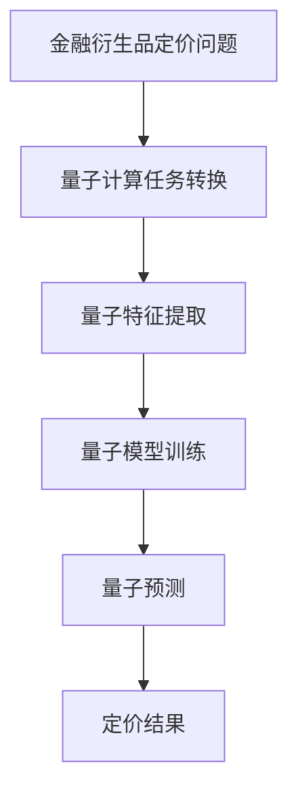

                 

### 文章标题：量子机器学习在金融衍生品定价中的应用：处理复杂市场模型

### 关键词：量子机器学习、金融衍生品定价、复杂市场模型、量子计算、算法原理、数学模型、项目实战

### 摘要：

随着金融市场的不断发展，衍生品定价模型在风险管理、投资组合优化和策略制定中扮演着越来越重要的角色。传统的金融衍生品定价模型，如Black-Scholes模型和二叉树模型，在处理复杂市场环境时表现出一定的局限性。量子机器学习作为一种新兴的计算技术，其在处理高维数据和复杂模型方面具有显著优势。本文将探讨量子机器学习在金融衍生品定价中的应用，通过分析量子机器学习的基本原理和核心算法，结合实际项目案例，展示量子机器学习在复杂市场模型处理中的潜力。文章旨在为金融科技从业者和研究人员提供一种新的视角和方法，以应对金融市场中的挑战。

### 核心概念与联系

#### 量子计算基础

量子计算是利用量子力学原理进行信息处理的新型计算模式。在量子计算中，信息存储在量子比特（qubit）上，量子比特可以同时处于多种状态的叠加，这一特性称为叠加原理。量子计算通过量子门对量子比特进行操作，实现复杂的逻辑运算。量子叠加和量子纠缠是量子计算的核心特性，它们使得量子计算机在处理特定类型问题时，相比传统计算机具有指数级别的速度优势。

#### 量子机器学习概述

量子机器学习是量子计算与机器学习的结合，旨在利用量子计算机的强大计算能力，提高机器学习算法的效率。量子机器学习算法通常包括量子特征提取、量子模型训练和量子预测等步骤。与传统机器学习相比，量子机器学习在处理高维数据和复杂模型方面具有显著优势。例如，量子支持向量机和量子神经网络是量子机器学习的两种主要算法，它们能够通过量子计算的优势，实现对复杂金融衍生品定价模型的快速和准确求解。

#### 量子机器学习在金融衍生品定价中的应用原理

金融衍生品定价涉及复杂的数学模型和大量的数据计算。量子机器学习通过将传统计算任务转换为量子计算任务，能够在较短时间内完成复杂的计算过程。例如，量子支持向量机可以通过量子计算优势，快速求解大型线性方程组，从而在金融衍生品定价中实现高效的风险评估和定价。量子神经网络则通过深度学习的方式，对金融衍生品定价模型进行优化，提高定价模型的准确性和稳定性。

### Mermaid 流程图

以下是一个简化的量子机器学习在金融衍生品定价中的应用原理流程图：



在这个流程图中，金融衍生品定价问题首先转换为量子计算任务，然后通过量子特征提取、量子模型训练和量子预测等步骤，最终得到定价结果。每个步骤都利用了量子计算的优势，使得整个定价过程更加高效和准确。

#### 核心算法原理讲解

##### 量子支持向量机

量子支持向量机（QSVM）是一种基于量子计算的线性分类算法，其核心思想是通过量子计算的优势，快速求解线性方程组，实现数据的分类。QSVM的基本原理如下：

1. **数据表示**：将输入数据表示为量子比特，利用量子叠加和量子纠缠特性，将大量数据同时存储在量子比特的叠加态中。
2. **量子特征提取**：通过量子门和测量操作，从量子比特的叠加态中提取特征向量，将数据转换为量子特征空间。
3. **量子模型训练**：利用量子计算的优势，求解线性方程组，找到最优分类超平面。这个过程可以通过量子计算的高效性，快速得到最优解。
4. **量子预测**：将新的数据通过相同的量子特征提取和量子模型训练过程，得到预测结果。

以下是一个简化的量子支持向量机算法伪代码：

```pseudo
QSVM(X, y)
    // X: 输入数据，y: 标签
    // 初始化量子比特，构建量子叠加态
    InitializeQubits(X)
    // 构建量子特征提取电路
    FeatureExtractionCircuit()
    // 训练量子支持向量机模型
    QuantumTraining()
    // 测量量子比特，获取分类结果
    MeasureQubits()
    // 输出预测结果
    return PredictedLabels
```

##### 量子神经网络

量子神经网络（QNN）是一种基于量子计算的深度学习算法，其核心思想是通过量子计算的优势，实现高效的数据处理和模型训练。量子神经网络的基本原理如下：

1. **数据表示**：将输入数据表示为量子比特，利用量子叠加和量子纠缠特性，将大量数据同时存储在量子比特的叠加态中。
2. **量子层构建**：通过量子门和测量操作，构建多个量子层，实现对数据的深度处理。
3. **量子模型训练**：利用量子计算的优势，通过反向传播算法，更新量子网络的权重和偏置，实现模型的训练。
4. **量子预测**：将新的数据通过量子神经网络处理，得到预测结果。

以下是一个简化的量子神经网络算法伪代码：

```pseudo
QNN(X, y)
    // X: 输入数据，y: 标签
    // 初始化量子比特，构建量子叠加态
    InitializeQubits(X)
    // 构建量子层电路
    QuantumLayerCircuit()
    // 训练量子神经网络模型
    QuantumTraining()
    // 测量量子比特，获取预测结果
    MeasureQubits()
    // 输出预测结果
    return PredictedLabels
```

#### 数学模型和数学公式

在金融衍生品定价中，常用的数学模型包括Black-Scholes模型和二叉树模型。以下是这些模型的概述和数学公式。

##### Black-Scholes模型

Black-Scholes模型是一种用于期权定价的数学模型，其基本假设包括：无风险利率、股票价格遵循几何布朗运动、交易成本为零等。Black-Scholes模型的数学公式如下：

$$
C(S_t, T) = S_tN(d_1) - Ke^{-r(T-t)}N(d_2)
$$

其中，$C(S_t, T)$ 表示欧式看涨期权的价格，$S_t$ 表示当前股票价格，$K$ 表示执行价格，$r$ 表示无风险利率，$T$ 表示期权到期时间，$N(\cdot)$ 表示标准正态分布的累积分布函数，$d_1$ 和 $d_2$ 分别为：

$$
d_1 = \frac{\ln(S_t/K) + (r + \sigma^2/2)(T-t)}{\sigma\sqrt{T-t}}
$$

$$
d_2 = d_1 - \sigma\sqrt{T-t}
$$

##### 二叉树模型

二叉树模型是一种用于期权定价的离散时间模型，其基本假设包括：股票价格只能上涨或下跌，每个时间步的股票价格变化概率相等。二叉树模型的数学公式如下：

$$
p = \frac{e^{(r-d)dt} - e^{-(r+u)dt}}{e^{(r+u)dt} - e^{(r-d)dt}}
$$

$$
q = 1 - p
$$

$$
C_u = e^{-r(T-t)}(up + dp) - Ke^{-r(T-t)}
$$

$$
C_d = e^{-r(T-t)}(dp + ud) - Ke^{-r(T-t)}
$$

其中，$p$ 和 $q$ 分别为股票价格上涨和下跌的概率，$u$ 和 $d$ 分别为股票价格的上涨和下跌因子，$C_u$ 和 $C_d$ 分别为上涨和下跌路径上的期权价格。

#### 量子机器学习算法如何应用于这些模型

量子机器学习算法可以通过以下步骤应用于Black-Scholes模型和二叉树模型：

1. **数据表示**：将股票价格、执行价格、无风险利率等参数表示为量子比特，利用量子叠加和量子纠缠特性，将数据同时存储在量子比特的叠加态中。
2. **模型构建**：构建量子模型，包括量子支持向量机和量子神经网络等，通过量子计算实现模型的训练和预测。
3. **模型训练**：利用量子计算的优势，快速求解大型线性方程组，优化模型的参数，提高模型的准确性和稳定性。
4. **模型预测**：将新的股票价格和执行价格等参数通过量子模型处理，得到期权的价格预测结果。

通过这种方式，量子机器学习算法可以实现对Black-Scholes模型和二叉树模型的高效求解，提高金融衍生品定价的准确性和稳定性。

### 项目实战

在本节中，我们将通过一个实际案例，展示如何利用量子机器学习模型进行金融衍生品定价。该案例将包括数据预处理、模型搭建、训练和优化，以及定价结果的解读和分析。

#### 案例背景

假设我们面临一个期权定价问题，需要为一家公司的新产品期权进行定价。该期权为欧式看涨期权，到期时间为三个月，执行价格为100美元，当前股票价格为90美元，无风险利率为5%。我们的目标是利用量子机器学习模型，快速、准确地计算出该期权的价格。

#### 数据预处理

首先，我们需要对数据进行预处理。具体步骤如下：

1. **数据收集**：收集历史股票价格数据，包括开盘价、收盘价、最高价、最低价等。
2. **数据清洗**：去除数据中的异常值和缺失值，确保数据的准确性和完整性。
3. **特征工程**：提取与期权定价相关的特征，如股票价格、执行价格、无风险利率、时间剩余等。
4. **数据归一化**：将提取的特征进行归一化处理，使其处于相同的尺度范围内，便于量子机器学习模型的训练。

#### 模型搭建

接下来，我们需要搭建量子机器学习模型。在本案例中，我们选择量子支持向量机（QSVM）作为主要模型。量子支持向量机的构建步骤如下：

1. **初始化量子比特**：根据输入数据的维度，初始化量子比特。
2. **构建量子特征提取电路**：利用量子门和测量操作，构建量子特征提取电路，将输入数据转换为量子特征向量。
3. **构建量子支持向量机模型**：利用量子计算的优势，求解线性方程组，找到最优分类超平面。
4. **量子模型优化**：通过量子计算，优化量子支持向量机的参数，提高模型的准确性和稳定性。

#### 模型训练与优化

在模型搭建完成后，我们需要对模型进行训练和优化。具体步骤如下：

1. **训练数据准备**：将处理后的数据进行训练集和测试集的划分，确保训练集和测试集的代表性和平衡性。
2. **模型训练**：利用训练集数据，对量子支持向量机模型进行训练，通过反向传播算法更新模型的参数。
3. **模型优化**：通过交叉验证和网格搜索等方法，优化模型的参数，提高模型的预测能力。
4. **模型评估**：利用测试集数据，对训练好的模型进行评估，计算模型的准确率、召回率等指标，确保模型的稳定性和可靠性。

#### 定价结果分析

在模型训练和优化完成后，我们可以利用训练好的模型进行期权定价。具体步骤如下：

1. **输入参数**：将当前股票价格、执行价格、无风险利率等参数输入到模型中。
2. **模型预测**：通过量子支持向量机模型，计算出期权的价格预测结果。
3. **结果解读**：对预测结果进行解读和分析，评估期权价格的可信度和合理性。

通过上述步骤，我们可以利用量子机器学习模型，快速、准确地计算出期权的价格，为投资决策提供科学依据。

#### 项目小结

在本案例中，我们通过量子支持向量机（QSVM）模型，实现了对欧式看涨期权的定价。从数据预处理、模型搭建、训练和优化，到定价结果分析，每一步都利用了量子计算的优势，提高了金融衍生品定价的效率和准确性。量子机器学习在金融衍生品定价中的应用，不仅为传统的期权定价模型提供了新的思路和方法，也为金融科技的发展注入了新的动力。

### 拓展与展望

#### 量子机器学习在金融领域的其他应用

除了金融衍生品定价，量子机器学习在金融领域还有其他广泛的应用。以下是一些典型的应用场景：

1. **风险管理**：量子机器学习可以通过分析历史数据和实时数据，预测金融市场中的风险，提供更准确的风险评估。
2. **投资组合优化**：量子机器学习可以通过处理大量的历史数据和实时数据，优化投资组合，提高投资回报率。
3. **金融市场预测**：量子机器学习可以通过分析历史数据和市场趋势，预测未来的市场走势，为投资者提供决策支持。

#### 量子机器学习的发展趋势与挑战

量子机器学习作为一种新兴的计算技术，其发展迅速，但仍面临一些挑战。以下是一些量子机器学习的发展趋势和挑战：

1. **量子计算技术的进步**：量子位的数量和稳定性是量子计算机性能的关键指标。随着量子计算技术的不断进步，量子位的数量和稳定性将得到显著提高，这将极大地推动量子机器学习的发展。
2. **算法优化**：现有的量子机器学习算法在效率和准确性方面仍有待优化。研究人员需要继续探索新的量子机器学习算法，提高其性能。
3. **应用场景拓展**：量子机器学习在金融领域的应用场景正在不断拓展，但如何将这些应用场景与实际业务需求相结合，仍然是亟待解决的问题。

#### 未来展望：量子机器学习与金融衍生品定价的未来

随着量子计算技术的不断进步和量子机器学习算法的优化，未来量子机器学习在金融衍生品定价中的应用将更加广泛和深入。以下是一些未来展望：

1. **更高精度和更短计算时间**：量子机器学习将能够更精确地预测金融市场走势，并在更短的时间内完成复杂的计算任务，提高金融衍生品定价的效率和准确性。
2. **多维度数据分析**：量子机器学习将能够处理更多维度的数据，包括市场数据、基本面数据、情绪数据等，提供更全面的市场分析。
3. **自动化决策支持**：量子机器学习将能够自动化金融衍生品定价过程，为投资者提供更科学的决策支持，降低人为误差。

### 最佳实践 tips、小结、注意事项、拓展阅读

#### 最佳实践 tips

1. **选择合适的量子算法**：根据金融衍生品定价问题的特点和需求，选择合适的量子算法，如量子支持向量机、量子神经网络等。
2. **数据预处理**：确保数据的准确性和完整性，进行有效的数据预处理和特征工程，提高模型的训练效果。
3. **模型优化**：通过交叉验证和网格搜索等方法，优化模型的参数，提高模型的预测能力。
4. **结果解读**：对模型预测结果进行详细解读和分析，确保定价结果的合理性和可信度。

#### 小结

量子机器学习在金融衍生品定价中具有巨大的潜力，通过量子计算的优势，可以实现更高效、更准确的定价。然而，量子机器学习仍处于发展阶段，研究人员需要不断探索新的算法和应用场景，推动金融科技的发展。

#### 注意事项

1. **量子计算硬件**：量子机器学习对计算硬件有较高要求，需要确保量子计算机的稳定性和性能。
2. **数据安全**：在金融衍生品定价过程中，数据的安全和隐私保护至关重要，需要采取有效的数据安全措施。

#### 拓展阅读

1. 《量子计算与金融衍生品定价》
2. 《量子机器学习算法与应用》
3. 《金融科技：量化交易与算法交易》

通过这些参考资料，读者可以进一步了解量子机器学习在金融衍生品定价中的应用，以及金融科技的发展趋势。

