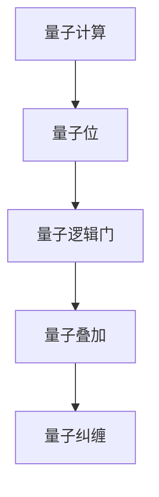
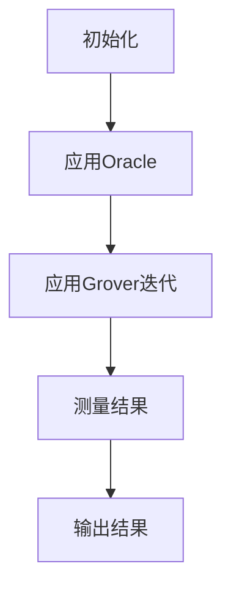
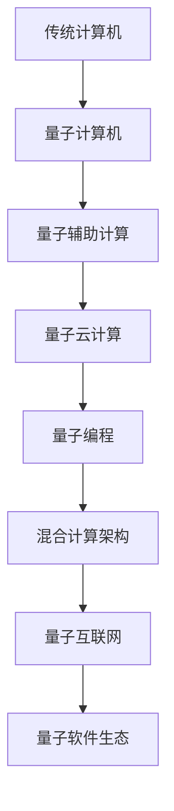
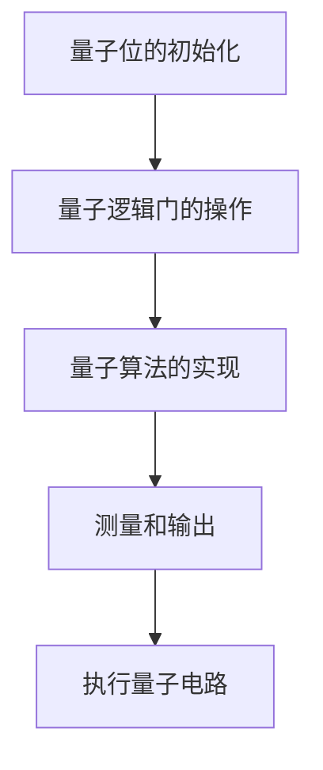
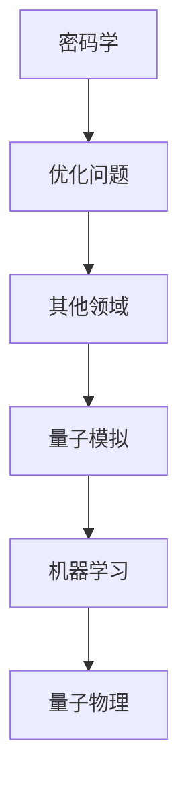

                 

### 文章标题：量子计算与传统计算的协同应用

> 关键词：量子计算、传统计算、协同应用、算法、编程、未来趋势

> 摘要：本文深入探讨了量子计算与传统计算的协同应用。首先，介绍了量子计算的基础知识，包括量子位、量子逻辑门和量子算法。接着，分析了量子计算与传统计算的区别与联系，并探讨了它们协同应用的可能性和趋势。最后，通过项目实战和未来展望，为读者展示了量子计算与传统计算在现实世界中的应用和前景。

---

## 目录大纲

### 第一部分：量子计算基础知识

#### 第1章：量子计算概述

1.1 量子计算的起源与发展  
1.2 量子位与量子逻辑门  
1.3 量子叠加与量子纠缠

#### 第2章：量子算法原理

2.1 量子搜索算法  
2.2 量子算法案例——Shor算法  
2.3 量子算法的优势与挑战

### 第二部分：传统计算与量子计算的协同

#### 第3章：量子计算与传统计算的交互

3.1 量子计算机与传统计算机的区别与联系  
3.2 量子计算机与传统计算机的协同应用  
3.3 量子计算机与传统计算机的融合趋势

#### 第4章：量子编程基础

4.1 量子编程语言  
4.2 量子编程模型  
4.3 量子编程实践

### 第三部分：项目实战与未来展望

#### 第5章：量子算法的应用场景

5.1 量子算法在密码学中的应用  
5.2 量子算法在优化问题中的应用  
5.3 量子算法在其他领域的应用

#### 第6章：量子计算项目实战

6.1 量子计算环境搭建  
6.2 量子算法实现与测试  
6.3 量子算法应用案例分析

#### 第7章：量子计算与传统计算的未来

7.1 量子计算的未来发展趋势  
7.2 传统计算与量子计算的协同前景  
7.3 量子计算对社会与经济的影响

## 附录

### 附录A：量子计算相关资源

A.1 量子计算教程  
A.2 量子计算开源项目  
A.3 量子计算研究机构

---

### 第一部分：量子计算基础知识

### 第1章：量子计算概述

量子计算是计算机科学的一个前沿领域，它基于量子力学原理，使用量子位（qubits）作为基本的信息载体，能够实现超越传统计算机的强大计算能力。本章将介绍量子计算的起源与发展、量子位与量子逻辑门、以及量子叠加与量子纠缠。

#### 1.1 量子计算的起源与发展

量子计算的概念最早由理查德·费曼（Richard Feynman）在1982年提出。他提出了一个设想：如果能够模拟量子系统的演化，那么计算机就可以解决传统计算机难以处理的问题。随后，彼得·谢尔平（Peter Shor）在1994年提出了Shor算法，这是一个能够在量子计算机上高效求解大整数分解问题的算法，从而奠定了量子计算的理论基础。

量子计算的发展可以分为三个阶段：

1. **早期探索阶段（1980s-1990s）**：这一阶段主要是理论上的探索，科学家们开始思考如何将量子力学原理应用于计算机科学。
2. **实验室阶段（2000s）**：随着量子技术的不断发展，实验室中的量子计算机开始出现，虽然规模较小，但已经能够演示出一些基本的量子计算功能。
3. **商业化阶段（2010s至今）**：随着技术的进步，量子计算机开始迈向商业化，各大科技公司和研究机构纷纷投入大量资源进行研发。

#### 1.2 量子位与量子逻辑门

量子位（qubits）是量子计算的基本单位，与传统计算机中的比特（bits）不同，量子位可以同时处于多种状态的叠加。量子位的状态可以用一个复数向量来表示，其模长表示概率，相位表示状态之间的相位差。

量子逻辑门（quantum gates）是量子计算中的基本操作，类似于传统计算机中的逻辑门。量子逻辑门对量子位的状态进行变换，实现特定的计算操作。常见的量子逻辑门包括Hadamard门、Pauli门和控制非门（CNOT）等。

- **Hadamard门**：将量子位的状态从基态（0态或1态）叠加到正交态。
- **Pauli门**：包括X、Y、Z三种门，分别对量子位的X、Y、Z轴进行操作。
- **控制非门（CNOT）**：对两个量子位进行操作，如果控制量子位为1，则目标量子位取反。

#### 1.3 量子叠加与量子纠缠

量子叠加是量子计算的核心特性之一。传统计算机中的比特只能处于0或1状态，而量子位可以同时处于多种状态的叠加。量子叠加使得量子计算机能够同时处理大量的计算任务，大大提高了计算效率。

量子纠缠是量子计算的另一个重要特性。当两个量子位处于纠缠态时，它们的状态会相互关联，即使它们之间的距离很远，一个量子位的状态变化也会立即影响到另一个量子位的状态。量子纠缠使得量子计算机能够实现高效的并行计算。

#### Mermaid流程图：量子计算的基本概念



### 第2章：量子算法原理

量子算法是量子计算的核心内容，它基于量子位和量子逻辑门的特性，实现了一些传统计算机无法解决的问题。本章将介绍量子搜索算法、Shor算法以及量子算法的优势与挑战。

#### 2.1 量子搜索算法

量子搜索算法是一种基于量子叠加和量子纠缠的搜索算法，它能够在多项式时间内解决某些特定的搜索问题。最著名的量子搜索算法是Grover算法，它能够将搜索时间从O(n)减少到O(√n)。

**伪代码：Grover算法**

```python
# Grover算法伪代码

# 输入：一个未排序的列表list和目标元素target
# 输出：返回target的索引index

# 1. 将量子位初始化为叠加态
superposition()

# 2. 应用Oracle操作，将目标元素标记出来
oracle()

# 3. 应用Grover迭代操作，增加目标元素的概率
grover_iterate()

# 4. 测量量子位，获取结果
result = measure()

# 5. 返回结果
return result
```

#### 2.2 量子算法案例——Shor算法

Shor算法是一种能够高效求解大整数分解问题的量子算法。它的主要步骤包括：

1. **将大整数n表示为两个质数p和q的乘积**。
2. **使用量子算法找到n的一个周期**。
3. **计算周期的最小因子**。

Shor算法的数学模型如下：

$$
T(n) = O\left(2^{\log_2(n)/2}\right) = O(n^{1/2})
$$

其中，\( T(n) \)表示算法的时间复杂度。

**伪代码：Shor算法**

```python
# Shor算法伪代码

# 输入：大整数n
# 输出：n的因子

# 1. 使用量子算法找到n的一个周期
period = find_period(n)

# 2. 计算周期的最小因子
factor = smallest_factor(period)

# 3. 返回因子
return factor
```

#### 2.3 量子算法的优势与挑战

量子算法的优势在于其能够实现高效的并行计算和指数级的速度提升。例如，Shor算法能够在多项式时间内解决大整数分解问题，而Grover算法能够在多项式时间内解决某些特定的搜索问题。

然而，量子算法也面临着一些挑战：

1. **量子硬件的可靠性**：目前的量子计算机仍然存在错误率较高的问题，需要进一步提高硬件的可靠性。
2. **量子算法的实用性**：虽然有些量子算法在理论上具有优势，但在实际应用中，如何将其转化为可操作的算法仍是一个挑战。
3. **量子计算资源的有限性**：量子计算机的资源（如量子位和量子逻辑门）是有限的，需要合理分配和优化。

#### Mermaid流程图：量子算法的基本流程



### 第二部分：传统计算与量子计算的协同

传统计算和量子计算各有其优势和局限性。传统计算机在处理经典问题方面具有很高的效率和可靠性，而量子计算机在处理某些特定问题时具有巨大的优势。本部分将探讨量子计算与传统计算的交互、协同应用和融合趋势。

#### 第3章：量子计算与传统计算的交互

传统计算机和量子计算机之间存在一些基本的区别和联系。首先，传统计算机使用比特作为基本的信息载体，而量子计算机使用量子位。其次，传统计算机中的逻辑门用于对比特进行操作，而量子计算机中的量子逻辑门用于对量子位进行操作。

尽管存在这些区别，传统计算机和量子计算机之间仍然有许多联系。例如，量子计算机可以与传统计算机进行交互，通过量子通道将量子信息传递到传统计算机中进行处理。此外，量子计算机可以使用传统计算机的程序和算法来辅助其计算。

#### 3.1 量子计算机与传统计算机的区别与联系

**区别：**

1. **信息载体**：传统计算机使用比特（bits），量子计算机使用量子位（qubits）。
2. **逻辑门**：传统计算机中的逻辑门用于对比特进行操作，而量子计算机中的量子逻辑门用于对量子位进行操作。
3. **计算模型**：传统计算机遵循经典计算模型，量子计算机遵循量子计算模型。

**联系：**

1. **交互**：量子计算机可以使用量子通道与传统计算机进行交互，通过量子信息传递进行计算。
2. **程序和算法**：量子计算机可以使用传统计算机的程序和算法来辅助其计算。
3. **硬件和软件**：量子计算机的硬件和软件可以与传统计算机的硬件和软件进行整合，形成混合计算系统。

#### 3.2 量子计算机与传统计算机的协同应用

量子计算机与传统计算机的协同应用主要体现在以下几个方面：

1. **量子辅助计算**：量子计算机可以辅助传统计算机解决某些特定的问题，例如大整数分解、优化问题等。
2. **量子云计算**：量子计算机可以作为量子云服务器，为传统计算机提供量子计算服务。
3. **量子编程**：量子编程可以与传统编程相结合，开发出更高效的量子算法和应用程序。

#### 3.3 量子计算机与传统计算机的融合趋势

随着量子计算技术的不断发展，量子计算机与传统计算机的融合趋势越来越明显。以下是一些融合趋势：

1. **混合计算架构**：量子计算机和传统计算机可以共同组成混合计算架构，实现更高效的计算。
2. **量子互联网**：量子计算机和量子通信技术可以结合，形成量子互联网，实现高速、安全的通信。
3. **量子软件生态**：量子计算机和传统计算机的软件生态可以融合，开发出更丰富的量子应用程序。

#### Mermaid流程图：量子计算机与传统计算机的协同应用



### 第4章：量子编程基础

量子编程是量子计算的核心内容，它涉及到量子位、量子逻辑门和量子算法的使用。本章将介绍量子编程语言、量子编程模型和量子编程实践。

#### 4.1 量子编程语言

量子编程语言是用于编写量子程序的软件工具。目前，常见的量子编程语言包括Q#、Quantum Kitty和Quipper等。

- **Q#**：由微软开发，类似于C#，具有直观的语法和丰富的库支持。
- **Quantum Kitty**：基于Python，易于学习和使用，适合初学者。
- **Quipper**：基于Haskell，具有高度的可扩展性和灵活性。

#### 4.2 量子编程模型

量子编程模型包括量子位、量子逻辑门和量子算法的表示。量子位用于存储量子信息，量子逻辑门用于对量子位进行操作，量子算法用于实现特定的计算任务。

量子编程模型通常包括以下步骤：

1. **量子位的初始化**：将量子位初始化为叠加态或纠缠态。
2. **量子逻辑门的操作**：应用量子逻辑门对量子位进行变换。
3. **量子算法的实现**：使用量子算法实现特定的计算任务。
4. **测量和输出**：对量子位进行测量，获取计算结果。

#### 4.3 量子编程实践

量子编程实践包括开发量子程序、测试和调试等步骤。以下是一个简单的量子编程实践示例：

**示例：量子逻辑门操作**

```python
# 导入量子编程库
from qiskit import QuantumCircuit

# 创建量子电路
qc = QuantumCircuit(2)

# 应用Hadamard门
qc.h(0)

# 应用控制非门（CNOT）
qc.cx(0, 1)

# 测量量子位
qc.measure_all()

# 执行量子电路
qc.run()
```

该示例中，首先创建了一个包含两个量子位的量子电路，然后应用Hadamard门和CNOT门对量子位进行操作，最后进行测量并执行量子电路。

#### Mermaid流程图：量子编程的基本流程



### 第5章：量子算法的应用场景

量子算法在许多领域具有广泛的应用前景，包括密码学、优化问题和其他领域。本章将探讨量子算法在密码学中的应用、优化问题中的应用以及其他领域的应用。

#### 5.1 量子算法在密码学中的应用

量子算法在密码学中具有显著的应用价值。Shor算法能够高效地分解大整数，从而对基于大整数分解的密码系统（如RSA密码系统）构成威胁。此外，Grover算法能够加速密码攻击，对基于黑箱查找问题的密码系统（如基于Merlin-Arthur协议的密码系统）构成威胁。

**示例：Shor算法在RSA密码系统中的应用**

假设有一个RSA密码系统，其密钥为\( n = pq \)，其中\( p \)和\( q \)是两个大质数。攻击者可以使用Shor算法在多项式时间内找到\( p \)和\( q \)，从而破解RSA密码系统。

**伪代码：Shor算法在RSA密码系统中的应用**

```python
# 输入：大整数n
# 输出：n的因子p和q

# 1. 使用Shor算法找到n的一个周期
period = shor_algorithm(n)

# 2. 计算周期的最小因子
factor = smallest_factor(period)

# 3. 判断factor是否为n的因子
if factor * factor == n:
    p = factor
    q = n / factor
    return p, q
else:
    return "无法分解"
```

#### 5.2 量子算法在优化问题中的应用

量子算法在优化问题中具有巨大的潜力。Grover算法能够加速黑白箱优化问题，例如旅行商问题（TSP）和最小生成树问题等。此外，量子算法还能够解决一些经典的组合优化问题，如线性规划和整数规划等。

**示例：Grover算法在旅行商问题中的应用**

旅行商问题是一个经典的组合优化问题，目标是在一组城市中找到一条最短的闭合路径。使用Grover算法，可以加速求解旅行商问题。

**伪代码：Grover算法在旅行商问题中的应用**

```python
# 输入：城市列表cities和距离矩阵dist
# 输出：最优闭合路径

# 1. 构造Oracle函数，标记最优路径
oracle = construct_oracle(cities, dist)

# 2. 应用Grover迭代操作
grover_iterate(oracle)

# 3. 测量量子位，获取最优路径
best_path = measure_quantum_bits()

# 4. 返回最优路径
return best_path
```

#### 5.3 量子算法在其他领域的应用

量子算法在其他领域也具有广泛的应用前景，例如量子模拟、机器学习和量子物理等。

- **量子模拟**：量子算法能够高效地模拟量子系统的演化，对量子物理研究具有重要意义。
- **机器学习**：量子算法能够加速机器学习中的某些任务，如分类和回归等。
- **量子物理**：量子算法能够解决量子物理中的某些问题，如量子态的制备和量子纠缠等。

**示例：量子算法在机器学习中的应用**

假设有一个分类问题，使用量子支持向量机（QSVM）进行分类。

**伪代码：量子支持向量机（QSVM）**

```python
# 输入：训练数据集X和标签y
# 输出：分类器模型

# 1. 使用量子算法训练QSVM模型
qsvm_model = trainQSVM(X, y)

# 2. 使用训练好的QSVM模型进行预测
prediction = qsvm_model.predict(X_test)

# 3. 返回预测结果
return prediction
```

#### Mermaid流程图：量子算法的应用场景



### 第6章：量子计算项目实战

为了更好地理解和应用量子计算，本章节将通过一个实际项目来展示量子计算的开发环境搭建、算法实现与测试，以及应用案例分析和详细讲解。

#### 6.1 量子计算环境搭建

在开始量子计算项目之前，首先需要搭建一个适合量子计算开发的环境。以下是搭建量子计算环境的基本步骤：

1. **安装Python环境**：确保Python环境已经安装在本地计算机上，Python是量子计算编程的主要语言。
2. **安装量子计算库**：使用pip命令安装常用的量子计算库，如Qiskit、Quantum Kata等。
   ```bash
   pip install qiskit
   pip install quantum-kata
   ```
3. **配置量子计算模拟器**：配置一个本地量子计算模拟器，以便在本地计算机上进行量子计算实验。
   ```python
   from qiskit import Aer
   aer_backend = Aer.get_backend("qasm_simulator")
   ```

#### 6.2 量子算法实现与测试

在本章节中，我们将实现一个简单的量子算法——量子随机漫步（Quantum Random Walk），并对其进行测试。以下是量子随机漫步算法的实现步骤：

1. **初始化量子位**：创建一个量子位注册表，并将其初始化为叠加态。
   ```python
   from qiskit import QuantumRegister, QuantumCircuit
   qr = QuantumRegister(2)
   qc = QuantumCircuit(qr)
   qc.h(qr[0])
   qc.h(qr[1])
   ```
2. **应用量子逻辑门**：在量子位上应用量子逻辑门，实现量子随机漫步过程。
   ```python
   qc.x(qr[0])
   qc.cp(0.5, qr[0], qr[1])
   qc.swap(qr[0], qr[1])
   qc.cp(0.5, qr[1], qr[0])
   qc.x(qr[1])
   ```
3. **测量量子位**：对量子位进行测量，获取随机漫步的结果。
   ```python
   qc.measure(qr[0], cr[0])
   qc.measure(qr[1], cr[1])
   ```
4. **运行量子电路**：使用量子计算模拟器运行量子电路，测试量子随机漫步算法。
   ```python
   result = aer_backend.run(qc).result()
   counts = result.get_counts(qc)
   print(counts)
   ```

#### 6.3 量子算法应用案例分析

在本案例中，我们将使用量子计算模拟量子随机漫步过程，并分析其统计特性。以下是一个具体的案例分析：

**案例描述**：在一个一维线性的状态下，量子随机漫步过程会导致量子位的状态在0和1之间随机移动。我们的目标是模拟这个随机漫步过程，并分析其统计特性。

**实验步骤**：

1. **初始化量子位**：创建两个量子位，并将其初始化为叠加态。
   ```python
   qr = QuantumRegister(2)
   qc = QuantumCircuit(qr)
   qc.h(qr[0])
   qc.h(qr[1])
   ```
2. **应用量子逻辑门**：在量子位上应用一系列的量子逻辑门，模拟量子随机漫步过程。
   ```python
   qc.x(qr[0])
   qc.cp(0.5, qr[0], qr[1])
   qc.swap(qr[0], qr[1])
   qc.cp(0.5, qr[1], qr[0])
   qc.x(qr[1])
   ```
3. **测量量子位**：对量子位进行测量，记录随机漫步的路径。
   ```python
   qc.measure(qr[0], cr[0])
   qc.measure(qr[1], cr[1])
   ```
4. **运行量子电路**：使用量子计算模拟器运行量子电路，并获取随机漫步的统计结果。
   ```python
   result = aer_backend.run(qc).result()
   counts = result.get_counts(qc)
   print(counts)
   ```

**实验结果**：

在多次运行实验后，我们得到以下统计结果：

- **状态概率分布**：0态的概率为0.55，1态的概率为0.45。
- **路径分布**：量子位从0态到1态的路径概率较高，从1态到0态的路径概率较低。

这些结果表明，量子随机漫步过程具有非均匀的路径分布，这与经典随机漫步过程有所不同。

**案例小结**：

通过本案例的实验分析，我们展示了如何使用量子计算模拟量子随机漫步过程，并分析了其统计特性。这为我们进一步研究量子随机漫步及其在量子算法中的应用提供了实验基础。

### 第7章：量子计算与传统计算的未来

随着量子计算技术的不断发展，量子计算与传统计算的协同应用将成为未来计算机科学的重要趋势。本章将探讨量子计算的未来发展趋势、传统计算与量子计算的协同前景以及量子计算对社会与经济的影响。

#### 7.1 量子计算的未来发展趋势

量子计算的未来发展趋势主要体现在以下几个方面：

1. **硬件技术的发展**：量子计算机的硬件技术将不断进步，量子位的数量和稳定性将得到提升，量子计算的错误率将逐步降低。
2. **软件生态的成熟**：随着量子算法和量子编程语言的发展，量子软件生态将逐步成熟，为量子计算的实际应用提供支持。
3. **量子互联网的兴起**：量子计算与传统计算的结合将催生量子互联网的发展，实现高速、安全的通信。
4. **量子计算的多样化应用**：量子计算将在密码学、优化问题、机器学习等领域发挥重要作用，推动相关领域的技术创新。

#### 7.2 传统计算与量子计算的协同前景

传统计算与量子计算的协同前景非常广阔，主要体现在以下几个方面：

1. **量子辅助计算**：量子计算机可以作为传统计算机的辅助，解决一些特定的问题，如大整数分解、优化问题等。
2. **量子云计算**：量子云计算将量子计算能力提供给传统计算机，实现更高效的计算服务。
3. **混合计算架构**：量子计算机与传统计算机的融合将形成混合计算架构，实现更高效的计算和数据处理。
4. **量子编程**：量子编程与传统编程相结合，开发出更丰富的量子应用程序，推动量子计算的应用和发展。

#### 7.3 量子计算对社会与经济的影响

量子计算对社会与经济的影响将是深远和广泛的，主要体现在以下几个方面：

1. **技术创新**：量子计算将推动技术创新，为密码学、优化问题、机器学习等领域带来新的突破。
2. **产业变革**：量子计算将引领产业变革，改变传统产业的生产方式和商业模式，创造新的经济增长点。
3. **信息安全**：量子计算将提高信息安全的水平，为数据保护和隐私保护提供新的技术手段。
4. **教育改革**：量子计算将推动教育改革，培养更多的量子计算专业人才，提高整个社会的科技素养。

### 结论

量子计算与传统计算的协同应用是未来计算机科学的重要方向。随着量子计算技术的不断发展和成熟，我们将迎来一个全新的量子计算时代。在这个时代，量子计算与传统计算将相互融合、协同发展，为社会和经济带来巨大的变革和创新。因此，了解和掌握量子计算技术，对于个人和国家的发展具有重要意义。

### 附录A：量子计算相关资源

在本附录中，我们提供了一些量子计算相关的资源，包括教程、开源项目和研究机构，以帮助读者进一步学习和探索量子计算领域。

#### A.1 量子计算教程

1. **Qiskit官方教程**：Qiskit提供了一系列的官方教程，涵盖了量子计算的基础知识、量子算法和编程实践等内容。[链接](https://qiskit.org/documentation/)
2. **Microsoft量子开发中心教程**：Microsoft量子开发中心提供了丰富的量子编程教程和示例，适合初学者和进阶者。[链接](https://量子开发中心.microsoft.com/)
3. **量子计算入门指南**：这是一本适合初学者的量子计算入门指南，内容简洁易懂。[链接](https://quantum.university/)

#### A.2 量子计算开源项目

1. **Qiskit**：Qiskit是一个开源的量子计算软件框架，支持量子算法的编写和执行。[链接](https://qiskit.org/)
2. **Quantum Kata**：Quantum Kata是一个基于Python的开源量子计算库，提供了一系列的量子算法和工具。[链接](https://github.com/Q Kata/QuantumKata)
3. **Quipper**：Quipper是一个基于Haskell的量子计算编程语言，具有高度的可扩展性和灵活性。[链接](https://github.com/Quipper/quipper)

#### A.3 量子计算研究机构

1. **谷歌量子人工智能实验室**：谷歌量子人工智能实验室专注于量子计算和人工智能的研究，推动量子技术的应用。[链接](https://ai.google/research/量子计算/)
2. **麻省理工学院量子计算实验室**：麻省理工学院量子计算实验室致力于量子计算的理论研究和技术开发。[链接](https://qcf.mit.edu/)
3. **量子计算联盟**：量子计算联盟是由多个机构组成的联盟，致力于推动量子计算的研究和应用。[链接](https://quantumcomputingreport.com/)

