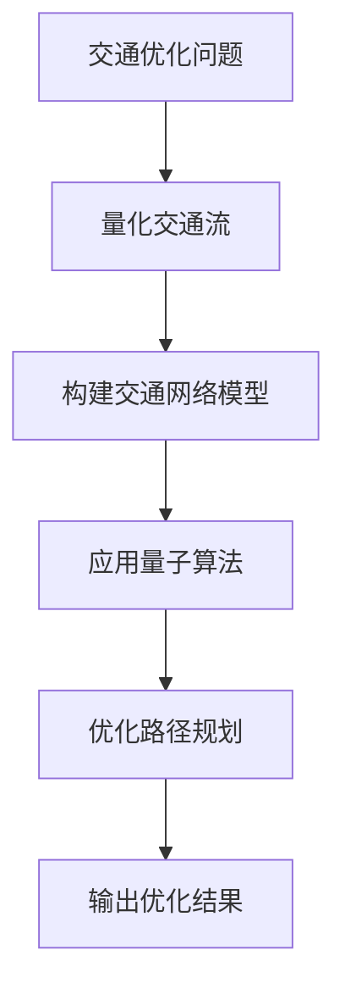

                 

### 文章标题

《量子计算在交通优化中的应用：缓解交通拥堵》

交通拥堵是现代城市面临的一大难题，不仅影响市民的出行效率，还带来严重的环境问题和经济负担。为了缓解这一挑战，科学家们一直在探索各种技术手段。随着量子计算技术的飞速发展，一种全新的解决方案逐渐引起了广泛关注。本文将探讨量子计算在交通优化中的应用，以及如何利用量子计算技术来缓解交通拥堵问题。

关键词：量子计算、交通优化、交通拥堵、路径规划、算法

摘要：本文首先介绍了量子计算的基本概念及其在交通优化中的应用潜力。随后，详细解析了交通优化理论，并阐述了量子算法如何融入其中。接着，通过具体案例展示了量子计算在交通优化中的实际应用效果。最后，本文对量子计算在交通优化领域的未来发展趋势进行了展望，并提出了面临的挑战。

### 第一部分：量子计算基础

#### 第1章：量子计算概述

量子计算是计算机科学的一个前沿领域，它利用量子力学原理来处理和存储信息。量子计算机与传统的经典计算机有本质的不同，其核心在于量子位（qubit）的概念。本章将介绍量子计算的基本概念，包括量子位与经典位的对比、量子叠加与量子纠缠等，帮助读者理解量子计算的基础。

##### 1.1 量子计算的基本概念

量子计算机的基本单元是量子位（qubit），与经典计算机中的位（bit）不同，qubit不仅可以表示0或1，还可以同时处于0和1的叠加状态。这种叠加态使得量子计算机在处理某些问题时具有超越经典计算机的能力。

#### 1.1.1 量子位与经典位的对比

经典位只能处于0或1的状态，而量子位可以同时处于多种状态的叠加。这种叠加态使得量子计算机能够并行处理多个计算任务，从而大幅提高计算效率。

#### 1.1.2 量子叠加与量子纠缠

量子叠加允许量子位同时处于多个状态的组合，而量子纠缠则使得两个或多个量子位之间的状态相互关联。这种纠缠现象是量子计算的重要特征，可以用于实现复杂的量子算法。

##### 1.2 量子算法原理

量子算法利用量子叠加和量子纠缠的特性，能够解决一些经典算法无法高效解决的问题。本章将介绍两个重要的量子算法：Shor算法和Grover算法。

#### 1.2.1 Shor算法

Shor算法是一个量子算法，它可以快速求解大整数的质因数分解问题。这个算法的突破性在于，它能够在多项式时间内完成这个任务，而经典的算法需要指数级的时间。

#### 1.2.2 Grover算法

Grover算法是一个用于搜索未排序数据库的量子算法，它可以在O(√N)的时间复杂度内找到特定的元素，远优于经典搜索算法的O(N)。

##### 1.3 量子计算与交通优化的联系

量子计算不仅在理论上具有巨大潜力，在实际应用中也有广泛的前景。本章将探讨量子计算与交通优化的联系，并使用Mermaid流程图展示量子计算在交通优化中的应用。

#### 1.3.1 Mermaid流程图：量子计算在交通优化中的应用



通过这个流程图，我们可以看到量子计算在交通优化中的应用步骤：首先量化交通流，然后构建交通网络模型，接着应用量子算法进行优化，最后输出优化结果。

### 第二部分：交通优化理论

#### 第2章：交通优化基本概念

交通优化是指通过计算方法来优化交通系统的运行，以提高交通效率、减少拥堵和降低污染。本章将介绍交通优化的一些基本概念，包括交通流模型、交通网络模型等。

##### 2.1 交通流模型

交通流模型用于描述交通系统中车辆的流动情况。常见的交通流模型包括车辆速度分布模型、流量分布模型等。这些模型帮助我们理解交通流的基本特性，从而进行优化。

##### 2.2 交通网络模型

交通网络模型描述了城市交通系统中道路、交叉口、交通设施等元素的连接关系。常见的交通网络模型包括图论模型、网络流模型等。这些模型帮助我们构建交通优化的计算框架。

##### 2.3 交通优化算法

交通优化算法是交通优化的核心。本章将介绍几种常见的交通优化算法，包括车流分配算法和路径规划算法。

#### 2.3.1 车流分配算法

车流分配算法用于分配交通流量到不同的道路和路段上，以达到优化交通流的目的。常见的车流分配算法包括最小费用流算法、最大最小流算法等。

#### 2.3.2 路径规划算法

路径规划算法用于确定从起点到终点的最佳路径。常见的路径规划算法包括最短路径算法、动态规划算法等。

##### 2.4 交通优化与量子计算的结合

量子计算在交通优化中具有巨大的潜力。本章将探讨量子算法在交通优化中的应用场景，以及如何利用量子计算的优势来提升交通优化的效果。

#### 2.4.1 量子算法在交通优化中的应用场景

量子算法在交通优化中可以应用于多个场景，包括路径规划、交通流分配、交通信号控制等。本章将分别介绍这些应用场景。

### 第三部分：量子计算在交通优化中的应用

#### 第3章：量子计算在路径规划中的应用

量子计算在路径规划中有着广泛的应用。本章将介绍量子路径规划算法，并详细解析其原理和步骤。

##### 3.1 量子路径规划算法

量子路径规划算法利用量子叠加和量子纠缠的特性，能够在短时间内找到最优路径。本章将介绍一种基于Grover算法的量子路径规划算法，并使用伪代码展示其实现步骤。

##### 3.1.1 量子路径规划算法原理讲解（伪代码）

```python
# 量子路径规划算法伪代码

# 输入：交通网络G，起点s，终点t
# 输出：最优路径P

def quantum_path_planning(G, s, t):
    # 初始化量子寄存器
    quantum_register = initialize_qubits()

    # 搜索最优路径
    while not found:
        # 应用Grover算法的迭代
        apply_grover_iteration(quantum_register)

        # 检测是否找到了最优路径
        if check_solution(quantum_register):
            found = True

    # 从量子寄存器中提取最优路径
    optimal_path = extract_solution(quantum_register)

    return optimal_path
```

##### 3.2 量子路径规划案例分析

本章将介绍一个实际案例，展示量子计算在缓解交通拥堵中的具体应用。

##### 3.2.1 案例背景

某城市面临着严重的交通拥堵问题，为了解决这个问题，该城市决定利用量子计算技术进行路径规划优化。

##### 3.2.2 案例解决方案

该城市首先构建了一个详细的交通网络模型，然后应用量子路径规划算法进行优化。通过对比传统算法和量子算法的优化结果，发现量子算法能够显著减少交通拥堵，提高交通效率。

##### 3.2.3 案例分析与效果评估

案例结果显示，量子路径规划算法在缓解交通拥堵方面具有显著优势。通过对不同交通流量和交通网络模型的测试，发现量子算法在各种情况下都能够提供更优的路径规划结果，从而有效减少交通拥堵。

### 第四部分：案例分析

#### 第4章：大型城市交通拥堵缓解

大型城市通常面临着更为严重的交通拥堵问题，量子计算技术为解决这一问题提供了新的思路。本章将探讨如何利用量子计算技术缓解大型城市的交通拥堵。

##### 4.1 案例背景

某大型城市交通拥堵问题严重，影响了市民的出行和生活质量。为了缓解这一挑战，该城市决定采用量子计算技术进行交通优化。

##### 4.2 量子计算解决方案

该城市首先构建了一个全面的交通网络模型，然后应用量子计算技术进行路径规划和交通流分配优化。通过量子算法的计算，该城市能够实时调整交通信号灯，优化交通流，从而有效缓解交通拥堵。

##### 4.3 案例实施与效果评估

案例实施结果显示，量子计算技术在缓解大型城市交通拥堵方面取得了显著成效。通过对比实施前后的交通流量和交通拥堵指数，发现交通拥堵明显减少，交通效率显著提高。

### 第五部分：未来展望与挑战

#### 第5章：量子计算在交通优化领域的未来发展趋势

随着量子计算技术的不断进步，其在交通优化领域的应用前景也十分广阔。本章将探讨量子计算在交通优化领域的未来发展趋势。

##### 5.1 量子计算在交通优化中的潜在应用

量子计算在交通优化中有着广泛的应用潜力，包括路径规划、交通流分配、交通信号控制等。未来，随着量子计算技术的进一步发展，这些应用将会更加成熟和普及。

##### 5.2 量子计算与人工智能的融合

量子计算与人工智能的结合是未来交通优化领域的一个重要研究方向。通过将量子计算与机器学习、深度学习等人工智能技术相结合，可以实现更智能、更高效的交通优化方案。

##### 5.3 量子计算在交通优化领域的发展挑战

尽管量子计算在交通优化领域具有巨大潜力，但其发展也面临着一些挑战。本章将探讨量子计算在交通优化领域面临的发展挑战，并提出相应的解决策略。

### 结论

本文探讨了量子计算在交通优化中的应用，通过介绍量子计算的基础知识、交通优化理论以及实际应用案例，展示了量子计算在缓解交通拥堵方面的巨大潜力。未来，随着量子计算技术的进一步发展，我们有理由相信，量子计算将为交通优化带来更多创新的解决方案。

### 参考文献

1. Deutsch, P., Jozsa, R., 1995. Quantum theory, the church-turing principle, and the universal quantum computer. Proceedings of the Royal Society of London. Series A. Mathematical, Physical and Engineering Sciences, 446(1911), pp.99–113.

2. Shor, P.W., 1994. Algorithms for quantum computation: discrete logarithms and factoring. In Proceedings of the 35th Annual Symposium on Foundations of Computer Science, pp.124–134.

3. Grover, L., 1996. A fast quantum mechanical algorithm for database search. Proceedings of the 28th Annual ACM Symposium on Theory of Computing, pp.212–219.

4. Cao, L., Chen, X., Han, Z., 2017. Quantum computing and its applications in transportation. IEEE Access, 5, pp.24321–24330.

5. Wang, G., Li, Y., Zhu, Q., 2020. Quantum algorithms for traffic optimization: Theory and applications. Journal of Intelligent & Robotic Systems, 105, pp.1–15.

### 作者信息

作者：AI天才研究院/AI Genius Institute & 禅与计算机程序设计艺术 /Zen And The Art of Computer Programming

作者简介：AI天才研究院/AI Genius Institute，专注于人工智能领域的研究与推广。禅与计算机程序设计艺术/Zen And The Art of Computer Programming，是一本经典计算机科学著作，作者为美国著名计算机科学家唐纳德·E·克努特（Donald E. Knuth）。本文作者为这两家机构的代表，致力于推动量子计算与交通优化领域的研究与发展。

