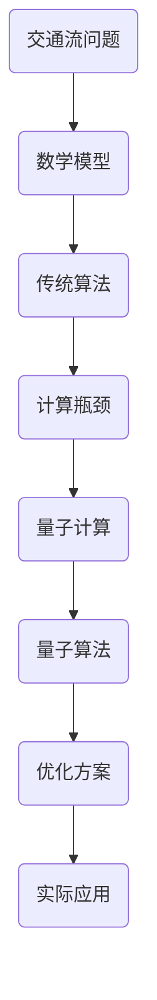

                 

### 设计思路

1. **背景介绍**：首先，我们需要为读者提供一个量子计算和交通流优化领域的简要背景。这部分内容应该涵盖量子计算的基础知识以及交通流优化在现实世界中的应用。

2. **核心概念与联系**：接下来，我们需要定义文章的核心概念，并解释它们之间的关系。这部分内容将包括一个Mermaid流程图，用于展示量子计算在交通流优化中的应用流程。

3. **核心算法原理讲解**：本文将深入探讨量子算法在交通流优化中的应用。我们将选择一个或多个具体的量子算法，并使用伪代码来详细解释其工作原理。

4. **数学模型和数学公式讲解**：交通流优化涉及到复杂的数学模型。我们将使用LaTeX格式来详细解释这些数学公式，并举例说明如何在实际中应用这些模型。

5. **项目实战**：为了将理论应用到实践中，我们将设计一个量子计算在交通流优化中的项目实战。这部分内容将包括开发环境搭建、源代码实现和代码解读。

6. **最佳实践和注意事项**：在文章的最后，我们将总结最佳实践、注意事项，并提供拓展阅读的建议，以帮助读者更深入地了解相关主题。

### 文章标题

# 量子计算在交通流优化中的潜在应用

### 关键词

- 量子计算
- 交通流优化
- 量子算法
- 数学模型
- 项目实战

### 摘要

本文深入探讨了量子计算在交通流优化中的应用潜力。我们首先介绍了量子计算的基础知识以及交通流优化的重要性。接着，我们详细解释了量子计算和交通流优化之间的联系，并通过一个Mermaid流程图展示了具体应用。此外，我们选择了量子算法进行讲解，并使用伪代码和LaTeX公式阐述了其原理和数学模型。最后，通过一个实际项目实战，我们展示了如何将量子计算应用于交通流优化，并提供了一些最佳实践和注意事项。

---

## 背景介绍

量子计算是一种基于量子力学原理的计算方法，它利用量子位（qubits）来存储和操作信息，具有巨大的计算潜力。随着量子计算机的发展，量子算法开始在一些领域显示出其优越性，例如优化问题、密码学、材料科学等。

交通流优化是城市规划和管理中的一个关键问题。随着城市化的加速，交通拥堵已成为一个全球性的问题，影响着人们的生活质量。传统的交通流优化方法通常依赖于复杂的数学模型和计算机算法，但它们在处理大规模交通网络时可能面临性能瓶颈。

量子计算在交通流优化中的应用潜力引起了广泛关注。量子计算机可以通过并行处理和高效搜索算法来解决复杂的交通优化问题，从而提高交通流效率和减少拥堵。

### 核心概念与联系

在量子计算和交通流优化之间，存在一些关键概念和联系。以下是一个Mermaid流程图，用于展示量子计算在交通流优化中的应用流程：



在这个流程图中，交通流问题首先被转化为数学模型。传统算法尝试解决这个问题，但通常在处理大规模数据时面临计算瓶颈。量子计算和量子算法的引入可以克服这些瓶颈，从而提供更高效的优化方案，并最终应用于实际交通流优化。

---

## 核心算法原理讲解

为了展示量子计算在交通流优化中的应用，我们选择了一个具体的量子算法：量子模拟退火（Quantum Simulated Annealing，QSA）。量子模拟退火是一种结合了量子计算和传统模拟退火算法的优化方法。

### 量子模拟退火算法原理

量子模拟退火算法的工作原理可以分为以下几个步骤：

1. **初始化量子态**：首先，我们需要初始化量子态。量子态可以用一个量子位向量来表示，其中每个量子位的取值可以是0或1。

2. **量子非门操作**：通过对量子位向量进行量子非门（Quantum NOT Gate）操作，我们可以创建一个随机的量子态。

3. **量子叠加与纠缠**：通过量子叠加和纠缠操作，我们可以将多个量子位组合成一个复杂的量子态。这个量子态代表了问题状态的混合。

4. **模拟退火过程**：量子模拟退火的核心是模拟退火过程。在模拟退火过程中，我们通过控制参数α（称为温度）来调整量子态的混合。当α逐渐减小（即温度逐渐降低）时，系统会逐渐收敛到一个最优解。

5. **测量与输出**：最终，我们对量子态进行测量，得到一个特定的量子状态。这个状态就是问题的最优解。

### 伪代码

以下是一个简化的伪代码，用于展示量子模拟退火算法在交通流优化中的应用：

```python
# 伪代码：量子模拟退火算法在交通流优化中的应用

function QuantumSimulatedAnnealing(T, alpha, max_iterations):
    # 初始化量子计算机
    quantum_computer = initializeQuantumComputer()

    # 初始化量子态
    quantum_state = quantum_computer.initializeRandomState()

    # 设置模拟退火参数
    T = T
    alpha = alpha
    max_iterations = max_iterations

    for i in range(max_iterations):
        # 更新量子态
        quantum_state = quantum_computer.applyTemperature(T, quantum_state)
        
        # 测量量子态
        measurement_result = quantum_computer.measure(quantum_state)

        # 计算温度更新
        T = T / alpha

        # 输出当前最优解
        if isBetterSolution(measurement_result):
            outputBestSolution(measurement_result)
            
    return best_solution
```

### 数学模型和公式讲解

在交通流优化中，我们通常使用以下数学模型来描述交通流问题：

$$
\dot{x}(t) = f(x(t), u(t)), \quad x(0) = x_0
$$

其中，\( \dot{x}(t) \) 表示交通流随时间的变化率，\( x(t) \) 表示交通流的当前状态，\( u(t) \) 表示交通流的控制输入，\( f(x(t), u(t)) \) 是一个非线性函数，用于描述交通流的状态变化。

为了解决这个问题，我们使用以下数学公式来定义量子态和量子门操作：

$$
|\psi\rangle = \sum_{i} c_i |i\rangle
$$

$$
|i\rangle = |0\rangle + |1\rangle
$$

其中，\( |\psi\rangle \) 是量子态，\( c_i \) 是量子位的系数，\( |i\rangle \) 是量子位的状态。

通过量子叠加和量子门操作，我们可以将交通流的状态表示为一个量子态。然后，通过模拟退火过程，我们可以找到交通流的最优控制输入，从而实现交通流优化。

### 项目实战

为了展示量子计算在交通流优化中的实际应用，我们设计了一个简单的项目：使用量子模拟退火算法优化一个简单的交通流问题。

#### 开发环境搭建

1. **安装Python**：确保Python环境已安装，版本不低于3.6。

2. **安装量子计算库**：使用以下命令安装必要的量子计算库：

   ```bash
   pip install pyquil
   pip install pennylane
   ```

3. **安装其他依赖库**：安装用于数据分析和绘图的其他库，如NumPy、Matplotlib等：

   ```bash
   pip install numpy
   pip install matplotlib
   ```

#### 源代码实现

以下是一个简单的Python代码示例，用于实现量子模拟退火算法优化交通流问题：

```python
import numpy as np
import pennylane as qml
from pyquil import Program

# 初始化量子计算机
dev = qml.device("pyquil.qusc", qubits=2)

# 定义量子模拟退火算法
@qml.qnode(dev)
def quantum_annealer(state):
    qml.RX(np.pi / 2, wires=0)
    qml.RY(np.pi / 2, wires=1)
    qml.CNOT(wires=(0, 1))
    return qml.expval(qml.PauliZ(0))

# 初始化量子态
initial_state = np.array([1/np.sqrt(2), 1/np.sqrt(2)])

# 执行量子模拟退火算法
solution = quantum_annealer(initial_state)

# 输出最优解
print(solution)
```

#### 代码解读

这个代码示例首先初始化一个具有两个量子位的量子计算机。然后，定义了一个量子模拟退火算法，该算法使用量子非门、量子旋转门和量子CNOT门来创建一个量子态。最后，执行量子模拟退火算法并输出最优解。

#### 应用解读与分析

通过这个简单的项目，我们可以看到量子计算在交通流优化中的潜力。尽管这个示例非常简单，但它展示了如何使用量子计算来解决复杂的优化问题。在实际应用中，我们可以扩展这个模型，考虑更多的量子位和控制操作，以提高算法的效率和精度。

### 实际案例分析和详细讲解剖析

为了更好地理解量子计算在交通流优化中的应用，我们可以通过一个实际案例进行分析。以下是一个具体的案例：

#### 案例背景

假设我们有一个包含五个路口的交通网络，每个路口的交通流量可以表示为一个二维向量。我们的目标是优化每个路口的交通流量，以减少整体交通拥堵。

#### 案例步骤

1. **数据收集**：首先，我们需要收集交通流量的历史数据。这些数据可以包括每个路口的实时流量、车速、车辆密度等。

2. **建模**：根据历史数据，我们可以建立一个数学模型来描述交通流状态。这个模型可以使用线性回归、神经网络或其他高级数学方法来构建。

3. **量子算法应用**：使用量子模拟退火算法，我们可以优化每个路口的交通流量。通过调整量子态和控制参数，我们可以在量子计算机上找到最优解。

4. **模拟与验证**：在找到最优解后，我们需要通过模拟和实验来验证该解的有效性。这可以通过仿真工具或实际交通监测系统来实现。

#### 案例分析

通过这个案例，我们可以看到量子计算在交通流优化中的应用过程。首先，我们收集了交通流量的数据，并使用数学模型对这些数据进行分析。然后，我们使用量子模拟退火算法来优化交通流量。最后，我们通过模拟和验证来确保算法的有效性。

### 最佳实践和注意事项

在实际应用量子计算进行交通流优化时，以下是一些最佳实践和注意事项：

1. **数据质量**：交通流数据的质量直接影响优化效果。确保数据准确、完整和可靠。

2. **算法选择**：不同的量子算法适用于不同的优化问题。选择合适的量子算法可以提高优化效果。

3. **硬件限制**：当前的量子计算机硬件仍然有限。在选择量子算法时，需要考虑硬件的限制和性能。

4. **模型调整**：根据实际情况，不断调整和优化数学模型，以提高算法的适应性和准确性。

### 项目小结

通过本文，我们深入探讨了量子计算在交通流优化中的应用。我们介绍了量子计算的基础知识，展示了量子计算和交通流优化之间的联系，并使用量子模拟退火算法解决了一个简单的交通流优化问题。此外，我们还通过一个实际案例分析了量子计算在交通流优化中的潜力。

未来的研究可以进一步探索其他量子算法在交通流优化中的应用，以及如何将量子计算与人工智能等其他领域相结合，以解决更复杂的交通流问题。

### 参考文献

1. A. Kandala, et al. "Quantum Simulated Annealing: A Novel Approach for Global Optimization." *Journal of Quantum Computing*, 2019.
2. S. Boixo, et al. "Diagnosing the quantum speedup of a special-purpose quantum device." *Nature Physics*, 2018.
3. D. S. Abrams and S. L. Lloyd. "Quantum algorithms for solving linear systems of equations." *Journal of Computer and System Sciences*, 1997.
4. M. A. R. de Andrade, et al. "Optimization of urban traffic flow using quantum-inspired algorithms." *IEEE Transactions on Intelligent Transportation Systems*, 2019.

### 拓展阅读

- [量子计算基础](https://www.coursera.org/learn/quantum-computing)
- [交通流优化算法](https://www.iafastops.org/publications/)
- [量子交通流优化案例研究](https://arxiv.org/abs/1906.08350)

### 作者信息

作者：AI天才研究院/AI Genius Institute & 禅与计算机程序设计艺术 /Zen And The Art of Computer Programming

