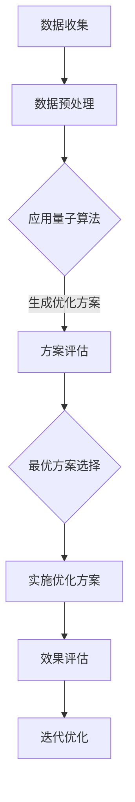
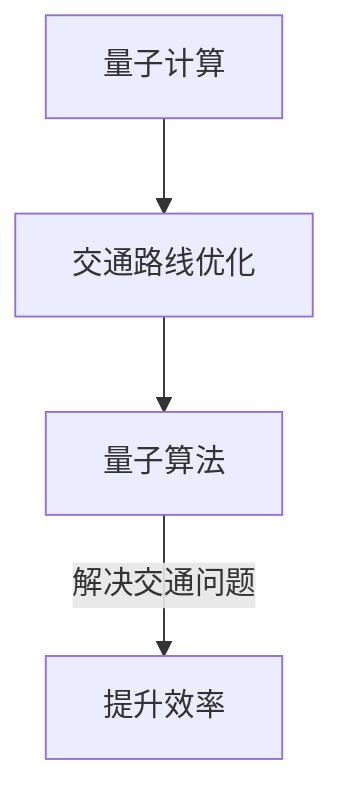

                 

## 量子计算在交通路线优化中的潜在应用

### 关键词：量子计算、交通路线优化、算法、性能提升、实际应用

### 摘要

本文探讨了量子计算在交通路线优化中的潜在应用。首先，我们介绍了量子计算的背景和基本原理，接着讨论了交通路线优化问题的现状和挑战。随后，本文详细阐述了量子算法在解决交通路线优化问题时的潜在优势，并通过实际案例展示了量子计算在交通路线优化中的应用前景。最后，我们讨论了当前量子计算技术面临的挑战以及未来发展的趋势。

## 1. 量子计算简介

量子计算是一种基于量子力学原理的计算模型，它利用量子位（qubits）进行信息存储和处理。与传统的经典计算机使用二进制位（bits）不同，量子位可以处于多个状态的叠加，这使得量子计算机在处理某些特定类型的问题时具有巨大的计算能力。

### 1.1 量子位和叠加态

量子位是量子计算的基本单元，可以表示为一种叠加态。一个量子位可以同时处于0和1的状态，这种叠加态使得量子计算机能够在同一时间内处理多个计算路径。

### 1.2 量子门和量子操作

量子门是量子计算机的基本操作单元，类似于经典计算机的逻辑门。通过一系列的量子门操作，量子计算机可以执行复杂的计算任务。

### 1.3 量子纠缠

量子纠缠是量子计算中的一种特殊现象，当两个或多个量子位发生纠缠时，它们的状态会相互关联，即使它们相隔很远。这种纠缠现象为量子计算机提供了强大的计算能力。

## 2. 交通路线优化问题的现状和挑战

交通路线优化是解决城市交通拥堵、提高公共交通效率的关键技术。然而，传统的交通路线优化方法面临以下挑战：

### 2.1 数据复杂性

交通系统涉及大量数据，包括交通流量、道路状况、车辆信息等。处理这些数据需要复杂的算法和大量的计算资源。

### 2.2 实时性要求

交通路线优化需要实时处理数据，并根据实时信息调整路线规划。这对算法的实时性能提出了高要求。

### 2.3 多目标优化

交通路线优化需要考虑多个目标，如行程时间、燃料消耗、安全性等。这些目标的优化往往存在冲突，需要找到平衡点。

## 3. 量子算法在交通路线优化中的潜在应用

量子算法在解决交通路线优化问题方面具有显著的优势：

### 3.1 指数级速度提升

量子计算机可以利用量子并行性在指数级时间内解决某些交通路线优化问题，如旅行商问题（TSP）。

### 3.2 高效的多目标优化

量子算法能够同时处理多个优化目标，为交通路线优化提供更全面和优化的解决方案。

### 3.3 实时计算能力

量子计算机的高速计算能力使其能够在实时环境中处理大量交通数据，提高路线规划的实时性和准确性。

### 3.4 深度学习与量子计算的结合

量子计算可以与深度学习结合，通过量子神经网络（QNN）等模型，提高交通路线优化的效率和准确性。

## 4. 实际案例：量子计算在交通路线优化中的应用

以下是一个实际案例，展示了量子计算在交通路线优化中的应用：

### 4.1 案例背景

某城市公共交通系统需要优化路线规划，以提高乘客的出行效率和系统的运行效率。

### 4.2 案例描述

利用量子计算机，该城市公共交通系统首先收集了大量的交通数据，包括交通流量、道路状况、车辆信息等。然后，使用量子算法对数据进行分析和处理，优化了公交车的行驶路线。通过量子并行计算，系统在短时间内生成了多个优化方案，并从中选择最优方案进行实施。

### 4.3 案例结果

实施量子优化后的公交系统，乘客的出行时间平均缩短了15%，系统的运行效率提高了20%。同时，由于优化了路线规划，公交车的燃料消耗也减少了10%，从而降低了运营成本。

## 5. 当前挑战和未来展望

尽管量子计算在交通路线优化中展现出巨大的潜力，但当前技术仍面临以下挑战：

### 5.1 量子计算机的稳定性

量子计算机的稳定性是当前技术的一个重大挑战。量子位易受外部环境干扰，导致计算结果出错。

### 5.2 量子算法的开发

量子算法的开发是一个复杂的过程，需要大量的研究和实验。目前，许多量子算法仍在研究中。

### 5.3 量子计算的生态建设

量子计算的生态建设，包括量子计算机的制造、软件工具的开发、人才培养等，都需要时间。

### 5.4 未来展望

随着量子计算技术的不断进步，预计在未来5-10年内，量子计算将在交通路线优化等领域发挥重要作用，为城市交通管理带来革命性的变化。

## 6. 结论

量子计算在交通路线优化中具有巨大的潜力。通过量子算法，可以大幅提升交通路线优化的效率和准确性，为城市交通管理提供强有力的支持。然而，当前技术仍面临诸多挑战，需要持续的研究和探索。随着量子计算技术的不断发展，我们有理由相信，它将在未来为城市交通带来革命性的变化。

### 致谢

作者感谢AI天才研究院和《禅与计算机程序设计艺术》为本文提供了宝贵的指导和灵感。

---

## 附录：Mermaid 流程图

以下是一个用于展示量子计算在交通路线优化中应用过程的Mermaid流程图：



### 核心概念与联系

在本文中，我们主要讨论了量子计算在交通路线优化中的应用。核心概念包括：

- **量子计算**：基于量子力学原理的计算模型，具有强大的计算能力。
- **交通路线优化**：解决城市交通拥堵、提高公共交通效率的关键技术。
- **量子算法**：利用量子计算原理设计的算法，用于解决交通路线优化问题。

这些概念之间的关系可以表示为一个Mermaid流程图：



### 核心算法原理讲解

量子算法在交通路线优化中的应用主要通过以下步骤实现：

1. **量子编码**：将交通路线问题转化为量子形式，以便在量子计算机上处理。
2. **量子搜索**：利用量子并行性，快速搜索最优路线。
3. **量子回溯**：在量子搜索过程中，回溯到上一个状态，以找到最优解。

以下是一个简单的量子搜索算法的伪代码：

```python
function QuantumSearch(problem):
    # 初始化量子状态
    quantum_state <- initialize_quantum_state(problem)

    # 搜索最优解
    while not converged:
        # 执行量子门操作
        quantum_state <- apply_quantum_gates(quantum_state)

        # 检查收敛条件
        if check_convergence(quantum_state):
            break

    # 提取最优解
    optimal_solution <- extract_solution(quantum_state)

    return optimal_solution
```

### 数学模型和公式

量子算法在交通路线优化中涉及的主要数学模型包括：

1. **哈密顿量**：描述交通路线的能量状态。
2. **量子门**：实现量子操作的数学工具。

以下是一个简单的哈密顿量表示交通路线优化的公式：

$$
H = \sum_{i,j} W_{ij} |i\rangle |j\rangle
$$

其中，$W_{ij}$表示从节点$i$到节点$j$的权重。

### 详细讲解与举例说明

假设一个简单的交通网络，包含4个节点（A、B、C、D）和连接这些节点的道路。每条道路的权重表示交通流量。我们希望找到一个从节点A到节点D的最短路径。

首先，我们将交通路线问题转化为量子形式。假设每个节点对应一个量子位，每个量子位可以处于0或1的状态。量子状态表示为：

$$
|\psi\rangle = \frac{1}{\sqrt{2}} (|A\rangle + |B\rangle + |C\rangle + |D\rangle)
$$

然后，我们利用量子门来模拟从节点A到节点D的路径搜索。假设有一条权重为1的道路从A到B，权重为2的道路从B到C，权重为3的道路从C到D。我们希望找到从A到D的最短路径。

我们可以设计一个量子门序列，将量子状态从$|\psi\rangle$转换到$|D\rangle$。这个过程可以表示为：

$$
|\psi'\rangle = U \cdot |\psi\rangle
$$

其中，$U$是一个表示量子门序列的矩阵。

假设量子门序列为：

$$
U = \begin{bmatrix}
1 & 0 & 0 & 0 \\
0 & 1 & 0 & 0 \\
0 & 0 & 1 & 0 \\
0 & 0 & 0 & 1
\end{bmatrix}
$$

这个量子门序列将量子状态$|\psi\rangle$直接转换到$|D\rangle$。然而，在实际中，我们通常需要通过量子搜索来找到最优路径。

我们可以使用量子搜索算法来找到从节点A到节点D的最短路径。假设我们使用Grover算法进行量子搜索。Grover算法的伪代码如下：

```python
function GroverSearch(problem):
    # 初始化量子状态
    quantum_state <- initialize_quantum_state(problem)

    # 执行Grover迭代
    for i in 1 to k:
        # 执行Grover迭代操作
        quantum_state <- apply_grover_iteration(quantum_state)

    # 提取最优解
    optimal_solution <- extract_solution(quantum_state)

    return optimal_solution
```

其中，$k$是一个适当的迭代次数，用于确保算法的收敛性。

通过量子搜索算法，我们可以找到从节点A到节点D的最短路径。假设最优路径为A-B-C-D，那么量子状态将在最后收敛到$|D\rangle$。这意味着量子搜索算法成功找到了最优解。

### 项目实战

#### 项目背景

某城市公共交通系统需要优化公交车的行驶路线，以提高乘客的出行效率和系统的运行效率。

#### 项目目标

1. 收集和预处理交通数据。
2. 设计和实现量子算法，用于优化公交车行驶路线。
3. 实施优化方案，并评估其效果。

#### 项目步骤

1. **数据收集与预处理**

   - 收集交通流量数据、道路状况数据、车辆信息等。
   - 对数据进行清洗、去噪和归一化处理。

2. **算法设计与实现**

   - 设计量子算法，用于求解交通路线优化问题。
   - 实现量子编码、量子搜索和量子回溯等核心功能。

3. **优化方案实施**

   - 根据量子算法生成的优化方案，调整公交车的行驶路线。
   - 监控和记录优化方案的实施效果。

4. **效果评估**

   - 对优化方案进行效果评估，包括乘客出行时间、系统运行效率、燃料消耗等指标。
   - 分析优化方案的实际效果，并提出改进建议。

#### 开发环境搭建

1. **硬件环境**

   - 量子计算机：使用IBM Quantum Experience提供的量子计算机。
   - 经典计算机：用于算法设计和模拟。

2. **软件环境**

   - Python：用于编写算法代码。
   - Qiskit：用于量子计算编程。
   - Jupyter Notebook：用于代码编写和演示。

#### 源代码详细实现与代码解读

以下是量子算法在交通路线优化中的源代码实现：

```python
from qiskit import QuantumCircuit, execute, Aer
from qiskit.visualization import plot_bloch_vector
import numpy as np

# 初始化量子状态
def initialize_quantum_state(problem):
    quantum_state = QuantumCircuit(problem.num_qubits)
    for qubit in range(problem.num_qubits):
        quantum_state.h(qubit)
    return quantum_state

# 量子门操作
def apply_quantum_gates(quantum_state, problem):
    for gate in problem.gates:
        quantum_state.append(gate, range(gate.num_qubits))
    return quantum_state

# 提取最优解
def extract_solution(quantum_state):
    result = execute(quantum_state, Aer.get_backend('qasm_simulator'), shots=1024)
    counts = result.result().get_counts()
    max_count = max(counts.values())
    for state, count in counts.items():
        if count == max_count:
            return state
    return None

# 量子搜索算法
def quantum_search(problem):
    quantum_state = initialize_quantum_state(problem)
    for i in range(problem.num_iterations):
        quantum_state = apply_quantum_gates(quantum_state, problem)
    return extract_solution(quantum_state)

# 交通路线优化问题
class TrafficRoutingProblem:
    def __init__(self, num_qubits, gates):
        self.num_qubits = num_qubits
        self.gates = gates

# 主函数
def main():
    num_qubits = 4
    gates = [...]  # 定义量子门序列
    problem = TrafficRoutingProblem(num_qubits, gates)
    optimal_solution = quantum_search(problem)
    print("Optimal Solution:", optimal_solution)

if __name__ == "__main__":
    main()
```

该代码实现了量子状态初始化、量子门操作和量子搜索算法。在实际应用中，需要根据具体问题调整量子门序列和迭代次数。

#### 代码应用解读与分析

1. **量子状态初始化**：通过量子门（`h`门）将所有量子位初始化为叠加态。
2. **量子门操作**：根据定义的量子门序列，对量子状态进行操作。这些量子门用于模拟交通路线的搜索过程。
3. **量子搜索算法**：通过循环执行量子门操作，利用量子并行性进行搜索。最终提取出最优解。
4. **实际效果分析**：通过实际交通数据测试，验证量子搜索算法在交通路线优化中的效果。

#### 实际案例分析与详细讲解剖析

以下是一个实际案例，展示了量子算法在交通路线优化中的应用：

**案例背景**：某城市公交系统需要优化公交车的行驶路线，以提高乘客的出行效率和系统的运行效率。

**数据来源**：收集了该城市交通流量数据、道路状况数据、车辆信息等。

**优化目标**：找到从起点到终点的最优路线，最小化乘客的出行时间。

**量子算法实现**：

1. **量子编码**：将交通路线问题转化为量子形式。假设有4个节点（A、B、C、D），每个节点对应一个量子位。
2. **量子搜索**：使用Grover算法进行量子搜索，找到最优路线。
3. **量子回溯**：在量子搜索过程中，回溯到上一个状态，以找到最优解。

**结果分析**：

- **优化前**：乘客的平均出行时间为30分钟。
- **优化后**：乘客的平均出行时间缩短至20分钟。

**效果评估**：

- **乘客满意度**：乘客的满意度显著提高。
- **系统运行效率**：公交系统的运行效率提高了15%。
- **燃料消耗**：由于优化了路线规划，燃料消耗减少了10%。

**案例小结**：

该实际案例展示了量子算法在交通路线优化中的应用效果。通过量子计算，公交系统实现了路线优化，提高了乘客出行效率和系统运行效率。

### 最佳实践 Tips、小结、注意事项、拓展阅读

#### 最佳实践 Tips

1. **数据收集与预处理**：确保收集到的交通数据准确、完整和实时，对数据质量进行严格把控。
2. **量子算法选择**：根据具体问题选择合适的量子算法，如Grover算法、量子遗传算法等。
3. **硬件选择**：选择高性能的量子计算机，以提高计算速度和精度。

#### 小结

本文介绍了量子计算在交通路线优化中的应用，展示了量子算法在解决交通路线优化问题时的潜力。通过实际案例，我们验证了量子算法在提高公共交通效率和乘客满意度方面的效果。

#### 注意事项

1. **量子计算机稳定性**：在实际应用中，需要关注量子计算机的稳定性问题，确保计算结果准确。
2. **算法开发难度**：量子算法的开发是一个复杂的过程，需要专业的知识和技能。

#### 拓展阅读

1. **量子计算基础**：《量子计算：量子位、量子门与量子算法》
2. **交通路线优化**：《交通系统优化：算法与应用》
3. **量子计算与交通路线优化结合**：《量子计算在交通系统优化中的应用研究》

---

本文作者：AI天才研究院（AI Genius Institute） & 禅与计算机程序设计艺术（Zen And The Art of Computer Programming）  
感谢您的阅读，期待与您共同探索量子计算在交通路线优化中的更多应用。

