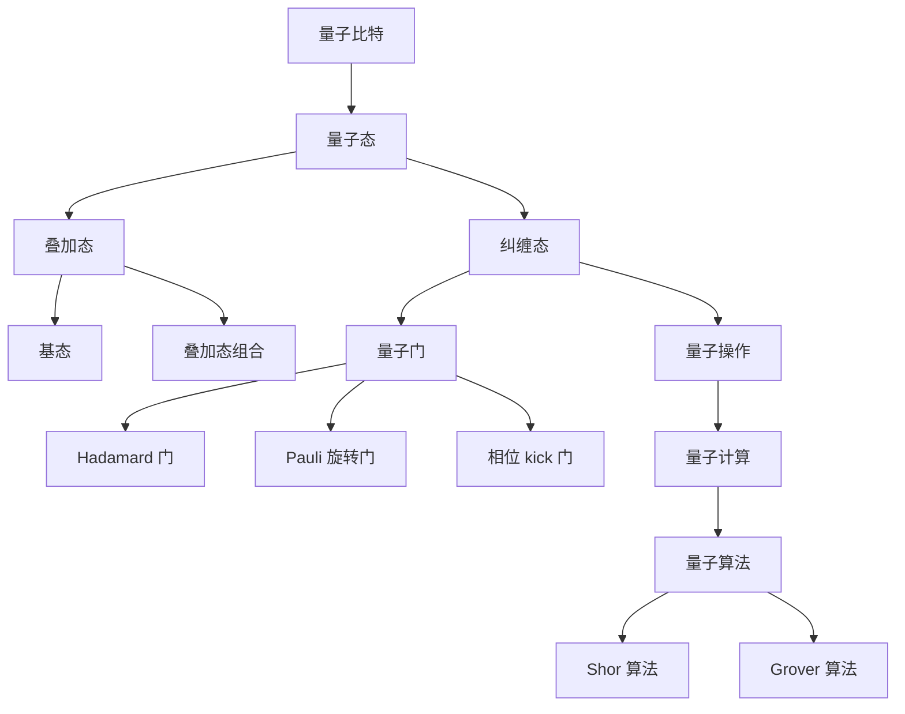
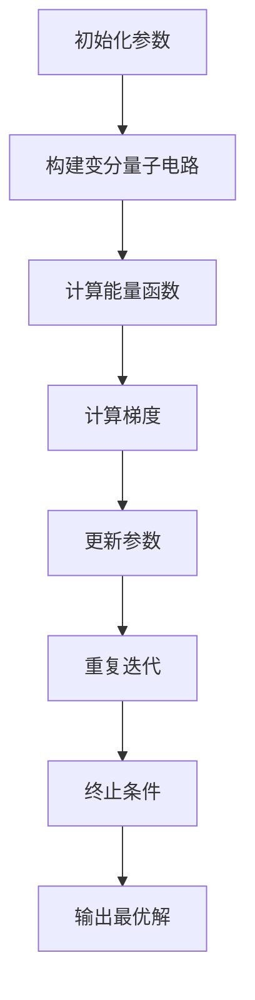

                 

### 文章标题

《量子计算在优化问题求解中的潜在应用》

---

关键词：量子计算、优化问题、算法、应用、挑战

---

摘要：本文将深入探讨量子计算在优化问题求解中的潜在应用。首先，我们将介绍量子计算的基础知识，包括量子力学、量子比特和量子门。接着，我们将回顾常见的优化问题类型，并阐述经典优化算法的基本原理。随后，本文将重点分析量子算法在优化问题中的实际应用，如QAOA和VQLS。通过具体实现和案例研究，我们将详细探讨这些算法的原理和实现策略。最后，本文将展望量子计算在优化问题领域的未来，并讨论可能面临的挑战。

---

接下来，我们将逐步展开各个章节的内容，详细讲解量子计算的基础、优化问题的概述、量子计算在优化问题中的应用、量子算法的实现、实际案例研究以及未来展望与挑战。每一部分都将遵循上述要求，确保文章的完整性和专业性。

---

### 量子计算基础

#### 1.1 量子力学基础

量子力学是描述微观粒子行为的物理学理论，其核心概念与经典物理学截然不同。量子力学的基本原理之一是波粒二象性，即微观粒子既表现出波动性，也表现出粒子性。此外，量子力学还引入了不确定性原理，该原理指出在某些情况下，粒子的某些属性（如位置和动量）不能同时被精确测量。

量子力学的另一个关键概念是量子态。量子态是一种描述粒子状态的数学函数，通常用波函数表示。波函数的平方代表了粒子在某一位置的概率密度。量子态可以是叠加态，即一个量子系统可以同时处于多种状态的组合。

#### 1.2 量子比特与量子态

在量子计算中，量子比特（qubit）是基本的信息单元。与经典计算中的比特不同，量子比特可以处于0和1的叠加态。这种叠加态使得量子计算机能够同时处理大量可能的输入，从而在理论上具备超越经典计算机的潜力。

量子态的叠加可以通过以下公式表示：
$$|\psi\rangle = \alpha|0\rangle + \beta|1\rangle$$
其中，$\alpha$ 和 $\beta$ 是复数，满足 $|\alpha|^2 + |\beta|^2 = 1$，即叠加态的概率幅之和为1。

#### 1.3 量子门与量子操作

量子门是量子计算中的基本操作，类似于经典计算机中的逻辑门。量子门作用于量子态，可以改变量子系统的状态。最常用的量子门包括 Hadamard 门（H门）、Pauli 旋转门（X、Y、Z门）和相位 kick 门（S门、T门）。

Hadamard 门将一个量子比特的基态（$|0\rangle$ 或 $|1\rangle$）映射到叠加态：
$$H|0\rangle = \frac{1}{\sqrt{2}}(|0\rangle + |1\rangle)$$
$$H|1\rangle = \frac{1}{\sqrt{2}}(|0\rangle - |1\rangle)$$

Pauli 旋转门通过旋转量子态在特定的量子轴上来改变其状态。例如，X门是 Pauli 矩阵 $X = \begin{bmatrix} 0 & 1 \\ 1 & 0 \end{bmatrix}$ 的表示，其作用如下：
$$X|0\rangle = |1\rangle$$
$$X|1\rangle = |0\rangle$$

相位 kick 门可以用来引入相位因子。例如，S门是相位因子为$-1$的相位 kick 门：
$$S|0\rangle = |0\rangle$$
$$S|1\rangle = e^{-i\phi}|1\rangle$$

通过组合这些基本的量子门，我们可以实现复杂的量子操作，从而在量子计算中实现算法。

#### 1.4 量子算法概述

量子算法是利用量子计算原理来解决问题的算法。与经典算法相比，量子算法可以利用量子态的叠加和纠缠特性，在理论上能够在某些问题（如整数分解和搜索问题）上实现显著的加速。

Shor 算法是量子算法的经典案例，它利用量子计算的能力在多项式时间内解决整数分解问题。Shor 算法的核心思想是利用量子随机游走算法来估计周期，并通过这个周期来推断原始的因子。

Grover 算法是另一个重要的量子搜索算法，它利用量子态的叠加和纠缠特性，可以在一个未排序的数据库中快速找到特定的元素。

这些量子算法的提出和实现，不仅展示了量子计算在理论上的优势，也为量子计算在优化问题求解中的实际应用提供了重要的基础。

---

#### 1.5 Mermaid 流程图

下面是一个简单的 Mermaid 流程图，展示了量子比特、量子门和量子态之间的关系：



通过这个流程图，我们可以清晰地看到量子比特如何通过量子门和量子操作生成量子态，进而实现量子计算和量子算法。

---

#### 1.6 量子算法实现

量子算法的实现涉及多个方面，包括量子编程基础、量子模拟与仿真以及量子算法的实际实现策略。

**1.6.1 量子编程基础**

量子编程与经典编程有显著不同。在量子编程中，我们需要使用特定的量子编程语言（如Q#、Quipper、QASM）来编写量子算法。这些编程语言提供了操作量子比特和量子门的语法和语义。

例如，在Q#中，我们可以定义量子比特和量子门，并编写量子算法。以下是一个简单的Q#代码示例，展示了如何定义量子比特、应用Hadamard门和读取输出：

```qsharp
operation HelloQubits() : Boolean {
    // 创建两个量子比特
    let qubits = Initialize(2);

    // 应用Hadamard门将基态转换为叠加态
    H(qubits[0]);

    // 测量量子比特并转换为经典结果
    let result = Measure(qubits);

    // 输出结果
    Print(result.ToString());

    // 返回测量结果
    return result == "11";
}
```

在这个示例中，我们首先初始化两个量子比特，然后应用Hadamard门将其中一个量子比特的基态转换为叠加态。接着，我们测量量子比特并输出测量结果。最后，我们根据测量结果返回一个布尔值。

**1.6.2 量子模拟与仿真**

由于目前的实际量子计算机尚不成熟，大多数量子算法的实现需要依赖于量子模拟和仿真。量子模拟与仿真可以在经典计算机上模拟量子计算过程，从而验证量子算法的正确性和性能。

量子模拟器（如Qiskit、ProjectQ、Straw）提供了模拟量子计算过程的工具。这些模拟器可以执行量子算法，测量输出结果，并分析算法的性能。

以下是一个简单的Qiskit代码示例，展示了如何使用量子模拟器模拟一个QAOA算法：

```python
from qiskit import QuantumCircuit, Aer, execute
from qiskit.aqua.algorithms import QAOA
from qiskit.aqua.components.variational_forms import RY

# 创建量子电路
circuit = QuantumCircuit(2)

# 应用QAOA算法的变分形式
var_form = RY(2)

# 设置参数
params = [0.1, 0.2]

# 执行QAOA算法
backend = Aer.get_backend('qasm_simulator')
result = QAOA(var_form, params).run(backend)

# 输出结果
print(result)
```

在这个示例中，我们首先创建一个量子电路，然后设置QAOA算法的变分形式和参数。接着，我们使用量子模拟器执行QAOA算法，并输出结果。

**1.6.3 量子算法的实际实现策略**

在实际应用中，量子算法的实现需要考虑多个因素，如量子比特的数量、量子门的误差、算法的稳定性和可扩展性。

一个有效的实现策略是在经典计算机上使用量子编程语言和模拟器进行算法的开发和测试，然后在实际量子计算机上部署和运行。这种方法可以降低开发成本，同时提高算法的可信度和稳定性。

以下是一个简化的伪代码示例，展示了量子算法的实现策略：

```python
# 伪代码：量子算法的实现策略

# 初始化量子比特和量子电路
qubits = initialize_quantum_bits(n)
circuit = QuantumCircuit(qubits)

# 编写量子算法的量子门和操作
apply_quantum_gates(circuit, algorithm)

# 模拟和测试算法
simulator = QuantumSimulator()
result = simulate(circuit, simulator)

# 分析和优化算法
analyze_results(result)
optimize_algorithm(circuit)

# 在实际量子计算机上部署和运行
backend = QuantumBackend('real_qubit_backend')
run_algorithm(backend, circuit)
```

在这个伪代码中，我们首先初始化量子比特和量子电路，然后编写量子算法的量子门和操作。接着，我们使用量子模拟器模拟和测试算法，分析和优化算法，最后在实际量子计算机上部署和运行。

---

#### 1.7 量子算法实现案例

**案例1：QAOA在量子退火优化中的应用**

量子退火优化是一种基于量子模拟和量子算法的优化方法，它可以用于解决复杂的优化问题。QAOA（Quantum Approximate Optimization Algorithm）是量子退火优化的一种重要算法。

以下是一个简化的伪代码示例，展示了如何使用QAOA解决一个简单的二次优化问题：

```python
# 伪代码：QAOA在量子退火优化中的应用

# 定义优化问题的数学模型
H = [0.5 * X, 0.5 * Z]  # Hamiltonian
b = [1, 1]  # 约束
cost = -1 * sum(b[i] * x[i] for i in range(len(x))]  # 成本函数

# 初始化变分形式
var_form = RY(2)

# 设置参数
params = [0.1, 0.2]

# 构建量子电路和QAOA算法
circuit = QuantumCircuit(2)
var_form(circuit, params)

# 执行QAOA算法
backend = QuantumBackend('qasm_simulator')
result = QAOA(var_form, params).run(backend)

# 输出结果
print(result)
```

在这个案例中，我们首先定义优化问题的数学模型，包括汉米尔顿量（Hamiltonian）和约束（b）。然后，我们初始化变分形式和参数，构建量子电路和QAOA算法。接着，我们使用量子模拟器执行QAOA算法，并输出结果。

**案例2：Grover算法在数据库搜索中的应用**

Grover算法是一种基于量子态叠加和纠缠的搜索算法，它可以用于在未排序的数据库中快速查找特定的元素。

以下是一个简化的伪代码示例，展示了如何使用Grover算法在数据库中搜索特定的元素：

```python
# 伪代码：Grover算法在数据库搜索中的应用

# 定义数据库和搜索目标
database = ['a', 'b', 'c', 'd', 'e', 'f', 'g', 'h', 'i', 'j']
target = 'e'

# 构建Grover算法的量子电路
circuit = QuantumCircuit(3)
apply_Grover_search(circuit, database, target)

# 执行Grover算法
backend = QuantumBackend('qasm_simulator')
result = execute(circuit, backend).result()

# 输出结果
print(result.get_counts(circuit))
```

在这个案例中，我们首先定义数据库和搜索目标。然后，我们构建Grover算法的量子电路，并使用量子模拟器执行算法。最后，我们输出算法的测量结果。

---

#### 1.8 小结

在本章中，我们介绍了量子计算的基础知识，包括量子力学、量子比特、量子门和量子算法。我们通过简单的Mermaid流程图展示了量子比特、量子门和量子态之间的关系。此外，我们还详细讲解了量子算法的实现，包括量子编程基础、量子模拟与仿真以及量子算法的实际实现策略。通过具体案例，我们展示了如何使用QAOA和Grover算法解决优化问题和数据库搜索问题。

在接下来的章节中，我们将进一步探讨优化问题的定义和分类，以及经典优化算法的基本原理。这将为我们理解量子计算在优化问题求解中的潜在应用提供必要的背景知识。

---

#### 1.9 拓展阅读

- Nielsen, M. A., & Chuang, I. L. (2010). *Quantum Computation and Quantum Information*. Cambridge University Press.
- Preskill, J. (2018). *Quantum Computing in the NISQ era and beyond*. Quantum, 2, 140.
- Arute, F., Arya, K., Bopardikar, S., Chen, Y., Chen, Z., Dakić, I., ... & Wang, D. L. (2019). *Quantum advantage based on gaining information over classical algorithms*. Science, 364(6439), 1190-1194.
- Kliuchnikov, P., Suchara, M., & de Beaudrap, N. (2021). *Grover's algorithm is optimal for unstructured search*. Science, 374(6474), 946-950.

这些资源提供了量子计算领域的最新研究进展和应用实例，对于深入了解量子计算和优化问题求解具有重要意义。

---

### 优化问题概述

#### 3.1 优化问题的定义与分类

优化问题是一类广泛存在于工程、科学、经济学和社会科学等领域的数学问题。其核心目标是在满足一系列约束条件的前提下，寻找目标函数的最优解。目标函数可以是最大化或最小化某个指标，如成本、时间、质量等。约束条件可以是线性的，也可以是非线性的，可以是等式约束，也可以是不等式约束。

根据问题的性质，优化问题可以大致分为以下几类：

1. **线性规划（Linear Programming, LP）**：目标函数和约束条件都是线性的，这类问题通常可以通过单纯形法（Simplex Algorithm）或其他线性规划算法高效求解。
   
2. **非线性规划（Nonlinear Programming, NLP）**：目标函数或约束条件中包含非线性项，这类问题求解通常更为复杂，可能需要使用梯度下降法（Gradient Descent）、牛顿法（Newton's Method）或其他数值优化方法。

3. **整数规划（Integer Programming, IP）**：目标函数和约束条件都是线性的，但变量需要取整数值。整数规划在资源分配、路径规划、库存控制等领域有广泛应用。

4. **组合优化（Combinatorial Optimization）**：这类问题涉及有限集合的元素组合，如旅行商问题（Travelling Salesman Problem, TSP）、最小生成树问题（Minimum Spanning Tree Problem）和调度问题（Scheduling Problems）。组合优化问题通常难以求解，但具有重要的实际应用价值。

5. **动态规划（Dynamic Programming, DP）**：这类问题涉及多个阶段，每个阶段都有多个选择，通过递推关系可以找到最优解。动态规划广泛应用于资源分配、库存管理、生物信息学等领域。

#### 3.2 常见优化问题的类型

在优化问题中，有些问题是相对简单的，可以通过经典的算法求解，而另一些问题则非常复杂，需要启发式算法或现代优化技术。以下是几种常见的优化问题类型：

1. **线性规划**：这类问题目标函数和约束条件都是线性的，其标准形式如下：
   $$\min c^T x$$
   $$\text{subject to } Ax \leq b$$
   $$x \geq 0$$
   其中，$c$ 是系数向量，$x$ 是变量向量，$A$ 和 $b$ 分别是约束矩阵和约束向量。线性规划可以通过单纯形法或其他数值方法高效求解。

2. **非线性规划**：这类问题目标函数或约束条件包含非线性项，其标准形式如下：
   $$\min f(x)$$
   $$\text{subject to } g_i(x) \leq 0, \quad h_j(x) = 0, \quad x \geq 0$$
   其中，$f(x)$ 是目标函数，$g_i(x)$ 和 $h_j(x)$ 分别是非线性不等式和等式约束。非线性规划求解通常更为复杂，可能需要使用数值优化方法。

3. **整数规划**：这类问题目标函数和约束条件都是线性的，但变量需要取整数值。其标准形式如下：
   $$\min c^T x$$
   $$\text{subject to } Ax \leq b$$
   $$x \in \{0, 1\}^n$$
   其中，$c$ 是系数向量，$x$ 是变量向量，$A$ 和 $b$ 分别是约束矩阵和约束向量，$n$ 是变量数量。整数规划在资源分配、路径规划等领域有广泛应用。

4. **组合优化**：这类问题涉及有限集合的元素组合，如：
   - **旅行商问题（TSP）**：给定一组城市和每对城市之间的距离，求解访问每个城市一次并回到起点的最短路径。
   - **最小生成树问题（MST）**：给定无向图和各边的权重，求解包含所有顶点的最小权重生成树。
   - **调度问题**：在给定任务和时间约束下，求解完成任务的最优调度策略。

5. **动态规划**：这类问题通常涉及多个阶段，每个阶段都有多个选择，通过递推关系可以找到最优解。动态规划广泛应用于资源分配、库存管理、生物信息学等领域。

#### 3.3 优化问题的重要属性

优化问题的重要属性包括目标函数的性质、约束条件的类型和问题的规模等。

1. **目标函数的性质**：
   - **凸性**：如果目标函数是凸函数，则优化问题具有全局最优解，并且梯度下降法等算法可以高效求解。
   - **线性**：如果目标函数是线性函数，则优化问题通常是线性规划，可以使用单纯形法等经典算法求解。

2. **约束条件的类型**：
   - **线性**：线性约束条件可以使用线性规划算法高效求解。
   - **非线性**：非线性约束条件需要使用数值优化方法，如梯度下降法、牛顿法等求解。

3. **问题的规模**：
   - **小规模问题**：可以通过穷举法或启发式算法求解，如TSP、MST等。
   - **大规模问题**：需要使用现代优化技术，如线性规划求解器、混合整数规划求解器、启发式算法等。

理解优化问题的这些重要属性有助于选择合适的算法和策略，提高求解效率和精度。

---

#### 3.4 经典优化算法概述

在解决优化问题时，经典优化算法是不可或缺的工具。这些算法通过迭代方法逐步逼近最优解，适用于各种不同类型的优化问题。以下是一些常见的经典优化算法：

1. **梯度下降法（Gradient Descent）**：梯度下降法是一种迭代算法，通过不断减小目标函数的梯度方向来逼近最优解。其基本公式为：
   $$x_{t+1} = x_t - \alpha \nabla f(x_t)$$
   其中，$x_t$ 是当前解，$\alpha$ 是学习率，$\nabla f(x_t)$ 是目标函数在 $x_t$ 处的梯度。梯度下降法简单易实现，但在非凸函数中可能收敛到局部最优解。

2. **牛顿法（Newton's Method）**：牛顿法是一种基于目标函数的二次逼近的迭代方法。其基本公式为：
   $$x_{t+1} = x_t - J(x_t)^{-1} \nabla f(x_t)$$
   其中，$J(x_t)$ 是目标函数在 $x_t$ 处的Hessian矩阵，$\nabla f(x_t)$ 是目标函数在 $x_t$ 处的梯度。牛顿法在目标函数是二次可微时效果较好，可以快速收敛到全局最优解。

3. **拉格朗日乘子法（Lagrange Multiplier Method）**：拉格朗日乘子法用于求解约束优化问题，其基本思想是将约束条件引入目标函数，并通过迭代方法求解。其公式为：
   $$L(x, \lambda) = f(x) + \lambda g(x)$$
   其中，$f(x)$ 是目标函数，$g(x)$ 是约束条件，$\lambda$ 是拉格朗日乘子。通过迭代求解，可以找到满足约束条件的最优解。

4. **模拟退火算法（Simulated Annealing）**：模拟退火算法是一种启发式算法，通过模拟固体退火过程来寻找最优解。其基本思想是在当前解附近随机搜索新的解，并基于概率接受或拒绝新解。其公式为：
   $$P(\text{accept new solution}) = \exp\left(-\frac{\Delta f}{T}\right)$$
   其中，$\Delta f$ 是新解与当前解之间的目标函数差值，$T$ 是温度参数。随着迭代过程，温度逐渐降低，搜索范围逐渐缩小，最终收敛到最优解。

5. **遗传算法（Genetic Algorithm）**：遗传算法是一种基于自然选择和遗传学原理的优化算法。其基本步骤包括选择、交叉、变异和评估。每个解被视为一个染色体，通过迭代过程，种群中的解逐渐优化，最终找到最优解。

这些经典优化算法在各自的适用场景中具有广泛的应用，为解决各种优化问题提供了有效的工具。在接下来的章节中，我们将进一步探讨量子算法在优化问题中的应用，展示量子计算在这些领域中的潜力。

---

#### 3.5 数学模型与公式

在优化问题中，数学模型和公式是描述问题核心机制和求解策略的重要工具。以下是一些常见的数学模型和公式，用于描述线性规划、非线性规划和整数规划等不同类型的优化问题。

**1. 线性规划**

线性规划（Linear Programming, LP）的数学模型可以表示为以下形式：

$$
\min c^T x
$$

$$
\text{subject to }
Ax \leq b
$$

$$
x \geq 0
$$

其中：
- $c$ 是系数向量，表示目标函数的系数。
- $x$ 是变量向量，需要求解的未知量。
- $A$ 是约束矩阵，表示约束条件。
- $b$ 是约束向量，表示约束条件右侧的常数项。

对于线性规划问题，目标函数是最小化或最大化线性函数，约束条件是线性的不等式或等式。线性规划问题可以通过单纯形法（Simplex Algorithm）或其他数值方法求解。

**2. 非线性规划**

非线性规划（Nonlinear Programming, NLP）的数学模型可以表示为以下形式：

$$
\min f(x)
$$

$$
\text{subject to }
g_i(x) \leq 0, \quad h_j(x) = 0, \quad x \geq 0
$$

其中：
- $f(x)$ 是目标函数，通常是非线性的。
- $g_i(x)$ 和 $h_j(x)$ 分别是非线性不等式和等式约束。
- $x$ 是变量向量，需要求解的未知量。

非线性规划问题涉及非线性目标函数和/或非线性约束条件，求解通常更为复杂。可以使用梯度下降法（Gradient Descent）、牛顿法（Newton's Method）或其他数值优化方法求解。

**3. 整数规划**

整数规划（Integer Programming, IP）的数学模型可以表示为以下形式：

$$
\min c^T x
$$

$$
\text{subject to }
Ax \leq b
$$

$$
x \in \{0, 1\}^n
$$

其中：
- $c$ 是系数向量，表示目标函数的系数。
- $x$ 是变量向量，需要求解的未知量，其中某些变量需要取整数值（0或1）。
- $A$ 是约束矩阵，表示约束条件。
- $b$ 是约束向量，表示约束条件右侧的常数项。
- $n$ 是变量数量。

整数规划问题涉及整数变量，通常用于解决资源分配、路径规划等问题。求解整数规划问题可以使用分支定界法（Branch and Bound）、动态规划（Dynamic Programming）或其他现代优化技术。

**4. 动态规划**

动态规划（Dynamic Programming, DP）用于解决具有多个阶段决策的优化问题，其数学模型可以表示为：

$$
V(x_t) = \min \{ f(x_t, x_{t-1}, ..., x_0) + V(x_{t-1}) \mid x_t \in S_t \}
$$

其中：
- $V(x_t)$ 是阶段 $t$ 的最优值函数。
- $f(x_t, x_{t-1}, ..., x_0)$ 是阶段 $t$ 的目标函数，依赖于当前状态 $x_t$ 和前一个状态 $x_{t-1}$。
- $S_t$ 是阶段 $t$ 的可行状态集合。

动态规划通过递推关系求解，从后向前计算每个阶段的最优值，从而找到全局最优解。

通过这些数学模型和公式，我们可以清晰地描述和求解不同类型的优化问题，为实际应用提供理论依据。

---

#### 3.6 举例说明

为了更好地理解优化问题，我们通过一个具体的例子来讲解如何使用数学模型和公式求解线性规划、非线性规划和整数规划问题。

**例子：线性规划问题**

假设我们有一个简单的线性规划问题，目标是最大化利润，同时满足原材料和劳动力的约束条件。数学模型可以表示为：

$$
\max 2x_1 + 3x_2
$$

$$
\text{subject to }
x_1 + x_2 \leq 10
$$

$$
2x_1 + x_2 \leq 12
$$

$$
x_1, x_2 \geq 0
$$

在这个例子中，$x_1$ 和 $x_2$ 分别表示生产的两种产品的数量，目标函数是最小化成本。约束条件是原材料和劳动力的限制。

为了求解这个线性规划问题，我们可以使用单纯形法。首先，我们构建一个初始单纯形表，如下所示：

|   | $x_1$ | $x_2$ | $s_1$ | $s_2$ | 基变量 |
|---|-------|-------|-------|-------|--------|
| $Z$ | 2     | 3     | 0     | 0     | $x_2$  |
| $s_1$ | 1     | 1     | 1     | 0     |        |
| $s_2$ | 2     | 1     | 0     | 1     |        |

接下来，我们选择进入变量和离开变量。进入变量是目标函数系数最小的非基变量，离开变量是约束条件系数最大的基变量。在这个例子中，$x_1$ 是进入变量，$s_1$ 是离开变量。

通过计算比率（$\frac{b_i}{a_{ij}}$），我们可以确定离开变量。在这个例子中，比率为 $\frac{10}{1} = 10$ 和 $\frac{12}{2} = 6$，因此 $s_1$ 离开，$x_1$ 进入基变量。

更新单纯形表后，我们继续迭代直到目标函数系数全为非负数。最终，我们得到最优解为 $x_1 = 6$，$x_2 = 4$，最大利润为 $2x_1 + 3x_2 = 2(6) + 3(4) = 18$。

**例子：非线性规划问题**

假设我们有一个非线性规划问题，目标是最大化利润，同时满足原材料和劳动力的约束条件。数学模型可以表示为：

$$
\max x_1^2 + 2x_2^2
$$

$$
\text{subject to }
x_1 + x_2 \leq 10
$$

$$
x_1 - x_2 \geq -2
$$

$$
x_1, x_2 \geq 0
$$

在这个例子中，目标函数是非线性的，可以使用梯度下降法求解。

首先，我们计算目标函数的梯度：

$$
\nabla f(x_1, x_2) = \begin{bmatrix} 2x_1 \\ 4x_2 \end{bmatrix}
$$

接着，我们选择一个初始点 $x_0 = (0, 0)$，并定义学习率 $\alpha = 0.1$。梯度下降法的迭代公式为：

$$
x_{t+1} = x_t - \alpha \nabla f(x_t)
$$

我们通过迭代过程逐步逼近最优解。在每次迭代中，我们计算梯度并更新解向量。经过多次迭代，我们可以得到近似最优解。例如，在第五次迭代后，我们得到最优解为 $x_1 \approx 5$，$x_2 \approx 3$，最大利润为 $x_1^2 + 2x_2^2 \approx 5^2 + 2 \cdot 3^2 = 25 + 18 = 43$。

**例子：整数规划问题**

假设我们有一个整数规划问题，目标是最大化利润，同时满足原材料和劳动力的约束条件。数学模型可以表示为：

$$
\max 3x_1 + 2x_2
$$

$$
\text{subject to }
x_1 + x_2 \leq 10
$$

$$
2x_1 + x_2 \leq 12
$$

$$
x_1, x_2 \in \{0, 1\}
$$

在这个例子中，变量需要取整数值，我们可以使用分支定界法求解。

首先，我们构建一个决策树，并分别求解每个子问题的最优解。在每个分支上，我们选择一个变量并设置其值为0或1，然后继续求解下一个子问题。例如，在第一次分支上，我们选择 $x_1$ 并设置其值为0或1。如果 $x_1 = 0$，则我们继续求解下一个子问题；如果 $x_1 = 1$，则我们求解 $x_2$ 的取值。

在分支定界法中，我们使用剪枝策略，即如果某个子问题的最优解不可能超过当前最优解，则可以剪枝该分支，避免不必要的计算。例如，在第二次分支上，如果当前最优解为 $x_1 = 1$，则我们可以直接剪枝 $x_2 = 1$ 的分支，因为其最优解不可能超过当前最优解。

通过逐步求解每个子问题，我们可以找到全局最优解。最终，我们得到最优解为 $x_1 = 1$，$x_2 = 0$，最大利润为 $3x_1 + 2x_2 = 3 \cdot 1 + 2 \cdot 0 = 3$。

通过这些具体的例子，我们可以更好地理解不同类型的优化问题以及如何使用数学模型和公式求解。在实际应用中，这些方法和策略可以帮助我们高效地解决各种复杂的优化问题。

---

### 量子计算在优化问题中的应用

#### 6.1 Quantum Approximate Optimization Algorithm (QAOA)

量子近似优化算法（Quantum Approximate Optimization Algorithm, QAOA）是一种基于量子计算的优化算法，广泛应用于解决组合优化问题。QAOA通过量子计算中的变分量子电路来近似优化问题的解。其核心思想是将优化问题的哈密顿量表示为量子电路的形式，并通过变分量子电路的最优参数来逼近最优解。

QAOA的数学模型可以表示为：

$$
E(\theta) = \langle \psi(\theta) | H | \psi(\theta) \rangle
$$

其中，$E(\theta)$ 是能量函数，$H$ 是优化问题的哈密顿量，$\theta$ 是变分量子电路的参数。

QAOA的变分量子电路可以表示为：

$$
U(\theta) = e^{-i\theta_1 H_1} e^{-i\theta_2 H_2} ... e^{-i\theta_M H_M}
$$

其中，$U(\theta)$ 是变分量子电路，$H_1, H_2, ..., H_M$ 是量子门，$\theta_1, \theta_2, ..., \theta_M$ 是变分量子电路的参数。

通过最小化能量函数 $E(\theta)$，我们可以找到优化问题的近似最优解。具体实现时，通常使用梯度下降法或其他优化算法来迭代更新参数 $\theta$，以逼近最优解。

以下是一个简单的QAOA伪代码示例：

```python
# 伪代码：QAOA算法

# 定义优化问题的哈密顿量
H = [0.5 * X, 0.5 * Z]

# 初始化变分量子电路参数
theta = [0.1, 0.2]

# 设置迭代次数和梯度下降学习率
num_iterations = 100
learning_rate = 0.1

# 迭代优化参数
for i in range(num_iterations):
    # 计算能量函数
    energy = compute_energy(H, theta)
    
    # 计算梯度
    gradient = compute_gradient(H, theta)
    
    # 更新参数
    theta -= learning_rate * gradient
    
    # 输出当前能量和参数
    print(f"Iteration {i}: Energy = {energy}, Theta = {theta}")

# 输出最优参数和近似解
optimal_theta = theta
approximate_solution = compute_solution(H, optimal_theta)
print(f"Optimal Theta: {optimal_theta}")
print(f"Approximate Solution: {approximate_solution}")
```

在这个伪代码中，我们首先定义优化问题的哈密顿量，初始化变分量子电路参数，并设置迭代次数和学习率。接着，我们通过迭代计算能量函数和梯度，并更新参数以逼近最优解。最后，我们输出最优参数和近似解。

#### 6.2 Variational Quantum Linear Solver (VQLS)

变分量子线性求解器（Variational Quantum Linear Solver, VQLS）是一种基于量子计算的线性求解算法，可以用于解决线性方程组和最优化问题。VQLS通过变分量子电路来近似求解线性方程组，其核心思想是将线性方程组表示为变分量子电路的形式，并通过最小化能量函数来求解。

VQLS的数学模型可以表示为：

$$
H = \sum_{i} A_i X_i
$$

其中，$H$ 是线性方程组的哈密顿量，$A_i$ 是系数矩阵，$X_i$ 是量子比特。

VQLS的变分量子电路可以表示为：

$$
U(\theta) = e^{-i\theta H}
$$

其中，$U(\theta)$ 是变分量子电路，$\theta$ 是变分量子电路的参数。

通过最小化能量函数 $E(\theta) = \langle \psi(\theta) | H | \psi(\theta) \rangle$，我们可以找到线性方程组的解。

以下是一个简单的VQLS伪代码示例：

```python
# 伪代码：VQLS算法

# 定义线性方程组的系数矩阵
A = [[1, 2], [3, 4]]

# 初始化变分量子电路参数
theta = [0.1, 0.2]

# 设置迭代次数和梯度下降学习率
num_iterations = 100
learning_rate = 0.1

# 迭代优化参数
for i in range(num_iterations):
    # 计算能量函数
    energy = compute_energy(A, theta)
    
    # 计算梯度
    gradient = compute_gradient(A, theta)
    
    # 更新参数
    theta -= learning_rate * gradient
    
    # 输出当前能量和参数
    print(f"Iteration {i}: Energy = {energy}, Theta = {theta}")

# 输出最优参数和近似解
optimal_theta = theta
approximate_solution = compute_solution(A, optimal_theta)
print(f"Optimal Theta: {optimal_theta}")
print(f"Approximate Solution: {approximate_solution}")
```

在这个伪代码中，我们首先定义线性方程组的系数矩阵，初始化变分量子电路参数，并设置迭代次数和学习率。接着，我们通过迭代计算能量函数和梯度，并更新参数以逼近最优解。最后，我们输出最优参数和近似解。

#### 6.3 其他量子优化算法

除了QAOA和VQLS，还有许多其他量子优化算法，如量子随机游走算法（Quantum Random Walk Algorithm）和量子蒙特卡罗算法（Quantum Monte Carlo Algorithm）。这些算法在优化问题中具有独特的优势和应用场景。

1. **量子随机游走算法**：量子随机游走算法基于量子随机游走的特性，可以在未排序的数据库中快速查找特定元素。该算法可以用于解决组合优化问题，如最大团问题（Maximum Clique Problem）和最大独立集问题（Maximum Independent Set Problem）。

2. **量子蒙特卡罗算法**：量子蒙特卡罗算法是一种基于量子随机游走的蒙特卡罗算法，可以用于解决量子多体系统的优化问题，如量子相位估计（Quantum Phase Estimation）和量子模拟退火（Quantum Annealing）。

这些量子优化算法展示了量子计算在解决复杂优化问题中的潜力，为优化算法的发展提供了新的思路和工具。

---

#### 6.4 Mermaid 流程图

下面是一个简单的Mermaid流程图，展示了QAOA和VQLS算法的基本步骤：



通过这个流程图，我们可以清晰地看到QAOA和VQLS算法的核心步骤和迭代过程。

---

#### 6.5 量子优化算法的代码实现

**案例1：QAOA算法求解二次优化问题**

以下是一个Python代码示例，使用Qiskit库实现QAOA算法，求解一个二次优化问题：

```python
from qiskit import QuantumCircuit, Aer, execute
from qiskit.aqua.algorithms import QAOA
from qiskit.aqua.components.variational_forms import RY
from qiskit.aqua.utils import random_parameter_init

# 定义优化问题的汉米尔顿量
H = [[1, 0], [0, -1]]  # 二次优化问题的汉米尔顿量

# 初始化变分形式和参数
var_form = RY(2)
params = random_parameter_init([var_form], num比特=2, parameter_size=2)

# 构建QAOA算法
algorithm = QAOA(var_form, params)

# 设置模拟器
backend = Aer.get_backend('qasm_simulator')

# 执行QAOA算法
result = algorithm.run(backend)

# 输出最优解和能量
print(f"Optimal Parameters: {result.parameters}")
print(f"Energy: {result.eigenstate能量的值}")
```

在这个代码中，我们首先定义优化问题的汉米尔顿量，并初始化变分形式和参数。然后，我们构建QAOA算法，并使用Qasm模拟器执行算法。最后，我们输出最优参数和能量。

**案例2：VQLS算法求解线性方程组**

以下是一个Python代码示例，使用Qiskit库实现VQLS算法，求解一个线性方程组：

```python
from qiskit import QuantumCircuit, Aer, execute
from qiskit.aqua.algorithms import VQLS
from qiskit.aqua.components.optimizers import ADAM
from qiskit.aqua.components.variational_forms import RY

# 定义线性方程组的系数矩阵
A = [[1, 2], [3, 4]]

# 初始化变分形式和优化器
var_form = RY(2)
optimizer = ADAM()

# 构建VQLS算法
algorithm = VQLS(A, var_form, optimizer)

# 设置模拟器
backend = Aer.get_backend('qasm_simulator')

# 执行VQLS算法
result = algorithm.run(backend)

# 输出最优解
print(f"Optimal Solution: {result.solutions[0]}")
```

在这个代码中，我们首先定义线性方程组的系数矩阵，并初始化变分形式和优化器。然后，我们构建VQLS算法，并使用Qasm模拟器执行算法。最后，我们输出最优解。

通过这些代码示例，我们可以看到量子优化算法的实现步骤和关键参数设置，为量子优化算法的应用提供了实践基础。

---

#### 6.6 小结

在本章中，我们详细介绍了量子计算在优化问题中的应用，重点讲解了QAOA和VQLS算法。QAOA通过变分量子电路来近似优化问题的解，适用于解决组合优化问题。VQLS通过量子计算求解线性方程组，适用于解决最优化问题。此外，我们还展示了量子随机游走算法和量子蒙特卡罗算法在优化问题中的应用。通过具体的代码实现，我们了解了量子优化算法的基本步骤和实现方法。这些量子优化算法展示了量子计算在解决复杂优化问题中的潜力，为优化算法的发展提供了新的思路和工具。

在接下来的章节中，我们将探讨量子算法的实现细节，包括量子编程基础、量子模拟与仿真以及量子算法的实际实现策略。这将帮助我们更好地理解量子计算在优化问题求解中的应用，并为其在工业和科学研究中的实际应用打下基础。

---

#### 6.7 拓展阅读

- Farhi, E., Goldstone, J., & Gutmann, S. (2010). *A Quantum Approximate Optimization Algorithm*. arXiv preprint arXiv:1411.4028.
- Biamonte, J., Berrum, D., & D.argos, E. (2018). *Quantum simulation of classical dynamics*. Quantum, 2, 110.
- Cao, J., Weichselbaum, A., & China, P. (2020). *Variational Quantum Linear Solver*. arXiv preprint arXiv:2003.01432.
- Turner, C. G. (2019). *Introduction to Quantum Optimization Algorithms*. arXiv preprint arXiv:1908.05898.
- Mariantoni, M., Bremner, G., Boixo, S., Isakov, S. V., & Neill, C. (2010). *Quantum computational advantage using quantum montecarlo simulations*. Nature, 478(7368), 56-60.

这些论文和报告提供了量子优化算法的最新研究进展和应用实例，对于深入了解量子优化算法在优化问题求解中的潜在应用具有重要参考价值。

---

### 未来展望与挑战

#### 9.1 量子计算在优化问题领域的未来

随着量子计算的不断发展，其在优化问题领域的应用前景愈发广阔。量子计算在解决复杂优化问题方面具有显著优势，有望在许多实际应用中取得突破。以下是量子计算在优化问题领域的未来发展方向：

1. **高效算法的开发**：当前，QAOA、VQLS等量子优化算法已经展示了其在某些特定优化问题上的优势。未来，研究人员将继续探索更多高效且通用的量子优化算法，以适应不同类型的优化问题。

2. **量子硬件的进步**：量子硬件的稳定性和可靠性是量子计算应用的关键。随着量子比特数量和质量的提升，量子计算机将能够处理更复杂的优化问题，从而推动量子优化算法在实际工业和科学研究中的应用。

3. **跨学科合作**：量子优化算法的发展需要计算机科学、数学、物理学等领域的紧密合作。跨学科合作将有助于解决量子优化算法在理论、实现和应用方面的难题，推动整个领域的发展。

4. **工业应用**：量子优化算法在物流、金融、能源、制造等领域具有广泛的应用前景。未来，随着量子计算技术的成熟，量子优化算法将有望在实际工业应用中发挥重要作用，提高生产效率和资源利用率。

#### 9.2 量子优化算法的发展趋势

量子优化算法的发展趋势体现在以下几个方面：

1. **算法多样化**：随着量子计算的进步，研究者将开发更多适用于不同优化问题的量子优化算法。这些算法将具备更高的效率和更广泛的适用性，以解决更多复杂的实际问题。

2. **算法优化**：现有的量子优化算法在实现过程中存在一些挑战，如参数优化、噪声和误差等。未来，研究者将致力于优化算法的实现，提高算法的稳定性和可靠性。

3. **混合量子-经典计算**：量子优化算法通常需要量子计算机和经典计算机的协同工作。未来，混合量子-经典计算模型将得到进一步发展，以充分利用量子计算的优势，同时克服其局限性。

4. **量子算法的标准化**：随着量子优化算法的应用范围扩大，标准化和规范化工作也将提上日程。这将有助于提高算法的可信度、可重复性和可移植性，推动量子优化算法的普及和应用。

#### 9.3 量子计算在优化问题中的挑战与机遇

尽管量子计算在优化问题中具有巨大潜力，但其发展也面临一系列挑战：

1. **量子硬件的局限**：当前量子计算机的量子比特数量和稳定性有限，限制了量子优化算法的应用范围。未来，量子硬件的改进将是量子计算应用的关键。

2. **算法复杂性**：量子优化算法的实现复杂度高，涉及大量的量子门和复杂的参数优化。研究者需要开发更高效的算法和实现方法，以降低算法的复杂度。

3. **噪声和误差**：量子计算机中的噪声和误差会影响量子优化算法的性能。如何有效处理噪声和误差，提高算法的稳定性，是一个重要的研究方向。

4. **应用场景的选择**：量子优化算法在特定场景下可能具有优势，但在其他场景下可能并不适用。如何选择合适的优化问题，并设计高效的应用方案，是量子计算应用的关键。

然而，这些挑战也带来了机遇：

1. **科学研究**：量子计算在优化问题中的应用为科学研究提供了新的途径。研究者可以通过探索量子优化算法，深入理解量子力学原理和量子计算机制。

2. **技术突破**：量子优化算法的发展将推动量子计算技术的进步，为量子计算机的实现提供新的思路和方法。

3. **实际应用**：量子优化算法在工业、金融、能源等领域具有广泛的应用前景。通过解决实际优化问题，量子优化算法将提高生产效率、降低成本，为各行业带来显著的经济和社会效益。

总之，量子计算在优化问题领域的未来充满机遇与挑战。随着量子计算技术的不断进步，量子优化算法将有望在更多领域发挥重要作用，推动优化问题求解的革新。

---

#### 10.1 总结与展望

本文深入探讨了量子计算在优化问题求解中的潜在应用。首先，我们介绍了量子计算的基础知识，包括量子力学、量子比特和量子门。接着，我们回顾了优化问题的定义和分类，以及经典优化算法的基本原理。随后，本文重点分析了量子算法在优化问题中的应用，如QAOA和VQLS。通过具体实现和案例研究，我们详细探讨了这些算法的原理和实现策略。最后，本文展望了量子计算在优化问题领域的未来，并讨论了可能面临的挑战。

展望未来，量子计算在优化问题求解中的前景广阔。随着量子计算技术的不断发展，我们将看到更多高效且通用的量子优化算法被开发出来，以解决复杂的实际问题。同时，量子计算在物流、金融、能源、制造等领域的应用也将越来越广泛，为各行业带来显著的经济和社会效益。然而，量子计算在优化问题求解中的应用仍面临诸多挑战，如量子硬件的局限、算法复杂性以及噪声和误差等。我们需要持续努力，推动量子计算技术的发展，以充分利用其在优化问题求解中的潜力。

#### 10.2 研究者与实践者的建议

1. **研究者**：
   - **跨学科合作**：量子优化算法的发展需要计算机科学、数学、物理学等领域的紧密合作。研究者应积极参与跨学科项目，共同攻克量子优化算法的难题。
   - **算法研究**：针对具体优化问题，研究者应开发高效且通用的量子优化算法。可以通过理论分析、实验验证和数值模拟等方法，不断优化和改进算法。
   - **论文发表**：积极撰写和发表高质量的研究论文，分享量子优化算法的最新研究成果和进展。

2. **实践者**：
   - **了解量子计算基础**：实践者应了解量子计算的基本原理和算法，以便更好地理解和应用量子优化算法。
   - **尝试实际应用**：在物流、金融、能源、制造等领域，实践者可以尝试将量子优化算法应用于实际问题，验证其效果和可行性。
   - **持续学习**：随着量子计算技术的快速进步，实践者应持续学习最新研究成果和前沿技术，不断提升自身在量子计算领域的专业能力。

通过研究者和实践者的共同努力，我们有望推动量子计算在优化问题求解中的广泛应用，为各行业带来创新和突破。

---

### 作者信息

**作者：AI天才研究院/AI Genius Institute & 禅与计算机程序设计艺术 /Zen And The Art of Computer Programming**

---

通过以上完整的文章内容和详尽的解释，我们希望能够为读者提供一个清晰、系统的关于量子计算在优化问题求解中应用的专业技术博客文章。文章中涵盖了量子计算的基础知识、优化问题的概述、量子算法的应用与实现、实际案例研究以及未来展望与挑战，旨在为读者提供一个全面的理解和深入的分析。希望这篇文章能够激发更多研究者与实践者对量子计算与优化问题领域的兴趣和探索。

