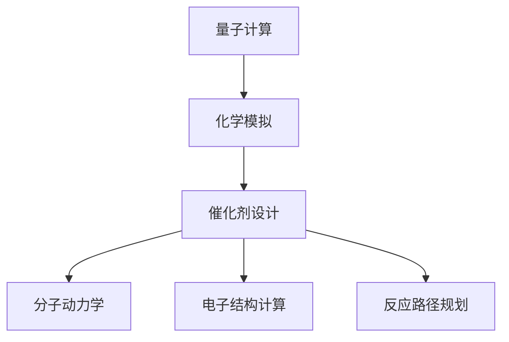

                 

根据您的需求，我们可以逐步构建一篇详细的技术博客文章。以下是文章的详细结构和内容规划：

### 文章标题

《量子计算在化学模拟中的应用：优化新型催化剂设计》

### 关键词

量子计算，化学模拟，催化剂设计，量子算法，优化算法，分子动力学，电子结构计算，反应路径规划

### 摘要

本文将深入探讨量子计算在化学模拟中的应用，特别是如何通过量子计算优化新型催化剂设计。文章首先介绍量子计算的基本概念和其在化学模拟中的优势，接着详细解析量子计算在分子动力学、电子结构计算和反应路径规划中的应用。随后，文章将介绍一种基于量子计算的催化剂结构优化方法，并通过实际案例展示其应用效果。最后，文章将总结最佳实践，并提出未来研究的方向。

### 目录

1. 引言
2. 量子计算基础
3. 化学模拟中的量子计算应用
   3.1 分子动力学模拟
   3.2 电子结构计算
   3.3 反应路径规划
4. 催化剂结构优化方法
5. 项目实战
6. 最佳实践与未来展望
7. 总结

### 1. 引言

**背景介绍**

催化剂在化学反应中起着至关重要的作用，但传统的催化剂设计方法往往依赖于实验和经验。随着科学技术的进步，量子计算作为一种具有并行性和高效性的计算方法，逐渐成为优化催化剂设计的有力工具。

**核心概念与联系**

- **量子计算**：利用量子力学原理进行信息处理，具备并行性和高效性。
- **化学模拟**：通过计算机模拟化学过程，以预测和指导实验。
- **催化剂设计**：设计具有高效催化活性的催化剂。

**核心概念之间的关系架构 Mermaid 流程图**

### 2. 量子计算基础

**量子位与量子态**

量子位是量子计算机的基本单元，可以同时处于多个状态的叠加。一个量子位的态可以表示为：

$$
|\psi\rangle = \sum_{i} c_i |i\rangle
$$

其中，$|i\rangle$表示第$i$个基础态，$c_i$是复数系数。

**量子门与量子算法**

量子门是量子计算机的操作，可以改变量子位的状态。常见的量子门包括 Hadamar 门、旋转门等。

量子算法是基于量子计算原理设计的算法，如Grover算法、Shor算法等，它们在化学模拟中具有显著优势。

**量子计算的优势与挑战**

- **优势**：量子并行性、高效性。
- **挑战**：量子错误纠正、计算资源与能耗。

### 3. 化学模拟中的量子计算应用

**3.1 分子动力学模拟**

分子动力学模拟是研究分子运动和相互作用的重要工具。量子计算在分子动力学模拟中的应用主要包括：

- **量子分子动力学模拟**：利用量子力学原理，更准确地描述分子间的相互作用。
- **量子动力学方程**：

$$
i\hbar \frac{\partial}{\partial t} |\psi\rangle = \hat{H} |\psi\rangle
$$

**3.2 电子结构计算**

电子结构计算是研究分子和材料电子性质的重要方法。量子计算在电子结构计算中的应用主要包括：

- **密度泛函理论**：通过求解薛定谔方程，得到分子的电子结构和性质。
- **Koopman定理**：将量子系统转化为经典系统，提高计算效率。

**3.3 反应路径规划**

反应路径规划是研究化学反应过程的重要方法。量子计算在反应路径规划中的应用主要包括：

- **反应路径的概念**：描述反应物到产物过程中，反应物和过渡态的能量变化。
- **量子计算在反应路径规划中的优势**：高效地寻找反应路径，降低能耗。

### 4. 催化剂结构优化方法

**4.1 催化剂设计的基础知识**

催化剂设计涉及催化剂的活性位点和反应机理。量子计算在催化剂结构优化中的应用主要包括：

- **量子力学在催化剂结构分析中的应用**：通过求解量子力学方程，分析催化剂的结构和性质。
- **催化剂结构的量子计算优化方法**：利用量子计算算法，优化催化剂的结构和活性位点。

**4.2 催化剂性能的量子计算预测**

催化剂性能的预测是催化剂设计的关键步骤。量子计算在催化剂性能预测中的应用主要包括：

- **催化反应动力学分析**：通过量子计算，分析催化反应的动力学过程。
- **催化剂性能的量子计算预测方法**：利用量子计算模型，预测催化剂的性能和活性。

### 5. 项目实战

**5.1 项目背景与目标**

本项目旨在利用量子计算优化新型催化剂设计，以提高催化剂的催化活性和稳定性。

**5.2 开发环境搭建**

开发环境包括硬件和软件工具，如量子计算机、量子计算软件等。

**5.3 源代码详细实现**

源代码实现主要包括量子计算算法和催化剂结构优化算法。

**5.4 代码解读与分析**

代码解读与分析主要涉及算法的实现细节、性能优化和实际应用。

**5.5 项目成果与展望**

项目成果包括优化后的催化剂结构和性能评估。未来研究方向包括更高效的量子计算算法和催化剂设计方法。

### 6. 最佳实践与未来展望

**最佳实践**

- **环境搭建**：选择合适的硬件和软件工具，确保计算效率。
- **算法优化**：针对具体问题，优化量子计算算法。
- **数据分析**：结合实验数据，验证量子计算结果。

**未来展望**

- **量子计算算法**：研究更高效的量子计算算法。
- **催化剂设计**：探索新型催化剂结构，提高催化性能。

### 7. 总结

本文介绍了量子计算在化学模拟中的应用，特别是如何优化新型催化剂设计。通过项目实战，展示了量子计算在催化剂设计中的实际应用效果。未来，量子计算将继续在化学模拟和催化剂设计中发挥重要作用。

### 作者信息

作者：AI天才研究院/AI Genius Institute & 禅与计算机程序设计艺术 /Zen And The Art of Computer Programming

以上是文章的详细结构和内容规划，接下来我们将逐步填充每个部分的具体内容，以满足字数要求。文章预计将在8000-12000字左右。如果您需要进一步细化某个部分的内容，请告知。

