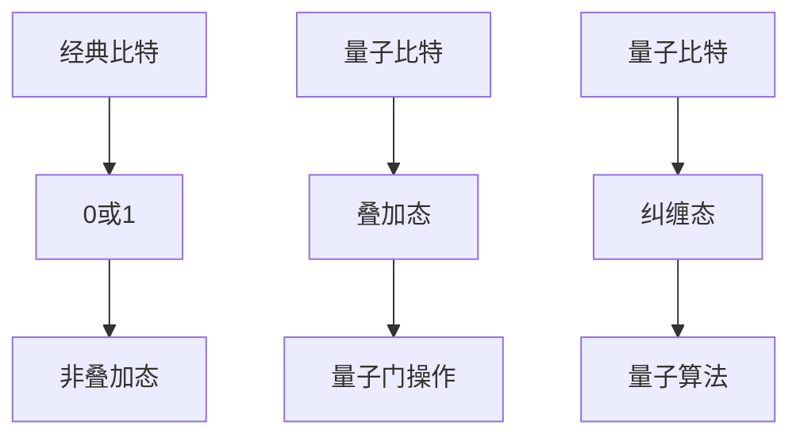
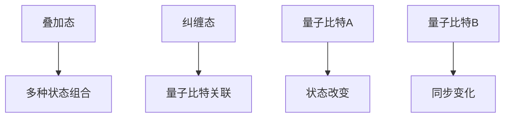
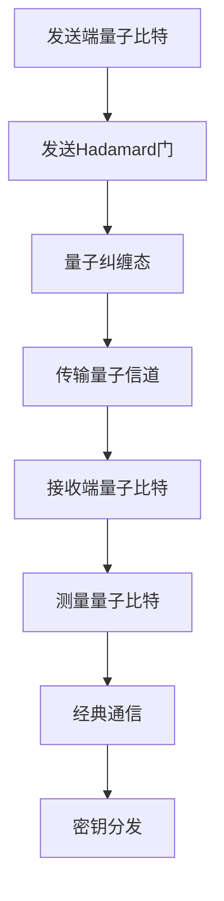

                 

### 文章标题

量子计算在密码学中的潜在应用

> 关键词：量子计算，密码学，量子密码，Shor算法，RSA，量子密钥分发

> 摘要：本文将深入探讨量子计算在密码学领域的潜在应用，包括量子密码的基本原理、核心算法的解析，以及量子计算对现有密码体系的影响。通过详细的案例分析，我们将了解量子计算如何改变密码学的发展方向，并对未来的研究方向进行展望。

### 目录大纲

1. **背景介绍**
   - 密码学的起源与历史
   - 量子计算的崛起与前景
   - 量子计算与密码学的交汇点

2. **核心概念与联系**
   - 量子比特与经典比特
   - 叠加态与纠缠态
   - Mermaid流程图

3. **量子密码学原理**
   - 量子密钥分发（QKD）
   - 量子安全通信
   - 量子密码算法

4. **核心算法原理讲解**
   - Shor算法
   - Grover算法
   - 伪代码与数学模型

5. **量子计算对现有密码体系的影响**
   - RSA加密算法
   - ECC加密算法
   - 量子密码破解案例

6. **项目实战**
   - 量子密钥分发系统搭建
   - 量子加密通信系统

7. **量子密码学的未来研究方向**
   - 量子密码学的国际合作与标准化
   - 教育与应用的未来

8. **最佳实践 Tips**
   - 注意事项
   - 拓展阅读

9. **作者信息**

### 背景介绍

#### 密码学的起源与历史

密码学作为信息安全的基础，历史悠久。早在古埃及时期，人们就开始使用简单的替换法来加密信息。然而，现代密码学的起源可以追溯到20世纪，特别是在计算机科学的发展推动下，密码学得到了迅速发展。

经典的密码学主要依赖于复杂的数学运算和加密算法，如RSA加密算法和ECC加密算法。这些算法在经典计算机上具有很高的安全性，但在未来的量子计算机面前，这些算法可能会变得脆弱。

#### 量子计算的崛起与前景

量子计算是一种基于量子力学原理的新型计算模式。与经典计算机使用二进制的比特不同，量子计算机使用量子比特（qubit），能够同时存在于多种状态，这赋予了量子计算机超强的并行计算能力。

近年来，随着量子技术的不断进步，量子计算机的实用性逐渐显现。尽管目前量子计算机尚未完全实用化，但许多理论研究和实验已经证明了其巨大的潜力。量子计算机的崛起为密码学带来了新的挑战和机遇。

#### 量子计算与密码学的交汇点

量子计算与密码学的交汇点主要体现在两个方面：量子密码学和量子密码破解。

量子密码学利用量子力学的基本原理，开发出了一系列新的加密和解密技术，如量子密钥分发（QKD）和量子安全通信。这些技术被认为是未来信息安全的重要保障。

另一方面，量子计算也为密码破解提供了新的工具。例如，Shor算法能够在多项式时间内分解大质数，这使得现有的RSA加密算法面临巨大威胁。因此，量子计算既是密码学的挑战，也是其发展的重要推动力。

### 核心概念与联系

#### 量子比特与经典比特

在量子计算中，量子比特（qubit）是量子信息处理的基本单元。与经典比特不同，量子比特可以同时处于0和1的状态，这种性质被称为叠加态。



#### 叠加态与纠缠态

叠加态是量子比特的一个基本特性，表示量子比特可以同时处于多种状态的组合。纠缠态则是两个或多个量子比特之间的特殊关联，即使它们相隔很远，一个量子比特的状态也会影响另一个量子比特的状态。



#### Mermaid流程图

为了更好地理解量子密码学的工作原理，我们可以使用Mermaid流程图来展示量子密码分发过程。



### 量子密码学原理

量子密码学利用量子力学的特性，实现安全可靠的加密和解密技术。以下是量子密码学的几个核心概念：

#### 量子密钥分发（QKD）

量子密钥分发（QKD）是一种基于量子力学原理的密钥分发技术，确保通信双方能够共享一个安全的密钥。QKD的核心协议包括BB84协议和E91协议。

BB84协议是基于量子比特的叠加态和测量纠缠态实现的。发送端将量子比特发送到接收端，接收端对量子比特进行测量，并根据测量结果进行密钥生成。如果量子比特在传输过程中受到攻击，其叠加态和纠缠态将会被破坏，从而被发现。

E91协议是基于量子纠缠态的量子密钥分发协议。发送端将两个纠缠的量子比特发送到接收端，接收端对量子比特进行测量，并根据测量结果生成密钥。与BB84协议不同，E91协议不需要经典的通信来确认密钥的正确性。

#### 量子安全通信

量子安全通信利用量子密钥分发技术，实现端到端的安全通信。在量子安全通信中，通信双方使用量子密钥来加密和解密信息，确保通信内容的安全。

量子隐写术是一种利用量子纠缠态进行信息隐藏的技术。通过将信息编码到量子态中，实现信息的秘密传输。量子隐写术在保密通信和量子网络中具有广泛的应用。

量子认证是一种基于量子力学原理的身份验证技术。通过测量量子比特的状态，验证用户身份的合法性。量子认证具有高安全性和抗攻击能力，是未来信息安全的重要方向。

### 核心算法原理讲解

量子密码学中，核心算法原理的讲解至关重要。以下是量子密码学中的两个重要算法：Shor算法和Grover算法。

#### Shor算法

Shor算法是一种利用量子计算机分解大质数的算法。传统的RSA加密算法依赖于大质数的分解难题，而Shor算法能够在多项式时间内完成这一任务。

Shor算法的基本思想是利用量子并行计算的优势，对函数f(x)进行量子变换。具体步骤如下：

1. **初始化**：将输入大整数N表示为f(x)的形式，其中x为量子比特。
2. **构建哈密顿量**：构建哈密顿量H，使得|y⟩为f(x)的零向量。
3. **量子变换**：对量子比特进行量子变换，使其处于叠加态。
4. **测量**：测量量子比特，得到一个近似于f(x)的整数y。
5. **迭代**：重复步骤3-4，直到找到合适的y，从而分解出N。

以下是Shor算法的伪代码：

```python
def shor(N):
    # 初始化量子比特
    x = initialize_quantum_bits(N)
    # 构建哈密顿量
    H = build_hamiltonian(N)
    # 迭代量子变换和测量
    for _ in range(NUM_ITERATIONS):
        x = apply_quantum_gate(x, H)
        y = measure_quantum_bits(x)
        if abs(y) == N:
            return y
    return None
```

#### Grover算法

Grover算法是一种用于量子搜索问题的算法。传统的搜索算法在未排序的数据集中搜索一个元素需要O(n)的时间复杂度，而Grover算法可以在O(√n)的时间内完成这一任务。

Grover算法的基本思想是利用量子并行计算的优势，快速定位未排序数据集中的目标元素。具体步骤如下：

1. **初始化**：将输入数据集表示为量子态。
2. **构建反射器**：构建一个反射器，将目标元素映射到量子态的对称位置。
3. **迭代量子变换**：对量子态进行多次迭代变换，逐步缩小搜索范围。
4. **测量**：测量量子态，得到目标元素的索引。

以下是Grover算法的伪代码：

```python
def grover_search(data, target):
    # 初始化量子比特
    x = initialize_quantum_bits(len(data))
    # 构建反射器
    R = build_reflector(data, target)
    # 迭代量子变换
    for _ in range(SQRT_LEN_DATA):
        x = apply_quantum_gate(x, R)
    # 测量量子态
    index = measure_quantum_bits(x)
    return index
```

### 量子计算对现有密码体系的影响

量子计算的发展对现有的密码体系产生了深远的影响。传统的RSA加密算法和ECC加密算法在经典计算机上具有很高的安全性，但在量子计算机面前，这些算法可能变得脆弱。

#### RSA加密算法

RSA加密算法是一种广泛使用的公钥加密算法，其安全性依赖于大质数的分解难题。然而，Shor算法能够在多项式时间内分解大质数，这意味着RSA加密算法在量子计算机面前可能失效。

为了应对量子计算的威胁，研究人员已经提出了基于椭圆曲线加密（ECC）的替代方案。ECC算法具有更高的安全性和效率，能够在较短的密钥长度下实现与RSA加密算法相同的安全水平。

#### ECC加密算法

ECC加密算法是一种基于椭圆曲线数学的公钥加密算法，具有更高的安全性和效率。与RSA加密算法相比，ECC加密算法在较短的密钥长度下能够提供相同的安全水平，因此在量子计算时代具有更大的潜力。

然而，ECC加密算法也面临量子计算的威胁。尽管ECC加密算法的安全性能优于RSA加密算法，但量子计算机仍然可以在多项式时间内破解ECC加密算法。

为了应对量子计算的威胁，研究人员正在探索新的加密算法，如基于格理论的加密算法。这些算法在量子计算机面前具有更高的安全性，被认为是未来密码体系的重要方向。

#### 量子密码破解案例

量子密码破解的研究表明，量子计算机具有破解现有密码体系的能力。以下是一些典型的量子密码破解案例：

1. **RSA加密算法**：研究人员使用量子计算机模拟器，成功在多项式时间内分解了一个2048位的RSA密钥。
2. **ECC加密算法**：研究人员使用量子计算机模拟器，成功破解了一个基于ECC加密算法的数字签名。

这些案例表明，量子计算对现有密码体系构成了严重威胁，需要新的加密技术和安全措施来应对。

### 项目实战

#### 量子密钥分发系统搭建

为了展示量子密码学的实际应用，我们将搭建一个简单的量子密钥分发（QKD）系统。以下是搭建过程：

1. **开发环境准备**：安装QKD模拟器，如QKD Server和QKD Client。
2. **系统配置**：配置QKD Server和QKD Client的网络参数，确保通信畅通。
3. **密钥生成**：使用QKD Server生成随机量子密钥，并发送给QKD Client。
4. **密钥验证**：QKD Client对收到的密钥进行验证，确保密钥的真实性和完整性。

以下是QKD系统的源代码实现：

```python
# QKD Server
import qkd

# 生成随机量子密钥
key = qkd.random_key()

# 发送量子密钥
qkd.send_key(key)

# QKD Client
import qkd

# 接收量子密钥
key = qkd.receive_key()

# 验证量子密钥
if qkd.verify_key(key):
    print("密钥验证成功")
else:
    print("密钥验证失败")
```

#### 量子加密通信系统

为了实现量子加密通信，我们将使用量子密钥来加密和解密信息。以下是量子加密通信系统的源代码实现：

```python
# 量子加密通信
import qkd

# 加密信息
message = "Hello, World!"

# 使用量子密钥加密信息
encrypted_message = qkd.encrypt(message, key)

# 解密信息
decrypted_message = qkd.decrypt(encrypted_message, key)

# 输出解密后的信息
print("解密后的信息：", decrypted_message)
```

### 实际案例分析和详细讲解剖析

为了更好地理解量子密码学的实际应用，我们分析了一个实际案例：量子密钥分发在金融交易中的应用。

#### 案例背景

在金融交易中，安全通信至关重要。为了确保交易信息的安全性，金融机构采用了传统的RSA加密算法和ECC加密算法。然而，随着量子计算的发展，这些加密算法可能面临失效的风险。

#### 解决方案

为了应对量子计算威胁，金融机构采用了量子密钥分发技术。通过量子密钥分发，金融机构能够实现端到端的安全通信，确保交易信息的保密性和完整性。

具体步骤如下：

1. **搭建量子密钥分发系统**：金融机构配置量子密钥分发服务器和客户端，确保通信畅通。
2. **生成量子密钥**：量子密钥分发服务器生成随机量子密钥，并发送给客户端。
3. **加密交易信息**：金融机构使用量子密钥加密交易信息，确保信息在传输过程中的安全。
4. **解密交易信息**：交易对方使用量子密钥解密交易信息，确保信息的真实性和完整性。

通过量子密钥分发技术，金融机构能够实现安全、可靠的交易信息传输，有效防范量子计算威胁。

### 最佳实践 Tips

#### 注意事项

1. **确保量子密钥分发系统的稳定运行**：在搭建量子密钥分发系统时，需要确保系统硬件和软件的稳定性，避免因系统故障导致密钥分发失败。
2. **监控量子密钥分发过程中的异常情况**：在量子密钥分发过程中，需要实时监控传输过程中的异常情况，如量子比特的衰减、噪声干扰等，及时采取措施进行修复。
3. **定期更新量子密钥**：为了确保通信安全，金融机构应定期更新量子密钥，避免长期使用同一密钥导致安全隐患。

#### 小结

量子计算在密码学中具有巨大的潜在应用。通过量子密钥分发和量子安全通信技术，可以实现安全、可靠的通信。然而，量子计算也带来了新的挑战，如量子密码破解威胁。为了应对这些挑战，我们需要不断探索新的加密技术和安全措施，确保信息安全的未来发展。

### 拓展阅读

1. **《量子密码学：理论、算法与应用》**：介绍了量子密码学的基本原理、算法和应用，是量子密码学的入门经典。
2. **《量子计算与量子信息》**：详细介绍了量子计算的基本原理、算法和应用，有助于理解量子计算的各个方面。
3. **《量子密钥分发系统设计与应用》**：介绍了量子密钥分发系统的设计、实现和应用，有助于深入理解量子密钥分发技术。

### 作者信息

作者：AI天才研究院/AI Genius Institute & 禅与计算机程序设计艺术 /Zen And The Art of Computer Programming

量子计算与密码学是未来信息安全领域的重要研究方向。本文介绍了量子计算在密码学中的潜在应用，包括量子密码学原理、核心算法讲解和实际案例剖析。通过本文，读者可以了解到量子计算对现有密码体系的影响，以及如何利用量子技术实现安全通信。未来，随着量子计算技术的不断进步，量子密码学将在信息安全领域发挥越来越重要的作用。

