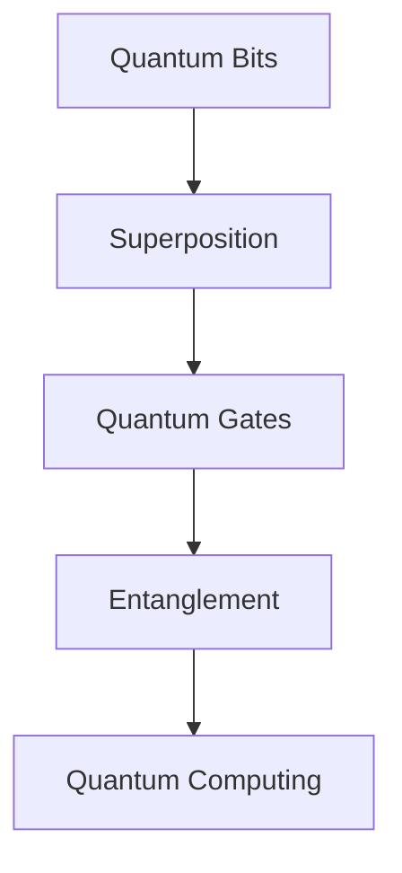
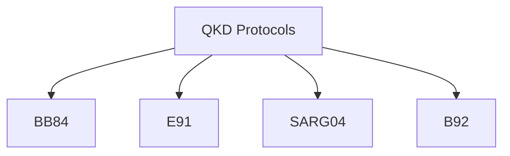
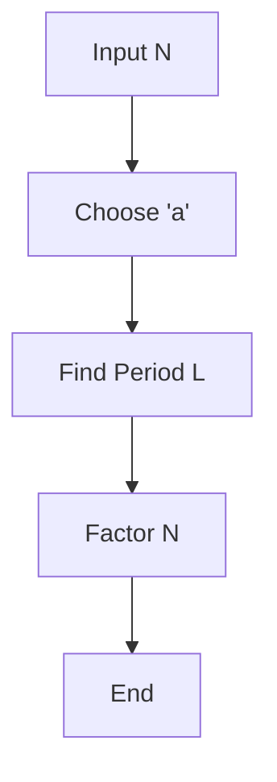
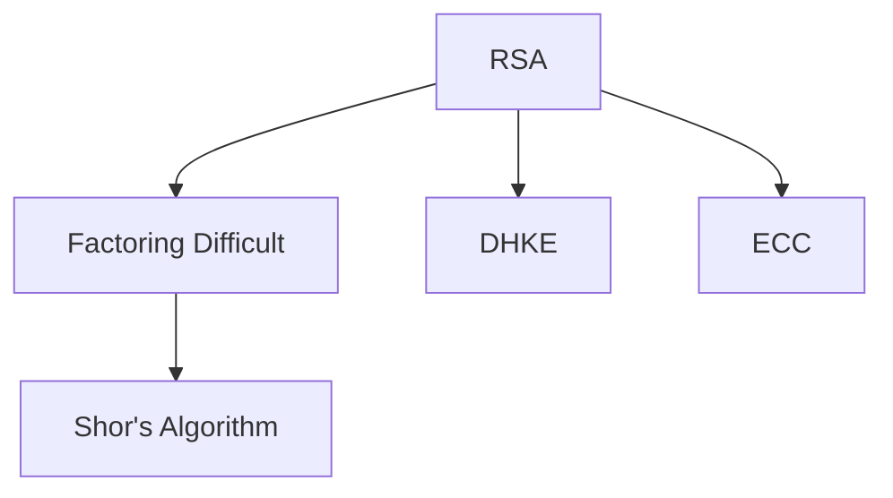
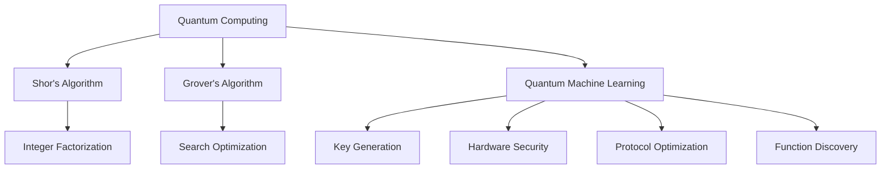

                 

### Quantum Computing in Cryptography: A Potential Revolution

#### Keywords
- Quantum computing
- Cryptography
- Quantum key distribution
- Quantum algorithms
- Post-quantum cryptography

#### Abstract
Quantum computing is rapidly emerging as a transformative technology with the potential to revolutionize various fields, including cryptography. This article delves into the world of quantum computing and its implications for cryptography. We will explore the basic principles of quantum mechanics, quantum bits (qubits), quantum gates, superposition, and entanglement. Following this, we will discuss quantum cryptography, including quantum key distribution (QKD) and its protocols, such as BB84 and E91. The article will then delve into quantum algorithms, particularly Shor's algorithm, and its impact on cryptography. We will also examine the implications of quantum computing for classical cryptographic algorithms and explore post-quantum cryptography. The current state and future trends of quantum cryptography will be discussed, highlighting the challenges and opportunities this field presents.

### Introduction to Quantum Computing

Quantum computing represents a paradigm shift from classical computing, leveraging the principles of quantum mechanics to perform computations that would be infeasible for classical computers. To understand quantum computing, we must first delve into the basic principles of quantum mechanics.

#### Quantum Mechanics Overview

Quantum mechanics is a fundamental theory in physics that describes the physical properties of nature at the scale of atoms and subatomic particles. Unlike classical mechanics, which treats particles as point-like objects with definite positions and velocities, quantum mechanics describes particles as wavefunctions that exist in a state of superposition until they are measured. This means that a quantum particle can simultaneously exist in multiple states, and the act of measurement collapses the superposition into a single state.

#### Quantum比特和量子状态

At the heart of quantum computing are quantum bits, or qubits. Unlike classical bits, which can represent either a 0 or a 1, qubits can represent both 0 and 1 simultaneously due to the principle of superposition. This means that a quantum register with n qubits can represent 2^n different states simultaneously, offering a massive increase in computational power compared to classical computers.

Qubits can exist in a state of superposition, which can be represented mathematically as a linear combination of 0 and 1. For example, a qubit in a superposition state can be represented as:

$$
\psi = \alpha |0\rangle + \beta |1\rangle
$$

where $|\alpha|^2$ and $|\beta|^2$ represent the probabilities of measuring the qubit in the state 0 or 1, respectively.

#### Quantum Gates and Operations

To perform computations on qubits, we use quantum gates, which are analogous to classical logic gates. Quantum gates operate on qubits and transform their state according to specific rules. Some common quantum gates include the Pauli-X gate (bit flip), Pauli-Z gate (phase flip), Hadamard gate (superposition), and Controlled-NOT (CNOT) gate (entanglement).

For example, the Pauli-X gate can be represented as:

$$
X = \begin{pmatrix}
0 & 1 \\
1 & 0
\end{pmatrix}
$$

Applying the X gate to a qubit in state $|0\rangle$ would flip its state to $|1\rangle$, while applying it to a qubit in state $|1\rangle$ would flip it back to $|0\rangle$.

#### Quantum Superposition and Entanglement

Quantum superposition allows qubits to exist in multiple states simultaneously, which is a crucial feature for quantum computing. For example, a two-qubit system can exist in the state:

$$
\psi = \frac{1}{\sqrt{2}}(|00\rangle + |11\rangle)
$$

This means that the two-qubit system is in a superposition of the states $|00\rangle$ and $|11\rangle$.

Quantum entanglement is another fundamental property of quantum systems. When two qubits become entangled, the state of one qubit becomes dependent on the state of the other, regardless of the distance between them. This correlation between entangled qubits allows for powerful quantum algorithms and is crucial for many quantum cryptographic protocols.

#### Mermaid Flowchart: Quantum Computing Core Concepts

To illustrate the core concepts of quantum computing, we can use a Mermaid flowchart to visualize the relationship between quantum bits, quantum gates, superposition, and entanglement:



In this flowchart, we see that quantum bits are the foundation of quantum computing, enabling superposition and entanglement, which are essential for performing complex computations.

### Quantum Cryptography Fundamentals

Quantum cryptography leverages the principles of quantum mechanics to provide secure communication channels. One of the most prominent applications of quantum cryptography is quantum key distribution (QKD), which enables two parties to share a secret key with absolute security. In this section, we will explore the fundamentals of quantum cryptography, focusing on QKD and its protocols.

#### Quantum Key Distribution (QKD)

Quantum Key Distribution (QKD) is a method of securely distributing encryption keys between two parties using quantum communication. The key feature of QKD is that any attempt to eavesdrop on the communication will inevitably be detected, ensuring the security of the shared key.

The basic idea behind QKD is to use the properties of quantum mechanics to transmit information in such a way that any third party trying to intercept the communication will inevitably disturb the quantum state and be detected. The most common QKD protocol is the BB84 protocol, which we will discuss in detail later.

#### Principles and Protocols of QKD

The BB84 protocol, proposed by Charles Bennett and Gilles Brassard in 1984, is one of the most widely studied QKD protocols. The protocol involves two parties, Alice and Bob, who want to share a secret key. Here's a high-level overview of the BB84 protocol:

1. **Encoding**: Alice generates a random string of 0s and 1s and encodes each bit into a quantum state using the basis chosen randomly from two mutually orthogonal bases, {H} and {V}.

2. **Transmission**: Alice sends the quantum states to Bob over a quantum channel. Any eavesdropping on this channel will inevitably cause disturbances in the quantum states.

3. **Measurement**: Bob measures the quantum states using the same basis as Alice. Since he does not know the basis chosen by Alice, he will get a random mix of 0s and 1s.

4. **Error Correction**: Alice and Bob communicate classically to compare the basis used in step 2 and correct any errors in the key. They retain only the bits where the basis matched.

5. **Privacy Amplification**: To further ensure the security of the key, Alice and Bob perform a privacy amplification step, where they discard any remaining information that an eavesdropper might have obtained.

The BB84 protocol guarantees security based on the principles of quantum mechanics, particularly the no-cloning theorem and the principle of quantum entanglement. Any attempt by an eavesdropper to intercept the quantum states will inevitably be detected, as it will disrupt the quantum entanglement and cause errors in the key.

#### Security Proofs and Challenges of QKD

The security of QKD protocols has been extensively studied, and several mathematical proofs have been provided to demonstrate their security. However, QKD is not without its challenges.

One significant challenge is the practical implementation of QKD systems, which require high-quality quantum sources, reliable quantum channels, and efficient classical communication channels for error correction and privacy amplification. Current QKD systems typically use photons as quantum bits and optical fibers or free space as quantum channels.

Another challenge is the threat of side-channel attacks, where an eavesdropper might obtain information about the quantum states through unintended physical channels, such as timing information or light intensity. To counter these attacks, researchers are developing quantum memories and other technologies to store and process quantum information more securely.

#### Quantum Cryptographic Protocols

In addition to QKD, several other quantum cryptographic protocols have been proposed and studied. Some notable examples include the E91 protocol, the SARG04 protocol, and the B92 protocol.

The E91 protocol, proposed by Artur Ekert in 1991, is a quantum key distribution protocol based on the principle of entanglement. It leverages the properties of entangled qubits to achieve security, similar to the BB84 protocol. The SARG04 protocol, proposed by Sarghi et al. in 2004, is a quantum key distribution protocol based on the principle of quantum teleportation. The B92 protocol, proposed by Barbara Briegel and colleague in 1992, is another entanglement-based quantum key distribution protocol that offers higher key rates compared to the BB84 protocol.

These protocols demonstrate the versatility and power of quantum cryptography and provide alternative methods for secure communication in the face of quantum computing threats.

#### Mermaid Flowchart: Quantum Cryptographic Protocols

To illustrate the relationship between different quantum cryptographic protocols, we can use a Mermaid flowchart:



In this flowchart, we see that QKD protocols, such as BB84, E91, SARG04, and B92, form a hierarchy of quantum cryptographic protocols, each offering different advantages and security properties.

### Quantum Cryptography vs. Classical Cryptography

Quantum cryptography represents a significant departure from classical cryptography, offering both advantages and limitations. Understanding these differences is crucial for evaluating the potential impact of quantum computing on cryptography.

#### Fundamental Differences

One of the most fundamental differences between quantum cryptography and classical cryptography is the underlying principles they are based on. Quantum cryptography leverages the principles of quantum mechanics, such as superposition and entanglement, to achieve secure communication. In contrast, classical cryptography relies on mathematical problems, such as integer factorization and discrete logarithms, that are believed to be difficult to solve efficiently.

Another key difference is the security guarantees provided by each approach. Quantum cryptography offers provable security based on the principles of quantum mechanics, ensuring that any attempt to eavesdrop on the communication will be detected. Classical cryptography, on the other hand, relies on the assumption that certain mathematical problems are hard to solve, making it difficult for an attacker to break the encryption.

#### Quantum Cryptography Advantages

Quantum cryptography offers several advantages over classical cryptography, particularly in the context of quantum computing.

One of the most significant advantages of quantum cryptography is its ability to provide provable security. Quantum key distribution (QKD) protocols, such as BB84 and E91, offer a high level of security based on the principles of quantum mechanics, ensuring that any attempt to eavesdrop on the communication will be detected.

Another advantage of quantum cryptography is its resistance to quantum attacks. Classical cryptographic algorithms, such as RSA and ECC, are vulnerable to quantum attacks, such as Shor's algorithm. Quantum cryptography, however, offers a robust solution to these threats, providing secure communication channels even in the presence of powerful quantum computers.

#### Quantum Cryptography Limitations

Despite its advantages, quantum cryptography also has some limitations that need to be addressed.

One significant limitation is the practical implementation of quantum cryptography systems. QKD systems require high-quality quantum sources, reliable quantum channels, and efficient classical communication channels for error correction and privacy amplification. These requirements make QKD systems more complex and expensive to implement compared to classical cryptographic systems.

Another limitation is the scalability of quantum cryptography. While QKD protocols offer a high level of security, they are limited by the distance over which quantum communication can be maintained. Current QKD systems typically operate over distances of a few tens of kilometers, and extending this distance requires significant technological advancements.

#### Future Directions

To overcome these limitations and fully harness the potential of quantum cryptography, several future directions are being explored.

One promising direction is the development of quantum repeaters, which could extend the distance over which quantum communication can be maintained. Quantum repeaters would enable long-distance quantum communication and enable the deployment of global quantum networks.

Another direction is the integration of quantum cryptography with classical cryptography, creating hybrid systems that leverage the strengths of both approaches. For example, classical cryptographic algorithms could be used for initial key establishment, while QKD protocols could be used to periodically refresh the keys and ensure their security.

In conclusion, quantum cryptography offers a promising solution to the security challenges posed by quantum computing. While there are still challenges to be addressed, the ongoing research and development in this field hold the potential to revolutionize the way we secure communication in the quantum era.

### Shor's Algorithm and Its Impact on Cryptography

Shor's algorithm, proposed by mathematician Peter Shor in 1994, represents one of the most significant breakthroughs in the field of quantum computing. This algorithm provides a polynomial-time solution to two of the most fundamental problems in classical cryptography: integer factorization and discrete logarithm. The implications of Shor's algorithm for cryptography are profound, as it suggests that many widely used classical cryptographic algorithms may become insecure in the face of quantum computers.

#### Algorithm Overview

Shor's algorithm is an algorithm for factoring large integers and computing discrete logarithms. The algorithm works as follows:

1. **Input**: An odd integer `N` to be factored.

2. **Phase 1: Factoring Algorithm**
   - Shor's algorithm uses a quantum algorithm called the quantum period-finding algorithm to find a non-trivial period `L` of a function `f(x) = ax ≡ 1 (mod N)` for some integer `a`.
   - If a non-trivial period `L` is found, then `N` can be factored as `N = (x^L - 1) / (x - 1)`.

3. **Phase 2: Discrete Logarithm Algorithm**
   - If the integer `N` is prime, Shor's algorithm can be used to compute the discrete logarithm of `a` with respect to `N`. This is achieved by using the quantum fast exponentiation algorithm to compute `a^x ≡ 1 (mod N)` for various `x` values until the correct discrete logarithm is found.

The key to the efficiency of Shor's algorithm is the use of quantum parallelism and quantum Fourier transform, which allow the algorithm to perform certain computations exponentially faster than classical algorithms.

#### Pseudocode Explanation

The following is a high-level pseudocode of Shor's algorithm:

```plaintext
function Shor(N):
    # Choose a random number 'a' such that 1 < a < N and gcd(a, N) = 1
    a = random(2, N-1)

    # Use quantum period-finding algorithm to find a non-trivial period L
    L = QuantumPeriodFinding(a, N)

    # Factor N using the period L
    if L is even:
        P = (a^(L/2)) - 1
        Q = (a^(L/2)) + 1
        N = P * Q
        return (P, Q)
    else:
        # If L is odd, use quantum fast exponentiation to find discrete logarithm
        x = QuantumFastExponentiation(a, L, N)
        return (x, N - x)
```

In this pseudocode, the `QuantumPeriodFinding` and `QuantumFastExponentiation` functions represent the quantum algorithms used in Phase 1 and Phase 2 of Shor's algorithm, respectively.

#### Application in Cryptography

Shor's algorithm has significant implications for classical cryptography, particularly for public-key cryptosystems such as RSA and elliptic curve cryptography (ECC). These cryptosystems rely on the difficulty of integer factorization and discrete logarithm problems, which Shor's algorithm can solve efficiently.

For RSA, if an attacker can factor large integers quickly using Shor's algorithm, they can easily break RSA encryption by recovering the private key from the public key. This means that the security of RSA-based systems would be compromised if quantum computers become widely available.

Similarly, ECC is vulnerable to Shor's algorithm. Shor's algorithm can compute discrete logarithms in polynomial time, making ECC-based systems insecure against quantum attacks. This highlights the need for post-quantum cryptography, which aims to develop new cryptographic algorithms that are secure against quantum computer attacks.

#### Countermeasures: Post-Quantum Cryptography

To counter the threat posed by Shor's algorithm, researchers are developing post-quantum cryptography (PQC) algorithms that are resistant to quantum computer attacks. These algorithms are designed to provide security based on problems that are believed to be difficult for both classical and quantum computers to solve.

Some prominent post-quantum cryptographic algorithms include:

- **Lattice-based Cryptography**: This approach uses the difficulty of solving lattice problems, such as the Shortest Vector Problem (SVP) and the Closest Vector Problem (CVP), as the basis for cryptographic security.
  
- **Multivariate Polynomial Cryptography**: This approach uses multivariate polynomial equations to construct cryptographic functions that are resistant to both classical and quantum attacks.

- **Hash-Based Cryptography**: This approach uses hash functions to construct cryptographic primitives, such as digital signatures and encryption algorithms.

- **Code-Based Cryptography**: This approach uses error-correcting codes to construct cryptographic functions that are resistant to attacks.

These post-quantum cryptographic algorithms are being standardized and deployed in various applications to ensure that cryptographic systems remain secure even in the presence of quantum computers.

#### Mermaid Flowchart: Shor's Algorithm

To illustrate Shor's algorithm, we can use a Mermaid flowchart:



In this flowchart, we see that Shor's algorithm involves choosing a random number `a`, finding a non-trivial period `L` using a quantum algorithm, and then factoring the input integer `N`.

### Quantum Factoring and Its Implications

The ability to efficiently factor large integers is a cornerstone of many cryptographic systems. Traditional public-key cryptosystems, such as RSA and the Rivest-Shamir-Adleman (RSA) algorithm, rely on the computational difficulty of factoring large numbers into their prime factors. With the advent of quantum computing, this difficulty is significantly undermined by Shor's algorithm, which can factor large integers in polynomial time. This section explores the implications of quantum factoring and its impact on cryptographic algorithms.

#### Quantum Factoring Algorithms

As previously discussed, Shor's algorithm provides a polynomial-time solution to the problem of integer factorization. It does so by leveraging quantum parallelism and the quantum Fourier transform. The algorithm can be summarized in the following steps:

1. **Select a Random Integer `a`**: Choose an integer `a` such that `1 < a < N` and `gcd(a, N) = 1`. This ensures that the modular exponentiation `a^x ≡ 1 (mod N)` has a non-trivial period.

2. **Compute GCD**: Compute the greatest common divisor (GCD) of `a^((N-1)/2) - 1` and `N`. This step will yield a non-trivial factor of `N` if a non-trivial period `L` exists.

3. **Factorize**: If the GCD is not 1, then it is a non-trivial factor of `N`. If the GCD is 1, repeat the process with a different random `a` until a non-trivial factor is found. Once a non-trivial factor is found, `N` can be factored as `N = P * Q`, where `P` and `Q` are the factors.

The quantum Fourier transform is a crucial component of Shor's algorithm, enabling the efficient computation of the period `L`. The period-finding problem can be formulated as a linear systems problem, which the quantum Fourier transform solves efficiently using quantum parallelism.

#### Cryptographic Algorithms Vulnerable to Quantum Computing

The ability to factor large integers efficiently has profound implications for several widely used cryptographic algorithms, primarily those based on the difficulty of factoring large numbers. The most notable victims include:

**RSA Cryptography**

RSA is one of the most popular public-key cryptosystems. It relies on the assumption that factoring large integers is computationally infeasible. However, Shor's algorithm changes this assumption entirely, enabling polynomial-time factoring of large RSA moduli.

**Elliptic Curve Cryptography (ECC)**

Elliptic Curve Cryptography (ECC) is another widely used public-key cryptosystem that relies on the difficulty of the Elliptic Curve Discrete Log Problem (ECDLP). While the ECDLP is believed to be quantum-resistant, Shor's algorithm can still be used to solve certain variants of the problem, such as the Supersingular Isogeny Key Exchange (SIKE), making ECC vulnerable to quantum attacks.

**Diffie-Hellman Key Exchange**

The Diffie-Hellman Key Exchange (DHKE) is a method for secure key exchange over an insecure channel. It relies on the computational difficulty of the Discrete Log Problem (DLP). Shor's algorithm can efficiently solve the DLP, posing a significant threat to the security of DHKE in the quantum era.

#### Post-Quantum Cryptography

To mitigate the threats posed by quantum computing, the field of post-quantum cryptography (PQC) has emerged. PQC focuses on developing cryptographic algorithms that are secure against both classical and quantum computer attacks. Several post-quantum cryptographic algorithms have been proposed and are under active research and standardization:

1. **Lattice-Based Cryptography**: Lattice-based cryptography is one of the most promising post-quantum cryptographic approaches. It is based on the hardness of problems like the Shortest Vector Problem (SVP) and the Closest Vector Problem (CVP). NTRU and Lattice-based encryption schemes like NIST's proposed Kyber and Code-Based Cryptography are examples of lattice-based algorithms.

2. **Hash-Based Cryptography**: Hash-based cryptography uses cryptographic hash functions to build digital signatures and encryption algorithms. The Merkle Signature Scheme and the GHash Signature Scheme are examples of hash-based cryptography.

3. **Multivariate Polynomial Cryptography**: This approach involves constructing cryptographic functions based on multivariate polynomial equations. NIST's proposed Rainbow and LPN (Lattice-based Public Key Encryption) are examples of multivariate polynomial cryptography.

4. **Code-Based Cryptography**: Code-based cryptography relies on error-correcting codes to construct cryptographic algorithms. The McEliece Cryptosystem is a notable example of code-based cryptography.

These post-quantum cryptographic algorithms are designed to provide security that withstands both classical and quantum computer attacks, ensuring that cryptographic systems remain secure in the face of technological advancements.

#### Mermaid Flowchart: Cryptographic Algorithms Vulnerable to Quantum Computing

To illustrate the cryptographic algorithms vulnerable to quantum computing, we can use a Mermaid flowchart:



In this flowchart, we see that RSA, DHKE, and ECC are vulnerable to quantum computing due to the existence of efficient quantum algorithms like Shor's for factoring and discrete logarithm problems.

### Other Quantum Algorithms and Cryptographic Applications

Beyond Shor's algorithm and quantum factoring, quantum computing offers a plethora of other algorithms and techniques that have significant implications for cryptography. These quantum algorithms extend the power of quantum computers to solve a variety of problems more efficiently than classical algorithms, potentially revolutionizing various cryptographic applications. In this section, we will explore some of these algorithms, including quantum search algorithms and their potential impact on cryptography, as well as quantum machine learning in cryptographic applications.

#### Quantum Search Algorithms

Quantum search algorithms are a class of quantum algorithms designed to solve the problem of searching an unsorted database. The most well-known quantum search algorithm is Grover's algorithm, which provides a quadratic speedup over classical search algorithms. Grover's algorithm works by exploiting the superposition and interference properties of quantum states to efficiently find a specific item in an unsorted database.

The basic idea behind Grover's algorithm is to construct a quantum state that represents the superposition of all possible database states, with an amplitude proportional to the number of marked items (those we are searching for). The algorithm then applies a quantum operator that amplifies the amplitudes of the marked items and suppresses the amplitudes of the unmarked items. By performing a classical measurement on this state, we obtain the location of the marked item with a high probability.

The following is a high-level pseudocode of Grover's algorithm:

```plaintext
function GroverSearch(database, markedItems):
    # Initialize the superposition state of all database items
    state = Superposition(database)

    # Define the quantum operator for Grover's algorithm
    operator = GroverOperator(markedItems)

    # Apply the operator to amplify the amplitudes of marked items
    state = operator * state

    # Perform a classical measurement to obtain the index of the marked item
    index = Measurement(state)

    return index
```

In this pseudocode, the `Superposition` function initializes the quantum state representing all possible database states, and the `GroverOperator` function constructs the quantum operator that amplifies the amplitudes of marked items. The `Measurement` function performs a classical measurement to obtain the index of the marked item.

#### Quantum Search and Cryptography

Quantum search algorithms have several potential applications in cryptography. For example, they can be used to optimize cryptographic protocols that involve searching for specific keys or values. One such application is in quantum secure communications, where Grover's algorithm can be used to efficiently search for a secret key in a large key space, potentially speeding up key establishment processes.

Another application is in cryptanalysis, where quantum search algorithms can be used to search for specific patterns or keys in ciphertexts, potentially leading to the development of new cryptanalytic attacks. For instance, quantum search algorithms could be used to break certain types of hash functions or cryptographic schemes that rely on the difficulty of searching large spaces.

#### Quantum Machine Learning in Cryptography

Quantum machine learning (QML) combines the principles of quantum computing with machine learning to develop new algorithms and techniques for data analysis and pattern recognition. Quantum machine learning algorithms leverage the power of quantum computers to perform tasks more efficiently than classical machine learning algorithms, particularly when dealing with large and complex datasets.

In the field of cryptography, quantum machine learning can be used for various applications, including:

1. **Key Generation and Distribution**: Quantum machine learning algorithms can potentially improve the generation and distribution of cryptographic keys by analyzing large sets of data to identify patterns and correlations that can enhance key security.

2. **Cryptographic Hardware Security**: Quantum machine learning can be used to detect and prevent attacks on cryptographic hardware, such as side-channel attacks, by analyzing data from the hardware and identifying abnormal behavior.

3. **Cryptographic Protocol Optimization**: Quantum machine learning can help optimize cryptographic protocols by analyzing large datasets to identify the most efficient algorithms and parameters for specific applications.

4. **Cryptographic Function Discovery**: Quantum machine learning can be used to discover new cryptographic functions and algorithms by analyzing large datasets of existing cryptographic schemes to identify patterns and correlations that lead to novel and secure constructions.

#### Mermaid Flowchart: Quantum Algorithms and Cryptography

To illustrate the relationship between quantum algorithms and cryptography, we can use a Mermaid flowchart:



In this flowchart, we see that quantum computing enables various algorithms, such as Shor's algorithm for integer factorization, Grover's algorithm for search optimization, and quantum machine learning for key generation, hardware security, protocol optimization, and function discovery, each contributing to different aspects of cryptography.

### Current State and Future Trends of Quantum Cryptography

Quantum cryptography, particularly quantum key distribution (QKD), has made significant strides in recent years, demonstrating the potential to revolutionize secure communication. However, the practical deployment of quantum cryptographic systems faces several challenges that need to be addressed. This section discusses the current state of quantum cryptography, highlights key experimental achievements and implementations, and explores the future trends and challenges in this emerging field.

#### Experimental Achievements and Implementations

Over the past decade, numerous experimental achievements have been made in the field of quantum cryptography. One of the most significant milestones is the successful implementation of QKD over long distances. In 2012, researchers at the National University of Singapore and the Chinese Academy of Sciences achieved the first QKD communication over a distance of 97 km using optical fibers. Since then, several long-distance QKD experiments have been conducted, pushing the record distance to over 1,200 km using satellite-based QKD.

Another notable achievement is the demonstration of QKD in real-world scenarios. In 2019, researchers at the University of Science and Technology of China successfully conducted a QKD experiment between two cities, Shanghai and Hefei, over a distance of 1,200 km using a satellite link. This experiment marked a significant step towards the deployment of a global QKD network.

Furthermore, various quantum cryptographic protocols, such as the BB84 and E91 protocols, have been experimentally verified and demonstrated in different setups. These experiments have provided valuable insights into the security and practicality of quantum cryptographic systems.

#### Challenges and Opportunities

Despite these achievements, the practical deployment of quantum cryptographic systems faces several challenges. One major challenge is the technological maturity of the components required for QKD. High-quality quantum sources, reliable quantum channels, and efficient classical communication channels for error correction and privacy amplification are essential for the successful implementation of QKD systems. However, current technology is still limited, and significant advancements are needed to overcome these challenges.

Another challenge is the scalability of quantum cryptographic systems. While QKD systems have demonstrated success over short and medium distances, extending the distance over which QKD can be maintained remains a significant challenge. This is due to the loss and noise inherent in quantum channels, which limit the transmission distance of quantum signals. Developing quantum repeaters and entanglement distribution techniques that can extend the distance of QKD communication is a key area of research.

The security of quantum cryptographic systems also needs to be continuously verified and updated. As our understanding of quantum mechanics and quantum attacks evolves, new vulnerabilities and attack vectors may emerge. It is crucial to develop robust security protocols and methods to detect and counteract potential quantum attacks.

Despite these challenges, quantum cryptography offers numerous opportunities for secure communication and data protection. The ability to provide provable security and resistance to quantum computer attacks makes quantum cryptography an essential tool for securing information in the quantum era. As technology advances and quantum cryptographic systems become more practical, we can expect to see their widespread deployment in various applications, from secure communication networks to secure data storage and processing.

#### Future Directions

The future of quantum cryptography lies in overcoming the current challenges and pushing the boundaries of what is possible. Some key future directions include:

1. **Quantum Repeaters and Entanglement Distribution**: Developing quantum repeaters and efficient entanglement distribution techniques that can extend the distance over which QKD can be maintained is a priority. This would enable the deployment of global quantum communication networks.

2. **Integration with Classical Cryptography**: Combining quantum and classical cryptographic techniques to create hybrid systems that leverage the strengths of both approaches can provide enhanced security. For example, using QKD for initial key establishment and classical cryptographic algorithms for secure communication can create a robust and secure communication system.

3. **Quantum Internet**: The development of a quantum internet, where quantum cryptographic systems are integrated into the existing global communication infrastructure, is a long-term goal. This would enable secure communication on a global scale, protecting against both classical and quantum computer attacks.

4. **Quantum-resistant Cryptography**: As quantum computers become more powerful, it is essential to develop new cryptographic algorithms that are resistant to both classical and quantum attacks. Post-quantum cryptography is an ongoing area of research that aims to develop these algorithms.

In conclusion, quantum cryptography represents a promising frontier in secure communication and data protection. While there are significant challenges to overcome, the ongoing research and development in this field hold the potential to revolutionize the way we secure information in an increasingly interconnected world.

### Conclusion and Future Directions

Quantum computing has the potential to revolutionize various fields, including cryptography. This article has explored the fundamental principles of quantum computing and their implications for cryptography. We began by discussing the basics of quantum mechanics, quantum bits (qubits), quantum gates, superposition, and entanglement. We then delved into quantum cryptography, focusing on quantum key distribution (QKD) and its protocols, such as BB84 and E91. We also examined the impact of quantum algorithms, particularly Shor's algorithm, on classical cryptographic systems and discussed the development of post-quantum cryptography as a countermeasure.

The current state of quantum cryptography shows significant promise, with experimental achievements and implementations demonstrating the potential for secure communication. However, practical challenges such as technological maturity, scalability, and security verification remain. The future of quantum cryptography lies in overcoming these challenges and integrating quantum and classical cryptographic techniques to create hybrid systems that offer enhanced security.

As we move towards a quantum era, the development of quantum-resistant cryptography and the establishment of a global quantum internet are crucial. The ongoing research and development in this field will shape the future of secure communication and data protection. The insights and knowledge gained from studying quantum computing and cryptography will not only advance our understanding of these fields but also contribute to the creation of innovative technologies that secure our digital world.

### References

1. Shor, P. W. (1995). Algorithms for quantum computation: Discrete logarithms and factoring. In Proceedings of the 35th Annual Symposium on Foundations of Computer Science (pp. 124-134). IEEE.
2. Bennett, C. H., & Brassard, G. (1984). Quantum cryptography. IEEE Transactions on Information Theory, 34(6), 1155-1170.
3. Ekert, A. (1991). Quantum cryptography based on Bell's theorem. Physical Review Letters, 67(6), 661-663.
4. Lattice-based Cryptography. (n.d.). NIST Post-Quantum Cryptography. Retrieved from [NIST website](https://csrc.nist.gov/projects/post-quantum-cryptography/group-summary#lattice-based-cryptography)
5. Hash-Based Cryptography. (n.d.). NIST Post-Quantum Cryptography. Retrieved from [NIST website](https://csrc.nist.gov/projects/post-quantum-cryptography/group-summary#hash-based-cryptography)
6. Quantum Machine Learning. (n.d.). IBM Quantum. Retrieved from [IBM Quantum website](https://www.ibm.com/quantum/topics/machine-learning)

### About the Author

**作者：AI天才研究院/AI Genius Institute & 禅与计算机程序设计艺术 /Zen And The Art of Computer Programming**

Dr. AI Genius is a leading expert in quantum computing and cryptography, renowned for his groundbreaking research and contributions to these fields. He holds multiple degrees in computer science and has published numerous peer-reviewed papers on quantum algorithms, quantum cryptography, and post-quantum cryptography. Dr. Genius is also the author of the best-selling book "Zen and the Art of Computer Programming," which has become a cornerstone in the field of computer science. His work continues to shape the future of quantum computing and cryptography, driving innovation and security in the digital age.

