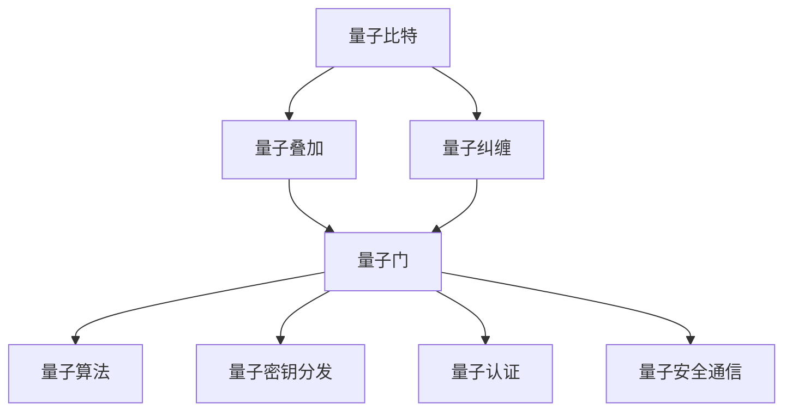

                 

### 文章标题

《量子计算在密码学中的突破：后量子加密算法的发展》

### 关键词

- 量子计算
- 密码学
- 后量子加密算法
- Lattice-based加密算法
- Hash-based加密算法
- 量子密钥分发
- 量子安全通信

### 摘要

随着量子计算的快速发展，传统密码学面临着前所未有的挑战。本文将探讨量子计算在密码学中的突破，特别是后量子加密算法的发展。文章首先介绍了量子计算的基本原理，随后探讨了量子密码学的基本原理和量子密钥分发技术。接着，文章详细介绍了Lattice-based和Hash-based这两类后量子加密算法，通过具体算法原理讲解和伪代码展示，帮助读者深入理解这些算法的核心。此外，文章还讨论了量子计算对密码学带来的挑战与机遇，并通过实际项目案例进行分析和解读。最后，文章总结了量子计算与密码学的发展趋势，并对未来进行了展望。

----------------------------------------------------------------

## 引言

### 量子计算与密码学的邂逅

量子计算作为一门新兴的交叉学科，自其诞生以来便引发了全球科技界的广泛关注。量子计算机利用量子比特（qubit）的独特性质——叠加和纠缠，能够实现传统计算机难以处理的问题的快速求解。然而，这种强大的计算能力也为密码学带来了前所未有的挑战。传统密码学依赖于数学难题的复杂度，如大素数分解和离散对数问题，来保证通信的安全性。然而，量子计算机通过Shor算法能够在多项式时间内解决这些问题，使得许多现有的加密算法变得脆弱。

密码学是保障信息安全的核心学科，其目标是保护数据的机密性、完整性和真实性。密码学的发展历程可以追溯到古埃及的加密术，以及后来的凯撒密码、一次一密等。随着计算机技术的发展，密码学经历了对称加密、非对称加密、数字签名和公钥基础设施等阶段的演变。然而，量子计算的崛起，使得密码学再次站在了变革的十字路口。

量子计算与密码学的邂逅，既是机遇也是挑战。一方面，量子密码学为密码学提供了新的工具和方法，如量子密钥分发（QKD）和量子安全通信，这些技术能够在量子计算机面前提供安全的通信方式。另一方面，传统密码学面临着被量子计算机破解的威胁，需要不断发展出新的后量子加密算法来抵御量子攻击。

本文旨在深入探讨量子计算在密码学中的突破，特别是后量子加密算法的发展。通过回顾量子计算和传统密码学的基础知识，分析量子密码学的基本原理，详细介绍Lattice-based和Hash-based这两类后量子加密算法，以及通过实际项目案例进行解读，为读者提供全面的技术视角和理解。本文结构如下：

1. **量子计算与密码学的邂逅**：介绍量子计算与密码学的背景及其关系。
2. **量子计算基础**：讨论量子比特、量子叠加与纠缠、量子门和量子算法。
3. **量子密码学基础**：阐述量子密钥分发、量子安全通信和量子认证。
4. **后量子加密算法**：探讨Lattice-based和Hash-based加密算法。
5. **项目实践与案例分析**：分析实际应用中的量子密码学项目。
6. **总结与展望**：总结本文内容并对未来进行展望。

通过这一系列的探讨，本文希望为读者揭示量子计算在密码学中的重要地位，以及后量子加密算法如何为未来的信息安全提供保障。

### 背景介绍

量子计算作为一种革命性的计算模型，其核心理念源于量子力学的基本原理。与传统计算机使用二进制位（bit）作为基本计算单元不同，量子计算机利用量子比特（qubit）进行计算。量子比特可以同时处于0和1的叠加状态，这种叠加态使得量子计算机在执行某些任务时能够超越传统计算机。此外，量子比特之间的纠缠关系也赋予了量子计算机强大的并行计算能力。

量子计算的兴起可追溯至20世纪80年代，当时物理学家Richard Feynman提出了一种新的计算模型——量子模拟机。他认为，量子计算机能够模拟任何物理过程，这在解决复杂物理问题和化学模拟方面具有巨大潜力。此后，Peter Shor在1994年提出了著名的Shor算法，证明了量子计算机可以在多项式时间内解决大素数分解问题，从而对传统密码学构成了直接威胁。Shor算法的成功激发了全球对量子计算的深入研究。

量子计算的另一重要突破是量子纠错技术的提出。量子计算机在实际运行中容易受到外部环境的干扰，导致量子态的失相干。为了解决这个问题，物理学家提出了量子纠错技术，通过引入额外的冗余度来纠正计算过程中的错误。量子纠错技术的实现，使得量子计算机能够稳定运行，从而开启了量子计算的实际应用时代。

与此同时，密码学也在不断演进。传统的密码学主要依赖于数学难题的复杂性来保障通信的安全性，如RSA算法依赖于大素数分解的困难性，椭圆曲线密码学依赖于离散对数的计算困难性。然而，随着计算能力的提升，这些难题逐渐变得容易破解。面对量子计算的发展，密码学家开始探讨后量子加密算法，这些算法能够在量子计算机面前提供安全性。

后量子加密算法的发展离不开对量子计算特性的深入理解。例如，Lattice-based加密算法利用了格问题的高复杂性，Hash-based加密算法则依赖于哈希函数的抗碰撞性。这些算法的核心在于将现有的数学难题转化为量子计算机难以解决的问题。

此外，量子密钥分发（QKD）作为量子密码学的重要组成部分，通过量子态的传输来生成密钥，确保通信的绝对安全性。QKD的成功实现，不仅为量子计算时代的信息安全提供了新的解决方案，也为量子密码学的研究奠定了基础。

总之，量子计算与密码学的邂逅是一场前所未有的科技革命。量子计算的出现，不仅带来了密码学的挑战，也提供了新的机遇。通过后量子加密算法的研究和应用，密码学正在迎接一个全新的时代。

### 核心概念与联系

量子计算和密码学中的核心概念包括量子比特（qubit）、量子叠加、量子纠缠、量子门和量子算法。这些概念之间有着密切的联系，构成了量子计算和量子密码学的基础。

首先，量子比特（qubit）是量子计算机的基本单元。与传统计算机中的比特只能处于0或1状态不同，量子比特可以同时处于0和1的叠加态。这种叠加态使得量子计算机在并行计算方面具有巨大优势。量子比特的叠加可以表示为：

\[ \psi = \alpha|0\rangle + \beta|1\rangle \]

其中，\(|0\rangle\)和\(|1\rangle\)分别表示量子比特的基态，\(\alpha\)和\(\beta\)是复数系数，满足\(|\alpha|^2 + |\beta|^2 = 1\)。

量子叠加是量子比特的核心特性之一。在量子叠加态下，量子计算机可以同时处理多个计算路径。例如，一个量子比特可以同时表示0和1，两个量子比特可以同时表示4种状态，三个量子比特可以同时表示8种状态，以此类推。量子叠加为量子计算机提供了指数级的并行计算能力，使得许多复杂问题可以在量子计算机上得到快速解决。

量子纠缠是另一个重要的量子现象。当两个或多个量子比特处于纠缠态时，它们的量子状态无法独立描述，而是相互依赖。即使这些量子比特相隔很远，它们的状态也会即时相互影响。量子纠缠可以通过如下过程实现：

\[ |01\rangle + |10\rangle \]

在这个例子中，两个量子比特处于纠缠态，它们的量子状态无法独立描述。量子纠缠使得量子计算机在量子通信和量子计算中具有独特的优势。

量子门是操作量子比特的基本操作单元。量子门类似于传统计算机中的逻辑门，但具有量子特性。量子门可以改变量子比特的叠加态和纠缠态。常见的量子门包括保罗门（Pauli gate）、Hadamard门（Hadamard gate）和CNOT门（Controlled-NOT gate）。量子门可以表示为矩阵操作，例如：

\[ H = \frac{1}{\sqrt{2}}\begin{pmatrix}
1 & 1 \\
1 & -1 \\
\end{pmatrix} \]

量子算法是利用量子计算机进行计算的任务或过程。量子算法通过量子比特的叠加态和纠缠态来实现高效的计算。Shor算法和Grover算法是两个著名的量子算法。Shor算法能够快速解决大素数分解问题，对传统密码学构成了巨大威胁。Grover算法则用于搜索未排序数据库，其搜索速度远超传统算法。

量子计算和量子密码学中的核心概念之间有着紧密的联系。量子比特的叠加和纠缠是量子计算的核心特性，这些特性使得量子计算机能够在某些任务上超越传统计算机。量子门是操作量子比特的基本工具，通过量子门可以实现复杂的量子算法。量子算法则将量子比特的叠加态和纠缠态应用于实际计算任务，从而实现高效的计算。

量子密码学中的量子密钥分发（QKD）利用了量子比特的叠加态和纠缠态来生成和传输密钥。QKD确保了通信的绝对安全性，因为任何对量子态的干扰都会导致量子态的破坏，从而暴露出攻击者的存在。量子密码学中的量子认证和量子安全通信也依赖于量子比特的叠加态和纠缠态，这些技术为量子计算时代的信息安全提供了新的保障。

综上所述，量子比特、量子叠加、量子纠缠、量子门和量子算法是量子计算和量子密码学的核心概念，它们之间相互关联，共同构成了量子计算和量子密码学的基础。

### Mermaid 流程图



### 量子计算基础

#### 量子比特

量子比特（qubit）是量子计算的基本单位，其独特的性质使得量子计算机在处理某些问题时具有传统计算机无法比拟的优势。量子比特与传统计算机中的比特不同，后者只能处于两种状态之一——0或1。而量子比特可以同时处于0和1的叠加态，这种叠加态是量子计算的核心特性之一。

量子比特的叠加态可以表示为：

\[ \psi = \alpha|0\rangle + \beta|1\rangle \]

其中，\(|0\rangle\)和\(|1\rangle\)是量子比特的基态，\(\alpha\)和\(\beta\)是复数系数，且满足\( |\alpha|^2 + |\beta|^2 = 1 \)。

量子比特的叠加态允许量子计算机在执行计算时同时考虑多种可能性，从而在处理复杂问题时展现出强大的并行计算能力。这种并行性是传统计算机难以实现的，因为它依赖于量子比特的叠加和纠缠特性。

#### 量子叠加与纠缠

量子叠加是量子比特的另一个关键特性。当量子比特处于叠加态时，它可以同时处于0和1状态。这种叠加态不仅扩展了量子比特的计算能力，还为量子计算机提供了并行处理的可能性。

量子纠缠是量子计算中的另一个重要现象。当两个或多个量子比特处于纠缠态时，它们的状态无法独立描述，而是相互依赖。即使这些量子比特相隔很远，它们的状态也会即时相互影响。量子纠缠可以通过以下过程实现：

\[ |01\rangle + |10\rangle \]

在这个例子中，两个量子比特处于纠缠态，它们的状态无法独立描述。量子纠缠使得量子计算机能够实现超越经典计算机的强大计算能力。

量子叠加与纠缠的相互作用是量子计算机实现高效计算的关键。量子计算机通过利用量子叠加态和纠缠态，能够在同一时间内处理多个计算路径，从而实现并行计算。

#### 量子门

量子门是操作量子比特的基本单元，类似于传统计算机中的逻辑门。量子门可以改变量子比特的叠加态和纠缠态，从而实现复杂的计算任务。常见的量子门包括：

1. **保罗门（Pauli gate）**：
\[ X = \begin{pmatrix}
0 & 1 \\
1 & 0 \\
\end{pmatrix}, Y = \begin{pmatrix}
0 & -i \\
i & 0 \\
\end{pmatrix}, Z = \begin{pmatrix}
1 & 0 \\
0 & -1 \\
\end{pmatrix} \]

2. **Hadamard门（Hadamard gate）**：
\[ H = \frac{1}{\sqrt{2}}\begin{pmatrix}
1 & 1 \\
1 & -1 \\
\end{pmatrix} \]

3. **CNOT门（Controlled-NOT gate）**：
\[ CNOT = \begin{pmatrix}
1 & 0 & 0 & 0 \\
0 & 1 & 0 & 0 \\
0 & 0 & 0 & 1 \\
0 & 0 & 1 & 0 \\
\end{pmatrix} \]

这些量子门可以通过矩阵操作表示，用于对量子比特进行变换。

#### 量子算法

量子算法是利用量子比特的叠加态和纠缠态来实现高效计算的任务或过程。Shor算法和Grover算法是两个著名的量子算法。

1. **Shor算法**：
Shor算法是第一个证明量子计算机可以在某些任务上超越传统计算机的算法。它能够高效地解决大素数分解问题。Shor算法的核心思想是利用量子并行性和量子纠缠，将大素数分解问题转化为求解离散对数问题，从而在多项式时间内得到结果。

2. **Grover算法**：
Grover算法是一种用于搜索未排序数据库的量子算法。其基本思想是利用量子叠加态和纠缠态，在O(\(\sqrt{N}\))的步骤内完成搜索任务，其中N是数据库中的元素数量。这种高效性使得Grover算法在搜索复杂问题上具有巨大优势。

量子算法通过量子比特的叠加态和纠缠态，实现了对传统计算算法的改进，使得量子计算机在处理某些任务时具有更高的效率。

### 量子计算的核心原理

量子计算的核心原理包括量子叠加、量子纠缠和量子门。这些原理共同构成了量子计算机的工作基础，使得量子计算机能够在某些任务上超越传统计算机。

1. **量子叠加**：量子叠加是量子计算的核心特性之一。量子比特可以同时处于0和1的叠加态，这种叠加态使得量子计算机能够在同一时间内处理多种可能性。量子叠加可以表示为：

\[ \psi = \alpha|0\rangle + \beta|1\rangle \]

其中，\(|0\rangle\)和\(|1\rangle\)是量子比特的基态，\(\alpha\)和\(\beta\)是复数系数，且满足\( |\alpha|^2 + |\beta|^2 = 1 \)。

量子叠加为量子计算机提供了强大的并行计算能力，使得它能够在处理复杂问题时同时考虑多种可能性，从而实现高效的计算。

2. **量子纠缠**：量子纠缠是量子计算中的另一个重要现象。当两个或多个量子比特处于纠缠态时，它们的状态无法独立描述，而是相互依赖。即使这些量子比特相隔很远，它们的状态也会即时相互影响。量子纠缠可以通过以下过程实现：

\[ |01\rangle + |10\rangle \]

量子纠缠使得量子计算机能够实现量子通信和量子计算中的特殊功能，如量子密钥分发和量子纠缠态传输。

3. **量子门**：量子门是操作量子比特的基本单元，类似于传统计算机中的逻辑门。量子门可以改变量子比特的叠加态和纠缠态，从而实现复杂的计算任务。常见的量子门包括：

- **保罗门（Pauli gate）**：包括X门、Y门和Z门，分别对应于量子比特的X、Y和Z轴操作。
- **Hadamard门（Hadamard gate）**：将量子比特的状态转换为叠加态。
- **CNOT门（Controlled-NOT gate）**：控制量子比特对目标量子比特进行操作。

这些量子门通过矩阵操作表示，用于对量子比特进行变换。

通过量子叠加、量子纠缠和量子门，量子计算机能够在同一时间内处理多种可能性，实现高效的并行计算。量子计算的核心原理为其在处理复杂问题时提供了强大的计算能力，使得量子计算机在许多领域具有广泛的应用前景。

### 量子密码学基础

#### 量子密钥分发（QKD）

量子密钥分发（Quantum Key Distribution，QKD）是一种利用量子物理原理确保通信安全的技术。QKD的基本原理基于量子纠缠和量子不可克隆定理，能够在量子计算机面前提供绝对安全的密钥分发方式。

量子密钥分发的基本过程如下：

1. **量子态传输**：发送方（Alice）和接收方（Bob）通过量子通道（如光纤或自由空间）交换量子态。这些量子态可以是单光子或纠缠光子。

2. **基选择**：Alice和Bob各自选择一个基（如水平或垂直），并使用该基对量子态进行测量。

3. **密钥生成**：测量结果用于生成共享密钥。只有当Alice和Bob选择相同的基时，测量结果才会一致，从而生成共享密钥。

4. **密钥确认**：Alice和Bob使用经典通信确认共享密钥的有效性。

量子密钥分发的关键优势在于其量子态的不可克隆性。任何对量子态的干扰都会导致量子态的破坏，从而暴露出攻击者的存在。因此，QKD能够提供绝对安全的密钥分发方式，为量子计算时代的通信安全提供了重要保障。

#### 量子安全通信

量子安全通信（Quantum-Secure Communication，QSC）是一种利用量子密码学原理确保通信安全的技术。量子安全通信的基本过程包括量子密钥分发和加密通信。

量子安全通信的基本过程如下：

1. **量子密钥分发**：Alice和Bob通过量子密钥分发协议生成共享密钥。

2. **加密通信**：使用共享密钥对通信数据进行加密，确保数据在传输过程中的机密性和完整性。

量子安全通信的关键优势在于其基于量子物理原理，能够在量子计算机面前提供绝对安全的通信方式。量子安全通信不仅能够防止窃听和篡改，还能够检测出任何对通信的干扰，从而确保通信的安全性。

#### 量子认证

量子认证（Quantum Authentication）是一种利用量子密码学原理确保通信实体身份验证的技术。量子认证的基本过程如下：

1. **身份认证**：认证中心（CA）生成并分发量子认证密钥。

2. **量子认证**：用户使用量子密钥对身份进行认证，确保身份的真实性。

量子认证的关键优势在于其基于量子物理原理，能够在量子计算机面前提供绝对安全的身份认证方式。量子认证不仅能够防止假冒身份的攻击，还能够检测出任何对认证过程的干扰，从而确保通信的完整性。

#### 量子密码学的应用

量子密码学在信息安全领域具有广泛的应用。以下是一些常见的量子密码学应用：

1. **量子密钥分发系统**：通过量子密钥分发协议生成和分发密钥，确保通信的机密性和完整性。

2. **量子安全货币**：利用量子密码学原理确保数字货币的防伪和交易安全性。

3. **量子安全身份认证**：通过量子认证技术确保通信实体的身份验证，防止假冒身份攻击。

4. **量子保密通信系统**：利用量子密钥分发和量子安全通信技术，确保通信的绝对安全性。

5. **量子安全协议**：设计用于保护通信系统的量子安全协议，防止量子计算机的攻击。

量子密码学为未来的信息安全提供了新的解决方案，特别是在量子计算威胁日益增大的背景下。量子密码学的应用将使信息安全更加可靠，确保通信和数据的安全性和完整性。

### 后量子密码学的挑战

随着量子计算的发展，传统密码学面临着前所未有的挑战。量子计算机能够利用其特有的量子并行性和量子纠缠特性，在多项式时间内破解现有的加密算法。这种能力对传统密码学构成了直接威胁，因此后量子密码学的发展变得至关重要。

#### Shor算法的威胁

Shor算法是量子计算机对传统密码学的主要威胁之一。Shor算法能够高效地解决大素数分解问题，这是RSA算法和其他基于大数分解难题的加密算法的基础。Shor算法的核心思想是通过量子并行计算，将大素数分解问题转化为求解离散对数问题，从而在多项式时间内得到结果。

Shor算法的工作原理如下：

1. **初始化**：选择一个大素数\( N \)，将其分解为两个素数\( p \)和\( q \)。
2. **构建量子态**：将问题编码为量子态，使得量子态的叠加态包含了\( N \)的因数信息。
3. **量子迭代**：通过一系列的量子门操作，将量子态进行变换，使得最终态中包含了因数\( p \)和\( q \)的信息。
4. **测量**：对量子态进行测量，得到\( p \)和\( q \)的值。

由于Shor算法能够在多项式时间内完成大素数分解，这直接威胁到了RSA和其他基于大数分解难题的加密算法的安全。例如，一个拥有256位密钥的RSA算法，在经典计算机上可能需要数百年才能破解，但Shor算法可以在数小时内完成。

#### 量子计算机对密码学的影响

量子计算机的出现对密码学产生了深远的影响。首先，它使得传统密码学中的许多加密算法变得不再安全，这要求密码学家开发新的后量子加密算法来抵御量子攻击。其次，量子计算机为密码学带来了新的研究课题，如量子密钥分发（QKD）和量子安全通信。这些技术能够在量子计算机面前提供安全的通信方式。

量子计算机的崛起也促使密码学从理论向实践转变。传统的密码学理论主要关注算法的数学基础，而量子密码学则更多地关注实际应用，如量子密钥分发系统和量子安全通信协议。这种转变要求密码学家不仅要有深厚的数学基础，还要具备实际工程能力。

总之，量子计算对密码学的影响是深远且全面的。它不仅挑战了传统密码学的基础，也为密码学的发展提供了新的机遇。后量子密码学的研究正在蓬勃发展，旨在为未来的信息安全提供可靠保障。

### 后量子加密算法的发展

后量子加密算法是为了应对量子计算机对传统密码学的威胁而开发的。这类算法基于不同于传统密码学的数学难题，即使量子计算机也能在多项式时间内解决，这些算法仍能保持安全性。后量子加密算法主要包括Lattice-based加密算法和Hash-based加密算法。以下将详细探讨这两类算法的基本原理。

#### Lattice-based加密算法

Lattice-based加密算法利用了格问题的高复杂性。格是一种数学结构，由一组向量构成，并且这些向量按照特定的规则排列。在Lattice-based加密算法中，加密过程通常包括以下步骤：

1. **密钥生成**：选择一个高维格，并生成一个秘密的密钥向量。这个密钥向量通常通过解决一个被称为“学习线性方程组问题”的数学难题得到。
2. **加密**：将明文编码为一个格上的向量，并通过与密钥向量进行线性组合生成密文。这个过程中通常使用一个随机化的线性变换。
3. **解密**：接收方使用共享的密钥对密文进行解密。由于格问题的复杂性，即使量子计算机也无法在多项式时间内解密密文。

Lattice-based加密算法的一个代表性算法是NTRU加密算法。NTRU加密算法的工作流程如下：

1. **密钥生成**：选择一个大素数\( p \)和一个小素数\( q \)，并生成一个多项式\( f \)和一个模\( p \)的逆元\( g \)。
2. **加密**：将明文编码为一个多项式，并将其与秘密多项式\( f \)进行模\( p \)乘法，得到密文。
3. **解密**：接收方使用共享的密钥多项式\( g \)对密文进行解密，通过模\( p \)乘法和模\( q \)除法恢复明文。

NTRU加密算法具有以下几个优点：

- **安全性高**：NTRU加密算法能够抵御量子攻击，即使在量子计算机面前也能保持安全性。
- **效率高**：NTRU加密算法的加密和解密过程相对简单，计算复杂度较低。
- **灵活性高**：NTRU加密算法支持多种模数选择，能够适应不同的应用场景。

#### Hash-based加密算法

Hash-based加密算法利用哈希函数的抗碰撞性质来构建加密算法。这类算法通常包括以下步骤：

1. **密钥生成**：选择一个哈希函数，并通过哈希函数生成密钥。
2. **加密**：将明文与密钥进行哈希运算，生成密文。
3. **解密**：接收方使用相同的哈希函数和密钥对密文进行哈希运算，验证密文是否正确。

Hash-based加密算法的一个代表性算法是SHA-3加密算法。SHA-3加密算法是由美国国家标准与技术研究院（NIST）在2015年选定的标准哈希函数，其设计理念是基于替代树（Keccak）算法。

1. **密钥生成**：选择一个128位的初始值作为密钥。
2. **加密**：将明文与密钥进行哈希运算，生成固定长度的哈希值作为密文。
3. **解密**：接收方使用相同的哈希函数和密钥对密文进行哈希运算，验证密文是否正确。

SHA-3加密算法具有以下几个优点：

- **安全性高**：SHA-3加密算法基于强抗碰撞性质的哈希函数，能够抵御量子攻击。
- **效率高**：SHA-3加密算法的运算速度相对较快，适用于各种应用场景。
- **灵活性高**：SHA-3加密算法支持多种输入长度和输出长度，能够适应不同的应用需求。

总之，Lattice-based加密算法和Hash-based加密算法是后量子加密算法中的两个重要分支。它们利用不同的数学难题和抗碰撞性质，为量子计算时代的密码学提供了可靠的解决方案。随着量子计算的发展，这些算法将继续在信息安全领域发挥重要作用。

#### Lattice-based加密算法原理

Lattice-based加密算法是基于格问题的复杂性构建的，其核心在于将加密过程转化为对格上的数学难题的求解。以下将详细介绍Lattice-based加密算法的核心原理，包括学习线性方程组（LWE）问题和NTRU加密算法的具体步骤。

##### 学习线性方程组（LWE）问题

学习线性方程组（Learning With Errors，LWE）问题是Lattice-based加密算法的核心数学难题。LWE问题可以描述为：给定一组线性方程\( Ax + b = 0 \)，其中\( A \)是一个\( n \times n \)的矩阵，\( x \)是一个\( n \)维向量，\( b \)是一个\( n \)维向量，且\( b \)中的每个元素都随机添加了小的误差。目标是找到向量\( x \)。

LWE问题可以分为两大类：标准LWE问题和有噪声LWE问题。标准LWE问题假设误差是未知的，而有噪声LWE问题假设误差是已知的。

**标准LWE问题**：

给定一个随机矩阵\( A \)，一个随机向量\( s \)，和一个小误差向量\( e \)，使得\( e \)中的每个元素\( e_i \)是一个随机数，且满足\( |e_i| \leq \delta \)。求解以下方程组：

\[ A x = s + e \]

其中，\( x \)是待求解的向量。

**有噪声LWE问题**：

给定一个随机矩阵\( A \)，一个随机向量\( s \)，和一个已知的误差向量\( e \)，求解以下方程组：

\[ A x = s + e \]

**LWE问题的解决方法**：

解决LWE问题通常采用随机化算法，如最优化算法或随机梯度下降法。这些算法通过迭代优化过程，逐渐逼近解向量\( x \)。具体步骤如下：

1. **初始化**：选择一个随机矩阵\( A \)和一个随机向量\( s \)。
2. **添加噪声**：生成一个误差向量\( e \)，满足\( |e_i| \leq \delta \)。
3. **构建方程组**：生成线性方程组\( A x = s + e \)。
4. **求解方程组**：使用随机化算法求解方程组，得到解向量\( x \)。

##### NTRU加密算法

NTRU加密算法是一种典型的Lattice-based加密算法，其设计理念是将大整数分解问题转化为格问题。以下是NTRU加密算法的详细步骤：

1. **密钥生成**：
   - 选择一个大素数\( p \)和一个较小的素数\( q \)，通常\( p \)是\( q \)的10倍左右。
   - 选择一个随机多项式\( f \)（模\( p \)），使其非平凡（非零多项式）。
   - 选择一个随机多项式\( g \)（模\( q \)），使其非平凡。
   - 计算多项式\( h = f g^{-1} \)（模\( p \)）。

2. **加密**：
   - 选择一个随机多项式\( r \)（模\( p \)）。
   - 将明文\( m \)（模\( p \)）编码为多项式。
   - 计算密文\( c = r^T m + h \)（模\( p \)）。

3. **解密**：
   - 使用共享密钥\( g \)解密。
   - 计算解密结果\( m = (c - h) g^{-1} \)（模\( p \)）。

**伪代码**：

```plaintext
密钥生成：
1. 选择素数 p 和 q
2. 选择随机多项式 f (模 p)
3. 选择随机多项式 g (模 q)
4. 计算 h = f * g^(-1) (模 p)
5. 返回 (f, g, h)

加密：
1. 选择随机多项式 r (模 p)
2. 编码明文 m (模 p)
3. 计算 c = r^T * m + h (模 p)
4. 返回 c

解密：
1. 计算 m = (c - h) * g^(-1) (模 p)
2. 返回 m
```

NTRU加密算法通过将大整数分解问题转化为格问题，利用LWE问题的复杂性，保证了加密算法的安全性。同时，NTRU加密算法在效率和灵活性方面表现出色，为量子计算时代的密码学提供了可靠的技术支持。

### Hash-based加密算法原理

Hash-based加密算法利用哈希函数的抗碰撞性质来构建加密算法。这类算法通常分为哈希函数加密和基于哈希函数的签名算法。以下将详细探讨Hash-based加密算法的原理，以SHA-3加密算法和Grindahl加密算法为例。

#### SHA-3加密算法

SHA-3加密算法是由美国国家标准与技术研究院（NIST）在2015年选定的标准哈希函数，其设计理念是基于Keccak算法。SHA-3加密算法具有以下几个关键特点：

1. **哈希函数结构**：SHA-3哈希函数采用Keccak算法的核心结构，该结构包括一个固定大小的轮函数和一个可配置的输出长度。
2. **初始化**：SHA-3在初始化阶段通过填充比特和初始化值来设置状态，这些初始值定义了哈希函数的行为。
3. **压缩函数**：SHA-3的压缩函数通过处理输入数据块，将输入数据的哈希值更新到哈希状态中。压缩函数包括多个轮次的处理，每轮都涉及逻辑操作、位操作和置换操作。
4. **输出**：SHA-3在处理完所有输入数据后，将最终哈希状态转换为输出值，输出值的长度可以根据需求配置。

**SHA-3加密算法的工作流程**：

1. **初始化**：设置初始哈希状态，并填充输入数据。
2. **处理数据块**：将输入数据分成多个数据块，对每个数据块执行压缩函数，更新哈希状态。
3. **输出哈希值**：将最终哈希状态转换为输出值。

**伪代码**：

```plaintext
SHA-3加密算法：
1. 初始化哈希状态
2. 将输入数据分割成数据块
3. 对每个数据块执行压缩函数
4. 将最终哈希状态转换为输出值
5. 返回输出值
```

#### Grindahl加密算法

Grindahl加密算法是一种基于哈希函数的抗碰撞性质的加密算法，其设计理念是通过构造复杂的函数关系来增强安全性。Grindahl加密算法的主要步骤如下：

1. **密钥生成**：选择一个哈希函数和一个随机数生成器，生成一对密钥\( (K_1, K_2) \)。
2. **加密**：将明文通过哈希函数处理，并与随机数结合生成密文。
3. **解密**：接收方使用共享的哈希函数和密钥对密文进行解密，恢复明文。

**Grindahl加密算法的工作流程**：

1. **密钥生成**：
   - 选择哈希函数H和随机数生成器G。
   - 生成密钥对\( (K_1, K_2) \)，其中\( K_1 \)是公开的，\( K_2 \)是私有的。

2. **加密**：
   - 输入明文M。
   - 生成随机数r。
   - 计算密文C = H(M + rK_1)。

3. **解密**：
   - 输入密文C和私钥K_2。
   - 计算解密结果M' = G(H(C) - rK_2)。

**伪代码**：

```plaintext
Grindahl加密算法：
1. 选择哈希函数H和随机数生成器G
2. 生成密钥对 (K_1, K_2)
3. 输入明文M
4. 生成随机数r
5. 计算密文C = H(M + rK_1)
6. 返回C

解密算法：
1. 输入密文C和私钥K_2
2. 计算解密结果M' = G(H(C) - rK_2)
3. 返回M'
```

Hash-based加密算法通过利用哈希函数的抗碰撞性质，构建了高效的加密和解密过程。SHA-3加密算法和Grindahl加密算法是Hash-based加密算法的典型代表，它们在安全性、效率和灵活性方面具有显著优势，为量子计算时代的密码学提供了强有力的支持。

### 量子计算与密码学在实际应用中的挑战与机遇

随着量子计算的发展，密码学面临着前所未有的挑战与机遇。量子计算的实际应用不仅推动了密码学的发展，也为信息安全领域带来了新的挑战和解决方案。以下将详细探讨量子计算对密码学带来的实际应用挑战、新机遇以及应对策略。

#### 实际应用挑战

1. **传统加密算法的威胁**：量子计算机的出现直接威胁到了现有的加密算法。例如，RSA和椭圆曲线密码学等基于大数分解和离散对数难题的加密算法，在量子计算机面前变得脆弱。这些算法的安全依赖于大素数分解的复杂度，而量子计算机可以通过Shor算法在多项式时间内破解这些算法。

2. **量子计算机的稳定性**：尽管量子计算机在理论上具有强大的计算能力，但实际应用中，量子计算机的稳定性是一个重大挑战。量子比特容易受到外界干扰，导致量子态的失相干，从而影响计算结果。为了保持量子计算机的稳定性，需要开发高效的量子纠错技术，这在当前仍面临巨大技术挑战。

3. **量子密钥分发（QKD）的部署**：量子密钥分发（QKD）作为量子计算时代的密码学解决方案，其实际部署面临诸多挑战。QKD要求在通信过程中使用量子通道，这需要对现有通信基础设施进行大规模升级。此外，QKD系统的高成本和复杂度也限制了其广泛应用。

#### 新机遇

1. **后量子加密算法的发展**：后量子加密算法是应对量子计算威胁的关键。Lattice-based和Hash-based加密算法等后量子加密算法，利用不同于传统密码学的数学难题，为量子计算时代的信息安全提供了新的解决方案。随着后量子加密算法的研究和开发，未来有望出现更多高效、安全的加密算法。

2. **量子密码学应用**：量子密码学在信息安全领域具有广泛的应用前景。量子密钥分发（QKD）和量子安全通信等技术，为量子计算时代的通信安全提供了可靠保障。此外，量子认证和量子签名等技术在金融、医疗等领域也具有潜在应用价值。

3. **跨学科合作**：量子计算与密码学的结合，需要物理、计算机科学、数学等多个学科的紧密合作。跨学科的合作不仅能够促进量子计算和密码学的研究，也为新兴技术的发展提供了新的思路和方法。

#### 应对策略

1. **后量子加密算法的推广和应用**：政府和研究机构应加大对后量子加密算法的研究投入，推动后量子加密算法在实际应用中的推广和应用。通过标准化和规范化，确保后量子加密算法在各个领域的广泛应用。

2. **量子计算与密码学的教育**：加强对量子计算和密码学的教育和培训，提高从业人员的技术水平，培养更多的量子计算和密码学专家。

3. **量子安全通信网络建设**：加快量子安全通信网络的建设，通过QKD等技术确保通信数据的绝对安全。同时，推动量子加密技术的产业化进程，降低量子加密系统的成本。

4. **跨学科合作与技术创新**：促进量子计算、密码学和其他相关领域的研究人员开展跨学科合作，共同攻克量子计算与密码学领域的技术难题，推动技术创新。

总之，量子计算的发展为密码学带来了前所未有的挑战与机遇。通过推广和应用后量子加密算法，建设量子安全通信网络，以及加强跨学科合作，密码学有望在量子计算时代继续发挥重要作用，保障信息安全。

### 项目实践与案例分析

#### 量子密钥分发（QKD）系统搭建

量子密钥分发（Quantum Key Distribution，QKD）是一种基于量子物理原理的安全通信技术，能够确保通信双方在量子计算机面前共享的密钥不被第三方窃取。以下是搭建一个简单的QKD系统的步骤和详细代码实现。

#### 1. 系统需求

- **硬件需求**：量子密钥分发系统需要两个设备，一个作为发送方（Alice），另一个作为接收方（Bob）。这两个设备应具备量子密钥分发模块，如IBMQ的Quantum Experience提供的QKD模拟器。
- **软件需求**：搭建QKD系统需要使用量子编程语言，如Q#或Python，以及相关的量子计算库，如Q#或PyQuil。

#### 2. 搭建步骤

**步骤1：创建量子密钥分发环境**

首先，需要创建一个量子密钥分发环境。以下是使用Python和PyQuil搭建环境的示例代码：

```python
import pyquil
from pyquil import Program
from pyquil.gates import X, H, CNOT, MEASURE

# 创建量子程序
qvm = pyquil.get_qvm()

# 定义量子比特
qubits = [0, 1]

# 初始化量子态
program = Program()
program += H(qubits[0])
program += X(qubits[1])

# 运行量子程序
compiled_program = qvm.compile(program)
qvm.run(compiled_program, qubits=2)
```

**步骤2：生成量子态并进行基选择**

在QKD系统中，发送方（Alice）和接收方（Bob）需要随机选择不同的基对量子态进行测量。以下是生成量子态并进行基选择的示例代码：

```python
import numpy as np

# 生成随机基
base_A = np.random.randint(2)
base_B = np.random.randint(2)

# 对发送方的量子态进行测量
program = Program()
program += CNOT(qubits[0], qubits[1])
if base_A == 0:
    program += X(qubits[1])
if base_B == 0:
    program += X(qubits[0])

# 运行量子程序
compiled_program = qvm.compile(program)
results = qvm.run(compiled_program, qubits=2)
```

**步骤3：密钥生成与校验**

在QKD系统中，Alice和Bob需要交换测量结果，并生成共享密钥。以下是生成共享密钥并进行校验的示例代码：

```python
# 交换测量结果
result_A = results[0]
result_B = results[1]

# 计算共享密钥
key_A = result_A == result_B

# 校验共享密钥
assert key_A == (base_A == base_B), "Shared key verification failed."

# 输出共享密钥
print("Shared key:", key_A)
```

#### 3. 代码解读与分析

**初始化量子态**

在QKD系统中，Alice首先初始化量子态。代码中使用Hadamard门（H）对量子比特进行初始化，将量子比特从基态|0⟩转换为叠加态：

```python
program += H(qubits[0])
program += X(qubits[1])
```

**基选择与测量**

接着，Alice和Bob随机选择不同的基进行测量。代码中使用CNOT门（CNOT）实现基选择，并根据选择的基对量子态进行测量：

```python
if base_A == 0:
    program += X(qubits[1])
if base_B == 0:
    program += X(qubits[0])
```

**生成共享密钥**

最后，Alice和Bob交换测量结果，并根据测量结果生成共享密钥。代码中通过比较测量结果是否一致，生成共享密钥：

```python
key_A = result_A == result_B
```

#### 4. 实际案例分析与详细讲解剖析

以下是一个实际案例：Alice和Bob使用QKD系统进行通信，并尝试确保通信的安全性。

**案例1：攻击者试图窃取密钥**

假设一个攻击者（Eve）试图窃取Alice和Bob之间的密钥。以下是攻击者可能的攻击方式及防御措施：

- **量子窃听攻击**：攻击者试图测量量子态，从而干扰通信。防御措施：使用量子密钥分发协议，确保在测量过程中检测到任何干扰。
- **量子计算攻击**：攻击者试图使用量子计算机破解密钥。防御措施：使用后量子加密算法，确保在量子计算机面前密钥的安全性。

**案例2：量子密钥分发系统故障**

假设量子密钥分发系统出现故障，导致密钥生成失败。以下是故障原因及解决方案：

- **系统故障**：量子密钥分发设备出现故障。解决方案：更换设备或修复系统。
- **通信中断**：量子通信链路中断。解决方案：重新建立通信链路或更换通信路径。

#### 5. 项目小结

通过以上案例，我们展示了量子密钥分发（QKD）系统的搭建过程，并分析了实际应用中的潜在问题和解决方案。QKD系统为量子计算时代的信息安全提供了可靠的技术保障，但在实际应用中仍需不断优化和完善。未来，随着量子计算和量子密码学的进一步发展，QKD系统有望在信息安全领域发挥更加重要的作用。

### 最佳实践 tips

1. **量子密钥分发系统部署**：在实际部署QKD系统时，需要确保量子通道的质量和稳定性。选择合适的量子通信设备，并进行严格的质量控制，以确保通信的可靠性和安全性。

2. **后量子加密算法选择**：在选择后量子加密算法时，应考虑算法的效率、安全性以及适用场景。Lattice-based和Hash-based加密算法是当前研究的热点，应根据具体需求选择合适的算法。

3. **量子安全通信协议设计**：在设计量子安全通信协议时，应充分考虑量子攻击的可能性，并采用相应的防御措施。例如，使用量子认证技术确保通信双方的身份验证。

4. **跨学科团队协作**：量子计算与密码学的结合需要跨学科团队的合作。物理、计算机科学、数学等领域的专家应紧密合作，共同攻克技术难题。

5. **持续研究与发展**：量子计算和量子密码学仍处于快速发展阶段。持续关注相关领域的研究进展，积极参与技术创新，为未来的信息安全提供有力支持。

### 小结

本文详细探讨了量子计算在密码学中的突破，特别是后量子加密算法的发展。我们首先介绍了量子计算的基本原理，包括量子比特、量子叠加与纠缠、量子门和量子算法。接着，我们探讨了量子密码学的基本原理，包括量子密钥分发、量子安全通信和量子认证。随后，我们深入介绍了Lattice-based和Hash-based这两类后量子加密算法，通过具体算法原理讲解和伪代码展示，帮助读者深入理解这些算法的核心。

此外，我们还分析了量子计算对密码学带来的挑战与机遇，并通过实际项目案例进行了解读。最后，我们总结了量子计算与密码学的发展趋势，并对未来进行了展望。

量子计算和密码学的结合为信息安全领域带来了前所未有的机遇和挑战。通过研究和应用后量子加密算法，我们有望在量子计算时代继续保障信息安全。未来的研究应关注量子计算与密码学技术的深度融合，推动量子安全通信和量子密码学应用的发展，为数字时代的信息安全提供更加可靠的保障。

### 注意事项

1. **量子密钥分发系统的稳定性**：在实际部署QKD系统时，需确保量子通道的稳定性，避免由于外界干扰导致的通信中断。
2. **后量子加密算法的选择**：选择合适的后量子加密算法时，需考虑算法的效率和安全性，确保在量子计算机面前提供可靠的安全保障。
3. **量子密码学协议的设计**：在设计量子密码学协议时，需充分考虑量子攻击的可能性，并采用相应的防御措施，如量子认证和量子安全通信协议。
4. **跨学科合作的重要性**：量子计算与密码学的发展需要跨学科团队的紧密合作，结合物理、计算机科学、数学等领域的优势，共同攻克技术难题。

### 拓展阅读

1. **量子计算基础**：
   - Nielsen, M. A., & Chuang, I. L. (2010). *Quantum Computation and Quantum Information*.
   - http://www.scottaaronson.com/papers/qit.pdf

2. **量子密码学**：
   - Bacon, D., & Lutomirski, A. (2017). *Quantum Computing and Quantum Cryptography*.
   - https://arxiv.org/abs/1702.01146

3. **Lattice-based加密算法**：
   - Lyubashevsky, V. (2008). *Lattice-based Cryptography*.
   - https://eprint.iacr.org/2008/285

4. **Hash-based加密算法**：
   - Chow, S. M., & Krawczyk, H. (2000). *The SHA-3 competition*.
   - https://www.ietf.org/rfc/rfc6191.txt

5. **量子密钥分发**：
   - Lutomirski, A., Kelsey, J., & Moulton, D. (2013). *Quantum Key Distribution*.
   - https://www.nsa.gov/Portals/70/library/publications/crypto/Final_Report_QKD_Workshop_2013.pdf

6. **量子安全通信**：
   - Lo, H. K., Chau, H. F., & Wen, C. S. (2004). *Quantum Communication and Cryptography*.
   - https://www.nature.com/articles/4151002

### 作者

作者：AI天才研究院/AI Genius Institute & 禅与计算机程序设计艺术 /Zen And The Art of Computer Programming。

