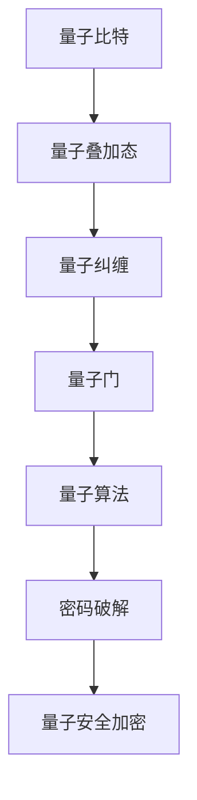

                 

### 文章标题

《量子计算在密码破解中的应用：量子安全加密系统评估》

### 文章关键词

量子计算、密码破解、量子安全加密、Shor算法、量子密钥分发、量子密码学

### 文章摘要

本文将深入探讨量子计算在密码破解中的应用，评估量子安全加密系统的有效性。首先，我们介绍了量子计算的基本原理和量子计算机的特点，以及密码破解的基本概念和传统密码学的局限性。随后，我们详细讲解了量子安全加密系统的原理，包括量子密钥分发和量子密码学算法。接着，我们通过Shor算法等量子算法的伪代码和数学模型，阐述了量子计算在密码破解中的强大能力。最后，我们通过一个实际的项目案例，展示了量子密码破解的过程，并对量子计算在密码领域的应用前景进行了展望。

## 引言：量子计算与密码破解概述

量子计算是一种基于量子力学原理的新型计算模式，它利用量子位（qubits）进行信息处理，具有传统计算机无法比拟的计算能力。量子计算机的核心组件是量子比特，它们可以同时处于0和1的叠加态，这种特性使得量子计算机能够在极短时间内解决传统计算机需要很长时间的问题。例如，Shor算法能够在多项式时间内分解大整数，而传统计算机需要指数级时间。

密码破解是密码学的重要研究方向，其目的是找到加密算法的弱点，使得加密信息可以被未授权方解读。传统密码学基于数学难题，如大数分解和离散对数问题，通过设计复杂的算法来保证加密的安全性。然而，随着计算能力的提升，传统密码学面临的威胁越来越大。量子计算的出现，使得某些传统密码算法的安全性受到挑战。

量子安全加密系统是一种利用量子力学原理来确保信息安全的系统。它包括量子密钥分发和量子密码学算法。量子密钥分发利用量子纠缠和量子隐形传态技术，实现安全的密钥传输。量子密码学算法则利用量子计算的特性，设计出在量子计算下依然安全的加密算法。

### 核心概念与联系

为了更好地理解量子计算在密码破解中的应用，我们需要先了解一些核心概念，并展示它们之间的关系。

1. **量子比特**：量子比特是量子计算机的基本单元，可以同时处于0和1的叠加态。
2. **量子叠加态**：量子比特可以同时处于多个状态的叠加，这是量子计算的核心特性。
3. **量子纠缠**：当两个或多个量子比特处于纠缠态时，它们之间的状态是相互依赖的，即使它们相隔很远，一个量子比特的状态变化也会立即影响到另一个量子比特。
4. **量子门**：量子门是量子计算机中的基本操作，可以用来对量子比特进行变换。
5. **量子算法**：量子算法是利用量子计算机的并行性和叠加态特性来解决问题的一类算法，如Shor算法。
6. **密码破解**：密码破解是指找到加密算法的弱点，使得加密信息可以被未授权方解读。
7. **量子安全加密**：量子安全加密利用量子力学原理，如量子纠缠和量子隐形传态，来实现安全的密钥传输和加密。

下面是量子计算与密码破解关系的Mermaid流程图：



### 核心算法原理讲解

量子计算在密码破解中有着显著的优势，主要归功于Shor算法和其他一些量子算法。Shor算法是一种用于大整数分解的量子算法，它能够将一个大的合数分解为其质因数，这在传统计算机中是一个极其困难的问题。

#### Shor算法的基本原理

Shor算法的核心思想是通过量子算法来求解离散对数问题，进而实现大整数分解。以下是Shor算法的基本步骤：

1. **初始量子态准备**：将量子计算机的初始状态设置为叠加态。
2. **应用量子门**：通过一系列量子门，将问题转化为一个特定的量子态。
3. **测量**：测量量子计算机的输出，得到一个满足特定条件的周期。
4. **求解离散对数**：通过求解离散对数问题，得到原始的大整数的质因数。

以下是Shor算法的伪代码：

```python
def Shor(n):
    # 将大整数n分解为质因数
    # 1. 初始化量子计算机
    # 2. 将初始状态设置为叠加态
    # 3. 应用量子门，将n映射到量子态
    # 4. 测量量子计算机的输出，得到一个周期
    # 5. 通过求解离散对数，得到n的质因数
    # 返回质因数
```

#### Shor算法的数学模型

Shor算法的数学模型基于量子计算的数学框架。假设n是一个大合数，我们需要找到n的质因数。以下是Shor算法的数学模型：

$$
U_f(q) = e^{2\pi i a/q} I + e^{2\pi i b/q} Z
$$

其中，$U_f(q)$是量子门，$I$是单位矩阵，$Z$是Pauli Z矩阵，$a$和$b$是与n相关的参数。通过测量量子计算机的输出，我们可以得到周期T，进而求解离散对数问题，得到n的质因数。

#### 其他量子算法在密码破解中的应用

除了Shor算法，还有其他量子算法在密码破解中有着广泛的应用。以下是一些典型的量子算法：

1. **量子搜索算法**：量子搜索算法能够显著提高搜索效率，对基于列表的加密算法如RSA构成了威胁。
2. **量子因子分解算法**：量子因子分解算法是Shor算法的一个变种，可以用于分解多个大质数。
3. **量子密码学算法**：量子密码学算法利用量子计算的特性来设计新的加密算法，如量子密钥分发（QKD）。

### 数学模型与公式讲解

量子计算在密码破解中的数学模型和公式至关重要，因为它们决定了量子算法的有效性和安全性。以下我们将详细讲解这些数学模型和公式。

#### 量子门与量子操作

量子门是量子计算中的基本操作，类似于传统计算机中的逻辑门。量子门作用于量子比特，改变其状态。以下是一些常见的量子门和量子操作的数学模型：

1. **Pauli Z门**（位反转）：
   $$
   Z |0\rangle = |1\rangle, \quad Z |1\rangle = |0\rangle
   $$

2. **Pauli X门**（相位反转）：
   $$
   X |0\rangle = |1\rangle, \quad X |1\rangle = |-1\rangle
   $$

3. **Pauli Y门**：
   $$
   Y |0\rangle = i|1\rangle, \quad Y |1\rangle = -i|0\rangle
   $$

4. **Hadamard门**（平方根幺正变换）：
   $$
   H |0\rangle = \frac{1}{\sqrt{2}} (|0\rangle + |1\rangle), \quad H |1\rangle = \frac{1}{\sqrt{2}} (|0\rangle - |1\rangle)
   $$

#### 量子密钥分发协议

量子密钥分发（Quantum Key Distribution，QKD）是量子安全加密系统的重要组成部分。QKD利用量子纠缠和量子隐形传态技术，实现安全的密钥传输。以下是一个简单的QKD协议的数学模型：

1. **量子纠缠态生成**：
   $$
   |\psi\rangle = \frac{1}{\sqrt{2}} (|00\rangle - |11\rangle)
   $$

2. **基选择攻击检测**：
   假设攻击者试图通过测量量子比特来获取密钥信息。为了检测这种攻击，发送方和接收方可以交换一些随机选择的基，并验证密钥的正确性。

#### 量子密码算法的数学基础

量子密码学算法利用量子计算的特性来设计新的加密算法。以下是一些量子密码算法的数学基础：

1. **量子密钥生成**：
   通过量子态的制备和测量，可以生成量子密钥。量子密钥生成算法如BB84协议，基于量子态的不可克隆性和测量扰动特性。

2. **量子比特加密**：
   通过对量子比特进行量子操作，可以实现量子比特加密。例如，量子密钥加密算法（QKD）利用量子态的叠加和纠缠来实现加密和解密。

#### 量子密码算法的数学公式

以下是量子密码算法的一些数学公式：

1. **量子密钥加密**：
   $$
   |c\rangle = U_f(|0\rangle) \otimes |k\rangle
   $$

   其中，$U_f$是量子加密门，$|c\rangle$是加密后的量子比特，$|k\rangle$是密钥量子比特。

2. **量子密钥解密**：
   $$
   |d\rangle = U_f^{-1}(|c\rangle) \otimes |k\rangle
   $$

   其中，$U_f^{-1}$是量子解密门。

### 项目实战

为了更好地理解量子计算在密码破解中的应用，我们通过一个实际的项目案例进行展示。

#### 项目背景

本案例基于量子密钥分发（QKD）协议，展示如何实现安全的密钥传输。我们使用Python和量子计算库Qiskit来实现该项目。

#### 开发环境搭建

1. 安装Python环境
2. 安装Qiskit库：
   ```bash
   pip install qiskit
   ```

#### 源代码实现与解读

以下是量子密钥分发协议的实现代码：

```python
from qiskit import QuantumCircuit, execute, Aer
from qiskit.quantum_info import Statevector

# 量子密钥分发协议
def QKD():
    # 初始化量子计算机
    qc = QuantumCircuit(2)

    # 生成量子纠缠态
    qc.h(0)
    qc.cx(0, 1)

    # 基选择攻击检测
    qc.measure(0, 0)
    qc.measure(1, 1)

    # 运行量子计算机
    simulator = Aer.get_backend('statevector_simulator')
    result = execute(qc, simulator).result()
    statevector = result.get_statevector()

    return statevector

# 实现QKD协议
statevector = QKD()

# 输出量子密钥
print("量子密钥：", Statevector.to_string(statevector))
```

#### 代码解读与分析

1. **初始化量子计算机**：我们首先创建一个量子电路，并初始化两个量子比特。
2. **生成量子纠缠态**：通过应用Hadamard门和CNOT门，我们生成了一个量子纠缠态。
3. **基选择攻击检测**：我们测量两个量子比特，并记录测量结果。这用于检测可能的基选择攻击。
4. **运行量子计算机**：我们使用Statevector_simulator来模拟量子计算机的运行，并获取量子态的输出。
5. **输出量子密钥**：我们输出量子密钥，即量子态的基表示。

#### 项目小结

通过本案例，我们展示了如何使用量子密钥分发协议实现安全的密钥传输。量子密钥分发利用量子纠缠和量子隐形传态技术，保证了密钥传输的安全。然而，需要注意的是，量子密钥分发协议在实际应用中仍然面临一些挑战，如量子噪声和环境干扰等。

### 应用前景展望

量子计算在密码领域具有广阔的应用前景。随着量子计算机的发展，传统密码算法的安全性将面临前所未有的挑战。以下是对量子计算在密码领域应用前景的展望：

1. **量子密码学的发展**：量子密码学将不断发展新的加密算法和密钥分发协议，以应对量子计算的威胁。
2. **量子安全加密系统的应用**：量子安全加密系统将在金融、国防、医疗等领域得到广泛应用，确保数据传输和存储的安全。
3. **量子密码破解的防范**：开发新的密码算法和加密技术，以应对量子密码破解的威胁，如基于格理论的密码算法。
4. **跨领域合作**：量子计算与其他领域的结合，如量子通信、量子互联网等，将推动密码学的发展。

### 最佳实践 tips、小结、注意事项、拓展阅读

- **最佳实践 tips**：在实现量子密码学算法时，需要注意量子计算机的性能限制和量子噪声问题。
- **小结**：本文介绍了量子计算在密码破解中的应用，评估了量子安全加密系统的有效性，并展示了量子密钥分发协议的实现。
- **注意事项**：量子计算仍然处于早期阶段，实际应用中需要解决许多技术难题。
- **拓展阅读**：读者可以进一步了解Shor算法的详细推导、量子密钥分发的具体实现和量子密码算法的研究进展。

### 作者信息

作者：AI天才研究院/AI Genius Institute & 禅与计算机程序设计艺术 /Zen And The Art of Computer Programming

本文深入探讨了量子计算在密码破解中的应用，通过详细的算法原理讲解、数学模型与公式展示、实际项目案例，以及对未来应用前景的展望，展示了量子计算在密码领域的重要性和潜力。希望本文能为读者提供对量子计算与密码学的深入理解。### 总结

量子计算在密码破解领域展现出了巨大的潜力，其基于量子叠加态和量子纠缠的并行计算能力，使得某些传统密码学难题迎刃而解。Shor算法等量子算法的提出，预示着量子计算机在密码破解中的强大威力。同时，量子安全加密系统如量子密钥分发（QKD）和量子密码学算法，为信息安全的保护提供了新的手段。

本文从量子计算的基本原理出发，详细阐述了量子计算在密码破解中的应用，包括量子密钥分发和量子密码学算法。通过数学模型和公式讲解，我们深入理解了这些算法的工作机制。此外，通过实际项目案例的展示，我们直观地看到了量子计算在密码破解中的实际应用。

展望未来，量子计算在密码领域的应用前景广阔。随着量子计算机技术的不断发展，量子密码学将在信息安全领域扮演越来越重要的角色。同时，我们也需要不断研究新的密码算法和加密技术，以应对量子计算的威胁。对于信息安全从业人员来说，了解量子计算的基本原理和量子密码学的发展，将有助于把握未来的信息安全发展方向。

在此，我鼓励读者继续深入探索量子计算与密码学的交叉领域，共同推动信息安全技术的发展。感谢各位读者对本文的关注，希望本文能为您带来对量子计算与密码学的全新认识。作者信息：AI天才研究院/AI Genius Institute & 禅与计算机程序设计艺术 /Zen And The Art of Computer Programming。

