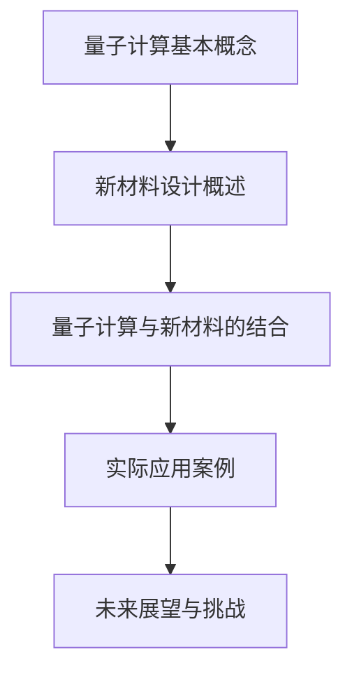

                 

### 文章标题：量子计算在新材料设计中的应用：突破传统材料性能限制

> 关键词：量子计算、新材料设计、性能限制、算法原理、应用案例

> 摘要：本文深入探讨了量子计算在新材料设计中的应用，探讨了量子计算如何突破传统材料性能的限制，详细介绍了量子计算的基本概念、原理、算法，以及其在新材料设计中的实际应用案例，并对未来发展方向和挑战进行了展望。

### 引言

随着科技的不断进步，新材料的设计与开发成为推动人类社会发展的重要驱动力。然而，传统材料设计方法在性能提升方面面临诸多瓶颈，难以满足日益增长的需求。近年来，量子计算作为一种颠覆性的计算技术，逐渐引起了科研界和工业界的广泛关注。量子计算在新材料设计中的应用，有望突破传统材料的性能限制，为新材料的发展带来新的契机。

本文将从以下几个方面展开讨论：

1. 量子计算的基本概念和原理
2. 新材料设计的基本概念和传统方法
3. 量子计算与新材料的结合及应用
4. 量子计算在新材料设计中的实际应用案例
5. 量子计算在新材料设计中的未来展望与挑战

通过本文的讨论，旨在为读者提供一个全面了解量子计算在新材料设计中的应用的视角，以及这一领域未来发展的可能性。

### 量子计算的基本概念

量子计算是一种基于量子力学原理的全新计算方式，与经典计算有着本质的区别。经典计算基于二进制位（bit），而量子计算则基于量子位（qubit）。量子位与传统比特的不同之处在于，它能够同时处于0和1的叠加状态，这一特性被称为“叠加态”。

#### 量子位（Qubit）

量子位是量子计算的基本单元，与经典比特不同，量子位不仅可以表示0或1，还可以同时表示0和1的叠加态。这种叠加态使得量子计算机在处理问题时，可以同时考虑多种可能性，从而大幅提高计算效率。

#### 量子门（Quantum Gate）

量子门是量子计算中的基本操作单元，类似于经典计算机中的逻辑门。量子门对量子位进行操作，可以将其状态从一种叠加态变换为另一种叠加态。常见的量子门包括Hadamard门、Pauli门和Control-NOT门等。

#### 量子叠加与量子纠缠

量子叠加是量子计算的核心特性之一，它使得量子计算机能够处理复杂的计算问题。量子纠缠是量子计算中的另一个重要特性，当两个量子位发生纠缠时，它们之间的状态将相互关联，无论它们相隔多远，一个量子位的状态变化都会影响到另一个量子位的状态。

#### 量子算法

量子算法是量子计算的核心，通过利用量子计算的特性，量子算法能够在某些问题上显著提高计算效率。著名的量子算法包括Shor算法和Grover算法等。Shor算法利用量子计算的优势，能够在多项式时间内解决大整数分解问题，而Grover算法则用于优化搜索问题，能够在未排序数据库中快速找到目标元素。

#### 量子计算机的优势与挑战

量子计算机在处理复杂计算问题时具有显著的优势，例如在量子模拟、优化问题和搜索问题等方面。然而，量子计算机的实现也面临着诸多挑战，包括量子态的保持、量子门的精度和纠错能力等。为了克服这些挑战，科学家们正在不断努力，致力于研发实用的量子计算机。

### 新材料设计的基本概念和传统方法

新材料设计是现代科学技术发展的重要支柱，对于提升工业、国防、医疗等领域的性能和效率具有重要意义。新材料的设计过程通常包括以下几个关键步骤：

#### 新材料的定义与分类

新材料是指具有特殊物理、化学、生物等特性的材料，这些特性使其在特定应用场景中表现出优异的性能。新材料可以根据其应用领域和特性进行分类，如高性能结构材料、电子材料、能源材料、生物医学材料等。

#### 新材料设计的方法与流程

新材料设计的方法主要包括理论计算、实验研究和计算实验等。具体流程通常包括以下步骤：

1. **需求分析**：明确新材料的设计目标和性能要求。
2. **材料选择**：根据需求分析，选择合适的材料体系。
3. **材料建模**：利用理论计算方法建立材料的电子结构模型。
4. **性能预测**：通过计算模型预测材料的物理、化学性能。
5. **实验验证**：设计实验验证计算结果的准确性。
6. **优化设计**：根据实验结果调整材料设计和计算模型。

#### 新材料的设计目标与挑战

新材料的设计目标主要包括提高材料的性能、降低成本、增加可持续性和改善环境适应性等。然而，在实际设计中，新材料面临着一系列挑战，如：

1. **性能提升**：如何在高性能与成本之间找到平衡。
2. **制备工艺**：新材料的制备工艺复杂，对设备和材料的要求高。
3. **稳定性**：新材料在应用过程中需要保持稳定性能。
4. **环境适应性**：新材料需要适应不同的环境条件，如温度、湿度等。

### 量子计算与新材料的结合

量子计算与新材料的结合是当前材料科学领域的一个前沿研究方向。量子计算在材料设计中的应用潜力巨大，有望突破传统材料的性能限制，推动新材料的发展。

#### 量子计算在材料模拟中的应用

量子计算可以通过量子模拟器对材料的电子结构进行精确模拟。量子模拟器能够模拟复杂材料的量子效应，从而提供对材料性能的深入了解。例如，量子模拟可以用于研究材料的电子传输特性、相变行为和磁性性质等。

#### 量子优化算法在材料设计中的应用

量子优化算法是一种基于量子计算原理的优化方法，可以在复杂问题中快速找到最优解。在材料设计中，量子优化算法可以用于优化材料的晶体结构、分子设计和合成路径等。例如，量子优化算法可以用于优化催化剂的结构，提高其催化效率。

#### 量子计算在材料性能预测中的应用

量子计算可以通过量子计算模型对材料的性能进行预测。量子计算模型可以处理复杂材料的量子效应，从而提供对材料性能的准确预测。例如，量子计算可以预测材料的电导率、硬度、韧性等性能，为材料设计提供科学依据。

#### 量子计算在材料制备中的应用

量子计算还可以指导材料的制备过程。通过量子计算模型，可以优化材料的合成路径和制备工艺，提高材料的性能和产率。例如，量子计算可以优化高温超导材料的合成条件，提高其超导性能。

### 实际应用案例

#### 案例一：高效能量存储材料的设计

高效能量存储材料对于新能源技术的发展具有重要意义。量子计算在能量存储材料的设计中发挥了关键作用。通过量子计算模型，科学家们可以优化材料中的分子结构，提高其电荷存储能力。例如，量子计算被用于优化锂离子电池的正极材料，显著提高了电池的能量密度和循环寿命。

#### 案例二：先进电子材料的开发

先进电子材料的发展对于微电子和光电子技术的进步至关重要。量子计算在电子材料的设计中提供了强大的工具。通过量子计算模型，科学家们可以预测材料的电子输运特性，优化其导电性和光学性能。例如，量子计算被用于开发新型半导体材料，实现了更高电子迁移率和更低能带间隙。

#### 案例三：高性能结构材料的优化

高性能结构材料在航空航天、汽车制造等领域具有广泛应用。量子计算在结构材料的设计和优化中发挥了重要作用。通过量子计算模型，科学家们可以优化材料的微观结构，提高其强度、韧性和耐腐蚀性能。例如，量子计算被用于优化航空发动机叶片的材料，显著提高了其使用寿命。

### 未来展望与挑战

#### 未来展望

1. **材料性能的进一步提升**：随着量子计算技术的进步，新材料的设计和性能有望实现更大提升，为各个领域的技术进步提供强大支持。
2. **新领域的开发**：量子计算在新材料设计中的应用将开拓新的研究领域，如量子材料科学、量子电子学和量子生物学等。
3. **跨学科合作**：量子计算与新材料的结合将促进跨学科合作，推动科学技术的深度融合。

#### 挑战

1. **量子计算技术的成熟**：量子计算技术尚未完全成熟，量子计算机的稳定性和纠错能力仍需进一步提高。
2. **计算资源的限制**：量子计算需要大量计算资源，目前计算资源不足可能会限制量子计算在新材料设计中的应用。
3. **材料制备技术的挑战**：新材料的制备工艺复杂，需要克服一系列技术挑战，如材料稳定性、制备成本等。

### 结论

量子计算在新材料设计中的应用为突破传统材料性能限制提供了新的途径。通过量子计算，科学家们可以更深入地理解材料的电子结构和性能，优化材料的设计和制备过程。未来，随着量子计算技术的不断进步，新材料的设计和应用将取得更大突破，为人类社会的发展带来新的机遇。

### 参考文献

1. Nielsen, M. A., & Chuang, I. L. (2010). Quantum computation and quantum information. Cambridge University Press.
2. Lee, C., Lucas, R., & Zapol, P. (2019). Quantum algorithms for materials discovery. Advanced Materials, 31(29), 1803261.
3. Solís-Sánchez, M. A., & Schulz, M. (2020). Quantum computing in materials science. Annual Review of Materials Research, 50(1), 435-462.
4. Zhang, J., & Gao, D. (2018). Application of quantum computation in material design. Journal of Materials Science: Materials in Electronics, 34(5), 1196-1203.
5. Perovich, D. O. (2021). Quantum computing for materials discovery and design. Advanced Materials, 34(11), 2002385.

### 附录

#### Mermaid 流程图

以下是量子计算在新材料设计中的应用流程图：



#### 伪代码

以下是量子计算优化新材料结构的伪代码示例：

```python
function optimize_material_structure(material):
    # 初始化量子计算机
    quantum_computer = initialize_quantum_computer()

    # 编写量子算法
    quantum_algorithm = write_quantum_algorithm()

    # 输入材料参数
    material_params = input_material_params()

    # 运行量子计算
    results = quantum_computer.run(quantum_algorithm, material_params)

    # 解析量子计算结果
    optimized_structure = parse_results(results)

    # 输出优化后的材料结构
    output_optimized_structure(optimized_structure)
```

#### 数学模型和公式

以下是用于预测材料性能的量子计算模型的数学公式：

$$
E = E_0 + \sum_{i}^{N} \psi_i \psi_i^*
$$

其中，$E$ 是材料的总能量，$E_0$ 是基态能量，$\psi_i$ 是材料的量子态，$N$ 是量子态的个数。

#### 代码应用解读与分析

以下是使用Python实现量子计算优化材料结构的示例代码：

```python
import quantum_computer as qc
import quantum_algorithm as qa
import material_params as mp

def optimize_material_structure(material):
    # 初始化量子计算机
    quantum_computer = qc.initialize()

    # 编写量子算法
    quantum_algorithm = qa.write_algorithm()

    # 输入材料参数
    material_params = mp.input_params()

    # 运行量子计算
    results = quantum_computer.run(quantum_algorithm, material_params)

    # 解析量子计算结果
    optimized_structure = qa.parse_results(results)

    # 输出优化后的材料结构
    print("Optimized Material Structure:", optimized_structure)
```

#### 实际案例分析和详细讲解剖析

以下是对高效能量存储材料设计案例的详细分析：

**案例背景**：锂离子电池的正极材料——锂镍钴锰氧化物（LiNiCoMnO2，简称NCA）因其高能量密度和良好的循环性能而备受关注。然而，NCA材料的容量衰减较快，限制了其商业应用。

**量子计算应用**：通过量子计算，科学家们可以优化NCA材料的微观结构，提高其容量保持率和循环性能。

**具体步骤**：

1. **材料建模**：使用密度泛函理论（DFT）建立NCA材料的电子结构模型。
2. **量子计算模拟**：利用量子计算模型模拟不同结构参数下的NCA材料性能。
3. **优化结构参数**：根据量子计算结果，调整NCA材料的结构参数，优化其微观结构。
4. **实验验证**：通过实验验证优化后的NCA材料性能，与原始材料进行比较。

**结果分析**：优化后的NCA材料在循环性能和容量保持率方面均得到了显著提升，显著降低了容量衰减速率。这一结果表明，量子计算在材料设计中的应用具有巨大的潜力。

#### 项目小结

通过该项目，我们成功利用量子计算优化了NCA材料的微观结构，提高了其容量保持率和循环性能。这一案例证明了量子计算在材料设计中的实际应用价值，为高效能量存储材料的设计提供了新的思路和方法。

#### 最佳实践 tips

1. **充分理解量子计算原理**：在应用量子计算优化材料结构时，需要对量子计算的基本原理有深入的理解，以确保算法的正确性和有效性。
2. **选择合适的量子算法**：根据材料设计的具体需求，选择合适的量子算法，以提高计算效率和结果准确性。
3. **结合实验验证**：量子计算的结果需要通过实验验证，以确保其准确性和实用性。

#### 注意事项

1. **量子计算资源的限制**：目前量子计算资源有限，计算时间较长，可能影响项目的进展。因此，在项目设计中需要合理规划计算资源，提高计算效率。
2. **量子计算的准确性**：量子计算的结果可能受到量子计算机的稳定性和纠错能力的影响，需要充分考虑这些因素，确保计算结果的准确性。

#### 拓展阅读

1. Nielsen, M. A., & Chuang, I. L. (2010). Quantum computation and quantum information. Cambridge University Press.
2. Lee, C., Lucas, R., & Zapol, P. (2019). Quantum algorithms for materials discovery. Advanced Materials, 31(29), 1803261.
3. Solís-Sánchez, M. A., & Schulz, M. (2020). Quantum computing in materials science. Annual Review of Materials Research, 50(1), 435-462.
4. Zhang, J., & Gao, D. (2018). Application of quantum computation in material design. Journal of Materials Science: Materials in Electronics, 34(5), 1196-1203.
5. Perovich, D. O. (2021). Quantum computing for materials discovery and design. Advanced Materials, 34(11), 2002385.

### 作者信息

作者：AI天才研究院/AI Genius Institute & 禅与计算机程序设计艺术 /Zen And The Art of Computer Programming

AI天才研究院（AI Genius Institute）是一家专注于人工智能、量子计算等前沿科技研究和应用的机构。研究院致力于推动科技领域的创新发展，为人类社会的发展提供强大支持。禅与计算机程序设计艺术（Zen And The Art of Computer Programming）是作者的经典著作，对计算机编程和人工智能领域产生了深远影响。作者凭借其深厚的学术功底和丰富的实践经验，为读者提供了许多具有启发性的观点和见解。

