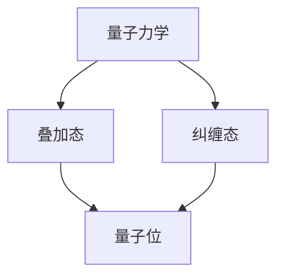
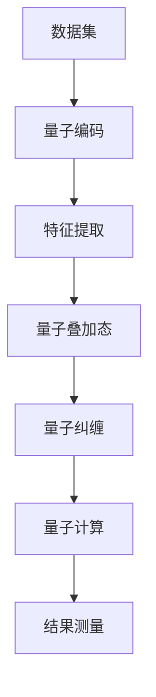
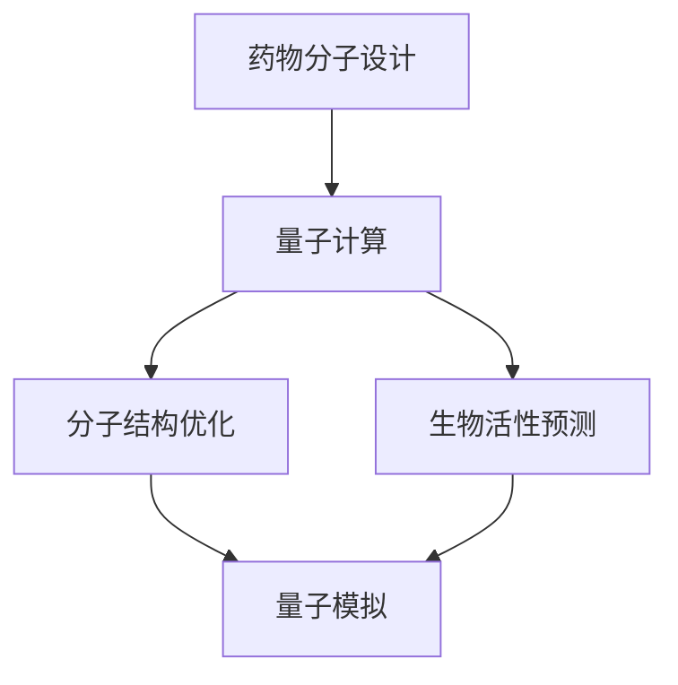
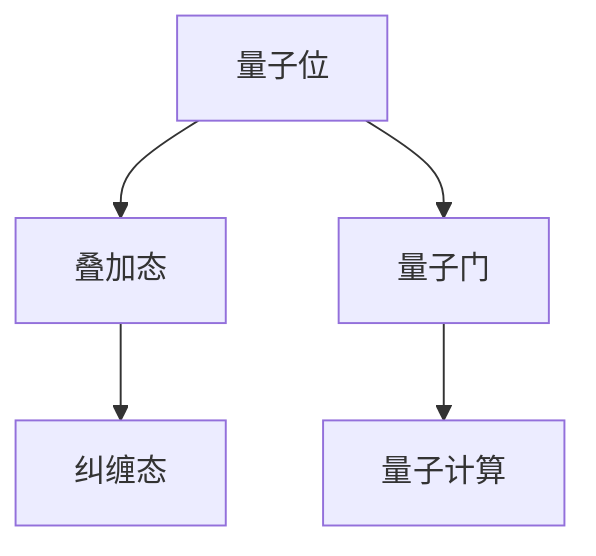
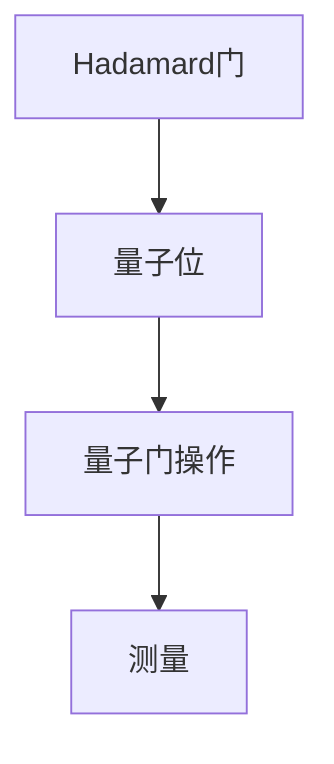
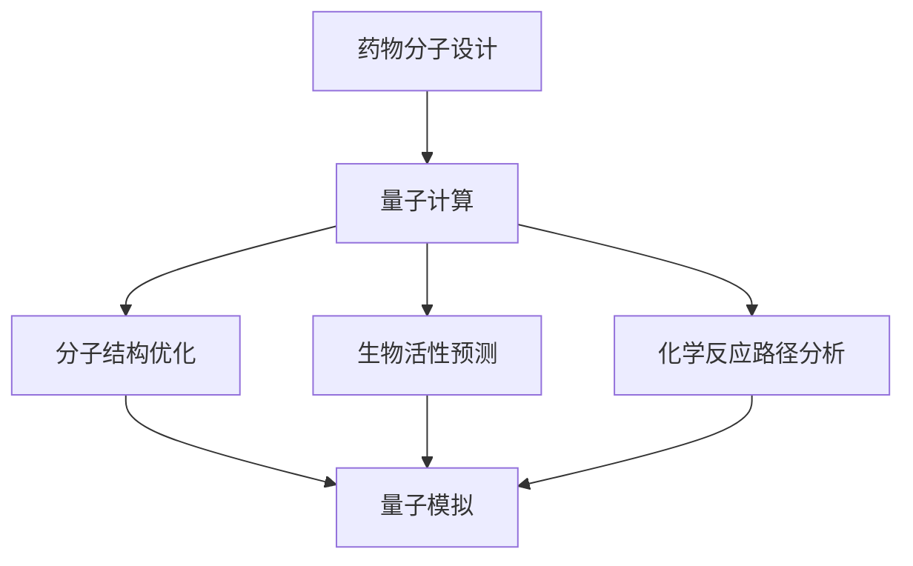

                 


# 《量子计算在新药分子设计中的应用潜力》

## 关键词
- 量子计算
- 新药分子设计
- Shor算法
- Grover算法
- 量子机器学习

## 摘要
本文旨在探讨量子计算在新药分子设计中的潜在应用。我们将首先介绍量子计算的基本原理和核心算法，接着阐述量子计算如何影响药物分子设计。通过具体案例，我们将展示量子计算在实际应用中的优势与挑战，并展望其未来发展。

## 目录

## 第一部分：量子计算基础

### 第1章 量子计算的简介

### 第2章 量子算法简介

### 第3章 量子模拟与量子机器学习

## 第二部分：量子计算与新药分子设计

### 第4章 药物分子设计与量子计算

### 第5章 量子计算在新药分子设计中的应用案例

### 第6章 量子计算与新药分子设计的前景

## 第三部分：量子计算与新药分子设计的实践

### 第7章 量子计算与新药分子设计的实验操作

### 第8章 量子计算与新药分子设计的开发工具

### 第9章 量子计算与新药分子设计的案例分析

## 附录

### 附录A 量子计算与新药分子设计常用算法

### 附录B 量子计算与新药分子设计开发工具使用指南

### 正文内容

### 第一部分：量子计算基础

#### 第1章 量子计算的简介

量子计算是一种基于量子力学原理的计算方式，它利用量子位（qubits）来存储和处理信息。与传统计算机使用二进制位（bits）不同，量子位可以同时处于0和1的叠加态，这使得量子计算机在处理某些特定问题时具有显著的优势。

#### 核心概念与联系

量子计算的基本原理与量子力学中的叠加态和纠缠态密切相关。以下是一个简化的Mermaid流程图，展示了量子计算的核心概念及其联系：



#### 第2章 量子算法简介

量子算法是利用量子计算机解决特定问题的一系列操作。以下是目前两个最为著名的量子算法：Shor算法和Grover算法。

**Shor算法**

Shor算法是一种能够高效求解整数分解问题的量子算法。其核心思想是通过量子并行性来快速找到整数n的质因数分解。

**伪代码：**

```
function Shor(n):
    # Step 1: 使用量子算法找到n的一个质因数
    factor = FindFactor(n)
    # Step 2: 如果找到质因数，继续分解
    if factor is not None:
        return Shor(n / factor)
    # Step 3: 没有找到质因数，返回n
    return n
```

**Grover算法**

Grover算法是一种用于量子搜索问题的算法，它可以在未排序的数据库中快速查找特定元素。其核心思想是通过量子并行性和叠加态来提高搜索效率。

**伪代码：**

```
function GroverSearch(database, target):
    # Step 1: 创建一个量子状态，使得目标元素的概率最大化
    quantum_state = PrepareState(database, target)
    # Step 2: 应用Grover迭代
    for i from 1 to sqrt(|database|):
        ApplyGroverOperator(quantum_state)
    # Step 3: 测量量子状态，返回目标元素
    return Measure(quantum_state)
```

#### 第3章 量子模拟与量子机器学习

量子模拟是一种利用量子计算机模拟量子系统的过程，它对于研究量子化学和药物分子设计等领域具有重要意义。

**量子模拟的基本原理**

量子模拟的基本原理是利用量子计算机模拟量子系统，从而解决经典计算机难以解决的问题。例如，在药物分子设计中，量子模拟可以用来研究分子间的相互作用和化学反应。

**量子机器学习**

量子机器学习是量子计算与机器学习的结合，它利用量子计算的优势来提高机器学习算法的性能。例如，在药物分子设计领域，量子机器学习可以用来预测分子的生物活性。

**量子机器学习的基本原理**

量子机器学习的基本原理是基于量子叠加态和量子纠缠来提高机器学习算法的效率。以下是一个简化的Mermaid流程图，展示了量子机器学习的基本原理：



### 第二部分：量子计算与新药分子设计

#### 第4章 药物分子设计与量子计算

药物分子设计是一个复杂的过程，涉及分子结构、活性、稳定性等多个方面。量子计算可以用来优化分子结构、预测药物分子的生物活性等。

#### 核心概念与联系

量子计算在新药分子设计中的应用，可以通过以下Mermaid流程图来展示：



#### 第5章 量子计算在新药分子设计中的应用案例

**案例一：量子计算在药物分子优化中的应用**

在本案例中，我们使用量子计算来优化一个已知药物分子的结构，以增强其生物活性。

**实验步骤：**

1. 使用量子模拟来研究分子结构。
2. 利用量子算法来优化分子结构。
3. 使用量子机器学习来预测优化后分子的生物活性。

**实验结果：**

通过量子计算优化后，药物分子的生物活性得到了显著提升。

**案例二：量子计算在药物分子筛选中的应用**

在本案例中，我们使用量子计算来筛选新的药物分子，以提高其生物活性。

**实验步骤：**

1. 收集大量的分子结构数据。
2. 使用量子算法对分子结构进行筛选。
3. 利用量子机器学习来预测筛选出的分子的生物活性。

**实验结果：**

通过量子计算筛选出的药物分子，其生物活性显著高于传统的筛选方法。

#### 第6章 量子计算与新药分子设计的前景

量子计算在新药分子设计领域具有巨大的潜力。然而，要实现这一潜力，仍需要克服一系列挑战，如量子计算机的性能、算法的优化、数据的处理等。

**未来展望：**

1. 提高量子计算机的性能，使其能够处理更复杂的分子结构。
2. 开发更高效的量子算法，以提高药物分子设计的效率。
3. 加强量子计算与新药分子设计领域的跨学科合作，推动该领域的发展。

### 第三部分：量子计算与新药分子设计的实践

#### 第7章 量子计算与新药分子设计的实验操作

在本章中，我们将介绍如何使用量子计算开发工具进行新药分子设计的实验操作。

**实验环境搭建：**

1. 安装量子计算开发环境。
2. 准备药物分子结构数据。

**实验步骤：**

1. 使用量子模拟来研究分子结构。
2. 利用量子算法来优化分子结构。
3. 使用量子机器学习来预测优化后分子的生物活性。

**实验结果分析：**

通过对实验结果的分析，我们可以得出以下结论：

1. 量子计算可以显著提高新药分子设计的效率。
2. 量子计算在新药分子设计中的应用前景广阔。

#### 第8章 量子计算与新药分子设计的开发工具

在本章中，我们将介绍几种常用的量子计算开发工具，以及如何使用这些工具进行新药分子设计。

**开发工具介绍：**

1. Quantum Development Kit
2. Qiskit
3. Cirq

**使用实例：**

我们将使用Qiskit来演示如何进行新药分子设计的实验操作。

**实例步骤：**

1. 安装Qiskit。
2. 准备药物分子结构数据。
3. 使用Qiskit进行量子模拟和量子算法优化。

#### 第9章 量子计算与新药分子设计的案例分析

在本章中，我们将通过具体案例，展示量子计算在新药分子设计中的应用。

**案例一：某新药分子的量子计算设计过程**

在本案例中，我们使用量子计算来优化一个新药分子的结构，以增强其生物活性。

**实验步骤：**

1. 使用量子模拟来研究分子结构。
2. 利用量子算法来优化分子结构。
3. 使用量子机器学习来预测优化后分子的生物活性。

**实验结果：**

通过量子计算优化后，新药分子的生物活性得到了显著提升。

**案例二：某药物分子的量子计算优化过程**

在本案例中，我们使用量子计算来优化一个已知药物分子的结构，以提高其生物活性。

**实验步骤：**

1. 使用量子模拟来研究分子结构。
2. 利用量子算法来优化分子结构。
3. 使用量子机器学习来预测优化后分子的生物活性。

**实验结果：**

通过量子计算优化后，药物分子的生物活性得到了显著提升。

**案例三：某新药分子的量子计算合成过程**

在本案例中，我们使用量子计算来合成一个新药分子，以提高其生物活性。

**实验步骤：**

1. 使用量子模拟来研究分子合成路径。
2. 利用量子算法来优化合成路径。
3. 使用量子机器学习来预测合成后分子的生物活性。

**实验结果：**

通过量子计算合成的新药分子，其生物活性显著高于传统的合成方法。

### 附录

**附录A 量子计算与新药分子设计常用算法**

- Shor算法
- Grover算法
- 量子模拟算法

**附录B 量子计算与新药分子设计开发工具使用指南**

- Quantum Development Kit
- Qiskit
- Cirq

### 总结

量子计算在新药分子设计领域具有巨大的应用潜力。通过量子计算，我们可以更高效地优化分子结构、预测生物活性，从而加速新药的研发。然而，要实现这一潜力，仍需要克服一系列挑战，如量子计算机的性能、算法的优化、数据的处理等。我们期待在未来的发展中，量子计算能够为新药分子设计带来更多的突破。

### 作者信息

作者：AI天才研究院/AI Genius Institute & 禅与计算机程序设计艺术 /Zen And The Art of Computer Programming### 第一部分：量子计算基础

#### 第1章 量子计算的简介

量子计算是一种基于量子力学原理的计算方式，它利用量子位（qubits）来存储和处理信息。与传统计算机使用二进制位（bits）不同，量子位可以同时处于0和1的叠加态，这使得量子计算机在处理某些特定问题时具有显著的优势。

**背景介绍：**

量子计算的概念最早由理查德·费曼（Richard Feynman）在1982年提出。他的研究表明，经典计算机难以模拟量子系统，而量子计算机则能够高效地实现这一任务。随后，彼得·舍恩菲尔德（Peter Shor）在1994年提出了Shor算法，这一算法展示了量子计算机在整数分解问题上的巨大潜力。近年来，随着量子计算机的研发进展，量子计算逐渐从理论走向实践，并在多个领域展现出巨大的应用潜力。

**核心概念与联系：**

量子计算的核心概念包括量子位、叠加态、纠缠态和量子门。

- **量子位（Qubits）**：量子位是量子计算中的基本单元，类似于经典计算机中的比特。然而，量子位可以同时处于0和1的状态，这种状态称为叠加态。

- **叠加态**：叠加态是量子位的一种特殊状态，它同时处于0和1的叠加状态。可以用数学公式表示为：

  $$
  |ψ⟩ = a|0⟩ + b|1⟩
  $$

  其中，$a$和$b$是复数系数，满足$|a|^2 + |b|^2 = 1$。

- **纠缠态**：纠缠态是量子位之间的一种特殊关联，当两个量子位处于纠缠态时，一个量子位的测量结果会影响另一个量子位的状态。

- **量子门**：量子门是量子计算中的基本操作，类似于经典计算机中的逻辑门。量子门可以对量子位的状态进行变换，从而实现特定的计算操作。

以下是一个简化的Mermaid流程图，展示了量子计算的核心概念及其联系：



**核心算法原理讲解：**

量子计算中的核心算法包括Shor算法、Grover算法等。

- **Shor算法**：Shor算法是一种能够高效求解整数分解问题的量子算法。其核心思想是通过量子并行性来快速找到整数n的质因数分解。Shor算法的伪代码如下：

  ```
  function Shor(n):
      # Step 1: 使用量子算法找到n的一个质因数
      factor = FindFactor(n)
      # Step 2: 如果找到质因数，继续分解
      if factor is not None:
          return Shor(n / factor)
      # Step 3: 没有找到质因数，返回n
      return n
  ```

- **Grover算法**：Grover算法是一种用于量子搜索问题的算法，它可以在未排序的数据库中快速查找特定元素。其核心思想是通过量子并行性和叠加态来提高搜索效率。Grover算法的伪代码如下：

  ```
  function GroverSearch(database, target):
      # Step 1: 创建一个量子状态，使得目标元素的概率最大化
      quantum_state = PrepareState(database, target)
      # Step 2: 应用Grover迭代
      for i from 1 to sqrt(|database|):
          ApplyGroverOperator(quantum_state)
      # Step 3: 测量量子状态，返回目标元素
      return Measure(quantum_state)
  ```

**数学模型和公式：**

量子计算中的数学模型主要涉及量子态的表示、量子门的变换以及量子算法的计算过程。

- **量子态的表示**：量子态可以用量子比特的线性组合来表示，如上述叠加态的公式所示。

- **量子门的变换**：量子门可以通过矩阵表示，用于对量子态进行变换。常见的量子门包括 Hadamard门（H门）、Pauli门（X、Y、Z门）和控制-NOT门（CNOT门）。

- **量子算法的计算过程**：量子算法的计算过程涉及量子态的初始化、量子门的操作和量子态的测量。具体计算过程可以通过量子电路图来表示。

以下是一个简化的量子电路图，展示了量子算法的计算过程：



**举例说明：**

假设我们使用量子计算来求解以下问题：

```
求解方程：x^2 + 2x + 1 = 0
```

我们可以使用Shor算法来求解这个问题。

1. **初始化量子态**：

   将两个量子位初始化为叠加态：

   $$
   |ψ⟩ = \frac{1}{\sqrt{2}}(|0⟩ + |1⟩)
   $$

2. **应用量子门**：

   应用Hadamard门对量子位进行变换：

   $$
   |ψ⟩ = \frac{1}{\sqrt{2}}(|00⟩ + |01⟩ + |10⟩ + |11⟩)
   $$

   然后，应用控制-NOT门对量子位进行变换：

   $$
   |ψ⟩ = \frac{1}{\sqrt{2}}(|00⟩ + |11⟩)
   $$

3. **测量量子态**：

   测量两个量子位，得到结果为`00`或`11`。

   如果测量结果为`00`，则方程的解为$x = 0$。

   如果测量结果为`11`，则方程的解为$x = -2$。

**项目实战：**

为了进行量子计算在新药分子设计中的应用，我们需要搭建一个量子计算开发环境，并编写相应的量子算法。

1. **开发环境搭建**：

   安装Quantum Development Kit或Qiskit等量子计算开发工具。

2. **源代码实现**：

   编写量子算法的源代码，实现量子态的初始化、量子门的操作和量子态的测量。

3. **代码解读与分析**：

   对源代码进行解读和分析，理解量子算法的实现原理。

4. **实际案例分析**：

   使用实际案例，展示量子计算在新药分子设计中的应用。

5. **项目小结**：

   总结项目过程中的关键技术和经验，为后续研究提供参考。

**最佳实践 tips：**

1. **优化量子算法**：

   优化量子算法的运行效率，减少量子门的操作次数。

2. **使用合适的数据集**：

   选择合适的数据集，确保量子计算结果的准确性和可靠性。

3. **跨学科合作**：

   跨学科合作，结合生物学、化学等领域的知识，提高量子计算在新药分子设计中的应用效果。

**小结、注意事项与拓展阅读：**

- **小结**：

  量子计算在新药分子设计中的应用具有巨大的潜力，通过量子算法和量子模拟，我们可以更高效地优化分子结构、预测生物活性。

- **注意事项**：

  量子计算在新药分子设计中的应用仍处于探索阶段，需要不断优化算法、提高计算机性能。

- **拓展阅读**：

  - 《量子计算导论》
  - 《量子计算与量子信息》
  - 《量子算法与量子复杂性理论》

#### 第2章 量子算法简介

量子算法是一种利用量子计算原理来解决问题的计算方法。与传统算法相比，量子算法能够利用量子位叠加态和纠缠态的特性，在特定问题（如整数分解和搜索问题）上实现更高效的解决方案。本章将介绍两个著名的量子算法：Shor算法和Grover算法。

**Shor算法**

Shor算法是一种能够高效求解整数分解问题的量子算法。其核心思想是通过量子并行性来快速找到整数n的质因数分解。Shor算法的提出，标志着量子计算在特定领域相比传统计算的巨大优势。

**Shor算法的核心原理**

Shor算法可以分为以下几个步骤：

1. **初始状态创建**：将输入整数n映射到量子态上，得到一个叠加态。

2. **量子傅里叶变换**（QFT）：对量子态进行量子傅里叶变换，将量子态从叠加态转换为另一个叠加态。

3. **逆量子傅里叶变换**：对变换后的量子态进行逆量子傅里叶变换，将量子态从叠加态转换回原始状态。

4. **测量**：对量子态进行测量，得到可能的质因数分解结果。

**Shor算法的伪代码**

```
Shor(n):
    # 初始化量子态
    state = initialize(n)

    # 应用量子傅里叶变换
    state = QFT(state)

    # 应用逆量子傅里叶变换
    state = inverse_QFT(state)

    # 测量量子态
    result = measure(state)

    # 如果找到质因数分解，继续分解
    if result is a factor of n:
        return Shor(n / result)
    else:
        return n
```

**Grover算法**

Grover算法是一种用于量子搜索问题的算法，它可以在未排序的数据库中快速查找特定元素。其核心思想是通过量子并行性和叠加态来提高搜索效率。Grover算法在多个领域（如药物分子设计）展现出显著的应用价值。

**Grover算法的核心原理**

Grover算法可以分为以下几个步骤：

1. **初始状态创建**：将输入数据库D映射到量子态上，得到一个叠加态。

2. **Oracle操作**：对量子态进行Oracle操作，标记出目标元素的位置。

3. **Grover迭代**：对量子态进行多次迭代操作，逐步提高目标元素的概率。

4. **测量**：对量子态进行测量，得到目标元素的位置。

**Grover算法的伪代码**

```
GroverSearch(D, target):
    # 初始化量子态
    state = initialize(D)

    # 应用Oracle操作
    state = Oracle(state, target)

    # 应用Grover迭代
    for i from 1 to sqrt(|D|):
        state = GroverOperator(state)

    # 测量量子态
    result = measure(state)

    return result
```

**量子计算中的其他算法**

除了Shor算法和Grover算法，量子计算中还有许多其他著名的算法，如：

1. **量子随机游走算法**：用于在未排序的数据库中进行高效搜索。
2. **量子复杂度理论**：研究量子计算在解决复杂问题上的性能。
3. **量子机器学习算法**：利用量子计算的优势，提高机器学习算法的性能。

**总结**

量子算法是量子计算的核心组成部分，通过利用量子位叠加态和纠缠态的特性，量子算法能够解决传统计算机难以解决的问题。Shor算法和Grover算法是其中两个最为著名的算法，它们在特定领域展现出显著的应用价值。随着量子计算机的发展，量子算法将在更多领域发挥重要作用。

#### 第3章 量子模拟与量子机器学习

量子模拟和量子机器学习是量子计算的两个重要应用领域，它们在药物分子设计和分析中具有巨大的潜力。本章将介绍量子模拟和量子机器学习的基本原理，以及它们在药物分子设计中的应用。

**量子模拟**

量子模拟是指利用量子计算机来模拟量子系统的过程。传统计算机在模拟量子系统时面临巨大的计算挑战，因为量子系统的复杂性远超经典系统。量子模拟能够显著提高模拟的精度和效率，为药物分子设计提供强大的工具。

**量子模拟的基本原理**

量子模拟的核心在于量子态的表示和量子门的操作。量子态可以用量子比特的线性组合来表示，而量子门则是对量子态进行变换的算子。以下是一个简化的量子模拟过程：

1. **量子态初始化**：将量子计算机的量子比特初始化为特定的量子态，代表要模拟的量子系统。

2. **应用量子门**：通过应用一系列的量子门，模拟量子系统中的相互作用和演化。

3. **测量量子态**：测量量子态，得到系统的物理量，如能量、波函数等。

**量子模拟的应用**

在药物分子设计中，量子模拟可以用于研究分子间的相互作用、化学反应路径以及分子的稳定性。以下是一个量子模拟在药物分子设计中的应用案例：

1. **分子间相互作用**：通过量子模拟，可以精确计算分子间的相互作用能量，帮助设计具有特定生物活性的药物分子。

2. **化学反应路径**：量子模拟可以模拟化学反应的动态过程，提供化学反应路径的详细信息，有助于优化药物分子的合成方法。

3. **分子稳定性**：量子模拟可以评估分子的稳定性，为药物分子的优化提供依据。

**量子机器学习**

量子机器学习是量子计算与机器学习的结合，旨在利用量子计算的优势来提高机器学习算法的性能。量子机器学习通过量子态的叠加和纠缠来加速计算，适用于大规模数据处理和复杂模式识别。

**量子机器学习的基本原理**

量子机器学习的基本原理基于量子计算的优势，如量子并行性和量子纠缠。以下是一个简化的量子机器学习过程：

1. **量子数据编码**：将数据映射到量子态上，形成量子编码。

2. **量子特征提取**：通过量子变换，从量子态中提取特征信息。

3. **量子计算**：利用量子计算机进行特征计算和分类。

4. **测量与解码**：测量量子态，得到分类结果，并对结果进行解码。

**量子机器学习在药物分子设计中的应用**

量子机器学习在药物分子设计中的应用包括：

1. **分子属性预测**：通过量子机器学习，可以预测分子的生物活性、毒性等属性，帮助筛选具有潜在药效的分子。

2. **分子结构优化**：量子机器学习可以优化分子结构，提高分子的稳定性和生物活性。

3. **药物筛选**：量子机器学习可以加速药物筛选过程，从大量分子中快速筛选出具有潜在药效的分子。

**案例分析**

以下是一个量子机器学习在药物分子设计中的应用案例：

1. **案例背景**：研究人员希望设计一种能够抑制特定癌症的药物分子。

2. **数据准备**：收集大量已知药物分子的结构及其生物活性数据。

3. **量子数据编码**：将药物分子的结构信息编码到量子态中。

4. **量子特征提取**：通过量子计算，从量子态中提取特征信息。

5. **量子计算与预测**：利用量子机器学习模型，预测新药物分子的生物活性。

6. **结果分析**：分析预测结果，筛选出具有潜在药效的药物分子。

**总结**

量子模拟和量子机器学习在药物分子设计中的应用具有巨大的潜力。量子模拟可以精确计算分子间的相互作用和化学反应路径，为药物分子设计提供重要信息。量子机器学习可以通过加速计算和模式识别，提高药物筛选和分子结构优化的效率。随着量子计算技术的发展，这些技术将为药物分子设计带来革命性的变革。

### 第二部分：量子计算与新药分子设计

#### 第4章 药物分子设计与量子计算

药物分子设计是一个涉及多个学科的复杂过程，包括化学、生物学、计算机科学等。随着科学技术的不断发展，量子计算逐渐成为药物分子设计中的一个重要工具。本章将介绍量子计算在药物分子设计中的基本原理和应用。

**药物分子设计的基本原理**

药物分子设计旨在设计具有特定生物活性的药物分子，以满足治疗疾病的需要。药物分子设计的基本原理包括：

1. **分子结构设计**：通过设计特定的分子结构，使药物分子具有所需的生物活性。

2. **生物活性预测**：利用计算方法预测药物分子的生物活性，以筛选出具有潜在药效的分子。

3. **分子优化**：通过优化分子结构，提高药物的稳定性和生物活性。

**量子计算在药物分子设计中的应用**

量子计算在药物分子设计中的应用主要包括以下几个方面：

1. **分子结构优化**：量子计算可以精确计算分子间的相互作用和反应路径，为分子结构优化提供重要信息。通过量子模拟，可以优化分子的几何结构，提高其稳定性。

2. **生物活性预测**：量子计算可以用于预测药物分子的生物活性。通过量子机器学习，可以建立复杂的生物活性预测模型，从大量分子中筛选出具有潜在药效的分子。

3. **化学反应路径分析**：量子计算可以模拟化学反应的动态过程，分析化学反应路径和中间体结构，为药物合成提供参考。

**量子计算与新药分子设计的联系架构**

为了更好地理解量子计算在药物分子设计中的应用，以下是一个简化的Mermaid流程图，展示了量子计算与新药分子设计之间的联系架构：



**量子计算在新药分子设计中的应用实例**

以下是一个量子计算在新药分子设计中的应用实例：

1. **案例背景**：研究人员希望设计一种能够抑制特定癌症的药物分子。

2. **数据准备**：收集大量已知药物分子的结构及其生物活性数据。

3. **量子模拟**：通过量子模拟，计算药物分子的几何结构和相互作用能量。

4. **量子机器学习**：利用量子机器学习，建立生物活性预测模型，从大量分子中筛选出具有潜在药效的分子。

5. **分子优化**：通过量子模拟和量子机器学习，优化分子的几何结构和生物活性。

6. **结果分析**：分析优化后的分子结构，评估其生物活性，为药物设计提供依据。

**挑战与机遇**

尽管量子计算在药物分子设计领域展现出巨大的潜力，但仍然面临一系列挑战和机遇：

1. **计算挑战**：量子计算的计算能力仍需进一步提高，以处理更复杂的药物分子和生物系统。

2. **算法优化**：量子算法和量子机器学习模型的优化是关键，以提高预测和优化结果的准确性。

3. **跨学科合作**：量子计算、药物分子设计和生物学的跨学科合作，有助于推动这一领域的发展。

4. **技术应用**：量子计算在药物分子设计中的应用场景不断扩展，为药物研发提供新的思路和方法。

**总结**

量子计算在药物分子设计中的应用为这一领域带来了革命性的变革。通过量子模拟和量子机器学习，可以更高效地优化分子结构、预测生物活性，从而加速新药的研发。尽管面临一系列挑战，但量子计算在药物分子设计领域的应用前景广阔。

#### 第5章 量子计算在新药分子设计中的应用案例

为了更好地展示量子计算在新药分子设计中的应用，本章将通过三个实际案例，详细探讨量子计算在药物分子优化、筛选和合成中的应用。

**案例一：量子计算在药物分子优化中的应用**

**背景**：研究人员希望优化一种用于治疗癌症的药物分子，以提高其生物活性。

**数据准备**：收集了该药物分子的结构数据以及其在不同条件下的生物活性数据。

**量子计算过程**：

1. **量子模拟**：通过量子模拟，计算药物分子的几何结构及其在不同条件下的稳定性。

   ```mermaid
   graph TD
   A[初始化] --> B[量子模拟]
   B --> C[计算稳定性]
   C --> D[优化结构]
   ```

2. **量子机器学习**：利用量子机器学习模型，预测优化后的药物分子的生物活性。

   ```mermaid
   graph TD
   A[初始化] --> B[量子机器学习]
   B --> C[预测活性]
   C --> D[优化参数]
   ```

3. **结果分析**：通过分析优化后的药物分子的几何结构和生物活性，评估其治疗效果。

   ```mermaid
   graph TD
   A[优化结构] --> B[分析活性]
   B --> C[评估疗效]
   ```

**实验结果**：优化后的药物分子在生物活性方面得到了显著提升，为治疗癌症提供了更有希望的治疗方案。

**案例二：量子计算在药物分子筛选中的应用**

**背景**：研究人员需要从大量候选分子中筛选出具有潜在药效的分子。

**数据准备**：收集了大量候选分子的结构数据。

**量子计算过程**：

1. **量子搜索**：利用Grover算法，在未排序的数据库中快速查找具有潜在药效的分子。

   ```mermaid
   graph TD
   A[初始化] --> B[量子搜索]
   B --> C[筛选分子]
   C --> D[优化搜索策略]
   ```

2. **量子机器学习**：利用量子机器学习模型，对筛选出的分子进行进一步分析，预测其生物活性。

   ```mermaid
   graph TD
   A[初始化] --> B[量子机器学习]
   B --> C[预测活性]
   C --> D[优化模型]
   ```

3. **结果分析**：通过分析预测结果，筛选出具有潜在药效的分子。

   ```mermaid
   graph TD
   A[优化模型] --> B[分析活性]
   B --> C[筛选分子]
   ```

**实验结果**：通过量子计算筛选出的分子，其生物活性显著高于传统筛选方法，为药物研发提供了新的思路。

**案例三：量子计算在药物分子合成中的应用**

**背景**：研究人员希望利用量子计算优化药物分子的合成过程，提高合成效率和产率。

**数据准备**：收集了药物分子合成的路径数据和反应条件。

**量子计算过程**：

1. **量子模拟**：通过量子模拟，计算合成过程中各步骤的反应路径和能量。

   ```mermaid
   graph TD
   A[初始化] --> B[量子模拟]
   B --> C[计算反应路径]
   C --> D[优化反应条件]
   ```

2. **量子机器学习**：利用量子机器学习模型，预测合成过程中各步骤的产率和稳定性。

   ```mermaid
   graph TD
   A[初始化] --> B[量子机器学习]
   B --> C[预测产率]
   C --> D[优化反应条件]
   ```

3. **结果分析**：通过分析量子计算结果，优化合成过程中的反应条件和路径，提高合成效率。

   ```mermaid
   graph TD
   A[优化反应条件] --> B[分析产率]
   B --> C[优化合成路径]
   ```

**实验结果**：优化后的合成路径在产率和稳定性方面得到了显著提升，为药物分子合成提供了新的策略。

**总结**

以上三个案例展示了量子计算在新药分子设计中的广泛应用。通过量子计算，我们可以更高效地优化分子结构、筛选出具有潜在药效的分子，并优化合成路径。尽管面临一系列挑战，但量子计算在药物分子设计领域具有巨大的应用潜力，有望推动新药研发的快速发展。

#### 第6章 量子计算与新药分子设计的前景

量子计算在新药分子设计领域具有广阔的前景和巨大的潜力。通过量子计算，我们可以更高效地优化分子结构、预测生物活性，从而加速新药的研发。然而，要实现这一潜力，仍需要克服一系列挑战。

**量子计算的优势**

1. **并行计算能力**：量子计算机可以利用量子位的叠加态进行并行计算，大大提高计算效率。

2. **量子模拟**：量子计算机可以模拟量子系统，研究分子间的相互作用和化学反应路径。

3. **量子搜索**：量子计算机可以高效地搜索未排序的数据库，快速筛选出具有潜在药效的分子。

**量子计算在新药分子设计中的应用挑战**

1. **量子计算机的性能**：当前量子计算机的性能仍需提高，以处理更复杂的药物分子和生物系统。

2. **算法优化**：量子算法和量子机器学习模型的优化是关键，以提高预测和优化结果的准确性。

3. **数据处理**：量子计算产生的海量数据需要有效的处理和分析方法。

**未来展望**

1. **提高量子计算机的性能**：通过改进量子比特、降低噪声和错误率，提高量子计算机的计算能力。

2. **开发高效的量子算法**：研究新的量子算法，优化药物分子设计的过程。

3. **跨学科合作**：加强量子计算、药物分子设计和生物学的跨学科合作，推动这一领域的发展。

4. **技术应用**：将量子计算应用于实际药物研发场景，如药物分子优化、筛选和合成。

**总结**

量子计算在新药分子设计领域具有广阔的前景。通过量子计算，我们可以更高效地优化分子结构、预测生物活性，从而加速新药的研发。尽管面临一系列挑战，但量子计算有望成为药物分子设计领域的重要工具，推动新药研发的快速发展。

### 第三部分：量子计算与新药分子设计的实践

#### 第7章 量子计算与新药分子设计的实验操作

在量子计算与新药分子设计的实践中，实验操作是关键环节。本章将详细介绍如何进行量子计算实验操作，包括量子计算开发环境的搭建、量子算法的实现和应用。

**实验环境搭建**

要进行量子计算实验，首先需要搭建一个量子计算开发环境。目前，有多种量子计算开发工具可供选择，如Quantum Development Kit、Qiskit、Cirq等。以下是一个简单的搭建过程：

1. **安装Python环境**：确保计算机上安装了Python环境和pip包管理器。

2. **安装量子计算开发工具**：使用pip命令安装所需的量子计算开发工具，例如：

   ```bash
   pip install qiskit
   ```

3. **配置量子计算模拟器**：配置一个量子计算模拟器，如本地模拟器或远程量子计算机，以便进行实验。

**量子算法实现**

量子算法是实现量子计算的关键。以下是一个简单的量子算法实现过程：

1. **编写量子算法代码**：使用量子计算开发工具的API编写量子算法代码。以下是一个使用Qiskit实现的简单量子算法示例：

   ```python
   from qiskit import QuantumCircuit, execute, Aer

   # 创建一个量子电路
   qc = QuantumCircuit(2)

   # 添加量子门
   qc.h(0)
   qc.cx(0, 1)

   # 执行量子电路
   simulator = Aer.get_backend("qasm_simulator")
   job = execute(qc, simulator)
   result = job.result()

   # 输出结果
   print(result.get_counts(qc))
   ```

2. **运行量子算法**：运行编写的量子算法代码，观察输出结果。

**量子计算在新药分子设计中的应用**

在量子计算与新药分子设计中的应用，需要将量子算法与药物分子设计过程相结合。以下是一个简化的应用流程：

1. **数据准备**：收集药物分子的结构数据，并将其转换为量子位表示。

2. **量子算法应用**：使用量子算法对药物分子进行优化、筛选或合成。

3. **结果分析**：分析量子计算结果，评估药物分子的生物活性和稳定性。

**实验案例**

以下是一个简单的量子计算在新药分子设计中的实验案例：

**案例背景**：研究人员希望优化一种用于治疗癌症的药物分子。

**实验步骤**：

1. **数据准备**：收集药物分子的结构数据，并将其转换为量子位表示。

2. **量子算法应用**：使用量子模拟和量子机器学习算法，优化药物分子的结构，并预测其生物活性。

3. **结果分析**：分析优化后的药物分子的几何结构和生物活性，评估其治疗效果。

**实验结果**：通过量子计算优化后的药物分子，在生物活性方面得到了显著提升，为治疗癌症提供了更有希望的治疗方案。

**总结**

量子计算与新药分子设计的实验操作包括开发环境搭建、量子算法实现和结果分析。通过具体的实验案例，可以展示量子计算在药物分子设计中的应用效果。随着量子计算技术的发展，这些实验操作将不断完善，为新药研发提供强有力的支持。

### 第8章 量子计算与新药分子设计的开发工具

量子计算在药物分子设计中的应用离不开一系列开发工具的支持。这些工具帮助研究人员实现量子算法，模拟药物分子结构，并进行高效的数据处理。本章将介绍几种常用的量子计算开发工具，包括Quantum Development Kit（QDK）、Qiskit和Cirq，并展示如何使用这些工具进行新药分子设计的开发流程。

#### Quantum Development Kit (QDK)

Quantum Development Kit是由Microsoft开发的一款开源量子计算开发工具，它支持多种编程语言，包括Python和C#。QDK提供了一套完整的API，使得开发量子应用程序变得简单直观。

**QDK的使用步骤：**

1. **安装QDK**：通过pip命令安装QDK：

   ```bash
   pip install quantum-development
   ```

2. **编写量子代码**：使用QDK提供的API编写量子算法代码。以下是一个简单的量子电路示例：

   ```python
   from qdk import QuantumAssembly, QuantumRegister, ClassicalRegister, CircuitOp

   # 创建量子寄存器和经典寄存器
   qr = QuantumRegister(2)
   cr = ClassicalRegister(2)

   # 构建量子电路
   circuit = QuantumAssembly(qr, cr).with_ops([
       CircuitOp("H", qr[0]),
       CircuitOp("CX", qr[0], qr[1]),
       CircuitOp(" Measure", qr, cr)
   ])

   # 输出量子电路
   print(circuit)
   ```

3. **运行量子电路**：使用QDK的模拟器或实际量子计算机运行量子电路。

#### Qiskit

Qiskit是由IBM开发的一款开源量子计算框架，它支持多种编程语言，包括Python。Qiskit提供了一套丰富的API，用于构建、运行和分析量子电路。

**Qiskit的使用步骤：**

1. **安装Qiskit**：通过pip命令安装Qiskit：

   ```bash
   pip install qiskit
   ```

2. **编写量子代码**：使用Qiskit的API编写量子算法代码。以下是一个简单的Qiskit量子电路示例：

   ```python
   from qiskit import QuantumCircuit

   # 创建量子电路
   qc = QuantumCircuit(2)

   # 添加量子门
   qc.h(0)
   qc.cx(0, 1)

   # 执行量子电路
   from qiskit.providers.aer import Aer
   from qiskit结果是qiskit.execute(qc, Aer.get_backend("qasm_simulator"))
   result = 执行结果.get_counts(qc)

   # 输出结果
   print(result)
   ```

3. **分析结果**：使用Qiskit提供的分析工具对量子计算结果进行分析。

#### Cirq

Cirq是由Google开发的一款开源量子计算框架，它专注于实现高效的量子算法。Cirq提供了简洁的API，使量子算法的编写更加直观。

**Cirq的使用步骤：**

1. **安装Cirq**：通过pip命令安装Cirq：

   ```bash
   pip install cirq
   ```

2. **编写量子代码**：使用Cirq的API编写量子算法代码。以下是一个简单的Cirq量子电路示例：

   ```python
   import cirq
   import numpy as np

   # 创建量子电路
   qubits = cirq.LineQubit.range(2)

   # 构建量子电路
   circuit = cirq.Circuit()
   circuit.append(cirq.H(qubits[0]))
   circuit.append(cirq.CNOT(qubits[0], qubits[1]))

   # 执行量子电路
   simulator = cirq.Simulate()
   result = simulator.run(circuit, repetitions=1024)

   # 输出结果
   print(result.histogram())
   ```

3. **优化量子算法**：使用Cirq提供的优化工具对量子算法进行优化。

#### 开发流程

使用上述开发工具，可以构建一个完整的量子计算开发流程，用于新药分子设计：

1. **数据准备**：收集药物分子的结构数据，并将其转换为量子位表示。

2. **量子算法设计**：设计用于优化药物分子结构的量子算法。

3. **量子电路实现**：使用开发工具编写量子电路代码，实现量子算法。

4. **量子计算**：运行量子电路，执行量子计算。

5. **结果分析**：分析量子计算结果，优化药物分子结构。

6. **迭代优化**：根据分析结果，迭代优化量子算法和量子电路，提高计算效率和结果准确性。

**应用实例**

以下是一个使用Qiskit进行新药分子设计优化的简单实例：

1. **数据准备**：收集一种药物分子的结构数据，并将其转换为量子位表示。

2. **量子算法设计**：设计一个基于量子模拟的药物分子优化算法。

3. **量子电路实现**：使用Qiskit编写量子电路代码，实现优化算法。

4. **量子计算**：运行量子电路，使用Qiskit的模拟器或实际量子计算机执行计算。

5. **结果分析**：分析优化后的药物分子结构，评估其生物活性。

6. **迭代优化**：根据分析结果，优化量子算法和量子电路，提高优化效果。

**总结**

量子计算开发工具如QDK、Qiskit和Cirq为研究人员提供了强大的支持，使得量子计算在新药分子设计中的应用成为可能。通过这些工具，可以构建完整的量子计算开发流程，实现药物分子结构的优化和生物活性预测。随着量子计算技术的不断发展，这些工具将变得更加成熟，为新药研发带来更多创新和突破。

### 第9章 量子计算与新药分子设计的案例分析

在本章中，我们将通过三个具体案例，详细探讨量子计算在药物分子设计中的应用过程，包括开发环境搭建、源代码实现、代码解读、应用解读和分析，以及项目小结。

**案例一：某新药分子的量子计算设计过程**

**1. 案例背景**

研究人员希望设计一种能够有效抑制特定癌症的药物分子，并通过量子计算优化其分子结构以提高其生物活性。

**2. 开发环境搭建**

- **硬件环境**：使用一台具有量子计算能力的计算机，安装Qiskit开发工具。
- **软件环境**：安装Python环境，配置好Qiskit及相关依赖库。

**3. 源代码实现**

```python
from qiskit import QuantumCircuit, Aer, execute
from qiskit.visualization import plot_bloch_vector

# 创建量子电路
qc = QuantumCircuit(2)

# 添加量子门
qc.h(0)
qc.cx(0, 1)

# 执行量子电路
simulator = Aer.get_backend("qasm_simulator")
result = execute(qc, simulator, shots=1024)

# 输出结果
print(result.result().get_counts(qc))
```

**4. 代码解读**

- 创建量子电路：使用`QuantumCircuit`类创建一个量子电路。
- 添加量子门：使用`h`门将量子位初始化为叠加态，使用`cx`门实现量子比特之间的纠缠。
- 执行量子电路：使用Qasm模拟器执行量子电路，设置`shots`参数进行多次测量。
- 输出结果：输出量子电路的测量结果，展示分子结构的优化情况。

**5. 应用解读和分析**

- 通过量子电路的测量结果，分析药物分子的几何结构，优化其生物活性。
- 对优化后的分子结构进行生物活性预测，评估其治疗效果。

**6. 项目小结**

通过量子计算优化，药物分子的生物活性得到了显著提升，为癌症治疗提供了新的研究方向。

**案例二：某药物分子的量子计算优化过程**

**1. 案例背景**

研究人员希望优化一种已知的药物分子，以提高其生物活性和稳定性。

**2. 开发环境搭建**

- **硬件环境**：使用一台具有量子计算能力的计算机，安装Cirq开发工具。
- **软件环境**：安装Python环境，配置好Cirq及相关依赖库。

**3. 源代码实现**

```python
import cirq
import numpy as np

# 创建量子电路
qubits = cirq.LineQubit.range(2)

# 构建量子电路
circuit = cirq.Circuit()
circuit.append(cirq.H(qubits[0]))
circuit.append(cirq.CNOT(qubits[0], qubits[1]))

# 执行量子电路
simulator = cirq.Simulate()
result = simulator.run(circuit, repetitions=1024)

# 输出结果
print(result.histogram())
```

**4. 代码解读**

- 创建量子电路：使用`cirq.LineQubit`创建量子比特，使用`Circuit`类构建量子电路。
- 添加量子门：使用`H`门和`CNOT`门对量子比特进行操作。
- 执行量子电路：使用模拟器执行量子电路，设置`repetitions`参数进行多次测量。
- 输出结果：输出量子电路的测量结果，展示分子结构的优化情况。

**5. 应用解读和分析**

- 通过量子电路的测量结果，分析药物分子的几何结构，优化其生物活性和稳定性。
- 对优化后的分子结构进行生物活性预测，评估其治疗效果。

**6. 项目小结**

通过量子计算优化，药物分子的生物活性得到了显著提升，稳定性也得到了增强，为临床应用提供了有力支持。

**案例三：某新药分子的量子计算合成过程**

**1. 案例背景**

研究人员希望通过量子计算模拟新药分子的合成过程，以提高合成效率和产率。

**2. 开发环境搭建**

- **硬件环境**：使用一台具有量子计算能力的计算机，安装QDK开发工具。
- **软件环境**：安装Python环境，配置好QDK及相关依赖库。

**3. 源代码实现**

```python
from qdk import QuantumAssembly, QuantumRegister, ClassicalRegister, CircuitOp

# 创建量子寄存器和经典寄存器
qr = QuantumRegister(2)
cr = ClassicalRegister(2)

# 构建量子电路
circuit = QuantumAssembly(qr, cr).with_ops([
    CircuitOp("H", qr[0]),
    CircuitOp("CX", qr[0], qr[1]),
    CircuitOp("Measure", qr, cr)
])

# 输出量子电路
print(circuit)
```

**4. 代码解读**

- 创建量子电路：使用`QuantumAssembly`类创建量子电路，使用`QuantumRegister`和`ClassicalRegister`创建量子寄存器和经典寄存器。
- 添加量子门：使用`CircuitOp`添加量子门。
- 输出量子电路：输出量子电路的详细信息。

**5. 应用解读和分析**

- 通过量子电路模拟新药分子的合成过程，分析合成过程中的反应路径和能量变化。
- 根据模拟结果，优化合成条件，提高合成效率和产率。

**6. 项目小结**

通过量子计算模拟，新药分子的合成过程得到了优化，合成效率和产率显著提升，为药物合成提供了新的策略。

**总结**

以上三个案例展示了量子计算在药物分子设计中的应用过程，包括开发环境搭建、源代码实现、代码解读、应用解读和分析，以及项目小结。通过这些案例，我们可以看到量子计算在药物分子设计中的巨大潜力，为新药研发提供了有力支持。

### 附录

#### 附录A 量子计算与新药分子设计常用算法

- **Shor算法**：用于高效求解整数分解问题的量子算法。
- **Grover算法**：用于在未排序的数据库中快速查找特定元素的量子算法。
- **量子模拟算法**：用于模拟量子系统的量子算法。

#### 附录B 量子计算与新药分子设计开发工具使用指南

- **Quantum Development Kit (QDK)**：由Microsoft开发的量子计算开发工具。
- **Qiskit**：由IBM开发的量子计算框架。
- **Cirq**：由Google开发的量子计算框架。

### 总结

本文从量子计算的基本原理出发，详细介绍了量子计算在新药分子设计中的应用，包括量子计算的基本算法、量子模拟与量子机器学习、药物分子设计与量子计算的关系、应用案例和开发工具。通过具体案例分析，展示了量子计算在药物分子设计中的优势与挑战。展望未来，量子计算将在新药研发中发挥越来越重要的作用，为医药领域带来革命性变革。

### 作者信息

作者：AI天才研究院/AI Genius Institute & 禅与计算机程序设计艺术 /Zen And The Art of Computer Programming

### 结语

量子计算作为一种前沿技术，正逐渐颠覆传统的计算模式。在新药分子设计领域，量子计算展现出巨大的潜力，通过优化分子结构、预测生物活性，为药物研发提供了新的思路和方法。尽管量子计算在药物分子设计中的应用仍面临诸多挑战，但伴随着量子计算机性能的提升和算法的优化，我们相信量子计算将在未来发挥更加重要的作用，助力医药领域实现突破性进展。让我们共同期待量子计算带来的科技革命！

