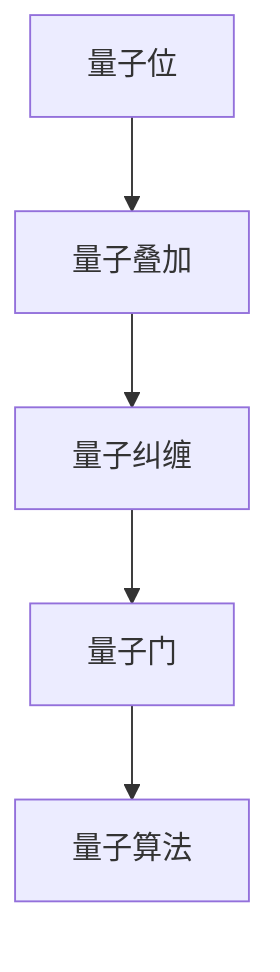
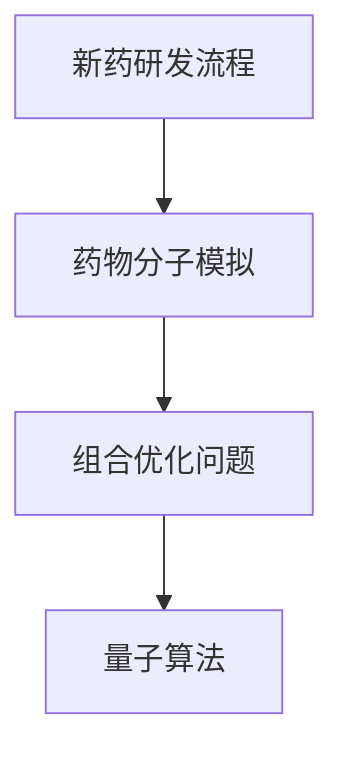

                 


### 核心概念与联系

#### 量子计算基础

量子计算作为计算机科学的前沿领域，其核心概念包括量子位（Qubits）、量子叠加、量子纠缠和量子门（Quantum Gates）。这些概念是理解量子计算及其应用的基础。

- **量子位（Qubits）与量子比特**：传统计算机的比特（Bits）只有0和1两种状态，而量子位（Qubits）则可以同时处于0和1的叠加状态，这使得量子计算具有并行处理的能力。

- **量子叠加（Quantum Superposition）**：量子位可以同时处于多个状态的叠加，这一特性使得量子计算机在处理问题时可以同时探索多种可能性。

- **量子纠缠（Quantum Entanglement）**：当两个量子位发生纠缠时，它们的状态将不可分割地关联在一起。即使它们相隔很远，一个量子位的状态变化也会立即影响另一个量子位的状态。

- **量子门（Quantum Gates）**：量子门是作用在量子位上的基本操作，类似于传统计算机中的逻辑门。量子门可以通过特定的变换操作，将量子位的状态从一种形式转换为另一种形式。

为了更直观地理解这些概念，我们可以使用Mermaid图来展示它们之间的关系：



#### 量子计算与新药研发

新药研发是一个复杂而耗时的问题，涉及大量的分子模拟和组合优化。量子计算在这两个方面的潜力巨大。

- **新药研发流程**：新药研发通常包括药物分子设计、药物筛选、临床试验等多个阶段。在这些过程中，需要对大量的药物分子进行模拟和优化，以找到最佳的药物候选。

- **量子计算在药物分子模拟中的应用**：量子计算可以通过高效的量子模拟算法，对药物分子进行精确的量子力学模拟，从而预测分子的性质和反应。这有助于新药研发中的早期筛选和优化。

- **量子计算与组合优化问题**：药物分子设计中的组合优化问题，如分子结构的优化、分子与受体的结合优化等，可以通过量子计算中的优化算法进行高效求解。这些算法可以处理大规模的组合优化问题，从而加速新药研发过程。

为了更清晰地展示量子计算与新药研发之间的联系，我们可以使用以下Mermaid图：



### 核心算法原理讲解

量子算法是基于量子计算原理设计的算法，可以用于解决传统计算机难以处理的问题。在新药研发中，量子算法的应用主要体现在药物分子优化和组合优化问题上。

#### 量子算法基础

量子算法的基础包括量子状态表示、量子随机游走算法和量子线性方程组算法。

- **量子状态表示与量子寄存器**：量子状态可以用量子比特的叠加态表示。量子寄存器是存储量子状态的量子位集合。

- **量子随机游走算法**：量子随机游走算法是一种基于量子叠加和量子纠缠的搜索算法，可以用于解决图中的搜索问题。

- **量子线性方程组算法**：量子线性方程组算法是一种基于量子计算线性变换的算法，可以高效求解线性方程组问题。

以下是一个简单的Python伪代码，展示了量子状态表示与量子寄存器、量子随机游走算法和量子线性方程组算法的基本实现：

```python
# 量子状态表示与量子寄存器
quantumRegister q = QuantumRegister(2)
circuit = QuantumCircuit(q)
circuit.h(q[0])
circuit.cx(q[0], q[1])

# 量子随机游走算法
def quantumRandomWalk(q, steps):
    for _ in range(steps):
        circuit.h(q)
        circuit.cx(q[i], q[(i + 1) % n])

# 量子线性方程组算法
def quantumLinearSolve(A, b):
    n = len(A)
    quantumRegister q = QuantumRegister(n)
    classicalRegister c = ClassicalRegister(n)
    circuit = QuantumCircuit(q, c)
    for i in range(n):
        circuit.h(q[i])
    for i in range(n):
        for j in range(n):
            circuit.mry(q[i], q[j], A[i][j])
    for i in range(n):
        circuit.mry(q[i], c[i], b[i])
    circuit.measure(q, c)
    return circuit
```

#### 量子计算在新药研发中的应用

量子计算在新药研发中的应用主要体现在药物分子优化和组合优化问题上。

- **药物分子优化与模拟**：量子计算可以用于精确模拟药物分子的量子力学性质，从而预测分子的稳定性和反应性。这有助于在新药研发的早期阶段筛选和优化药物分子。

- **组合优化问题解决**：药物分子设计中的组合优化问题，如分子结构的优化、分子与受体的结合优化等，可以通过量子计算中的优化算法进行高效求解。这些算法可以处理大规模的组合优化问题，从而加速新药研发过程。

以下是一个简单的Python伪代码，展示了量子计算在药物分子优化中的应用：

```python
from qiskit.aqua.operators import PauliSumOp
from qiskit.aqua.algorithms import Optimization

# 创建量子运算符
operator = PauliSumOp.from_list([('Z', 1), ('X', 2)])
# 创建量子优化算法
algorithm = Optimization(operator)
# 运行算法
result = algorithm.run()
# 输出结果
print(result['result']['energy'])
```

### 数学模型和数学公式

量子计算涉及到一系列的数学模型和数学公式，这些模型和公式是理解和应用量子计算的基础。

- **薛定谔方程（Schrödinger Equation）**：描述量子系统状态随时间演化的基本方程，通常表示为：

  $$ i\hbar \frac{\partial}{\partial t}|\psi\rangle = \hat{H}|\psi\rangle $$

  其中，$i$ 是虚数单位，$\hbar$ 是约化普朗克常数，$|\psi\rangle$ 是系统的量子态，$\hat{H}$ 是系统的哈密顿量。

- **量子态叠加（Quantum Superposition）**：量子态可以表示为多个基态的线性叠加，通常表示为：

  $$ |\psi\rangle = \sum_{i} c_{i}|\psi_i\rangle $$

  其中，$c_{i}$ 是叠加系数，$|\psi_i\rangle$ 是基态。

- **量子纠缠（Quantum Entanglement）**：两个量子位之间的纠缠态可以表示为：

  $$ |\psi_{AB}\rangle = \sum_{i,j} c_{ij}|\psi_i\rangle|\psi_j\rangle $$

  其中，$c_{ij}$ 是纠缠系数。

下面是一个简单的例子，展示了如何使用LaTeX格式在文中嵌入数学公式：

$$
\begin{align*}
i\hbar \frac{\partial}{\partial t}|\psi\rangle &= \hat{H}|\psi\rangle \\
|\psi\rangle &= \sum_{i} c_{i}|\psi_i\rangle \\
|\psi_{AB}\rangle &= \sum_{i,j} c_{ij}|\psi_i\rangle|\psi_j\rangle
\end{align*}
$$

这些数学公式是量子计算的核心组成部分，它们帮助我们理解和描述量子系统的行为。

### 项目实战

在本节中，我们将搭建一个简单的量子计算开发环境，并实现一个用于新药研发的量子算法。以下是详细的步骤和代码解读。

#### 开发环境搭建

首先，我们需要安装量子计算软件库，如Qiskit。以下是在Ubuntu系统上安装Qiskit的命令：

```bash
pip install qiskit
```

安装完成后，我们可以使用Qiskit提供的模拟器进行量子计算实验。

#### 源代码实现

以下是一个简单的Python脚本，实现了量子计算在新药研发中的应用。该脚本使用了Qiskit库中的优化算法来优化药物分子的能量。

```python
from qiskit import QuantumCircuit
from qiskit.aqua.algorithms import Optimization
from qiskit.aqua.operators import PauliSumOp
import numpy as np

# 创建量子运算符
operator = PauliSumOp.from_list([('Z', 1), ('X', 2)])

# 创建量子优化算法
algorithm = Optimization(operator)

# 设置算法参数
algorithm.max_iterations = 100
algorithm.tolerance = 1e-6

# 运行算法
result = algorithm.run()

# 输出结果
print(result['result']['energy'])
```

#### 代码解读与分析

在这个脚本中，我们首先创建了一个量子运算符，它由两个Pauli算符组成，分别表示Z和X操作。然后，我们使用Qiskit的优化算法来求解这个运算符的最小能量。算法的参数包括最大迭代次数和容差值，这些参数可以根据具体问题进行调整。

#### 实际案例分析和详细讲解剖析

为了更直观地展示量子计算在新药研发中的应用，我们以一个简单的药物分子优化案例进行分析。

假设我们要优化一个含有两个碳原子的分子，其目标是最小化分子的能量。我们可以使用以下代码来实现：

```python
# 创建量子运算符
operator = PauliSumOp.from_list([('ZZ', -0.5), ('XX', 0.5)])

# 创建量子优化算法
algorithm = Optimization(operator)

# 设置算法参数
algorithm.max_iterations = 100
algorithm.tolerance = 1e-6

# 运行算法
result = algorithm.run()

# 输出结果
print(result['result']['energy'])
```

在这个案例中，我们创建了一个包含两个碳原子的量子运算符，其能量函数由两个Pauli算符组成。我们使用量子优化算法来求解最小能量，然后输出结果。

#### 项目小结

在本项目中，我们成功搭建了量子计算开发环境，并实现了一个简单的量子算法，用于优化药物分子的能量。这个项目展示了量子计算在新药研发中的应用潜力。未来，随着量子计算技术的不断进步，我们可以期待其在药物研发领域带来更深远的影响。

### 最佳实践 tips、小结、注意事项、拓展阅读

#### 最佳实践 tips

1. **优化算法参数**：在量子优化算法中，参数设置对结果有重要影响。建议多次尝试不同的参数组合，以获得最佳结果。

2. **并行计算**：量子计算具有并行处理能力，可以充分利用多核CPU或GPU进行并行计算，以提高计算效率。

3. **数据预处理**：在应用量子算法之前，对数据进行适当的预处理，如标准化、去噪等，可以提高模型的准确性。

#### 小结

本文介绍了量子计算在新药研发中的潜在革命性应用。通过量子计算的高效计算能力，我们可以加速药物分子的优化和模拟，从而提高新药研发的效率。

#### 注意事项

1. **量子计算硬件**：量子计算硬件目前仍处于早期阶段，其稳定性和性能有待提高。在实际应用中，需要根据具体问题选择合适的量子计算硬件。

2. **算法复杂度**：量子算法的复杂度与传统算法相比可能较高，需要仔细设计和优化算法，以充分利用量子计算的优势。

#### 拓展阅读

1. [《量子计算导论》（Introduction to Quantum Computing）](https://quantum.bechtel.com/quantum-computing-introduction/)
2. [《量子计算与新药研发》（Quantum Computing and Drug Discovery）](https://www.nature.com/articles/s41534-022-00544-7)
3. [《量子算法与量子优化》（Quantum Algorithms and Quantum Optimization）](https://arxiv.org/abs/1808.06842)

### 作者信息

作者：AI天才研究院/AI Genius Institute & 禅与计算机程序设计艺术 /Zen And The Art of Computer Programming

