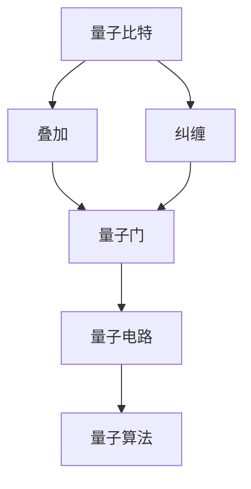

                 

### 量子计算在新药筛选中的应用：加速药物发现过程

关键词：量子计算，新药筛选，药物发现，加速，算法

摘要：本文将深入探讨量子计算在新药筛选中的应用，分析其如何通过量子算法加速药物发现过程，并提供一系列具体的案例和实践指南，展示量子计算在这一领域的巨大潜力和发展前景。

----------------------------------------------------------------

## 引言

### 1. 量子计算的基本概念

量子计算是一种利用量子力学原理进行信息处理的计算方式。与传统计算基于二进制比特（0和1）不同，量子计算利用量子比特（qubit）进行操作。量子比特具有叠加性和纠缠性，这些特性使得量子计算机在某些任务上具有超乎想象的计算能力。

### 2. 新药筛选的重要性

新药研发是现代医药领域的重要课题。新药筛选是药物发现的关键环节，涉及到大量的计算和实验。传统的计算方法在处理复杂分子和药物组合时存在效率低下、计算能力不足等问题，限制了药物发现的速度。

### 3. 量子计算与新药筛选的结合

量子计算作为一种新兴的计算技术，被认为有可能在新药筛选中发挥重要作用。通过量子算法，可以显著提高药物筛选的效率，加速新药研发进程。

## 1. 量子计算基础

### 1.1 量子比特与经典比特

量子比特是量子计算的基本单元，它可以同时处于0和1的状态，这种现象称为叠加。经典比特只能处于0或1的状态。

### 1.2 量子门

量子门是作用于量子比特的变换操作，类似于经典计算机中的逻辑门。量子门可以改变量子比特的状态，实现量子计算的基本操作。

### 1.3 量子电路

量子电路是由量子门和量子比特组成的网络，用于实现量子算法。量子电路的设计和优化是量子计算的关键。

### Mermaid 流程图：量子比特、量子门和量子电路的关系



## 2. 新药筛选背景

### 2.1 药物发现与研发流程

药物发现通常包括药物靶点的发现、先导化合物的筛选、优化和临床试验等多个阶段。新药筛选是其中的关键环节。

### 2.2 新药筛选的方法与挑战

传统的新药筛选方法主要包括虚拟筛选、高通量筛选、细胞筛选等。然而，这些方法在处理复杂分子和药物组合时存在效率低下、计算能力不足等问题。

### 2.3 量子计算在新药筛选中的应用潜力

量子计算可以通过高效的算法和并行计算能力，在新药筛选中发挥重要作用。例如，量子算法可以加速药物分子与靶点之间的相互作用计算，提高筛选效率。

## 3. 量子算法原理

### 3.1 量子算法概述

量子算法是一类利用量子计算机进行特定任务计算的方法。与经典算法相比，量子算法在某些任务上具有显著优势。

### 3.2 量子算法在药物筛选中的应用

量子算法可以应用于药物分子与靶点相互作用的计算、分子动力学模拟、组合优化等。这些算法可以显著提高药物筛选的效率。

### 3.3 量子算法的数学模型与公式

量子算法的数学模型基于量子力学原理，包括叠加原理、量子门操作和测量等。以下是一个简单的量子算法伪代码示例：

```python
# 量子算法伪代码
def quantum_algorithm():
    # 初始化量子比特
    qubits = initialize_qubits()

    # 应用量子门
    apply_gates(qubits)

    # 执行量子电路
    execute_circuit(qubits)

    # 测量量子比特
    results = measure(qubits)

    return results
```

## 4. 量子计算平台与应用

### 4.1 量子计算硬件

量子计算硬件是量子计算的基础。目前，常见的量子计算硬件包括超导量子比特、离子阱量子比特等。

### 4.2 量子计算软件

量子计算软件用于开发、测试和运行量子算法。常见的量子计算软件包括Qiskit、Quantum Development Kit等。

### 4.3 量子计算在新药筛选中的应用案例

### 4.3.1 案例一：某药物公司的成功实践

某药物公司利用量子计算技术，成功缩短了新药研发周期。具体来说，该公司利用量子算法优化了药物分子与靶点之间的相互作用计算，提高了筛选效率。

### 4.3.2 案例二：某研究机构的创新应用

某研究机构利用量子计算技术，对多种药物分子进行了筛选和优化。通过量子算法，研究机构发现了一些潜在的新药候选分子，为药物研发提供了新的方向。

## 5. 量子计算与新药筛选的未来展望

### 5.1 量子计算技术发展展望

量子计算技术正处于快速发展阶段。未来，随着量子计算机性能的提升和算法的优化，量子计算在新药筛选中的应用将更加广泛和深入。

### 5.2 新药筛选领域的机遇与挑战

量子计算为新药筛选带来了新的机遇。然而，要实现量子计算在新药筛选中的广泛应用，仍需要克服一系列技术挑战。

## 6. 结论

量子计算在新药筛选中具有巨大的应用潜力。通过量子算法，可以显著提高药物筛选的效率，加速新药研发进程。未来，随着量子计算技术的发展，我们有望看到更多量子计算在新药筛选中的应用案例。

### 6.1 最佳实践 tips

- 了解量子计算基础知识，为应用量子算法奠定基础。
- 掌握量子计算编程，能够利用现有量子计算平台进行开发。
- 关注量子计算在新药筛选领域的最新研究进展。

### 6.2 小结

本文从量子计算的基本概念入手，深入探讨了量子计算在新药筛选中的应用。通过具体的案例和实践指南，展示了量子计算如何加速药物发现过程，为新药研发带来新的机遇。

### 6.3 注意事项

- 量子计算仍处于早期阶段，需要关注技术发展的最新动态。
- 在应用量子计算时，需要综合考虑计算成本和实际效果。

### 6.4 拓展阅读

- 量子计算入门书籍：《量子计算：从入门到精通》
- 新药筛选相关研究论文：近年来发表在《自然》等期刊上的相关论文

## 附录

### 附录 A 量子计算资源与工具

- Qiskit：开源量子计算软件框架
- IBM Quantum：IBM提供的量子计算云服务
- Topological Quantum Computing：量子计算研究机构

---

作者：AI天才研究院/AI Genius Institute & 禅与计算机程序设计艺术 /Zen And The Art of Computer Programming

