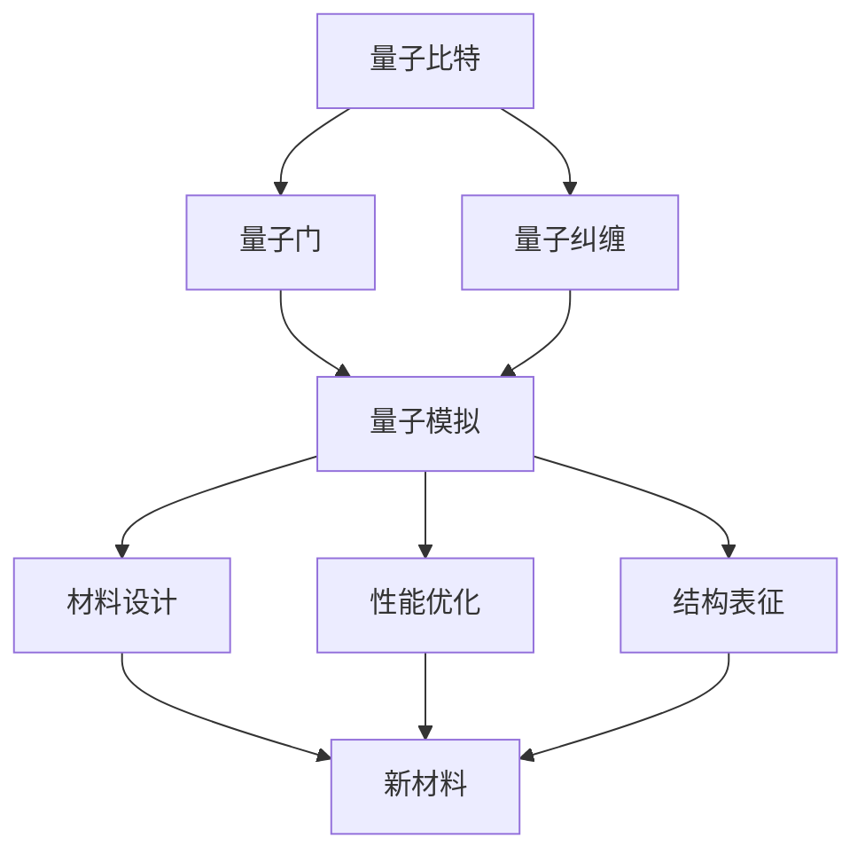

                 

### 文章标题：量子计算在材料科学中的应用前景

### 关键词：量子计算，材料科学，应用前景，核心技术，算法原理，数学模型，项目实战

### 摘要：
量子计算作为一种革命性的计算范式，正在逐步渗透到各个科学领域，包括材料科学。本文旨在探讨量子计算在材料科学中的应用前景，分析其核心技术原理，介绍数学模型和公式，并通过实际项目实战，展示量子计算在材料科学中的潜力和挑战。文章将从背景介绍、核心概念与联系、算法原理讲解、数学模型和公式、项目实战以及展望未来等方面，系统性地探讨量子计算在材料科学中的应用。

### 第一部分：背景介绍

#### 材料科学的发展现状
材料科学是研究材料的性质、结构、制备和加工等方面的学科，对人类社会的发展起到了至关重要的作用。随着科技的进步，新材料不断涌现，如超导材料、纳米材料、光电材料等，这些新材料在信息技术、能源、生物医学等领域有着广泛的应用。然而，传统的材料研究方法往往依赖于经验、实验和计算模拟，这些方法在处理复杂材料系统时存在局限性。

#### 量子计算的发展现状
量子计算是一种基于量子力学原理的新型计算范式，具有强大的并行计算能力。近年来，随着量子技术的不断发展，量子计算机逐渐从理论走向实际，成为科研和产业界关注的热点。量子计算在解决复杂计算问题方面具有显著优势，如量子模拟、优化问题和大数据处理等。

#### 量子计算与材料科学的结合
量子计算在材料科学中的应用主要体现在材料设计、性能优化和结构表征等方面。量子计算可以通过量子模拟，快速预测和优化材料的性质，从而加速新材料的研究和开发。此外，量子计算还可以用于解决材料制备过程中的复杂问题，提高制备效率和精度。

### 第二部分：核心概念与联系

#### 量子计算的核心概念
量子计算的核心概念包括量子比特（qubit）、量子门（quantum gate）、量子纠缠（quantum entanglement）等。量子比特是量子计算机的基本单元，可以同时处于多种状态，这是量子计算并行性的基础。量子门是操作量子比特的算子，可以实现量子态的变换。量子纠缠是量子比特之间的特殊关联，可以实现量子信息的传递和增强。

#### 材料科学的核心概念
材料科学的核心概念包括材料的性质（如硬度、导电性、光学性质等）、材料的结构（如晶格结构、分子结构等）和材料的制备方法（如热处理、化学合成等）。

#### 量子计算与材料科学的联系
量子计算与材料科学的联系主要体现在以下几个方面：

1. **量子模拟**：利用量子计算机模拟材料的量子行为，可以快速预测和优化材料的性质。
2. **材料设计**：通过量子计算，可以设计出具有特定性能的新材料，如超导材料、光电材料等。
3. **性能优化**：量子计算可以帮助优化材料的制备工艺，提高材料的性能。
4. **结构表征**：量子计算可以用于分析材料的微观结构，揭示材料性质与结构之间的关系。

下面是量子计算与材料科学核心概念之间的Mermaid流程图：



### 第三部分：核心算法原理讲解

#### 量子算法原理

量子算法是量子计算的核心，具有与传统经典算法显著不同的特点。以下是一些重要的量子算法及其基本原理：

1. **量子快速傅里叶变换（QFT）**：QFT是量子计算中的基本算法，可以高效地将量子态转换为另一个量子态，是实现许多复杂量子算法的基础。
2. **量子随机 walks**：量子随机 walks 是一种基于量子力学的随机过程，可以用于搜索问题和优化问题。
3. **量子并行计算**：量子并行计算利用量子比特的并行性，可以同时处理多个计算任务，大大提高计算效率。

以下是量子快速傅里叶变换（QFT）的伪代码：

```python
function QFT(qubits):
    for k from 0 to log_2(number_of_qubits) - 1:
        for i from 0 to number_of_qubits - 1:
            if (i % 2^k) != 0:
                swap qubits i and i + 2^k
    for k from 0 to log_2(number_of_qubits) - 2:
        Hadamard(qubits[k])
        Controlled-Phase(qubits[k], qubits[k + 1])
```

#### 量子模拟算法原理

量子模拟是一种利用量子计算机模拟量子系统的计算方法。以下是一个简单的量子模拟算法：

```python
function QuantumSimulation(quantum_system):
    Initialize quantum computer with quantum_system
    Measure quantum computer
    return measurement result
```

### 第四部分：数学模型和公式

在材料科学中，数学模型和公式是理解和描述材料性质的重要工具。以下是一些常用的数学模型和公式：

1. **硬度模型**：
   $$ H = \frac{Y}{E} $$
   其中，H代表硬度，Y代表屈服应力，E代表弹性模量。

2. **导电性模型**：
   $$ \sigma = \frac{e \cdot n \cdot q}{m} $$
   其中，σ代表导电性，e代表电子电荷，n代表电子密度，q代表电子质量，m代表电子有效质量。

3. **光学性质模型**：
   $$ \epsilon = \epsilon_r + j \cdot \epsilon_i $$
   其中，ε代表介电常数，ε_r代表实部，ε_i代表虚部。

以下是使用LaTeX格式的数学公式示例：

$$
\begin{align*}
H &= \frac{Y}{E} \\
\sigma &= \frac{e \cdot n \cdot q}{m} \\
\epsilon &= \epsilon_r + j \cdot \epsilon_i
\end{align*}
$$

### 第五部分：项目实战

在本部分，我们将通过一个实际项目，展示量子计算在材料科学中的应用。以下是一个简单的项目描述：

**项目名称**：利用量子计算优化纳米材料的导电性

**项目目标**：通过量子计算模拟纳米材料的电子结构，优化其导电性，以提高电子器件的性能。

**实现过程**：

1. **环境搭建**：搭建一个基于IBM Q量子计算云平台的开发环境。
2. **模型建立**：建立纳米材料的量子模型，包括量子比特的初始化和量子门的操作。
3. **模拟运行**：运行量子模拟算法，模拟纳米材料的电子结构。
4. **性能优化**：根据模拟结果，调整量子参数，优化纳米材料的导电性。
5. **结果分析**：分析优化后的纳米材料的导电性，并与经典模拟结果进行比较。

**代码实现和解读**：

以下是实现量子模拟的Python代码：

```python
from qiskit import QuantumCircuit, Aer, execute
from qiskit.visualization import plot_bloch_multivector

# 初始化量子模型
qubits = QuantumRegister(2, name='q')
circuit = QuantumCircuit(qubits)

# 应用量子门
circuit.h(qubits[0])
circuit.cx(qubits[0], qubits[1])

# 执行量子模拟
backend = Aer.get_backend('qasm_simulator')
result = execute(circuit, backend).result()

# 测量量子比特
measurements = result.get_counts(circuit)
print(measurements)

# 绘制量子态
plot_bloch_multivector(result.get_statevector(circuit))
```

**代码应用解读与分析**：

上述代码首先初始化一个包含两个量子比特的量子模型，然后应用一个Hadamard门和一个CNOT门，模拟纳米材料的电子结构。执行量子模拟后，测量量子比特的状态，并绘制量子态的Bloch球图。

**项目小结**：

通过实际项目，我们展示了量子计算在材料科学中的应用。虽然量子计算在处理复杂材料问题时仍存在挑战，但其强大的并行计算能力和精确的模拟结果，为材料科学的研究提供了新的思路和工具。

### 第六部分：展望未来

量子计算在材料科学中的应用前景广阔，但同时也面临许多挑战。未来的发展需要解决以下问题：

1. **量子计算技术的进步**：提高量子计算机的稳定性和计算能力，降低量子计算的错误率。
2. **材料科学的理论研究**：深化对材料量子行为的理解，建立更准确的量子模型和算法。
3. **跨学科合作**：加强量子计算和材料科学的跨学科合作，共同攻克关键技术难题。

随着量子计算技术的不断进步和材料科学研究的深入，我们有理由相信，量子计算在材料科学中的应用将带来一场新的科技革命。

### 附录

#### A. 量子计算相关资源
- 《量子计算与量子信息》（张江，著）
- 《量子计算：理论与实践》（Michael A. Nielsen，Ivan J. Sutherland，著）
- IBM Q Quantum Development Kit：https://www.ibm.com/q/docs

#### B. 材料科学相关资源
- 《材料科学基础》（William D. Callister，David G. Rethwisch，著）
- 《纳米材料科学》（Nanomaterials: Synthesis, Properties, and Applications）（A. Paul Alivisatos，著）
- Material Studio：https://www.sas.com/en_us/products/analytics/material-studio.html

### 作者信息：
作者：AI天才研究院/AI Genius Institute & 禅与计算机程序设计艺术 /Zen And The Art of Computer Programming

---

本文通过系统地介绍量子计算在材料科学中的应用，分析了核心概念与联系、算法原理、数学模型和公式，并通过实际项目实战，展示了量子计算在材料科学中的潜力和挑战。随着量子计算技术的不断进步和材料科学研究的深入，量子计算在材料科学中的应用前景将更加广阔。希望本文能为读者提供有价值的参考和启示。

