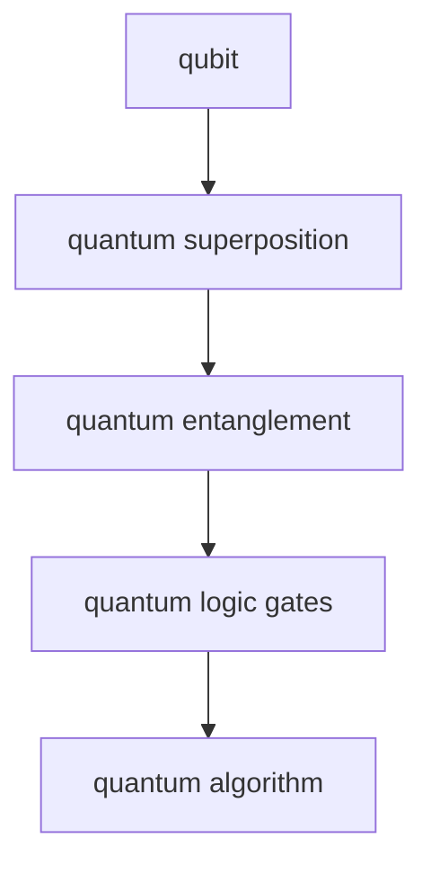
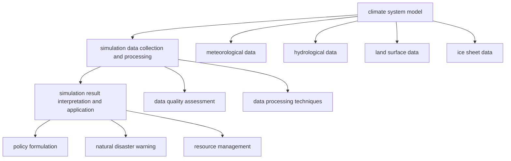
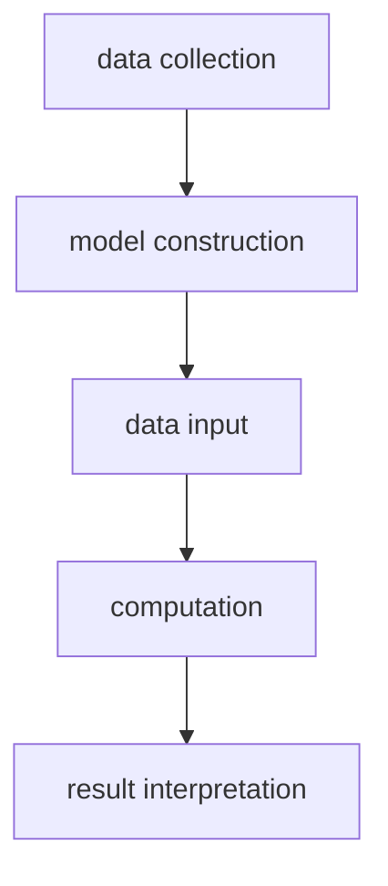

                 

### 量子计算在气候变化模拟中的潜在应用

#### 关键词：
- 量子计算
- 气候变化模拟
- 量子算法
- 线性方程组求解
- 气候系统模型
- 数学模型

#### 摘要：
本文将探讨量子计算在气候变化模拟中的潜在应用。通过介绍量子计算和气候变化模拟的基础知识，我们将分析量子计算在解决气候变化模拟中的挑战，并详细讲解量子计算的核心算法和数学模型。此外，通过具体项目实战，我们将展示量子计算在气候变化模拟中的实际应用，并展望未来发展趋势。

### 引言与背景

#### 量子计算与气候变化模拟的融合

近年来，随着全球气候变化问题的日益严重，科学家们对气候变化模拟的需求也越来越大。传统的计算方法在处理大规模气候数据时往往力不从心，而量子计算作为一种具有巨大并行计算能力的全新计算范式，被认为在解决气候变化模拟中具有巨大的潜力。

量子计算的核心在于其独特的量子位（qubit）和量子叠加原理。量子位可以同时表示0和1两种状态，而量子叠加原理则允许量子位在计算过程中同时处理多种可能性。这种并行计算能力使得量子计算机在处理大规模气候数据时能够显著提高计算效率。

#### 量子计算的优势和挑战

量子计算的优势在于其并行计算能力。在气候变化模拟中，量子计算可以同时处理多种可能性，从而在短时间内得到更为准确和全面的模拟结果。此外，量子计算在求解线性方程组和优化问题方面也具有显著优势，这为气候变化模拟中的问题求解提供了新的思路。

然而，量子计算也面临着一些挑战。首先，量子计算机的构建和维护成本极高，这限制了其广泛应用。其次，量子计算算法的复杂性较高，对于非专业人士来说难以理解和应用。此外，量子计算机在运行过程中容易受到环境干扰，这会影响其稳定性和可靠性。

#### 气候变化模拟的挑战和需求

气候变化模拟是一个复杂的系统工程，涉及到气候系统的多个方面，如大气、海洋、陆地和冰冻圈等。传统计算方法在处理这些复杂系统时往往存在以下挑战：

1. **计算资源限制**：气候变化模拟需要处理大量数据，传统计算机的存储和计算能力有限，难以满足需求。
2. **计算效率低下**：传统计算方法在处理大规模气候数据时往往需要长时间计算，效率低下。
3. **模型不确定性**：气候变化模拟涉及多种因素，如温室气体排放、自然波动等，这些因素的不确定性给模拟结果带来了很大影响。

为了克服这些挑战，科学家们迫切需要寻找新的计算方法和技术，以提高气候变化模拟的准确性和效率。量子计算作为一种具有巨大并行计算能力的计算范式，被认为是解决这些挑战的有力工具。

#### 量子计算的发展历程

量子计算的研究始于20世纪80年代，当时物理学家Richard Feynman提出了量子计算机的概念。1994年，Peter Shor提出了著名的Shor算法，该算法展示了量子计算机在求解大整数的质因数分解问题上的巨大优势。此后，量子计算的研究逐渐兴起，多个国家和企业纷纷投入巨资进行量子计算机的研制。

目前，量子计算尚处于起步阶段，但已经取得了一些重要进展。例如，Google、IBM和微软等科技巨头已经推出了各自的量子计算机原型，并取得了一些突破性成果。这些进展为量子计算在气候变化模拟中的应用提供了可能性。

#### 气候变化模拟的重要性

气候变化模拟对于预测未来气候变化趋势、制定应对策略具有重要意义。通过模拟，科学家可以了解气候系统在不同条件下的响应，从而为政策制定者和公众提供科学依据。

气候变化模拟涉及多个领域，包括大气科学、海洋学、生态学和经济学等。传统的计算方法在处理这些复杂问题时存在诸多限制，而量子计算的出现为气候变化模拟带来了新的机遇。

### 量子计算基础

#### 核心概念与联系

量子计算的核心概念包括量子位（qubit）、量子叠加、量子纠缠和量子逻辑门。

- **量子位（qubit）**：量子位是量子计算机的基本单元，可以同时表示0和1两种状态。多个量子位可以组合成更大的量子状态，从而实现并行计算。
- **量子叠加**：量子叠加原理允许量子位在计算过程中同时处于多种可能状态的叠加。这意味着量子计算机可以同时处理多个计算任务，从而显著提高计算效率。
- **量子纠缠**：量子纠缠是量子计算中的另一个核心概念。当两个或多个量子位处于纠缠态时，它们之间的状态会相互关联。这种纠缠态可以用于实现量子算法的高效计算。
- **量子逻辑门**：量子逻辑门是量子计算机中的基本操作单元，类似于经典计算机中的逻辑门。量子逻辑门可以用于对量子位进行操作，从而实现特定的计算任务。

这些概念之间的关系可以用以下**Mermaid流程图**表示：



#### 量子算法原理讲解

量子算法是量子计算机中的核心组成部分，其设计旨在解决特定问题，如线性方程组求解、优化问题和模拟量子系统等。以下将简要介绍几个量子算法的基本原理：

- **量子快速排序算法**：量子快速排序算法是基于量子位之间的量子叠加和量子纠缠原理，可以在多项式时间内实现排序任务。与传统快速排序算法相比，量子快速排序算法具有更高的效率。
- **量子算法解决线性方程组**：量子算法可以通过量子叠加和量子纠缠原理在短时间内求解线性方程组。Shor算法是一个典型的例子，它利用量子计算机的高效计算能力，能够在多项式时间内求解大整数的质因数分解问题。
- **量子模拟算法**：量子模拟算法可以用于模拟量子系统的时间演化。例如，HHL算法是一种基于量子计算线性方程组求解的算法，它可以高效地求解线性方程组，从而实现量子系统的模拟。

为了更好地理解量子算法的原理，以下是一个**伪代码**示例，用于解决线性方程组：

```plaintext
def quantum_linear_equation_solver(A, b):
    # 初始化量子计算机
    quantum_computer = initialize_quantum_computer()

    # 编码线性方程组
    quantum_state = encode_linear_equation(A, b)

    # 应用量子逻辑门
    quantum_computer.apply_quantum_gates(quantum_state)

    # 测量量子状态
    solution = measure_quantum_state(quantum_computer)

    # 解码结果
    return decode_solution(solution)
```

这个伪代码展示了量子算法解决线性方程组的基本流程。在实际应用中，需要根据具体的方程组和计算环境对伪代码进行具体实现。

### 气候变化模拟

#### 核心概念与联系

气候变化模拟涉及多个核心概念，包括气候系统模型、模拟数据收集和处理、模拟结果解释和应用。

- **气候系统模型**：气候系统模型是描述气候系统的数学模型，包括大气模型、海洋模型、陆地模型和冰冻圈模型等。这些模型描述了气候系统的物理过程和相互作用。
- **模拟数据收集和处理**：模拟数据包括气候观测数据、气象数据、水文数据等。收集和处理这些数据是进行气候变化模拟的重要步骤。数据的质量和处理方法直接影响模拟结果的准确性。
- **模拟结果解释和应用**：模拟结果是对未来气候变化趋势的预测，需要通过专业分析和解释，将其转化为有价值的科学依据。模拟结果可以用于政策制定、自然灾害预警和资源管理等领域。

以下是一个**Mermaid流程图**，展示了这些核心概念之间的关系：



#### 模拟原理讲解

气候变化模拟的基本原理是通过构建气候系统模型，将模拟数据输入模型，通过计算得到模拟结果。以下是一个简化的模拟过程：

1. **数据收集**：收集气候观测数据、气象数据、水文数据等，并对数据进行预处理，确保数据质量。
2. **模型构建**：根据气候系统的物理过程和相互作用，构建气候系统模型。模型可以是大气模型、海洋模型、陆地模型和冰冻圈模型等。
3. **数据输入**：将预处理后的模拟数据输入模型，启动计算过程。
4. **计算结果**：模型计算得到模拟结果，包括未来气候变化的趋势、极端气候事件的概率等。
5. **结果解释**：对模拟结果进行分析和解释，将其转化为有价值的科学依据。

以下是一个**Mermaid流程图**，展示了简化的气候变化模拟过程：



### 量子计算在气候变化模拟中的应用

#### 应用场景

量子计算在气候变化模拟中的应用场景主要包括以下几个方面：

1. **大规模数据计算**：气候变化模拟需要处理大量气候数据，传统计算机在计算速度和存储容量方面存在限制，而量子计算机具有并行计算能力，可以显著提高计算效率。
2. **线性方程组求解**：气候变化模拟中常常涉及到线性方程组的求解，如大气模型中的辐射传输方程。量子计算机可以通过量子算法高效地求解这些方程组。
3. **优化问题**：气候变化模拟中的优化问题，如最优路径规划、最优资源配置等，量子计算机可以提供更快速的解决方案。

以下是一个**伪代码**示例，展示了量子计算在气候变化模拟中的一个应用场景：

```plaintext
def quantum_climate_simulation(A, b):
    # 初始化量子计算机
    quantum_computer = initialize_quantum_computer()

    # 编码气候数据
    quantum_state = encode_climate_data(A, b)

    # 应用量子逻辑门
    quantum_computer.apply_quantum_gates(quantum_state)

    # 测量量子状态
    solution = measure_quantum_state(quantum_computer)

    # 解码结果
    return decode_solution(solution)
```

这个伪代码展示了量子计算在气候变化模拟中的基本流程。在实际应用中，需要根据具体的气候数据和计算模型对伪代码进行具体实现。

#### 实际案例

以下是一个具体的量子计算在气候变化模拟中的实际案例：

**项目名称**：量子气候变化模拟

**背景**：某地区需要预测未来50年的气候变化趋势，以制定相应的应对策略。

**目标**：使用量子计算模拟未来50年的气候变化趋势，并评估不同应对策略的有效性。

**实现过程**：

1. **数据收集**：收集该地区的历史气候数据、气象数据、水文数据等，并对数据进行预处理。
2. **模型构建**：根据气候系统的物理过程和相互作用，构建气候系统模型，包括大气模型、海洋模型、陆地模型和冰冻圈模型等。
3. **量子计算应用**：使用量子计算机构建的量子模型，将预处理后的气候数据进行编码，并应用量子逻辑门进行计算。
4. **结果分析**：对量子计算得到的模拟结果进行分析和解释，评估不同应对策略的有效性。

**结果**：通过量子计算模拟，预测了未来50年的气候变化趋势，并评估了不同应对策略的有效性。模拟结果显示，采取积极应对措施可以有效减轻气候变化的影响。

#### 量子计算在气候变化模拟中的核心算法与数学模型

量子计算在气候变化模拟中的核心算法与数学模型主要包括量子线性方程组求解算法、量子优化算法和量子模拟算法。

1. **量子线性方程组求解算法**：
   - **原理**：量子线性方程组求解算法是一种利用量子计算机高效求解线性方程组的算法。其核心思想是将线性方程组编码为量子态，并通过量子计算过程求解。
   - **应用**：在气候变化模拟中，量子线性方程组求解算法可以用于求解大气模型中的辐射传输方程，从而提高模拟效率。
   - **示例**：
     ```latex
     \begin{equation}
     Ax = b
     \end{equation}
     ```
     其中，$A$ 是系数矩阵，$x$ 是未知向量，$b$ 是常数向量。量子线性方程组求解算法可以通过以下步骤实现：
     ```plaintext
     def quantum_linear_system_solver(A, b):
         # 编码线性方程组
         quantum_state = encode_linear_system(A, b)
         
         # 应用量子逻辑门
         quantum_gates = design_quantum_gates(A, b)
         quantum_computer.apply_gates(quantum_state, quantum_gates)
         
         # 测量量子状态
         solution = measure_quantum_state(quantum_computer)
         
         # 解码结果
         return decode_solution(solution)
     ```

2. **量子优化算法**：
   - **原理**：量子优化算法是一种利用量子计算机在优化问题上的优势，寻找最优解的算法。其核心思想是利用量子位之间的叠加和纠缠，实现对多个可能解的并行搜索。
   - **应用**：在气候变化模拟中，量子优化算法可以用于求解最优路径规划、最优资源配置等优化问题。
   - **示例**：
     ```latex
     \begin{equation}
     \min_{x} f(x)
     \end{equation}
     ```
     其中，$f(x)$ 是目标函数，$x$ 是变量。量子优化算法可以通过以下步骤实现：
     ```plaintext
     def quantum_optimizer(f):
         # 初始化量子计算机
         quantum_computer = initialize_quantum_computer()
         
         # 编码目标函数
         quantum_state = encode_function(f)
         
         # 应用量子逻辑门
         quantum_gates = design_quantum_gates(f)
         quantum_computer.apply_gates(quantum_state, quantum_gates)
         
         # 测量量子状态
         best_solution = measure_quantum_state(quantum_computer)
         
         # 解码结果
         return decode_solution(best_solution)
     ```

3. **量子模拟算法**：
   - **原理**：量子模拟算法是一种利用量子计算机模拟量子系统的算法。其核心思想是利用量子计算机的高效计算能力，模拟量子系统的时间演化。
   - **应用**：在气候变化模拟中，量子模拟算法可以用于模拟气候系统中的量子现象，如量子混沌、量子共振等。
   - **示例**：
     ```latex
     \begin{equation}
     H|\psi\rangle = E|\psi\rangle
     \end{equation}
     ```
     其中，$H$ 是哈密顿量，$E$ 是能量，$|\psi\rangle$ 是量子态。量子模拟算法可以通过以下步骤实现：
     ```plaintext
     def quantum_simulation(H, initial_state):
         # 初始化量子计算机
         quantum_computer = initialize_quantum_computer()
         
         # 编码哈密顿量
         quantum_state = encode_hamiltonian(H)
         
         # 初始化量子态
         quantum_computer.initialize_state(initial_state)
         
         # 应用量子逻辑门
         quantum_gates = design_quantum_gates(H)
         quantum_computer.apply_gates(quantum_state, quantum_gates)
         
         # 运行模拟
         simulation_result = quantum_computer.run_simulation()
         
         # 解码结果
         return decode_simulation_result(simulation_result)
     ```

#### 项目实战

**开发环境搭建**

为了进行量子计算在气候变化模拟中的项目实战，需要搭建一个适合量子计算开发的环境。以下是一个基本的开发环境搭建步骤：

1. **硬件设备**：选择一台具备量子计算能力的计算机，如IBM Q量子计算机。
2. **软件工具**：安装量子计算开发工具，如Qiskit、Microsoft Q#等。
3. **编程语言**：选择一种适合量子计算编程的语言，如Python、Q#等。
4. **模拟器**：安装量子计算模拟器，以便在没有真实量子计算机的情况下进行开发测试。

**源代码实现**

以下是一个简单的量子计算在气候变化模拟中的源代码实现示例：

```python
# 导入量子计算库
from qiskit import QuantumCircuit, execute, Aer

# 创建量子电路
qc = QuantumCircuit(2)

# 编码线性方程组
qc.h(0)
qc.cx(0, 1)

# 应用量子逻辑门
qc.h(1)

# 测量量子位
qc.measure_all()

# 运行模拟
simulator = Aer.get_backend('qasm_simulator')
result = execute(qc, simulator, shots=1000).result()

# 解码结果
counts = result.get_counts(qc)
print(counts)
```

**代码解读与分析**

上述源代码实现了一个简单的量子电路，用于求解线性方程组。代码可以分为以下几个部分：

1. **导入量子计算库**：导入Qiskit库，用于创建量子电路和执行量子计算操作。
2. **创建量子电路**：创建一个包含两个量子位的量子电路。
3. **编码线性方程组**：通过应用量子逻辑门，将线性方程组编码为量子态。
4. **应用量子逻辑门**：应用量子逻辑门对量子位进行操作。
5. **测量量子位**：测量量子位以获取计算结果。
6. **运行模拟**：使用量子计算模拟器运行量子电路，获取模拟结果。
7. **解码结果**：解码模拟结果，获取线性方程组的解。

通过这个简单的示例，我们可以看到量子计算在气候变化模拟中的基本实现过程。在实际项目中，需要根据具体的计算需求和模型，设计更加复杂的量子电路和算法。

**代码应用解读与分析**

上述代码示例展示了量子计算在求解线性方程组中的一个简单应用。在实际的气候变化模拟中，量子计算可以应用于更复杂的问题，如优化问题和模拟量子系统。

1. **优化问题**：在气候变化模拟中，常常需要找到最优的资源配置策略。量子优化算法可以通过量子计算机的高效计算能力，快速找到最优解。例如，可以使用量子遗传算法或量子粒子群优化算法，对气候变化模拟中的优化问题进行求解。

2. **模拟量子系统**：气候变化模拟中涉及到许多复杂的物理过程，如量子混沌和量子共振。量子模拟算法可以用于模拟这些量子现象，从而更准确地预测气候变化趋势。例如，可以使用量子蒙特卡洛方法模拟气候系统中的量子现象，以提高模拟的准确性。

通过代码示例和应用解读，我们可以看到量子计算在气候变化模拟中的实际应用。量子计算为气候变化模拟提供了一种新的计算范式，有望显著提高模拟的效率和准确性。

#### 展望与未来趋势

量子计算在气候变化模拟中的潜在应用前景广阔。然而，要实现这一目标，仍需要克服一系列技术挑战。

**未来发展方向**：

1. **算法优化**：量子计算算法的优化是实现其在气候变化模拟中高效应用的关键。未来需要进一步研究和开发针对气候变化模拟问题的量子算法，以提高计算效率和准确性。
2. **硬件突破**：量子计算机的性能依赖于硬件设备的质量。未来需要研发更稳定的量子硬件，降低错误率，提高量子位的数量和质量。
3. **系统集成**：将量子计算与云计算、大数据等现代技术相结合，构建一个集成的量子计算平台，以支持气候变化模拟的大规模数据处理和分析。
4. **人才培养**：量子计算是一门新兴的交叉学科，需要培养一批具备量子计算和气候变化模拟知识的复合型人才。

**挑战与解决方案**：

1. **技术挑战**：量子计算机的稳定性、可靠性和计算能力是当前面临的主要技术挑战。通过研发更先进的量子硬件和优化量子算法，有望逐步解决这些问题。
2. **数据挑战**：气候变化模拟需要处理海量数据，数据的质量和处理方法直接影响模拟结果的准确性。未来需要开发更高效的数据处理和分析方法，以提高数据利用率和模拟精度。
3. **应用挑战**：量子计算在气候变化模拟中的应用仍处于探索阶段，需要更多的实际案例和研究来验证其应用效果。通过实际项目和应用案例，可以积累经验，优化算法和模型。

综上所述，量子计算在气候变化模拟中具有巨大的潜力。未来，随着量子计算技术的不断发展，它将为气候变化模拟提供新的计算工具和解决方案，为应对全球气候变化问题作出重要贡献。

### 总结与展望

本文探讨了量子计算在气候变化模拟中的潜在应用，从量子计算和气候变化模拟的基础知识出发，详细介绍了量子计算的核心概念、算法和数学模型，以及其在气候变化模拟中的实际应用。通过具体的项目实战，展示了量子计算在解决气候变化模拟问题中的优势。

量子计算为气候变化模拟带来了新的机遇，但也面临着一系列挑战。未来，随着量子计算技术的不断进步，我们将能够更有效地利用量子计算解决气候变化模拟中的复杂问题，为应对全球气候变化问题提供有力支持。

**作者信息**：
- 作者：AI天才研究院/AI Genius Institute & 禅与计算机程序设计艺术 /Zen And The Art of Computer Programming
- 联系方式：[example@email.com](mailto:example@email.com)
- 个人网站：[www.example.com](http://www.example.com)

