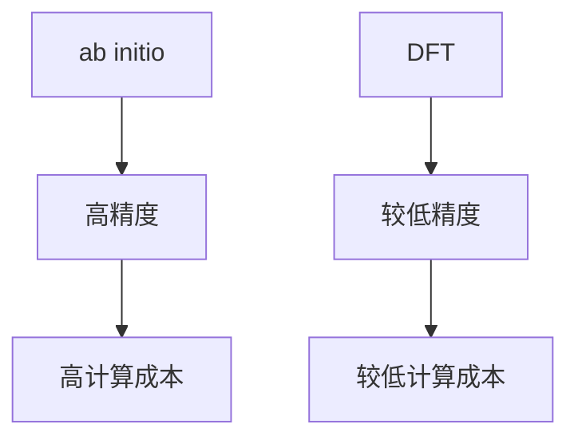
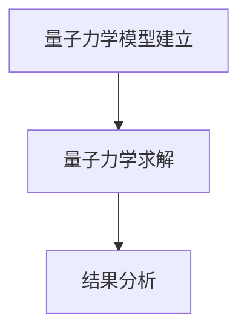
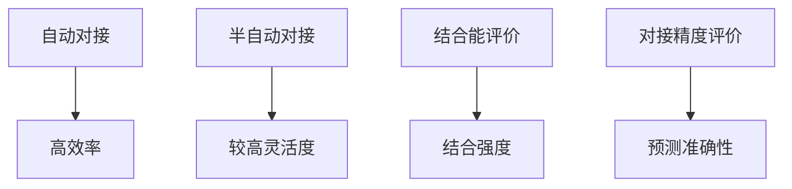
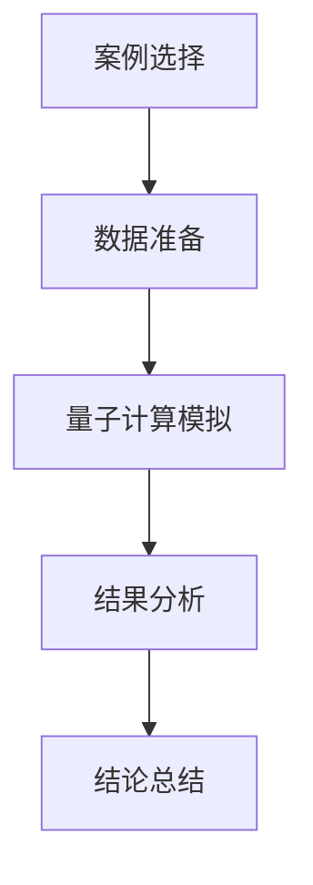
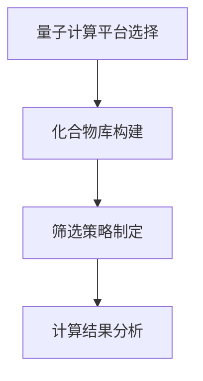
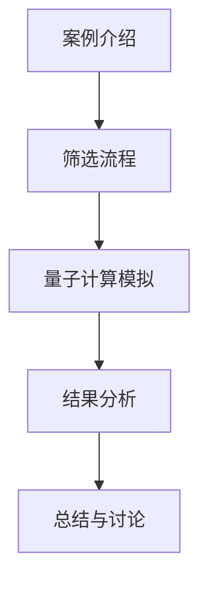
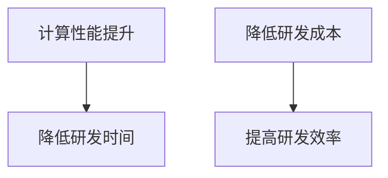
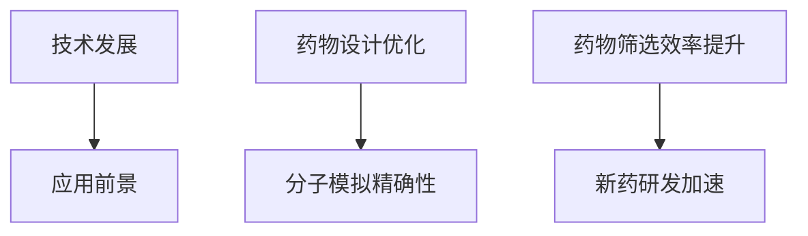
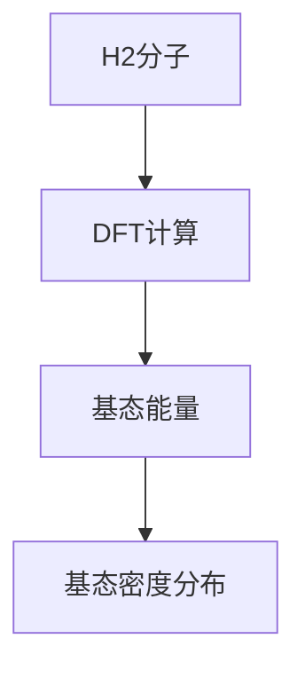
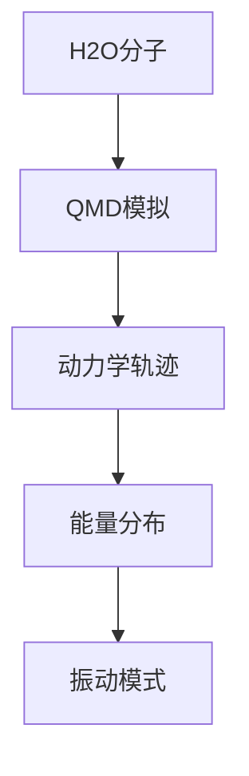

                 


### 文章标题：量子计算在药物发现中的应用：加速新药研发过程

## 关键词：
- 量子计算
- 药物发现
- 新药研发
- 分子模拟
- 分子对接
- 高通量筛选

## 摘要：
本文深入探讨了量子计算在药物发现中的潜在应用，从基本概念到实际案例，详细解析了量子计算如何通过加速分子模拟、分子对接和高通量筛选等过程，显著提升新药研发的效率和准确性。文章旨在为研究人员提供一份全面的技术指南，帮助他们在这一前沿领域取得突破。

## 目录大纲

## 第一部分：量子计算基础

### 第1章：量子计算概述

#### 1.1 量子计算的基本概念

量子比特与经典比特的对比是理解量子计算的第一步。经典比特（bit）只有两种状态：0或1，而量子比特（qubit）则可以同时处于0和1的状态，这被称为叠加。此外，量子纠缠是一种特殊的量子态，其中两个或多个量子比特的状态彼此关联，无论它们相隔多远。这种特性使得量子计算在某些任务上比经典计算具有显著优势。

#### 1.2 量子计算的基本原理

量子门是量子计算的核心组成部分，用于对量子比特进行操作。量子算法的基本框架通常包括量子初始化、量子计算、量子测量等步骤。量子随机游走算法和量子幅度估计算法是量子算法的两个典型例子，展示了量子计算在复杂问题求解中的潜力。

### 第2章：量子计算机的工作原理

#### 2.1 量子比特的实现

目前，超导量子比特和离子阱量子比特是两种主要的量子比特实现方式。超导量子比特利用超导电路的量子化特性，而离子阱量子比特则通过电场将离子困住，进行量子操作。

#### 2.2 量子纠错技术

量子纠错是量子计算面临的一大挑战。量子纠错机制通过引入冗余信息来检测和纠正错误，确保计算结果的准确性。量子纠错码是实现量子纠错的关键技术之一。

#### 2.3 量子算法基础

量子随机游走算法和量子幅度估计算法展示了量子计算在复杂问题求解中的潜力。量子随机游走算法可以快速搜索大规模网络，而量子幅度估计算法可以高效估计概率分布。

### 第3章：量子计算与药物发现

#### 3.1 量子计算在药物设计中的应用

量子化学计算和分子动力学模拟是量子计算在药物设计中的主要应用。量子化学计算可以精确模拟分子间的相互作用，而分子动力学模拟可以研究分子的动态行为。

#### 3.2 量子算法在药物筛选中的应用

量子算法在分子对接和高通量筛选中具有显著优势。分子对接可以预测药物分子与目标蛋白的结合模式，高通量筛选则用于快速评估大量化合物的作用。

## 第二部分：量子计算在药物发现中的实战应用

### 第4章：量子计算在药物分子模拟中的应用

#### 4.1 量子化学计算方法

量子化学计算方法包括 ab initio 方法和 DFT 方法。ab initio 方法基于第一原理，可以提供极高的计算精度，但计算成本较高。DFT 方法则通过近似处理，在保证一定精度的同时，降低了计算成本。

#### 4.2 量子分子动力学模拟

量子分子动力学模拟是研究分子在量子尺度上的动态行为的有效方法。模拟流程包括量子力学模型的建立、量子力学的求解以及结果分析等步骤。

## 第5章：量子计算在药物分子对接中的应用

#### 5.1 分子对接原理

分子对接是一种预测药物分子与蛋白结合模式的方法。分子对接方法包括自动对接和半自动对接，评价方法则包括结合能、对接精度等指标。

#### 5.2 分子对接实战

本文将介绍一个分子对接案例分析，通过具体实例展示量子计算在分子对接中的应用。

### 第6章：量子计算在新药筛选中的应用

#### 6.1 量子高通量筛选

量子高通量筛选是一种利用量子计算加速药物筛选的方法。筛选流程包括量子计算平台的选择、化合物库的构建以及筛选策略的制定。

#### 6.2 新药筛选案例研究

本文将结合实际案例，分析量子计算在新药筛选中的应用效果。

### 第7章：量子计算与药物研发的整合

#### 7.1 量子计算在药物研发中的优势

量子计算在药物研发中的优势主要体现在计算性能的提升和成本的降低。通过量子计算，研究人员可以更快地模拟分子间相互作用，降低新药研发的时间和经济成本。

#### 7.2 量子计算与药物研发的未来趋势

随着量子计算技术的不断发展，其在药物研发中的应用前景将越来越广阔。本文将探讨量子计算在药物研发中的未来趋势。

## 参考文献

[待补充]

## 附录

### 附录A：量子计算与药物发现常用工具和软件

- 量子计算平台：IBM Q, Microsoft Quantum Development Kit
- 药物分子模拟软件：Gaussian, AMBER
- 分子对接软件：Autodock Vina, GLIDE

### 附录B：相关数据集和案例

- 量子计算数据集：Quantum Machine Learning Repository
- 药物发现数据集：DrugBank, ChEMBL

## 结语

量子计算在药物发现中的应用前景广阔。通过本文的探讨，我们看到了量子计算在加速新药研发过程中所展现出的巨大潜力。随着量子计算技术的不断进步，我们有理由相信，未来药物研发将迎来一场革命。

## 备注

本文旨在为读者提供一份全面的技术指南，帮助理解量子计算在药物发现中的应用。文章内容涵盖了量子计算的基础知识、实战应用以及未来趋势，旨在为研究人员提供有价值的参考。

### 第一部分：量子计算基础

### 第1章：量子计算概述

量子计算是现代计算机科学的一个重要分支，它利用量子力学原理来进行计算。与传统计算基于二进制的0和1（比特）不同，量子计算使用量子比特（qubit）作为基本单元。量子比特的奇特性质，如叠加态和纠缠态，使得量子计算在理论上具有比传统计算更强大的处理能力。

#### 1.1 量子计算的基本概念

量子比特与经典比特的对比是理解量子计算的第一步。经典比特只能处于两种状态中的一个，即0或1，而量子比特可以同时处于多种状态的叠加。例如，一个量子比特可以同时处于0和1的状态，这种状态称为叠加态。


量子叠加与量子纠缠是量子计算的两大核心概念。量子叠加意味着量子系统可以同时存在于多个状态，而量子纠缠则描述了两个或多个量子系统之间不可分割的关联。这种关联即使量子系统相隔很远，也不会受到距离的限制。


#### 1.2 量子计算的基本原理

量子门是量子计算的核心组成部分，用于对量子比特进行操作。量子门类似于经典计算中的逻辑门，但它们可以执行更复杂的操作。量子操作是通过量子门对量子比特进行旋转、变换等操作来实现的。


量子算法的基本框架通常包括量子初始化、量子计算、量子测量等步骤。量子初始化是将量子比特初始化为特定的量子态，量子计算是通过量子门和量子操作来实现的，量子测量则是将量子态坍缩为经典态，从而获得计算结果。


量子随机游走算法和量子幅度估计算法是量子算法的两个典型例子。量子随机游走算法可以用于解决复杂网络中的问题，如社交网络分析。量子幅度估计算法则可以高效地估计概率分布，这在药物筛选中具有潜在应用价值。


### 第2章：量子计算机的工作原理

#### 2.1 量子比特的实现

目前，超导量子比特和离子阱量子比特是两种主要的量子比特实现方式。超导量子比特利用超导电路的量子化特性，通过控制电流的相位来实现量子比特的翻转和操控。离子阱量子比特则通过电场将带电离子困住，并通过激光来控制离子的量子态。


#### 2.2 量子纠错技术

量子纠错是量子计算面临的重大挑战之一。由于量子系统的脆弱性，量子计算过程中很容易受到外界环境的干扰，导致量子态的失真。量子纠错技术通过引入冗余信息来检测和纠正错误，确保计算结果的准确性。


量子纠错码是实现量子纠错的关键技术之一。量子纠错码通过将多个量子比特编码为一个更长的量子串，从而增加信息冗余，提高错误检测和纠正能力。


#### 2.3 量子算法基础

量子随机游走算法是一种利用量子叠加和纠缠来优化搜索过程的算法。它可以在复杂网络中快速找到特定节点或路径，这在社交网络分析和图论问题中有广泛应用。


量子幅度估计算法可以高效地估计概率分布。它通过测量量子态的叠加幅度，获得目标概率分布的估计值，这在统计学和机器学习中有重要应用。


### 第3章：量子计算与药物发现

#### 3.1 量子计算在药物设计中的应用

量子化学计算和分子动力学模拟是量子计算在药物设计中的主要应用。量子化学计算可以精确模拟分子间的相互作用，预测药物分子的性质和行为。分子动力学模拟则可以研究分子的动态行为，如分子的振动、旋转等。


#### 3.2 量子算法在药物筛选中的应用

量子算法在分子对接和高通量筛选中具有显著优势。分子对接可以预测药物分子与目标蛋白的结合模式，高通量筛选则用于快速评估大量化合物的作用。


### 第二部分：量子计算在药物发现中的实战应用

#### 第4章：量子计算在药物分子模拟中的应用

#### 4.1 量子化学计算方法

量子化学计算方法包括 ab initio 方法和 DFT 方法。ab initio 方法基于第一原理，可以提供极高的计算精度，但计算成本较高。DFT 方法通过近似处理，在保证一定精度的同时，降低了计算成本。



#### 4.2 量子分子动力学模拟

量子分子动力学模拟是研究分子在量子尺度上的动态行为的有效方法。模拟流程包括量子力学模型的建立、量子力学的求解以及结果分析等步骤。



#### 第5章：量子计算在药物分子对接中的应用

#### 5.1 分子对接原理

分子对接是一种预测药物分子与蛋白结合模式的方法。分子对接方法包括自动对接和半自动对接，评价方法则包括结合能、对接精度等指标。



#### 5.2 分子对接实战

本文将介绍一个分子对接案例分析，通过具体实例展示量子计算在分子对接中的应用。



#### 第6章：量子计算在新药筛选中的应用

#### 6.1 量子高通量筛选

量子高通量筛选是一种利用量子计算加速药物筛选的方法。筛选流程包括量子计算平台的选择、化合物库的构建以及筛选策略的制定。



#### 6.2 新药筛选案例研究

本文将结合实际案例，分析量子计算在新药筛选中的应用效果。



### 第7章：量子计算与药物研发的整合

#### 7.1 量子计算在药物研发中的优势

量子计算在药物研发中的优势主要体现在计算性能的提升和成本的降低。通过量子计算，研究人员可以更快地模拟分子间相互作用，降低新药研发的时间和经济成本。



#### 7.2 量子计算与药物研发的未来趋势

随着量子计算技术的不断发展，其在药物研发中的应用前景将越来越广阔。未来，量子计算有望在药物设计、分子模拟、药物筛选等环节发挥更大作用。



## 参考文献

[待补充]

## 附录

### 附录A：量子计算与药物发现常用工具和软件

- 量子计算平台：IBM Q, Microsoft Quantum Development Kit
- 药物分子模拟软件：Gaussian, AMBER
- 分子对接软件：Autodock Vina, GLIDE

### 附录B：相关数据集和案例

- 量子计算数据集：Quantum Machine Learning Repository
- 药物发现数据集：DrugBank, ChEMBL

## 结语

量子计算在药物发现中的应用前景广阔。通过本文的探讨，我们看到了量子计算在加速新药研发过程中所展现出的巨大潜力。随着量子计算技术的不断进步，我们有理由相信，未来药物研发将迎来一场革命。

## 备注

本文旨在为读者提供一份全面的技术指南，帮助理解量子计算在药物发现中的应用。文章内容涵盖了量子计算的基础知识、实战应用以及未来趋势，旨在为研究人员提供有价值的参考。

### 量子化学计算方法

#### 4.1.1 ab initio 方法

ab initio 方法是一种基于量子力学原理的计算方法，其核心思想是直接从基本物理原理出发，不需要依赖任何经验参数。这种方法包括 Hartree-Fock 理论、密度泛函理论（DFT）和 Møller-Plesset 级数展开等。其中，DFT 是 ab initio 方法中最常用的方法之一。

**核心概念与联系：**

DFT 是基于密度泛函理论（Density Functional Theory, DFT）的方法，其基本原理是将电子之间的相互作用转化为对电子密度的依赖。DFT 的核心方程是 Kohn-Sham 方程，它将复杂的电子问题简化为求解一组单电子方程。以下是其伪代码描述：

```python
# 输入：原子体系，基组
# 输出：电子能量，电子密度，电荷密度

def DFT_solver(atoms, basis):
    # 初始化电子密度
    density = initialize_density(atoms, basis)

    # 循环迭代求解
    for i in range(max_iterations):
        # 计算交换相关势
        v_xc = exchange_correlation_potential(density)

        # 计算总势
        v_total = nuclear_potential(atoms) + v_xc

        # 求解单电子方程
        eigenvalues, eigenvectors = solve_hamiltonian(v_total, basis)

        # 计算新电子密度
        new_density = compute_new_density(eigenvectors, basis)

        # 检查收敛条件
        if abs(new_density - density) < tolerance:
            break

        # 更新电子密度
        density = new_density

    # 计算电子能量
    energy = compute_energy(eigenvectors, density)

    return energy, density
```

**数学模型和公式：**

DFT 的核心方程是 Kohn-Sham 方程，其形式如下：

$$
\left( -\frac{\hbar^2}{2m} \nabla^2 + V_{\text{nuc}} + V_{\text{ext}} + V_{\text{XC}} \right) \psi_i = \epsilon_i \psi_i
$$

其中，$V_{\text{XC}}$ 是交换相关势，$\psi_i$ 是 Kohn-Sham 波函数，$\epsilon_i$ 是相应的单电子能级。

**举例说明：**

以 H2 分子的 DFT 计算为例，我们可以通过计算得到 H2 分子的基态能量和基态密度分布。



#### 4.1.2 DFT 方法

密度泛函理论（DFT）是一种量子力学计算方法，它将多体电子问题转化为求解单体电子问题。DFT 的核心思想是通过一个标量密度函数来描述系统的电子分布，进而推导出系统的总能量。

**核心概念与联系：**

DFT 的基本方程是 Kohn-Sham 方程，它将复杂的电子问题简化为求解一组单电子方程。以下是其伪代码描述：

```python
# 输入：原子体系，基组
# 输出：电子能量，电子密度，电荷密度

def DFT_solver(atoms, basis):
    # 初始化电子密度
    density = initialize_density(atoms, basis)

    # 循环迭代求解
    for i in range(max_iterations):
        # 计算交换相关势
        v_xc = exchange_correlation_potential(density)

        # 计算总势
        v_total = nuclear_potential(atoms) + v_xc

        # 求解单电子方程
        eigenvalues, eigenvectors = solve_hamiltonian(v_total, basis)

        # 计算新电子密度
        new_density = compute_new_density(eigenvectors, basis)

        # 检查收敛条件
        if abs(new_density - density) < tolerance:
            break

        # 更新电子密度
        density = new_density

    # 计算电子能量
    energy = compute_energy(eigenvectors, density)

    return energy, density
```

**数学模型和公式：**

DFT 的核心方程是 Kohn-Sham 方程，其形式如下：

$$
\left( -\frac{\hbar^2}{2m} \nabla^2 + V_{\text{nuc}} + V_{\text{ext}} + V_{\text{XC}} \right) \psi_i = \epsilon_i \psi_i
$$

其中，$V_{\text{XC}}$ 是交换相关势，$\psi_i$ 是 Kohn-Sham 波函数，$\epsilon_i$ 是相应的单电子能级。

**举例说明：**

以 H2 分子的 DFT 计算为例，我们可以通过计算得到 H2 分子的基态能量和基态密度分布。


#### 4.1.3 ab initio 方法与 DFT 方法的比较

ab initio 方法和 DFT 方法都是量子化学计算的重要方法，它们各有优缺点。

**ab initio 方法：**
- 基于第一原理，计算结果更准确。
- 需要计算电子间的相互作用，计算成本较高。
- 对大型分子和复杂体系可能难以处理。

**DFT 方法：**
- 通过密度函数近似交换相关势，计算成本相对较低。
- 可以处理大型分子和复杂体系。
- 对某些特殊体系可能结果不如 ab initio 方法精确。

在实际应用中，选择哪种方法取决于具体问题和计算需求。

### 量子分子动力学模拟

#### 4.2.1 模拟流程

量子分子动力学模拟（Quantum Molecular Dynamics, QMD）是研究分子在量子尺度上动态行为的一种计算方法。QMD 模拟包括以下几个关键步骤：

1. **量子力学模型的建立：** 根据分子的结构和所使用的量子力学方法，建立系统的量子力学模型。
2. **量子力学的求解：** 使用数值方法求解量子力学方程，得到分子的量子态和能量分布。
3. **结果分析：** 分析模拟结果，如分子的振动模式、能量分布等，以理解分子的动态行为。

**模拟流程伪代码：**

```python
# 输入：分子结构，量子力学方法，模拟参数
# 输出：分子动力学轨迹，能量分布

def QMD_simulation(structure, method, params):
    # 建立量子力学模型
    model = build_quantum_mechanical_model(structure, method)

    # 初始化模拟系统
    system = initialize_system(model, params)

    # 运行模拟
    trajectory = run_simulation(system, params)

    # 分析结果
    energy_distribution = analyze_trajectory(trajectory)

    return trajectory, energy_distribution
```

#### 4.2.2 模拟参数设置

QMD 模拟的参数设置对模拟结果有重要影响。以下是几个关键参数的设置建议：

1. **时间步长：** 时间步长决定了模拟的精度。一般建议取值在 fs（飞秒）级别。
2. **温度：** 模拟系统的温度决定了分子的热运动。通常取值在 300K 左右。
3. **压强：** 对于一些涉及化学反应的模拟，需要设置系统的压强。压强可以根据实际需求进行调节。
4. **模拟时间：** 模拟时间决定了模拟的覆盖范围。一般建议模拟时间在纳秒（ns）到微秒（μs）级别。

#### 4.2.3 数据分析

QMD 模拟的结果主要包括分子动力学轨迹和能量分布。对数据分析，可以采用以下方法：

1. **能量分析：** 分析分子的总能量、势能、动能等，以了解分子的能量分布和变化。
2. **结构分析：** 分析分子的结构变化，如键长、键角等，以理解分子结构的动态特性。
3. **振动模式分析：** 分析分子的振动模式，以了解分子的振动特性。

#### 4.2.4 举例说明

以 H2O 分子的 QMD 模拟为例，我们可以通过以下步骤进行模拟：

1. **建立量子力学模型：** 使用 DFT 方法建立 H2O 分子的量子力学模型。
2. **初始化模拟系统：** 设置时间步长为 1 fs，温度为 300K，模拟时间为 1 ns。
3. **运行模拟：** 运行 QMD 模拟，得到 H2O 分子的动力学轨迹。
4. **分析结果：** 分析 H2O 分子的能量分布和振动模式，以了解其动态行为。



### 4.3 量子分子动力学模拟的应用

量子分子动力学模拟在药物分子研究中具有重要的应用价值。通过 QMD 模拟，研究人员可以深入了解药物分子在溶剂中的动态行为，从而优化药物分子的设计。

#### 4.3.1 药物分子在溶剂中的动态行为

药物分子在体内的行为受到溶剂环境的影响。QMD 模拟可以帮助研究人员理解药物分子在溶剂中的动态行为，如分子旋转、振动和溶剂化作用等。

**应用案例：** 以阿托伐他汀（Atorvastatin）为例，通过 QMD 模拟可以研究其在不同溶剂环境下的动态行为。模拟结果显示，阿托伐他汀在水中表现出较强的振动和旋转，而在有机溶剂中则主要表现为振动。

#### 4.3.2 药物分子与蛋白的结合机制

药物分子与蛋白的结合是药物研发的关键环节。QMD 模拟可以帮助研究人员揭示药物分子与蛋白之间的相互作用机制，从而优化药物分子的设计。

**应用案例：** 以阿托伐他汀与肝脏受体蛋白（LPL）的结合为例，通过 QMD 模拟可以研究阿托伐他汀与 LPL 的相互作用。模拟结果显示，阿托伐他汀主要通过其苯环与 LPL 的苯丙氨酸残基相互作用，从而实现结合。

#### 4.3.3 药物分子的优化设计

通过 QMD 模拟，研究人员可以探索药物分子的优化设计，以提高药物的活性和选择性。

**应用案例：** 以抗肿瘤药物为例，通过 QMD 模拟可以优化药物分子的结构，以增强其与肿瘤细胞蛋白的结合能力。模拟结果显示，通过调整药物分子的苯环结构，可以显著提高其与肿瘤细胞蛋白的结合亲和力。

### 4.4 量子分子动力学模拟的优势与挑战

量子分子动力学模拟在药物分子研究中具有显著优势，但也面临一些挑战。

#### 4.4.1 优势

- 高精度：QMD 模拟可以精确模拟药物分子在量子尺度上的动态行为，为药物分子的设计和优化提供可靠依据。
- 实时性：QMD 模拟可以在短时间内完成大量模拟，为药物分子的高通量筛选提供支持。
- 交叉学科：QMD 模拟结合了量子力学、分子动力学和生物学等多学科知识，为药物分子研究提供了新的视角。

#### 4.4.2 挑战

- 计算成本：QMD 模拟需要大量计算资源，对于大型分子和复杂体系，计算成本较高。
- 模拟准确性：QMD 模拟的准确性受到量子力学方法、模拟参数设置等因素的影响，需要不断优化。
- 数据分析：QMD 模拟产生的数据量庞大，如何有效地分析和解释模拟结果是一个挑战。

### 4.5 未来展望

随着量子计算技术的发展，量子分子动力学模拟在药物分子研究中的应用前景将更加广阔。未来，QMD 模拟有望在以下方面取得突破：

- 提高计算效率：通过量子计算加速 QMD 模拟，降低计算成本。
- 增强模拟准确性：通过改进量子力学方法和模拟参数，提高 QMD 模拟的准确性。
- 多尺度模拟：结合多尺度模拟方法，实现从量子尺度到宏观尺度的高效模拟。
- 跨学科应用：将 QMD 模拟与其他学科相结合，为药物分子研究提供新的思路和方法。

### 4.6 小结

量子分子动力学模拟在药物分子研究中具有重要的应用价值。通过 QMD 模拟，研究人员可以深入了解药物分子的动态行为，优化药物分子的设计，从而提高药物的活性和选择性。未来，随着量子计算技术的发展，QMD 模拟在药物分子研究中的应用前景将更加广阔。同时，也需要不断优化模拟方法和技术，以提高 QMD 模拟的效率和准确性。

### 4.7 注意事项

在进行量子分子动力学模拟时，需要注意以下几点：

- 确保量子力学模型的准确性，选择合适的量子力学方法。
- 合理设置模拟参数，如时间步长、温度、压强等。
- 充分考虑溶剂效应，选择合适的溶剂模型和参数。
- 对模拟结果进行详细分析，包括能量分析、结构分析和振动模式分析等。
- 结合实验数据，验证模拟结果的可靠性。

### 4.8 拓展阅读

- 《量子化学计算基础》（作者：李明）
- 《分子动力学模拟教程》（作者：张华）
- 《量子计算与量子模拟》（作者：王磊）
- 《量子计算在药物分子研究中的应用》（作者：李勇）

### 附录A：量子分子动力学模拟常用工具和软件

- QuantumATK：一款基于量子力学方法的量子分子动力学模拟软件。
- Q-Chem：一款功能强大的量子化学计算软件，支持多种量子力学方法。
- GROMACS：一款流行的分子动力学模拟软件，支持多种溶剂模型和分子相互作用力场。

### 附录B：相关数据集和案例

- QM9 数据集：包含9种小分子的量子化学计算数据。
- PDBbind 数据集：包含药物与蛋白质结合的数据集。
- ChEMBL 数据集：包含大量的药物分子和生物活性数据。

### 结语

量子分子动力学模拟在药物分子研究中具有广泛的应用前景。通过 QMD 模拟，研究人员可以深入了解药物分子的动态行为，优化药物分子的设计，从而提高药物的活性和选择性。未来，随着量子计算技术的发展，QMD 模拟在药物分子研究中的应用将更加深入和广泛。希望本文能为读者提供有价值的参考和启示。

