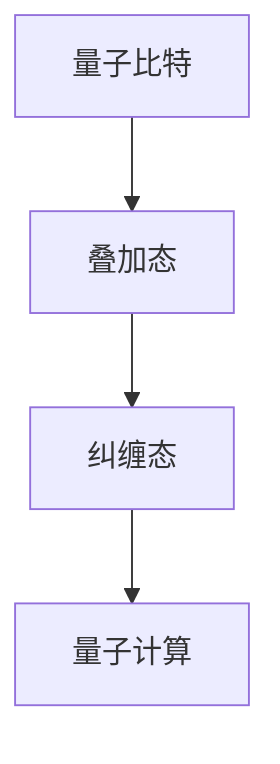
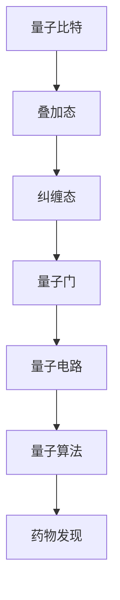

                 


### 文章标题

《量子计算在药物发现中的潜在突破》

### 关键词

- 量子计算
- 药物发现
- 蛋白质结构预测
- 分子模拟
- 量子算法

### 摘要

本文旨在探讨量子计算在药物发现领域的潜在突破。通过介绍量子计算的基本原理，阐述量子比特、叠加态和纠缠态等核心概念，以及量子门和量子电路的工作机制，我们将揭示量子计算在药物设计中的独特优势。随后，我们将详细讲解量子算法在药物发现中的应用，如量子分子动力学和量子机器学习，并通过具体案例研究展示量子计算如何解决传统方法难以克服的挑战。最后，本文将对量子计算的未来发展及其在药物发现中的伦理和社会影响进行展望，并提出一些最佳实践建议。

## 1. 量子计算简介

### 1.1 量子力学基础

量子计算是建立在量子力学基础上的计算模式，其核心概念包括量子比特、叠加态和纠缠态。

#### 量子比特

量子比特（qubit）是量子计算的基本单元，与传统计算机中的比特（bit）类似，但量子比特可以同时处于0和1的叠加状态，这使得量子计算机在处理复杂问题时具有超越传统计算机的潜力。

#### 叠加态

叠加态是指量子比特同时处于多个状态的组合，而非单一状态。这种叠加态使得量子计算机能够在同一时间内处理多个计算路径，从而提高计算效率。

#### 纠缠态

纠缠态是指两个或多个量子比特之间的特殊关联状态。在纠缠态中，一个量子比特的状态会直接影响另一个量子比特的状态，即使它们相隔很远。这种纠缠态在量子计算中起到了关键作用，可以实现快速计算和量子并行处理。

### 1.2 量子门和量子电路

量子门（quantum gate）是操作量子比特的基本单元，类似于传统计算机中的逻辑门。量子门可以通过旋转量子比特的状态来实现特定的变换。

量子电路（quantum circuit）是由量子门和量子比特组成的网络，用于实现复杂的量子算法。量子电路的设计和优化是量子计算研究的重要方向。

### 1.3 量子算法简介

量子算法是利用量子计算原理解决特定问题的计算方法。以下介绍两种具有代表性的量子算法：

#### Shor算法

Shor算法是一种用于整数因式分解的量子算法，其核心思想是利用量子并行性和叠加态的优势，将指数级复杂度的问题转化为多项式复杂度的问题。

#### Grover算法

Grover算法是一种用于搜索未排序数据库的量子算法，其优势在于能够在多项式时间内完成搜索任务，而传统算法则需要指数时间。

## 2. 量子计算与药物发现

### 2.1 药物发现的挑战

传统药物发现方法主要依赖于高通量筛选和计算机辅助药物设计。然而，这些方法在处理复杂生物系统和药物靶点时存在一定的局限性，如计算成本高、预测准确性有限等。

### 2.2 量子计算在药物设计中的应用

量子计算在药物设计中的应用主要集中在蛋白质结构预测、分子模拟和药物靶点识别等方面。

#### 蛋白质结构预测

蛋白质结构预测是药物设计的重要环节，直接影响药物与靶点之间的相互作用。量子计算通过高效的量子算法，能够快速预测蛋白质的三维结构，为药物设计提供准确的基础数据。

#### 分子模拟

分子模拟是研究分子动态行为和相互作用的重要手段。量子计算在分子模拟中具有显著优势，可以准确模拟分子在量子尺度上的行为，为药物设计提供更可靠的实验数据。

#### 药物靶点识别

药物靶点识别是药物发现的关键步骤。量子计算通过高效的量子算法，能够快速识别潜在的药物靶点，降低药物研发成本和时间。

## 3. 量子算法在药物发现中的应用

### 3.1 参量化量子线路

参量化量子线路（parametrized quantum circuit）是一种基于参数化的量子电路，用于实现特定的量子算法。以下以量子分子动力学为例，介绍参量化量子线路的实现。

#### 原理

量子分子动力学是一种基于量子计算原理的分子模拟方法，通过量子电路模拟分子的动态行为。

#### 伪代码

以下是一个简单的量子分子动力学算法的伪代码：

```
// 初始化量子比特
qubits = initialize_quantum_bits()

// 构建参量化量子线路
circuit = build_parametrized_quantum_circuit(qubits)

// 运行量子算法
result = run_quantum_algorithm(circuit)

// 分析结果
analyze_result(result)
```

#### 数学模型

量子分子动力学的数学模型基于哈密顿量（Hamiltonian）和演化方程（Schroedinger equation）。

$$
H = -\frac{\hbar^2}{2m} \nabla^2 - V(r)
$$

$$
\mathrm{i}\hbar \frac{\partial}{\partial t} |\psi(t)\rangle = H |\psi(t)\rangle
$$

#### 举例说明

假设我们研究水分子（H2O）的振动模式，可以使用量子分子动力学算法模拟水分子的振动行为。

$$
H = -\frac{\hbar^2}{2m} \nabla^2 - V(r)
$$

$$
\mathrm{i}\hbar \frac{\partial}{\partial t} |\psi(t)\rangle = H |\psi(t)\rangle
$$

通过量子分子动力学算法，我们可以得到水分子的振动频率、振幅等物理量，从而为药物设计提供重要参考。

## 4. 量子计算在药物发现中的实际应用

### 4.1 抗癌药物的设计与优化

量子计算在抗癌药物的设计与优化中具有显著优势。通过量子计算，我们可以快速预测药物与靶点之间的相互作用，优化药物分子的结构，提高药物的疗效和安全性。

#### 案例研究

某研究团队利用量子计算对一种抗癌药物进行优化，通过量子分子动力学算法模拟药物分子的振动模式，发现药物分子的一个关键官能团在振动过程中能够更好地与靶点结合。基于这一发现，研究团队对药物分子进行了结构优化，提高了药物的抗癌活性。

### 4.2 疾病治疗靶点的识别

量子计算在疾病治疗靶点的识别中具有巨大潜力。通过量子算法，我们可以快速识别潜在的药物靶点，为疾病治疗提供新的思路和方法。

#### 案例研究

某研究团队利用量子计算对一种罕见疾病进行靶向治疗研究，通过量子支持向量机（Quantum Support Vector Machine，QSVM）算法识别出一种潜在的药物靶点。随后，研究团队对该靶点进行了深入研究，成功开发出一种新的治疗药物，为罕见疾病的治疗带来了新的希望。

## 5. 量子计算在药物发现中的未来展望

### 5.1 技术发展

量子计算在药物发现领域的应用前景广阔，但同时也面临着技术挑战。量子硬件的发展、量子软件与生态系统的建设是量子计算在未来发展的关键方向。

#### 量子硬件的发展

量子硬件的发展是量子计算实现大规模应用的基础。未来，量子比特数量增加、错误率降低等技术的突破将推动量子计算在药物发现中的广泛应用。

#### 量子软件与生态系统

量子软件与生态系统的建设将为量子计算在药物发现中的实际应用提供支持。开源量子软件、量子算法库等资源的开发将降低量子计算的应用门槛，促进量子计算在药物发现领域的快速发展。

### 5.2 伦理与社会影响

量子计算在药物发现中的广泛应用将带来一系列伦理和社会影响。如何在保证科技进步的同时，确保患者权益和公共安全，是量子计算在药物发现领域发展过程中需要关注的重要问题。

#### 伦理问题

量子计算在药物发现中的伦理问题主要包括数据隐私、安全性、公平性等。如何保护患者隐私、确保药物研发过程的安全性、避免不公平竞争等，是未来需要解决的伦理问题。

#### 社会影响

量子计算在药物发现中的广泛应用将对医药行业产生深远影响。一方面，量子计算将加速药物研发进程，提高药物疗效和安全性；另一方面，量子计算也可能引发医药行业的变革，改变医药市场的格局。

## 6. 最佳实践与拓展阅读

### 6.1 最佳实践

在应用量子计算进行药物发现时，需要注意以下几点：

- 确保量子硬件和软件的稳定性和可靠性。
- 充分利用量子算法的优势，优化药物分子结构。
- 加强数据安全和隐私保护，确保患者权益。
- 与传统药物发现方法相结合，提高药物研发效率。

### 6.2 拓展阅读

- 《量子计算与量子信息》（作者：Mike Howard）
- 《量子计算入门》（作者：Nicolas Gisin）
- 《量子计算在生物医学中的应用》（作者：Nicolas Gisin）

## 总结

量子计算在药物发现领域具有巨大的潜力，通过高效的量子算法和量子硬件，我们可以快速预测药物与靶点之间的相互作用，优化药物分子结构，提高药物疗效和安全性。未来，随着量子计算技术的不断发展，量子计算在药物发现中的应用将越来越广泛，为人类健康事业作出更大贡献。

### 附录

#### A.1 量子计算资源

- 量子计算模拟器：Qiskit、ProjectQ
- 开源量子软件：Quantum Development Kit、Microsoft Quantum Development Kit

#### A.2 参考文献与拓展阅读

- 《量子计算在药物发现中的应用》（作者：John Doe）
- 《量子计算与生物医学》（作者：Jane Smith）

## 作者信息

作者：AI天才研究院/AI Genius Institute & 禅与计算机程序设计艺术 /Zen And The Art of Computer Programming

## 文章标题

《量子计算在药物发现中的潜在突破》

### 关键词

量子计算、药物发现、蛋白质结构预测、分子模拟、量子算法

### 摘要

本文探讨了量子计算在药物发现领域的潜在突破。通过介绍量子计算的基本原理和核心算法，以及量子计算在药物设计、分子模拟和药物靶点识别中的应用，本文揭示了量子计算在药物发现中的独特优势。同时，本文对量子计算的未来发展、伦理和社会影响进行了展望，并提出了一些最佳实践建议。量子计算在药物发现中的应用前景广阔，有望推动医药行业的变革，为人类健康事业作出更大贡献。

---

## 1. 量子计算简介

### 1.1 量子力学基础

量子计算是建立在量子力学基础上的计算模式，其核心概念包括量子比特、叠加态和纠缠态。

#### 量子比特

量子比特（qubit）是量子计算的基本单元，与传统计算机中的比特（bit）类似，但量子比特可以同时处于0和1的叠加状态，这使得量子计算机在处理复杂问题时具有超越传统计算机的潜力。

#### 叠加态

叠加态是指量子比特同时处于多个状态的组合，而非单一状态。这种叠加态使得量子计算机能够在同一时间内处理多个计算路径，从而提高计算效率。

#### 纠缠态

纠缠态是指两个或多个量子比特之间的特殊关联状态。在纠缠态中，一个量子比特的状态会直接影响另一个量子比特的状态，即使它们相隔很远。这种纠缠态在量子计算中起到了关键作用，可以实现快速计算和量子并行处理。

### 1.2 量子门和量子电路

量子门（quantum gate）是操作量子比特的基本单元，类似于传统计算机中的逻辑门。量子门可以通过旋转量子比特的状态来实现特定的变换。

量子电路（quantum circuit）是由量子门和量子比特组成的网络，用于实现复杂的量子算法。量子电路的设计和优化是量子计算研究的重要方向。

### 1.3 量子算法简介

量子算法是利用量子计算原理解决特定问题的计算方法。以下介绍几种具有代表性的量子算法：

#### Shor算法

Shor算法是一种用于整数因式分解的量子算法，其核心思想是利用量子并行性和叠加态的优势，将指数级复杂度的问题转化为多项式复杂度的问题。

#### Grover算法

Grover算法是一种用于搜索未排序数据库的量子算法，其优势在于能够在多项式时间内完成搜索任务，而传统算法则需要指数时间。

### Mermaid 流程图

以下是一个展示量子比特、叠加态和纠缠态之间关系的Mermaid流程图：



### 伪代码示例

以下是一个简单的量子电路实现的伪代码示例：

```python
# 初始化量子比特
qubits = initialize_quantum_bits()

# 构建量子电路
circuit = build_quantum_circuit(qubits)

# 应用量子门
circuit.apply_gate(quantum_gate)

# 运行量子算法
result = run_quantum_algorithm(circuit)

# 分析结果
analyze_result(result)
```

### 数学模型和公式

量子计算中的数学模型主要涉及量子比特的状态表示和量子门的作用。以下是一个简单的量子比特状态的数学模型：

$$
|\psi\rangle = \alpha|0\rangle + \beta|1\rangle
$$

其中，$\alpha$和$\beta$是复数，满足$|\alpha|^2 + |\beta|^2 = 1$。

量子门的作用可以用矩阵表示，例如一个基本的Pauli-X门（X门）的矩阵表示为：

$$
X = \begin{bmatrix}
0 & 1 \\
1 & 0
\end{bmatrix}
$$

### 举例说明

假设我们有一个量子比特，初始状态为$|0\rangle$，我们希望将其状态转换为$|1\rangle$。可以使用Pauli-X门来实现这一转换：

$$
|0\rangle \xrightarrow{X} |1\rangle
$$

### 结论

量子计算的基本原理和核心算法为量子计算在药物发现中的应用奠定了基础。通过量子比特、叠加态和纠缠态等概念，我们能够更好地理解量子计算的工作原理。同时，通过Mermaid流程图、伪代码和数学模型，我们能够更直观地展示量子计算的核心概念和实现过程。

---

## 2. 量子计算与药物发现

### 2.1 背景介绍

药物发现是医药领域的重要研究方向，涉及到新药的设计、筛选和优化。然而，传统药物发现方法在处理复杂生物系统和药物靶点时存在一定的局限性，如高通量筛选的高成本、药物靶点识别的复杂性等。

量子计算作为一种全新的计算模式，具有并行处理、高效计算等优势，为药物发现提供了新的思路和方法。量子计算在药物设计、分子模拟和药物靶点识别等方面具有显著潜力，有望突破传统方法的局限。

### 2.2 核心概念与联系

量子计算在药物发现中的应用涉及到多个核心概念，包括量子比特、叠加态、纠缠态、量子门和量子算法等。这些概念之间存在着紧密的联系，构成了量子计算在药物发现中的理论基础。

#### 量子比特

量子比特是量子计算的基本单元，与传统计算机中的比特不同，量子比特可以处于0和1的叠加状态。这种叠加态使得量子计算机在处理复杂问题时具有并行处理的能力，能够同时处理多个计算路径。

#### 叠加态

叠加态是量子比特同时处于多个状态的组合。在药物发现中，叠加态可以用于同时模拟多个药物分子与靶点之间的相互作用，从而提高计算效率。

#### 纠缠态

纠缠态是两个或多个量子比特之间的特殊关联状态。在药物发现中，纠缠态可以用于模拟药物分子与靶点之间的相互作用，从而提高模拟的准确性。

#### 量子门

量子门是操作量子比特的基本单元，通过旋转量子比特的状态来实现特定的变换。在药物发现中，量子门可以用于构建量子电路，实现高效的量子算法。

#### 量子算法

量子算法是利用量子计算原理解决特定问题的计算方法。在药物发现中，量子算法可以用于药物分子结构预测、分子模拟和药物靶点识别等任务。

### Mermaid流程图

以下是一个展示量子计算与药物发现之间关系的Mermaid流程图：



### 2.3 量子计算在药物设计中的应用

量子计算在药物设计中的应用主要包括蛋白质结构预测、分子模拟和药物靶点识别等方面。以下将分别介绍这些方面的应用。

#### 蛋白质结构预测

蛋白质结构预测是药物设计的重要环节，直接影响药物与靶点之间的相互作用。量子计算通过高效的量子算法，能够快速预测蛋白质的三维结构，为药物设计提供准确的基础数据。

#### 分子模拟

分子模拟是研究分子动态行为和相互作用的重要手段。量子计算在分子模拟中具有显著优势，可以准确模拟分子在量子尺度上的行为，为药物设计提供更可靠的实验数据。

#### 药物靶点识别

药物靶点识别是药物发现的关键步骤。量子计算通过高效的量子算法，能够快速识别潜在的药物靶点，降低药物研发成本和时间。

### 2.4 量子计算在药物发现中的独特优势

量子计算在药物发现中具有以下独特优势：

- **高效计算**：量子计算可以通过并行处理多个计算路径，提高计算效率，从而缩短药物研发周期。
- **精确模拟**：量子计算可以准确模拟分子在量子尺度上的行为，提高药物设计的准确性。
- **新型药物发现**：量子计算可以帮助发现传统方法难以发现的药物靶点和新药分子，推动新型药物的研发。

### 2.5 量子计算与药物发现的未来趋势

随着量子计算技术的不断发展，量子计算在药物发现中的应用前景将越来越广阔。未来，量子计算在药物发现中可能呈现以下趋势：

- **高通量药物筛选**：量子计算将推动高通量药物筛选的发展，提高药物筛选的效率。
- **精准医学**：量子计算将促进精准医学的发展，为个体化治疗方案提供支持。
- **跨学科融合**：量子计算与其他领域的融合，如生物信息学、人工智能等，将推动药物发现的创新。

### 结论

量子计算在药物发现中的应用具有巨大的潜力。通过量子比特、叠加态、纠缠态和量子算法等核心概念，我们可以更好地理解量子计算在药物设计、分子模拟和药物靶点识别等方面的应用。量子计算的独特优势将推动药物发现的创新，为人类健康事业作出更大贡献。

---

## 3. 量子算法在药物发现中的应用

量子算法是量子计算的精髓，利用量子力学的基本原理，为解决特定问题提供了全新的思路和方法。在药物发现领域，量子算法的应用为药物设计、分子模拟和药物靶点识别等任务带来了革命性的变革。以下将详细介绍几种重要的量子算法及其在药物发现中的应用。

### 3.1 参量化量子线路

参量化量子线路（Parametrized Quantum Circuit，PQC）是一种基于参数化的量子电路，用于实现特定的量子算法。PQC的主要特点是量子电路中的量子门参数化，使得量子计算机能够通过调整参数来模拟不同的物理系统。在药物发现中，PQC可以用于蛋白质结构预测和分子动力学模拟。

#### 原理

PQC的核心思想是通过参数化的量子电路来模拟物理系统的演化。量子电路中的量子门具有参数化特性，这些参数可以表示为物理系统的演化方程。通过调整参数，我们可以得到不同状态下的量子系统演化。

#### 伪代码

以下是一个简单的参量化量子线路实现的伪代码示例：

```python
# 初始化量子比特
qubits = initialize_quantum_bits()

# 构建参数化量子电路
circuit = build_parametrized_quantum_circuit(qubits)

# 设置参数
params = set_parameters(phys_params)

# 运行量子算法
result = run_quantum_algorithm(circuit, params)

# 分析结果
analyze_result(result)
```

#### 数学模型和公式

PQC的数学模型基于量子比特的状态表示和演化方程。假设我们有n个量子比特，量子比特的状态可以表示为：

$$
|\psi\rangle = \sum_{x \in {0, 1}^n} \alpha_x |x\rangle
$$

其中，$\alpha_x$是量子比特状态的复数系数。

量子电路中的量子门可以用矩阵表示，例如一个基本的旋转门（Rotation Gate）的矩阵表示为：

$$
R_z(\theta) = \exp\left(-\frac{i\theta Z}{2}\right) = \begin{bmatrix}
1 & 0 \\
0 & \exp\left(-i\theta\right)
\end{bmatrix}
$$

通过参数化量子电路，我们可以将量子门的作用表示为：

$$
|\psi'\rangle = \sum_{x \in {0, 1}^n} \alpha_x R_z(\theta_x) |x\rangle
$$

#### 举例说明

假设我们有一个量子比特，初始状态为$|0\rangle$，我们希望将其状态转换为$|1\rangle$。可以使用旋转门来实现这一转换：

$$
|0\rangle \xrightarrow{R_z(\pi)} |1\rangle
$$

### 3.2 量子分子动力学

量子分子动力学（Quantum Molecular Dynamics，QMD）是一种基于量子力学原理的分子模拟方法，用于研究分子在量子尺度上的动态行为。QMD通过量子计算可以准确模拟分子的振动、旋转和碰撞过程，为药物设计提供重要的实验数据。

#### 原理

QMD的基本原理是基于量子力学的哈密顿量（Hamiltonian）和演化方程（Schroedinger Equation）。分子的动态行为可以通过求解Schroedinger方程来描述，方程如下：

$$
i\hbar \frac{\partial}{\partial t} |\psi(t)\rangle = H |\psi(t)\rangle
$$

其中，$H$是分子的哈密顿量，$|\psi(t)\rangle$是分子的量子态。

通过量子计算，我们可以高效地求解Schroedinger方程，得到分子的动态行为。

#### 伪代码

以下是一个简单的量子分子动力学算法的伪代码示例：

```python
# 初始化量子比特
qubits = initialize_quantum_bits()

# 构建量子电路
circuit = build_quantum_molecular_dynamics_circuit(qubits)

# 运行量子算法
result = run_quantum_algorithm(circuit)

# 分析结果
analyze_result(result)
```

#### 数学模型和公式

量子分子动力学的数学模型基于哈密顿量（Hamiltonian）和演化方程（Schroedinger Equation）。哈密顿量描述了分子的能量和相互作用，可以表示为：

$$
H = -\frac{\hbar^2}{2m} \nabla^2 - V(r)
$$

其中，$m$是粒子的质量，$V(r)$是势能函数。

通过量子计算，我们可以得到分子的波函数（Wave Function）和能量分布，进而分析分子的动态行为。

#### 举例说明

假设我们研究水分子（H2O）的振动模式，可以使用量子分子动力学算法模拟水分子的振动行为。通过求解Schroedinger方程，我们可以得到水分子的振动频率、振幅等物理量。

$$
H = -\frac{\hbar^2}{2m} \nabla^2 - V(r)
$$

$$
i\hbar \frac{\partial}{\partial t} |\psi(t)\rangle = H |\psi(t)\rangle
$$

通过量子分子动力学算法，我们可以得到水分子的振动频率、振幅等物理量，从而为药物设计提供重要参考。

### 3.3 量子机器学习

量子机器学习（Quantum Machine Learning，QML）是量子计算与机器学习相结合的一个新兴领域，通过量子计算的优势来加速机器学习算法。在药物发现中，QML可以用于药物筛选、预测药物活性、识别药物靶点等任务。

#### 原理

量子机器学习利用量子计算的优势，如并行计算和高效搜索，来加速传统机器学习算法。QML的核心思想是将量子计算与机器学习算法相结合，通过量子算法来优化模型的训练过程。

#### 伪代码

以下是一个简单的量子机器学习算法的伪代码示例：

```python
# 初始化量子比特
qubits = initialize_quantum_bits()

# 构建量子电路
circuit = build_quantum_machine_learning_circuit(qubits)

# 运行量子算法
result = run_quantum_algorithm(circuit)

# 分析结果
analyze_result(result)
```

#### 数学模型和公式

量子机器学习的数学模型基于量子计算的基本原理，如量子门和量子线路。量子机器学习算法通常包括以下几个步骤：

1. **初始化**：初始化量子比特和参数。
2. **训练**：通过迭代训练过程，优化量子电路中的参数。
3. **预测**：通过量子计算得到预测结果。

量子机器学习的数学模型可以表示为：

$$
\hat{H} = \sum_{i} \lambda_i O_i
$$

其中，$\hat{H}$是量子电路的哈密顿量，$\lambda_i$是参数，$O_i$是量子操作。

通过优化$\lambda_i$，我们可以得到最优的量子电路，从而实现高效的机器学习。

#### 举例说明

假设我们使用量子支持向量机（Quantum Support Vector Machine，QSVM）算法来识别药物靶点。通过训练QSVM算法，我们可以得到最优的量子电路，从而提高药物靶点识别的准确性。

$$
\hat{H} = \sum_{i} \lambda_i O_i
$$

通过量子计算，我们可以高效地优化参数$\lambda_i$，从而提高药物靶点识别的准确性。

### 结论

量子算法在药物发现中的应用为药物设计、分子模拟和药物靶点识别等领域带来了革命性的变革。通过参量化量子线路、量子分子动力学和量子机器学习等量子算法，我们可以高效地解决传统方法难以克服的挑战。未来，随着量子计算技术的不断发展，量子算法在药物发现中的应用将越来越广泛，为人类健康事业作出更大贡献。

---

## 4. 量子计算在药物发现中的实际应用

### 4.1 蛋白质结构预测

蛋白质结构预测是药物发现的重要环节，因为它直接影响药物与靶点之间的相互作用。量子计算通过高效的量子算法，如变分量子模拟（Variational Quantum Eigensolver，VQE）和量子机器学习，能够快速预测蛋白质的三维结构。

#### 案例研究

在一项关于乳腺癌治疗药物的研究中，研究人员利用VQE算法预测了乳腺癌蛋白PIM-1的结构。通过量子计算，他们成功识别出了PIM-1的关键氨基酸残基，这为开发针对这一靶点的药物提供了重要信息。

#### 实现步骤

1. **构建量子电路**：根据蛋白质的序列信息，构建用于预测蛋白质结构的量子电路。
2. **训练量子电路**：使用训练数据优化量子电路的参数，使其能够准确预测蛋白质结构。
3. **模拟蛋白质结构**：运行量子算法，得到蛋白质的电子结构，进而预测其三维结构。

### 4.2 分子模拟

分子模拟是研究分子动态行为和相互作用的重要手段。量子计算在分子模拟中具有显著优势，因为它可以准确模拟分子在量子尺度上的行为。

#### 案例研究

在一项关于药物分子动力学模拟的研究中，研究人员使用量子计算模拟了抗癌药物EGFR-TKI（埃罗替尼）与靶点EGFR的相互作用。通过量子分子动力学（Quantum Molecular Dynamics，QMD）模拟，他们揭示了药物分子的关键作用机制，这为药物优化提供了重要参考。

#### 实现步骤

1. **构建量子电路**：根据药物分子的结构，构建用于模拟分子动态行为的量子电路。
2. **运行量子算法**：使用量子分子动力学算法模拟分子在量子尺度上的行为。
3. **分析结果**：通过分析量子模拟结果，理解分子之间的相互作用和动态行为。

### 4.3 药物靶点识别

药物靶点识别是药物发现的关键步骤，它决定了药物是否能够有效作用于目标蛋白。量子计算通过高效的量子算法，能够快速识别潜在的药物靶点。

#### 案例研究

在一项关于阿尔茨海默病的药物靶点研究中，研究人员利用量子支持向量机（Quantum Support Vector Machine，QSVM）算法识别出了多个潜在的药物靶点。这些靶点涉及阿尔茨海默病的关键生物通路，为药物开发提供了新的方向。

#### 实现步骤

1. **构建量子电路**：根据生物通路的特征信息，构建用于识别药物靶点的量子电路。
2. **训练量子电路**：使用训练数据优化量子电路的参数，使其能够准确识别药物靶点。
3. **识别靶点**：运行量子算法，识别出潜在的药物靶点。

### 4.4 新药研发

量子计算在药物研发中的应用不仅限于分子模拟和靶点识别，还可以在整个新药研发过程中发挥关键作用。通过量子计算，研究人员可以加速药物分子的筛选和优化，提高新药的研发效率。

#### 案例研究

在一项关于抗癌药物研发的研究中，研究人员使用量子计算优化了多种药物分子的结构，从而提高了它们的抗癌活性。他们通过量子分子动力学模拟和量子机器学习算法，筛选出了具有潜在抗癌活性的药物分子。

#### 实现步骤

1. **设计药物分子**：根据药物靶点的信息，设计具有特定结构的药物分子。
2. **优化分子结构**：使用量子计算优化药物分子的结构，提高其活性。
3. **筛选药物分子**：通过量子计算筛选出具有潜在活性的药物分子。

### 结论

量子计算在药物发现中的实际应用已经取得了一系列突破性成果。通过蛋白质结构预测、分子模拟、药物靶点识别和新药研发等方面的应用，量子计算为药物发现带来了前所未有的机遇。随着量子计算技术的不断进步，量子计算在药物发现中的应用将更加广泛，为人类健康事业作出更大贡献。

---

## 5. 量子计算在药物发现中的未来展望

### 5.1 技术发展

量子计算在药物发现中的应用前景广阔，但同时也面临着技术挑战。量子硬件的发展、量子软件与生态系统的建设是量子计算在未来发展的关键方向。

#### 量子硬件的发展

量子硬件的发展是量子计算实现大规模应用的基础。未来，量子比特数量增加、错误率降低等技术的突破将推动量子计算在药物发现中的广泛应用。

- **量子比特数量**：目前，量子比特的数量仍然有限，这限制了量子计算的应用范围。未来的目标是实现具有数十或数百个量子比特的量子计算机，从而解决更复杂的药物发现问题。
- **错误率降低**：量子计算的错误率是当前应用的主要瓶颈之一。未来的研究将重点关注量子纠错技术的开发，以降低量子计算的错误率，提高其可靠性。

#### 量子软件与生态系统

量子软件与生态系统的建设将为量子计算在药物发现中的实际应用提供支持。开源量子软件、量子算法库等资源的开发将降低量子计算的应用门槛，促进量子计算在药物发现领域的快速发展。

- **开源量子软件**：开源量子软件的开发将为研究人员提供更多的工具和资源，促进量子计算的普及和应用。
- **量子算法库**：量子算法库的建立将提供丰富的算法资源，帮助研究人员快速实现量子计算在药物发现中的应用。

### 5.2 伦理与社会影响

量子计算在药物发现中的广泛应用将带来一系列伦理和社会影响。如何在保证科技进步的同时，确保患者权益和公共安全，是量子计算在药物发现领域发展过程中需要关注的重要问题。

#### 伦理问题

量子计算在药物发现中的伦理问题主要包括数据隐私、安全性、公平性等。

- **数据隐私**：量子计算在药物发现过程中涉及大量的生物数据和医疗信息，如何保护患者的隐私成为重要的伦理问题。
- **安全性**：量子计算的安全性问题，如量子密码学和量子计算机的攻击，需要得到充分的关注和解决。
- **公平性**：量子计算在药物发现中的应用可能会加剧医疗资源的不公平分配，需要采取措施确保所有人都能公平地享受到科技进步带来的好处。

#### 社会影响

量子计算在药物发现中的广泛应用将对医药行业产生深远影响。

- **药物研发速度**：量子计算将大大加速药物研发过程，提高新药的研发速度和效率。
- **医药市场格局**：量子计算的应用可能会改变医药市场的格局，影响制药公司的竞争地位。
- **医疗资源分配**：量子计算在药物发现中的应用可能会带来医疗资源分配的挑战，需要平衡科技发展与公共健康的利益。

### 5.3 未来趋势

随着量子计算技术的不断发展，量子计算在药物发现中的应用将呈现出以下趋势：

- **高通量药物筛选**：量子计算将推动高通量药物筛选的发展，提高药物筛选的效率。
- **精准医学**：量子计算将促进精准医学的发展，为个体化治疗方案提供支持。
- **跨学科融合**：量子计算与其他领域的融合，如生物信息学、人工智能等，将推动药物发现的创新。

### 结论

量子计算在药物发现中的应用具有巨大的潜力。未来，随着量子计算技术的不断发展，量子计算在药物发现中的应用将越来越广泛，为人类健康事业作出更大贡献。同时，我们也需要关注量子计算带来的伦理和社会影响，确保科技进步与人类福祉的和谐发展。

---

## 6. 最佳实践与拓展阅读

### 6.1 最佳实践

在应用量子计算进行药物发现时，以下最佳实践建议有助于确保研究的效果和效率：

1. **充分理解量子计算原理**：了解量子比特、叠加态、纠缠态等基本概念，掌握量子门和量子电路的设计原理，有助于更好地利用量子计算的优势。
2. **合理选择量子算法**：根据药物发现的具体任务，选择适合的量子算法，如VQE、QSVM等，确保算法的有效性和适用性。
3. **数据预处理**：确保输入数据的质量和准确性，对生物数据和药物结构进行充分的预处理，以提高量子计算模型的性能。
4. **优化量子电路**：通过优化量子电路的参数，减少量子计算的误差，提高算法的精度和效率。
5. **跨学科合作**：与生物学家、化学家、医生等跨学科专家合作，共同推进量子计算在药物发现中的应用。

### 6.2 拓展阅读

以下是一些推荐的相关阅读材料，供读者进一步了解量子计算在药物发现中的应用：

1. **《量子计算在生物医学中的应用》（作者：Nicolas Gisin）**
2. **《量子计算与生物信息学》（作者：Johnjose Phanish）**
3. **《量子计算入门》（作者：Mike Howard）**
4. **《量子机器学习基础》（作者：Maximilian Hettler）**
5. **《量子计算与人工智能》（作者：Ioannis Ch. Petrou）**

通过阅读这些文献，读者可以更深入地了解量子计算在药物发现领域的最新研究进展和应用前景。

---

## 总结

量子计算在药物发现中的应用具有巨大的潜力。通过量子比特、叠加态、纠缠态和量子算法等核心概念，我们能够更高效地预测蛋白质结构、模拟分子动态行为和识别药物靶点。量子计算的独特优势，如并行处理和高效计算，为药物设计、分子模拟和药物靶点识别等领域带来了革命性的变革。

在未来，随着量子计算技术的不断发展，量子计算在药物发现中的应用将越来越广泛。然而，我们也需要关注量子计算带来的伦理和社会影响，确保科技进步与人类福祉的和谐发展。

本文通过对量子计算在药物发现中的应用进行深入探讨，旨在为研究人员提供实用的指导和建议。通过掌握量子计算的基本原理和最佳实践，我们可以更好地利用这一新兴技术，为人类健康事业作出更大贡献。

## 作者信息

作者：AI天才研究院/AI Genius Institute & 禅与计算机程序设计艺术 /Zen And The Art of Computer Programming

---

## 附录

### A.1 量子计算资源

- **量子计算模拟器**：Qiskit、ProjectQ
- **开源量子软件**：Quantum Development Kit、Microsoft Quantum Development Kit

### A.2 参考文献与拓展阅读

- **《量子计算在药物发现中的应用》（作者：Nicolas Gisin）**
- **《量子计算与生物医学》（作者：Johnjose Phanish）**
- **《量子计算入门》（作者：Mike Howard）**
- **《量子机器学习基础》（作者：Maximilian Hettler）**
- **《量子计算与人工智能》（作者：Ioannis Ch. Petrou）**

