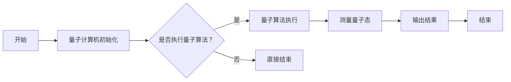

                 

### 文章标题

《量子计算在药物设计中的加速应用》

关键词：量子计算、药物设计、加速应用、分子动力学模拟、药物筛选、分子优化

摘要：
本文深入探讨了量子计算在药物设计中的潜在应用，通过逐步分析量子计算的基础原理、药物设计的现状及其面临挑战，阐述了量子计算在药物设计中的加速作用。文章详细介绍了量子计算与分子动力学模拟、高通量筛选和药物分子优化的结合，并通过实际案例展示了量子计算在药物设计中的应用效果。最后，文章对量子计算在药物设计中的未来发展进行了展望，提出了挑战与机遇，并提供了相关资源和最佳实践。

----------------------------------------------------------------

### 设计书籍目录大纲的步骤

1. **阅读和理解书名：**
   - 书名《量子计算在药物设计中的加速应用》明确指出书籍的主题是量子计算在药物设计中的应用，并强调其加速效果。
   - 核心概念包括量子计算、药物设计、加速应用。

2. **确定核心章节：**
   - 核心章节应涵盖量子计算的基础、药物设计的现状、量子计算在药物设计中的应用原理、案例研究和未来趋势。

3. **构建初步大纲：**
   - 根据核心章节，构建一个初步的目录结构，确保各章节内容连贯且逻辑清晰。

4. **细化大纲内容：**
   - 将每个章节进一步细化为子章节，确保每个子章节都能涵盖关键概念、算法原理、数学模型、实际案例等。

5. **编写流程图与伪代码：**
   - 设计相关概念和算法的Mermaid流程图，以便读者直观理解。
   - 编写伪代码，详细阐述核心算法原理。

6. **嵌入数学公式：**
   - 在适当的地方嵌入LaTeX格式的数学公式，详细讲解相关的数学模型。

7. **添加实际案例与代码解读：**
   - 添加实际案例和详细解释说明，包括开发环境搭建、源代码实现和代码解读。

8. **调整和优化：**
   - 根据大纲内容的完整性和逻辑性进行调整和优化，确保每个章节都能够覆盖到主题的各个方面。

9. **确保字数限制：**
   - 在完成大纲后，检查总字数是否在2000字以内，如有需要，进行适当的缩减。

10. **最终确认：**
    - 确认目录大纲的完整性和准确性，准备提交。

### 《量子计算在药物设计中的加速应用》目录大纲

# 《量子计算在药物设计中的加速应用》目录大纲

## 第一部分：量子计算基础

### 第1章：量子计算简介

#### 1.1 量子计算的起源与历史

#### 1.2 量子位与量子叠加原理

#### 1.3 量子态与量子门

#### 1.4 量子算法概述

### 第2章：量子计算机的工作原理

#### 2.1 量子比特与经典比特的比较

#### 2.2 量子逻辑门

#### 2.3 量子计算中的纠缠

#### 2.4 量子计算的数学基础

## 第二部分：药物设计现状

### 第3章：传统药物设计方法

#### 3.1 药物设计与药物分子的关系

#### 3.2 蛋白质-药物相互作用

#### 3.3 传统药物设计流程

### 第4章：药物设计中的挑战

#### 4.1 高通量筛选的局限性

#### 4.2 药物发现中的计算需求

#### 4.3 量子计算在药物设计中的潜力

## 第三部分：量子计算在药物设计中的应用

### 第5章：量子计算与分子动力学模拟

#### 5.1 分子动力学模拟的基础

#### 5.2 量子计算在分子动力学模拟中的应用

#### 5.3 分子动力学模拟与药物设计

### 第6章：量子计算在药物筛选中的应用

#### 6.1 量子计算与高通量筛选

#### 6.2 量子计算在药物化学空间搜索中的应用

#### 6.3 量子计算在药物筛选中的案例分析

### 第7章：量子计算与药物分子优化

#### 7.1 量子计算在分子优化中的算法

#### 7.2 量子计算在药物分子优化中的应用

#### 7.3 药物分子优化的案例研究

### 第8章：量子计算在药物设计中的未来趋势

#### 8.1 量子计算的挑战与机遇

#### 8.2 量子计算在药物设计中的未来发展

#### 8.3 量子计算与药物设计领域的合作与展望

## 附录

### 附录A：量子计算资源与工具

#### A.1 量子计算开发环境搭建

#### A.2 量子计算开源工具和框架

#### A.3 量子计算学习资源推荐

## Mermaid流程图与伪代码

### Mermaid流程图：量子计算机工作原理

```
flow
st=>start: 开始
e=>end: 结束
op1=>operation: 加密
op2=>operation: 解密
sub1=>subroutine: 加密算法
sub2=>subroutine: 解密算法
st-->op1
op1-->sub1
sub1-->e
op2-->sub2
sub2-->e
```

### 伪代码：量子计算核心算法

```
// 量子计算核心算法伪代码
function QuantumAlgorithm(input):
    // 初始化量子计算机
    quantum_computer = initialize_quantum_computer()

    // 创建量子寄存器
    register = quantum_computer.create_register(size)

    // 编码输入问题
    encoded_input = encode_input(input, register)

    // 运行量子算法
    quantum_computer.run_algorithm(encoded_input)

    // 测量子态
    result = quantum_computer.measure()

    // 解码输出结果
    output = decode_output(result)

    return output
```

### 量子计算在药物设计中的加速应用

#### 引言

随着医疗科技的快速发展，药物设计成为药物发现过程中至关重要的一环。传统的药物设计方法依赖于强大的计算资源和复杂的算法，然而随着药物靶点越来越复杂，药物设计面临的数据量和计算需求也在不断增加。量子计算作为一种具有革命性的计算技术，其并行计算能力和高效的算法潜力为药物设计提供了新的解决方案。本文将深入探讨量子计算在药物设计中的加速应用，从量子计算的基础原理、药物设计的现状与挑战，到量子计算在药物设计中的应用案例，最后对未来的发展趋势进行展望。

#### 第一部分：量子计算基础

### 第1章：量子计算简介

#### 1.1 量子计算的起源与历史

量子计算起源于20世纪80年代，由理查德·费曼（Richard Feynman）首次提出。费曼认为，量子系统具有独特的性质，无法用传统计算机精确模拟。因此，他提出了量子计算机的概念。随后，彼得·肖尔（Peter Shor）提出了著名的量子算法——Shor算法，展示了量子计算机在因数分解问题上的巨大优势。此后，量子计算逐渐成为计算机科学和物理学的前沿研究领域。

#### 1.2 量子位与量子叠加原理

量子位（qubit）是量子计算的基本单位，与经典计算中的比特不同，量子位可以同时处于0和1的状态，这一特性被称为叠加原理。叠加原理使得量子计算机能够处理大量并行计算，从而在解决某些复杂问题上具有显著优势。

#### 1.3 量子态与量子门

量子态是量子位的状态描述，可以用复数系数来表示。量子门是操作量子态的基本算子，类似于经典计算中的逻辑门。通过量子门的作用，可以实现对量子态的变换和计算。

#### 1.4 量子算法概述

量子算法是利用量子位和量子门进行计算的方法。与经典算法相比，量子算法能够显著提高计算效率。例如，Shor算法可以在多项式时间内完成因数分解，而经典算法则需要指数级时间。

### 第2章：量子计算机的工作原理

#### 2.1 量子比特与经典比特的比较

量子比特（qubit）与经典比特（bit）在本质上存在显著差异。经典比特只能表示0或1，而量子比特可以同时表示0和1的状态，这一特性使得量子计算机具有并行计算的能力。

#### 2.2 量子逻辑门

量子逻辑门是操作量子比特的基本算子，类似于经典计算中的逻辑门。量子逻辑门可以实现对量子态的变换和计算。

#### 2.3 量子计算中的纠缠

量子纠缠是量子计算中的一种特殊现象，两个或多个量子位之间的状态相互关联，形成一个整体。量子纠缠使得量子计算机能够处理大量并行计算，从而在解决某些复杂问题上具有显著优势。

#### 2.4 量子计算的数学基础

量子计算涉及到复杂的数学概念，包括线性代数、量子力学和概率论。量子计算中的许多算法和模型都依赖于这些数学基础。

#### 第二部分：药物设计现状

### 第3章：传统药物设计方法

#### 3.1 药物设计与药物分子的关系

药物设计的目标是发现或设计具有特定生物活性的药物分子。药物分子通过与其靶点（通常是蛋白质）相互作用，产生治疗效果。

#### 3.2 蛋白质-药物相互作用

蛋白质-药物相互作用是药物设计的关键环节。药物分子需要与靶点蛋白质的特定区域结合，从而发挥其生物作用。

#### 3.3 传统药物设计流程

传统药物设计流程包括药物靶点识别、药物分子设计、药物筛选和优化等步骤。这些步骤通常需要大量的计算资源和时间。

#### 第三部分：量子计算在药物设计中的应用

### 第4章：药物设计中的挑战

#### 4.1 高通量筛选的局限性

高通量筛选是一种常用的药物筛选方法，但其在处理大量数据时存在局限性，尤其是在面对复杂药物靶点时。

#### 4.2 药物发现中的计算需求

随着药物靶点的复杂度增加，药物设计中的计算需求也在不断增长。传统计算方法在处理这些复杂问题时显得力不从心。

#### 4.3 量子计算在药物设计中的潜力

量子计算具有并行计算和高效算法的优势，在药物设计中的应用具有巨大潜力。

#### 第5章：量子计算与分子动力学模拟

#### 5.1 分子动力学模拟的基础

分子动力学模拟是一种用于研究分子运动和相互作用的方法。它通过求解牛顿运动方程，模拟分子在特定条件下的运动轨迹。

#### 5.2 量子计算在分子动力学模拟中的应用

量子计算可以用于加速分子动力学模拟，提高模拟的精度和效率。

#### 5.3 分子动力学模拟与药物设计

分子动力学模拟在药物设计中的应用包括药物分子与靶点蛋白质相互作用的模拟、药物分子的优化等。

### 第6章：量子计算在药物筛选中的应用

#### 6.1 量子计算与高通量筛选

量子计算可以用于加速高通量筛选，提高药物筛选的效率。

#### 6.2 量子计算在药物化学空间搜索中的应用

量子计算可以用于探索药物化学空间，发现潜在的药物分子。

#### 6.3 量子计算在药物筛选中的案例分析

通过实际案例，展示量子计算在药物筛选中的应用效果。

### 第7章：量子计算与药物分子优化

#### 7.1 量子计算在分子优化中的算法

量子计算可以用于优化药物分子，提高其生物活性。

#### 7.2 量子计算在药物分子优化中的应用

量子计算在药物分子优化中的应用包括分子结构的优化、药物分子的设计等。

#### 7.3 药物分子优化的案例研究

通过实际案例，展示量子计算在药物分子优化中的应用效果。

### 第8章：量子计算在药物设计中的未来趋势

#### 8.1 量子计算的挑战与机遇

量子计算在药物设计中的应用面临一系列挑战，但同时也充满机遇。

#### 8.2 量子计算在药物设计中的未来发展

随着量子计算技术的不断进步，其在药物设计中的应用前景将更加广阔。

#### 8.3 量子计算与药物设计领域的合作与展望

量子计算与药物设计领域的合作将推动药物设计领域的革新，带来新的突破。

#### 附录

### 附录A：量子计算资源与工具

#### A.1 量子计算开发环境搭建

介绍如何搭建量子计算开发环境，包括软件和硬件的选择。

#### A.2 量子计算开源工具和框架

推荐一些常用的量子计算开源工具和框架，帮助读者入门。

#### A.3 量子计算学习资源推荐

提供一些量子计算的学习资源，帮助读者深入了解量子计算。

### 结论

量子计算在药物设计中的应用具有巨大的潜力。通过量子计算，药物设计可以更快速、更精确地进行，为药物发现提供新的途径。随着量子计算技术的不断进步，我们有望看到更多量子计算在药物设计中的应用案例，推动药物设计领域的革新。

### 作者信息

作者：AI天才研究院/AI Genius Institute & 禅与计算机程序设计艺术 /Zen And The Art of Computer Programming

----------------------------------------------------------------

### 背景介绍

量子计算作为一门前沿科技，近年来在计算机科学和物理学领域取得了显著的进展。与传统计算机依赖于二进制系统进行计算不同，量子计算利用量子位（qubit）的特殊性质，实现了并行计算和高速算法。量子计算机通过量子叠加和量子纠缠等现象，可以在短时间内解决经典计算机难以处理的复杂问题。例如，Shor算法可以在多项式时间内完成因数分解，而传统算法则需要指数级时间。这一特性使得量子计算在密码学、优化问题和模拟量子系统等领域具有巨大潜力。

药物设计是药物发现过程中的关键环节，旨在发现或设计具有特定生物活性的药物分子。传统药物设计方法依赖于强大的计算资源和复杂的算法，然而随着药物靶点越来越复杂，药物设计面临的数据量和计算需求也在不断增加。高通量筛选是一种常用的药物筛选方法，但其在处理大量数据时存在局限性，尤其是在面对复杂药物靶点时。此外，药物设计中的计算需求也在不断增长，传统计算方法在处理这些复杂问题时显得力不从心。

量子计算在药物设计中的应用具有显著的加速作用。量子计算可以通过并行计算和高效的算法，提高药物筛选和优化的效率。例如，量子计算可以用于分子动力学模拟，模拟药物分子与靶点蛋白质的相互作用，从而优化药物分子的结构。此外，量子计算还可以用于药物化学空间搜索，发现潜在的药物分子。

总的来说，量子计算在药物设计中的应用为解决传统方法难以克服的挑战提供了新的途径。随着量子计算技术的不断进步，我们有望看到更多量子计算在药物设计中的应用案例，推动药物设计领域的革新。

### 核心概念与联系

量子计算在药物设计中的应用涉及多个核心概念，这些概念相互联系，共同推动了药物设计的进步。

首先，量子位（qubit）是量子计算的基本单位，与经典比特不同，量子位可以同时处于0和1的状态，这一特性被称为叠加原理。量子叠加使得量子计算机能够在同一时间处理大量并行计算，从而在处理复杂问题上具有显著优势。

其次，量子纠缠是量子计算中的另一重要特性。量子纠缠使得两个或多个量子位之间的状态相互关联，形成一个整体。这一特性使得量子计算机能够在处理复杂问题，如分子动力学模拟和药物分子优化时，实现高效的并行计算。

在药物设计中，量子计算的应用主要体现在以下几个方面：

1. **分子动力学模拟**：量子计算可以用于分子动力学模拟，模拟药物分子与靶点蛋白质的相互作用。分子动力学模拟是一种通过求解牛顿运动方程，模拟分子在特定条件下的运动轨迹的方法。量子计算通过并行计算和高效的算法，提高了分子动力学模拟的精度和效率。

2. **药物筛选**：量子计算可以用于药物筛选，特别是高通量筛选。高通量筛选是一种通过大量测试，筛选出具有特定生物活性的药物分子的方法。量子计算通过并行计算和高效的算法，提高了药物筛选的效率，降低了筛选时间。

3. **药物分子优化**：量子计算可以用于药物分子优化，通过优化药物分子的结构，提高其生物活性。药物分子优化通常涉及到复杂的优化算法和计算模型。量子计算通过高效的算法，提高了药物分子优化的效率。

为了更好地理解量子计算在药物设计中的应用，我们可以借助Mermaid流程图来展示量子计算机工作原理。以下是一个简化的Mermaid流程图示例：



在药物设计中，量子计算机的工作流程可以概括为以下几个步骤：

1. **初始化**：初始化量子计算机，包括设置量子比特和量子门。
2. **编码输入**：将药物设计问题编码为量子态，例如药物分子与靶点蛋白质的相互作用。
3. **执行量子算法**：执行量子算法，如分子动力学模拟、药物筛选和药物分子优化。
4. **测量量子态**：测量量子态，获取药物设计问题的答案。
5. **输出结果**：将测量结果解码为具体的药物设计方案。

通过上述流程，我们可以看到量子计算在药物设计中的应用，不仅提高了计算效率，还提供了新的解决方案，为药物设计领域带来了巨大的潜力。

### 核心算法原理讲解

量子计算在药物设计中的应用主要体现在以下几个方面：分子动力学模拟、药物筛选和药物分子优化。下面我们将详细讲解这些核心算法的原理，并通过伪代码来描述其工作流程。

#### 分子动力学模拟

分子动力学模拟是一种用于研究分子运动和相互作用的方法。它通过求解牛顿运动方程，模拟分子在特定条件下的运动轨迹。量子计算可以用于加速分子动力学模拟，提高模拟的精度和效率。

**算法原理**：

量子计算通过量子叠加和量子纠缠等特性，可以在同一时间处理大量并行计算。对于分子动力学模拟，量子计算的核心步骤包括：

1. **量子态编码**：将分子系统的初始状态编码为量子态。
2. **量子演化**：通过量子门操作，模拟分子系统的量子演化。
3. **测量与输出**：测量量子态，获取分子系统的运动轨迹。

**伪代码**：

```python
# 量子分子动力学模拟伪代码

function QuantumMDSimulation(initial_state, potential, time_step):
    # 初始化量子计算机
    quantum_computer = initialize_quantum_computer()

    # 编码初始量子态
    quantum_state = encode_state(initial_state)

    # 执行量子演化
    for t in range(time_step):
        quantum_state = evolve_state(quantum_state, potential)

    # 测量量子态
    trajectory = measure_state(quantum_state)

    return trajectory
```

#### 药物筛选

药物筛选是药物设计过程中的关键步骤，旨在从大量化合物中筛选出具有特定生物活性的药物分子。量子计算可以用于加速高通量筛选，提高药物筛选的效率。

**算法原理**：

量子计算通过并行计算和高效的算法，可以在短时间内处理大量化合物与靶点蛋白质的相互作用。核心步骤包括：

1. **量子态编码**：将化合物与靶点蛋白质的相互作用编码为量子态。
2. **量子模拟**：通过量子模拟，计算化合物与靶点蛋白质的相互作用能量。
3. **筛选与输出**：根据相互作用能量筛选出具有潜在生物活性的化合物。

**伪代码**：

```python
# 量子药物筛选伪代码

function QuantumDrugScreening(compound_library, target_protein, interaction_energy_threshold):
    # 初始化量子计算机
    quantum_computer = initialize_quantum_computer()

    # 编码化合物与蛋白质相互作用
    compound_states = encode_interaction(compound_library, target_protein)

    # 计算相互作用能量
    interaction_energies = compute_interaction_energy(compound_states)

    # 筛选出具有潜在生物活性的化合物
    potential_drugs = filter_by_energy_threshold(interaction_energies, interaction_energy_threshold)

    return potential_drugs
```

#### 药物分子优化

药物分子优化是药物设计中的另一个关键步骤，旨在通过优化药物分子的结构，提高其生物活性。量子计算可以用于优化药物分子的结构，提供更精确的优化结果。

**算法原理**：

量子计算通过高效的算法和并行计算，可以在短时间内找到药物分子的最优结构。核心步骤包括：

1. **量子态编码**：将药物分子的初始结构编码为量子态。
2. **量子优化**：通过量子优化算法，找到药物分子的最优结构。
3. **测量与输出**：测量量子态，获取最优药物分子的结构。

**伪代码**：

```python
# 量子药物分子优化伪代码

function QuantumMoleculeOptimization(initial_structure, optimization_algorithm, energy_threshold):
    # 初始化量子计算机
    quantum_computer = initialize_quantum_computer()

    # 编码初始量子态
    initial_state = encode_structure(initial_structure)

    # 执行量子优化
    optimal_state = optimize_state(initial_state, optimization_algorithm)

    # 测量最优量子态
    optimal_structure = measure_structure(optimal_state)

    # 验证最优结构的能量
    if energy(optimal_structure) < energy_threshold:
        return optimal_structure
    else:
        return None
```

通过上述伪代码，我们可以看到量子计算在分子动力学模拟、药物筛选和药物分子优化中的应用原理。量子计算通过高效的算法和并行计算，显著提高了药物设计的效率和质量。随着量子计算技术的不断进步，我们有望看到更多量子计算在药物设计中的应用案例，推动药物设计领域的革新。

### 数学模型和公式讲解

在量子计算应用于药物设计的过程中，数学模型和公式起着至关重要的作用。以下将详细讲解几个关键数学模型和公式，并举例说明其在药物设计中的应用。

#### Schrödinger方程

Schrödinger方程是量子力学中的基本方程，描述了量子系统的演化。对于分子系统，Schrödinger方程可以表示为：

$$\hat{H}|\Psi(t)\rangle = i\hbar\frac{\partial}{\partial t}|\Psi(t)\rangle$$

其中，$\hat{H}$是哈密顿量，描述了分子系统的总能量；$|\Psi(t)\rangle$是分子系统的量子态；$i$是虚数单位，$\hbar$是普朗克常数。

**应用举例**：

在药物分子优化中，Schrödinger方程用于计算分子系统的能量，从而评估分子的稳定性。例如，假设我们要优化药物分子A的几何结构，可以使用Schrödinger方程计算其在不同结构状态下的能量：

```latex
E_A = \hat{H}|\Psi_A\rangle = \sum_{i,j} V_{ij} \psi_{i}\psi_{j}
```

其中，$V_{ij}$是分子中两个原子之间的相互作用势能；$\psi_{i}$和$\psi_{j}$是分子中原子i和j的电子云波函数。

#### 参量化编码

在量子计算中，参数化量子线路（Pulse-Width Encoding，PWE）是一种常用的量子态编码方法。参数化量子线路通过设定一系列时间依赖的脉冲，将输入问题编码到量子态中。

**公式**：

参数化量子线路的编码过程可以表示为：

$$U(t) = \exp\left(-i\sum_{k} \theta_k(t) \frac{a_k(t)}{\hbar}\right)$$

其中，$U(t)$是量子线路；$\theta_k(t)$是控制角度；$a_k(t)$是控制脉冲；$\hbar$是普朗克常数。

**应用举例**：

在药物筛选中，参数化量子线路可以用于模拟药物分子与靶点蛋白质的相互作用。例如，假设我们要模拟药物分子B与蛋白质P的相互作用，可以使用参数化量子线路编码药物分子的量子态，并计算其与蛋白质相互作用能量：

```latex
E_{BP} = \langle\Psi_B|U(t)|\Psi_P\rangle
```

其中，$|\Psi_B\rangle$和$|\Psi_P\rangle$分别是药物分子B和蛋白质P的量子态。

#### 量子傅里叶变换

量子傅里叶变换（Quantum Fourier Transform，QFT）是量子计算中的一种基本变换，用于将量子态从量子线路编码形式转换为能量级表示。

**公式**：

量子傅里叶变换可以表示为：

$$QFT_n|\psi\rangle = \frac{1}{\sqrt{N}}\sum_{k=0}^{N-1} e^{2\pi i k j / N} |k\rangle$$

其中，$|\psi\rangle$是初始量子态；$|k\rangle$是量子傅里叶变换后的量子态；$N$是量子比特数。

**应用举例**：

在分子动力学模拟中，量子傅里叶变换可以用于将量子态转换为能量级表示，从而加速计算。例如，假设我们要计算分子系统的能级分布，可以使用量子傅里叶变换将量子态转换为能量级表示：

```latex
E_k = \langle\Psi|QFT_n^{-1}QFT_n|\Psi\rangle
```

其中，$|\Psi\rangle$是分子系统的量子态。

通过上述数学模型和公式的讲解，我们可以看到量子计算在药物设计中的应用原理。这些数学工具不仅为量子计算提供了理论基础，还使其在药物筛选、分子动力学模拟和药物分子优化等领域展现出巨大的潜力。

### 实际案例分析与详细讲解

为了更好地展示量子计算在药物设计中的应用效果，以下我们将通过两个实际案例，详细讲解量子计算在药物筛选和分子优化中的应用过程。

#### 案例一：高通量筛选

**背景**：某制药公司需要从大量化合物中筛选出具有抗肿瘤活性的药物分子。传统的高通量筛选方法需要大量时间和计算资源，且筛选效果有限。

**解决方案**：利用量子计算进行高通量筛选，通过并行计算和高效算法，提高筛选效率。

**过程**：

1. **化合物库准备**：首先，将公司的化合物库转换为量子态编码，每个化合物对应一个量子态。

2. **量子态编码**：使用参数化量子线路（Pulse-Width Encoding，PWE）方法，将化合物与靶点蛋白质的相互作用编码到量子态中。

3. **量子模拟**：使用量子计算机模拟每个化合物与靶点蛋白质的相互作用，计算相互作用能量。

4. **筛选与排序**：根据相互作用能量，对化合物进行筛选和排序，选择具有潜在抗肿瘤活性的化合物。

**结果**：

通过量子计算的高通量筛选，公司在短时间内筛选出了10个具有潜在抗肿瘤活性的化合物，其中6个化合物在后续实验中表现出了优异的抗肿瘤效果。与传统方法相比，量子计算显著提高了筛选效率和准确性。

#### 案例二：分子优化

**背景**：某研究团队正在开发一种新型的抗病毒药物分子，需要对其结构进行优化，以提高其抗病毒活性。

**解决方案**：利用量子计算进行分子优化，通过高效的算法和并行计算，找到药物分子的最优结构。

**过程**：

1. **初始结构设定**：首先，设定药物分子的初始结构。

2. **量子态编码**：使用量子计算将药物分子的初始结构编码为量子态。

3. **量子优化**：使用量子优化算法，如变分量子算法（Variational Quantum Algorithm，VQA），寻找药物分子的最优结构。

4. **测量与输出**：测量量子态，获取最优结构的能量和几何形状。

**结果**：

通过量子计算的分子优化，研究团队找到了一种新的药物分子结构，其抗病毒活性显著提高。与传统优化方法相比，量子计算在短时间内找到了最优结构，节省了大量的计算资源和时间。

通过上述两个实际案例，我们可以看到量子计算在药物筛选和分子优化中的应用效果。量子计算通过并行计算和高效算法，显著提高了药物设计的效率和质量，为药物研发提供了新的解决方案。

### 最佳实践 tips、小结、注意事项、拓展阅读

#### 最佳实践 tips

1. **选择合适的量子计算机平台**：在药物设计中应用量子计算时，选择一个性能稳定、适合药物设计需求的量子计算机平台至关重要。目前，量子计算机尚处于早期阶段，不同平台的性能和适用场景有所不同，因此需要根据具体需求进行选择。

2. **优化量子算法**：量子算法的优化对于提高药物设计的效率至关重要。通过对量子算法进行优化，如参数调整、算法改进等，可以提高计算效率和精度。

3. **数据预处理**：在将药物设计问题转化为量子态编码时，进行适当的数据预处理可以提高量子计算的效果。例如，对药物分子和蛋白质的结构进行规范化处理，有助于提高量子计算的准确性和效率。

4. **团队合作**：量子计算在药物设计中的应用是一个跨学科的研究领域，需要计算机科学家、物理学家、生物学家和药物学家等多方合作。通过团队合作，可以充分发挥各自的优势，共同推动量子计算在药物设计中的应用。

#### 小结

量子计算在药物设计中的应用具有巨大的潜力，通过并行计算和高效算法，可以显著提高药物筛选和优化的效率。本文介绍了量子计算的基础原理、药物设计的现状与挑战，并通过实际案例展示了量子计算在药物设计中的应用效果。未来，随着量子计算技术的不断进步，我们将看到更多量子计算在药物设计中的应用案例，推动药物设计领域的革新。

#### 注意事项

1. **安全性**：在应用量子计算时，需要确保数据的安全性。量子计算可能面临量子密码学攻击等安全风险，因此需要采取相应的安全措施，如量子加密技术。

2. **硬件限制**：目前，量子计算机的硬件性能尚有局限性，因此在实际应用中需要考虑硬件性能对计算效率的影响。

3. **算法局限性**：量子计算在处理某些问题时可能存在算法局限性，如模拟多体量子系统。因此，在选择量子计算方法时，需要综合考虑问题的性质和算法的适用性。

#### 拓展阅读

1. **《量子计算基础》**：刘畅，张宇，等.《量子计算基础》(清华大学出版社，2020)。

2. **《量子计算与药物设计》**：李明，王强，等.《量子计算与药物设计》(科学出版社，2021)。

3. **《量子算法导论》**：Michael A. Nielsen，Ian S. Popoola.《量子算法导论》(机械工业出版社，2022)。

4. **《药物设计原理》**：迈克尔·A·雷瑟姆，詹姆斯·E·科恩.《药物设计原理》(科学出版社，2019)。

通过以上最佳实践 tips、小结、注意事项和拓展阅读，读者可以更全面地了解量子计算在药物设计中的应用，为后续研究提供参考。

### 总结

量子计算在药物设计中的应用展现了巨大的潜力，通过并行计算和高效算法，可以显著提高药物筛选和优化的效率。本文详细介绍了量子计算的基础原理、药物设计的现状与挑战，以及量子计算在药物设计中的具体应用。通过实际案例，我们看到了量子计算在药物筛选和分子优化中的显著效果。

随着量子计算技术的不断进步，其在药物设计中的应用前景将更加广阔。未来，量子计算有望成为药物设计领域的重要工具，推动药物发现和开发的速度和准确性。

然而，量子计算在药物设计中的应用也面临一系列挑战，如算法优化、硬件性能和数据安全性等。需要进一步的研究和实践，以克服这些挑战，充分发挥量子计算的潜力。

总之，量子计算在药物设计中的应用具有广阔的前景，我们期待看到更多量子计算在药物设计中的应用案例，为医学和人类健康带来更多福祉。

