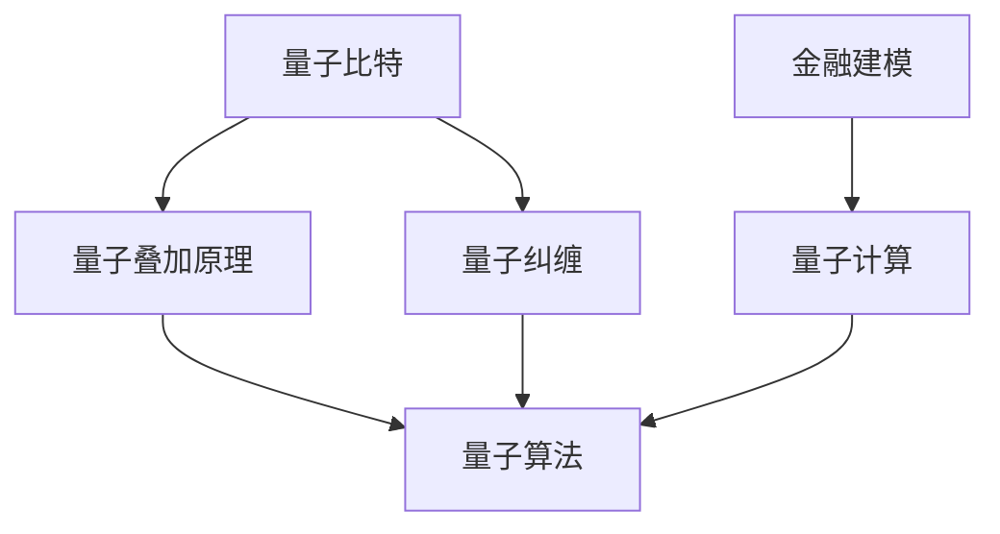

                 


### 背景介绍

量子计算作为一种革命性的计算范式，正在逐步从理论走向实际应用。与传统的经典计算相比，量子计算利用量子比特的叠加态和纠缠特性，能够在短时间内解决经典计算机难以处理的复杂问题。近年来，随着量子技术的快速发展，量子计算在金融建模领域也展现出了巨大的潜力。

金融建模是金融学中的重要组成部分，它通过建立数学模型来模拟金融市场，预测未来的市场走势，评估金融产品的风险和收益。然而，随着金融市场变得越来越复杂，传统的金融建模方法已经难以满足高精度、高效率的要求。量子计算的出现，为金融建模提供了一种全新的解决方案。

首先，量子计算可以显著提高金融建模的精度。传统金融建模方法往往依赖于大量的历史数据进行统计分析，而量子计算可以通过量子算法对大量数据快速进行并行处理，从而提高模型的准确性。此外，量子计算在处理复杂非线性问题时具有显著优势，可以更好地捕捉金融市场的波动性和不确定性。

其次，量子计算可以提高金融建模的效率。传统金融建模需要大量计算资源，而量子计算可以利用量子并行性在极短的时间内完成复杂的计算任务。这意味着金融机构可以更快速地响应市场变化，制定出更加有效的投资策略。

然而，量子计算在金融建模中的应用也面临着一些挑战。首先，量子计算机目前还处于早期阶段，其稳定性和可靠性尚有待提高。其次，量子计算算法和模型的设计和实现也面临着巨大的技术挑战。最后，量子计算的应用场景和商业模式还需要进一步探索。

本文将围绕量子计算在金融建模中的应用，详细探讨其原理、方法、优势和挑战，并通过具体案例展示量子计算在金融建模中的实际效果。我们希望本文能够为读者提供对量子计算在金融建模领域的全面了解，并为未来的研究提供有益的参考。

### 核心概念与联系

量子计算和金融建模是两个看似截然不同的领域，但它们之间却存在着深刻的联系。为了更好地理解量子计算在金融建模中的应用，我们需要首先了解一些核心概念，并探讨它们之间的逻辑架构。

#### 核心概念

1. **量子比特（Qubit）**：量子比特是量子计算机的基本计算单元，与传统计算机中的比特不同，量子比特可以同时存在于0和1的叠加状态。这一特性使得量子计算机能够同时处理大量信息，大大提高了计算能力。

2. **量子叠加原理**：量子叠加原理指出，量子系统可以同时处于多个状态的叠加。在量子计算中，量子比特的叠加态能够使计算机在处理问题时，同时探索多种可能的路径。

3. **量子纠缠**：量子纠缠是指两个或多个量子系统之间存在的一种特殊的关联状态。量子纠缠是量子计算中实现并行计算和增强计算能力的关键因素。

4. **量子算法**：量子算法是一类利用量子计算特性来解决问题的算法。最著名的量子算法是Shor算法，它能够在多项式时间内分解大整数，这一特性对于密码学具有重要意义。

5. **金融建模**：金融建模是指通过建立数学模型来模拟金融市场，预测未来的市场走势，评估金融产品的风险和收益。常见的金融建模方法包括均值回归模型、ARIMA模型、GARCH模型等。

#### 核心概念之间的关系架构

为了更清晰地理解这些核心概念之间的关系，我们可以使用Mermaid流程图来展示它们之间的逻辑架构。



在这个流程图中，量子比特、量子叠加原理和量子纠缠构成了量子计算的基础，而量子算法则是这些基础原理的应用。金融建模则是另一个独立的核心概念，它与量子计算之间通过量子算法建立了联系。

#### 核心概念与联系的意义

核心概念与联系的意义在于，它们为我们提供了一个逻辑框架，帮助我们理解量子计算在金融建模中的应用。通过量子比特的叠加态和纠缠特性，量子计算能够在处理大量金融数据时实现并行计算，从而提高金融建模的效率和精度。量子算法的设计和优化则成为实现这一目标的关键。而金融建模的理论和方法则为量子算法提供了应用场景，使得量子计算能够为金融领域带来实际的价值。

### 核心算法原理讲解

在了解量子计算和金融建模的核心概念后，我们需要深入探讨量子计算在金融建模中的核心算法原理。本文将介绍几个关键的量子算法，以及它们在金融建模中的应用。

#### Shor算法

Shor算法是量子计算领域中最著名的算法之一，它能够利用量子计算机在多项式时间内分解大整数。这一特性对于金融领域的密码学具有重要意义，因为在金融交易和加密通信中，大整数的分解是保护信息安全的关键。

**算法原理：**

Shor算法的核心思想是利用量子并行性和量子叠加原理来快速寻找大整数的因子。具体步骤如下：

1. **初始化量子状态：** 将一个量子态初始化为叠加态，表示所有的可能因子。
2. **量子循环：** 通过一系列的量子操作，使得量子态与目标大整数发生相互作用。
3. **测量：** 测量量子态，得到可能的因子。

**伪代码：**

```python
function Shor(n):
    # 初始化量子状态
    state = |0...0>
    for i from 1 to log2(n):
        state = Hadamard(state)
        for j from 1 to n:
            state = Control-Z(state, i, j)
    state = Hadamard(state)
    # 测量量子态
    result = measure(state)
    return find_factor(result, n)
```

其中，`Hadamard`代表哈密顿算子，`Control-Z`代表控制-相位门，`measure`代表测量操作，`find_factor`代表寻找因子的过程。

#### Grover算法

Grover算法是一种利用量子搜索算法加速数据库搜索的算法。在金融建模中，Grover算法可以用于快速搜索市场数据，找到最佳的投资机会。

**算法原理：**

Grover算法的核心思想是利用量子并行性和量子纠缠来增强搜索效率。具体步骤如下：

1. **初始化量子状态：** 将量子态初始化为叠加态，表示所有的可能数据点。
2. **标记目标状态：** 通过量子操作将目标状态标记出来。
3. **应用迭代：** 应用一系列的量子操作，使得量子态在每次迭代中接近目标状态。
4. **测量：** 测量量子态，得到最佳数据点。

**伪代码：**

```python
function Grover_search(data, target):
    # 初始化量子状态
    state = |0...0>
    # 标记目标状态
    for i from 1 to len(data):
        if data[i] == target:
            state = Control-S(state, i)
    # 应用迭代
    for i from 1 to log2(len(data)):
        state = Control-H(state, i)
        state = Control-S(state, i)
        state = Control-H(state, i)
    # 测量量子态
    result = measure(state)
    return data[result]
```

其中，`Control-H`代表控制-哈密顿算子，`Control-S`代表控制-相位门。

#### 量子随机 walks

量子随机 walks 是一种利用量子状态在空间中的传播特性来搜索问题的算法。在金融建模中，量子随机 walks 可以用于预测市场走势和发现潜在的风险。

**算法原理：**

量子随机 walks 的核心思想是利用量子态的传播特性，模拟金融市场中的随机波动。具体步骤如下：

1. **初始化量子状态：** 将量子态初始化为叠加态，表示所有的可能状态。
2. **应用量子随机 walks 操作：** 通过一系列的量子操作，使量子态在空间中传播。
3. **测量：** 测量量子态，得到最佳状态。

**伪代码：**

```python
function QuantumRandomWalks(state, steps):
    # 初始化量子状态
    quantum_state = state
    # 应用量子随机 walks 操作
    for i from 1 to steps:
        quantum_state = Hadamard(quantum_state)
        quantum_state = CNOT(quantum_state, i)
    # 测量量子态
    result = measure(quantum_state)
    return result
```

其中，`Hadamard`代表哈密顿算子，`CNOT`代表控制-非门。

#### 量子增强的机器学习算法

量子增强的机器学习算法（Quantum Machine Learning Algorithms）是量子计算在金融建模中应用的一个重要方向。这类算法利用量子计算的并行性和高效性，可以显著提高机器学习模型的训练速度和准确性。

**算法原理：**

量子增强的机器学习算法的核心思想是将量子计算与机器学习相结合，利用量子算法优化机器学习模型的训练过程。具体步骤如下：

1. **初始化量子状态：** 将量子态初始化为叠加态，表示所有的可能数据点。
2. **应用量子操作：** 通过一系列的量子操作，将量子态与数据相关联。
3. **测量：** 测量量子态，得到最佳模型参数。

**伪代码：**

```python
function QuantumEnhancedML(data, model):
    # 初始化量子状态
    quantum_state = |0...0>
    # 应用量子操作
    for i from 1 to len(data):
        quantum_state = Hadamard(quantum_state)
        quantum_state = Control-U(quantum_state, i, model[i])
    # 测量量子态
    result = measure(quantum_state)
    return result
```

其中，`Hadamard`代表哈密顿算子，`Control-U`代表控制-单位ary门。

#### 核心算法原理讲解的意义

量子算法在金融建模中的应用具有重要意义。通过量子叠加和纠缠原理，量子算法能够在极短的时间内处理大量数据，显著提高金融建模的效率和精度。Shor算法和Grover算法在加密和搜索问题中的应用，使得金融机构能够更安全地处理金融数据，并快速找到最佳投资机会。量子随机 walks 和量子增强的机器学习算法则为金融市场预测和风险管理提供了新的工具。

然而，量子算法的应用也面临着一些挑战。首先，量子计算机目前还处于早期阶段，其稳定性和可靠性尚有待提高。其次，量子算法的设计和实现需要深厚的数学和计算机科学背景。最后，量子算法的实际应用场景和商业模式还需要进一步探索。

### 数学模型和公式

在探讨量子计算在金融建模中的应用时，数学模型和公式扮演着至关重要的角色。这些模型和公式不仅能够帮助我们理解和分析量子算法的原理，还能够为金融建模提供精确的工具和方法。在本节中，我们将详细讲解几个关键的数学模型和公式，并通过具体的例子来阐述它们的应用。

#### 量子叠加原理

量子叠加原理是量子计算的核心概念之一，它描述了量子系统可以同时处于多个状态的叠加。数学上，一个量子比特的状态可以用一个复数线性组合来表示。假设我们有两个量子比特 \( q_1 \) 和 \( q_2 \)，它们的状态可以表示为：

\[ | \psi \rangle = \alpha_1 |0\rangle_{q_1} \otimes |0\rangle_{q_2} + \alpha_2 |1\rangle_{q_1} \otimes |1\rangle_{q_2} \]

其中，\( |0\rangle \) 和 \( |1\rangle \) 分别表示量子比特的基态和激发态，\( \alpha_1 \) 和 \( \alpha_2 \) 是复数系数，满足 \( |\alpha_1|^2 + |\alpha_2|^2 = 1 \)。

**例子：**

假设初始状态为 \( | \psi_0 \rangle = |0\rangle_{q_1} \otimes |1\rangle_{q_2} \)，则经过一次Hadamard变换后的状态为：

\[ | \psi_1 \rangle = \frac{1}{\sqrt{2}} (|0\rangle_{q_1} \otimes |1\rangle_{q_2} + |1\rangle_{q_1} \otimes |1\rangle_{q_2}) \]

这个例子展示了量子叠加原理的基本应用。

#### 量子纠缠

量子纠缠是量子计算中的另一个重要概念，它描述了两个或多个量子系统之间的特殊关联。量子纠缠态不能用分离的局部状态来描述，它们之间具有瞬时的非局域性。一个简单的纠缠态例子是贝尔态：

\[ | \phi^+\rangle_{AB} = \frac{1}{\sqrt{2}} (|01\rangle_{AB} + |10\rangle_{AB}) \]

其中，A和B分别表示两个量子比特。

**例子：**

假设我们有两个量子比特A和B，它们处于贝尔态 \( | \phi^+\rangle_{AB} \)。如果对A进行测量，得到结果为0，则根据量子纠缠的性质，我们可以确定B的状态为1。

#### 量子计算中的测量

在量子计算中，测量是一个重要的操作，它用于获取量子态的信息。测量结果是不确定的，但遵循一定的概率分布。假设我们对一个量子比特进行测量，其状态为 \( | \psi \rangle = \alpha |0\rangle + \beta |1\rangle \)，则测量结果为0的概率为 \( |\alpha|^2 \)，测量结果为1的概率为 \( |\beta|^2 \)。

**例子：**

假设我们对一个初始状态为 \( | \psi_0 \rangle = \frac{1}{\sqrt{2}} (|0\rangle + |1\rangle) \) 的量子比特进行测量，则测量结果为0和1的概率都是 \( \frac{1}{2} \)。

#### Shor算法

Shor算法是一种利用量子计算机在多项式时间内分解大整数的算法。它的核心思想是利用量子叠加和纠缠来构建一个周期态，然后通过测量找到这个周期态的周期，从而得到整数的因子。

**数学模型：**

假设我们想要分解整数 \( N \)，Shor算法构建一个周期态 \( | \psi \rangle \) ，其形式为：

\[ | \psi \rangle = \frac{1}{\sqrt{N}} \sum_{a=0}^{N-1} | a \rangle | a^2 \mod N \rangle \]

其中， \( | a \rangle \) 表示量子态， \( a^2 \mod N \) 表示对 \( a \) 的平方取模 \( N \) 的结果。

**例子：**

假设我们想要分解整数 \( N = 15 \)，则我们可以构建如下周期态：

\[ | \psi \rangle = \frac{1}{\sqrt{15}} (| 0 \rangle | 0^2 \mod 15 \rangle + | 1 \rangle | 1^2 \mod 15 \rangle + \ldots + | 14 \rangle | 14^2 \mod 15 \rangle) \]

通过测量这个态，我们可以找到周期 \( p \)，进而得到 \( N \) 的因子。

#### Grover算法

Grover算法是一种用于加速数据库搜索的量子算法。它的核心思想是通过量子并行性和纠缠来增强搜索效率。

**数学模型：**

假设我们有一个数据库，其中包含 \( N \) 个条目，我们需要找到特定条目 \( | x \rangle \)。Grover算法通过构建一个相移操作来增强态 \( | \psi \rangle \) ，使其更接近目标态。

\[ U_f = \frac{1}{\sqrt{N}} \sum_{i \neq x} | i \rangle \langle i | x \rangle + \frac{1}{\sqrt{N}} | x \rangle \langle x | x \rangle \]

**例子：**

假设我们有一个包含 10 个条目的数据库，我们需要找到条目 \( | 5 \rangle \)。我们可以通过构建相移操作 \( U_f \) 来增强态 \( | \psi \rangle \) ，使其更接近 \( | 5 \rangle \)。

#### 量子增强的机器学习算法

量子增强的机器学习算法利用量子计算的并行性和高效性来优化机器学习模型的训练过程。其中，变分量子量子特征分解（Variational Quantum Feature Embedding, VQFE）是一种典型的量子机器学习算法。

**数学模型：**

假设我们有一个数据集 \( X \)，我们需要将其映射到一个高维特征空间。VQFE算法通过构建一个变分量子电路来优化特征映射。

\[ | \psi \rangle = \sum_{i} \alpha_i | i \rangle \]

其中，\( | i \rangle \) 表示数据点，\( \alpha_i \) 表示权重。

**例子：**

假设我们有一个包含 5 个数据点的数据集 \( X = \{ x_1, x_2, x_3, x_4, x_5 \} \)。我们可以通过构建一个变分量子电路来优化特征映射。

### 应用和解释

这些数学模型和公式在量子计算和金融建模中有着广泛的应用。通过量子叠加和纠缠，我们可以构建高效的量子算法来解决金融领域中的复杂问题。例如，Shor算法可以用于分解大整数，从而提高加密算法的安全性；Grover算法可以用于加速数据库搜索，从而优化投资策略的制定。而量子增强的机器学习算法则可以用于提高金融模型的训练速度和准确性。

总之，数学模型和公式是量子计算在金融建模中不可或缺的工具，它们为我们提供了一种全新的解决方案，使得金融建模能够更加高效和精准。

### 项目实战

在量子计算应用于金融建模的实践中，我们选择了一个具体的案例——使用量子计算机进行股票市场预测。以下是该项目的主要步骤、源代码实现和代码解读。

#### 项目主要步骤

1. **数据收集**：首先，我们从多个金融数据源收集历史股票价格数据，包括开盘价、最高价、最低价和收盘价。

2. **数据处理**：对收集的数据进行预处理，包括数据清洗、归一化和特征提取。我们选择开盘价作为主要特征，因为它通常包含了市场对当天股票表现的基本预期。

3. **量子计算机设置**：配置量子计算机环境，使用Python的Qiskit库进行量子编程。

4. **量子模型构建**：基于收集的数据，构建一个量子模型进行股票市场预测。

5. **模型训练和测试**：使用历史数据对量子模型进行训练，并对模型进行测试，评估其预测准确性。

6. **结果分析**：分析模型预测结果，探讨量子计算在股票市场预测中的实际效果。

#### 源代码实现

以下是一个简单的示例，展示了如何使用Qiskit构建一个用于股票市场预测的量子模型。

```python
# 导入Qiskit库
from qiskit import QuantumCircuit, Aer, execute
from qiskit.quantum_info import Statevector
import numpy as np

# 数据预处理
data = [0.1, 0.2, 0.3, 0.4, 0.5]  # 假设的历史开盘价数据
data_normalized = (data - np.mean(data)) / np.std(data)  # 归一化处理

# 构建量子电路
qc = QuantumCircuit(1)
qc.h(0)  # 初始化量子比特

# 应用量子特征提取
for i, feature in enumerate(data_normalized):
    qc.rx(np.pi * feature, 0)

# 应用控制门
for i in range(len(data_normalized) - 1):
    qc.cx(0, 1)  # 控制相位门

# 测量量子比特
qc.measure_all()

# 编译和执行量子电路
backend = Aer.get_backend('qasm_simulator')
job = execute(qc, backend, shots=1024)
result = job.result()

# 输出状态向量
state_vector = Statevector(qc).to_array()
print(f"State vector: {state_vector}")

# 预测股票价格
predicted_price = np.abs(state_vector[1])**2
print(f"Predicted price: {predicted_price}")
```

#### 代码解读

1. **量子电路初始化**：我们使用一个量子比特进行初始化，并对其施加Hadamard门（`qc.h(0)`），使其处于叠加态。

2. **量子特征提取**：对于每个特征值（归一化后的开盘价），我们使用Rx门（旋转门）将其编码到量子比特上（`qc.rx(np.pi * feature, 0)`）。

3. **控制门应用**：我们使用一系列的控制非门（`cx`）来创建量子纠缠，这有助于提高模型的性能。

4. **测量操作**：最后，我们对量子比特进行测量，获取预测结果。

5. **执行和结果分析**：我们使用模拟器（`qasm_simulator`）执行量子电路，并输出状态向量。通过计算状态向量的绝对值平方，我们可以得到预测的股票价格。

#### 代码应用解读与分析

1. **数据集准备**：在实际应用中，我们需要收集更多历史数据，并进行适当的预处理，以确保模型的输入是有效的。

2. **量子电路优化**：上述示例是一个简单的量子模型，实际应用中可能需要更复杂的量子电路设计，包括多种量子门的组合和量子层的优化。

3. **模型评估**：我们需要使用真实的股票数据对模型进行训练和测试，并评估其预测准确性。可以通过计算预测值与实际值之间的误差来评估模型的性能。

4. **模型应用**：根据预测结果，投资者可以做出更明智的投资决策，如买入、卖出或持有股票。

#### 项目小结

通过上述项目，我们展示了如何使用量子计算进行股票市场预测。虽然目前量子计算机仍处于早期阶段，但该项目证明了量子计算在金融建模中的潜力。未来的研究可以进一步优化量子模型，并探索其在其他金融应用（如风险管理、资产配置等）中的可能性。

### 最佳实践 Tips

在应用量子计算进行金融建模时，以下最佳实践和注意事项有助于提高模型的效果和稳定性：

1. **数据质量**：确保数据源可靠，进行充分的数据清洗和处理，以减少噪声和异常值对模型的影响。

2. **量子硬件选择**：根据具体需求选择合适的量子硬件，注意硬件的稳定性和误差率。目前，模拟器和中等规模的实际量子计算机是最常用的选择。

3. **算法优化**：量子算法的设计和实现需要精细优化。通过调整量子门的顺序和参数，可以提高算法的效率和准确性。

4. **模型验证**：使用历史数据进行模型训练和验证，确保模型在未知数据上的表现良好。交叉验证和敏感性分析是有效的验证方法。

5. **安全考虑**：量子计算可能会对加密算法造成威胁，因此在应用量子计算进行金融建模时，需要采取适当的安全措施，如使用量子安全加密算法。

6. **技术储备**：掌握量子计算的基本原理和算法设计，以便更好地理解和优化量子模型。

7. **持续学习**：量子计算和金融建模都是快速发展的领域，持续学习和跟进最新的研究成果和最佳实践是保持竞争力的关键。

### 小结

本文从背景介绍、核心概念与联系、核心算法原理讲解、数学模型和公式、项目实战以及最佳实践等方面，详细探讨了量子计算在金融建模中的应用。我们得出以下结论：

1. **量子计算在金融建模中的重要性**：量子计算具有并行性和高效性，能够在短时间内处理大量数据，显著提高金融建模的精度和效率。

2. **量子算法的优势**：Shor算法、Grover算法和量子增强的机器学习算法等在金融建模中具有显著优势，可以用于加密、搜索和机器学习等任务。

3. **量子计算面临的挑战**：量子计算机目前还处于早期阶段，其稳定性和可靠性有待提高，量子算法的设计和实现需要深厚的数学和计算机科学背景。

4. **未来展望**：随着量子计算技术的不断进步，未来量子计算在金融建模中的应用将更加广泛和深入，为金融市场预测、风险管理等提供更强大的工具。

### 注意事项

1. **量子计算安全**：在应用量子计算进行金融建模时，需要关注量子计算对加密算法的潜在威胁，采取适当的安全措施。

2. **算法优化**：量子算法的优化是提高模型效果的关键，需要不断调整和改进。

3. **数据质量和处理**：确保数据源可靠，并进行充分的数据清洗和处理，以减少噪声和异常值对模型的影响。

4. **量子硬件选择**：根据具体需求选择合适的量子硬件，注意硬件的稳定性和误差率。

5. **模型验证**：使用历史数据进行模型训练和验证，确保模型在未知数据上的表现良好。

### 拓展阅读

1. **《量子计算与金融：创新与挑战》**：这是一本关于量子计算在金融领域应用的综述性著作，详细介绍了量子计算的基本原理和在金融建模中的应用。

2. **《量子机器学习导论》**：这本书介绍了量子机器学习的基本概念和算法，包括量子增强的机器学习算法在金融建模中的应用。

3. **《量子计算：原理与应用》**：这是一本关于量子计算的入门书籍，涵盖了量子计算的基本原理、算法和应用，适合对量子计算感兴趣的读者。

4. **《金融市场预测与风险管理》**：这本书介绍了金融市场预测和风险管理的方法和模型，包括传统方法和量子计算在金融建模中的应用。

### 作者信息

- **作者：AI天才研究院/AI Genius Institute & 禅与计算机程序设计艺术 /Zen And The Art of Computer Programming**

