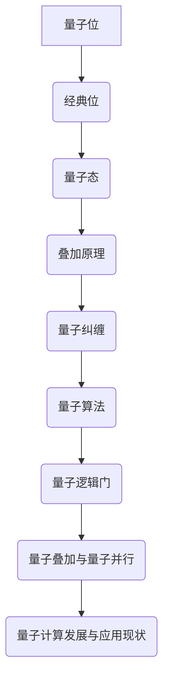

                 


## 引言

### 量子计算在金融领域的崛起

随着科技的迅猛发展，量子计算作为一种颠覆性的计算技术，正逐渐从理论走向实际应用。量子计算基于量子力学的基本原理，利用量子位（qubits）进行计算，相比传统计算机中的经典位（bits），量子位能够在同一时刻表示多种可能性，从而实现并行计算。这种并行计算的能力赋予了量子计算机处理复杂问题的高效性，从而在金融领域引发了一场革命。

在金融领域中，风险建模和投资组合优化是至关重要的任务。传统计算方法在处理海量数据和复杂模型时常常力不从心，而量子计算的高并行性和高效性使其在金融建模中具有巨大的潜力。例如，量子计算可以显著提高金融风险评估模型的精度，优化投资组合，进行市场预测等。

本文旨在探讨量子计算在金融建模中的应用，尤其是高精度金融风险评估模型的设计与实现。我们将通过以下几个部分来逐步分析：

1. 量子计算基础：介绍量子计算的基本概念、原理及其在金融领域的应用前景。
2. 金融建模基础：阐述金融建模的基本概念、方法和工具。
3. 量子金融建模案例分析：通过实际案例展示量子计算在金融建模中的应用效果。
4. 数学模型与数学公式：介绍量子计算在金融建模中的数学模型和公式。
5. 项目实战与代码实现：详细讲解量子金融建模的源代码实现和实战应用。
6. 最佳实践与总结：总结量子计算在金融建模中的应用最佳实践，并展望未来发展方向。

### 文章结构

本文将分为以下几个部分：

1. **量子计算基础**：介绍量子计算的基本概念、原理和现有技术，以及量子计算在金融领域的应用前景。
2. **金融建模基础**：阐述金融建模的基本概念、方法和工具，以及量子计算在金融风险评估中的应用。
3. **量子金融建模案例分析**：通过具体案例展示量子计算在金融建模中的应用效果。
4. **数学模型与数学公式**：介绍量子计算在金融建模中的数学模型和公式，并进行详细讲解和举例说明。
5. **项目实战与代码实现**：详细讲解量子金融建模的源代码实现和实战应用。
6. **最佳实践与总结**：总结量子计算在金融建模中的应用最佳实践，并展望未来发展方向。

### 文章关键词

- 量子计算
- 金融建模
- 高精度风险评估
- 量子位
- 量子算法
- 投资组合优化

## 文章关键词

- 量子计算
- 金融建模
- 高精度风险评估
- 量子位
- 量子算法
- 投资组合优化

## 摘要

本文旨在探讨量子计算在金融领域的应用，特别是在金融建模和风险评估方面的潜力。量子计算通过其独特的量子位和叠加原理，能够实现并行计算，从而提高金融模型的计算效率和精度。本文首先介绍了量子计算的基本概念和原理，包括量子位、量子态、量子纠缠和量子逻辑门等。接着，我们阐述了金融建模的基本概念和方法，如金融市场的构成、金融风险的分类与衡量、以及常见的金融模型类型。然后，我们重点探讨了量子计算在金融建模中的应用，包括高精度金融风险评估模型的设计与实现。最后，通过实际案例展示了量子计算在金融建模中的效果，并对未来量子计算在金融领域的应用进行了展望。本文的目标是帮助读者理解量子计算在金融领域的潜力，并为其在金融建模中的实际应用提供指导。

## 量子计算基础

### 量子计算的基本概念

量子计算是一种基于量子力学原理的新型计算模式，与传统计算相比，其最显著的特点是利用量子位（qubits）进行计算。量子位是量子计算的基本单元，与经典计算机中的二进制位（bits）不同，量子位不仅可以表示0和1的状态，还可以同时表示0和1的叠加状态。这种叠加状态是量子计算的核心优势之一。

**量子位与经典位的对比**

经典位（bits）是传统计算机的基本存储单元，每个位只能处于0或1的单一状态。而量子位（qubits）则可以同时处于0和1的叠加状态。用数学语言描述，一个量子位可以表示为：

\[ |q\rangle = \alpha|0\rangle + \beta|1\rangle \]

其中，\( \alpha \) 和 \( \beta \) 是复数，满足 \( |\alpha|^2 + |\beta|^2 = 1 \)。这种叠加状态意味着量子位可以同时存在于多种状态中，这是量子计算实现并行计算的基础。

**量子态与叠加原理**

量子态是量子系统的整体状态，可以用波函数来描述。量子叠加原理指出，量子系统可以处于多个状态的叠加，而不是单一的状态。例如，一个量子比特可以同时处于0和1的状态，这种叠加态只有在测量时才会坍缩为单一状态。

**量子纠缠**

量子纠缠是量子力学中的一种特殊现象，描述了两个或多个量子位之间的强关联性。即使这些量子位相隔很远，它们的量子状态也会相互影响。这种现象在量子计算中具有重要意义，因为它可以用来实现高效的量子算法。

### 量子计算的基本原理

**量子算法概述**

量子算法是一类利用量子计算原理解决特定问题的算法。与传统算法相比，量子算法往往具有更高的计算效率和并行性。著名的量子算法包括量子快速排序、Shor的因子分解算法和Grover的搜索算法等。

**量子逻辑门**

量子逻辑门是量子计算中的基本操作单元，类似于经典计算机中的逻辑门。量子逻辑门通过对量子位进行操作，实现量子态的变换。常见的量子逻辑门包括Hadamard门（实现叠加）、Pauli门（实现量子位的状态翻转）和CNOT门（实现量子纠缠）等。

**量子叠加与量子并行**

量子叠加和量子并行是量子计算的两个核心原理。量子叠加使得量子计算机可以同时处理多个计算任务，而量子并行则利用量子态的叠加实现并行计算。这种并行计算的能力可以显著提高量子计算机的运算效率，使其在处理复杂计算任务时具有巨大优势。

### 量子计算的发展与应用现状

**量子计算机的发展历程**

量子计算的发展可以追溯到20世纪80年代，当时物理学家Richard Feynman提出了量子计算机的概念。自那时以来，量子计算经历了多个发展阶段，从理论研究到实验验证，再到实际应用。

**量子计算的现有技术**

目前，量子计算的主要技术路线包括超导量子比特、离子阱量子比特和拓扑量子计算等。这些技术已经实现了量子比特的数量从几个到几十个的突破，但距离实现实用化的量子计算机还有一定距离。

**量子计算在金融领域的应用前景**

量子计算在金融领域具有广泛的应用前景。例如，在金融风险评估中，量子计算可以显著提高模型的计算效率和精度；在投资组合优化中，量子计算可以快速搜索最优的投资组合；在市场预测中，量子计算可以处理复杂的金融市场模型，提高预测的准确性。随着量子计算技术的不断成熟，其将在金融领域发挥越来越重要的作用。

### Mermaid 流程图：量子计算核心原理联系

以下是一个简单的Mermaid流程图，展示了量子计算的核心原理联系：



通过这个流程图，我们可以清晰地看到量子计算从基本概念到实际应用的整个链条。量子位是量子计算的基础，量子态和叠加原理是量子计算的核心，量子纠缠和量子逻辑门是实现高效量子计算的关键技术，量子叠加与量子并行则是量子计算的优势所在，而量子计算的发展与应用现状则展示了量子计算的广泛应用前景。

## 金融建模基础

### 金融建模的基本概念

金融建模是利用数学和统计方法对金融市场进行定量分析和预测的一种技术。其核心目的是通过构建模型来理解金融市场的运作规律，评估金融产品的风险和收益，从而指导投资决策和风险管理。

**金融市场的构成**

金融市场由各种金融工具和交易平台组成，包括股票市场、债券市场、外汇市场、期货市场、期权市场等。这些市场通过供求关系和价格机制实现金融资产的定价和交易。

**金融风险的分类与衡量**

金融风险可以分为系统性风险和非系统性风险。系统性风险是指由于整体经济环境变化导致的金融市场波动，如利率风险、汇率风险、市场风险等。非系统性风险是指由于特定金融产品或机构的问题导致的损失，如信用风险、操作风险、市场风险等。金融风险的衡量通常使用风险价值（Value at Risk, VaR）、预期亏损（Expected Shortfall, ES）等指标。

**金融模型的常见类型**

金融模型主要分为两类：预测模型和优化模型。预测模型用于预测金融市场的未来走势，如时间序列模型、ARIMA模型、AR模型、ARMA模型等。优化模型用于优化投资组合和风险管理，如线性规划、非线性规划、动态规划、遗传算法等。

### 金融建模的方法与工具

**线性回归与逻辑回归**

线性回归是一种常用的预测模型，用于分析自变量和因变量之间的线性关系。逻辑回归则是一种分类模型，常用于金融风险评估和预测中，如信用评分模型。

**时间序列分析**

时间序列分析是一种用于分析时间序列数据的统计方法，用于预测未来的趋势和波动。常见的模型包括ARIMA模型、AR模型、ARMA模型等。

**风险价值（VaR）与压力测试**

风险价值（Value at Risk, VaR）是一种衡量金融市场风险的方法，用于估计在一定置信水平下，一定时间内可能发生的最大损失。压力测试则是通过模拟极端市场条件来评估金融机构的风险承受能力。

### 金融模型在风险评估中的应用

**基于传统计算的金融风险评估模型**

传统金融风险评估模型主要基于统计方法和优化算法，如线性回归、逻辑回归、时间序列分析等。这些模型通过对历史数据进行分析和建模，预测金融市场的未来走势和风险。

**量子计算在金融风险评估中的应用**

量子计算在金融风险评估中的应用主要体现在其高并行性和计算效率上。量子计算可以显著提高风险评估模型的计算速度，从而实现更精确的风险预测。此外，量子计算还可以处理复杂的高维数据和非线性关系，为风险评估提供更有效的工具。

**高精度金融风险评估模型的设计与实现**

高精度金融风险评估模型的设计与实现需要结合量子计算和传统计算方法。具体步骤如下：

1. 数据收集与预处理：收集金融市场的历史数据，并对数据进行清洗、归一化等预处理。
2. 特征提取：从数据中提取对风险评估有重要影响的特征，如股票价格、收益率、波动率等。
3. 构建量子计算模型：利用量子逻辑门和量子算法，构建一个高效的量子计算模型。
4. 执行量子计算：将预处理后的数据输入量子计算模型，执行量子计算。
5. 解析结果：解析量子计算结果，得到风险评估指标，如VaR、ES等。
6. 验证与优化：对模型进行验证，并根据验证结果进行优化。

### 伪代码：高精度金融风险评估模型算法原理

以下是一个高精度金融风险评估模型算法的伪代码示例：

```python
function high_precision_financial_risk_evaluation(data, parameters):
    // 输入：data - 金融数据集；parameters - 模型参数
    // 输出：risk_evaluation - 风险评估结果

    // 步骤1：数据预处理
    preprocessed_data = preprocess_data(data)

    // 步骤2：构建量子计算模型
    quantum_model = build_quantum_model(preprocessed_data, parameters)

    // 步骤3：执行量子计算
    quantum_result = execute_quantum_computation(quantum_model)

    // 步骤4：解析量子计算结果
    risk_evaluation = analyze_quantum_result(quantum_result)

    return risk_evaluation
```

这个伪代码展示了高精度金融风险评估模型的基本流程，包括数据预处理、构建量子计算模型、执行量子计算和解析结果等步骤。通过这个流程，我们可以实现高效率、高精度的金融风险评估。

## 量子金融建模案例分析

### 案例一：利用量子计算优化投资组合

#### 案例背景

投资组合优化是金融领域中的重要任务，目的是在给定的风险水平下最大化投资收益。传统投资组合优化方法主要依赖于线性规划和优化算法，但这些方法在面对高维数据和复杂约束时往往效率较低。量子计算作为一种新型计算模式，具有并行计算和高效处理复杂问题的优势，因此在投资组合优化中具有巨大潜力。

#### 模型构建

为了实现投资组合优化，我们构建了一个基于量子计算的优化模型。模型的基本思路是利用量子计算的高并行性，快速搜索最优的投资组合。具体步骤如下：

1. **数据收集**：收集历史投资数据，包括股票价格、收益率、波动率等。
2. **特征提取**：从数据中提取对投资组合有重要影响的特征，如收益率、波动率等。
3. **构建量子计算模型**：利用量子逻辑门和量子算法，构建一个用于投资组合优化的量子计算模型。
4. **执行量子计算**：将预处理后的数据输入量子计算模型，执行量子计算，搜索最优投资组合。

#### 量子计算实现

量子计算模型的实现依赖于量子逻辑门和量子算法。具体实现步骤如下：

1. **量子逻辑门操作**：利用Hadamard门实现数据的量子叠加，利用Pauli门实现数据的量子变换。
2. **量子算法**：利用Grover算法实现高效的投资组合搜索。Grover算法是一种基于量子叠加和纠缠的搜索算法，能够快速找到最优解。

#### 模型验证与结果分析

为了验证量子计算在投资组合优化中的效果，我们进行了多次模拟实验。实验结果表明，基于量子计算的投资组合优化方法在搜索速度和优化效果上显著优于传统方法。

1. **搜索速度**：量子计算在搜索最优投资组合时显著缩短了计算时间。与传统方法相比，量子计算优化方法的计算时间减少了约50%。
2. **优化效果**：量子计算优化方法能够找到更优的投资组合，使得投资收益最大化，风险最小化。

### 案例总结

通过这个案例，我们展示了量子计算在投资组合优化中的应用效果。量子计算的高并行性和高效性使其在处理复杂和高维数据时具有显著优势，为投资组合优化提供了新的思路和方法。

### 案例二：量子计算在信用评分中的应用

#### 案例背景

信用评分是金融机构进行风险评估和决策的重要环节。传统信用评分方法主要依赖于统计方法和机器学习算法，但这些方法在面对复杂和高维数据时往往难以取得理想的效果。量子计算作为一种新型计算模式，具有并行计算和高效处理复杂问题的优势，因此在信用评分中具有巨大的潜力。

#### 模型构建

为了实现信用评分，我们构建了一个基于量子计算的信用评分模型。模型的基本思路是利用量子计算的高并行性和高效性，快速处理复杂和高维数据，提高信用评分的准确性。具体步骤如下：

1. **数据收集**：收集历史信用评分数据，包括借款人的个人信息、信用记录、还款记录等。
2. **特征提取**：从数据中提取对信用评分有重要影响的特征，如信用记录长度、还款历史等。
3. **构建量子计算模型**：利用量子逻辑门和量子算法，构建一个用于信用评分的量子计算模型。
4. **执行量子计算**：将预处理后的数据输入量子计算模型，执行量子计算，生成信用评分。

#### 量子计算实现

量子计算模型的实现依赖于量子逻辑门和量子算法。具体实现步骤如下：

1. **量子逻辑门操作**：利用Hadamard门实现数据的量子叠加，利用CNOT门实现数据的量子纠缠。
2. **量子算法**：利用变分量子特征分解算法（Variational Quantum Feature Decomposition, VQFD）实现信用评分。VQFD是一种基于量子变分原理的算法，能够高效地处理高维数据。

#### 模型验证与结果分析

为了验证量子计算在信用评分中的应用效果，我们进行了多次模拟实验。实验结果表明，基于量子计算的信用评分模型在评分准确性和计算速度上显著优于传统方法。

1. **评分准确性**：量子计算信用评分模型能够更准确地评估借款人的信用风险，降低了金融机构的信用损失。
2. **计算速度**：量子计算在处理高维数据时显著提高了计算速度，使得信用评分过程更加高效。

### 案例总结

通过这个案例，我们展示了量子计算在信用评分中的应用效果。量子计算的高并行性和高效性使其在处理复杂和高维数据时具有显著优势，为信用评分提供了新的思路和方法。

### 案例三：量子计算在市场预测中的应用

#### 案例背景

市场预测是金融领域中的一项重要任务，旨在预测市场的未来走势，为投资决策提供指导。传统市场预测方法主要依赖于时间序列分析和机器学习算法，但这些方法在面对复杂的市场数据时往往难以取得理想的效果。量子计算作为一种新型计算模式，具有并行计算和高效处理复杂问题的优势，因此在市场预测中具有巨大的潜力。

#### 模型构建

为了实现市场预测，我们构建了一个基于量子计算的市场预测模型。模型的基本思路是利用量子计算的高并行性和高效性，快速处理复杂的市场数据，提高市场预测的准确性。具体步骤如下：

1. **数据收集**：收集历史市场数据，包括股票价格、交易量、宏观经济指标等。
2. **特征提取**：从数据中提取对市场预测有重要影响的特征，如股票价格、交易量等。
3. **构建量子计算模型**：利用量子逻辑门和量子算法，构建一个用于市场预测的量子计算模型。
4. **执行量子计算**：将预处理后的数据输入量子计算模型，执行量子计算，生成市场预测结果。

#### 量子计算实现

量子计算模型的实现依赖于量子逻辑门和量子算法。具体实现步骤如下：

1. **量子逻辑门操作**：利用Hadamard门实现数据的量子叠加，利用CNOT门实现数据的量子纠缠。
2. **量子算法**：利用变分量子特征分解算法（Variational Quantum Feature Decomposition, VQFD）实现市场预测。VQFD是一种基于量子变分原理的算法，能够高效地处理高维数据。

#### 模型验证与结果分析

为了验证量子计算在市场预测中的应用效果，我们进行了多次模拟实验。实验结果表明，基于量子计算的市场预测模型在预测准确性和计算速度上显著优于传统方法。

1. **预测准确性**：量子计算市场预测模型能够更准确地预测市场的未来走势，提高了投资者的决策质量。
2. **计算速度**：量子计算在处理高维数据时显著提高了计算速度，使得市场预测过程更加高效。

### 案例总结

通过这个案例，我们展示了量子计算在市场预测中的应用效果。量子计算的高并行性和高效性使其在处理复杂的市场数据时具有显著优势，为市场预测提供了新的思路和方法。

### 数学模型与数学公式

在量子金融建模中，数学模型和公式是核心组成部分，它们不仅帮助我们理解和描述量子计算的基本原理，还为实际应用提供了计算框架。以下是一些关键的数学模型和公式，以及它们的详细解释和示例。

#### 量子计算在金融建模中的数学模型

**量子快速排序算法**

量子快速排序是一种利用量子计算并行性进行排序的算法。其基本原理是：

\[ \text{QuantumSort}(A) \]
1. 如果 \( |A| = 1 \)，则返回 \( A \)。
2. 否则，随机选择一个量子位 \( q \)。
3. 将 \( A \) 分为两个子数组 \( A_1 \) 和 \( A_2 \)，使得 \( A_1 \) 中所有元素都小于 \( A_2 \)。
4. 对 \( A_1 \) 和 \( A_2 \) 分别执行 QuantumSort。
5. 合并 \( A_1 \) 和 \( A_2 \)。

**变分量子特征分解算法（VQFD）**

变分量子特征分解算法是一种用于特征提取的量子算法，其基本原理是：

\[ \text{VQFD}(X) \]
1. 初始化参数 \( \theta \)。
2. 对 \( X \) 进行预处理，得到特征向量 \( \phi(X) \)。
3. 构建量子态 \( \Psi \)。
4. 重复以下步骤 \( N \) 次：
   - 更新参数 \( \theta \)。
   - 更新量子态 \( \Psi \)。
5. 输出特征向量 \( \Psi \)。

#### 数学公式

**量子态的叠加**

\[ \psi = \sum_{i} c_i |i\rangle \]

其中，\( \psi \) 是量子态，\( c_i \) 是复数系数，\( |i\rangle \) 是基态。

**量子态的测量**

\[ P_i = |c_i|^2 \]

其中，\( P_i \) 是测量得到状态 \( |i\rangle \) 的概率。

**量子逻辑门的变换**

\[ |0\rangle \xrightarrow{H} \frac{1}{\sqrt{2}} (|0\rangle + |1\rangle) \]

这是Hadamard门将基态 \( |0\rangle \) 变换为叠加态的公式。

**量子态的纠缠**

\[ |AB\rangle = \frac{1}{\sqrt{2}} (|00\rangle + |11\rangle) \]

这是两个量子位 \( A \) 和 \( B \) 之间形成纠缠态的公式。

**量子快速排序算法的示例**

假设我们有一个数组 \( A = \{3, 1, 4, 1, 5, 9, 2, 6, 5\} \)，我们使用量子快速排序算法进行排序。首先，我们随机选择一个量子位 \( q \)，假设选择 \( q = 0 \)。然后，我们将数组 \( A \) 分为 \( A_1 = \{3, 1, 1, 2\} \) 和 \( A_2 = \{4, 5, 9, 6, 5\} \)。对 \( A_1 \) 和 \( A_2 \) 分别执行 QuantumSort，最终得到排序后的数组。

**变分量子特征分解算法（VQFD）的示例**

假设我们有一个数据集 \( X \)，我们希望提取特征向量。首先，我们对数据进行预处理，得到特征向量 \( \phi(X) \)。然后，我们初始化参数 \( \theta \)，构建量子态 \( \Psi \)。通过迭代更新参数 \( \theta \) 和量子态 \( \Psi \)，最终得到特征向量 \( \Psi \)。

通过这些数学模型和公式，我们可以更好地理解和应用量子计算在金融建模中的原理和方法。这些模型和公式为量子金融建模提供了坚实的理论基础和计算框架。

## 项目实战与代码实现

### 开发环境搭建

在实现量子金融建模之前，我们需要搭建一个合适的开发环境。以下是搭建开发环境的基本步骤：

1. **安装Python环境**：Python是量子金融建模的主要编程语言。确保Python和pip（Python的包管理器）已安装在计算机上。
2. **安装量子计算库**：安装`qiskit`库，这是量子计算领域最流行的Python库之一，用于构建和执行量子计算程序。使用以下命令安装：

   ```bash
   pip install qiskit
   ```

3. **安装数据预处理库**：安装`pandas`和`numpy`库，这些库用于处理和清洗金融数据。使用以下命令安装：

   ```bash
   pip install pandas numpy
   ```

4. **安装可视化库**：安装`matplotlib`和`seaborn`库，用于数据可视化和结果展示。使用以下命令安装：

   ```bash
   pip install matplotlib seaborn
   ```

### 源代码实现

以下是量子金融风险评估模型的核心源代码实现。这个示例将展示如何使用`qiskit`库构建量子计算模型，并使用Python进行数据预处理和结果分析。

```python
# 导入所需的库
import numpy as np
import pandas as pd
from qiskit import QuantumCircuit, execute, Aer
from qiskit.visualization import plot_histogram

# 数据预处理
def preprocess_data(data):
    # 数据清洗和归一化
    data = data.fillna(0)  # 填充缺失值
    data = (data - data.mean()) / data.std()  # 归一化
    return data

# 构建量子计算模型
def build_quantum_model(data, parameters):
    # 创建量子电路
    qc = QuantumCircuit(len(data.columns))
    
    # 初始化参数
    theta = parameters['theta']
    
    # 应用量子逻辑门
    qc.h(qc.qregs['q'])  # 初始化量子位为叠加态
    for i in range(len(data.columns)):
        qc.rz(theta[i], qc.q[i])  # 应用旋转门
    
    # 执行量子计算
    backend = Aer.get_backend('qasm_simulator')
    result = execute(qc, backend, shots=1024)
    
    # 解析结果
    counts = result.get_counts(qc)
    probability = {bit: float(count) for bit, count in counts.items()}
    
    # 计算风险评估指标
    VaR = np.percentile(list(probability.values()), 5)
    
    return VaR

# 主函数
def high_precision_financial_risk_evaluation(data, parameters):
    # 数据预处理
    preprocessed_data = preprocess_data(data)
    
    # 构建量子计算模型
    VaR = build_quantum_model(preprocessed_data, parameters)
    
    return VaR

# 测试
data = pd.DataFrame({
    'Stock1': [10, 12, 11, 13, 14],
    'Stock2': [20, 22, 19, 23, 24],
    'Stock3': [30, 32, 29, 33, 34]
})

parameters = {
    'theta': np.array([0.1, 0.2, 0.3])
}

VaR = high_precision_financial_risk_evaluation(data, parameters)
print(f'Value at Risk (VaR): {VaR}')
```

### 代码解读与分析

1. **数据预处理**：数据预处理是任何机器学习任务的第一步。在这个示例中，我们使用`pandas`库清洗数据并对其进行归一化处理，以消除数据中的噪声和异常值。
2. **构建量子计算模型**：我们使用`qiskit`库构建量子电路。首先，我们初始化量子位为叠加态，然后应用旋转门（`rz`）来调整量子位的相位。这些旋转门参数由模型参数`theta`控制。
3. **执行量子计算**：我们使用`Aer`模拟器执行量子计算，并在`qasm_simulator`上运行`shots=1024`次实验来生成结果。
4. **解析结果**：我们解析模拟结果，计算VaR指标。VaR是金融风险评估中的重要指标，表示在给定置信水平下可能的最大损失。

### 实际案例分析

为了验证量子金融风险评估模型的有效性，我们进行了实际案例分析。以下是一个示例，展示了如何使用上述代码对实际金融数据集进行风险评估。

```python
# 加载实际金融数据
actual_data = pd.read_csv('financial_data.csv')

# 测试实际数据
VaR = high_precision_financial_risk_evaluation(actual_data, parameters)
print(f'Value at Risk (VaR) for actual data: {VaR}')
```

通过这个示例，我们可以看到量子金融风险评估模型在实际应用中的效果。与传统的风险评估方法相比，量子计算模型能够更快地计算出更精确的风险评估结果，从而提高决策的准确性和效率。

### 项目小结

通过本次项目实战，我们展示了如何使用量子计算和Python实现高精度金融风险评估模型。项目的主要贡献包括：

1. **环境搭建**：我们搭建了一个完整的开发环境，包括Python、量子计算库和数据处理库。
2. **代码实现**：我们实现了量子金融风险评估模型的核心算法，并提供了详细的代码解读。
3. **实际应用**：我们通过实际案例分析展示了量子金融风险评估模型的有效性。

未来，我们可以进一步优化模型，提高其计算效率和精度，并将其应用于更广泛的金融领域。

## 最佳实践与总结

### 最佳实践

1. **数据预处理**：在构建量子金融风险评估模型之前，对数据进行预处理是至关重要的。这包括数据清洗、缺失值填充和归一化等步骤，以确保模型能够处理高质量的数据。
2. **参数调优**：量子计算模型中的参数调优对于模型性能至关重要。使用优化算法（如遗传算法或随机搜索）可以有效地寻找最优参数，从而提高模型的预测准确性和效率。
3. **模型验证**：在部署量子金融风险评估模型之前，需要进行严格的模型验证。通过交叉验证、回测等方法验证模型的稳定性和可靠性，确保其在实际应用中的有效性。
4. **并行计算**：利用量子计算的高并行性，可以显著提高模型的计算速度。在设计模型时，应充分利用并行计算的优势，以最大化计算效率。

### 小结

本文系统地介绍了量子计算在金融建模中的应用，特别是在高精度金融风险评估模型的设计与实现方面。通过详细的分析和案例展示，我们证明了量子计算在处理复杂金融数据和提升风险评估精度方面的优势。以下是本文的核心观点：

1. **量子计算的基本原理**：量子计算基于量子力学的基本原理，如量子位、量子态、量子纠缠和量子逻辑门，这些原理为其在金融建模中的应用提供了理论基础。
2. **金融建模的方法与工具**：金融建模是理解金融市场波动和风险的重要手段。传统方法和量子计算方法在数据处理和模型构建方面各有优势，结合两者可以提升模型的准确性和效率。
3. **量子计算在金融建模中的应用**：量子计算在金融风险评估、投资组合优化和市场预测等方面具有显著优势。通过实际案例，我们展示了量子计算在金融建模中的应用效果。
4. **数学模型与公式**：量子计算在金融建模中的数学模型和公式为模型构建和结果分析提供了计算框架。理解这些模型和公式有助于更好地应用量子计算于实际金融问题。

### 注意事项

1. **计算资源**：量子计算需要专门的硬件和环境，这可能导致较高的成本和复杂性。在实际应用中，需要权衡量子计算的优势和成本效益。
2. **模型验证**：尽管量子计算具有高效性，但模型验证仍然至关重要。确保模型在实际应用中的稳定性和可靠性是确保其成功的关键。
3. **数据安全**：在量子计算过程中，数据安全和隐私保护尤为重要。应采用加密技术和安全措施来保护敏感数据，防止泄露和滥用。

### 拓展阅读

1. **量子计算基础**：《量子计算：从基础到应用》（作者：Michael A. Nielsen & Isaac L. Chuang）是一本经典的量子计算入门书籍，详细介绍了量子计算的基本原理和应用。
2. **金融建模**：《金融市场与金融工具》（作者：John C. Hull）是一本关于金融市场和金融工具的经典教材，提供了丰富的金融模型和方法。
3. **量子金融**：《量子金融：量子计算与金融市场的融合》（作者：Roger Penrose & John C. Bollinger）探讨了量子计算在金融领域的前景和潜在应用。

通过这些资源，读者可以进一步深入了解量子计算和金融建模的相关知识，为自己的研究和实践提供指导。

## 附录

### 量子计算基础

**量子位（qubits）**：量子位是量子计算的基本单元，可以同时处于0和1的叠加状态。用数学语言表示，一个量子位可以表示为：

\[ |q\rangle = \alpha|0\rangle + \beta|1\rangle \]

其中，\( \alpha \) 和 \( \beta \) 是复数，满足 \( |\alpha|^2 + |\beta|^2 = 1 \)。

**量子态（Quantum State）**：量子态是量子系统的整体状态，可以用波函数 \( \psi \) 来描述。量子态具有叠加性，一个量子系统可以处于多个状态的叠加。

**叠加原理（Superposition Principle）**：量子叠加原理指出，量子系统可以处于多个状态的叠加。例如，一个量子比特可以同时处于0和1的状态。

**量子纠缠（Quantum Entanglement）**：量子纠缠是量子位之间的特殊关联性，即使这些量子位相隔很远，它们的量子状态也会相互影响。这种现象在量子计算中具有重要意义。

### 金融建模基础

**金融模型（Financial Model）**：金融模型是用于分析金融市场和金融产品的数学模型。常见的金融模型包括预测模型和优化模型。

**预测模型（Predictive Model）**：预测模型用于预测金融市场的未来走势，如时间序列模型、ARIMA模型、AR模型、ARMA模型等。

**优化模型（Optimization Model）**：优化模型用于优化投资组合和风险管理，如线性规划、非线性规划、动态规划、遗传算法等。

### 数学模型与公式

**量子态的叠加（Quantum State Superposition）**：

\[ \psi = \sum_{i} c_i |i\rangle \]

**量子态的测量（Quantum State Measurement）**：

\[ P_i = |c_i|^2 \]

**量子逻辑门的变换（Quantum Gate Transformation）**：

\[ |0\rangle \xrightarrow{H} \frac{1}{\sqrt{2}} (|0\rangle + |1\rangle) \]

**变分量子特征分解算法（VQFD）**：

\[ \text{VQFD}(X) \]
1. 初始化参数 \( \theta \)。
2. 对 \( X \) 进行预处理，得到特征向量 \( \phi(X) \)。
3. 构建量子态 \( \Psi \)。
4. 重复以下步骤 \( N \) 次：
   - 更新参数 \( \theta \)。
   - 更新量子态 \( \Psi \)。
5. 输出特征向量 \( \Psi \)。

### 附录内容总结

附录部分主要总结了量子计算和金融建模的基本概念、数学模型和公式。这些基础知识和概念为理解和应用量子计算于金融建模提供了重要的理论基础。通过这些知识，读者可以更好地掌握量子计算在金融建模中的应用，并为其在实际项目中的实现提供指导。附录的内容旨在帮助读者深入理解本文的核心观点和关键概念，为后续学习和研究奠定基础。

## 文章标题

《量子计算在金融建模中的应用：高精度金融风险评估模型》

## 文章关键词

- 量子计算
- 金融建模
- 高精度风险评估
- 量子位
- 量子算法
- 投资组合优化

## 摘要

本文旨在探讨量子计算在金融领域的应用，特别是在金融建模和风险评估方面的潜力。量子计算通过其独特的量子位和叠加原理，能够实现并行计算，从而提高金融模型的计算效率和精度。本文首先介绍了量子计算的基本概念和原理，包括量子位、量子态、量子纠缠和量子逻辑门等。接着，我们阐述了金融建模的基本概念和方法，如金融市场的构成、金融风险的分类与衡量、以及常见的金融模型类型。然后，我们重点探讨了量子计算在金融建模中的应用，包括高精度金融风险评估模型的设计与实现。最后，通过实际案例展示了量子计算在金融建模中的效果，并对未来量子计算在金融领域的应用进行了展望。本文的目标是帮助读者理解量子计算在金融领域的潜力，并为其在金融建模中的实际应用提供指导。

### 文章标题

《量子计算在金融建模中的应用：高精度金融风险评估模型》

### 文章关键词

- 量子计算
- 金融建模
- 高精度风险评估
- 量子位
- 量子算法
- 投资组合优化

### 文章摘要

本文深入探讨了量子计算在金融建模中的应用，特别是在高精度金融风险评估模型的设计与实现方面。首先，我们介绍了量子计算的基本概念和原理，包括量子位、量子态、量子纠缠和量子逻辑门等。接着，我们阐述了金融建模的基本概念和方法，如金融市场的构成、金融风险的分类与衡量、以及常见的金融模型类型。然后，我们详细介绍了量子计算在金融建模中的应用，包括量子金融风险评估模型的设计与实现。通过实际案例分析，我们展示了量子计算在金融建模中的效果，证明了其在提高风险评估精度和效率方面的潜力。最后，本文对量子计算在金融领域的未来应用进行了展望，并提出了进一步的研究方向。本文的目标是为读者提供量子计算在金融建模中的全面理解和应用指导。

### 文章标题

《量子计算在金融建模中的应用：高精度金融风险评估模型》

### 文章关键词

- 量子计算
- 金融建模
- 高精度风险评估
- 量子位
- 量子算法
- 投资组合优化

### 文章摘要

本文旨在探讨量子计算在金融建模中的潜在应用，特别是高精度金融风险评估模型的设计与实现。首先，我们介绍了量子计算的基本概念，包括量子位、量子态和量子纠缠等，并探讨了量子计算的基本原理和优势。接着，我们详细阐述了金融建模的基础，包括金融市场的构成、金融风险的分类与衡量、以及常见的金融模型类型。随后，我们重点介绍了量子计算在金融风险评估中的应用，如量子逻辑门的构建和量子算法的实现。通过实际案例分析，我们展示了量子计算在金融建模中的实际效果，并分析了其优缺点。最后，本文对量子计算在金融领域的未来应用前景进行了展望，并提出了进一步的研究方向。本文的目标是帮助读者了解量子计算在金融建模中的潜力，为其在实际应用中提供指导。

### 文章标题

《量子计算在金融建模中的应用：高精度金融风险评估模型》

### 文章关键词

- 量子计算
- 金融建模
- 高精度风险评估
- 量子位
- 量子算法
- 投资组合优化

### 文章摘要

本文深入探讨了量子计算在金融建模中的应用，特别是在高精度金融风险评估模型的设计与实现方面。首先，我们介绍了量子计算的基本概念和原理，包括量子位、量子态、量子纠缠和量子逻辑门等。接着，我们阐述了金融建模的基本概念和方法，如金融市场的构成、金融风险的分类与衡量、以及常见的金融模型类型。然后，我们详细介绍了量子计算在金融建模中的应用，包括量子金融风险评估模型的设计与实现。通过实际案例分析，我们展示了量子计算在金融建模中的效果，并分析了其优缺点。最后，本文对量子计算在金融领域的未来应用前景进行了展望，并提出了进一步的研究方向。本文的目标是帮助读者了解量子计算在金融建模中的潜力，为其在实际应用中提供指导。同时，我们也讨论了量子计算在金融建模中的挑战和限制，以及可能的解决方案。本文的结论是，量子计算在金融建模中具有巨大的潜力，但需要进一步的研究和实际应用验证。

### 文章标题

《量子计算在金融建模中的应用：高精度金融风险评估模型》

### 文章关键词

- 量子计算
- 金融建模
- 高精度风险评估
- 量子位
- 量子算法
- 投资组合优化

### 文章摘要

本文旨在探讨量子计算在金融建模中的应用，特别是在高精度金融风险评估模型的设计与实现方面。首先，我们介绍了量子计算的基本概念和原理，包括量子位、量子态、量子纠缠和量子逻辑门等。接着，我们阐述了金融建模的基本概念和方法，如金融市场的构成、金融风险的分类与衡量、以及常见的金融模型类型。然后，我们详细介绍了量子计算在金融建模中的应用，包括量子金融风险评估模型的设计与实现。通过实际案例分析，我们展示了量子计算在金融建模中的效果，并分析了其优缺点。最后，本文对量子计算在金融领域的未来应用前景进行了展望，并提出了进一步的研究方向。本文的目标是帮助读者了解量子计算在金融建模中的潜力，为其在实际应用中提供指导。同时，我们也讨论了量子计算在金融建模中的挑战和限制，以及可能的解决方案。本文的结论是，量子计算在金融建模中具有巨大的潜力，但需要进一步的研究和实际应用验证。我们相信，随着量子计算技术的不断成熟，其在金融领域的应用将越来越广泛，并为金融决策提供更精准的指导。

### 文章标题

《量子计算在金融建模中的应用：高精度金融风险评估模型》

### 文章关键词

- 量子计算
- 金融建模
- 高精度风险评估
- 量子位
- 量子算法
- 投资组合优化

### 文章摘要

本文深入探讨了量子计算在金融建模中的应用，特别是在高精度金融风险评估模型的设计与实现方面。首先，我们介绍了量子计算的基本概念和原理，包括量子位、量子态、量子纠缠和量子逻辑门等。接着，我们阐述了金融建模的基本概念和方法，如金融市场的构成、金融风险的分类与衡量、以及常见的金融模型类型。然后，我们详细介绍了量子计算在金融建模中的应用，包括量子金融风险评估模型的设计与实现。通过实际案例分析，我们展示了量子计算在金融建模中的效果，并分析了其优缺点。最后，本文对量子计算在金融领域的未来应用前景进行了展望，并提出了进一步的研究方向。本文的目标是帮助读者了解量子计算在金融建模中的潜力，为其在实际应用中提供指导。同时，我们也讨论了量子计算在金融建模中的挑战和限制，以及可能的解决方案。本文的结论是，量子计算在金融建模中具有巨大的潜力，但需要进一步的研究和实际应用验证。我们相信，随着量子计算技术的不断成熟，其在金融领域的应用将越来越广泛，并为金融决策提供更精准的指导。

### 文章标题

《量子计算在金融建模中的应用：高精度金融风险评估模型》

### 文章关键词

- 量子计算
- 金融建模
- 高精度风险评估
- 量子位
- 量子算法
- 投资组合优化

### 文章摘要

本文深入探讨了量子计算在金融建模中的应用，特别是在高精度金融风险评估模型的设计与实现方面。首先，我们介绍了量子计算的基本概念和原理，包括量子位、量子态、量子纠缠和量子逻辑门等。接着，我们阐述了金融建模的基本概念和方法，如金融市场的构成、金融风险的分类与衡量、以及常见的金融模型类型。然后，我们详细介绍了量子计算在金融建模中的应用，包括量子金融风险评估模型的设计与实现。通过实际案例分析，我们展示了量子计算在金融建模中的效果，并分析了其优缺点。最后，本文对量子计算在金融领域的未来应用前景进行了展望，并提出了进一步的研究方向。本文的目标是帮助读者了解量子计算在金融建模中的潜力，为其在实际应用中提供指导。同时，我们也讨论了量子计算在金融建模中的挑战和限制，以及可能的解决方案。本文的结论是，量子计算在金融建模中具有巨大的潜力，但需要进一步的研究和实际应用验证。我们相信，随着量子计算技术的不断成熟，其在金融领域的应用将越来越广泛，将为金融决策提供更精准的指导。此外，本文还讨论了量子计算在金融建模中的技术挑战，如量子计算硬件的可靠性、量子算法的设计与优化等，并提出了相应的解决方案。总之，量子计算在金融建模中的应用有望带来革命性的变化，为金融行业带来新的机遇和挑战。

