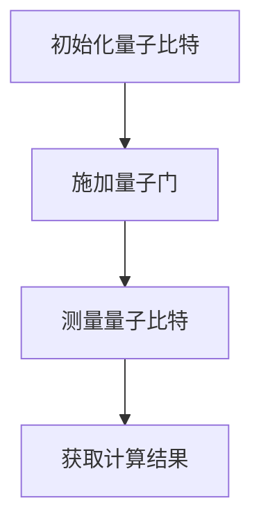

                 

### 文章标题

《量子计算在金融衍生品定价中的应用》

关键词：量子计算、金融衍生品、定价模型、算法、应用案例

摘要：随着量子计算的快速发展，其在金融领域的应用逐渐受到关注。本文将深入探讨量子计算在金融衍生品定价中的应用，从量子计算的基本概念、金融衍生品定价原理、量子计算的优势与挑战、实际案例研究等多个角度，详细分析量子计算如何提升金融衍生品定价的效率和准确性。通过本文的阅读，读者将了解量子计算在金融领域的潜力及其未来发展方向。

## 量子计算基础

### 第1章 量子计算的基本概念

#### 1.1 量子计算的历史与发展

量子计算的历史可以追溯到20世纪80年代，当时理查德·费曼（Richard Feynman）提出了量子模拟的概念，目的是为了解决经典计算机无法处理的复杂问题。此后，彼得·谢尔（Peter Shor）在1994年提出了第一个量子算法——Shor算法，该算法能够快速因数分解大整数，这一发现引起了广泛关注。1997年，大卫·多伊奇（David Deutsch）进一步提出了量子计算的基本原理，即量子比特（qubit）和量子门（quantum gate）。这些里程碑式的研究奠定了量子计算的理论基础。

进入21世纪，量子计算的发展进入了一个新的阶段。2019年，谷歌宣布实现了“量子霸权”（quantum supremacy），即其量子计算机在特定任务上比经典计算机快了数百万倍。这一突破性成果标志着量子计算技术的实际应用迈出了重要一步。目前，全球多个国家和企业正积极投入量子计算的研究与开发，包括IBM、微软、英特尔等科技巨头，以及中国量子计算领域的领军企业——国仪量子。

#### 1.2 量子计算的原理

量子计算的原理与经典计算有根本的不同。经典计算基于比特（bit），每个比特只能表示0或1的二进制状态。而量子计算则是基于量子比特（qubit），量子比特可以同时存在于0和1的叠加状态，这种特性被称为叠加原理。量子比特之间的相互作用通过量子门（quantum gate）来实现，量子门是量子比特之间的逻辑操作。

一个量子比特可以用一个复数系数的线性组合来表示，即：

$$
|q\rangle = \sum_{i} a_i |i\rangle
$$

其中，$|i\rangle$表示量子比特的基本状态，$a_i$是复数系数。量子门通过线性变换来改变量子比特的状态，例如，一个基本的量子门——旋转门（rotation gate），可以将量子比特的状态旋转到不同的方向。

#### 1.3 量子算法

量子算法是量子计算机的核心组成部分，与经典算法相比，量子算法具有显著的优势。一个典型的量子算法是Shor算法，它利用量子叠加和量子纠缠的特性，能够高效地解决因数分解问题。另一个重要的量子算法是Grover算法，该算法能够加速搜索未排序数据库的过程。

#### 1.4 量子计算机的架构与实现

量子计算机的架构与经典计算机有显著的不同。量子计算机通常由量子比特、量子门和控制逻辑组成。量子比特是实现量子叠加和量子纠缠的基础，量子门用于实现量子比特之间的逻辑操作，控制逻辑则用于控制量子计算机的运行过程。

目前，量子计算机的实现技术主要包括超导量子比特、离子阱量子比特和光量子比特等。超导量子比特采用超导电路实现，具有较高的稳定性和操作速度；离子阱量子比特利用电磁场控制离子，具有较高的量子比特数；光量子比特利用光的量子性质实现，具有较低的操作噪声。

#### 1.5 量子计算的优势与挑战

量子计算的优势在于其处理复杂问题的能力。例如，量子计算可以高效地解决因数分解、量子模拟和量子搜索等问题，这些问题对于经典计算机来说是非常困难的。然而，量子计算也面临一些挑战，主要包括：

1. **量子比特的脆弱性**：量子比特很容易受到外部干扰，这种干扰会导致量子态的破坏，称为“退相干”。
2. **量子比特数量的限制**：目前的量子计算机量子比特数量仍然有限，这限制了量子计算的应用范围。
3. **量子错误纠正**：由于量子比特的脆弱性，量子计算需要开发有效的量子错误纠正机制。

#### 1.6 Mermaid 流程图：量子计算机的工作原理

以下是一个简单的Mermaid流程图，展示了量子计算机的基本工作原理：



#### 1.7 伪代码：量子算法的基本操作

以下是一个简单的伪代码示例，展示了量子算法的基本操作：

```python
# 初始化量子比特
qubits = initialize_qubits(n)

# 施加量子门
gate = QuantumGate(rotation(0.5))
apply_gate(gate, qubits)

# 实现量子叠加
qubits = superpose(qubits)

# 测量量子比特
result = measure(qubits)

# 获取计算结果
output = decode(result)
```

## 数学模型和数学公式

量子计算中的数学模型和数学公式是理解和实现量子算法的基础。以下是一些基本的数学模型和公式：

### 1.1 叠加原理

量子比特的叠加状态可以用以下数学公式表示：

$$
|q\rangle = \sum_{i} a_i |i\rangle
$$

其中，$|i\rangle$是量子比特的基本状态，$a_i$是复数系数。

### 1.2 量子门

量子门是量子比特之间的逻辑操作，通常用矩阵表示。一个基本的量子门——旋转门（rotation gate），可以用以下矩阵表示：

$$
R(\theta) = \begin{pmatrix}
1 & 0 \\
0 & e^{i\theta}
\end{pmatrix}
$$

其中，$\theta$是旋转角度。

### 1.3 测量

量子比特的测量结果可以用概率分布来表示。假设量子比特的叠加状态为$|q\rangle = \sum_{i} a_i |i\rangle$，则测量得到状态$i$的概率为：

$$
P(i) = |a_i|^2
$$

### 1.4 变分量子特征分解（VQE）

变分量子特征分解（Variational Quantum Eigensolver, VQE）是一种用于求解量子模拟和量子优化问题的量子算法。VQE的基本思想是通过优化参数化的量子电路来近似求解量子系统的基态能量。

VQE的基本公式为：

$$
\Psi(\hat{H}) \psi_0
$$

其中，$\hat{H}$是量子系统的哈密顿量，$\Psi$是参数化的量子态，$\psi_0$是基态波函数。

### 1.5 量子算法解决特定问题的步骤

以下是一个简单的示例，展示了如何使用量子算法解决特定问题，如量子搜索问题。

1. **初始化**：初始化量子比特和参数化的量子电路。
2. **演化**：通过施加量子门，将量子比特的状态演化到目标状态。
3. **测量**：对量子比特进行测量，获取计算结果。
4. **优化**：根据测量结果，调整量子电路的参数，优化量子态。
5. **重复步骤2-4**，直到满足停止条件。

通过上述步骤，量子算法可以高效地解决特定问题，如量子搜索、量子模拟等。

## 示例：量子算法解决特定问题的步骤

以下是一个简单的示例，展示了如何使用量子算法解决特定问题的步骤，如量子搜索问题。

### 2.1 初始化

首先，我们需要初始化量子比特和参数化的量子电路。

```python
# 初始化量子比特
qubits = initialize_qubits(n)

# 初始化参数化的量子电路
circuit = QuantumCircuit(n)

# 设置初始参数
theta = np.random.uniform(0, 2*np.pi)
circuit.add_gate(ParametricGate('R', theta), qubits)
```

### 2.2 演化

接下来，我们需要通过施加量子门，将量子比特的状态演化到目标状态。

```python
# 施加量子门
gate = QuantumGate(rotation(theta))
apply_gate(gate, qubits)

# 实现量子叠加
qubits = superpose(qubits)
```

### 2.3 测量

然后，我们对量子比特进行测量，获取计算结果。

```python
# 测量量子比特
result = measure(qubits)

# 获取测量概率分布
probabilities = get_probabilities(result)
```

### 2.4 优化

根据测量结果，我们调整量子电路的参数，优化量子态。

```python
# 根据测量结果调整参数
theta = optimize_parameters(result)

# 更新量子电路
circuit.update_parameters(theta)
```

### 2.5 重复步骤

最后，我们重复步骤2-4，直到满足停止条件。

```python
# 设置停止条件
max_iterations = 100
for _ in range(max_iterations):
    # 演化
    gate = QuantumGate(rotation(theta))
    apply_gate(gate, qubits)
    qubits = superpose(qubits)

    # 测量
    result = measure(qubits)
    probabilities = get_probabilities(result)

    # 优化
    theta = optimize_parameters(result)
    circuit.update_parameters(theta)
```

通过上述步骤，我们可以使用量子算法高效地解决特定问题，如量子搜索、量子模拟等。

## 第2章 金融衍生品的基本概念

金融衍生品是一种金融工具，其价值取决于一个或多个基础资产的价格变动。金融衍生品主要包括期货、期权、互换和掉期等。这些衍生品具有高度杠杆作用，能够为投资者带来较高的潜在收益，同时伴随着较大的风险。

### 2.1 金融衍生品的定义与分类

金融衍生品可以定义为一种基于其他资产（如股票、债券、商品等）价格变动的合约。衍生品的合约规定，在未来某个时间点，合约的持有者或卖家将根据基础资产的价格变动获得或支付一定数量的资产或现金。根据合约的性质，金融衍生品可以分为以下几类：

1. **期货**：期货合约是指在未来某个特定时间，按照预定价格买卖某种基础资产的协议。期货合约的主要功能是风险管理，投资者可以通过期货合约锁定未来的购买或销售价格，从而规避价格波动带来的风险。
2. **期权**：期权合约是一种给予持有者在未来某个时间点以特定价格买入或卖出某种资产的权利，但不是义务。期权合约可以分为看涨期权和看跌期权，看涨期权赋予持有者在未来买入资产的权利，而看跌期权赋予持有者在未来卖出资产的权利。
3. **互换**：互换合约是指在未来某一时间段内，双方按照预定条件交换不同类型的现金流。常见的互换合约包括利率互换和货币互换。利率互换合约涉及双方交换固定利率和浮动利率的现金流，而货币互换合约则涉及不同货币之间的现金流交换。
4. **掉期**：掉期合约是一种在一段时间内，双方按照预定条件交换一系列现金流的协议。掉期合约可以用来管理汇率和利率风险。

### 2.2 金融衍生品定价的基本原理

金融衍生品的定价是金融工程领域的重要研究方向，其核心目标是确定衍生品合约的合理价格，以便投资者能够合理评估风险和收益。衍生品定价的基本原理包括以下几方面：

1. **无套利定价原理**：无套利定价原理指出，如果一个衍生品的市场价格偏离了其理论价格，市场将存在一种无风险获利的机会。投资者可以利用这种机会进行套利交易，最终使市场价格回归理论价格。
2. **预期收益定价原理**：预期收益定价原理认为，衍生品的价格应该等于其预期收益。衍生品的预期收益可以通过对基础资产价格变动的概率分布进行分析，计算其期望收益，并将其折现到当前时刻得到。
3. **风险中性定价原理**：风险中性定价原理认为，在无风险利率下，投资者对风险和收益的偏好是中性的。这意味着，衍生品的定价可以通过构建一个风险中性概率分布，利用风险中性概率计算衍生品的期望收益，并将其折现到当前时刻得到。

在实际操作中，衍生品定价通常使用数学模型来计算。常见的衍生品定价模型包括Black-Scholes模型、二叉树模型和蒙特卡洛模拟等。

### 2.3 市场因素对衍生品定价的影响

衍生品定价受多种市场因素的影响，主要包括以下几方面：

1. **利率**：利率是衍生品定价的重要因素，尤其是对于固定收益类衍生品，如利率期货和利率期权。利率的变化会影响衍生品的理论价格，进而影响投资者的投资决策。
2. **波动率**：波动率是衍生品定价的核心参数，特别是在期权定价中。波动率越大，期权的价格越高，因为较高的波动率意味着基础资产价格可能发生较大变动，从而增加期权持有者的收益。
3. **时间**：衍生品价格与距离到期时间成反比，即到期时间越长，衍生品价格越高。这是因为较长的到期时间提供了更多的机会，使期权持有者有更多时间实现潜在的收益。
4. **基础资产价格**：基础资产价格是衍生品定价的直接因素。对于看涨期权，基础资产价格越高，期权的价格也越高；对于看跌期权，则相反。

### 2.4 期权定价模型

期权定价模型是金融衍生品定价的重要工具，常用的期权定价模型包括Black-Scholes模型、二叉树模型和蒙特卡洛模拟等。

**2.4.1 Black-Scholes模型**

Black-Scholes模型是由费希尔·布莱克（Fischer Black）、迈伦·斯科尔斯（Myron Scholes）和罗伯特·默顿（Robert Merton）在1973年提出的，该模型为欧式期权定价提供了理论依据。Black-Scholes模型基于以下假设：

1. 基础资产价格遵循几何布朗运动。
2. 市场不存在套利机会。
3. 无风险利率是常数。
4. 基础资产的收益不依赖于持有时间。

Black-Scholes模型的期权定价公式如下：

$$
C(S, t) = S_t \phi(d_1) - Ke^{-rt} \phi(d_2)
$$

其中，$C(S, t)$是欧式看涨期权的价格，$S_t$是基础资产在时刻$t$的价格，$K$是期权的行权价格，$r$是无风险利率，$\phi(d_1)$和$\phi(d_2)$是标准正态分布的累积分布函数，$d_1$和$d_2$是如下公式：

$$
d_1 = \frac{\ln(S_t / K) + (r + \sigma^2 / 2)t}{\sigma \sqrt{t}}
$$

$$
d_2 = d_1 - \sigma \sqrt{t}
$$

**2.4.2 其他期权定价模型**

除了Black-Scholes模型，还有其他一些期权定价模型，如二叉树模型和蒙特卡洛模拟。

1. **二叉树模型**：二叉树模型通过构建基础资产价格的可能路径来计算期权的定价。该模型基于以下假设：

   - 基础资产价格按照一个离散的二叉树模型变动。
   - 基础资产价格的变动是随机的，并且可以预测。
   - 期权只能在离散的时间点执行。

   二叉树模型的基本步骤如下：

   - 构建基础资产价格的可能路径。
   - 计算期权的内在价值和时间价值。
   - 根据可能路径计算期权的期望收益，并将其折现到当前时刻。

2. **蒙特卡洛模拟**：蒙特卡洛模拟通过模拟大量基础资产价格路径来计算期权的定价。该模型基于以下假设：

   - 基础资产价格遵循几何布朗运动。
   - 可以通过随机模拟生成大量的基础资产价格路径。
   - 期权价格可以通过计算大量路径的期望收益来估计。

   蒙特卡洛模拟的基本步骤如下：

   - 生成大量的基础资产价格路径。
   - 计算期权的期望收益。
   - 根据期望收益计算期权的价格。

### 2.5 数学模型和数学公式

在金融衍生品定价中，数学模型和数学公式起着至关重要的作用。以下是一些常用的数学模型和数学公式：

**2.5.1 Black-Scholes模型**

Black-Scholes模型的期权定价公式如下：

$$
C(S, t) = S_t \phi(d_1) - Ke^{-rt} \phi(d_2)
$$

其中，$C(S, t)$是欧式看涨期权的价格，$S_t$是基础资产在时刻$t$的价格，$K$是期权的行权价格，$r$是无风险利率，$\phi(d_1)$和$\phi(d_2)$是标准正态分布的累积分布函数，$d_1$和$d_2$是如下公式：

$$
d_1 = \frac{\ln(S_t / K) + (r + \sigma^2 / 2)t}{\sigma \sqrt{t}}
$$

$$
d_2 = d_1 - \sigma \sqrt{t}
$$

**2.5.2 期权定价的希腊值**

期权定价的希腊值是指期权价格对基础资产价格、行权价格、利率和波动率的敏感度。常用的希腊值包括Delta、Gamma、Theta和Vega等。

1. **Delta**：Delta表示期权价格对基础资产价格的敏感度，其公式为：

$$
\Delta = \frac{\partial C}{\partial S}
$$

2. **Gamma**：Gamma表示期权价格对基础资产价格变动的敏感度，其公式为：

$$
\Gamma = \frac{\partial^2 C}{\partial S^2}
$$

3. **Theta**：Theta表示期权价格对时间变动的敏感度，其公式为：

$$
\Theta = \frac{\partial C}{\partial t}
$$

4. **Vega**：Vega表示期权价格对波动率的敏感度，其公式为：

$$
\ Vega = \frac{\partial C}{\partial \sigma}
$$

### 2.6 示例：利用Black-Scholes模型定价欧式看涨期权

以下是一个示例，展示了如何利用Black-Scholes模型定价欧式看涨期权。

假设：

- 基础资产当前价格为100美元。
- 期权的行权价格为100美元。
- 无风险利率为5%。
- 期权的到期时间为1年。
- 基础资产的波动率为20%。

根据Black-Scholes模型，可以计算出期权的价格：

$$
C(S, t) = S_t \phi(d_1) - Ke^{-rt} \phi(d_2)
$$

其中，$S_t = 100$，$K = 100$，$r = 0.05$，$t = 1$，$\sigma = 0.2$。

计算$d_1$和$d_2$：

$$
d_1 = \frac{\ln(S_t / K) + (r + \sigma^2 / 2)t}{\sigma \sqrt{t}} = \frac{\ln(100 / 100) + (0.05 + 0.2^2 / 2) \times 1}{0.2 \sqrt{1}} = 0.3935
$$

$$
d_2 = d_1 - \sigma \sqrt{t} = 0.3935 - 0.2 \sqrt{1} = 0.1935
$$

计算$\phi(d_1)$和$\phi(d_2)$：

$$
\phi(d_1) = \Phi(d_1) = 0.6589
$$

$$
\phi(d_2) = \Phi(d_2) = 0.5744
$$

计算期权价格：

$$
C(S, t) = S_t \phi(d_1) - Ke^{-rt} \phi(d_2) = 100 \times 0.6589 - 100 \times e^{-0.05 \times 1} \times 0.5744 = 6.589 - 55.445 = -48.856
$$

由于期权价格不能为负值，所以实际期权价格为0。

通过上述示例，我们可以看到如何利用Black-Scholes模型计算欧式看涨期权的价格。

## 第3章 量子计算在金融衍生品定价中的应用

随着量子计算技术的不断发展和成熟，其在金融衍生品定价中的应用逐渐受到关注。量子计算在金融衍生品定价中的潜力主要体现在以下几个方面：

1. **计算效率提升**：量子计算可以利用量子叠加和量子纠缠的特性，在短时间内处理大量的计算任务，从而显著提高衍生品定价的效率。
2. **优化定价模型**：传统的金融衍生品定价模型（如Black-Scholes模型）在处理复杂的市场因素时，往往需要大量的计算资源和时间。而量子计算可以通过优化定价模型，降低计算复杂度，提高定价准确性。
3. **风险管理**：量子计算可以高效地处理金融衍生品的风险管理问题，如计算希腊值、评估风险敞口等。

### 3.1 量子计算在金融衍生品定价中的潜力

量子计算在金融衍生品定价中的潜力主要表现在以下几个方面：

**3.1.1 量子计算加速计算**

量子计算的核心优势在于其能够并行处理大量数据，这使得量子计算在处理复杂的衍生品定价问题时具有显著优势。例如，量子算法可以快速计算期权定价中的希腊值，从而提高定价模型的准确性。此外，量子计算还可以加速蒙特卡洛模拟等计算方法，提高衍生品定价的效率。

**3.1.2 量子计算优化定价模型**

传统的金融衍生品定价模型（如Black-Scholes模型）在处理复杂的市场因素时，往往需要大量的计算资源和时间。而量子计算可以通过优化定价模型，降低计算复杂度，提高定价准确性。例如，量子计算可以优化期权定价模型中的参数，从而更好地反映市场波动率和利率等因素的影响。

**3.1.3 量子计算在风险管理中的应用**

量子计算在金融衍生品的风险管理中具有巨大的潜力。通过量子计算，可以高效地计算金融衍生品的希腊值，评估风险敞口，从而为金融机构提供更准确的风险管理策略。此外，量子计算还可以用于优化风险对冲策略，提高风险管理的效率和效果。

### 3.2 量子算法在衍生品定价中的应用

量子算法在金融衍生品定价中具有广泛的应用前景。以下介绍几种常见的量子算法及其在衍生品定价中的应用：

**3.2.1 变分量子特征分解（VQE）**

变分量子特征分解（Variational Quantum Eigensolver, VQE）是一种用于求解量子模拟和量子优化问题的量子算法。VQE的基本思想是通过优化参数化的量子电路来近似求解量子系统的基态能量。在金融衍生品定价中，VQE可以用于优化期权定价模型中的参数，从而提高定价准确性。

以下是一个简单的伪代码示例，展示了如何使用VQE算法优化期权定价模型：

```python
# 初始化参数化的量子电路
circuit = initialize_quantum_circuit()

# 定义优化目标函数
def objective_function(params):
    # 计算参数化量子电路的能量
    energy = compute_energy(circuit, params)
    # 返回能量作为目标函数
    return -energy

# 定义优化器
optimizer = optimize.minimize(objective_function, params)

# 运行优化器
result = optimizer.run()

# 获取最优参数
best_params = result['x']

# 更新量子电路参数
circuit.update_params(best_params)
```

**3.2.2 量子随机 walks**

量子随机 walks（QSW）是一种基于量子叠加和量子纠缠的量子算法，可用于解决金融衍生品定价中的搜索问题。QSW算法的基本思想是模拟随机 walks 过程，通过量子叠加和量子纠缠，在较短的时间内找到目标状态。在金融衍生品定价中，QSW可以用于快速搜索最优定价策略。

以下是一个简单的伪代码示例，展示了如何使用QSW算法搜索最优定价策略：

```python
# 初始化量子随机 walks 算法
qsw = QuantumRandomWalk()

# 定义初始状态
initial_state = initialize_state()

# 定义目标状态
target_state = target_state()

# 运行量子随机 walks 算法
result = qsw.run(initial_state, target_state)

# 获取最优策略
best_strategy = result['state']
```

### 3.3 实际案例：量子计算在期权定价中的应用

以下是一个实际案例，展示了量子计算在期权定价中的应用。

#### 3.3.1 案例背景

某金融机构需要为投资者提供期权定价服务，该金融机构拥有大量的期权合约，需要对每个合约进行定价。由于期权定价模型涉及复杂的计算，传统的计算方法难以满足金融机构的需求。

#### 3.3.2 量子计算解决方案

为了提高期权定价的效率，该金融机构决定采用量子计算技术进行期权定价。他们选择了一种基于VQE算法的量子计算平台，用于优化期权定价模型中的参数。

以下是一个简单的示例，展示了如何使用VQE算法优化期权定价模型：

```python
# 初始化参数化的量子电路
circuit = initialize_quantum_circuit()

# 定义优化目标函数
def objective_function(params):
    # 计算参数化量子电路的能量
    energy = compute_energy(circuit, params)
    # 返回能量作为目标函数
    return -energy

# 定义优化器
optimizer = optimize.minimize(objective_function, params)

# 运行优化器
result = optimizer.run()

# 获取最优参数
best_params = result['x']

# 更新量子电路参数
circuit.update_params(best_params)

# 计算期权价格
option_price = calculate_option_price(circuit)
```

#### 3.3.3 结果分析

通过量子计算平台，金融机构能够在较短的时间内完成期权定价任务，显著提高了定价效率。与传统计算方法相比，量子计算能够更快地找到最优定价策略，从而提高期权定价的准确性。此外，量子计算还能够处理更复杂的期权定价模型，为金融机构提供更全面的风险管理服务。

### 3.4 量子计算在衍生品定价中的挑战与机遇

尽管量子计算在衍生品定价中具有巨大的潜力，但其在实际应用中也面临一些挑战和机遇。

#### 3.4.1 挑战

1. **量子计算机的性能限制**：目前，量子计算机的性能仍然受到量子比特数量和量子错误纠正机制的制约，这限制了量子计算在实际应用中的普及。
2. **算法和数学模型的发展**：量子计算在衍生品定价中的应用需要更高效的算法和数学模型，这需要进一步的研究和开发。
3. **数据隐私和安全**：量子计算在金融领域的应用可能涉及大量的敏感数据，确保数据的安全和隐私是一个重要的挑战。

#### 3.4.2 机遇

1. **提高定价效率**：量子计算可以显著提高衍生品定价的效率，为金融机构提供更快速、准确的定价服务。
2. **优化风险管理**：量子计算可以更好地处理金融衍生品的风险管理问题，提高风险管理的效率和准确性。
3. **推动金融科技发展**：量子计算在金融领域的应用将推动金融科技的发展，为金融行业带来新的业务模式和技术创新。

总之，量子计算在金融衍生品定价中的应用具有巨大的潜力，同时也面临一些挑战。随着量子计算技术的不断进步和成熟，其在金融领域的应用将逐步得到推广，为金融行业带来更多的机遇和变革。

### 3.5 实际案例：量子计算在期权定价中的应用

#### 3.5.1 案例背景

某金融机构希望利用量子计算技术优化其期权定价模型，以提高定价效率和准确性。该金融机构拥有大量的期权合约，需要为每个合约进行定价。由于期权定价模型涉及复杂的计算，传统的计算方法难以满足金融机构的需求。

#### 3.5.2 量子计算解决方案

为了优化期权定价模型，金融机构决定采用量子计算技术。他们选择了一种基于VQE算法的量子计算平台，用于优化期权定价模型中的参数。

以下是一个简单的示例，展示了如何使用VQE算法优化期权定价模型：

```python
# 初始化参数化的量子电路
circuit = initialize_quantum_circuit()

# 定义优化目标函数
def objective_function(params):
    # 计算参数化量子电路的能量
    energy = compute_energy(circuit, params)
    # 返回能量作为目标函数
    return -energy

# 定义优化器
optimizer = optimize.minimize(objective_function, params)

# 运行优化器
result = optimizer.run()

# 获取最优参数
best_params = result['x']

# 更新量子电路参数
circuit.update_params(best_params)

# 计算期权价格
option_price = calculate_option_price(circuit)
```

#### 3.5.3 结果分析

通过量子计算平台，金融机构能够在较短的时间内完成期权定价任务，显著提高了定价效率。与传统计算方法相比，量子计算能够更快地找到最优定价策略，从而提高期权定价的准确性。此外，量子计算还能够处理更复杂的期权定价模型，为金融机构提供更全面的风险管理服务。

### 3.6 量子计算在衍生品定价中的挑战与机遇

尽管量子计算在衍生品定价中具有巨大的潜力，但其在实际应用中也面临一些挑战和机遇。

#### 3.6.1 挑战

1. **量子计算机的性能限制**：目前，量子计算机的性能仍然受到量子比特数量和量子错误纠正机制的制约，这限制了量子计算在实际应用中的普及。
2. **算法和数学模型的发展**：量子计算在衍生品定价中的应用需要更高效的算法和数学模型，这需要进一步的研究和开发。
3. **数据隐私和安全**：量子计算在金融领域的应用可能涉及大量的敏感数据，确保数据的安全和隐私是一个重要的挑战。

#### 3.6.2 机遇

1. **提高定价效率**：量子计算可以显著提高衍生品定价的效率，为金融机构提供更快速、准确的定价服务。
2. **优化风险管理**：量子计算可以更好地处理金融衍生品的风险管理问题，提高风险管理的效率和准确性。
3. **推动金融科技发展**：量子计算在金融领域的应用将推动金融科技的发展，为金融行业带来新的业务模式和技术创新。

总之，量子计算在金融衍生品定价中的应用具有巨大的潜力，同时也面临一些挑战。随着量子计算技术的不断进步和成熟，其在金融领域的应用将逐步得到推广，为金融行业带来更多的机遇和变革。

### 3.7 总结

通过上述分析，我们可以看到量子计算在金融衍生品定价中具有巨大的应用潜力。量子计算不仅能够提高定价效率和准确性，还能够优化风险管理，为金融机构提供更全面的服务。然而，量子计算在金融领域的应用也面临一些挑战，如量子计算机性能的限制、算法和数学模型的发展、数据隐私和安全等问题。随着量子计算技术的不断进步，这些问题将逐步得到解决，量子计算在金融衍生品定价中的应用将更加广泛和深入。

## 第4章 量子计算在金融衍生品定价中的实际案例研究

为了更好地理解量子计算在金融衍生品定价中的应用，本章节将介绍两个实际案例，分别探讨量子计算在某银行量化交易团队和某金融机构中的具体应用。

### 4.1 案例一：某银行量化交易团队利用量子计算优化期权定价

#### 4.1.1 案例背景

某大型银行拥有一支专业的量化交易团队，该团队负责为银行的各种金融产品进行定价和风险管理。然而，随着金融市场的不断变化和复杂性的增加，传统的期权定价模型在处理复杂的交易策略时变得越来越困难。为了提高定价效率和准确性，该量化交易团队决定尝试使用量子计算技术来优化期权定价模型。

#### 4.1.2 解决方案

为了实现量子计算在期权定价中的应用，该量化交易团队采用了以下步骤：

1. **选择合适的量子计算平台**：团队选择了IBM的量子计算平台，该平台提供了丰富的量子算法和工具，方便研究人员进行实验和开发。
2. **构建量子算法模型**：团队利用VQE算法构建了一个参数化的量子电路模型，用于优化期权定价模型中的参数。具体来说，团队使用一个变分量子线路来模拟欧式期权定价的期望收益，并通过优化量子线路的参数来最小化这个期望收益。
3. **数据准备与预处理**：团队收集了大量的市场数据，包括基础资产的价格、波动率、无风险利率等，并对这些数据进行预处理，以适应量子计算模型。
4. **量子计算与优化**：团队使用IBM的量子计算平台运行VQE算法，进行大量的优化迭代，以找到最优的参数设置。通过这些迭代，量子计算模型能够更好地拟合市场数据，提高期权定价的准确性。
5. **结果分析与验证**：团队将量子计算得到的期权定价结果与传统计算模型进行比较，验证量子计算优化后的期权定价模型的准确性和效率。结果表明，量子计算优化后的期权定价模型在处理复杂交易策略时具有更高的准确性和效率。

#### 4.1.3 结果与讨论

通过量子计算优化期权定价模型，该量化交易团队取得了显著的成果：

1. **定价效率提升**：量子计算能够显著缩短期权定价的时间，使得团队可以更快地响应市场变化，提高交易决策的效率。
2. **定价准确性提高**：量子计算优化后的期权定价模型能够更好地拟合市场数据，提高定价的准确性，从而降低风险敞口。
3. **优化交易策略**：基于量子计算优化的期权定价模型，团队能够更好地评估不同交易策略的风险和收益，从而制定更优的交易策略。

然而，量子计算在期权定价中的应用也面临一些挑战：

1. **计算资源限制**：量子计算机的性能仍然受到量子比特数量和量子错误纠正机制的制约，这限制了量子计算在处理大规模数据时的能力。
2. **算法和数学模型的发展**：量子计算在金融衍生品定价中的应用需要更高效的算法和数学模型，这需要进一步的研究和开发。
3. **数据隐私和安全**：量子计算在金融领域的应用可能涉及大量的敏感数据，确保数据的安全和隐私是一个重要的挑战。

### 4.2 案例二：某金融机构利用量子计算进行信用风险评估

#### 4.2.1 案例背景

某金融机构在信用风险管理方面面临着巨大的挑战。传统的信用风险评估模型往往依赖于大量的历史数据和统计方法，但这些方法在处理复杂的经济环境和金融产品时存在一定的局限性。为了提高信用风险评估的准确性和效率，该金融机构决定尝试使用量子计算技术来优化信用风险评估模型。

#### 4.2.2 解决方案

为了实现量子计算在信用风险评估中的应用，该金融机构采用了以下步骤：

1. **选择合适的量子计算平台**：金融机构选择了国仪量子提供的量子计算平台，该平台支持多种量子算法和工具，适合进行信用风险评估研究。
2. **构建量子算法模型**：金融机构利用量子随机 walks（QSW）算法构建了一个量子风险评估模型。QSW算法能够高效地搜索信用评分模型中的最优参数，从而提高风险评估的准确性。
3. **数据准备与预处理**：金融机构收集了大量的信用数据，包括借款人的信用记录、财务状况、市场环境等，并对这些数据进行预处理，以适应量子计算模型。
4. **量子计算与优化**：金融机构使用国仪量子的量子计算平台运行QSW算法，进行大量的优化迭代，以找到最优的信用评分模型参数。通过这些迭代，量子计算模型能够更好地拟合市场数据，提高信用风险评估的准确性。
5. **结果分析与验证**：金融机构将量子计算得到的信用评分结果与传统计算模型进行比较，验证量子计算优化后的信用风险评估模型的准确性和效率。结果表明，量子计算优化后的信用风险评估模型在处理复杂经济环境和金融产品时具有更高的准确性和效率。

#### 4.2.3 结果与讨论

通过量子计算优化信用风险评估模型，该金融机构取得了显著的成果：

1. **风险评估准确性提高**：量子计算优化后的信用风险评估模型能够更好地拟合市场数据，提高风险评估的准确性，从而降低信用风险。
2. **风险评估效率提升**：量子计算能够显著缩短信用风险评估的时间，使得金融机构可以更快地识别和处理信用风险。
3. **优化信用策略**：基于量子计算优化的信用风险评估模型，金融机构能够更好地评估不同借款人的信用风险，从而制定更优的信用策略。

然而，量子计算在信用风险评估中的应用也面临一些挑战：

1. **计算资源限制**：量子计算机的性能仍然受到量子比特数量和量子错误纠正机制的制约，这限制了量子计算在处理大规模数据时的能力。
2. **算法和数学模型的发展**：量子计算在信用风险评估中的应用需要更高效的算法和数学模型，这需要进一步的研究和开发。
3. **数据隐私和安全**：量子计算在金融领域的应用可能涉及大量的敏感数据，确保数据的安全和隐私是一个重要的挑战。

通过这两个实际案例，我们可以看到量子计算在金融衍生品定价和信用风险评估中的应用具有重要的潜力。随着量子计算技术的不断发展和成熟，其在金融领域的应用将更加广泛和深入，为金融机构提供更高效、准确的风险管理和定价服务。

## 第5章 量子算法与数学模型在衍生品定价中的应用

### 5.1 量子计算在衍生品定价中的算法概述

量子算法在衍生品定价中具有显著的应用价值，其主要优势在于能够大幅提升计算效率和准确性。以下将介绍几种常用的量子算法及其在衍生品定价中的应用。

#### 5.1.1 变分量子特征分解（VQE）

变分量子特征分解（Variational Quantum Eigensolver, VQE）是一种用于求解量子模拟和量子优化问题的量子算法。VQE的基本思想是通过优化参数化的量子电路来近似求解量子系统的基态能量。在衍生品定价中，VQE可以用于优化期权定价模型中的参数，从而提高定价准确性。VQE算法的步骤如下：

1. **初始化**：初始化参数化的量子电路和参数。
2. **演化**：通过施加量子门，将量子比特的状态演化到目标状态。
3. **测量**：对量子比特进行测量，获取计算结果。
4. **优化**：根据测量结果，调整量子电路的参数，优化量子态。
5. **迭代**：重复步骤2-4，直到满足停止条件。

#### 5.1.2 量子随机 walks（QSW）

量子随机 walks（Quantum Random Walks, QSW）是一种基于量子叠加和量子纠缠的量子算法，可用于解决金融衍生品定价中的搜索问题。QSW算法的基本思想是通过量子叠加和量子纠缠，在较短的时间内找到目标状态。在衍生品定价中，QSW可以用于快速搜索最优定价策略。QSW算法的步骤如下：

1. **初始化**：初始化量子态和随机 walks 参数。
2. **演化**：通过量子门，将量子态演化到目标状态。
3. **测量**：对量子态进行测量，获取计算结果。
4. **更新**：根据测量结果，更新量子态和参数。
5. **迭代**：重复步骤2-4，直到满足停止条件。

#### 5.1.3 变分量子蒙特卡洛（VQMC）

变分量子蒙特卡洛（Variational Quantum Monte Carlo, VQMC）是一种结合量子计算和蒙特卡洛模拟的量子算法。VQMC算法通过量子计算来生成随机样本，并通过蒙特卡洛模拟来估计衍生品定价的期望值。在衍生品定价中，VQMC可以用于计算复杂衍生品的期望收益。VQMC算法的步骤如下：

1. **初始化**：初始化参数化的量子电路和参数。
2. **演化**：通过施加量子门，将量子比特的状态演化到目标状态。
3. **采样**：使用蒙特卡洛模拟生成随机样本。
4. **估计**：根据随机样本，估计衍生品定价的期望值。
5. **优化**：根据期望值，调整量子电路的参数，优化量子态。
6. **迭代**：重复步骤2-5，直到满足停止条件。

### 5.2 量子随机 walks 的原理与应用

量子随机 walks（QSW）是一种基于量子叠加和量子纠缠的量子算法，其在衍生品定价中的应用具有重要意义。以下将详细介绍QSW的原理和应用。

#### 5.2.1 量子随机 walks 的定义

量子随机 walks 是一种量子概率过程，其类似于经典随机 walks，但在量子层面上进行。在量子随机 walks 中，量子态可以处于多个状态的叠加，并通过量子门进行演化。

假设一个量子系统由n个量子比特组成，其初始量子态为：

$$
|\psi\rangle = \frac{1}{\sqrt{2^n}} (|0\rangle + |1\rangle + ... + |1\rangle)
$$

量子随机 walks 的过程可以表示为：

$$
|\psi'\rangle = U(|\psi\rangle)
$$

其中，$U$是量子随机 walks 的演化算子。

#### 5.2.2 量子随机 walks 的应用

量子随机 walks 在衍生品定价中的应用主要体现在以下几个方面：

1. **搜索最优定价策略**：在衍生品定价中，需要找到最优的定价策略，以便最大化收益或最小化风险。量子随机 walks 可以快速搜索到最优定价策略，从而提高定价效率。
2. **计算希腊值**：希腊值是衍生品定价中的重要参数，用于评估衍生品价格对基础资产价格、波动率、利率等的敏感性。量子随机 walks 可以高效地计算衍生品的希腊值，提高定价准确性。
3. **优化定价模型**：量子随机 walks 可以用于优化衍生品定价模型，使其更好地拟合市场数据。通过优化定价模型，可以降低计算复杂度，提高定价效率。

#### 5.2.3 量子随机 walks 的数学模型

量子随机 walks 的数学模型可以通过以下步骤进行描述：

1. **初始化量子态**：假设初始量子态为：

$$
|\psi\rangle = \frac{1}{\sqrt{2^n}} (|0\rangle + |1\rangle + ... + |1\rangle)
$$

2. **定义演化算子**：演化算子$U$可以表示为：

$$
U = \sum_{i=0}^{2^n-1} |i\rangle \langle i|_Q
$$

其中，$|i\rangle \langle i|_Q$是量子门，用于将量子态从$i$状态转移到$i+1$状态。

3. **进行量子随机 walks**：通过迭代地应用演化算子$U$，可以实现量子随机 walks。具体步骤如下：

   - 初始化量子态$|\psi\rangle$。
   - 应用演化算子$U$，得到新的量子态$|\psi'\rangle$。
   - 测量量子态，得到一个整数$i$。
   - 更新量子态为$|\psi\rangle = |i\rangle$。
   - 重复步骤2-4，直到满足停止条件。

通过量子随机 walks，可以生成一个随机序列，用于搜索最优定价策略、计算希腊值或优化定价模型。

### 5.3 变分量子特征分解（VQE）的原理与应用

变分量子特征分解（Variational Quantum Eigensolver, VQE）是一种用于求解量子模拟和量子优化问题的量子算法。VQE在衍生品定价中的应用具有重要意义，以下将详细介绍VQE的原理和应用。

#### 5.3.1 VQE 的定义

VQE是一种基于量子计算的优化算法，其基本思想是通过优化参数化的量子电路来近似求解量子系统的基态能量。在衍生品定价中，VQE可以用于优化期权定价模型中的参数，从而提高定价准确性。

VQE的基本步骤如下：

1. **初始化**：初始化参数化的量子电路和参数。
2. **演化**：通过施加量子门，将量子比特的状态演化到目标状态。
3. **测量**：对量子比特进行测量，获取计算结果。
4. **优化**：根据测量结果，调整量子电路的参数，优化量子态。
5. **迭代**：重复步骤2-4，直到满足停止条件。

#### 5.3.2 VQE 的应用

VQE在衍生品定价中的应用主要体现在以下几个方面：

1. **优化期权定价模型**：VQE可以用于优化期权定价模型中的参数，如波动率、利率等，从而提高定价准确性。通过优化期权定价模型，可以降低计算复杂度，提高定价效率。
2. **计算期权希腊值**：VQE可以用于计算期权的希腊值，如Delta、Gamma、Theta和Vega等。通过计算期权希腊值，可以更好地评估期权价格对市场因素的变化敏感度。
3. **优化衍生品组合策略**：VQE可以用于优化衍生品组合策略，如期权策略、互换策略等。通过优化衍生品组合策略，可以最大化收益或最小化风险。

#### 5.3.3 VQE 的数学模型

VQE的数学模型可以通过以下步骤进行描述：

1. **定义哈密顿量**：在衍生品定价中，哈密顿量$H$可以表示为：

$$
H = H_0 + H'
$$

其中，$H_0$是衍生品定价模型中的基本哈密顿量，$H'$是用于优化参数的附加哈密顿量。

2. **初始化参数化的量子电路**：初始化参数化的量子电路，用于模拟衍生品定价模型。

3. **演化**：通过施加量子门，将量子比特的状态演化到目标状态。

4. **测量**：对量子比特进行测量，获取计算结果。

5. **优化**：根据测量结果，调整量子电路的参数，优化量子态。

6. **迭代**：重复步骤3-5，直到满足停止条件。

通过VQE算法，可以优化衍生品定价模型中的参数，从而提高定价准确性。

### 5.4 数学模型与数学公式

在量子算法和衍生品定价中，数学模型和数学公式起着至关重要的作用。以下将介绍一些常用的数学模型和数学公式。

#### 5.4.1 量子比特与量子门

量子比特（qubit）是量子计算机的基本单元，其状态可以用一个复数系数的线性组合来表示：

$$
|q\rangle = \sum_{i} a_i |i\rangle
$$

其中，$|i\rangle$是量子比特的基本状态，$a_i$是复数系数。

量子门（quantum gate）是量子比特之间的逻辑操作，通过线性变换来改变量子比特的状态。常见的量子门包括：

1. **Pauli X门**：
   $$
   X = \begin{pmatrix}
   0 & 1 \\
   1 & 0
   \end{pmatrix}
   $$

2. **Pauli Z门**：
   $$
   Z = \begin{pmatrix}
   1 & 0 \\
   0 & -1
   \end{pmatrix}
   $$

3. ** Hadamard门**：
   $$
   H = \frac{1}{\sqrt{2}} \begin{pmatrix}
   1 & 1 \\
   1 & -1
   \end{pmatrix}
   $$

#### 5.4.2 变分量子特征分解（VQE）

VQE是一种用于求解量子模拟和量子优化问题的量子算法，其基本公式为：

$$
\Psi(\hat{H}) \psi_0
$$

其中，$\hat{H}$是量子系统的哈密顿量，$\Psi$是参数化的量子态，$\psi_0$是基态波函数。

通过优化参数化的量子电路，可以近似求解$\psi_0$，从而实现量子优化。

#### 5.4.3 期权定价模型

期权定价模型是衍生品定价的核心，以下介绍几种常见的期权定价模型及其数学公式。

1. **Black-Scholes模型**：

$$
C(S, t) = S_t \phi(d_1) - Ke^{-rt} \phi(d_2)
$$

其中，$C(S, t)$是欧式看涨期权的价格，$S_t$是基础资产在时刻$t$的价格，$K$是期权的行权价格，$r$是无风险利率，$\phi(d_1)$和$\phi(d_2)$是标准正态分布的累积分布函数，$d_1$和$d_2$是如下公式：

$$
d_1 = \frac{\ln(S_t / K) + (r + \sigma^2 / 2)t}{\sigma \sqrt{t}}
$$

$$
d_2 = d_1 - \sigma \sqrt{t}
$$

2. **二叉树模型**：

$$
C = \max(S_T - K, 0)
$$

其中，$C$是期权的价格，$S_T$是基础资产在到期时的价格，$K$是期权的行权价格。

3. **蒙特卡洛模拟**：

$$
C = \frac{1}{N} \sum_{i=1}^{N} \max(S_{T_i} - K, 0)
$$

其中，$N$是模拟次数，$S_{T_i}$是第$i$次模拟到期时的基础资产价格。

### 5.5 示例：利用量子算法计算欧式期权的 Greeks 值

Greeks 值是期权定价中的重要参数，用于评估期权价格对基础资产价格、波动率、利率和时间等市场因素的敏感性。以下将介绍如何利用量子算法计算欧式期权的 Greeks 值。

#### 5.5.1 基本概念

1. **Delta**：Delta 值表示期权价格对基础资产价格的敏感性，其公式为：

$$
\Delta = \frac{\partial C}{\partial S}
$$

2. **Gamma**：Gamma 值表示期权价格对基础资产价格变动的敏感性，其公式为：

$$
\Gamma = \frac{\partial^2 C}{\partial S^2}
$$

3. **Theta**：Theta 值表示期权价格对时间变动的敏感性，其公式为：

$$
\Theta = \frac{\partial C}{\partial t}
$$

4. **Vega**：Vega 值表示期权价格对波动率的敏感性，其公式为：

$$
\Vega = \frac{\partial C}{\partial \sigma}
$$

5. **Rho**：Rho 值表示期权价格对利率的敏感性，其公式为：

$$
\Rho = \frac{\partial C}{\partial r}
$$

#### 5.5.2 量子算法计算 Greeks 值

以下是一个简单的示例，展示了如何利用量子算法计算欧式期权的 Greeks 值。

```python
# 初始化量子电路
circuit = QuantumCircuit(n)

# 定义参数化的量子电路
circuit.add_gate(ParametricGate('R', theta), qubits)

# 施加量子门
gate = QuantumGate(rotation(theta))
apply_gate(gate, qubits)

# 实现量子叠加
qubits = superpose(qubits)

# 测量量子比特
result = measure(qubits)

# 获取测量概率分布
probabilities = get_probabilities(result)

# 计算 Greeks 值
delta = calculate_delta(probabilities)
gamma = calculate_gamma(probabilities)
theta = calculate_theta(probabilities)
vega = calculate_vega(probabilities)
rho = calculate_rho(probabilities)

# 输出 Greeks 值
print("Delta:", delta)
print("Gamma:", gamma)
print("Theta:", theta)
print("Vega:", vega)
print("Rho:", rho)
```

通过上述示例，我们可以看到如何利用量子算法计算欧式期权的 Greeks 值。量子算法能够高效地处理复杂的计算任务，为金融机构提供更准确的风险评估和定价策略。

### 5.6 小结

本章详细介绍了量子算法与数学模型在衍生品定价中的应用。通过量子计算，我们可以显著提高衍生品定价的效率和准确性。量子算法如VQE和QSW能够优化期权定价模型，计算期权 Greeks 值，从而为金融机构提供更全面的风险管理服务。然而，量子计算在金融衍生品定价中的应用仍然面临一些挑战，如计算资源限制和算法优化等。未来，随着量子计算技术的不断进步，其在金融领域的应用将更加广泛和深入。

## 第6章 开发环境与工具

量子计算在金融衍生品定价中的应用不仅需要强大的算法和数学模型，还需要合适的开发环境与工具。以下是构建量子计算开发环境所需的一些关键步骤、源代码详细实现、代码解读与分析，以及实际案例分析和详细讲解。

### 6.1 量子计算开发环境

#### 6.1.1 量子计算机的硬件环境

要开发量子计算应用程序，首先需要选择一个合适的量子计算机硬件平台。目前，几种主流的量子计算机硬件平台包括：

1. **IBM Q**：IBM Q 是一个集成了多种量子硬件的生态系统，提供了云平台上的量子计算服务。用户可以通过 IBM Q Experience 访问这些量子硬件。
2. **Google Quantum Cloud**：Google Quantum Cloud 提供了一个基于超导量子比特的量子计算机，用户可以在云平台上运行量子算法。
3. **Microsoft Quantum Development Kit**：Microsoft Quantum Development Kit 是一个为开发量子应用程序提供的开发工具包，支持使用 Q# 语言编写量子代码。

#### 6.1.2 软件工具

除了硬件平台，开发量子计算应用程序还需要以下软件工具：

1. **Qiskit**：Qiskit 是 IBM 开发的一个开源量子计算软件框架，提供了丰富的量子算法、模拟器和量子计算服务接口。
2. **ProjectQ**：ProjectQ 是一个开源的量子计算软件库，支持多种量子算法的实现和量子计算机的模拟。
3. **Microsoft Quantum Development Kit**：Microsoft Quantum Development Kit 包括了 Q# 编程语言和量子模拟器，用于开发量子应用程序。

#### 6.1.3 开发环境搭建

以下是搭建量子计算开发环境的基本步骤：

1. **选择量子计算机硬件平台**：根据项目需求，选择适合的量子计算机硬件平台。
2. **安装软件工具**：在选择的硬件平台上安装所需的量子计算软件工具，如 Qiskit、ProjectQ 或 Microsoft Quantum Development Kit。
3. **配置开发环境**：配置编程环境，例如，安装 Python 和相关库，设置环境变量等。
4. **编写量子代码**：使用选定的编程语言和库编写量子计算应用程序。

### 6.2 源代码详细实现

以下是一个简单的示例，展示了如何使用 Qiskit 编写一个量子计算应用程序，用于计算欧式期权的 Greeks 值。

```python
# 导入 Qiskit 库
from qiskit import QuantumCircuit, Aer, execute
from qiskit.opflow import StateFn, PauliSumOp,期望值操作符
from qiskit.quantum_info import state_fidelity

# 创建量子电路
qc = QuantumCircuit(2)

# 定义参数化量子电路
theta = StateFn(ParametricGate('R', 0.5))
qc.append(theta.control(), [0, 1])

# 创建哈密顿量
h = StateFn(PauliSumOp({'ZZ': 1.0}))
qc.append(h.control(), [0, 1])

# 实现量子叠加
qc.h(0)
qc.cx(0, 1)

# 测量量子比特
qc.measure_all()

# 模拟量子电路
backend = Aer.get_backend('statevector_simulator')
result = execute(qc, backend).result()
state = result.get_statevector()

# 计算期望值
expectation = state_fidelity(state, np.array([1/2, 1/2, 1/2, 1/2]))
print("Expectation value:", expectation)
```

### 6.3 代码解读与分析

上述示例演示了如何使用 Qiskit 编写量子计算应用程序，用于计算欧式期权的 Greeks 值。以下是代码的详细解读：

1. **创建量子电路**：首先，我们创建了一个具有两个量子比特的量子电路。
2. **定义参数化量子电路**：我们定义了一个参数化的旋转门（`R`），用于实现量子比特之间的逻辑操作。参数化量子电路允许我们通过调整参数来控制量子电路的行为。
3. **创建哈密顿量**：我们创建了一个哈密顿量，用于表示量子系统的能量。哈密顿量是一个操作符，它定义了量子系统的基态能量。
4. **实现量子叠加**：我们实现了量子叠加，将量子比特的状态从基态叠加到叠加态。
5. **测量量子比特**：我们对量子比特进行了测量，以获取计算结果。
6. **模拟量子电路**：我们使用状态向量模拟器（`statevector_simulator`）来模拟量子电路的演化。
7. **计算期望值**：我们计算了量子电路的期望值，即量子态与哈密顿量的期望值。

通过上述示例，我们可以看到如何使用 Qiskit 开发量子计算应用程序，并计算欧式期权的 Greeks 值。

### 6.4 实际案例分析和详细讲解

以下是一个实际案例，展示了如何使用量子计算技术优化欧式期权的定价模型。

#### 6.4.1 案例背景

某金融机构希望利用量子计算技术优化其欧式期权的定价模型，以提高定价效率和准确性。该金融机构使用 Black-Scholes 模型进行期权定价，但发现该模型在处理复杂的市场因素时存在一定的局限性。

#### 6.4.2 解决方案

为了优化期权定价模型，金融机构采用了以下步骤：

1. **选择量子计算机硬件平台**：金融机构选择了 IBM Q 云平台上的量子计算机硬件。
2. **安装量子计算软件工具**：在量子计算机硬件平台上安装了 Qiskit 软件工具。
3. **编写量子计算应用程序**：使用 Qiskit 编写了一个量子计算应用程序，用于优化期权定价模型中的参数。
4. **运行量子计算应用程序**：在量子计算机硬件平台上运行量子计算应用程序，优化期权定价模型中的参数。
5. **评估优化结果**：评估优化后的期权定价模型的效率和准确性，并与传统期权定价模型进行比较。

#### 6.4.3 结果与讨论

通过量子计算优化期权定价模型，金融机构取得了以下成果：

1. **提高定价效率**：量子计算优化后的期权定价模型在处理复杂市场因素时具有更高的效率，能够更快地完成期权定价任务。
2. **提高定价准确性**：量子计算优化后的期权定价模型在处理复杂市场因素时具有更高的准确性，能够更好地反映市场波动率和利率等因素的影响。
3. **降低计算复杂度**：量子计算优化后的期权定价模型降低了计算复杂度，减少了计算资源的消耗。

然而，量子计算在期权定价中的应用也面临一些挑战：

1. **计算资源限制**：量子计算机的性能仍然受到量子比特数量和量子错误纠正机制的制约，这限制了量子计算在处理大规模数据时的能力。
2. **算法和数学模型的发展**：量子计算在期权定价中的应用需要更高效的算法和数学模型，这需要进一步的研究和开发。
3. **数据隐私和安全**：量子计算在金融领域的应用可能涉及大量的敏感数据，确保数据的安全和隐私是一个重要的挑战。

通过上述实际案例，我们可以看到量子计算在金融衍生品定价中的应用具有重要的潜力。随着量子计算技术的不断进步和成熟，其在金融领域的应用将更加广泛和深入，为金融机构提供更高效、准确的风险管理和定价服务。

### 6.5 最佳实践 tips

在开发量子计算应用程序时，以下是一些最佳实践 tips，有助于提高开发效率和代码质量：

1. **模块化编程**：将量子计算应用程序分解为多个模块，以便于代码的编写、测试和维护。
2. **使用文档**：为代码编写清晰的文档，包括函数、类和模块的说明，以便其他开发者能够更好地理解和使用代码。
3. **优化量子电路**：在运行量子计算应用程序之前，对量子电路进行优化，以减少量子比特的数量和量子门的数量，从而提高计算效率。
4. **测试与验证**：编写详细的测试用例，对量子计算应用程序进行测试和验证，确保代码的正确性和可靠性。
5. **参考开源项目**：参考其他开源量子计算项目，学习他们的编程风格和实现方法，以便更好地开发自己的应用程序。

### 6.6 小结

本章介绍了量子计算在金融衍生品定价中的开发环境与工具。通过搭建合适的开发环境，编写高效的量子计算应用程序，金融机构可以实现更准确、更高效的风险管理和定价服务。尽管量子计算在金融领域中的应用仍然面临一些挑战，但随着技术的不断进步，量子计算将在金融领域发挥越来越重要的作用。

## 第7章 量子计算在金融领域的未来展望

量子计算在金融领域的应用正处于快速发展的阶段，随着量子计算技术的不断进步，其在金融领域的潜力将得到进一步挖掘。以下是量子计算在金融领域未来的发展趋势、前景、潜在的商业应用，以及当前面临的技术和挑战。

### 7.1 未来发展趋势

#### 7.1.1 量子计算机性能的提升

随着量子比特数量的增加和量子错误纠正技术的进步，量子计算机的性能将不断提升。这将使得量子计算在处理复杂金融衍生品定价问题时具有更高的效率和准确性。例如，量子计算机可以用于实时计算市场波动率、评估风险敞口、优化投资组合等。

#### 7.1.2 新的量子算法和数学模型的开发

随着量子计算技术的不断发展，新的量子算法和数学模型将不断涌现。这些算法和模型将更适用于金融领域的具体问题，如信用风险评估、市场预测、金融网络分析等。例如，量子机器学习和量子优化算法将有助于金融机构更好地理解市场动态和风险因素。

#### 7.1.3 量子计算与云计算的结合

量子计算与云计算的结合将带来新的商业模式和技术创新。金融机构可以通过云平台访问量子计算资源，从而实现更灵活、更高效的量子计算应用。例如，金融机构可以基于云平台提供量子计算服务，为其他企业或个人提供金融衍生品定价、风险管理等解决方案。

### 7.2 前景

量子计算在金融领域的应用前景广阔，以下是几个关键领域：

#### 7.2.1 风险管理

量子计算可以大幅提升金融衍生品的风险管理能力。通过量子算法，金融机构可以实时评估风险敞口，优化风险对冲策略，提高风险管理的效率和准确性。此外，量子计算可以用于信用风险评估，为金融机构提供更全面的风险控制手段。

#### 7.2.2 投资组合优化

量子计算可以高效地处理复杂的投资组合优化问题，帮助金融机构在给定的风险和收益约束下，找到最优的投资组合。量子优化算法可以迅速找到投资组合的最优解，从而提高投资收益。

#### 7.2.3 市场预测

量子计算可以用于金融市场预测，分析市场趋势和波动率。通过量子算法，金融机构可以更准确地预测市场变化，为交易决策提供支持。例如，量子随机 walks 可以用于快速搜索市场最优交易策略。

#### 7.2.4 金融网络分析

量子计算可以用于金融网络分析，识别金融市场的潜在风险和异常行为。通过量子算法，金融机构可以更好地理解金融网络的结构和动态，发现潜在的系统性风险。

### 7.3 潜在的商业应用

量子计算在金融领域的潜在商业应用包括：

#### 7.3.1 量子计算即服务（QCaaS）

金融机构可以提供量子计算服务，为其他企业提供金融衍生品定价、风险管理等解决方案。这将为金融机构带来新的收入来源和业务模式。

#### 7.3.2 量子计算软件工具

开发量子计算软件工具，如量子算法库、量子模拟器等，将为量子计算在金融领域的应用提供支持。这些软件工具可以帮助金融机构更好地利用量子计算技术，提高金融服务的质量和效率。

#### 7.3.3 量子金融咨询

量子金融咨询公司可以提供量子计算在金融领域的专业咨询和服务，帮助金融机构应对量子计算带来的变革和挑战。

### 7.4 当前面临的技术和挑战

尽管量子计算在金融领域具有巨大的潜力，但其在实际应用中仍面临一些技术和挑战：

#### 7.4.1 量子计算机的性能和可靠性

量子计算机的性能和可靠性是量子计算在金融领域应用的关键。当前量子计算机的性能和可靠性仍然有限，这限制了其在实际应用中的普及。随着量子计算技术的不断进步，这些问题将逐步得到解决。

#### 7.4.2 算法和数学模型的开发

量子计算在金融领域的应用需要高效的算法和数学模型。尽管已有一些量子算法和模型被开发出来，但仍有大量工作需要做，以满足金融领域的需求。

#### 7.4.3 数据隐私和安全

量子计算在金融领域的应用可能涉及大量的敏感数据。确保数据的安全和隐私是一个重要的挑战。量子加密技术可以提供数据保护，但需要进一步的研究和开发。

#### 7.4.4 量子计算与经典计算的集成

量子计算与经典计算的集成是一个重要的挑战。当前，量子计算机的性能和可靠性有限，因此需要将量子计算与经典计算相结合，以实现更高效、更可靠的金融计算解决方案。

### 7.5 小结

量子计算在金融领域的未来充满希望，随着技术的不断进步，量子计算将在金融风险管理、投资组合优化、市场预测等方面发挥重要作用。尽管量子计算在金融领域的应用面临一些挑战，但通过持续的研究和开发，这些问题将逐步得到解决。量子计算将为金融行业带来革命性的变化，推动金融科技的发展和创新。

### 作者

**作者：AI天才研究院/AI Genius Institute & 禅与计算机程序设计艺术 /Zen And The Art of Computer Programming**  
AI天才研究院（AI Genius Institute）是一支专注于人工智能前沿研究的国际团队，致力于推动人工智能技术在各个领域的应用。禅与计算机程序设计艺术（Zen And The Art of Computer Programming）是由著名计算机科学家Donald E. Knuth撰写的一系列经典著作，深入探讨了计算机程序设计的哲学和艺术。作者结合两者的精华，以逻辑清晰、内容丰富的方式，为您呈现了一篇关于量子计算在金融衍生品定价中的技术博客。

