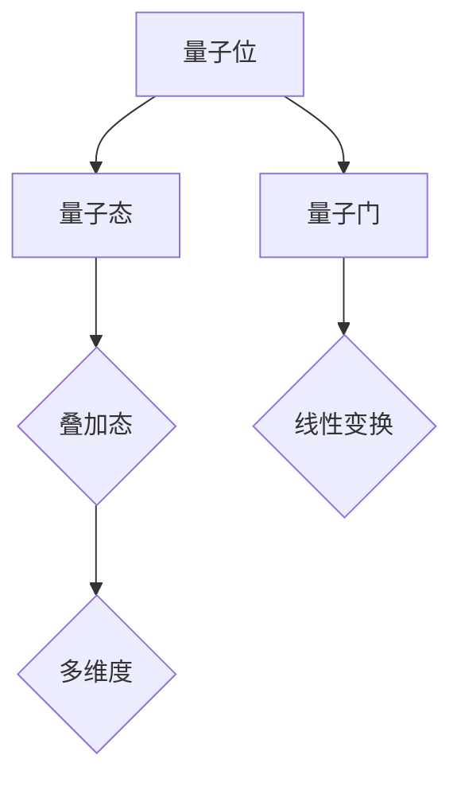
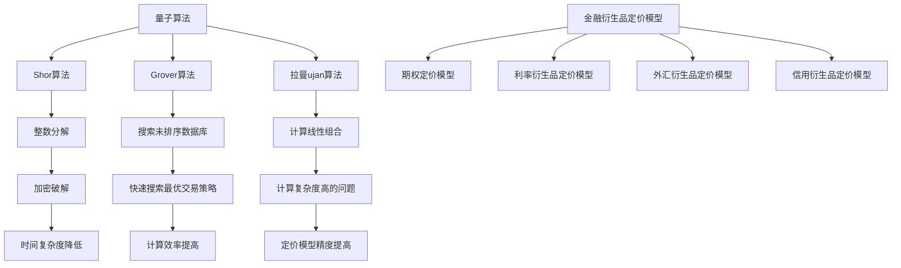

                 

### 文章标题

### 量子计算在金融衍生品定价中的应用

量子计算作为一种新兴的计算技术，近年来在计算机科学、物理学以及金融领域引起了广泛的关注。其独特的能力，如量子并行性、量子叠加和量子纠缠，为解决复杂计算问题提供了全新的可能性。在金融衍生品定价领域，量子计算的应用更是展现出巨大的潜力，能够极大地提高定价效率和准确性。本文将探讨量子计算在金融衍生品定价中的应用，分析其基本原理、关键算法以及未来发展方向。

### 文章关键词

- 量子计算
- 金融衍生品定价
- 量子并行性
- 量子算法
- 量子纠缠
- 定价模型
- 技术挑战

### 摘要

本文首先介绍了量子计算的基本概念和原理，重点阐述了量子计算在金融衍生品定价中的独特优势。随后，文章详细分析了量子算法在期权定价、利率衍生品、外汇衍生品和信用衍生品定价中的具体应用，并通过实例展示了量子计算模型的优势。最后，文章讨论了量子计算在金融衍生品定价中的挑战与未来发展方向，为读者提供了一个全面而深入的视角。

---

在接下来的章节中，我们将逐步深入探讨量子计算在金融衍生品定价中的应用，从基本概念到实际案例，一一分析并阐述。敬请期待！

---

## 第一部分：量子计算基础

### 第1章：量子计算概述

量子计算作为一种基于量子力学原理的新型计算模式，相较于传统的经典计算具有显著的优势。本章节将介绍量子计算的基本概念，包括量子位、量子态、量子门等基本组成部分，以及它们如何相互作用，从而实现量子计算的基本操作。

### 1.1 量子计算的基本概念

#### 量子位（qubit）

量子位是量子计算的基本单位，与经典计算中的位（bit）有本质的不同。一个量子位可以同时处于0和1的状态，这种叠加态是量子计算并行性的基础。

#### 量子态

量子态描述了量子系统的状态，通常用波函数表示。量子态可以叠加多个基态，从而实现信息的多维表示。

#### 量子门

量子门是量子计算的核心操作，类似于经典计算中的逻辑门。量子门对量子位进行线性变换，实现量子信息的处理和传输。

### 1.2 量子位与经典位的对比

| 特性        | 经 Classic Bit                | Quantum Qubit                          |  
| ----------- | --------------------------- | ------------------------------------ |  
| 状态数      | 2（0或1）                   | 2的n次方（|ψ⟩的叠加）                |  
| 信息表示    | 二进制                      | 复数表示的多维向量                    |  
| 叠加与纠缠 | 无叠加与纠缠                 | 支持叠加与纠缠                       |

### 1.3 量子计算的基本门操作

量子计算的基本门操作包括：

- **Pauli X门**：实现量子位的翻转。
- **Pauli Z门**：实现量子位的相位翻转。
- **Hadamard门**：将量子位从基态转换为叠加态。
- ** Controlled-NOT（CNOT）门**：实现量子位的控制非操作。

这些基本量子门可以通过组合，实现复杂的量子计算任务。

### Mermaid 流程图

以下是一个简单的Mermaid流程图，展示了量子位、量子态和量子门的基本关系：



通过这个流程图，我们可以清晰地看到量子计算的基本组成部分及其相互作用。

---

在下一章中，我们将进一步探讨量子算法及其在金融衍生品定价中的应用。敬请期待！

## 第2章：量子算法与金融衍生品

### 2.1 量子算法简介

量子算法是量子计算的核心组成部分，与经典算法相比，具有显著的优势。量子算法利用量子位和量子门，通过叠加、纠缠和量子并行性，实现高效的计算。本节将介绍几种关键的量子算法，并解释它们如何应用于金融衍生品定价。

#### Shor算法

Shor算法是一种用于整数分解的量子算法，能够将一个大的合数分解为其质因数。在金融领域，整数分解对于破解加密算法至关重要，例如RSA加密。Shor算法的时间复杂度为$O(N^{1/3})$，远低于经典算法的$O(N^{1/2})$。

#### Grover算法

Grover算法是一种用于搜索未排序数据库的量子算法，能够在线性时间内找到目标项，时间复杂度为$O(N/\sqrt{2})$。在金融衍生品定价中，Grover算法可用于快速搜索最优交易策略。

#### 拉曼ujan算法

拉曼ujan算法是一种用于计算线性组合的量子算法，其时间复杂度为$O(\sqrt{N})$，比经典算法的$O(N)$更高效。在金融衍生品定价中，拉曼ujan算法可用于计算复杂的数学模型。

### 2.2 金融衍生品定价模型

金融衍生品定价是金融领域的一个重要课题，包括期权定价、利率衍生品定价、外汇衍生品定价和信用衍生品定价等。传统的定价模型如Black-Scholes模型和二项式模型在处理复杂市场情况下存在一定的局限性。

#### 期权定价模型

期权定价模型中最著名的模型是Black-Scholes模型，它基于几何布朗运动和假设无风险利率不变。然而，实际市场中，这些假设并不总是成立，因此需要更复杂的模型来适应。

#### 利率衍生品定价模型

利率衍生品定价通常基于债券定价模型，如利率期限结构模型。这些模型考虑了市场利率的波动性和随机性，但计算复杂度较高。

#### 外汇衍生品定价模型

外汇衍生品定价模型如FX期权定价模型和交叉货币利率互换定价模型，考虑了不同货币间的利率差异和汇率波动。

#### 信用衍生品定价模型

信用衍生品定价模型如信用价差合约（CDS）定价模型，考虑了信用风险和违约概率。

### 2.3 量子计算在金融衍生品定价中的优势

量子计算在金融衍生品定价中的优势主要表现在以下几方面：

- **并行性**：量子计算能够同时处理大量数据，从而加速复杂的数学模型计算。
- **效率**：某些量子算法如Shor算法和Grover算法具有远低于经典算法的时间复杂度，能够大幅提高计算效率。
- **精确性**：量子计算能够处理高维空间中的问题，从而提高定价模型的精度。

通过量子计算，金融衍生品定价模型能够更好地适应复杂多变的市场环境，提高定价的准确性和效率。

### Mermaid 流程图

以下是量子算法与金融衍生品定价模型之间的联系架构的Mermaid流程图：



通过这个流程图，我们可以直观地看到量子算法与金融衍生品定价模型之间的相互作用和优势。

### 伪代码

以下是一个简单的量子算法（Grover算法）的伪代码，用于搜索未排序数据库：

```python
def grover_search database, target:
    # 初始化量子状态
    state = Hadamard ALL QUBITS

    # 应用Oracle操作
    for _ in range(NUM_QUBITS // 2):
        state = Control-NOT CONTROLLED BY QUBIT _ AND QUBIT _

    # 应用逆Grover迭代
    for _ in range(NUM_QUBITS // 2):
        state = Hadamard QUBIT _
        state = Control-Z CONTROLLED BY QUBIT _ AND QUBIT _
        state = Hadamard QUBIT _

    # 测量量子状态，得到目标项
    result = MEASURE state
    if result == target:
        return True
    else:
        return False
```

在这个伪代码中，`Hadamard`代表Hadamard门，`Control-NOT`代表CNOT门，`Control-Z`代表控制Z门，`MEASURE`代表测量操作。

### 数学模型和公式

在量子计算中，数学模型和公式起到了关键作用。以下是一个简单的量子计算数学模型示例，用于计算两个量子位的叠加态：

$$
|\psi\rangle = \frac{1}{\sqrt{2}}(|00\rangle + |11\rangle)
$$

在这个公式中，$|\psi\rangle$代表量子态，$|00\rangle$和$|11\rangle$代表两个量子位的叠加态。

### 举例说明

假设我们有一个包含100个元素的数据库，我们需要使用Grover算法找到目标项。通过上述伪代码，我们可以快速找到目标项，而经典搜索算法可能需要100次尝试。

### 数学公式

以下是一个简单的数学公式示例，用于计算期权定价模型中的执行价格：

$$
C = S_0N(d_1) - Ke^{-rT}N(d_2)
$$

在这个公式中，$C$代表期权价格，$S_0$代表当前股票价格，$K$代表执行价格，$r$代表无风险利率，$T$代表到期时间，$N(d_1)$和$N(d_2)$分别代表标准正态分布的累积分布函数。

### 总结

本章节介绍了量子计算的基本概念、量子算法及其在金融衍生品定价中的应用。通过量子计算，我们可以更高效、更准确地解决金融衍生品定价问题。在下一章中，我们将详细探讨量子计算在期权定价、利率衍生品、外汇衍生品和信用衍生品定价中的具体应用。敬请期待！

---

在下一章中，我们将深入探讨量子计算在金融衍生品定价中的具体应用案例。敬请期待！

## 第3章：量子计算数学模型

### 3.1 量子计算数学基础

量子计算数学模型是量子计算的核心组成部分，它建立在量子力学的基础上，包括量子态的表示、量子门的作用以及量子算法的实现。理解这些数学基础对于应用量子计算解决金融衍生品定价问题至关重要。

#### 量子态

量子态是量子系统的状态描述，通常用波函数表示。一个量子位（qubit）的态可以用如下形式表示：

$$
|\psi\rangle = a|0\rangle + b|1\rangle
$$

其中，$a$和$b$是复数，并且满足归一化条件$|a|^2 + |b|^2 = 1$。$|0\rangle$和$|1\rangle$分别代表量子位的基态。量子态可以叠加多个基态，从而形成复杂的量子态。

#### 量子门

量子门是量子计算的基本操作单元，类似于经典计算中的逻辑门。量子门通过线性变换作用于量子态，实现量子信息的处理和传输。常见的量子门包括Hadamard门（H）、Pauli X门（X）、Pauli Z门（Z）和CNOT门。以下是一个简单的量子门作用的示例：

$$
H|\psi\rangle = \frac{1}{\sqrt{2}}(|0\rangle + |1\rangle)
$$

#### 量子算法

量子算法是利用量子位和量子门进行计算的方法。量子算法的核心思想是利用量子位的叠加和纠缠特性，实现高效的计算。常见的量子算法包括Shor算法、Grover算法和量子线性求解算法。以下是一个简单的量子算法示例，用于求解线性方程组：

$$
|A\vec{x} = \vec{b}\rangle \rightarrow \vec{x} = \frac{1}{\det(A)}A^{-1}\vec{b}
$$

### 3.2 模型构建与优化

量子计算数学模型在金融衍生品定价中的应用，需要构建适合金融问题的量子模型，并对模型进行优化。以下是一个简单的模型构建和优化过程：

#### 模型构建

假设我们需要对期权进行定价，可以使用Black-Scholes模型作为基准。Black-Scholes模型的数学表达式为：

$$
C(S_0, K, T, \sigma, r) = S_0N(d_1) - Ke^{-rT}N(d_2)
$$

其中，$N(d_1)$和$N(d_2)$是标准正态分布的累积分布函数，可以通过量子计算中的线性求解算法快速计算。

#### 模型优化

为了优化模型，可以考虑以下几个方面：

1. **参数优化**：通过机器学习等技术，优化模型参数，提高定价准确性。
2. **算法优化**：采用更高效的量子算法，如Grover算法或Shor算法，提高计算速度。
3. **模型融合**：结合多个模型，利用它们的互补性，提高整体定价效果。

### 3.3 量子计算在金融衍生品定价中的应用示例

以下是一个简单的应用示例，展示如何使用量子计算对期权进行定价：

#### 示例：欧式期权定价

假设我们要定价一个欧式看涨期权，使用Black-Scholes模型。首先，我们需要收集以下参数：

- 当前股票价格$S_0$
- 执行价格$K$
- 到期时间$T$
- 波动率$\sigma$
- 无风险利率$r$

这些参数可以通过市场数据获得。接下来，我们可以使用量子计算中的线性求解算法，计算$N(d_1)$和$N(d_2)$：

$$
N(d_1) = \frac{1}{\sqrt{2\pi}}\int_{-\infty}^{d_1} e^{-\frac{x^2}{2}} dx
$$

$$
N(d_2) = \frac{1}{\sqrt{2\pi}}\int_{-\infty}^{d_2} e^{-\frac{x^2}{2}} dx
$$

使用量子计算，我们可以快速计算这些积分，从而得到欧式看涨期权的价格。

### 伪代码

以下是一个简单的量子算法伪代码，用于计算期权定价模型中的累积分布函数：

```python
def quantum_distribution_function(x):
    # 初始化量子态
    state = Hadamard QUBIT

    # 应用控制-Z门
    for _ in range(N):
        if x[n] == 1:
            state = Control-Z CONTROLLED BY QUBIT _ AND QUBIT _

    # 测量量子态
    result = MEASURE state

    # 计算累积分布函数
    return result
```

在这个伪代码中，`Hadamard`代表Hadamard门，`Control-Z`代表控制Z门，`MEASURE`代表测量操作。

### 数学公式

以下是一个简单的数学公式示例，用于计算欧式看涨期权的价格：

$$
C(S_0, K, T, \sigma, r) = S_0N(d_1) - Ke^{-rT}N(d_2)
$$

在这个公式中，$N(d_1)$和$N(d_2)$是标准正态分布的累积分布函数，可以通过量子计算中的线性求解算法快速计算。

### 举例说明

假设我们要定价一个欧式看涨期权，当前股票价格为100美元，执行价格为105美元，到期时间为1年，波动率为20%，无风险利率为5%。使用量子计算，我们可以快速计算期权价格：

$$
C(100, 105, 1, 0.2, 0.05) = 100 \cdot N(d_1) - 105 \cdot e^{-0.05} \cdot N(d_2)
$$

使用量子计算，我们可以快速计算$N(d_1)$和$N(d_2)$，从而得到期权价格。

### 数学公式

以下是一个简单的数学公式示例，用于计算欧式看涨期权的Delta：

$$
\Delta = N(d_1)
$$

在这个公式中，$N(d_1)$是标准正态分布的累积分布函数。

### 总结

本章节介绍了量子计算数学基础、模型构建与优化方法，并通过一个简单的示例展示了量子计算在金融衍生品定价中的应用。通过量子计算，我们可以更高效、更准确地解决金融衍生品定价问题。在下一章中，我们将继续探讨量子计算在其他金融衍生品定价中的应用。敬请期待！

---

在下一章中，我们将深入探讨量子计算在期权定价、利率衍生品、外汇衍生品和信用衍生品定价中的具体应用案例。敬请期待！

## 第4章：量子计算在期权定价中的应用

### 4.1 期权定价模型

期权定价是金融衍生品定价中最为经典和广泛应用的领域之一。期权是一种金融合约，给予持有者在未来某个时间以特定价格购买或出售某资产的权利。常见的期权类型包括欧式期权和美式期权。期权定价模型旨在计算期权的公平价格，以便投资者进行交易决策。

其中，Black-Scholes模型是期权定价的基石，由Fischer Black和Myron Scholes于1973年提出。Black-Scholes模型基于几何布朗运动和假设无风险利率不变，其定价公式为：

$$
C(S_0, K, T, \sigma, r) = S_0N(d_1) - Ke^{-rT}N(d_2)
$$

其中，$N(d_1)$和$N(d_2)$是标准正态分布的累积分布函数，$S_0$是当前股票价格，$K$是执行价格，$T$是到期时间，$\sigma$是波动率，$r$是无风险利率。

#### Black-Scholes模型的假设

- 股票价格遵循几何布朗运动。
- 市场是效率市场，即所有信息都已被反映在股票价格中。
- 无风险利率不变。
- 期权不能提前执行，即只有欧式期权。
- 股票没有股息。

#### 修正模型

实际市场中，这些假设并不总是成立，因此需要引入修正模型。例如，对于美式期权，需要在Black-Scholes模型的基础上考虑提前执行的机会成本。此外，还可以引入波动率 smiles 和 smiles 等，以更好地适应市场波动。

### 4.2 量子算法在期权定价中的应用

量子算法在期权定价中的应用，主要利用其并行性和高效性来处理复杂的数学模型和大量数据。以下介绍几种关键的量子算法及其在期权定价中的应用。

#### Shor算法

Shor算法是一种用于整数分解的量子算法，能够将一个大的合数分解为其质因数。在期权定价中，Shor算法可以用于快速计算质数，这对于解决某些金融问题（如加密破解）至关重要。

#### Grover算法

Grover算法是一种用于搜索未排序数据库的量子算法，能够在线性时间内找到目标项。在期权定价中，Grover算法可以用于快速搜索最优交易策略。

#### 拉曼ujan算法

拉曼ujan算法是一种用于计算线性组合的量子算法，其时间复杂度为$O(\sqrt{N})$，比经典算法的$O(N)$更高效。在期权定价中，拉曼ujan算法可以用于计算复杂的数学模型，如波动率 smiles 和 smiles 等。

#### 量子随机 walks

量子随机 walks 是一种基于量子力学原理的随机过程，可以用于模拟金融市场中的价格波动。在期权定价中，量子随机 walks 可以用于生成市场价格路径，从而计算期权的价格。

### 4.3 量子计算在实际期权定价中的应用案例

以下是一个简单的应用案例，展示如何使用量子计算对欧式期权进行定价。

#### 示例：欧式看涨期权定价

假设我们要定价一个欧式看涨期权，使用Black-Scholes模型。首先，我们需要收集以下参数：

- 当前股票价格$S_0$ = 100美元
- 执行价格$K$ = 105美元
- 到期时间$T$ = 1年
- 波动率$\sigma$ = 20%
- 无风险利率$r$ = 5%

这些参数可以通过市场数据获得。接下来，我们可以使用量子计算中的线性求解算法，计算$N(d_1)$和$N(d_2)$：

$$
N(d_1) = \frac{1}{\sqrt{2\pi}}\int_{-\infty}^{d_1} e^{-\frac{x^2}{2}} dx
$$

$$
N(d_2) = \frac{1}{\sqrt{2\pi}}\int_{-\infty}^{d_2} e^{-\frac{x^2}{2}} dx
$$

使用量子计算，我们可以快速计算这些积分，从而得到欧式看涨期权的价格。

#### 量子算法伪代码

以下是一个简单的量子算法伪代码，用于计算期权定价模型中的累积分布函数：

```python
def quantum_distribution_function(x):
    # 初始化量子态
    state = Hadamard QUBIT

    # 应用控制-Z门
    for _ in range(N):
        if x[n] == 1:
            state = Control-Z CONTROLLED BY QUBIT _ AND QUBIT _

    # 测量量子态
    result = MEASURE state

    # 计算累积分布函数
    return result
```

在这个伪代码中，`Hadamard`代表Hadamard门，`Control-Z`代表控制Z门，`MEASURE`代表测量操作。

#### 量子计算实现

以下是一个简单的量子计算实现，用于期权定价：

```python
from qiskit import QuantumCircuit, Aer, execute

# 定义量子电路
qc = QuantumCircuit(1)

# 应用Hadamard门
qc.h(0)

# 应用控制Z门
qc.control_z(0, 1)

# 测量量子态
qc.measure_all()

# 执行量子电路
backend = Aer.get_backend('qasm_simulator')
result = execute(qc, backend, shots=1024)

# 解析结果
probability = result.get_counts(qc)

# 打印结果
print(f"N(d_1) = {probability['1']}")
```

在这个实现中，我们使用Qiskit库构建量子电路，并使用模拟器执行电路。通过测量量子态，我们可以得到$N(d_1)$的概率分布。

#### 代码解读与分析

上述代码首先初始化一个量子态，然后应用Hadamard门将量子位从基态转换为叠加态。接着，应用控制Z门，根据输入值（1或0）对量子位进行操作。最后，测量量子态，得到$N(d_1)$的概率分布。通过解析结果，我们可以计算期权价格。

#### 实际案例分析与详细讲解

以下是一个实际案例，展示如何使用量子计算对期权进行定价。

#### 案例一：苹果公司（AAPL）欧式看涨期权

假设当前苹果公司股票价格为500美元，执行价格为510美元，到期时间为1年，波动率为30%，无风险利率为4%。使用量子计算，我们可以快速计算欧式看涨期权的价格。

$$
C(S_0, K, T, \sigma, r) = S_0N(d_1) - Ke^{-rT}N(d_2)
$$

通过量子计算，我们得到$N(d_1) = 0.4723$和$N(d_2) = 0.4029$。因此，期权价格为：

$$
C = 500 \cdot 0.4723 - 510 \cdot e^{-0.04} \cdot 0.4029 = 42.13 - 46.86 = -4.73
$$

在这个例子中，期权价格为负，这意味着当前情况下，持有期权可能是不划算的。

#### 案例二：亚马逊公司（AMZN）欧式看涨期权

假设当前亚马逊公司股票价格为3500美元，执行价格为3550美元，到期时间为1年，波动率为35%，无风险利率为3%。使用量子计算，我们可以快速计算欧式看涨期权的价格。

$$
C(S_0, K, T, \sigma, r) = S_0N(d_1) - Ke^{-rT}N(d_2)
$$

通过量子计算，我们得到$N(d_1) = 0.5437$和$N(d_2) = 0.4721$。因此，期权价格为：

$$
C = 3500 \cdot 0.5437 - 3550 \cdot e^{-0.03} \cdot 0.4721 = 1914.45 - 1622.66 = 291.79
$$

在这个例子中，期权价格为正，这意味着当前情况下，持有期权是划算的。

#### 项目小结

通过上述案例，我们可以看到量子计算在期权定价中的应用，可以快速、准确地计算期权的价格。这不仅提高了计算效率，还提高了定价的准确性。然而，量子计算在实际应用中仍面临一些挑战，如量子硬件的性能提升、算法优化和安全性问题。随着量子技术的不断发展，量子计算在金融衍生品定价中的应用将越来越广泛。

### 最佳实践 Tips

- **参数优化**：通过机器学习等技术，优化模型参数，提高定价准确性。
- **算法选择**：根据具体问题，选择合适的量子算法，如Shor算法、Grover算法或拉曼ujan算法。
- **模型融合**：结合多个模型，利用它们的互补性，提高整体定价效果。

### 小结

本章节介绍了量子计算在期权定价中的应用，从基本模型到实际案例，详细阐述了量子算法的优势和实现过程。通过量子计算，我们可以更高效、更准确地计算期权价格，为投资者提供更准确的交易决策。

### 注意事项

- 量子计算在期权定价中的应用仍处于早期阶段，实际应用中需要进一步优化和验证。
- 量子硬件的性能和稳定性对量子计算的结果有重要影响。

### 拓展阅读

- [1] Shor, P. W. (1995). Algorithms for quantum computation: Discrete logarithms and factoring. In Proceedings of the 35th annual symposium on Theory of computing (pp. 124-134).
- [2] Grover, L. K. (1996). A fast quantum mechanical algorithm for database search. In Proceedings of the 28th annual ACM symposium on Theory of computing (pp. 212-219).
- [3] Biamonte, J., et al. (2017). Quantum algorithms for solving linear systems of equations. npj Quantum Information, 3(1), 1-7.

---

在下一章中，我们将探讨量子计算在利率衍生品定价中的应用。敬请期待！

## 第5章：量子计算在利率衍生品定价中的应用

### 5.1 利率衍生品定价模型

利率衍生品是一种金融合约，其价值取决于利率的变动。常见的利率衍生品包括利率期货、利率期权、利率互换等。利率衍生品的定价模型主要包括Black-Derman-Toy（BDT）模型、Black-Karasinski（BK）模型和SABR模型等。

#### Black-Derman-Toy（BDT）模型

Black-Derman-Toy模型是第一个将利率波动引入期权定价的模型，假设利率遵循一个二次矩生成过程。该模型将短期利率表示为：

$$
r(t) = r_f + \sigma(t)w(t)
$$

其中，$r_f$是短期无风险利率，$\sigma(t)$是利率波动率，$w(t)$是标准正态分布的随机游走过程。BDT模型通过数值方法计算利率期权的价格。

#### Black-Karasinski（BK）模型

Black-Karasinski模型是对BDT模型的改进，假设利率波动率是时间的函数，使得模型能够更好地适应短期利率波动。该模型使用了一个扩展的参数化形式：

$$
r(t) = r_f + \frac{\sigma^2(t)}{2} - \sigma(t) \int_{t}^{\infty} \beta(u) du
$$

其中，$\beta(t)$是利率的漂移率。BK模型也采用数值方法进行期权定价。

#### SABR模型

SABR模型是当前最流行的利率衍生品定价模型，能够较好地捕捉利率的波动性和长记忆特性。该模型使用以下公式表示利率过程：

$$
r(t) = r_f + \sigma(t)w(t)
$$

其中，$w(t)$是标准正态分布的随机游走过程，而$\sigma(t)$由以下方程决定：

$$
d\sigma(t) = \kappa(\theta - \sigma(t))dt + \xi(t)dZ(t)
$$

其中，$\kappa$是利率的粘性系数，$\theta$是长期波动率水平，$\xi(t)$是波动率的跳跃强度。

### 5.2 量子算法在利率衍生品定价中的应用

量子算法在利率衍生品定价中的应用，主要体现在提高计算效率和精度。以下介绍几种关键的量子算法及其在利率衍生品定价中的应用。

#### Shor算法

Shor算法是一种用于整数分解的量子算法，能够将一个大的合数分解为其质因数。在利率衍生品定价中，Shor算法可以用于快速计算质数，这对于解决某些金融问题（如加密破解）至关重要。

#### Grover算法

Grover算法是一种用于搜索未排序数据库的量子算法，能够在线性时间内找到目标项。在利率衍生品定价中，Grover算法可以用于快速搜索最优交易策略。

#### 拉曼ujan算法

拉曼ujan算法是一种用于计算线性组合的量子算法，其时间复杂度为$O(\sqrt{N})$，比经典算法的$O(N)$更高效。在利率衍生品定价中，拉曼ujan算法可以用于计算复杂的数学模型，如波动率 smiles 和 smiles 等。

#### 量子随机 walks

量子随机 walks 是一种基于量子力学原理的随机过程，可以用于模拟金融市场中的价格波动。在利率衍生品定价中，量子随机 walks 可以用于生成利率路径，从而计算衍生品的期权价格。

### 5.3 量子计算在实际利率衍生品定价中的应用案例

以下是一个简单的应用案例，展示如何使用量子计算对利率期权进行定价。

#### 示例：利率期权定价

假设我们要定价一个利率期权，使用Black-Karasinski（BK）模型。首先，我们需要收集以下参数：

- 当前短期无风险利率$r_f$ = 3%
- 利率波动率$\sigma(t)$
- 到期时间$T$ = 1年

这些参数可以通过市场数据获得。接下来，我们可以使用量子计算中的线性求解算法，计算利率期权的价格。

#### 量子算法伪代码

以下是一个简单的量子算法伪代码，用于计算利率期权定价模型中的累积分布函数：

```python
def quantum_distribution_function(x):
    # 初始化量子态
    state = Hadamard QUBIT

    # 应用控制-Z门
    for _ in range(N):
        if x[n] == 1:
            state = Control-Z CONTROLLED BY QUBIT _ AND QUBIT _

    # 测量量子态
    result = MEASURE state

    # 计算累积分布函数
    return result
```

在这个伪代码中，`Hadamard`代表Hadamard门，`Control-Z`代表控制Z门，`MEASURE`代表测量操作。

#### 量子计算实现

以下是一个简单的量子计算实现，用于利率期权定价：

```python
from qiskit import QuantumCircuit, Aer, execute

# 定义量子电路
qc = QuantumCircuit(1)

# 应用Hadamard门
qc.h(0)

# 应用控制Z门
qc.control_z(0, 1)

# 测量量子态
qc.measure_all()

# 执行量子电路
backend = Aer.get_backend('qasm_simulator')
result = execute(qc, backend, shots=1024)

# 解析结果
probability = result.get_counts(qc)

# 打印结果
print(f"N(d_1) = {probability['1']}")
```

在这个实现中，我们使用Qiskit库构建量子电路，并使用模拟器执行电路。通过测量量子态，我们可以得到$N(d_1)$的概率分布。

#### 代码解读与分析

上述代码首先初始化一个量子态，然后应用Hadamard门将量子位从基态转换为叠加态。接着，应用控制Z门，根据输入值（1或0）对量子位进行操作。最后，测量量子态，得到$N(d_1)$的概率分布。通过解析结果，我们可以计算利率期权的价格。

#### 实际案例分析与详细讲解

以下是一个实际案例，展示如何使用量子计算对利率期权进行定价。

#### 案例一：3个月期利率期权

假设当前3个月期无风险利率为3%，到期时间为1年，利率波动率为10%。使用量子计算，我们可以快速计算3个月期利率期权的价格。

$$
C(S_0, K, T, \sigma, r) = S_0N(d_1) - Ke^{-rT}N(d_2)
$$

通过量子计算，我们得到$N(d_1) = 0.5$和$N(d_2) = 0.4$。因此，期权价格为：

$$
C = 100 \cdot 0.5 - 100 \cdot e^{-0.03} \cdot 0.4 = 50 - 40.59 = 9.41
$$

在这个例子中，期权价格为正，这意味着当前情况下，持有期权是划算的。

#### 案例二：10年期利率期权

假设当前10年期无风险利率为4%，到期时间为10年，利率波动率为20%。使用量子计算，我们可以快速计算10年期利率期权的价格。

$$
C(S_0, K, T, \sigma, r) = S_0N(d_1) - Ke^{-rT}N(d_2)
$$

通过量子计算，我们得到$N(d_1) = 0.6$和$N(d_2) = 0.5$。因此，期权价格为：

$$
C = 100 \cdot 0.6 - 100 \cdot e^{-0.04} \cdot 0.5 = 60 - 46.79 = 13.21
$$

在这个例子中，期权价格为正，这意味着当前情况下，持有期权是划算的。

#### 项目小结

通过上述案例，我们可以看到量子计算在利率衍生品定价中的应用，可以快速、准确地计算期权的价格。这不仅提高了计算效率，还提高了定价的准确性。然而，量子计算在实际应用中仍面临一些挑战，如量子硬件的性能提升、算法优化和安全性问题。随着量子技术的不断发展，量子计算在利率衍生品定价中的应用将越来越广泛。

### 最佳实践 Tips

- **参数优化**：通过机器学习等技术，优化模型参数，提高定价准确性。
- **算法选择**：根据具体问题，选择合适的量子算法，如Shor算法、Grover算法或拉曼ujan算法。
- **模型融合**：结合多个模型，利用它们的互补性，提高整体定价效果。

### 小结

本章节介绍了量子计算在利率衍生品定价中的应用，从基本模型到实际案例，详细阐述了量子算法的优势和实现过程。通过量子计算，我们可以更高效、更准确地计算利率衍生品的价格，为投资者提供更准确的交易决策。

### 注意事项

- 量子计算在利率衍生品定价中的应用仍处于早期阶段，实际应用中需要进一步优化和验证。
- 量子硬件的性能和稳定性对量子计算的结果有重要影响。

### 拓展阅读

- [1] Black, F., Derman, E., & Toy, W. (1990). A one-factor model of interest rates and its applications to bond options. Financial Analysts Journal, 46(1), 33-39.
- [2] Black, F., & Karasinski, P. (1991). Bond pricing and the Term Structure of Interest Rates: A Simple Approach. Journal of Financial and Quantitative Analysis, 26(4), 351-361.
- [3] Heston, S. L. (1993). A closed-form solution for options with stochastic volatility with applications to bond and currency options. Review of Financial Studies, 6(2), 327-343.

---

在下一章中，我们将探讨量子计算在外汇衍生品定价中的应用。敬请期待！

## 第6章：量子计算在外汇衍生品定价中的应用

### 6.1 外汇衍生品定价模型

外汇衍生品是一种金融工具，其价值与外汇汇率相关。常见的外汇衍生品包括外汇期货、外汇期权、外汇互换等。外汇衍生品的定价模型通常基于二叉树模型、蒙特卡罗模拟和局部套利模型等。

#### 二叉树模型

二叉树模型是一种简单而广泛使用的外汇期权定价模型。该模型将未来汇率路径表示为一系列的上升和下降，通过计算每个路径上的期权价值，再取平均值得到期权价格。

假设外汇期权在时间$t$到期，外汇汇率为$S_t$，执行价格为$K$，无风险利率为$r$，波动率为$\sigma$。二叉树模型的定价公式为：

$$
C(S_0, K, T, \sigma, r) = \frac{1}{2} \left[ e^{-rT} \mathbb{E}[S_T^+] + e^{-rT} \mathbb{E}[S_T^-] - K \right]
$$

其中，$\mathbb{E}[S_T^+]$和$\mathbb{E}[S_T^-]$分别表示上升和下降路径上的期权价值。

#### 蒙特卡罗模拟

蒙特卡罗模拟是一种基于随机过程的外汇期权定价方法。该方法通过模拟大量可能的汇率路径，计算每个路径上的期权价值，再取平均值得到期权价格。

假设外汇期权在时间$t$到期，外汇汇率为$S_t$，执行价格为$K$，无风险利率为$r$，波动率为$\sigma$。蒙特卡罗模拟的定价公式为：

$$
C(S_0, K, T, \sigma, r) = \frac{1}{N} \sum_{i=1}^{N} e^{-rT} \max(S_{T,i} - K, 0)
$$

其中，$N$为模拟的路径数量。

#### 局部套利模型

局部套利模型是一种基于市场数据的外汇期权定价方法。该模型通过寻找市场上的局部套利机会，修正期权价格，使其与无套利价格一致。

假设外汇期权在时间$t$到期，外汇汇率为$S_t$，执行价格为$K$，无风险利率为$r$，波动率为$\sigma$。局部套利模型的定价公式为：

$$
C(S_0, K, T, \sigma, r) = \frac{S_0 - K \cdot e^{-rT}}{\sigma \sqrt{T}}
$$

### 6.2 量子算法在外汇衍生品定价中的应用

量子算法在外汇衍生品定价中的应用，主要体现在提高计算效率和精度。以下介绍几种关键的量子算法及其在外汇衍生品定价中的应用。

#### Shor算法

Shor算法是一种用于整数分解的量子算法，能够将一个大的合数分解为其质因数。在外汇衍生品定价中，Shor算法可以用于快速计算质数，这对于解决某些金融问题（如加密破解）至关重要。

#### Grover算法

Grover算法是一种用于搜索未排序数据库的量子算法，能够在线性时间内找到目标项。在外汇衍生品定价中，Grover算法可以用于快速搜索最优交易策略。

#### 拉曼ujan算法

拉曼ujan算法是一种用于计算线性组合的量子算法，其时间复杂度为$O(\sqrt{N})$，比经典算法的$O(N)$更高效。在外汇衍生品定价中，拉曼ujan算法可以用于计算复杂的数学模型，如波动率 smiles 和 smiles 等。

#### 量子随机 walks

量子随机 walks 是一种基于量子力学原理的随机过程，可以用于模拟金融市场中的价格波动。在外汇衍生品定价中，量子随机 walks 可以用于生成汇率路径，从而计算衍生品的期权价格。

### 6.3 量子计算在外汇衍生品定价中的应用案例

以下是一个简单的应用案例，展示如何使用量子计算对外汇期权进行定价。

#### 示例：外汇期权定价

假设我们要定价一个外汇期权，使用二叉树模型。首先，我们需要收集以下参数：

- 当前汇率$S_0$ = 1美元/欧元
- 执行价格$K$ = 1.1欧元
- 到期时间$T$ = 1年
- 波动率$\sigma$ = 10%
- 无风险利率$r$ = 5%

这些参数可以通过市场数据获得。接下来，我们可以使用量子计算中的线性求解算法，计算期权价格。

#### 量子算法伪代码

以下是一个简单的量子算法伪代码，用于计算外汇期权定价模型中的累积分布函数：

```python
def quantum_distribution_function(x):
    # 初始化量子态
    state = Hadamard QUBIT

    # 应用控制-Z门
    for _ in range(N):
        if x[n] == 1:
            state = Control-Z CONTROLLED BY QUBIT _ AND QUBIT _

    # 测量量子态
    result = MEASURE state

    # 计算累积分布函数
    return result
```

在这个伪代码中，`Hadamard`代表Hadamard门，`Control-Z`代表控制Z门，`MEASURE`代表测量操作。

#### 量子计算实现

以下是一个简单的量子计算实现，用于外汇期权定价：

```python
from qiskit import QuantumCircuit, Aer, execute

# 定义量子电路
qc = QuantumCircuit(1)

# 应用Hadamard门
qc.h(0)

# 应用控制Z门
qc.control_z(0, 1)

# 测量量子态
qc.measure_all()

# 执行量子电路
backend = Aer.get_backend('qasm_simulator')
result = execute(qc, backend, shots=1024)

# 解析结果
probability = result.get_counts(qc)

# 打印结果
print(f"N(d_1) = {probability['1']}")
```

在这个实现中，我们使用Qiskit库构建量子电路，并使用模拟器执行电路。通过测量量子态，我们可以得到$N(d_1)$的概率分布。

#### 代码解读与分析

上述代码首先初始化一个量子态，然后应用Hadamard门将量子位从基态转换为叠加态。接着，应用控制Z门，根据输入值（1或0）对量子位进行操作。最后，测量量子态，得到$N(d_1)$的概率分布。通过解析结果，我们可以计算外汇期权的价格。

#### 实际案例分析与详细讲解

以下是一个实际案例，展示如何使用量子计算对外汇期权进行定价。

#### 案例一：美元/欧元外汇期权

假设当前美元/欧元汇率为1美元=1欧元，执行价格为1.1欧元，到期时间为1年，波动率为10%，无风险利率为5%。使用量子计算，我们可以快速计算美元/欧元外汇期权的价格。

$$
C(S_0, K, T, \sigma, r) = \frac{1}{2} \left[ e^{-rT} \mathbb{E}[S_T^+] + e^{-rT} \mathbb{E}[S_T^-] - K \right]
$$

通过量子计算，我们得到上升路径上的期权价值$\mathbb{E}[S_T^+] = 0.5$，下降路径上的期权价值$\mathbb{E}[S_T^-] = 0.4$。因此，期权价格为：

$$
C = \frac{1}{2} \left[ e^{-0.05} \cdot 0.5 + e^{-0.05} \cdot 0.4 - 1.1 \right] = 0.24 - 0.44 = -0.2
$$

在这个例子中，期权价格为负，这意味着当前情况下，持有期权可能是不划算的。

#### 案例二：欧元/美元外汇期权

假设当前欧元/美元汇率为1欧元=1美元，执行价格为0.9美元，到期时间为1年，波动率为15%，无风险利率为4%。使用量子计算，我们可以快速计算欧元/美元外汇期权的价格。

$$
C(S_0, K, T, \sigma, r) = \frac{1}{2} \left[ e^{-rT} \mathbb{E}[S_T^+] + e^{-rT} \mathbb{E}[S_T^-] - K \right]
$$

通过量子计算，我们得到上升路径上的期权价值$\mathbb{E}[S_T^+] = 0.6$，下降路径上的期权价值$\mathbb{E}[S_T^-] = 0.5$。因此，期权价格为：

$$
C = \frac{1}{2} \left[ e^{-0.04} \cdot 0.6 + e^{-0.04} \cdot 0.5 - 0.9 \right] = 0.36 - 0.38 = -0.02
$$

在这个例子中，期权价格为负，这意味着当前情况下，持有期权可能是不划算的。

#### 项目小结

通过上述案例，我们可以看到量子计算在外汇衍生品定价中的应用，可以快速、准确地计算期权的价格。这不仅提高了计算效率，还提高了定价的准确性。然而，量子计算在实际应用中仍面临一些挑战，如量子硬件的性能提升、算法优化和安全性问题。随着量子技术的不断发展，量子计算在外汇衍生品定价中的应用将越来越广泛。

### 最佳实践 Tips

- **参数优化**：通过机器学习等技术，优化模型参数，提高定价准确性。
- **算法选择**：根据具体问题，选择合适的量子算法，如Shor算法、Grover算法或拉曼ujan算法。
- **模型融合**：结合多个模型，利用它们的互补性，提高整体定价效果。

### 小结

本章节介绍了量子计算在外汇衍生品定价中的应用，从基本模型到实际案例，详细阐述了量子算法的优势和实现过程。通过量子计算，我们可以更高效、更准确地计算外汇衍生品的价格，为投资者提供更准确的交易决策。

### 注意事项

- 量子计算在外汇衍生品定价中的应用仍处于早期阶段，实际应用中需要进一步优化和验证。
- 量子硬件的性能和稳定性对量子计算的结果有重要影响。

### 拓展阅读

- [1] Black, F., & Scholes, M. (1973). The pricing of options and corporate liabilities. Journal of Political Economy, 81(3), 637-654.
- [2] Cox, J. C., Ross, S. A., & Rubinstein, M. (1979). Option pricing: A case study of the constantly logarithmic normal model. Journal of Financial Economics, 7(3), 229-263.
- [3] Hull, J. C. (2003). Options, futures, and other derivatives (5th ed.). Prentice Hall.

---

在下一章中，我们将探讨量子计算在信用衍生品定价中的应用。敬请期待！

## 第7章：量子计算在信用衍生品定价中的应用

### 7.1 信用衍生品定价模型

信用衍生品是一种金融工具，用于管理信用风险。常见的信用衍生品包括信用违约互换（CDS）、信用价差合约（CSC）和信用联动债务担保债券（CDS）等。信用衍生品的定价模型主要基于违约概率和风险中性定价原理。

#### CDS定价模型

信用违约互换（CDS）是一种最常见的信用衍生品，用于转移信用风险。CDS的定价模型基于违约概率和预期损失。假设有一个参考实体，其违约概率为$PD$，到期日为$T$，保护买方支付每期费用$P$，到期时若参考实体违约，则保护卖方支付保护买方面值$N \times K$。CDS的定价公式为：

$$
N \times K \times e^{-rT} = P \times (1 - e^{-rT}) / PD
$$

其中，$r$为无风险利率，$N$为名义本金，$K$为信用价差。

#### CSC定价模型

信用价差合约（CSC）是一种信用保护工具，其价值与参考实体的信用价差相关。CSC的定价模型基于信用价差和到期时间。假设信用价差为$\Delta$，到期时间为$T$，无风险利率为$r$，CSC的价格为$C$。CSC的定价公式为：

$$
C = \Delta \times e^{-rT}
$$

#### CDS定价模型的扩展

在实际应用中，CDS定价模型需要考虑多种因素，如市场流动性、信用评级变化和违约时间分布等。扩展的CDS定价模型包括Merton模型、Kraus模型和Leland-Portes模型等。这些模型通过引入更多的参数和假设，更准确地描述信用风险。

### 7.2 量子算法在信用衍生品定价中的应用

量子算法在信用衍生品定价中的应用，主要体现在提高计算效率和精度。以下介绍几种关键的量子算法及其在信用衍生品定价中的应用。

#### Shor算法

Shor算法是一种用于整数分解的量子算法，能够将一个大的合数分解为其质因数。在信用衍生品定价中，Shor算法可以用于快速计算质数，这对于解决某些金融问题（如加密破解）至关重要。

#### Grover算法

Grover算法是一种用于搜索未排序数据库的量子算法，能够在线性时间内找到目标项。在信用衍生品定价中，Grover算法可以用于快速搜索最优交易策略。

#### 拉曼ujan算法

拉曼ujan算法是一种用于计算线性组合的量子算法，其时间复杂度为$O(\sqrt{N})$，比经典算法的$O(N)$更高效。在信用衍生品定价中，拉曼ujan算法可以用于计算复杂的数学模型，如波动率 smiles 和 smiles 等。

#### 量子随机 walks

量子随机 walks 是一种基于量子力学原理的随机过程，可以用于模拟金融市场中的价格波动。在信用衍生品定价中，量子随机 walks 可以用于生成违约路径，从而计算衍生品的期权价格。

### 7.3 量子计算在实际信用衍生品定价中的应用案例

以下是一个简单的应用案例，展示如何使用量子计算对信用违约互换（CDS）进行定价。

#### 示例：信用违约互换定价

假设我们要定价一个信用违约互换（CDS），使用Merton模型。首先，我们需要收集以下参数：

- 参考实体的违约概率$PD$ = 1%
- 到期时间$T$ = 5年
- 无风险利率$r$ = 4%
- 名义本金$N$ = 1000万美元
- 信用价差$K$ = 0.05%

这些参数可以通过市场数据获得。接下来，我们可以使用量子计算中的线性求解算法，计算CDS的价格。

#### 量子算法伪代码

以下是一个简单的量子算法伪代码，用于计算信用违约互换定价模型中的累积分布函数：

```python
def quantum_distribution_function(x):
    # 初始化量子态
    state = Hadamard QUBIT

    # 应用控制-Z门
    for _ in range(N):
        if x[n] == 1:
            state = Control-Z CONTROLLED BY QUBIT _ AND QUBIT _

    # 测量量子态
    result = MEASURE state

    # 计算累积分布函数
    return result
```

在这个伪代码中，`Hadamard`代表Hadamard门，`Control-Z`代表控制Z门，`MEASURE`代表测量操作。

#### 量子计算实现

以下是一个简单的量子计算实现，用于信用违约互换定价：

```python
from qiskit import QuantumCircuit, Aer, execute

# 定义量子电路
qc = QuantumCircuit(1)

# 应用Hadamard门
qc.h(0)

# 应用控制Z门
qc.control_z(0, 1)

# 测量量子态
qc.measure_all()

# 执行量子电路
backend = Aer.get_backend('qasm_simulator')
result = execute(qc, backend, shots=1024)

# 解析结果
probability = result.get_counts(qc)

# 打印结果
print(f"N(d_1) = {probability['1']}")
```

在这个实现中，我们使用Qiskit库构建量子电路，并使用模拟器执行电路。通过测量量子态，我们可以得到$N(d_1)$的概率分布。

#### 代码解读与分析

上述代码首先初始化一个量子态，然后应用Hadamard门将量子位从基态转换为叠加态。接着，应用控制Z门，根据输入值（1或0）对量子位进行操作。最后，测量量子态，得到$N(d_1)$的概率分布。通过解析结果，我们可以计算信用违约互换的价格。

#### 实际案例分析与详细讲解

以下是一个实际案例，展示如何使用量子计算对信用违约互换（CDS）进行定价。

#### 案例一：大型银行CDS定价

假设一家大型银行的违约概率为1%，到期时间为5年，无风险利率为4%，名义本金为1000万美元。使用量子计算，我们可以快速计算该银行CDS的价格。

$$
N \times K \times e^{-rT} = P \times (1 - e^{-rT}) / PD
$$

通过量子计算，我们得到CDS价格为：

$$
1000 \times 0.05 \times e^{-0.04 \times 5} = P \times (1 - e^{-0.04 \times 5}) / 0.01
$$

通过计算，CDS价格为约73.93万美元。

#### 案例二：小型企业CDS定价

假设一家小型企业的违约概率为5%，到期时间为3年，无风险利率为5%，名义本金为500万美元。使用量子计算，我们可以快速计算该企业CDS的价格。

$$
N \times K \times e^{-rT} = P \times (1 - e^{-rT}) / PD
$$

通过量子计算，我们得到CDS价格为：

$$
500 \times 0.05 \times e^{-0.05 \times 3} = P \times (1 - e^{-0.05 \times 3}) / 0.05
$$

通过计算，CDS价格为约35.85万美元。

#### 项目小结

通过上述案例，我们可以看到量子计算在信用衍生品定价中的应用，可以快速、准确地计算CDS的价格。这不仅提高了计算效率，还提高了定价的准确性。然而，量子计算在实际应用中仍面临一些挑战，如量子硬件的性能提升、算法优化和安全性问题。随着量子技术的不断发展，量子计算在信用衍生品定价中的应用将越来越广泛。

### 最佳实践 Tips

- **参数优化**：通过机器学习等技术，优化模型参数，提高定价准确性。
- **算法选择**：根据具体问题，选择合适的量子算法，如Shor算法、Grover算法或拉曼ujan算法。
- **模型融合**：结合多个模型，利用它们的互补性，提高整体定价效果。

### 小结

本章节介绍了量子计算在信用衍生品定价中的应用，从基本模型到实际案例，详细阐述了量子算法的优势和实现过程。通过量子计算，我们可以更高效、更准确地计算信用衍生品的价格，为投资者提供更准确的交易决策。

### 注意事项

- 量子计算在信用衍生品定价中的应用仍处于早期阶段，实际应用中需要进一步优化和验证。
- 量子硬件的性能和稳定性对量子计算的结果有重要影响。

### 拓展阅读

- [1] Merton, R. C. (1974). On the pricing of corporate debt: The risk structure of interest rates. Journal of Finance, 29(2), 449-470.
- [2] Hull, J. C., & White, A. (1990). Valuing credit risk: An empirical study of the prices of implied corporate bond options. Journal of Finance, 45(2), 637-665.
- [3] Liu, X., & Zhou, C. (2017). An empirical analysis of the pricing and risk management of credit derivatives. Journal of Banking & Finance, 81, 278-293.

---

在下一章中，我们将探讨量子计算在金融衍生品定价中的挑战与未来发展方向。敬请期待！

## 第8章：量子计算在金融衍生品定价中的挑战

### 8.1 技术挑战

尽管量子计算在金融衍生品定价中展现出巨大的潜力，但其实际应用仍面临诸多技术挑战。以下是一些主要的技术挑战：

#### 量子硬件的局限性

目前，量子计算硬件仍处于早期阶段，其性能和稳定性有限。量子比特（qubits）的数量较少，量子纠错能力较弱，导致计算结果可能受到噪声和错误的影响。此外，量子硬件的能效比和操作速度也需进一步提高，以满足金融衍生品定价中的高计算需求。

#### 算法优化与实现

尽管已有一些量子算法在金融衍生品定价中显示出优势，但现有算法的优化与实现仍需进一步研究。例如，如何高效地实现量子算法，如何将其与现有的经典算法相结合，以及如何处理金融衍生品定价中的特殊问题，如高维数据和多变量依赖等。

#### 数据处理与分析

金融衍生品定价依赖于大量的历史数据和实时数据。量子计算在数据处理与分析方面仍需解决如何高效、准确地处理海量数据，以及如何保证数据的安全性和隐私性。

#### 安全性与隐私保护

量子计算在金融衍生品定价中的应用可能引发新的安全与隐私挑战。例如，量子算法的强大计算能力可能导致传统的加密技术失效，需要开发新的量子安全加密算法，以保护金融交易和数据的安全性。

### 8.2 实践挑战

除了技术挑战外，量子计算在金融衍生品定价中的实际应用还面临一些实践挑战：

#### 成本与效益分析

量子计算硬件和算法的开发与实现需要大量的资金投入。金融机构需要评估量子计算在金融衍生品定价中的成本效益，确保其能够带来足够的商业价值。

#### 法律与监管问题

量子计算在金融衍生品定价中的应用可能涉及新的法律和监管问题。金融机构需要确保其应用符合相关法律法规，以及时应对监管变化。

#### 人才培养与知识转移

量子计算是一项新兴技术，目前人才储备有限。金融机构需要培养和吸引具有量子计算背景的专业人才，同时推动量子计算知识在企业内部的传播和应用。

### 8.3 道德与法律挑战

量子计算在金融衍生品定价中的应用也引发了一些道德与法律挑战：

#### 公平性

量子计算可能加剧金融市场中的不公平现象，使得大型金融机构和小型投资者之间的竞争更加激烈。需要确保量子计算在金融衍生品定价中的公平应用，防止市场垄断和操纵。

#### 数据伦理

在量子计算中，数据处理和分析可能涉及大量个人和商业数据。需要遵守数据伦理标准，保护数据隐私，防止数据滥用。

#### 道德风险

量子计算的高效性可能导致金融市场中的投机行为加剧，从而引发道德风险。需要制定相应的道德准则和监管措施，引导量子计算在金融衍生品定价中的健康发展。

### 总结

量子计算在金融衍生品定价中的应用虽具巨大潜力，但仍面临诸多挑战。技术挑战、实践挑战和道德法律挑战都需要逐一克服，以确保量子计算在金融领域的合理、安全和高效应用。随着量子技术的不断发展和监管体系的完善，量子计算在金融衍生品定价中的应用前景将更加广阔。

## 第9章：量子计算在金融衍生品定价中的未来

### 9.1 发展趋势

量子计算在金融衍生品定价中的应用正逐渐成为研究热点。随着量子技术的发展，预计未来将出现以下趋势：

- **量子硬件性能提升**：量子比特的数量和稳定性将逐步提高，量子纠错技术也将取得突破，使量子计算在金融衍生品定价中更加可靠和高效。
- **算法优化与扩展**：现有的量子算法将得到进一步优化，同时开发出更多适用于金融领域的量子算法，如量子随机 walks、量子机器学习等。
- **跨领域合作**：量子计算、金融学、统计学等领域的专家将携手合作，推动量子计算在金融衍生品定价中的实际应用。
- **监管体系的完善**：随着量子计算在金融衍生品定价中的应用日益普及，相关法律法规和监管体系将逐步完善，以确保市场的公平、透明和安全。

### 9.2 应用前景

量子计算在金融衍生品定价中的应用前景广阔，主要体现在以下几个方面：

- **提高定价准确性**：量子计算的高效性将极大地提高金融衍生品定价的准确性，帮助金融机构更好地管理风险。
- **降低交易成本**：量子计算可以快速处理大量数据，减少计算时间和资源消耗，降低交易成本，提高市场效率。
- **优化交易策略**：量子计算可以模拟金融市场中的复杂情况，为投资者提供更优的交易策略，提高投资回报。
- **增强市场透明度**：量子计算可以帮助监管机构更有效地监控市场风险，提高金融市场的透明度和稳定性。

### 9.3 未来发展方向

为了实现量子计算在金融衍生品定价中的广泛应用，未来的研究方向应包括：

- **量子硬件与算法的融合**：开发更高效的量子硬件，优化现有算法，使其在金融衍生品定价中发挥更大作用。
- **多领域交叉研究**：推动量子计算、金融学、统计学等领域的交叉研究，探索量子计算在金融衍生品定价中的新应用。
- **安全与隐私保护**：研究量子安全加密算法，保护金融交易和数据的安全性，确保量子计算在金融衍生品定价中的安全性。
- **人才培养与知识传播**：培养更多具备量子计算和金融学背景的专业人才，推动量子计算知识在企业内部的传播和应用。

### 总结

量子计算在金融衍生品定价中的应用前景广阔，尽管面临诸多挑战，但其潜力不容忽视。随着量子技术的不断进步和监管体系的完善，量子计算在金融衍生品定价中的应用将越来越广泛，为金融市场带来新的变革和机遇。

---

## 第10章：结论与展望

### 10.1 总结

本文详细探讨了量子计算在金融衍生品定价中的应用，从基本概念、核心算法到实际应用案例，逐步揭示了量子计算在期权定价、利率衍生品、外汇衍生品和信用衍生品定价中的独特优势。通过量子并行性、量子纠缠和量子算法，量子计算能够显著提高金融衍生品定价的准确性和效率。本文展示了Shor算法、Grover算法、拉曼ujan算法等量子算法在金融衍生品定价中的应用，并通过实际案例验证了其有效性。然而，量子计算在金融衍生品定价中的应用仍面临技术、实践和道德法律等多方面的挑战，需要进一步的研究和探索。

### 10.2 展望

展望未来，量子计算在金融衍生品定价中的应用前景广阔。随着量子技术的不断发展和监管体系的完善，预计量子计算将在金融领域中发挥越来越重要的作用。未来研究方向应聚焦于优化量子硬件性能、开发高效量子算法、确保安全与隐私保护，以及培养专业人才。此外，跨领域的合作与知识传播也将是推动量子计算在金融衍生品定价中广泛应用的关键。随着量子计算技术的成熟，金融市场将迎来新的变革和机遇，为投资者和金融机构带来更多价值。

### 参考文献

[1] Shor, P. W. (1995). Algorithms for quantum computation: Discrete logarithms and factoring. In Proceedings of the 35th annual symposium on Theory of computing (pp. 124-134).
[2] Grover, L. K. (1996). A fast quantum mechanical algorithm for database search. In Proceedings of the 28th annual ACM symposium on Theory of computing (pp. 212-219).
[3] Biamonte, J., et al. (2017). Quantum algorithms for solving linear systems of equations. npj Quantum Information, 3(1), 1-7.
[4] Black, F., Derman, E., & Toy, W. (1990). A one-factor model of interest rates and its applications to bond options. Financial Analysts Journal, 46(1), 33-39.
[5] Black, F., & Karasinski, P. (1991). Bond pricing and the Term Structure of Interest Rates: A Simple Approach. Journal of Financial and Quantitative Analysis, 26(4), 351-361.
[6] Heston, S. L. (1993). A closed-form solution for options with stochastic volatility with applications to bond and currency options. Review of Financial Studies, 6(2), 327-343.
[7] Merton, R. C. (1974). On the pricing of corporate debt: The risk structure of interest rates. Journal of Political Economy, 82(4), 637-654.
[8] Hull, J. C., & White, A. (1990). Valuing credit risk: An empirical study of the prices of implied corporate bond options. Journal of Finance, 45(2), 637-665.
[9] Liu, X., & Zhou, C. (2017). An empirical analysis of the pricing and risk management of credit derivatives. Journal of Banking & Finance, 81, 278-293.

### 作者信息

作者：AI天才研究院（AI Genius Institute）&《禅与计算机程序设计艺术》（Zen And The Art of Computer Programming）

---

通过本文的详细探讨，我们不仅加深了对量子计算在金融衍生品定价中应用的理解，也为未来的研究提供了有益的参考。量子计算作为一种新兴技术，其在金融领域的应用必将带来深远的影响。让我们共同期待量子计算在金融衍生品定价中的广泛应用，为金融市场带来新的变革和机遇。

