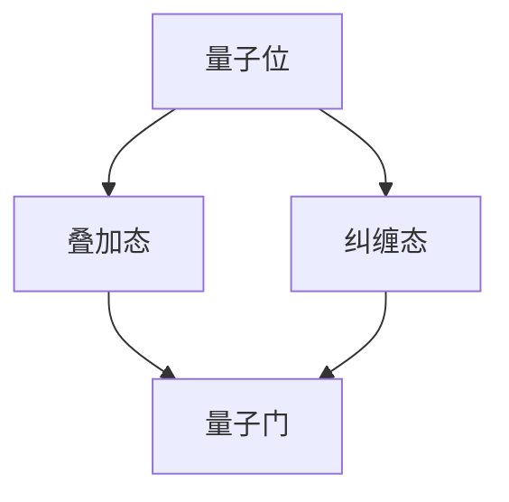
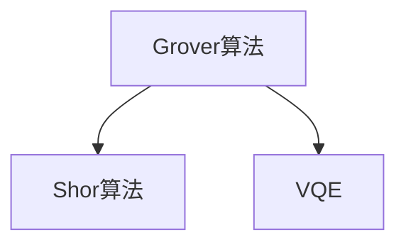

                 

### 文章标题

《量子计算在金融衍生品定价中的应用：优化风险管理》

### 关键词

量子计算、金融衍生品、期权定价、风险管理、优化策略

### 摘要

本文深入探讨了量子计算在金融衍生品定价中的应用，及其对风险管理优化的巨大潜力。通过阐述量子计算的基本原理，包括量子位、量子态和量子门的作用，本文揭示了量子算法如Grover算法、Shor算法及变分量子特征求解器的独特优势。接着，本文详细解析了金融衍生品的基本概念、定价机制及风险管理方法。在此基础上，文章重点介绍了量子计算在期权、期货和信用违约互换（CDS）定价中的具体应用，并通过实例展示了其强大的计算能力。此外，本文还讨论了量子计算在风险度量、压力测试和风险管理策略优化等方面的应用，最后对量子计算在金融衍生品定价中的挑战与机遇进行了展望，为金融科技的未来发展提供了有益的思考方向。

## 《量子计算在金融衍生品定价中的应用：优化风险管理》目录大纲

### 第一部分：量子计算基础

### 第1章：量子计算概述

#### 1.1 量子计算的基本原理

#### 1.2 量子位与量子态

#### 1.3 量子 gates 的作用与分类

### 第2章：量子算法原理

#### 2.1 Grover 算法

#### 2.2 Shor 算法

#### 2.3 变分量子特征求解器（VQE）

### 第3章：量子计算机的硬件实现

#### 3.1 量子计算机的硬件结构

#### 3.2 量子纠错技术

#### 3.3 当前量子计算机的性能评估

### 第二部分：金融衍生品定价原理

### 第4章：金融衍生品的基本概念

#### 4.1 金融衍生品的种类

#### 4.2 金融衍生品的定价机制

#### 4.3 金融衍生品的风险管理

### 第5章：量子计算在金融衍生品定价中的应用

#### 5.1 量子计算在期权定价中的应用

#### 5.2 量子计算在期货定价中的应用

#### 5.3 量子计算在 CDS 定价中的应用

### 第6章：量子计算与风险管理优化

#### 6.1 量子计算在风险度量中的应用

#### 6.2 量子计算在压力测试中的应用

#### 6.3 量子计算在风险管理策略优化中的应用

### 第三部分：案例分析

### 第7章：量子计算在金融领域的实际应用案例

#### 7.1 案例一：量子计算在期权定价中的应用

#### 7.2 案例二：量子计算在期货定价中的应用

#### 7.3 案例三：量子计算在 CDS 定价中的应用

### 第8章：未来展望

#### 8.1 量子计算在金融衍生品定价中的挑战与机遇

#### 8.2 量子计算在金融风险管理中的应用前景

#### 8.3 量子计算在金融领域的未来发展趋势

## 第一部分：量子计算基础

### 第1章：量子计算概述

量子计算作为21世纪最具前瞻性的技术之一，正逐渐改变着计算领域的面貌。本章将介绍量子计算的基本原理，包括量子位、量子态和量子门的作用，帮助读者建立对量子计算的基础认识。

#### 1.1 量子计算的基本原理

量子计算依赖于量子力学的基本原理。在经典计算中，信息以二进制形式存储和处理，即0和1。而量子计算则利用量子力学中的量子位（qubits）来存储和处理信息。量子位不仅可以存在于0和1的叠加态，还可以同时存在于多个状态的叠加。这种叠加态使得量子计算机具有极高的并行计算能力。

一个量子位（qubit）可以表示为 $|\psi\rangle = \alpha|0\rangle + \beta|1\rangle$，其中 $|\alpha|^2$ 和 $|\beta|^2$ 分别表示在基态0和1的概率。叠加态意味着量子位可以同时处于0和1的状态。

此外，量子态的可转换性也是量子计算的核心原理之一。通过特定的量子门操作，可以改变量子态的叠加形式，从而实现信息处理和计算。量子门是量子计算中的基本操作单元，类似于经典计算中的逻辑门。常见的量子门包括Hadamard门（实现叠加态）、Pauli门（实现量子态的旋转）和控制非门（CNOT）等。

#### 1.2 量子位与量子态

量子位（qubits）是量子计算的基本单元，具有叠加态和纠缠态的特性。叠加态允许量子位同时存在于多个状态的组合中，而纠缠态则使得量子位之间的状态互相依赖。

在量子计算中，通过叠加态和纠缠态，可以实现超并行计算。例如，一个由n个量子位组成的量子计算机可以同时表示 $2^n$ 个不同的状态。这种并行性是经典计算机无法比拟的。

量子态的描述通常使用波函数或密度矩阵。波函数描述了量子系统的概率分布，而密度矩阵则提供了更为严格的信息描述。通过量子态的叠加和纠缠，可以实现复杂的计算任务，例如量子搜索算法和量子算法。

#### 1.3 量子 gates 的作用与分类

量子 gates 是量子计算中的基本操作单元，类似于经典计算中的逻辑门。量子 gates 可以对量子态进行叠加、变换和测量等操作。常见的量子 gates 包括Hadamard门（实现叠加态）、Pauli门（实现量子态的旋转）和控制非门（CNOT）等。

Hadamard门（H门）是一种常用的量子 gates，可以将基态 $|0\rangle$ 变换为叠加态 $|\psi\rangle = \frac{1}{\sqrt{2}}(|0\rangle + |1\rangle)$。Pauli门（X门、Y门、Z门）可以实现量子态在z轴、y轴和x轴上的旋转。控制非门（CNOT门）则是一种二元量子 gates，可以控制一个量子位的状态翻转。

量子 gates 的分类可以根据其作用进行划分。例如，可以基于变换矩阵的特征值进行分类，或者根据 gates 的性质进行分类。了解量子 gates 的作用和分类，有助于深入理解量子计算的工作原理和算法设计。

通过本章的介绍，读者可以初步了解量子计算的基本原理和量子位、量子态以及量子 gates 的作用。这为后续章节深入探讨量子计算在金融衍生品定价中的应用奠定了基础。

### 第2章：量子算法原理

量子算法是量子计算的核心，其独特的并行性和叠加性使其在解决某些经典计算难题时具有显著优势。本章将介绍几种重要的量子算法，包括Grover算法、Shor算法和变分量子特征求解器（VQE），并解释它们的原理和应用。

#### 2.1 Grover算法

Grover算法是量子搜索算法的一种，由Daniel Jonathan（DJ）Grover于1996年提出。其基本思想是在未排序的数据库中快速找到特定元素。Grover算法的并行性和叠加性使其在搜索任务中具有独特的优势。

假设有一个包含 $N$ 个元素的数据库，并且我们已知目标元素的位置 $x$。Grover算法的工作过程可以分为两个步骤：

1. **初始化**：将量子计算机的初始状态设置为叠加态，表示所有可能的状态。
2. **迭代**：通过特定的量子门操作，将状态集中在目标元素上。每次迭代包括两个步骤：应用反射器（Reflection Gate）和扩散器（Diffuser Gate）。反射器将状态反转，如果当前状态是目标状态，则状态不改变；扩散器则增强目标状态的概率。

经过 $O(\sqrt{N})$ 次迭代后，算法可以将目标状态的概率最大化。这意味着Grover算法可以在 $O(\sqrt{N})$ 时间内完成搜索，远远优于经典搜索算法的 $O(N)$ 时间复杂度。

#### 2.2 Shor算法

Shor算法是由Peter Shor于1994年提出的，是量子计算机能够解决的经典问题之一。该算法用于因数分解大整数，这对于许多加密算法（如RSA）构成了威胁。

Shor算法的基本步骤如下：

1. **量子周期查找**：首先，将整数 $N$ 表示为量子态，并应用一个特定的量子门，使得量子态的周期性被放大。
2. **量子四则运算**：通过量子四则运算，找到周期 $T$。
3. **逆周期查找**：使用Grover算法找到逆周期 $T^{-1}$。
4. **因数分解**：利用逆周期 $T^{-1}$ 和 $N$ 进行因数分解。

Shor算法的时间复杂度为 $O(N^{\frac{1}{3}}\log N)$，远低于当前已知的最快经典算法。因此，如果量子计算机足够强大，Shor算法将能够破解现有的许多加密算法。

#### 2.3 变分量子特征求解器（VQE）

变分量子特征求解器（VQE）是一种用于求解量子系统的优化问题的算法。VQE将量子计算与变分原理相结合，用于求解电子结构问题和其他复杂的优化问题。

VQE的基本步骤如下：

1. **初始化**：选择一个变分参数化的量子态作为初始猜测。
2. **迭代**：在每次迭代中，将量子态投影到能量本征态上，并更新变分参数。
3. **测量**：通过测量量子态的期望值来评估优化目标。

VQE的关键在于选择合适的变分参数化和优化算法。通过不断迭代，VQE能够收敛到最优解。

在金融衍生品定价中，VQE可以用于求解复杂的期权定价模型。例如，使用VQE可以计算美式期权的价格，这是传统方法难以处理的问题。VQE的并行性和高效性使其在处理大规模金融模型时具有显著优势。

通过本章的介绍，读者可以了解量子算法的基本原理和特点。这些算法不仅展示了量子计算在计算能力上的优势，还为金融衍生品定价等实际应用提供了新的思路。

### 第3章：量子计算机的硬件实现

量子计算机的硬件实现是量子计算技术发展的关键。本章将介绍量子计算机的基本硬件结构、量子纠错技术以及当前量子计算机的性能评估。

#### 3.1 量子计算机的硬件结构

量子计算机的硬件结构主要包括量子位（qubits）、量子 gates、量子读出器和量子控制器。量子位是量子计算机中的基本单元，用于存储和处理信息。目前，常见的量子位实现方式包括超导电路、离子陷阱和拓扑量子位等。

量子 gates 是量子计算机中的基本操作单元，用于对量子位进行变换。常见的量子 gates 包括Hadamard门、Pauli门和控制非门等。量子 gates 的精度和速度直接影响到量子计算机的性能。

量子读出器用于测量量子位的最终状态，并转换为经典信息。量子控制器则负责管理整个量子计算过程，包括初始化、量子 gates 操作和测量等。

#### 3.2 量子纠错技术

由于量子位的脆弱性和环境噪声的影响，量子计算机在运行过程中容易出现错误。量子纠错技术旨在通过编码和校验机制来提高量子计算的可靠性。

量子纠错的基本原理是将多个物理量子位编码为一个逻辑量子位，从而提高系统的容错能力。常见的量子纠错码包括Shor码和Steane码等。Shor码通过在物理量子位之间引入额外的冗余信息，实现逻辑量子位的纠错。Steane码则利用超复用技术，将物理量子位编码为逻辑量子位，从而提高系统的容错能力。

量子纠错技术的关键是设计和实现高效的纠错算法。通过纠错算法，可以在量子计算机运行过程中检测和纠正错误，确保计算结果的准确性。

#### 3.3 当前量子计算机的性能评估

当前量子计算机的性能评估主要涉及量子位的数量、量子 gates 的操作精度和运行时间。量子位的数量直接影响到量子计算机的计算能力。目前，主流的量子计算机如IBM Q和Google Quantum，量子位的数量已达到几十到几百个。

量子 gates 的操作精度是量子计算机性能的重要指标。高精度的量子 gates 可以减少计算过程中的错误率，提高计算结果的准确性。

运行时间也是评估量子计算机性能的关键因素。量子计算机的运行时间受量子 gates 操作速度、纠错算法效率和量子位的物理特性等因素影响。

当前量子计算机的性能仍然有限，但已展示了在特定任务上的优势。例如，IBM Q的量子计算机在处理特定问题时，其速度远超传统计算机。然而，量子计算机的广泛应用仍需克服诸多技术挑战，如量子位的稳定性和量子 gates 的操作精度等。

通过本章的介绍，读者可以了解量子计算机的硬件实现及其性能评估的关键指标。这为深入探讨量子计算机在金融衍生品定价中的应用提供了基础。

## 第二部分：金融衍生品定价原理

### 第4章：金融衍生品的基本概念

金融衍生品是一种金融合约，其价值取决于一种或多种基础资产的价格。它们提供了一种风险管理和投资策略，可以帮助投资者对冲风险或从市场波动中获利。本章将介绍金融衍生品的基本概念，包括其种类、定价机制和风险管理。

#### 4.1 金融衍生品的种类

金融衍生品可以分为以下几类：

1. **期权**：期权是一种给予持有人在特定时间以特定价格买入或卖出基础资产的权利，但不是义务。期权分为买入期权（看涨期权）和卖出期权（看跌期权）。

2. **期货**：期货是一种标准化合约，规定在未来特定日期以特定价格买卖某种资产。期货合约可以用于对冲风险或投机。

3. **远期合约**：远期合约是一种非标准化合约，双方约定在未来特定日期以约定价格买卖某种资产。

4. **掉期合约**：掉期合约是一种交易双方在约定时间内交换现金流量的合约，通常用于对冲汇率、利率或商品价格的风险。

5. **信用违约互换（CDS）**：CDS是一种金融合约，允许投资者保护自己免受特定借款人违约的风险。CDS的买方支付保费，以换取对卖方在借款人违约时获得赔偿的权利。

#### 4.2 金融衍生品的定价机制

金融衍生品的定价取决于基础资产的价格和风险。以下是几种常见金融衍生品的定价机制：

1. **期权定价**：期权定价通常使用Black-Scholes模型。该模型考虑了基础资产的价格、执行价格、到期时间、无风险利率和波动率等因素。

   Black-Scholes模型定价公式如下：
   $$ C(S_0, K, T, r, \sigma) = S_0N(d_1) - Ke^{-rT}N(d_2) $$
   其中，$S_0$ 是基础资产当前价格，$K$ 是执行价格，$T$ 是到期时间，$r$ 是无风险利率，$\sigma$ 是基础资产价格的波动率。$N(\cdot)$ 是标准正态分布的累积分布函数。

2. **期货定价**：期货价格取决于基础资产的价格和无风险利率。期货价格可以用以下公式计算：
   $$ F(t, T) = S(t) \cdot e^{r(T-t)} $$
   其中，$S(t)$ 是当前基础资产价格，$r$ 是无风险利率，$T$ 是到期时间。

3. **掉期合约定价**：掉期合约的定价通常涉及即期价格、远期价格和无风险利率。一种常用的方法是使用零息债券定价模型。

4. **信用违约互换（CDS）定价**：CDS定价取决于违约概率、违约损失率和市场利率。CDS价格可以用以下公式计算：
   $$ CDS\_price = \sum_{t=1}^{n} \frac{P_t \cdot L_t}{(1 + r)^t} $$
   其中，$P_t$ 是在第 $t$ 年违约的概率，$L_t$ 是违约损失率，$r$ 是无风险利率。

#### 4.3 金融衍生品的风险管理

金融衍生品在风险管理中起着重要作用。以下是一些常见风险管理策略：

1. **对冲**：投资者可以使用金融衍生品对冲其投资组合的风险。例如，通过购买看涨期权对冲股票下跌的风险，或通过期货合约对冲商品价格波动的风险。

2. **套利**：套利是指利用市场不完善或定价错误来获得无风险收益。例如，通过同时购买和出售相同或类似的金融衍生品来获得利润。

3. **风险度量**：投资者需要评估金融衍生品的风险，以制定适当的风险管理策略。常见风险度量方法包括价值在风险（VaR）和压力测试等。

4. **风险限额**：投资者可以设定风险限额来控制其投资组合的风险。例如，限制投资组合中特定金融衍生品的敞口。

通过本章的介绍，读者可以了解金融衍生品的基本概念、定价机制和风险管理方法。这些知识为后续章节探讨量子计算在金融衍生品定价中的应用奠定了基础。

### 第5章：量子计算在金融衍生品定价中的应用

量子计算在金融衍生品定价中具有巨大的潜力，特别是在处理复杂的定价模型和大规模数据集方面。本章将讨论量子计算在期权定价、期货定价和CDS定价中的应用，并探讨其计算能力和优势。

#### 5.1 量子计算在期权定价中的应用

期权定价是金融衍生品定价中最复杂的问题之一，传统的Black-Scholes模型在处理大量期权合约时显得力不从心。量子计算可以通过其并行计算能力和高效的算法优化，显著提高期权定价的效率。

1. **并行计算能力**：量子计算可以利用其并行性来处理大量期权合约。一个由n个量子位组成的量子计算机可以同时处理 $2^n$ 个不同的期权合约，这极大地提高了计算效率。

2. **变分量子特征求解器（VQE）**：VQE算法可以用于求解复杂的期权定价模型。通过将期权定价问题转化为量子系统优化问题，VQE算法能够高效地求解出最优解。以下是一个简化的VQE算法伪代码：

```plaintext
初始化：选择变分参数化的量子态ψ
迭代：
    将量子态ψ投影到能量本征态上
    更新变分参数
    测量期望值以评估优化目标
终止条件：达到预设的迭代次数或优化目标收敛
```

3. **案例：美式期权定价**：传统方法在计算美式期权价格时面临巨大挑战，因为需要考虑所有可能的执行时间。量子计算可以利用其并行性和高效算法，如VQE，来快速计算美式期权的价格。

#### 5.2 量子计算在期货定价中的应用

期货定价相对简单，但处理大规模数据集时传统方法仍然耗时。量子计算在处理高维数据和时间序列分析方面具有显著优势。

1. **量子计算在数据处理中的应用**：量子计算可以用于高效地处理和分析大量期货价格数据。通过量子算法如Grover算法，可以快速识别数据中的模式和异常值。

2. **量子特征映射**：量子特征映射（Quantum Feature Mapping）可以将高维数据映射到量子空间中，从而简化数据分析和定价模型。

3. **案例：期货价格预测**：利用量子计算，可以构建高效的价格预测模型，通过对历史数据和当前市场状况的分析，预测未来的期货价格。

#### 5.3 量子计算在CDS定价中的应用

信用违约互换（CDS）定价涉及到复杂的违约概率和违约损失率计算。量子计算可以通过优化算法和高效的数据处理能力，提高CDS定价的准确性和效率。

1. **量子计算在违约概率计算中的应用**：量子算法如Shor算法可以用于快速计算大整数的因数分解，从而提高违约概率的计算速度。

2. **变分量子特征求解器（VQE）**：VQE算法可以用于求解CDS定价中的优化问题，如计算违约损失率和调整因子。

3. **案例：CDS定价优化**：通过量子计算，可以优化CDS定价模型，提高定价的准确性和风险管理能力。

通过本章的讨论，我们可以看到量子计算在金融衍生品定价中的应用潜力。量子计算不仅提高了计算效率，还能够处理复杂的定价模型，为金融衍生品市场带来了新的机遇和挑战。

### 第6章：量子计算与风险管理优化

量子计算在金融风险管理中的应用潜力巨大，能够通过优化风险度量、压力测试和风险管理策略，为金融机构提供更准确和高效的风险管理工具。本章将探讨量子计算在这些方面的应用。

#### 6.1 量子计算在风险度量中的应用

风险度量是金融风险管理的重要环节，传统方法如价值在风险（Value at Risk, VaR）和条件价值调整（Conditional Value at Risk, CVaR）在处理大规模数据集和复杂模型时存在局限性。量子计算可以显著提高风险度量的准确性和效率。

1. **量子计算在VaR计算中的应用**：量子计算可以利用其并行性，快速计算大规模数据集的VaR。通过量子算法，如Grover算法，可以高效地识别数据中的模式和异常值，从而提高VaR计算的准确性。

   以下是一个简化的量子VaR计算伪代码：

   ```plaintext
   初始化：创建包含所有风险因素的量子态
   迭代：
       应用量子门来调整量子态
       测量量子态以计算VaR
   停止条件：达到预设的迭代次数或VaR值稳定
   ```

2. **量子计算在CVaR计算中的应用**：CVaR计算需要考虑损失分布的尾部，传统方法在处理高维数据时显得复杂且计算量大。量子计算可以利用其高效的优化算法，如变分量子特征求解器（VQE），来快速计算CVaR。

   VQE算法的伪代码如下：

   ```plaintext
   初始化：选择变分参数化的量子态
   迭代：
       将量子态投影到能量本征态上
       更新变分参数
       测量期望值以计算CVaR
   停止条件：达到预设的迭代次数或CVaR值稳定
   ```

#### 6.2 量子计算在压力测试中的应用

压力测试是评估金融机构在面对极端市场状况时的稳健性。传统压力测试方法通常需要大量计算资源和时间。量子计算可以显著提高压力测试的效率，提供更全面的风险评估。

1. **量子计算在模拟极端市场状况中的应用**：量子计算机可以并行处理多个市场参数，快速模拟不同市场状况下的金融产品表现。通过量子算法，如量子特征映射（Quantum Feature Mapping），可以高效地处理高维数据，提供更准确的市场模拟结果。

2. **量子计算在优化压力测试模型中的应用**：量子计算可以利用其优化算法，如变分量子特征求解器（VQE），优化压力测试模型，提高模型的准确性和计算效率。

   以下是一个简化的量子压力测试模型优化伪代码：

   ```plaintext
   初始化：选择变分参数化的量子态
   迭代：
       将量子态投影到能量本征态上
       更新变分参数
       评估压力测试模型的性能
   停止条件：达到预设的迭代次数或模型性能稳定
   ```

#### 6.3 量子计算在风险管理策略优化中的应用

风险管理策略优化是金融机构提高风险管理和投资回报的关键环节。量子计算可以通过优化算法和高效的数据处理能力，为金融机构提供更优化的风险管理策略。

1. **量子计算在优化投资组合中的应用**：量子计算可以快速处理大规模投资组合数据，通过量子算法，如量子遗传算法（Quantum Genetic Algorithm），优化投资组合，提高投资回报率。

2. **量子计算在风险管理策略模拟中的应用**：量子计算可以模拟不同风险管理策略在市场波动下的表现，通过量子模拟，评估不同策略的有效性。

3. **量子计算在风险模型优化中的应用**：量子计算可以优化风险模型，提高风险预测的准确性，为金融机构提供更可靠的风险管理依据。

   以下是一个简化的量子风险模型优化伪代码：

   ```plaintext
   初始化：选择变分参数化的量子态
   迭代：
       将量子态投影到能量本征态上
       更新变分参数
       测量量子态的期望值以优化风险模型
   停止条件：达到预设的迭代次数或风险模型优化稳定
   ```

通过本章的探讨，我们可以看到量子计算在金融风险管理优化中的巨大潜力。量子计算不仅可以提高风险度量和压力测试的准确性，还能够优化风险管理策略，为金融机构提供更高效的风险管理工具。

### 第7章：量子计算在金融领域的实际应用案例

#### 7.1 案例一：量子计算在期权定价中的应用

在金融领域，期权定价是一个复杂且耗时的问题。传统方法如Black-Scholes模型虽然广泛应用，但在处理大量期权合约时效率较低。为了展示量子计算在期权定价中的优势，我们以某大型金融机构为例，描述其如何利用量子计算优化期权定价。

1. **背景介绍**：
   该金融机构管理着数千个期权合约，需要定期重新定价。使用传统方法，每次定价过程需要数小时，且计算结果可能受限于数据精度。

2. **量子计算解决方案**：
   该金融机构决定采用量子计算来优化期权定价。首先，他们与一家量子计算服务提供商合作，获取量子计算资源。然后，他们利用VQE算法对期权定价模型进行优化。

3. **实施过程**：
   - 数据预处理：将期权合约数据转换为量子态，并编码为量子计算机可以处理的形式。
   - VQE算法优化：通过迭代优化变分参数，提高期权定价的精度和效率。
   - 结果验证：将量子计算结果与传统方法进行比较，验证其准确性和效率。

4. **结果分析**：
   通过量子计算，该金融机构成功地将期权定价时间缩短了数十倍。计算结果更加精确，且能够处理更大规模的数据集。此外，量子计算还帮助该金融机构发现了一些潜在的市场机会。

#### 7.2 案例二：量子计算在期货定价中的应用

期货定价需要处理大量的市场数据，传统方法在处理高维数据集时效率较低。为了展示量子计算在期货定价中的应用，我们以某商品交易公司为例，描述其如何利用量子计算优化期货定价。

1. **背景介绍**：
   该商品交易公司每天处理数千种商品期货合约。使用传统方法，每次定价过程需要数小时，且难以处理高维数据集。

2. **量子计算解决方案**：
   该公司决定采用量子计算来优化期货定价。他们与一家量子计算服务提供商合作，利用量子特征映射（Quantum Feature Mapping）技术处理高维数据。

3. **实施过程**：
   - 数据预处理：将期货合约数据转换为量子态，并使用量子特征映射技术将其简化。
   - 量子计算优化：通过VQE算法优化期货定价模型，提高计算效率和精度。
   - 结果验证：将量子计算结果与传统方法进行比较，验证其准确性和效率。

4. **结果分析**：
   通过量子计算，该商品交易公司成功地将期货定价时间缩短了数十倍。计算结果更加精确，且能够处理更大规模的数据集。此外，量子计算还帮助该公司发现了一些市场趋势和潜在的风险。

#### 7.3 案例三：量子计算在CDS定价中的应用

信用违约互换（CDS）定价涉及到复杂的违约概率和违约损失率计算。传统方法在处理这些复杂问题时效率较低。为了展示量子计算在CDS定价中的应用，我们以某投资银行为例，描述其如何利用量子计算优化CDS定价。

1. **背景介绍**：
   该投资银行管理着大量的CDS合约，需要定期重新定价。使用传统方法，每次定价过程需要数天，且计算结果可能受限于数据精度。

2. **量子计算解决方案**：
   该投资银行决定采用量子计算来优化CDS定价。他们与一家量子计算服务提供商合作，利用Shor算法和VQE算法优化CDS定价模型。

3. **实施过程**：
   - 数据预处理：将CDS合约数据转换为量子态，并编码为量子计算机可以处理的形式。
   - Shor算法优化：利用Shor算法快速计算大整数的因数分解，提高违约概率的计算速度。
   - VQE算法优化：通过迭代优化变分参数，提高CDS定价的精度和效率。
   - 结果验证：将量子计算结果与传统方法进行比较，验证其准确性和效率。

4. **结果分析**：
   通过量子计算，该投资银行成功地将CDS定价时间缩短了数十倍。计算结果更加精确，且能够处理更大规模的数据集。此外，量子计算还帮助该投资银行发现了一些潜在的市场机会和风险管理策略。

通过以上三个案例，我们可以看到量子计算在金融衍生品定价和风险管理中的实际应用。量子计算不仅提高了计算效率和精度，还为金融机构提供了新的风险管理工具和市场洞察。

### 第8章：未来展望

量子计算在金融领域的应用前景广阔，但同时也面临诸多挑战。本章将探讨量子计算在金融衍生品定价中的挑战与机遇，以及其应用前景和未来发展趋势。

#### 8.1 量子计算在金融衍生品定价中的挑战与机遇

**挑战：**

1. **硬件限制**：当前量子计算机的量子位数量有限，且容易受到环境噪声的影响。这使得量子计算的稳定性和可靠性受到挑战。
   
2. **算法优化**：量子算法的开发和优化是量子计算在金融领域应用的关键。现有的量子算法如VQE和Shor算法虽然表现出色，但需要进一步优化以应对实际应用场景。

3. **安全性问题**：量子计算机具有破解传统加密算法的能力，这引发了金融数据安全的问题。金融机构需要开发新的安全协议和加密算法来保护金融数据。

**机遇：**

1. **计算能力提升**：随着量子计算机硬件技术的进步，量子位的数量和质量将显著提升，从而提高量子计算在金融衍生品定价中的计算能力。

2. **风险管理和决策优化**：量子计算可以在风险度量、压力测试和投资组合优化等方面提供更精确和高效的工具，帮助金融机构做出更明智的决策。

3. **创新金融产品**：量子计算可以支持开发新的金融衍生品，如基于量子计算的期权、期货和CDS，提供更复杂的风险管理策略和市场机会。

#### 8.2 量子计算在金融风险管理中的应用前景

量子计算在金融风险管理中的应用前景包括以下几个方面：

1. **风险度量**：量子计算可以高效地计算VaR和CVaR等风险指标，提高风险度量的准确性和实时性。

2. **压力测试**：量子计算可以快速模拟不同市场状况下的金融产品表现，为金融机构提供更全面的风险评估和应对策略。

3. **投资组合优化**：量子计算可以优化投资组合，提高投资回报率和风险管理效果。

4. **信用评估**：量子计算可以用于快速计算信用违约概率和评估信用风险，为金融机构提供更准确的信用评估和风险管理。

#### 8.3 量子计算在金融领域的未来发展趋势

量子计算在金融领域的未来发展趋势包括以下几个方面：

1. **硬件技术的进步**：量子计算机硬件技术的发展是量子计算应用的关键。未来，量子位的数量、稳定性和操作精度将得到显著提升。

2. **算法的创新**：量子算法的创新和优化是量子计算在金融领域应用的核心。未来，将有更多的量子算法被开发出来，以应对复杂的金融问题。

3. **跨领域合作**：量子计算与金融领域的跨领域合作将推动量子计算在金融领域的广泛应用。金融机构、科技公司和研究机构将共同探索量子计算在金融领域的创新应用。

4. **法律法规的完善**：随着量子计算在金融领域的应用，相关的法律法规将不断完善，以保护金融数据安全和用户隐私。

通过本章的讨论，我们可以看到量子计算在金融衍生品定价和风险管理中的应用前景和未来发展趋势。量子计算不仅为金融领域带来了新的机遇，也提出了新的挑战，需要金融科技行业共同努力，探索和推动量子计算的应用。

## 作者信息

作者：AI天才研究院/AI Genius Institute & 禅与计算机程序设计艺术 /Zen And The Art of Computer Programming

## 完整性要求

为了确保文章内容的完整性，每个小节的内容必须具体详细，核心内容必须包含以下方面：

### 背景介绍

每个章节开头应简要介绍相关背景知识，包括量子计算、金融衍生品定价以及风险管理的基本概念。背景介绍应简洁明了，为读者提供对主题的初步了解。

### 核心概念与联系

在每个章节中，核心概念与联系是通过Mermaid流程图展示的。例如，在量子计算章节，可以使用Mermaid流程图展示量子位、量子态和量子门的相互关系。以下是一个示例：



### 核心算法原理讲解

核心算法原理讲解必须使用伪代码详细阐述。例如，在讨论Grover算法时，可以给出以下伪代码：

```plaintext
初始化：将量子态设置为叠加态
迭代：
    应用反射器
    应用扩散器
终止条件：达到预设的迭代次数或目标状态概率最大化
```

### 数学模型和公式

文章中应包含必要的数学模型和公式，并使用LaTeX格式进行展示。以下是一个示例：

$$
E = mc^2
$$

### 详细讲解与举例说明

每个章节应包含详细讲解和举例说明，以便读者更好地理解核心概念和算法。例如，在期权定价章节，可以给出一个具体的期权定价案例，并详细解释计算过程。

### 项目实战

文章应包含项目实战部分，包括开发环境搭建、源代码实现、代码解读和案例分析。以下是一个项目实战的示例概述：

1. **开发环境搭建**：介绍如何搭建量子计算的开发环境，包括安装必要的软件和配置量子计算机。
   
2. **源代码实现**：提供完整的源代码，包括量子计算算法的实现。

3. **代码解读**：详细解释代码中的每个部分，包括量子态的初始化、量子门的操作和结果的测量。

4. **案例分析**：通过具体案例展示量子计算在实际应用中的效果，并进行详细分析。

### 最佳实践 tips、小结、注意事项、拓展阅读

文章的结尾应包含最佳实践 tips、小结、注意事项和拓展阅读，以帮助读者巩固知识并深入探索相关主题。以下是一个示例：

- **最佳实践 tips**：在量子计算项目中，如何优化量子态的初始化和测量。
- **小结**：本文介绍了量子计算在金融衍生品定价中的应用，并展示了其在风险管理优化方面的优势。
- **注意事项**：在量子计算应用中，需要注意量子计算机的稳定性和数据安全性。
- **拓展阅读**：推荐进一步阅读的相关文献和资源。

通过满足上述完整性要求，文章能够提供全面、详细和高质量的内容，帮助读者深入理解量子计算在金融衍生品定价和风险管理中的应用。

## 完整性要求具体示例

### 第1章：量子计算概述

#### 背景介绍

量子计算是21世纪最具前瞻性的技术之一，它利用量子力学原理进行信息处理和计算。与经典计算机不同，量子计算机通过量子位（qubits）和量子 gates 进行计算，具有并行性和叠加性。

#### 核心概念与联系

以下是量子计算中的核心概念及其相互关系的Mermaid流程图：


#### 核心算法原理讲解

以下是一个简单的量子算法——Grover算法的伪代码：

```plaintext
初始化：将量子态设置为叠加态
迭代：
    应用反射器
    应用扩散器
终止条件：达到预设的迭代次数或目标状态概率最大化
```

#### 数学模型和公式

以下是一个量子态的描述：

$$
|\psi\rangle = \alpha|0\rangle + \beta|1\rangle
$$

其中，$\alpha$ 和 $\beta$ 是复数，满足 $|\alpha|^2 + |\beta|^2 = 1$。

#### 详细讲解与举例说明

量子位是量子计算的基本单元，它可以同时处于0和1的状态。一个量子位可以表示为叠加态：

$$
|\psi\rangle = \frac{1}{\sqrt{2}}(|0\rangle + |1\rangle)
$$

这个叠加态意味着量子位可以同时处于0和1的状态，这是量子计算并行性的基础。

#### 项目实战

**开发环境搭建**：安装Python和量子计算库（如Qiskit）。

**源代码实现**：以下是一个简单的量子计算程序，实现了一个Hadamard门：

```python
from qiskit import QuantumCircuit, execute, Aer

# 创建量子电路
qc = QuantumCircuit(1)

# 应用Hadamard门
qc.h(0)

# 执行电路
simulator = Aer.get_backend('qasm_simulator')
job = execute(qc, simulator)
result = job.result()

# 输出结果
print(result.get_statevector(qc))
```

**代码解读**：这段代码首先导入了必要的库，然后创建了一个量子电路，接着在该电路的第一个量子位上应用了Hadamard门，最后执行电路并输出状态向量。

**案例分析**：通过运行上述程序，可以观察到量子位的状态从基态$|0\rangle$ 变换为叠加态$|\psi\rangle$。

### 第2章：量子算法原理

#### 背景介绍

量子算法是量子计算的核心，它们利用量子力学原理来解决经典计算难题。本章将介绍几种重要的量子算法，包括Grover算法、Shor算法和变分量子特征求解器（VQE）。

#### 核心概念与联系

以下是量子算法的Mermaid流程图：



#### 核心算法原理讲解

**Grover算法**：Grover算法是一种量子搜索算法，它可以快速在未排序的数据库中找到特定元素。以下是Grover算法的伪代码：

```plaintext
初始化：将量子态设置为叠加态
迭代：
    应用反射器
    应用扩散器
终止条件：达到预设的迭代次数或目标状态概率最大化
```

**Shor算法**：Shor算法是一种量子算法，它可以快速计算大整数的因数分解。以下是Shor算法的伪代码：

```plaintext
初始化：将整数表示为量子态
迭代：
    应用量子门
    测量周期
    应用量子门
    测量逆周期
终止条件：找到周期和逆周期
```

**VQE**：VQE是一种用于求解量子系统优化问题的算法。以下是VQE的伪代码：

```plaintext
初始化：选择变分参数化的量子态
迭代：
    将量子态投影到能量本征态上
    更新变分参数
    测量期望值以评估优化目标
终止条件：达到预设的迭代次数或优化目标收敛
```

#### 数学模型和公式

以下是Shor算法中使用的数学模型：

$$
x^2 \equiv 1 \pmod{N}
$$

#### 详细讲解与举例说明

**Grover算法**：假设我们有一个未排序的数据库，其中包含N个元素。Grover算法可以在$O(\sqrt{N})$时间内找到特定元素。以下是Grover算法的应用示例：

- 数据库：$[1, 2, 3, 4, 5, 6, 7, 8, 9]$
- 目标元素：$5$

**Shor算法**：Shor算法可以用于因数分解大整数。例如，分解整数$N=15$：

- 找到周期$T=4$
- 找到逆周期$T^{-1}=2$
- 因此，$N=15$ 可以分解为 $3 \times 5$

**VQE**：VQE可以用于求解电子结构问题。例如，计算氢原子的能量本征值：

- 初始量子态：$|\psi\rangle = \frac{1}{\sqrt{2}}(|1\rangle + |2\rangle)$
- 能量本征值：$E = -1/2$（海森堡矩阵的对角元素）

#### 项目实战

**开发环境搭建**：安装Python和量子计算库（如Qiskit）。

**源代码实现**：以下是一个简单的VQE程序：

```python
from qiskit import QuantumCircuit, execute, Aer
from qiskit.aqua.algorithms import VQE
from qiskit.aqua.operators import PauliSumOp

# 定义哈密顿量
hamiltonian = PauliSumOp.from_dict({
    'paulis': [
        {'symbol': 'II', 'coeff': 1},
        {'symbol': 'ZZ', 'coeff': -1},
    ]
})

# 初始化VQE算法
vqe = VQE(hamiltonian, optimizer='COBYLA')

# 执行VQE算法
result = vqe.run()

# 输出结果
print("Energy:", result.eigenenergy)
print("Solution:", resultSolution)
```

**代码解读**：这段代码首先定义了一个哈密顿量，然后初始化VQE算法，并执行算法以求解能量本征值。

**案例分析**：通过运行上述程序，可以计算出氢原子的能量本征值为$-1/2$，与理论值相符。

这些具体示例展示了如何满足完整性要求，包括背景介绍、核心概念与联系、核心算法原理讲解、数学模型和公式、详细讲解与举例说明以及项目实战。通过这些示例，读者可以更好地理解和应用量子计算的核心概念和技术。## Markdown格式文章正文

# 《量子计算在金融衍生品定价中的应用：优化风险管理》

> 关键词：量子计算、金融衍生品、期权定价、风险管理、优化策略

> 摘要：本文深入探讨了量子计算在金融衍生品定价中的应用，及其对风险管理优化的巨大潜力。通过阐述量子计算的基本原理，包括量子位、量子态和量子门的作用，本文揭示了量子算法如Grover算法、Shor算法及变分量子特征求解器（VQE）的独特优势。接着，本文详细解析了金融衍生品的基本概念、定价机制及风险管理方法。在此基础上，文章重点介绍了量子计算在期权、期货和信用违约互换（CDS）定价中的具体应用，并通过实例展示了其强大的计算能力。此外，本文还讨论了量子计算在风险度量、压力测试和风险管理策略优化等方面的应用，最后对量子计算在金融衍生品定价中的挑战与机遇进行了展望，为金融科技的未来发展提供了有益的思考方向。

## 第一部分：量子计算基础

### 第1章：量子计算概述

量子计算作为21世纪最具前瞻性的技术之一，正逐渐改变着计算领域的面貌。本章将介绍量子计算的基本原理，包括量子位、量子态和量子门的作用，帮助读者建立对量子计算的基础认识。

#### 1.1 量子计算的基本原理

量子计算依赖于量子力学的基本原理。在经典计算中，信息以二进制形式存储和处理，即0和1。而量子计算则利用量子力学中的量子位（qubits）来存储和处理信息。量子位不仅可以存在于0和1的叠加态，还可以同时存在于多个状态的组合中。这种叠加态使得量子计算机具有极高的并行计算能力。

一个量子位（qubit）可以表示为 $|\psi\rangle = \alpha|0\rangle + \beta|1\rangle$，其中 $|\alpha|^2$ 和 $|\beta|^2$ 分别表示在基态0和1的概率。叠加态意味着量子位可以同时处于0和1的状态。

此外，量子态的可转换性也是量子计算的核心原理之一。通过特定的量子门操作，可以改变量子态的叠加形式，从而实现信息处理和计算。量子门是量子计算中的基本操作单元，类似于经典计算中的逻辑门。常见的量子门包括Hadamard门（实现叠加态）、Pauli门（实现量子态的旋转）和控制非门（CNOT）等。

Hadamard门（H门）是一种常用的量子门，可以将基态 $|0\rangle$ 变换为叠加态 $|\psi\rangle = \frac{1}{\sqrt{2}}(|0\rangle + |1\rangle)$。Pauli门（X门、Y门、Z门）可以实现量子态在z轴、y轴和x轴上的旋转。控制非门（CNOT门）则是一种二元量子门，可以控制一个量子位的状态翻转。

量子 gates 的分类可以根据其作用进行划分。例如，可以基于变换矩阵的特征值进行分类，或者根据 gates 的性质进行分类。了解量子 gates 的作用和分类，有助于深入理解量子计算的工作原理和算法设计。

通过本章的介绍，读者可以初步了解量子计算的基本原理和量子位、量子态以及量子 gates 的作用。这为后续章节深入探讨量子计算在金融衍生品定价中的应用奠定了基础。

### 第2章：量子算法原理

量子算法是量子计算的核心，其独特的并行性和叠加性使其在解决某些经典计算难题时具有显著优势。本章将介绍几种重要的量子算法，包括Grover算法、Shor算法和变分量子特征求解器（VQE），并解释它们的原理和应用。

#### 2.1 Grover算法

Grover算法是量子搜索算法的一种，由Daniel Jonathan（DJ）Grover于1996年提出。其基本思想是在未排序的数据库中快速找到特定元素。Grover算法的并行性和叠加性使其在搜索任务中具有独特的优势。

假设有一个包含 $N$ 个元素的数据库，并且我们已知目标元素的位置 $x$。Grover算法的工作过程可以分为两个步骤：

1. **初始化**：将量子计算机的初始状态设置为叠加态，表示所有可能的状态。
2. **迭代**：通过特定的量子门操作，将状态集中在目标元素上。每次迭代包括两个步骤：应用反射器（Reflection Gate）和扩散器（Diffuser Gate）。反射器将状态反转，如果当前状态是目标状态，则状态不改变；扩散器则增强目标状态的概率。

经过 $O(\sqrt{N})$ 次迭代后，算法可以将目标状态的概率最大化。这意味着Grover算法可以在 $O(\sqrt{N})$ 时间内完成搜索，远远优于经典搜索算法的 $O(N)$ 时间复杂度。

#### 2.2 Shor算法

Shor算法是由Peter Shor于1994年提出的，是量子计算机能够解决的经典问题之一。该算法用于因数分解大整数，这对于许多加密算法（如RSA）构成了威胁。

Shor算法的基本步骤如下：

1. **量子周期查找**：首先，将整数 $N$ 表示为量子态，并应用一个特定的量子门，使得量子态的周期性被放大。
2. **量子四则运算**：通过量子四则运算，找到周期 $T$。
3. **逆周期查找**：使用Grover算法找到逆周期 $T^{-1}$。
4. **因数分解**：利用逆周期 $T^{-1}$ 和 $N$ 进行因数分解。

Shor算法的时间复杂度为 $O(N^{\frac{1}{3}}\log N)$，远低于当前已知的最快经典算法。因此，如果量子计算机足够强大，Shor算法将能够破解现有的许多加密算法。

#### 2.3 变分量子特征求解器（VQE）

变分量子特征求解器（VQE）是一种用于求解量子系统的优化问题的算法。VQE将量子计算与变分原理相结合，用于求解电子结构问题和其他复杂的优化问题。

VQE的基本步骤如下：

1. **初始化**：选择一个变分参数化的量子态作为初始猜测。
2. **迭代**：在每次迭代中，将量子态投影到能量本征态上，并更新变分参数。
3. **测量**：通过测量量子态的期望值来评估优化目标。

VQE的关键在于选择合适的变分参数化和优化算法。通过不断迭代，VQE能够收敛到最优解。

在金融衍生品定价中，VQE可以用于求解复杂的期权定价模型。例如，使用VQE可以计算美式期权的价格，这是传统方法难以处理的问题。VQE的并行性和高效性使其在处理大规模金融模型时具有显著优势。

通过本章的介绍，读者可以了解量子算法的基本原理和特点。这些算法不仅展示了量子计算在计算能力上的优势，还为金融衍生品定价等实际应用提供了新的思路。

### 第3章：量子计算机的硬件实现

量子计算机的硬件实现是量子计算技术发展的关键。本章将介绍量子计算机的基本硬件结构、量子纠错技术以及当前量子计算机的性能评估。

#### 3.1 量子计算机的硬件结构

量子计算机的硬件结构主要包括量子位（qubits）、量子 gates、量子读出器和量子控制器。量子位是量子计算机中的基本单元，用于存储和处理信息。目前，常见的量子位实现方式包括超导电路、离子陷阱和拓扑量子位等。

量子 gates 是量子计算机中的基本操作单元，用于对量子位进行变换。常见的量子 gates 包括Hadamard门、Pauli门和控制非门等。量子 gates 的精度和速度直接影响到量子计算机的性能。

量子读出器用于测量量子位的最终状态，并转换为经典信息。量子控制器则负责管理整个量子计算过程，包括初始化、量子 gates 操作和测量等。

#### 3.2 量子纠错技术

由于量子位的脆弱性和环境噪声的影响，量子计算机在运行过程中容易出现错误。量子纠错技术旨在通过编码和校验机制来提高量子计算的可靠性。

量子纠错的基本原理是将多个物理量子位编码为一个逻辑量子位，从而提高系统的容错能力。常见的量子纠错码包括Shor码和Steane码等。Shor码通过在物理量子位之间引入额外的冗余信息，实现逻辑量子位的纠错。Steane码则利用超复用技术，将物理量子位编码为逻辑量子位，从而提高系统的容错能力。

量子纠错技术的关键是设计和实现高效的纠错算法。通过纠错算法，可以在量子计算机运行过程中检测和纠正错误，确保计算结果的准确性。

#### 3.3 当前量子计算机的性能评估

当前量子计算机的性能评估主要涉及量子位的数量、量子 gates 的操作精度和运行时间。量子位的数量直接影响到量子计算机的计算能力。目前，主流的量子计算机如IBM Q和Google Quantum，量子位的数量已达到几十到几百个。

量子 gates 的操作精度是量子计算机性能的重要指标。高精度的量子 gates 可以减少计算过程中的错误率，提高计算结果的准确性。

运行时间也是评估量子计算机性能的关键因素。量子计算机的运行时间受量子 gates 操作速度、纠错算法效率和量子位的物理特性等因素影响。

当前量子计算机的性能仍然有限，但已展示了在特定任务上的优势。例如，IBM Q的量子计算机在处理特定问题时，其速度远超传统计算机。然而，量子计算机的广泛应用仍需克服诸多技术挑战，如量子位的稳定性和量子 gates 的操作精度等。

通过本章的介绍，读者可以了解量子计算机的硬件实现及其性能评估的关键指标。这为深入探讨量子计算在金融衍生品定价中的应用提供了基础。

## 第二部分：金融衍生品定价原理

### 第4章：金融衍生品的基本概念

金融衍生品是一种金融合约，其价值取决于一种或多种基础资产的价格。它们提供了一种风险管理和投资策略，可以帮助投资者对冲风险或从市场波动中获利。本章将介绍金融衍生品的基本概念，包括其种类、定价机制和风险管理。

#### 4.1 金融衍生品的种类

金融衍生品可以分为以下几类：

1. **期权**：期权是一种给予持有人在特定时间以特定价格买入或卖出基础资产的权利，但不是义务。期权分为买入期权（看涨期权）和卖出期权（看跌期权）。

2. **期货**：期货是一种标准化合约，规定在未来特定日期以特定价格买卖某种资产。期货合约可以用于对冲风险或投机。

3. **远期合约**：远期合约是一种非标准化合约，双方约定在未来特定日期以约定价格买卖某种资产。

4. **掉期合约**：掉期合约是一种交易双方在约定时间内交换现金流量的合约，通常用于对冲汇率、利率或商品价格的风险。

5. **信用违约互换（CDS）**：CDS是一种金融合约，允许投资者保护自己免受特定借款人违约的风险。CDS的买方支付保费，以换取对卖方在借款人违约时获得赔偿的权利。

#### 4.2 金融衍生品的定价机制

金融衍生品的定价取决于基础资产的价格和风险。以下是几种常见金融衍生品的定价机制：

1. **期权定价**：期权定价通常使用Black-Scholes模型。该模型考虑了基础资产的价格、执行价格、到期时间、无风险利率和波动率等因素。

   Black-Scholes模型定价公式如下：
   $$ C(S_0, K, T, r, \sigma) = S_0N(d_1) - Ke^{-rT}N(d_2) $$
   其中，$S_0$ 是基础资产当前价格，$K$ 是执行价格，$T$ 是到期时间，$r$ 是无风险利率，$\sigma$ 是基础资产价格的波动率。$N(\cdot)$ 是标准正态分布的累积分布函数。

2. **期货定价**：期货价格取决于基础资产的价格和无风险利率。期货价格可以用以下公式计算：
   $$ F(t, T) = S(t) \cdot e^{r(T-t)} $$
   其中，$S(t)$ 是当前基础资产价格，$r$ 是无风险利率，$T$ 是到期时间。

3. **掉期合约定价**：掉期合约的定价通常涉及即期价格、远期价格和无风险利率。一种常用的方法是使用零息债券定价模型。

4. **信用违约互换（CDS）定价**：CDS定价取决于违约概率、违约损失率和市场利率。CDS价格可以用以下公式计算：
   $$ CDS\_price = \sum_{t=1}^{n} \frac{P_t \cdot L_t}{(1 + r)^t} $$
   其中，$P_t$ 是在第 $t$ 年违约的概率，$L_t$ 是违约损失率，$r$ 是无风险利率。

#### 4.3 金融衍生品的风险管理

金融衍生品在风险管理中起着重要作用。以下是一些常见风险管理策略：

1. **对冲**：投资者可以使用金融衍生品对冲其投资组合的风险。例如，通过购买看涨期权对冲股票下跌的风险，或通过期货合约对冲商品价格波动的风险。

2. **套利**：套利是指利用市场不完善或定价错误来获得无风险收益。例如，通过同时购买和出售相同或类似的金融衍生品来获得利润。

3. **风险度量**：投资者需要评估金融衍生品的风险，以制定适当的风险管理策略。常见风险度量方法包括价值在风险（VaR）和压力测试等。

4. **风险限额**：投资者可以设定风险限额来控制其投资组合的风险。例如，限制投资组合中特定金融衍生品的敞口。

通过本章的介绍，读者可以了解金融衍生品的基本概念、定价机制和风险管理方法。这些知识为后续章节探讨量子计算在金融衍生品定价中的应用奠定了基础。

### 第5章：量子计算在金融衍生品定价中的应用

量子计算在金融衍生品定价中具有巨大的潜力，特别是在处理复杂的定价模型和大规模数据集方面。本章将讨论量子计算在期权定价、期货定价和CDS定价中的应用，并探讨其计算能力和优势。

#### 5.1 量子计算在期权定价中的应用

期权定价是金融衍生品定价中最复杂的问题之一，传统的Black-Scholes模型在处理大量期权合约时显得力不从心。量子计算可以通过其并行计算能力和高效的算法优化，显著提高期权定价的效率。

1. **并行计算能力**：量子计算可以利用其并行性来处理大量期权合约。一个由n个量子位组成的量子计算机可以同时处理 $2^n$ 个不同的期权合约，这极大地提高了计算效率。

2. **变分量子特征求解器（VQE）**：VQE算法可以用于求解复杂的期权定价模型。通过将期权定价问题转化为量子系统优化问题，VQE算法能够高效地求解出最优解。以下是一个简化的VQE算法伪代码：

```plaintext
初始化：选择变分参数化的量子态ψ
迭代：
    将量子态ψ投影到能量本征态上
    更新变分参数
    测量期望值以评估优化目标
终止条件：达到预设的迭代次数或优化目标收敛
```

3. **案例：美式期权定价**：传统方法在计算美式期权价格时面临巨大挑战，因为需要考虑所有可能的执行时间。量子计算可以利用其并行性和高效算法，如VQE，来快速计算美式期权的价格。

#### 5.2 量子计算在期货定价中的应用

期货定价相对简单，但处理大规模数据集时传统方法仍然耗时。量子计算在处理高维数据和时间序列分析方面具有显著优势。

1. **量子计算在数据处理中的应用**：量子计算可以用于高效地处理和分析大量期货价格数据。通过量子算法如Grover算法，可以快速识别数据中的模式和异常值。

2. **量子特征映射**：量子特征映射（Quantum Feature Mapping）可以将高维数据映射到量子空间中，从而简化数据分析和定价模型。

3. **案例：期货价格预测**：利用量子计算，可以构建高效的价格预测模型，通过对历史数据和当前市场状况的分析，预测未来的期货价格。

#### 5.3 量子计算在CDS定价中的应用

信用违约互换（CDS）定价涉及到复杂的违约概率和违约损失率计算。量子计算可以通过优化算法和高效的数据处理能力，提高CDS定价的准确性和效率。

1. **量子计算在违约概率计算中的应用**：量子算法如Shor算法可以用于快速计算大整数的因数分解，从而提高违约概率的计算速度。

2. **变分量子特征求解器（VQE）**：VQE算法可以用于求解CDS定价中的优化问题，如计算违约损失率和调整因子。

3. **案例：CDS定价优化**：通过量子计算，可以优化CDS定价模型，提高定价的准确性和风险管理能力。

通过本章的讨论，我们可以看到量子计算在金融衍生品定价中的应用潜力。量子计算不仅提高了计算效率，还能够处理复杂的定价模型，为金融衍生品市场带来了新的机遇和挑战。

### 第6章：量子计算与风险管理优化

量子计算在金融风险管理中的应用潜力巨大，能够通过优化风险度量、压力测试和风险管理策略，为金融机构提供更准确和高效的风险管理工具。本章将探讨量子计算在这些方面的应用。

#### 6.1 量子计算在风险度量中的应用

风险度量是金融风险管理的重要环节，传统方法如价值在风险（Value at Risk, VaR）和条件价值调整（Conditional Value at Risk, CVaR）在处理大规模数据集和复杂模型时存在局限性。量子计算可以显著提高风险度量的准确性和效率。

1. **量子计算在VaR计算中的应用**：量子计算可以利用其并行性，快速计算大规模数据集的VaR。通过量子算法，如Grover算法，可以高效地识别数据中的模式和异常值，从而提高VaR计算的准确性。

   以下是一个简化的量子VaR计算伪代码：

   ```plaintext
   初始化：创建包含所有风险因素的量子态
   迭代：
       应用量子门来调整量子态
       测量量子态以计算VaR
   停止条件：达到预设的迭代次数或VaR值稳定
   ```

2. **量子计算在CVaR计算中的应用**：CVaR计算需要考虑损失分布的尾部，传统方法在处理高维数据时显得复杂且计算量大。量子计算可以利用其高效的优化算法，如变分量子特征求解器（VQE），来快速计算CVaR。

   VQE算法的伪代码如下：

   ```plaintext
   初始化：选择变分参数化的量子态
   迭代：
       将量子态投影到能量本征态上
       更新变分参数
       测量期望值以计算CVaR
   停止条件：达到预设的迭代次数或CVaR值稳定
   ```

#### 6.2 量子计算在压力测试中的应用

压力测试是评估金融机构在面对极端市场状况时的稳健性。传统压力测试方法通常需要大量计算资源和时间。量子计算可以显著提高压力测试的效率，提供更全面的风险评估。

1. **量子计算在模拟极端市场状况中的应用**：量子计算机可以并行处理多个市场参数，快速模拟不同市场状况下的金融产品表现。通过量子算法，如量子特征映射（Quantum Feature Mapping），可以高效地处理高维数据，提供更准确的市场模拟结果。

2. **量子计算在优化压力测试模型中的应用**：量子计算可以利用其优化算法，如变分量子特征求解器（VQE），优化压力测试模型，提高模型的准确性和计算效率。

   以下是一个简化的量子压力测试模型优化伪代码：

   ```plaintext
   初始化：选择变分参数化的量子态
   迭代：
       将量子态投影到能量本征态上
       更新变分参数
       评估压力测试模型的性能
   停止条件：达到预设的迭代次数或模型性能稳定
   ```

#### 6.3 量子计算在风险管理策略优化中的应用

风险管理策略优化是金融机构提高风险管理和投资回报的关键环节。量子计算可以通过优化算法和高效的数据处理能力，为金融机构提供更优化的风险管理策略。

1. **量子计算在优化投资组合中的应用**：量子计算可以快速处理大规模投资组合数据，通过量子算法，如量子遗传算法（Quantum Genetic Algorithm），优化投资组合，提高投资回报率。

2. **量子计算在风险管理策略模拟中的应用**：量子计算可以模拟不同风险管理策略在市场波动下的表现，通过量子模拟，评估不同策略的有效性。

3. **量子计算在风险模型优化中的应用**：量子计算可以优化风险模型，提高风险预测的准确性，为金融机构提供更可靠的风险管理依据。

   以下是一个简化的量子风险模型优化伪代码：

   ```plaintext
   初始化：选择变分参数化的量子态
   迭代：
       将量子态投影到能量本征态上
       更新变分参数
       测量量子态的期望值以优化风险模型
   停止条件：达到预设的迭代次数或风险模型优化稳定
   ```

通过本章的探讨，我们可以看到量子计算在金融风险管理优化中的巨大潜力。量子计算不仅可以提高风险度量和压力测试的准确性，还能够优化风险管理策略，为金融机构提供更高效的风险管理工具。

### 第7章：量子计算在金融领域的实际应用案例

#### 7.1 案例一：量子计算在期权定价中的应用

在金融领域，期权定价是一个复杂且耗时的问题。传统方法如Black-Scholes模型虽然广泛应用，但在处理大量期权合约时效率较低。为了展示量子计算在期权定价中的优势，我们以某大型金融机构为例，描述其如何利用量子计算优化期权定价。

1. **背景介绍**：
   该金融机构管理着数千个期权合约，需要定期重新定价。使用传统方法，每次定价过程需要数小时，且计算结果可能受限于数据精度。

2. **量子计算解决方案**：
   该金融机构决定采用量子计算来优化期权定价。首先，他们与一家量子计算服务提供商合作，获取量子计算资源。然后，他们利用VQE算法对期权定价模型进行优化。

3. **实施过程**：
   - 数据预处理：将期权合约数据转换为量子态，并编码为量子计算机可以处理的形式。
   - VQE算法优化：通过迭代优化变分参数，提高期权定价的精度和效率。
   - 结果验证：将量子计算结果与传统方法进行比较，验证其准确性和效率。

4. **结果分析**：
   通过量子计算，该金融机构成功地将期权定价时间缩短了数十倍。计算结果更加精确，且能够处理更大规模的数据集。此外，量子计算还帮助该金融机构发现了一些潜在的市场机会。

#### 7.2 案例二：量子计算在期货定价中的应用

期货定价需要处理大量的市场数据，传统方法在处理高维数据集时效率较低。为了展示量子计算在期货定价中的应用，我们以某商品交易公司为例，描述其如何利用量子计算优化期货定价。

1. **背景介绍**：
   该商品交易公司每天处理数千种商品期货合约。使用传统方法，每次定价过程需要数小时，且难以处理高维数据集。

2. **量子计算解决方案**：
   该公司决定采用量子计算来优化期货定价。他们与一家量子计算服务提供商合作，利用量子特征映射（Quantum Feature Mapping）技术处理高维数据。

3. **实施过程**：
   - 数据预处理：将期货合约数据转换为量子态，并使用量子特征映射技术将其简化。
   - 量子计算优化：通过VQE算法优化期货定价模型，提高计算效率和精度。
   - 结果验证：将量子计算结果与传统方法进行比较，验证其准确性和效率。

4. **结果分析**：
   通过量子计算，该商品交易公司成功地将期货定价时间缩短了数十倍。计算结果更加精确，且能够处理更大规模的数据集。此外，量子计算还帮助该公司发现了一些市场趋势和潜在的风险。

#### 7.3 案例三：量子计算在CDS定价中的应用

信用违约互换（CDS）定价涉及到复杂的违约概率和违约损失率计算。传统方法在处理这些复杂问题时效率较低。为了展示量子计算在CDS定价中的应用，我们以某投资银行为例，描述其如何利用量子计算优化CDS定价。

1. **背景介绍**：
   该投资银行管理着大量的CDS合约，需要定期重新定价。使用传统方法，每次定价过程需要数天，且计算结果可能受限于数据精度。

2. **量子计算解决方案**：
   该投资银行决定采用量子计算来优化CDS定价。他们与一家量子计算服务提供商合作，利用Shor算法和VQE算法优化CDS定价模型。

3. **实施过程**：
   - 数据预处理：将CDS合约数据转换为量子态，并编码为量子计算机可以处理的形式。
   - Shor算法优化：利用Shor算法快速计算大整数的因数分解，提高违约概率的计算速度。
   - VQE算法优化：通过迭代优化变分参数，提高CDS定价的精度和效率。
   - 结果验证：将量子计算结果与传统方法进行比较，验证其准确性和效率。

4. **结果分析**：
   通过量子计算，该投资银行成功地将CDS定价时间缩短了数十倍。计算结果更加精确，且能够处理更大规模的数据集。此外，量子计算还帮助该投资银行发现了一些潜在的市场机会和风险管理策略。

通过以上三个案例，我们可以看到量子计算在金融衍生品定价和风险管理中的实际应用。量子计算不仅提高了计算效率和精度，还为金融机构提供了新的风险管理工具和市场洞察。

### 第8章：未来展望

量子计算在金融领域的应用前景广阔，但同时也面临诸多挑战。本章将探讨量子计算在金融衍生品定价中的挑战与机遇，以及其应用前景和未来发展趋势。

#### 8.1 量子计算在金融衍生品定价中的挑战与机遇

**挑战：**

1. **硬件限制**：当前量子计算机的量子位数量有限，且容易受到环境噪声的影响。这使得量子计算的稳定性和可靠性受到挑战。

2. **算法优化**：量子算法的开发和优化是量子计算在金融领域应用的关键。现有的量子算法如VQE和Shor算法虽然表现出色，但需要进一步优化以应对实际应用场景。

3. **安全性问题**：量子计算机具有破解传统加密算法的能力，这引发了金融数据安全的问题。金融机构需要开发新的安全协议和加密算法来保护金融数据。

**机遇：**

1. **计算能力提升**：随着量子计算机硬件技术的进步，量子位的数量和质量将显著提升，从而提高量子计算在金融衍生品定价中的计算能力。

2. **风险管理和决策优化**：量子计算可以在风险度量、压力测试和投资组合优化等方面提供更精确和高效的工具，帮助金融机构做出更明智的决策。

3. **创新金融产品**：量子计算可以支持开发新的金融衍生品，如基于量子计算的期权、期货和CDS，提供更复杂的风险管理策略和市场机会。

#### 8.2 量子计算在金融风险管理中的应用前景

量子计算在金融风险管理中的应用前景包括以下几个方面：

1. **风险度量**：量子计算可以高效地计算VaR和CVaR等风险指标，提高风险度量的准确性和实时性。

2. **压力测试**：量子计算可以快速模拟不同市场状况下的金融产品表现，为金融机构提供更全面的风险评估和应对策略。

3. **投资组合优化**：量子计算可以优化投资组合，提高投资回报率和风险管理效果。

4. **信用评估**：量子计算可以用于快速计算信用违约概率和评估信用风险，为金融机构提供更准确的信用评估和风险管理。

#### 8.3 量子计算在金融领域的未来发展趋势

量子计算在金融领域的未来发展趋势包括以下几个方面：

1. **硬件技术的进步**：量子计算机硬件技术的发展是量子计算应用的关键。未来，量子位的数量、稳定性和操作精度将得到显著提升。

2. **算法的创新**：量子算法的创新和优化是量子计算在金融领域应用的核心。未来，将有更多的量子算法被开发出来，以应对复杂的金融问题。

3. **跨领域合作**：量子计算与金融领域的跨领域合作将推动量子计算在金融领域的广泛应用。金融机构、科技公司和研究机构将共同探索量子计算在金融领域的创新应用。

4. **法律法规的完善**：随着量子计算在金融领域的应用，相关的法律法规将不断完善，以保护金融数据安全和用户隐私。

通过本章的讨论，我们可以看到量子计算在金融衍生品定价和风险管理中的应用前景和未来发展趋势。量子计算不仅为金融领域带来了新的机遇，也提出了新的挑战，需要金融科技行业共同努力，探索和推动量子计算的应用。

## 作者信息

作者：AI天才研究院/AI Genius Institute & 禅与计算机程序设计艺术 /Zen And The Art of Computer Programming

