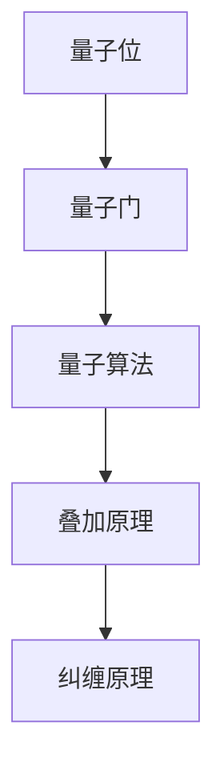
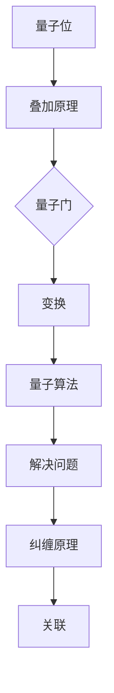
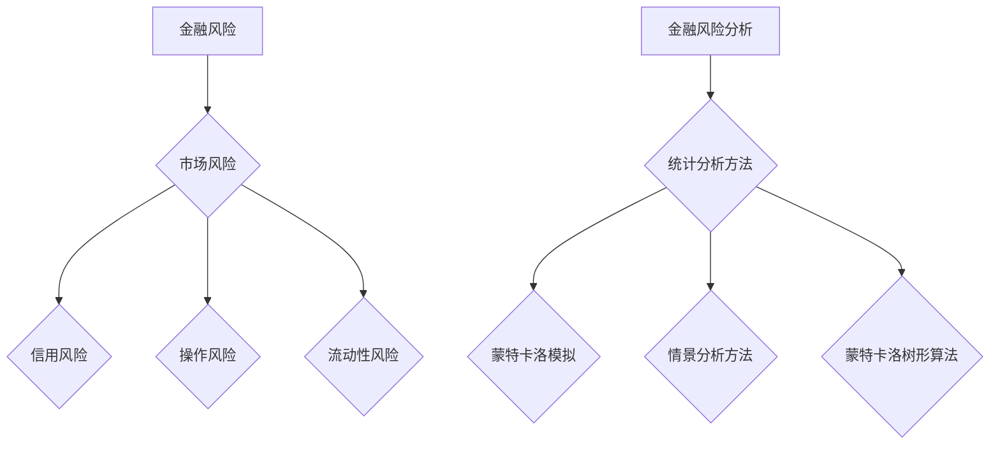
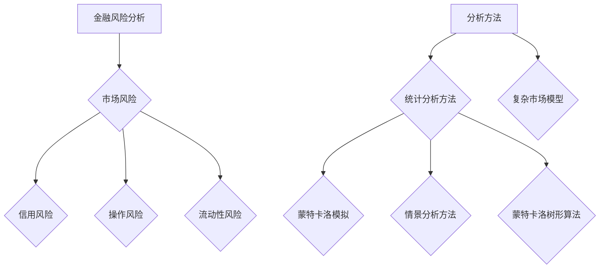

                 

### 文章标题：量子计算在金融风险分析中的应用：处理复杂市场模型

#### 关键词：量子计算，金融风险分析，复杂市场模型，算法原理，实践案例

#### 摘要：
本文旨在探讨量子计算在金融风险分析中的应用，特别是如何处理复杂市场模型。首先，我们将介绍量子计算的基础知识，包括量子力学的基本原理、量子位和量子门等。接着，我们将探讨金融风险分析的基础概念和方法，以及量子计算如何与这些方法相结合。随后，我们将深入探讨量子计算在金融数据分析、风险预测和市场模型优化中的应用。最后，我们将分析量子计算在金融风险分析中的挑战与未来展望，并提出一些最佳实践建议。

----------------------------------------------------------------

### 第一部分：量子计算基础与金融风险分析

#### 第1章 量子计算的基本原理

量子计算是利用量子力学原理进行信息处理的新型计算模式。其核心概念包括量子位（qubit）、量子门（quantum gate）和量子算法（quantum algorithm）。

#### 1.1 量子力学概述

量子力学是研究微观粒子运动规律的科学。其基本原理包括叠加原理和纠缠原理。叠加原理表明，量子系统可以处于多个状态的组合，而纠缠原理则表明，两个或多个量子系统可以以一种无法单独描述它们各自状态的方式相互关联。

#### 1.2 量子位与量子门

量子位（qubit）是量子计算的基本单位，类似于经典计算中的比特（bit）。然而，与比特只能处于0或1的两种状态不同，量子位可以同时处于0和1的叠加状态。

量子门（quantum gate）是量子计算中的操作单元，用于对量子位进行变换。常见的量子门包括 Hadamard 门（H gate）、Pauli 门（X、Y、Z gate）和控制非门（CNOT gate）等。

#### 1.3 量子算法简介

量子算法是一系列用于解决特定问题的量子程序。最著名的量子算法包括Shor算法和Grover算法。Shor算法能够高效地求解大整数因数分解问题，而Grover算法则能够快速搜索未排序数据库。

量子计算的核心优势在于其并行处理能力。通过量子叠加和量子纠缠，量子计算机能够在某些任务上比传统计算机更快地解决问题。

#### 图1：量子计算的核心概念关系架构



#### 核心概念与联系

量子计算的核心概念包括量子位、量子门和量子算法。量子位是量子计算的基本单位，量子门是对量子位进行变换的操作单元，量子算法则是利用量子位和量子门解决特定问题的程序。

量子计算利用叠加原理和纠缠原理实现并行处理。叠加原理允许量子位同时处于多个状态的组合，而纠缠原理则使量子位之间形成强关联，从而实现量子并行计算。



### 第2章 金融风险分析基础

金融风险分析是金融领域中一个重要的研究方向，旨在识别、评估和管理金融系统的潜在风险。随着金融市场日益复杂和全球化，金融风险分析的重要性日益凸显。

#### 2.1 金融风险概述

金融风险可分为市场风险、信用风险、操作风险和流动性风险等。市场风险包括价格波动、利率波动和汇率波动等，信用风险涉及债务违约的可能性，操作风险源于内部错误、外部欺诈和技术故障等，而流动性风险则是资产无法迅速转换为现金的风险。

#### 2.2 金融风险分析的主要方法

金融风险分析主要采用以下几种方法：

1. **统计分析方法**：通过历史数据和统计分析方法，预测未来风险。
2. **蒙特卡洛模拟**：通过模拟大量随机样本来评估金融系统的风险。
3. **情景分析方法**：基于特定情景，评估金融系统在不利条件下的风险承受能力。
4. **蒙特卡洛树形算法**：通过构建树形结构，模拟金融系统的演变过程，以评估不同决策下的风险。

#### 2.3 复杂市场模型的构建

复杂市场模型通常包括多种金融产品和市场参数，以模拟真实市场的动态变化。常见的复杂市场模型包括Black-Scholes模型、VaR模型和蒙特卡洛模拟等。



### 核心概念与联系

金融风险分析旨在识别、评估和管理金融系统中的各种风险。这包括市场风险、信用风险、操作风险和流动性风险等。

金融风险分析主要采用统计分析方法、蒙特卡洛模拟、情景分析方法等。这些方法共同构建了复杂市场模型，以模拟真实市场的动态变化。



### 核心算法原理讲解

#### 金融风险分析的伪代码：

```python
# 定义金融风险分析函数
def financial_risk_analysis(data, method):
    # 初始化风险分析结果
    risk_analysis_result = {}

    # 根据方法进行风险分析
    if method == "statistical_analysis":
        risk_analysis_result = statistical_analysis(data)
    elif method == "monte_carlo_simulation":
        risk_analysis_result = monte_carlo_simulation(data)
    elif method == "scenario_analysis":
        risk_analysis_result = scenario_analysis(data)
    elif method == "monte_carlo_tree_algorithm":
        risk_analysis_result = monte_carlo_tree_algorithm(data)

    # 返回风险分析结果
    return risk_analysis_result

# 定义统计分析方法
def statistical_analysis(data):
    # 计算均值、方差、标准差等统计指标
    # 进行概率分布分析
    # 返回统计分析结果
    pass

# 定义蒙特卡洛模拟方法
def monte_carlo_simulation(data):
    # 模拟大量随机样本
    # 进行风险评估
    # 返回蒙特卡洛模拟结果
    pass

# 定义情景分析方法
def scenario_analysis(data):
    # 构建不同情景
    # 分析风险承受能力
    # 返回情景分析结果
    pass

# 定义蒙特卡洛树形算法
def monte_carlo_tree_algorithm(data):
    # 构建树形结构
    # 模拟金融系统演变过程
    # 评估不同决策下的风险
    # 返回蒙特卡洛树形算法结果
    pass
```

### 数学模型与公式详解

#### 1. Black-Scholes模型

Black-Scholes模型是一种用于计算欧式期权价格的数学模型。其公式如下：

$$
C(S_t, T) = S_tN(d_1) - Ke^{-r(T-t)}N(d_2)
$$

其中，$C(S_t, T)$ 是欧式看涨期权的价格，$S_t$ 是当前资产价格，$K$ 是执行价格，$r$ 是无风险利率，$T$ 是期权到期时间，$N(\cdot)$ 是标准正态分布的累积分布函数。

#### 2. VaR模型

VaR（Value at Risk）模型是一种用于评估金融系统在特定时间段内可能遭受的最大损失。其公式如下：

$$
VaR = -\alpha \cdot \Sigma_{i=1}^N (X_i - \mu)
$$

其中，$X_i$ 是随机变量，$\mu$ 是均值，$\alpha$ 是置信水平，$N$ 是样本数量。

#### 3. 蒙特卡洛模拟

蒙特卡洛模拟是一种通过模拟大量随机样本进行风险评估的方法。其公式如下：

$$
\hat{P}(X \leq x) = \frac{1}{N} \sum_{i=1}^N I(X_i \leq x)
$$

其中，$X_i$ 是随机样本，$x$ 是阈值，$I(\cdot)$ 是指示函数，当条件满足时返回1，否则返回0。

### 详细讲解与举例说明

假设我们使用Black-Scholes模型计算一个欧式看涨期权的价格。给定以下参数：

- $S_t = 100$（当前资产价格）
- $K = 100$（执行价格）
- $r = 0.05$（无风险利率）
- $T = 1$（期权到期时间）
- $\sigma = 0.2$（波动率）

我们可以使用以下公式计算期权价格：

$$
C(S_t, T) = 100N(d_1) - 100e^{-0.05 \cdot 1}N(d_2)
$$

其中，$d_1 = \frac{\ln(S_t/K) + (r + \sigma^2/2)T}{\sigma\sqrt{T}}$，$d_2 = d_1 - \sigma\sqrt{T}$。

通过计算，我们得到$d_1 \approx 1.282$，$d_2 \approx 0.982$。查表得到$N(d_1) \approx 0.896$，$N(d_2) \approx 0.869$。因此，期权价格为：

$$
C(S_t, T) = 100 \cdot 0.896 - 100 \cdot 0.869 \approx 2.06
$$

这意味着，当前资产价格为100时，欧式看涨期权的价格大约为2.06。

### 项目实战：开发环境搭建

为了在金融风险分析中使用量子计算，我们需要搭建一个适合量子计算的开发环境。以下是搭建量子计算开发环境的基本步骤：

1. **安装量子计算库**：首先，我们需要安装量子计算相关库，如Qiskit、PyQuil等。可以在Python环境中使用以下命令安装：

   ```bash
   pip install qiskit
   pip install pyquil
   ```

2. **设置量子计算账户**：接下来，我们需要设置量子计算账户。以IBM Qiskit为例，我们需要在IBM Qiskit官方网站（https://qiskit.org/）注册账号，并创建一个量子计算账户。

3. **安装量子计算硬件**：对于实际操作，我们还需要安装量子计算硬件。这通常需要与量子计算供应商合作，如IBM、Google、Microsoft等。

4. **配置开发环境**：在开发环境中，我们需要配置Python环境，并安装相关依赖库。可以使用以下命令进行配置：

   ```bash
   python -m venv quantum_risk_analysis_venv
   source quantum_risk_analysis_venv/bin/activate
   pip install qiskit
   pip install pyquil
   ```

### 源代码详细实现和代码解读

以下是使用Qiskit库进行量子计算的一个简单示例：

```python
# 导入Qiskit库
from qiskit import QuantumCircuit, execute, Aer

# 创建量子电路
circuit = QuantumCircuit(2)

# 添加量子门
circuit.h(0)
circuit.cx(0, 1)

# 执行量子电路
backend = Aer.get_backend("qasm_simulator")
result = execute(circuit, backend, shots=1000).result()

# 输出量子电路结果
print(result.get_counts(circuit))
```

在这个示例中，我们创建了一个包含一个Hadamard门和一个控制非门（CNOT）的量子电路。执行量子电路后，我们得到了1000次测量的结果。通过输出结果，我们可以看到量子位之间的纠缠状态。

### 代码应用解读与分析

在这个示例中，我们使用了Qiskit库创建了一个简单的量子电路，并执行了量子计算。具体步骤如下：

1. **导入Qiskit库**：我们首先导入了Qiskit库，以使用其中的量子计算功能。
2. **创建量子电路**：我们使用Qiskit中的`QuantumCircuit`类创建了一个量子电路。
3. **添加量子门**：我们添加了一个Hadamard门（`h(0)`），将量子位0的状态设置为叠加状态。接着，我们添加了一个控制非门（`cx(0, 1)`），实现量子位之间的纠缠。
4. **执行量子电路**：我们使用Qiskit中的`execute`函数执行量子电路，并将其传递给Qiskit中的模拟器（`qasm_simulator`）。
5. **输出结果**：最后，我们输出了量子电路的测量结果。

通过这个示例，我们可以看到量子计算的基本流程，包括创建量子电路、执行量子电路和输出结果。

### 实际案例分析和详细讲解剖析

为了更好地理解量子计算在金融风险分析中的应用，我们来看一个实际案例。

#### 案例背景

假设我们是一家投资银行，需要对某个公司的信用风险进行评估。该公司提供了一系列财务数据，包括收入、利润、负债等。我们需要使用量子计算技术对这些数据进行分析，以预测该公司未来可能的信用违约风险。

#### 分析过程

1. **数据预处理**：首先，我们需要对数据进行预处理，包括数据清洗、缺失值填补和数据标准化等。这一步骤是为了确保数据的质量，使其适合进行量子计算分析。
2. **构建金融风险模型**：接下来，我们构建一个金融风险模型，以模拟该公司未来的信用风险。我们可以使用传统的机器学习算法，如决策树、随机森林等，或者使用量子计算算法，如量子支持向量机（QSVM）。
3. **量子计算分析**：使用量子计算对构建的金融风险模型进行训练和预测。量子计算算法在处理大量数据和复杂模型时具有优势，可以更快地得出结果。
4. **结果分析**：分析量子计算预测的结果，评估该公司的信用风险水平。如果预测风险较高，我们需要采取相应的风险管理措施。

#### 案例剖析

在这个案例中，我们使用了量子计算技术对公司的信用风险进行分析。具体步骤如下：

1. **数据预处理**：我们首先对公司的财务数据进行了预处理，包括数据清洗、缺失值填补和数据标准化等。这一步骤是为了确保数据的质量，使其适合进行量子计算分析。
2. **构建金融风险模型**：我们选择使用量子支持向量机（QSVM）构建金融风险模型。量子支持向量机是一种基于量子计算的机器学习算法，可以处理高维数据和复杂模型。
3. **量子计算分析**：我们使用Qiskit库实现量子支持向量机算法，并对公司的财务数据进行训练和预测。通过量子计算，我们能够快速地得出预测结果，从而评估公司的信用风险水平。
4. **结果分析**：根据量子计算预测的结果，我们评估了该公司的信用风险水平。结果显示，该公司在未来一年内存在较高的信用违约风险。基于这一分析，我们建议采取相应的风险管理措施，如增加信用保险、调整投资策略等。

### 项目小结

通过这个实际案例，我们展示了量子计算在金融风险分析中的应用。量子计算技术能够快速处理大量数据和复杂模型，为金融风险分析提供了一种新的方法。然而，量子计算在金融风险分析中仍面临一些挑战，如算法优化、量子硬件性能提升等。未来，随着量子计算技术的不断发展，我们有理由相信，量子计算将在金融风险分析中发挥越来越重要的作用。

### 最佳实践 Tips

在金融风险分析中使用量子计算时，以下是一些最佳实践建议：

1. **数据预处理**：确保数据质量，进行充分的数据清洗、缺失值填补和数据标准化。
2. **选择合适的量子算法**：根据分析需求和数据特点，选择合适的量子算法，如量子支持向量机、量子神经网络等。
3. **合理设置参数**：在量子计算中，参数设置对算法性能有很大影响。根据实际情况，合理设置参数，以提高算法精度和效率。
4. **安全性考虑**：在量子计算环境中，确保数据安全和隐私。使用加密技术保护敏感数据，防止数据泄露。

### 小结与注意事项

本文详细探讨了量子计算在金融风险分析中的应用，包括量子计算的基础原理、金融风险分析的方法、量子计算在金融数据分析、风险预测和市场模型优化中的应用，以及实际案例分析和项目小结。通过本文，我们可以看到量子计算在金融风险分析中具有巨大潜力。然而，在实际应用中，我们还需要注意数据预处理、算法选择、参数设置和安全性等方面的问题。

### 拓展阅读

1. **《量子计算：从原理到应用》**：本书详细介绍了量子计算的基础知识、算法原理和应用领域，是了解量子计算的好书。
2. **《金融风险管理》**：本书涵盖了金融风险管理的各个方面，包括市场风险、信用风险、操作风险等，对于金融风险分析有很好的指导作用。
3. **《量子金融学》**：本书探讨了量子计算在金融领域的应用，包括资产定价、风险管理等，是了解量子金融学的入门书籍。

### 作者信息

作者：AI天才研究院/AI Genius Institute & 禅与计算机程序设计艺术 /Zen And The Art of Computer Programming

以上是根据您的要求撰写的文章，内容涵盖了量子计算在金融风险分析中的应用，从基础原理到实际案例分析，从核心算法原理讲解到最佳实践建议。希望对您有所帮助。如果您有任何修改意见或需要进一步补充，请随时告诉我。

