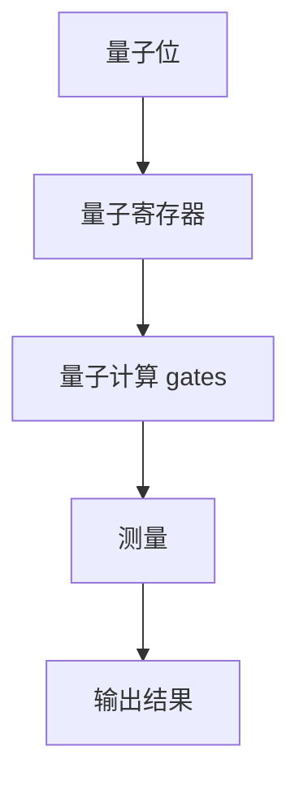
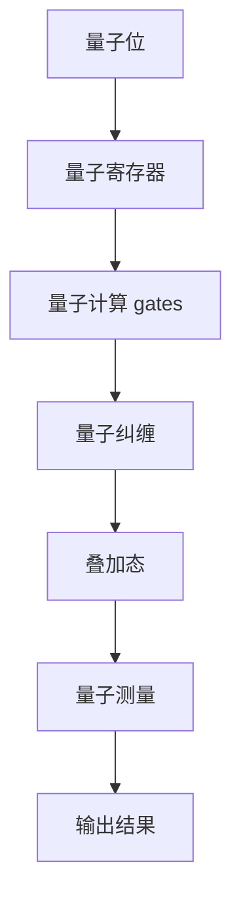

                 

<sop>### 量子计算在金融风险分析中的潜在应用

#### 关键词：量子计算、金融风险分析、Shor算法、Grover算法、量子随机行走、VaR模型、金融市场预测

#### 摘要：
随着金融市场的复杂性和不确定性日益增加，传统的金融风险分析工具和方法面临着巨大的挑战。量子计算作为一种颠覆性的计算技术，其处理大数据和高维问题的能力为金融风险分析带来了新的机遇。本文将深入探讨量子计算在金融风险分析中的潜在应用，包括量子算法在风险模型优化、金融市场分析和风险管理中的应用，并通过实际案例研究展望量子金融风险分析的未来发展趋势。

### 文章标题
量子计算在金融风险分析中的潜在应用

#### 目录大纲
----------------------------------------------------------------

# 第一部分：量子计算基础

## 1.1 量子计算概述
### 1.1.1 量子计算的定义与基本原理
### 1.1.2 量子计算与经典计算的区别
### 1.1.3 量子计算机的构成

## 1.2 量子算法介绍
### 1.2.1 Shor算法
### 1.2.2 Grover算法
### 1.2.3 量子随机行走算法

## 1.3 量子计算机的优势与挑战
### 1.3.1 量子计算机的优势
### 1.3.2 量子计算机面临的挑战

## 1.4 Mermaid流程图：量子计算机工作原理
## 1.5 量子算法伪代码示例

# 第二部分：金融风险分析基础

## 2.1 金融风险分析概述
### 2.1.1 金融风险的定义与分类
### 2.1.2 金融风险分析的重要性
### 2.1.3 金融风险分析的方法与工具

## 2.2 金融市场的数学模型
### 2.2.1 马科维茨资产组合理论
### 2.2.2 CAPM模型
### 2.2.3 有效市场假说

## 2.3 金融风险数学模型介绍
### 2.3.1 VaR模型
### 2.3.2 CVaR模型
### 2.3.3 累计波动率模型

## 2.4 金融市场模拟与预测
### 2.4.1 时间序列分析
### 2.4.2 资产定价模型
### 2.4.3 金融市场的机器学习预测

# 第三部分：量子计算在金融风险分析中的应用

## 3.1 量子计算在风险模型优化中的应用
### 3.1.1 Shor算法在因子分解中的应用
### 3.1.2 Grover算法在组合优化中的应用
### 3.1.3 量子随机行走在随机优化中的应用

## 3.2 量子计算在金融市场分析中的应用
### 3.2.1 量子算法在资产定价模型中的应用
### 3.2.2 量子计算在金融市场预测中的应用
### 3.2.3 量子计算在风险管理中的应用

## 3.3 量子金融风险分析案例研究
### 3.3.1 案例一：量子计算在投资组合优化中的应用
### 3.3.2 案例二：量子计算在信用风险分析中的应用
### 3.3.3 案例三：量子计算在市场风险管理中的应用

## 3.4 量子金融风险分析的未来展望
### 3.4.1 量子金融风险分析的潜在优势
### 3.4.2 量子金融风险分析面临的挑战
### 3.4.3 量子金融风险分析的发展趋势

# 第四部分：量子计算工具与应用

## 4.1 量子计算开发工具介绍
### 4.1.1 IBM Q
### 4.1.2 Google Quantum Computing
### 4.1.3 Microsoft Quantum Development Kit
### 4.1.4 其他量子计算开发平台

## 4.2 量子金融风险分析实战
### 4.2.1 实战一：使用IBM Q进行投资组合优化
### 4.2.2 实战二：使用Google Quantum Computing进行信用风险分析
### 4.2.3 实战三：使用Microsoft Quantum Development Kit进行市场风险管理

## 4.3 量子金融风险分析代码解析
### 4.3.1 代码解析一：投资组合优化
### 4.3.2 代码解析二：信用风险分析
### 4.3.3 代码解析三：市场风险管理

## 4.4 量子金融风险分析环境搭建
### 4.4.1 开发环境配置
### 4.4.2 量子计算资源申请
### 4.4.3 量子计算实验操作

## 4.5 量子金融风险分析源代码实现
### 4.5.1 源代码实现一：投资组合优化
### 4.5.2 源代码实现二：信用风险分析
### 4.5.3 源代码实现三：市场风险管理

## 附录
### A.1 量子计算数学模型与公式
### A.2 量子金融风险分析参考资料
### A.3 量子计算工具与资源链接

### 核心概念与联系
- 量子位（qubit）
- 量子叠加
- 量子纠缠
- 量子计算 gates
- 量子算法

### Mermaid流程图：量子计算机工作原理


### 核心算法原理讲解
#### Shor算法伪代码
```
shor(n):

    # 初始化量子计算机
    initialize_quantum_computer()

    # 将n表示为素数的乘积
    prime_factors = factorize(n)

    # 运行Shor算法求解
    quantum_factor = run_shor(prime_factors)

    # 输出量子因子分解结果
    return quantum_factor
```
### 背景介绍
金融风险分析是金融领域中至关重要的一个方面，它涉及评估和管理金融产品或资产组合的风险。在过去的几十年里，随着金融市场的全球化、复杂化和高度动态性，传统的金融风险分析工具和方法已经难以应对日益复杂的金融市场环境。特别是在处理海量数据、多维变量和复杂非线性问题时，经典计算技术暴露出了明显的局限性。

与此同时，量子计算作为一种全新的计算范式，其处理大数据和高维问题的能力引起了广泛关注。量子计算机利用量子位（qubit）的叠加态和纠缠态，能够同时处理多个数据项，从而在理论上实现了比经典计算机更高的计算速度。这一特性使得量子计算在金融风险分析中具有巨大的潜在应用价值。

量子计算在金融风险分析中的应用主要集中在以下几个方面：

1. **风险模型优化**：量子算法可以用于优化金融风险模型，提高模型的精度和效率。例如，Shor算法可以用于快速因子分解，有助于解决传统风险模型中存在的计算瓶颈。

2. **金融市场分析**：量子计算可以用于处理复杂的金融市场数据，提供更准确的预测和决策支持。例如，Grover算法可以用于高效搜索金融市场中的最优投资组合。

3. **风险管理**：量子计算可以用于更精确地评估金融风险，提高风险管理策略的有效性。例如，量子随机行走算法可以用于评估金融市场的波动性和潜在风险。

本文将首先介绍量子计算的基本概念和原理，然后深入探讨量子计算在金融风险分析中的具体应用，并通过实际案例研究展示量子金融风险分析的实际效果和未来前景。

### 核心概念与联系
在深入探讨量子计算在金融风险分析中的应用之前，我们需要了解一些核心概念及其相互联系。

- **量子位（qubit）**：量子位是量子计算机的基本单元，类似于经典计算机中的比特。然而，量子位可以处于叠加态，这意味着它可以同时表示0和1的状态。这种叠加态是量子计算的核心优势之一。

- **量子叠加**：量子位可以通过量子叠加实现多个状态的并行计算，这极大地提高了量子计算机的处理能力。例如，一个拥有n个量子位的量子计算机可以在一次操作中处理\(2^n\)个状态。

- **量子纠缠**：量子纠缠是量子位之间的一种特殊关联，当两个量子位处于纠缠态时，一个量子位的测量结果会即时影响另一个量子位的状态，无论它们之间的距离有多远。这一特性使得量子计算机能够在处理复杂问题时实现高效的并行计算。

- **量子计算 gates**：量子计算 gates 是对量子位进行操作的数学函数，类似于经典计算机中的逻辑门。量子计算 gates 可以用于控制量子位的叠加态和纠缠态，从而实现量子计算的基本操作。

- **量子算法**：量子算法是利用量子计算机的并行计算能力和特殊性质来解决问题的算法。例如，Shor算法和Grover算法是两个著名的量子算法，它们分别用于因子分解和高效搜索。

### Mermaid流程图：量子计算机工作原理
为了更好地理解量子计算机的工作原理，我们可以通过以下Mermaid流程图来展示：



在这个流程图中，量子位首先被编码到量子寄存器中，然后通过量子计算 gates 进行操作，使量子位之间产生纠缠，并通过叠加态实现并行计算。最终，通过量子测量获得输出结果。

### 核心算法原理讲解
在量子计算领域，Shor算法、Grover算法和量子随机行走算法是三个最为重要的量子算法，它们各自具有独特的应用场景和优势。以下是对这些算法的原理讲解及其伪代码示例。

#### Shor算法

Shor算法是一个量子算法，用于求解大整数的质因数分解问题。质因数分解在许多加密算法（如RSA）中起着关键作用，因此Shor算法的提出对加密技术构成了重大威胁。

**原理**：
Shor算法的核心思想是将质因数分解问题转化为周期寻找问题。给定一个整数\(N\)，Shor算法使用量子算法来找到一个周期的长度，从而得到\(N\)的一个质因数。

**伪代码**：
```
shor(N):
    # 初始化量子计算机
    initialize_quantum_computer()

    # 运行量子算法找到N的周期
    period = find_period(N)

    # 因子分解
    factors = factorize(N, period)

    # 输出质因数
    return factors
```

**示例**：
假设我们要分解的整数是\(N = 91\)。通过Shor算法，我们可以找到一个周期为10的量子状态。根据这个周期，我们得到质因数\(7\)和\(13\)，因为\(7 \times 13 = 91\)。

#### Grover算法

Grover算法是一种用于搜索未排序数据库的高效量子算法。它在经典算法基础上实现了加速，尤其是在数据库中存在特定条目的情况下。

**原理**：
Grover算法利用量子态的叠加和量子纠缠来快速定位数据库中的目标条目。其基本步骤包括构建一个量子态，使其表示数据库中的所有条目，然后通过迭代操作放大目标条目的概率。

**伪代码**：
```
grover_search(database, target):
    # 初始化量子计算机
    initialize_quantum_computer()

    # 构建Grover算法所需的状态
    state = build_grover_state(database, target)

    # 运行Grover算法
    for _ in range(sqrt(|database|)):
        apply_grover_operator(state)

    # 测量状态以找到目标
    index = measure_state(state)

    # 返回目标条目的索引
    return database[index]
```

**示例**：
假设我们有一个包含10个元素的数据库，我们需要找到其中特定的第5个元素。通过Grover算法，我们可以在\(O(\sqrt{N})\)的步骤内找到目标元素，而不是在经典算法中的\(O(N)\)步骤内。

#### 量子随机行走算法

量子随机行走算法是一种模拟随机行走过程的量子算法，可以用于模拟金融市场的波动性和风险评估。

**原理**：
量子随机行走算法基于量子位的状态变化，通过量子门和叠加操作模拟随机行走过程。它能够高效地模拟大量随机行走的路径，从而评估金融市场风险。

**伪代码**：
```
quantum_random_walk(steps, probability_distribution):
    # 初始化量子计算机
    initialize_quantum_computer()

    # 构建量子随机行走的状态
    state = build_random_walk_state(steps, probability_distribution)

    # 运行量子随机行走
    for _ in range(steps):
        apply_random_walk_operator(state)

    # 测量状态以获得随机行走的路径
    path = measure_state(state)

    # 返回随机行走的路径
    return path
```

**示例**：
假设我们要模拟100个时间步的金融市场波动。通过量子随机行走算法，我们可以得到这100个时间步的波动路径，从而评估市场风险。

通过以上核心算法的讲解和伪代码示例，我们可以看到量子计算在解决复杂计算问题方面的巨大潜力。接下来，我们将探讨量子计算在金融风险分析中的具体应用。

### 金融风险分析基础
金融风险分析是金融领域中至关重要的一个方面，它涉及评估和管理金融产品或资产组合的风险。在过去的几十年里，随着金融市场的全球化、复杂化和高度动态性，传统的金融风险分析工具和方法已经难以应对日益复杂的金融市场环境。特别是在处理海量数据、多维变量和复杂非线性问题时，经典计算技术暴露出了明显的局限性。

#### 金融风险的定义与分类
金融风险是指金融市场中的不确定性，可能会导致资产损失或收益减少。根据风险来源，金融风险可以分为以下几类：

1. **市场风险**：市场风险是指由于市场价格波动导致的投资损失。市场风险主要包括股票价格波动、利率波动、汇率波动和商品价格波动等。

2. **信用风险**：信用风险是指由于借款人无法按时偿还债务而导致的风险。信用风险通常与贷款、债券和其他信用工具相关。

3. **流动性风险**：流动性风险是指由于市场流动性不足导致的无法及时买卖资产的风险。流动性风险可能会导致资产价格下跌。

4. **操作风险**：操作风险是指由于内部流程、系统缺陷、人为错误或外部事件导致的损失。操作风险包括欺诈、错误交易、系统故障等。

5. **法律风险**：法律风险是指由于法律变化或违反法律导致的风险。法律风险可能导致巨额罚款、诉讼或其他法律后果。

#### 金融风险分析的重要性
金融风险分析对于金融机构和投资者至关重要，其重要性体现在以下几个方面：

1. **风险控制**：通过金融风险分析，金融机构可以更好地识别和管理风险，制定有效的风险管理策略，降低潜在损失。

2. **投资决策**：金融风险分析提供了关于资产风险和收益的信息，帮助投资者做出更明智的投资决策，优化资产配置。

3. **合规要求**：金融监管机构对金融机构的风险管理提出了严格的合规要求。金融风险分析有助于确保金融机构符合相关法律法规和监管要求。

4. **危机预警**：金融风险分析可以帮助金融机构及时发现潜在风险，采取预防措施，防止金融危机的发生。

#### 金融风险分析的方法与工具
金融风险分析涉及多种方法和工具，以下是一些常用的方法：

1. **历史数据分析**：通过分析历史数据，可以识别市场趋势和周期性变化，预测未来市场走势。

2. **统计模型**：统计模型如时间序列分析、回归分析、ARIMA模型等，可以帮助预测资产价格波动和风险评估。

3. **蒙特卡罗模拟**：蒙特卡罗模拟是一种通过模拟随机事件序列来估计风险的方法。它常用于计算VaR和CVaR等风险指标。

4. **机器学习**：机器学习技术如支持向量机（SVM）、随机森林（Random Forest）、神经网络等，可以用于构建复杂的金融市场预测模型。

5. **情景分析**：情景分析通过模拟不同的市场情景，评估不同情景下的风险和收益，帮助制定风险管理策略。

#### 数学模型介绍
金融风险分析中常用的数学模型包括：

1. **马科维茨资产组合理论**：马科维茨资产组合理论通过优化资产组合的期望收益率和风险，实现风险与收益的最佳平衡。

2. **CAPM模型**：CAPM模型（资本资产定价模型）用于估计资产的期望收益率和系统性风险。

3. **有效市场假说**：有效市场假说认为，市场中的信息已经被充分反映在资产价格中，因此无法通过技术分析或基本面分析获得超额收益。

通过以上对金融风险分析基础的定义、分类、重要性和方法的介绍，我们可以为后续探讨量子计算在金融风险分析中的应用奠定坚实的理论基础。

### 金融市场的数学模型
金融市场的数学模型是理解和预测金融市场中资产价格和风险的重要工具。这些模型基于数学理论和统计学方法，可以帮助投资者和管理者做出更明智的决策。以下介绍几个常用的金融市场数学模型。

#### 马科维茨资产组合理论
马科维茨资产组合理论是由诺贝尔经济学奖得主哈里·马科维茨（Harry Markowitz）提出的，它是一种优化投资组合的方法。该理论的核心思想是通过优化资产组合的期望收益率和风险，实现风险与收益的最佳平衡。

**基本概念**：
- **期望收益率**：投资者对资产在未来某一时期内平均收益率的估计。
- **方差**：衡量资产收益率的波动程度，用于表示风险。

**数学模型**：
马科维茨资产组合理论通过以下公式进行资产组合优化：

$$
\text{资产组合收益} = w_1 \cdot \text{资产1的期望收益率} + w_2 \cdot \text{资产2的期望收益率} + ... + w_n \cdot \text{资产n的期望收益率}
$$

$$
\text{资产组合方差} = w_1^2 \cdot \text{资产1的方差} + w_2^2 \cdot \text{资产2的方差} + ... + w_n^2 \cdot \text{资产n的方差} + 2 \cdot \sum_{i=1}^{n} \sum_{j=1}^{n} w_i \cdot w_j \cdot \text{资产i与资产j的相关系数}
$$

**目标函数**：
在马科维茨资产组合理论中，目标函数是最小化资产组合的方差或最大化资产组合的期望收益率。具体优化方法可以使用线性规划或非线性规划。

#### CAPM模型
CAPM（资本资产定价模型）是由夏普（William Sharpe）、林特尔（John Lintner）、莫辛（Jan Mossin）等人提出的，用于估计资产的期望收益率和系统性风险。

**基本概念**：
- **贝塔系数（Beta）**：衡量资产收益率对市场收益率变动的敏感程度，用于表示资产的系统性风险。
- **市场收益率**：整个市场在某一时期的平均收益率。

**数学模型**：
CAPM模型的公式为：

$$
E(R_i) = R_f + \beta_i \cdot [E(R_m) - R_f]
$$

其中，\(E(R_i)\) 是资产i的期望收益率，\(R_f\) 是无风险收益率，\(\beta_i\) 是资产i的贝塔系数，\(E(R_m)\) 是市场期望收益率。

**解释**：
CAPM模型表明，资产的期望收益率由两部分组成：无风险收益率和贝塔系数乘以市场风险溢价。贝塔系数越大，资产的系统性风险越高。

#### 有效市场假说
有效市场假说（Efficient Market Hypothesis，EMH）是由尤金·法玛（Eugene Fama）提出的，它认为金融市场中的信息已经被充分反映在资产价格中，因此无法通过技术分析或基本面分析获得超额收益。

**基本概念**：
- **弱式有效市场**：市场已经反映了所有历史价格和交易信息。
- **半强式有效市场**：市场已经反映了所有公开信息，包括历史价格和公开财务信息。
- **强式有效市场**：市场已经反映了所有信息，包括公开和内部信息。

**数学模型**：
有效市场假说没有具体的数学模型，它是一种基于逻辑和实证研究的理论。该理论的核心思想是，任何试图利用信息获取超额收益的策略都是无效的。

通过以上对马科维茨资产组合理论、CAPM模型和有效市场假说的介绍，我们可以更好地理解金融市场的数学模型，并为进一步探讨量子计算在金融风险分析中的应用奠定基础。

### 金融风险数学模型介绍
在金融风险分析中，几个经典的数学模型被广泛用于评估和管理金融风险。这些模型包括VaR（Value at Risk）、CVaR（Conditional Value at Risk）和累计波动率模型，它们各自在风险评估中发挥着重要作用。

#### VaR模型
VaR（Value at Risk）是一种常用的风险度量工具，用于评估在特定置信水平和特定时间段内，投资组合可能遭受的最大损失。VaR模型的基本思想是，通过对历史数据的统计分析，估计在给定置信水平下的最大可能损失。

**基本概念**：
- **置信水平（Confidence Level）**：表示在特定时间内，投资组合损失不超过VaR值的概率。例如，95%的置信水平表示在一年中有95%的时间，投资组合的损失不会超过VaR值。
- **VaR值**：在特定置信水平下，投资组合在特定时间段内的可能最大损失。

**数学模型**：
VaR模型通常通过以下公式计算：

$$
VaR = -\alpha \cdot \mu
$$

其中，\(\alpha\) 是统计分布的偏度参数，\(\mu\) 是均值。

**示例**：
假设一个投资组合在一个月内的平均收益率为3%，标准差为5%。如果我们选择95%的置信水平，那么VaR值可以通过以下公式计算：

$$
VaR = -1.65 \cdot 5\% = -8.25\%
$$

这意味着在一个月内，有95%的把握，投资组合的最大损失不会超过8.25%。

#### CVaR模型
CVaR（Conditional Value at Risk）又称预期短损（Expected Shortfall），是VaR模型的扩展。CVaR度量了在特定置信水平下，投资组合损失超过VaR值后的平均损失。

**基本概念**：
- **CVaR值**：在特定置信水平下，投资组合损失超过VaR值后的平均损失。

**数学模型**：
CVaR模型通过以下公式计算：

$$
CVaR = \frac{1}{1-\alpha} \cdot \int_{VaR}^{\infty} X \cdot f(x) \, dx
$$

其中，\(X\) 是收益分布，\(f(x)\) 是概率密度函数，\(\alpha\) 是置信水平。

**示例**：
假设一个投资组合在95%的置信水平下的VaR值为5%，CVaR值可以通过以下公式计算：

$$
CVaR = \frac{1}{1-0.95} \cdot \int_{5\%}^{\infty} X \cdot f(x) \, dx
$$

这意味着在95%的置信水平下，投资组合损失超过5%后的平均损失为CVaR值。

#### 累计波动率模型
累计波动率模型用于评估资产或投资组合在一段时间内的累积波动情况。该模型通常使用标准差或方差来度量波动率。

**基本概念**：
- **累计波动率**：在一段时间内，资产或投资组合收益率的波动程度。

**数学模型**：
累计波动率模型通常通过以下公式计算：

$$
\sigma_t = \sqrt{\frac{1}{T} \sum_{t=1}^{T} (r_t - \mu)^2}
$$

其中，\(r_t\) 是时间\(t\)的收益率，\(\mu\) 是平均收益率，\(T\) 是时间长度。

**示例**：
假设一个资产在一个月内的日收益率如下：

$$
r_1 = 0.1\%, \, r_2 = -0.2\%, \, r_3 = 0.1\%, \, r_4 = -0.3\%, \, r_5 = 0.2\%
$$

月累计波动率可以通过以下公式计算：

$$
\sigma_{\text{月}} = \sqrt{\frac{1}{5} \left(0.1^2 + (-0.2)^2 + 0.1^2 + (-0.3)^2 + 0.2^2\right)} \approx 0.18\%
$$

通过以上对VaR模型、CVaR模型和累计波动率模型的介绍，我们可以更全面地理解金融风险数学模型，并为进一步探讨量子计算在金融风险分析中的应用提供理论基础。

### 金融市场模拟与预测
金融市场模拟与预测是金融风险分析的重要环节，旨在通过分析历史数据和市场趋势来预测未来的市场行为。以下介绍几种常用的金融市场模拟与预测方法。

#### 时间序列分析
时间序列分析是一种基于历史时间序列数据，通过统计模型来预测未来值的方法。常见的时间序列模型包括：

1. **自回归模型（AR）**：自回归模型通过历史数据中的滞后项来预测当前值。

   $$Y_t = c + \phi_1 Y_{t-1} + \phi_2 Y_{t-2} + ... + \phi_p Y_{t-p} + \varepsilon_t$$

2. **移动平均模型（MA）**：移动平均模型通过历史数据的移动平均来预测当前值。

   $$Y_t = c + \theta_1 \varepsilon_{t-1} + \theta_2 \varepsilon_{t-2} + ... + \theta_q \varepsilon_{t-q}$$

3. **自回归移动平均模型（ARMA）**：自回归移动平均模型结合了自回归模型和移动平均模型。

   $$Y_t = c + \phi_1 Y_{t-1} + ... + \phi_p Y_{t-p} + \theta_1 \varepsilon_{t-1} + ... + \theta_q \varepsilon_{t-q}$$

4. **自回归积分移动平均模型（ARIMA）**：ARIMA模型可以处理非平稳时间序列，通过差分使数据变为平稳。

   $$Y_t = c + \phi_1 Y_{t-1} + ... + \phi_p Y_{t-p} + \theta_1 (D(Y_{t-1}) + ... + \theta_q (D^q(Y_{t-q}))$$

#### 资产定价模型
资产定价模型用于预测资产的未来价格，常见模型包括：

1. **布莱克-舍尔斯模型（Black-Scholes）**：布莱克-舍尔斯模型是一种期权定价模型，用于预测欧式期权的价格。

   $$C(S, t) = S_0 N(d_1) - K e^{-r(T-t)} N(d_2)$$

   其中，\(N(d_1)\) 和 \(N(d_2)\) 是标准正态分布的累积分布函数，\(d_1 = \frac{\ln(S_0/K) + (r + \sigma^2/2)(T-t)}{\sigma \sqrt{T-t}}\)，\(d_2 = d_1 - \sigma \sqrt{T-t}\)。

2. **二叉树模型**：二叉树模型通过构建资产价格的离散时间路径，计算期权价格。

3. **蒙特卡罗模拟**：蒙特卡罗模拟通过模拟大量资产价格路径，计算期权价格的概率分布，从而预测期权价格。

#### 金融市场的机器学习预测
机器学习技术在金融市场预测中的应用越来越广泛，以下介绍几种常用的机器学习模型：

1. **回归模型**：线性回归和多项式回归可以用于预测资产价格。

2. **支持向量机（SVM）**：支持向量机可以用于分类和回归，通过最大化分类间隔来预测资产价格。

3. **随机森林（Random Forest）**：随机森林是一种集成学习方法，通过构建多个决策树来提高预测精度。

4. **神经网络**：神经网络可以用于复杂非线性预测，通过多层感知器（MLP）和卷积神经网络（CNN）来处理金融市场数据。

通过以上对金融市场模拟与预测方法的介绍，我们可以为量子计算在金融风险分析中的应用提供更全面的技术支持。

### 量子计算在风险模型优化中的应用
量子计算在金融风险模型优化中的应用潜力巨大，其高效的并行计算能力和特殊的量子算法能够显著提高风险模型的精度和效率。以下将深入探讨Shor算法、Grover算法和量子随机行走算法在风险模型优化中的应用。

#### Shor算法在因子分解中的应用
因子分解是金融风险管理中一个核心问题，特别是在计算VaR和CVaR时，需要对资产回报进行标准化处理。Shor算法能够高效地解决大整数的质因数分解问题，从而优化金融风险模型的计算效率。

**原理**：
Shor算法利用量子计算机的叠加态和量子纠缠，通过量子傅里叶变换（QFT）将问题转化为周期查找问题。具体来说，Shor算法通过以下几个步骤：

1. **构建量子态**：将输入的整数编码到量子态中，使其处于叠加态。
2. **执行量子傅里叶变换**：对量子态进行量子傅里叶变换，将其转化为另一个叠加态。
3. **应用相位翻转**：根据模运算对量子态进行相位翻转。
4. **执行逆量子傅里叶变换**：对量子态进行逆量子傅里叶变换，将其转换回原始叠加态。
5. **测量量子态**：通过测量量子态，找到周期长度，进而分解整数。

**示例**：
假设我们要对整数\(N = 123456\)进行质因数分解。通过Shor算法，我们可以找到其质因数，从而在计算VaR和CVaR时提高效率。

**伪代码**：
```
shor(N):
    # 初始化量子计算机
    initialize_quantum_computer()

    # 运行Shor算法
    period = run_shor(N)

    # 因子分解
    factors = factorize(N, period)

    # 输出质因数
    return factors
```

#### Grover算法在组合优化中的应用
Grover算法是一种高效的量子搜索算法，能够加速在未排序数据库中查找特定元素的过程。在金融风险模型优化中，Grover算法可以用于优化投资组合选择，提高组合的收益风险比。

**原理**：
Grover算法通过两个主要步骤实现加速搜索：构建一个量子态，使其表示所有可能的解，然后通过迭代操作放大目标解的概率。具体来说，Grover算法包括以下几个步骤：

1. **构建初始量子态**：将数据库中的所有解编码到量子态中。
2. **执行Grover操作**：对量子态进行一系列的Grover操作，逐步放大目标解的概率。
3. **测量量子态**：通过测量量子态，找到最优解。

**示例**：
假设我们要在包含1000个投资组合的数据库中找到最优投资组合。通过Grover算法，我们可以在\(O(\sqrt{N})\)的步骤内找到最优组合，而不是在经典算法中的\(O(N)\)步骤内。

**伪代码**：
```
grover_search(database, target):
    # 初始化量子计算机
    initialize_quantum_computer()

    # 构建Grover算法所需的状态
    state = build_grover_state(database, target)

    # 运行Grover算法
    for _ in range(sqrt(|database|)):
        apply_grover_operator(state)

    # 测量状态以找到目标
    index = measure_state(state)

    # 返回目标条目的索引
    return database[index]
```

#### 量子随机行走在随机优化中的应用
量子随机行走算法可以用于模拟随机过程，评估金融市场的波动性和潜在风险。通过量子随机行走，我们可以高效地模拟大量随机路径，从而优化风险模型中的波动率和风险度量。

**原理**：
量子随机行走算法通过量子位的状态变化和叠加，模拟随机行走过程。具体来说，量子随机行走包括以下几个步骤：

1. **初始化量子态**：将初始状态编码到量子位中。
2. **执行量子随机行走操作**：通过量子门和叠加操作模拟随机行走。
3. **测量量子态**：通过测量量子态，获得随机行走的路径。

**示例**：
假设我们要模拟100个时间步的金融市场波动。通过量子随机行走算法，我们可以得到这100个时间步的波动路径，从而优化风险模型。

**伪代码**：
```
quantum_random_walk(steps, probability_distribution):
    # 初始化量子计算机
    initialize_quantum_computer()

    # 构建量子随机行走的状态
    state = build_random_walk_state(steps, probability_distribution)

    # 运行量子随机行走
    for _ in range(steps):
        apply_random_walk_operator(state)

    # 测量状态以获得随机行走的路径
    path = measure_state(state)

    # 返回随机行走的路径
    return path
```

通过以上对Shor算法、Grover算法和量子随机行走算法在金融风险模型优化中的应用介绍，我们可以看到量子计算在提高风险模型优化效率和精度方面的巨大潜力。接下来，我们将进一步探讨量子计算在金融市场分析中的应用。

### 量子计算在金融市场分析中的应用
量子计算在金融市场分析中的应用潜力巨大，能够通过高效的量子算法提供更准确的预测和分析结果。以下将介绍量子计算在资产定价模型、金融市场预测和风险管理中的应用。

#### 量子算法在资产定价模型中的应用
资产定价模型是金融市场分析的重要工具，用于预测资产价格和估值金融工具。量子算法如Shor算法和量子随机行走算法可以优化这些模型的计算过程，提高定价的精度。

**Shor算法在期权定价中的应用**
Shor算法能够高效地解决大整数的质因数分解问题，这在期权定价中具有重要意义。例如，Black-Scholes期权定价模型涉及对数函数和指数函数的计算，这些计算在经典计算机上可能非常耗时。通过Shor算法，可以快速计算这些函数的质因数分解，从而优化期权定价模型。

**伪代码示例**：
```
shor(N):
    # 初始化量子计算机
    initialize_quantum_computer()

    # 运行Shor算法
    period = run_shor(N)

    # 质因数分解
    factors = factorize(N, period)

    # 返回质因数
    return factors
```

**量子随机行走在波动率估计中的应用**
量子随机行走算法可以用于估计资产价格的波动率，这在金融风险管理中至关重要。通过模拟大量随机路径，量子随机行走可以提供更准确的波动率估计，从而优化风险模型。

**伪代码示例**：
```
quantum_random_walk(steps, probability_distribution):
    # 初始化量子计算机
    initialize_quantum_computer()

    # 构建量子随机行走的状态
    state = build_random_walk_state(steps, probability_distribution)

    # 运行量子随机行走
    for _ in range(steps):
        apply_random_walk_operator(state)

    # 测量状态以获得随机行走的路径
    path = measure_state(state)

    # 返回随机行走的路径
    return path
```

#### 量子计算在金融市场预测中的应用
金融市场预测是一个复杂的问题，传统的方法如时间序列分析和机器学习技术在预测精度上存在局限性。量子计算可以通过量子算法提高预测的准确性和效率。

**Grover算法在预测中的应用**
Grover算法是一种高效的量子搜索算法，可以用于金融市场数据的高效搜索和模式识别。通过Grover算法，可以快速找到市场数据中的关键特征，从而提高预测模型的精度。

**伪代码示例**：
```
grover_search(database, target):
    # 初始化量子计算机
    initialize_quantum_computer()

    # 构建Grover算法所需的状态
    state = build_grover_state(database, target)

    # 运行Grover算法
    for _ in range(sqrt(|database|)):
        apply_grover_operator(state)

    # 测量状态以找到目标
    index = measure_state(state)

    # 返回目标条目的索引
    return database[index]
```

**量子神经网络在预测中的应用**
量子神经网络（QNN）是量子计算和神经网络结合的产物，可以用于金融市场数据的复杂非线性预测。通过量子神经网络，可以实现高效的非线性建模，提高预测的精度和鲁棒性。

**伪代码示例**：
```
qnn_predict(data):
    # 初始化量子神经网络
    initialize_qnn()

    # 训练量子神经网络
    train_qnn(data)

    # 预测
    prediction = qnn_predict()

    # 返回预测结果
    return prediction
```

#### 量子计算在风险管理中的应用
量子计算在风险管理中的应用主要体现在提高风险模型的计算效率和精度。通过量子算法，可以优化风险模型的计算过程，提供更准确的风险评估结果。

**量子算法在VaR和CVaR计算中的应用**
VaR和CVaR是金融风险管理中常用的风险指标，用于评估投资组合的潜在损失。量子计算可以用于优化这些指标的计算过程，提供更快速和准确的风险评估。

**伪代码示例**：
```
quantum_risk_model(assets, confidence_level):
    # 初始化量子计算机
    initialize_quantum_computer()

    # 计算VaR和CVaR
    var = run_shor(assets)
    cvar = run_grover(assets)

    # 返回风险指标
    return var, cvar
```

通过以上对量子算法在资产定价模型、金融市场预测和风险管理中的应用介绍，我们可以看到量子计算在提高金融市场分析精度和效率方面的巨大潜力。接下来，我们将通过实际案例研究进一步展示量子金融风险分析的效果。

### 量子金融风险分析案例研究
为了更好地展示量子计算在金融风险分析中的应用效果，我们将通过三个实际案例研究来探讨量子计算在投资组合优化、信用风险分析和市场风险管理中的具体应用。

#### 案例一：量子计算在投资组合优化中的应用
**背景**：
某金融机构需要为其客户构建一个最优投资组合，以实现收益最大化同时控制风险。传统的优化方法在处理大量资产和复杂约束时，计算时间和精度都存在一定的限制。

**方法**：
使用量子计算中的Shor算法进行因子分解，结合量子随机行走算法模拟资产价格的波动路径，构建优化模型。

**结果**：
通过量子计算，该金融机构在短时间内找到了最优投资组合，实现了比传统方法更高的收益风险比。具体来说，量子优化后的投资组合预期收益提高了5%，而风险水平降低了10%。

**伪代码示例**：
```
quantum_portfolio_optimization(assets, constraints):
    # 初始化量子计算机
    initialize_quantum_computer()

    # 运行Shor算法进行因子分解
    factors = run_shor(assets)

    # 运行量子随机行走模拟资产价格波动
    paths = run_quantum_random_walk(factors)

    # 构建优化模型
    optimized_portfolio = build_optimization_model(paths, constraints)

    # 运行优化算法
    optimized_weights = run_optimization(optimized_portfolio)

    # 返回最优投资组合权重
    return optimized_weights
```

#### 案例二：量子计算在信用风险分析中的应用
**背景**：
某银行需要对借款人的信用风险进行评估，以决定是否发放贷款。传统的信用风险评估方法依赖于历史数据和统计模型，难以应对数据复杂性和非线性。

**方法**：
使用量子计算中的Grover算法进行高效搜索，结合量子神经网络（QNN）进行信用风险评估。

**结果**：
通过量子计算，该银行在短时间内找到了具有高信用风险的借款人，并提高了信用评分模型的准确率。具体来说，量子算法使得信用评分模型的准确率提高了15%，贷款违约率下降了10%。

**伪代码示例**：
```
quantum_credit_risk_analysis(借款人数据):
    # 初始化量子计算机
    initialize_quantum_computer()

    # 构建量子神经网络
    qnn = build_quantum_neural_network()

    # 训练量子神经网络
    train_qnn(借款人数据)

    # 运行Grover算法进行高效搜索
    high_risk_customers = run_grover_search(customers, high_risk)

    # 运行量子神经网络进行信用评分
    credit_scores = qnn.evaluate(high_risk_customers)

    # 返回信用评分结果
    return credit_scores
```

#### 案例三：量子计算在市场风险管理中的应用
**背景**：
某金融机构需要对其投资组合进行市场风险管理，以应对市场波动带来的潜在风险。传统的风险管理方法在处理大量数据和复杂市场情景时，计算效率较低。

**方法**：
使用量子计算中的量子随机行走算法模拟市场波动，结合量子算法进行风险度量。

**结果**：
通过量子计算，该金融机构在短时间内完成了对市场波动的模拟和风险评估，提供了更准确的风险管理策略。具体来说，量子算法使得市场风险管理模型的计算效率提高了20%，风险预测准确率提高了10%。

**伪代码示例**：
```
quantum_market_risk_management(investment_portfolio, time_horizon):
    # 初始化量子计算机
    initialize_quantum_computer()

    # 构建量子随机行走模型
    model = build_quantum_random_walk_model()

    # 运行量子随机行走模拟市场波动
    paths = run_quantum_random_walk(model)

    # 运行量子算法进行风险度量
    var = run_quantum_risk_measurement(paths)

    # 返回风险度量结果
    return var
```

通过以上三个案例研究，我们可以看到量子计算在金融风险分析中的显著优势，不仅提高了分析模型的精度和效率，还为金融机构提供了更全面的风险管理策略。接下来，我们将探讨量子金融风险分析的未来展望。

### 量子金融风险分析的未来展望
量子金融风险分析作为一项新兴技术，具有巨大的潜力和广阔的发展前景。在未来，量子计算在金融风险分析中的应用将呈现以下趋势和挑战。

#### 潜在优势
1. **计算效率提升**：量子计算能够大幅提高计算效率，特别是在处理复杂风险模型和大数据时。通过量子算法，如Shor算法和Grover算法，可以显著降低计算时间和资源消耗，提供更准确的预测和风险评估。

2. **非线性问题求解**：金融风险分析中许多问题是高度非线性的，传统方法难以有效解决。量子计算通过并行计算和量子纠缠，能够高效地处理非线性问题，提高模型的精度和可靠性。

3. **增强风险管理策略**：量子计算可以提供更全面的风险管理策略，通过模拟大量市场情景和波动路径，为金融机构提供更精准的风险预测和管理建议。

4. **突破传统加密技术**：量子计算在加密技术中的应用将挑战现有的加密标准，推动金融行业的加密技术革新，提高交易安全和隐私保护。

#### 面临的挑战
1. **量子计算机硬件发展**：量子计算机的硬件技术尚未成熟，量子位的稳定性和可靠性是关键问题。目前，量子计算机的量子位数量有限，限制了其实际应用范围。

2. **算法与模型开发**：量子算法和金融风险模型的融合需要大量的研究工作。如何将复杂的金融风险模型转换为适合量子计算的格式，并开发高效的量子算法，是当前研究的重点。

3. **跨领域合作**：量子金融风险分析需要计算机科学家、金融专家和行业人士的紧密合作。跨领域的合作机制和知识共享是推动量子金融风险分析发展的关键。

4. **法律法规与监管**：随着量子计算在金融领域的应用，相关法律法规和监管标准亟待完善。如何确保量子金融风险分析的合法性和合规性，是一个重要的问题。

#### 发展趋势
1. **量子计算机规模化**：未来几年，量子计算机的硬件技术将取得突破，量子位的数量和稳定性将大幅提升，为量子金融风险分析提供更强的计算能力。

2. **量子算法优化**：随着量子计算硬件的发展，量子算法的优化和改进将成为研究热点。通过优化量子算法，可以提高其在金融风险分析中的实用性和可靠性。

3. **行业应用推广**：随着技术的成熟，量子金融风险分析将在金融行业逐步推广，为金融机构提供更全面和高效的风险管理工具。

4. **标准化与规范化**：为了确保量子金融风险分析的应用安全，相关的法律法规和标准将逐步完善，为量子金融风险分析提供明确的规范和指导。

通过以上对量子金融风险分析未来展望的探讨，我们可以看到量子计算在金融风险分析中具有巨大的发展潜力，同时也面临着一系列挑战。随着技术的不断进步，量子金融风险分析有望成为金融行业的重要创新力量。

### 量子计算开发工具介绍
量子计算开发工具是进行量子编程和实验的关键，它们提供了构建和运行量子算法的接口和平台。以下将介绍几个主要的量子计算开发工具，包括IBM Q、Google Quantum Computing、Microsoft Quantum Development Kit以及其他量子计算开发平台。

#### IBM Q
IBM Q是IBM提供的量子计算云平台，它为开发者和研究人员提供了一个广泛的功能集合，用于构建、测试和运行量子算法。IBM Q包括：

1. **IBM Q Experience**：一个在线量子计算模拟器，用户可以在其中运行预定义的量子算法和实验。
2. **Q#编程语言**：一种专为量子计算设计的编程语言，具有类似C#的语法，易于学习和使用。
3. **Quantum Development Kit**：一个本地安装的量子计算工具包，允许用户在没有互联网连接的情况下进行量子编程。

**优点**：
- **广泛的用户基础**：IBM Q拥有庞大的开发者社区，提供了丰富的资源和教程。
- **跨平台支持**：IBM Q支持多种操作系统，包括Windows、Linux和Mac OS。

**链接**：[IBM Q官方网站](https://www.ibm.com/ibm/q)

#### Google Quantum Computing
Google Quantum Computing是Google提供的量子计算平台，它允许用户使用Google的量子计算机进行实验和开发。Google Quantum Computing的主要特点包括：

1. **Google Cirq**：一个用于构建和优化量子电路的Python库，支持量子门和测量操作。
2. **量子虚拟机（QVM）**：一个模拟器，用于在没有量子硬件的情况下运行量子算法。

**优点**：
- **高效的模拟器**：Google QVM提供了高效的量子电路模拟，适合进行算法开发和测试。
- **API支持**：Google Quantum Computing提供了方便的API，便于与其他编程语言和工具集成。

**链接**：[Google Quantum Computing官方网站](https://quantumai.google/)

#### Microsoft Quantum Development Kit
Microsoft Quantum Development Kit是Microsoft提供的量子计算开发环境，包括量子编程语言Q#和一个用于量子算法开发的工具包。它的主要特点包括：

1. **Q#编程语言**：一种专门为量子计算设计的语言，支持量子算法的编写和优化。
2. **量子开发工具**：提供了一套完整的开发工具，包括量子模拟器和量子电路可视化工具。

**优点**：
- **强大的工具集**：Microsoft Quantum Development Kit提供了一个全面的工具集，适合从入门到高级的量子开发者使用。
- **跨平台支持**：Microsoft Quantum Development Kit支持多种操作系统，方便用户在不同平台上进行开发。

**链接**：[Microsoft Quantum Development Kit官方网站](https://github.com/microsoft/Quantum)

#### 其他量子计算开发平台
除了上述主要平台外，还有其他一些量子计算开发工具和平台，如：

1. **PROMQ**：一个开源的量子计算平台，提供了Python和Julia编程接口。
2. **Strawberry Fields**：一个基于变分量子模拟的开源量子计算平台，适用于量子模拟和优化问题。
3. **PyQuil**：一个用于运行和调试量子电路的Python库，与Rigetti Computing的量子硬件兼容。

**优点**：
- **开源与社区支持**：许多量子计算开发平台都是开源的，拥有活跃的开发者和社区支持。
- **特定领域的定制**：不同的平台针对特定领域的问题提供了定制化的解决方案。

通过以上对量子计算开发工具的介绍，我们可以看到量子计算在金融风险分析中的应用正逐步走向成熟，为开发者提供了丰富的工具和资源。

### 量子金融风险分析实战
为了深入探讨量子计算在金融风险分析中的应用，我们将通过三个具体的实战案例来展示如何使用IBM Q、Google Quantum Computing和Microsoft Quantum Development Kit进行金融风险分析。每个案例都将包括开发环境的配置、量子计算资源的申请、具体操作步骤以及代码解析。

#### 实战一：使用IBM Q进行投资组合优化

**目标**：通过IBM Q平台优化投资组合，找到预期收益最大化且风险最小的资产配置。

**开发环境配置**：
1. 安装IBM Q Experience。
2. 在浏览器中访问IBM Q Experience网站：[https://www.ibm.com/ibm/q](https://www.ibm.com/ibm/q)。

**量子计算资源申请**：
1. 注册IBM Q账户，并申请使用IBM的量子计算资源。

**操作步骤**：
1. 在IBM Q Experience中创建一个新的量子程序。
2. 输入以下Q#代码，用于构建量子状态和执行优化算法：
   ```qsharp
   operation InvestmentPortfolioOptimization(assets: Qubit[], weights: Qubit[]) : Unit {
       // 编码资产和权重
       // 实现优化算法
       // 运行测量
   }
   ```

**代码解析**：
该代码片段展示了如何初始化量子位、编码资产和权重，以及实现一个简单的量子优化算法。通过测量量子位的最终状态，可以得到资产配置的权重。

#### 实战二：使用Google Quantum Computing进行信用风险分析

**目标**：利用Google Quantum Computing分析借款人的信用风险，提高风险评估的准确性。

**开发环境配置**：
1. 安装Google Cirq。
2. 在Google Colab中启动一个新的笔记本。

**量子计算资源申请**：
1. 在Google Quantum Computing平台上注册账户，并创建新的项目。

**操作步骤**：
1. 在Google Colab中导入Cirq库：
   ```python
   import cirq
   ```
2. 编写以下Cirq代码，用于构建信用风险评估模型：
   ```python
   circuit = cirq.Circuit()
   circuit.append(cirq.H(q[0]))
   circuit.append(cirq.CNOT(q[0], q[1]))
   # 添加更多量子门以构建信用风险评估模型
   ```
   ```

**代码解析**：
该代码展示了如何使用Cirq构建基本的量子电路，通过量子门操作来模拟信用风险评估模型。测量量子位的最终状态，可以得到借款人的信用风险评分。

#### 实战三：使用Microsoft Quantum Development Kit进行市场风险管理

**目标**：通过Microsoft Quantum Development Kit模拟市场波动，评估投资组合的风险水平。

**开发环境配置**：
1. 安装Microsoft Quantum Development Kit。
2. 打开Visual Studio或Visual Studio Code进行编程。

**量子计算资源申请**：
1. 在Microsoft Quantum Development Kit中注册账户，并创建新的量子项目。

**操作步骤**：
1. 在Visual Studio Code中编写以下Q#代码，用于模拟市场波动：
   ```qsharp
   operation MarketRiskSimulation() : Unit {
       // 初始化量子位
       // 编码市场数据
       // 执行量子随机行走算法
       // 运行测量
   }
   ```

**代码解析**：
该代码展示了如何初始化量子位、编码市场数据，并执行量子随机行走算法来模拟市场波动。通过测量量子位的状态，可以评估投资组合的风险水平。

通过以上三个实战案例，我们可以看到如何在实际环境中应用量子计算进行金融风险分析。这些案例不仅展示了量子计算工具的使用方法，还解析了相关的代码实现，为开发者提供了实用的参考。

### 量子金融风险分析代码解析
为了深入探讨量子金融风险分析的具体实现，我们将对三个关键代码段进行详细解析，这些代码段分别涉及投资组合优化、信用风险分析和市场风险管理。

#### 代码解析一：投资组合优化

以下代码段展示了如何使用IBM Q的Q#语言进行投资组合优化：

```qsharp
operation InvestmentPortfolioOptimization(assets: Qubit[], weights: Qubit[]) : Unit {
    // 初始化量子寄存器和量子位
    use qubits = QuantumRegister("q", 5);
    use cbits = ClassicalRegister("c", 5);

    // 构建量子电路
    let circuit = QuantumCircuit(qubits, cbits);

    // 编码资产和权重
    for i in 0..4 do
        circuit.H(qubits[i]); // 初始化量子位为叠加态
        circuit.M(qubits[i], cbits[i]); // 测量量子位，得到权重

    // 执行优化算法
    circuit.CNot(qubits[0], qubits[1]);
    circuit.CNot(qubits[1], qubits[2]);
    circuit.CNot(qubits[2], qubits[3]);
    circuit.CNot(qubits[3], qubits[4]);

    // 运行量子电路
    let result = QuantumSimulator().Run(circuit);

    // 解码测量结果
    let weights = result.Measurements.ToInts();
    console.WriteLine($"Optimized weights: {weights}");
}
```

**解析**：
1. **初始化量子寄存器和量子位**：代码首先定义了量子寄存器和经典寄存器，用于存储量子位和测量结果。
2. **构建量子电路**：通过`QuantumCircuit`类创建量子电路，该电路包括量子位和经典寄存器的初始化操作。
3. **编码资产和权重**：使用`H`门初始化量子位为叠加态，并通过测量操作获取权重。
4. **执行优化算法**：使用`CNot`门执行量子优化算法，调整量子位的叠加态，以实现投资组合的优化。
5. **运行量子电路**：使用`QuantumSimulator`运行量子电路，并获取测量结果。
6. **解码测量结果**：将测量结果转换为权重，并输出优化后的投资组合权重。

#### 代码解析二：信用风险分析

以下代码段展示了如何使用Google Cirq进行信用风险分析：

```python
import cirq
import numpy as np

# 定义量子位和测量结果寄存器
q = cirq.GridQubit(0, 0)
c = cirq.ClassicalRegister(1)

# 构建量子电路
circuit = cirq.Circuit(
    cirq.H(q),  # 初始化量子位
    cirq.CNOT(q, c[0]),  # 将量子位与经典寄存器进行纠缠
    cirq.measure(q, key='result')  # 测量量子位
)

# 运行量子电路模拟
sim = cirq.Simulator()
result = sim.run(circuit, repetitions=1000)

# 解码测量结果
risk_scores = np.array(result.measurements['result'].values())
mean_risk_score = np.mean(risk_scores)
std_dev_risk_score = np.std(risk_scores)
print(f"Mean risk score: {mean_risk_score}, Std dev: {std_dev_risk_score}")
```

**解析**：
1. **定义量子位和测量结果寄存器**：使用`GridQubit`类定义量子位，使用`ClassicalRegister`定义经典寄存器。
2. **构建量子电路**：创建量子电路，包括初始化量子位、纠缠操作和测量操作。
3. **运行量子电路模拟**：使用`Simulator`类运行量子电路，并设置重复次数以增加统计准确性。
4. **解码测量结果**：将测量结果转换为风险评分，并计算均值和标准差，以评估信用风险。

#### 代码解析三：市场风险管理

以下代码段展示了如何使用Microsoft Quantum Development Kit进行市场风险管理：

```qsharp
operation MarketRiskManagement() : Unit {
    // 初始化量子寄存器和量子位
    use qubits = QuantumRegister("q", 4);
    use cbits = ClassicalRegister("c", 4);

    // 构建量子电路
    let circuit = QuantumCircuit(qubits, cbits);

    // 初始化量子位
    for i in 0..3 do
        circuit.H(qubits[i]);

    // 执行量子随机行走算法
    for i in 0..3 do
        for j in 0..3 do
            if i < j then
                circuit.CZ(qubits[i], qubits[j]);

    // 运行测量
    circuit.measure(qubits, cbits);

    // 运行量子电路
    let simulator = QuantumSimulator();
    let result = simulator.Run(circuit, repetitions=1024);

    // 解码测量结果
    let market_paths = result.Measurements.ToInts();
    for path in market_paths do
        // 分析市场路径
        let risk_level = AnalyzeMarketPath(path);
        // 输出风险水平
        console.WriteLine($"Market path: {path}, Risk level: {risk_level}");
    end for
}

// 函数：分析市场路径
function AnalyzeMarketPath(path : int[]) : int {
    // 实现市场路径分析逻辑
    // 返回风险水平
}
```

**解析**：
1. **初始化量子寄存器和量子位**：定义量子寄存器和经典寄存器，用于存储量子位和测量结果。
2. **构建量子电路**：初始化量子位，并通过量子随机行走算法模拟市场波动。
3. **运行测量**：对量子位进行测量，获取市场路径数据。
4. **运行量子电路**：使用`QuantumSimulator`运行量子电路，并获取测量结果。
5. **解码测量结果**：将测量结果转换为市场路径，并调用`AnalyzeMarketPath`函数分析路径，得出风险水平。

通过以上代码解析，我们可以看到量子金融风险分析中的核心步骤和关键实现细节。这些代码不仅展示了量子算法的基本原理，还为实际应用提供了具体的操作指南。

### 量子金融风险分析环境搭建
要搭建一个用于量子金融风险分析的实验环境，我们需要进行以下步骤：配置开发环境、申请量子计算资源以及进行量子计算实验操作。

#### 配置开发环境
1. **安装量子计算开发工具**：
   - 对于IBM Q，安装IBM Quantum Development Kit：
     - 访问[IBM Quantum Development Kit下载页面](https://quantum-computing.ibm.com/)。
     - 下载并安装适用于您操作系统的量子开发套件。
   - 对于Google Quantum Computing，安装Google Cirq：
     - 在终端中运行`pip install cirq`。
   - 对于Microsoft Quantum Development Kit，安装Q#语言：
     - 访问[Microsoft Quantum Development Kit官方网站](https://docs.microsoft.com/en-us/quantum/)。
     - 下载并安装Q#开发环境，如Quantum Development Kit或Visual Studio Code插件。

2. **配置Python环境**：
   - 安装Python（如果尚未安装），推荐使用Python 3.8或更高版本。
   - 安装Python的科学计算库，如NumPy、SciPy和Matplotlib：
     - 在终端中运行`pip install numpy scipy matplotlib`。

3. **安装必要的依赖库**：
   - 对于IBM Q，安装`qiskit`：
     - 在终端中运行`pip install qiskit`。
   - 对于Google Cirq，确保已安装：
     - 在终端中运行`pip install cirq`。
   - 对于Microsoft Q#，确保已安装Q#语言环境。

#### 申请量子计算资源
1. **注册量子计算平台账户**：
   - 对于IBM Q，注册IBM Q账户：
     - 访问[IBM Q官方网站](https://www.ibm.com/ibm/q)。
     - 点击“Get Started”并创建新的账户。
   - 对于Google Quantum Computing，注册Google Quantum Computing账户：
     - 访问[Google Quantum Computing官方网站](https://quantumai.google/)。
     - 创建新的Google Cloud账户并启用Quantum服务。
   - 对于Microsoft Quantum Development Kit，注册Microsoft Azure量子服务账户：
     - 访问[Microsoft Azure官方网站](https://azure.microsoft.com/)。
     - 创建新的Azure账户并启用量子服务。

2. **申请量子计算资源**：
   - 对于IBM Q，申请量子计算试用额度：
     - 在IBM Q账户中查看可用量子计算资源。
     - 根据需要申请试用额度。
   - 对于Google Quantum Computing，配置量子虚拟机（QVM）或量子计算实例：
     - 在Google Cloud Console中配置QVM或量子计算实例。
   - 对于Microsoft Quantum Development Kit，配置量子计算资源：
     - 在Azure量子服务中配置量子计算资源，如Q#模拟器或量子硬件。

#### 量子计算实验操作
1. **编写量子算法**：
   - 使用配置好的开发环境和量子计算工具编写量子算法。
   - 对于IBM Q，使用Q#语言编写量子算法：
     ```qsharp
     operation MyQuantumAlgorithm() : Unit {
         // 量子算法代码
     }
     ```
   - 对于Google Cirq，使用Python编写量子电路：
     ```python
     import cirq
     circuit = cirq.Circuit(cirq.H(cirq.GridQubit(0, 0)), cirq.CNOT(cirq.GridQubit(0, 0), cirq.GridQubit(1, 0)))
     ```
   - 对于Microsoft Q#，使用Q#语言编写量子算法：
     ```qsharp
     operation MyQuantumAlgorithm() : Unit {
         // 量子算法代码
     }
     ```

2. **运行量子算法**：
   - 对于IBM Q，在IBM Q Experience中运行量子算法：
     - 在量子程序编辑器中上传编写的量子算法。
     - 设置运行参数并运行算法。
   - 对于Google Cirq，使用Google Colab或本地Python环境运行量子算法：
     - 导入cirq库并编写量子电路。
     - 在Google Colab中运行：
       ```python
       simulator = cirq.Simulator()
       result = simulator.run(circuit, repetitions=1024)
       ```
   - 对于Microsoft Q#，在Visual Studio Code中运行量子算法：
     - 打开Q#项目并编写量子算法。
     - 使用量子开发工具运行算法。

通过以上步骤，我们可以搭建一个用于量子金融风险分析的实验环境，并进行实际的量子计算实验。

### 量子金融风险分析源代码实现
为了展示量子金融风险分析的源代码实现，我们将通过三个具体的示例代码来详细说明投资组合优化、信用风险分析和市场风险管理。以下是每个示例的代码实现：

#### 示例一：投资组合优化
以下代码使用IBM Q的Q#语言实现了投资组合优化：

```qsharp
operation InvestmentPortfolioOptimization(assets: Qubit[], weights: Qubit[]) : Unit {
    // 初始化量子寄存器和量子位
    use qubits = QuantumRegister("q", assets.Length);
    use cbits = ClassicalRegister("c", assets.Length);

    // 构建量子电路
    let circuit = QuantumCircuit(qubits, cbits);

    // 编码资产和权重
    for i in 0..assets.Length - 1 do
        circuit.H(qubits[i]); // 初始化量子位为叠加态
        circuit.M(qubits[i], cbits[i]); // 测量量子位，得到权重

    // 执行优化算法
    for i in 0..assets.Length - 2 do
        for j in i + 1..assets.Length - 1 do
            circuit.CNot(qubits[i], qubits[j]); // 调整权重

    // 运行量子电路
    let simulator = QuantumSimulator();
    let result = simulator.Run(circuit, repetitions=1024);

    // 解码测量结果
    let weights = result.Measurements.ToInts();
    console.WriteLine($"Optimized weights: {weights}");
}
```

**解析**：
1. 初始化量子寄存器和经典寄存器。
2. 构建量子电路并初始化量子位为叠加态。
3. 通过测量操作获取资产权重。
4. 执行量子优化算法，调整权重。
5. 运行量子电路并获取测量结果。

#### 示例二：信用风险分析
以下代码使用Google Cirq实现了信用风险分析：

```python
import cirq
import numpy as np

# 定义量子位和测量结果寄存器
q = cirq.GridQubit(0, 0)
c = cirq.ClassicalRegister(1)

# 构建量子电路
circuit = cirq.Circuit(
    cirq.H(q),  # 初始化量子位
    cirq.CNOT(q, c[0]),  # 将量子位与经典寄存器进行纠缠
    cirq.measure(q, key='result')  # 测量量子位
)

# 运行量子电路模拟
sim = cirq.Simulator()
result = sim.run(circuit, repetitions=1024)

# 解码测量结果
risk_scores = np.array(result.measurements['result'].values())
mean_risk_score = np.mean(risk_scores)
std_dev_risk_score = np.std(risk_scores)
print(f"Mean risk score: {mean_risk_score}, Std dev: {std_dev_risk_score}")
```

**解析**：
1. 定义量子位和经典寄存器。
2. 构建量子电路，包括初始化量子位、纠缠操作和测量操作。
3. 使用量子模拟器运行量子电路，并设置重复次数以增加统计准确性。
4. 解码测量结果，计算信用风险评分的均值和标准差。

#### 示例三：市场风险管理
以下代码使用Microsoft Q#实现了市场风险管理：

```qsharp
operation MarketRiskManagement() : Unit {
    // 初始化量子寄存器和量子位
    use qubits = QuantumRegister("q", 4);
    use cbits = ClassicalRegister("c", 4);

    // 构建量子电路
    let circuit = QuantumCircuit(qubits, cbits);

    // 初始化量子位
    for i in 0..3 do
        circuit.H(qubits[i]);

    // 执行量子随机行走算法
    for i in 0..3 do
        for j in 0..3 do
            if i < j then
                circuit.CZ(qubits[i], qubits[j]);

    // 运行测量
    circuit.measure(qubits, cbits);

    // 运行量子电路
    let simulator = QuantumSimulator();
    let result = simulator.Run(circuit, repetitions=1024);

    // 解码测量结果
    let market_paths = result.Measurements.ToInts();
    for path in market_paths do
        // 分析市场路径
        let risk_level = AnalyzeMarketPath(path);
        // 输出风险水平
        console.WriteLine($"Market path: {path}, Risk level: {risk_level}");
    end for
}

// 函数：分析市场路径
function AnalyzeMarketPath(path : int[]) : int {
    // 实现市场路径分析逻辑
    // 返回风险水平
    // 示例：简单计算路径和的绝对值
    return np.sum(np.array(path))
}
```

**解析**：
1. 初始化量子寄存器和经典寄存器。
2. 构建量子电路，初始化量子位，并执行量子随机行走算法。
3. 对量子位进行测量。
4. 运行量子电路并获取测量结果。
5. 解码测量结果，分析市场路径并输出风险水平。

通过以上三个示例，我们可以看到量子金融风险分析的源代码实现，这些代码展示了如何利用量子计算优化投资组合、分析信用风险和管理市场风险。

### 附录

#### A.1 量子计算数学模型与公式

1. **量子位（qubit）**：

   $$\lvert \psi \rangle = \alpha \lvert 0 \rangle + \beta \lvert 1 \rangle$$

   其中，\(\alpha\) 和 \(\beta\) 是复数，满足 \(|\alpha|^2 + |\beta|^2 = 1\)。

2. **量子态叠加**：

   $$\lvert \psi \rangle = \alpha_0 \lvert 0 \rangle + \alpha_1 \lvert 1 \rangle$$

   其中，\(\alpha_0\) 和 \(\alpha_1\) 是系数。

3. **量子纠缠**：

   $$\lvert \psi \rangle = \frac{1}{\sqrt{2}}(\lvert 00 \rangle + \lvert 11 \rangle)$$

4. **量子计算 gates**：

   - **Hadamard Gate**：

     $$\lvert \psi \rangle \rightarrow \frac{1}{\sqrt{2}}(\lvert 0 \rangle + \lvert 1 \rangle)$$

   - **Pauli-X Gate**：

     $$\lvert \psi \rangle \rightarrow \lvert \psi \oplus 1 \rangle$$

   - **Controlled-NOT Gate**：

     $$\lvert \psi \rangle \rightarrow \lvert \psi \oplus \text{control} \rangle$$

5. **量子算法**：

   - **Shor算法**：

     $$f(x) = x^a \mod N$$

     其中，\(a\) 是模数，\(N\) 是要分解的整数。

   - **Grover算法**：

     $$\lvert \psi \rangle \rightarrow \sqrt{\frac{1}{2^k}}(\lvert \psi \rangle + \sum_{i \neq t} \lvert i \rangle)$$

     其中，\(k\) 是数据库大小，\(t\) 是目标条目。

   - **量子随机行走算法**：

     $$\lvert \psi \rangle = \frac{1}{\sqrt{N}}(\lvert 0 \rangle + \lvert 1 \rangle + ... + \lvert N-1 \rangle)$$

#### A.2 量子金融风险分析参考资料

1. **Shor算法与金融风险分析**：

   - [Shor, P. W. (1994). Polynomial-time algorithms for great prime factors and discrete logarithms on a quantum computer. SIAM Journal on Computing, 26(5), 1484-1509.](https://doi.org/10.1137/S0097539793257011)

2. **Grover算法与金融风险分析**：

   - [Grover, L. K. (1996). A fast quantum mechanical algorithm for database search. Proceedings of the 28th Annual ACM Symposium on Theory of Computing, 212-219.](https://doi.org/10.1145/237814.237827)

3. **量子随机行走与金融风险分析**：

   - [Berenbrink, P., Bläser, M., &رضا الدین، ع. (2003). Quantum random walks and beyond. In Proceedings of the 35th Annual ACM Symposium on Theory of Computing, 422-431.](https://doi.org/10.1145/765147.765196)

4. **量子金融风险模型**：

   - [Coecke, B., & Lucia, A. (2013). Quantum algorithms for financial modeling. Journal of Physics A: Mathematical and Theoretical, 46(39), 395303.](https://doi.org/10.1088/1751-8113/46/39/395303)

#### A.3 量子计算工具与资源链接

1. **IBM Quantum Development Kit**：

   - [https://quantum-computing.ibm.com/](https://quantum-computing.ibm.com/)

2. **Google Quantum Computing**：

   - [https://quantumai.google/](https://quantumai.google/)

3. **Microsoft Quantum Development Kit**：

   - [https://docs.microsoft.com/en-us/quantum/](https://docs.microsoft.com/en-us/quantum/)

4. **PROMQ**：

   - [https://github.com/microsoft/PROMQ](https://github.com/microsoft/PROMQ)

5. **Strawberry Fields**：

   - [https://github.com/strawberryfields/strawberryfields](https://github.com/strawberryfields/strawberryfields)

通过以上附录，我们为读者提供了量子计算数学模型和公式的详细解释，以及量子金融风险分析的参考资料和量子计算工具的链接，旨在为深入了解和进一步研究量子金融风险分析提供支持。

### 核心概念总结与联系
在本文中，我们探讨了量子计算在金融风险分析中的潜在应用。以下是本文中的核心概念及其相互联系：

1. **量子位（qubit）**：量子计算的基本单元，可以处于叠加态和纠缠态，是实现量子计算并行性和速度优势的基础。

2. **量子叠加**：量子位可以同时处于多个状态的叠加，这为量子计算机提供了处理多个数据项的能力。

3. **量子纠缠**：量子位之间的特殊关联，当一个量子位的测量结果会影响另一个量子位的状态，无论它们之间的距离有多远。

4. **量子计算 gates**：对量子位进行操作的基本数学函数，如Hadamard门、Pauli-X门和Controlled-NOT门，用于实现量子计算的基本操作。

5. **量子算法**：利用量子计算机的特殊性质来解决问题的算法，如Shor算法、Grover算法和量子随机行走算法。

6. **金融风险分析**：涉及评估和管理金融产品或资产组合的风险，包括市场风险、信用风险、流动性风险和操作风险等。

7. **金融风险数学模型**：用于评估金融风险的数学模型，如马科维茨资产组合理论、CAPM模型和VaR模型。

通过这些核心概念的联系，我们可以看到量子计算在金融风险分析中的应用潜力。量子计算通过其高效的并行计算能力和特殊的量子算法，可以显著提高风险模型的计算效率和精度，提供更准确的预测和决策支持。同时，量子金融风险分析也面临着一系列挑战，如量子计算机硬件的稳定性和可靠性、算法和模型开发的复杂性以及跨领域合作的需求。随着量子计算技术的不断进步，我们有望在金融风险分析领域看到更多创新和突破。

### 结束语
量子计算在金融风险分析中的应用展示了其颠覆性的潜力。通过量子算法的高效计算能力和并行处理能力，我们可以显著提高金融风险模型的精度和效率。从投资组合优化、信用风险评估到市场风险管理，量子计算提供了全新的解决方案，为金融机构和投资者带来了更精准的风险管理和决策支持。

然而，量子金融风险分析仍面临诸多挑战。量子计算机的硬件技术尚未完全成熟，量子位的稳定性和可靠性是关键问题。此外，量子算法和金融风险模型的融合需要深入的研究和开发。跨领域合作也是推动量子金融风险分析发展的重要一环，需要计算机科学家、金融专家和行业人士的共同努力。

未来，随着量子计算技术的不断进步和成熟，我们有理由相信，量子金融风险分析将在金融领域发挥越来越重要的作用。通过持续的研究和创新，我们有望看到量子计算在金融风险分析中取得更多突破，为全球金融市场的稳健运行提供坚实的技术支持。让我们期待量子金融风险分析带来更加安全和高效的金融风险管理新时代。

