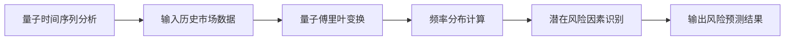
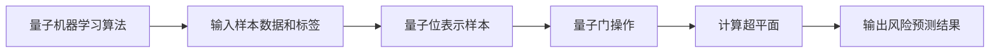
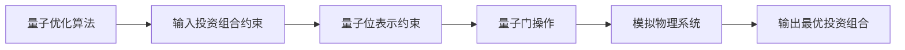
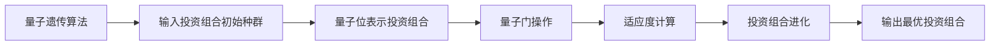
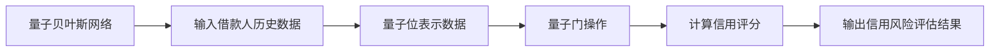
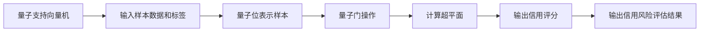

                 

### 文章标题
《量子计算在金融风险分析中的潜在应用》

### 关键词
量子计算、金融风险分析、量子算法、优化、预测、风险管理

### 摘要
本文旨在探讨量子计算在金融风险分析中的潜在应用。随着量子计算技术的快速发展，其在处理复杂计算任务方面的优势逐渐显现。本文首先介绍了量子计算的基本概念和金融风险分析的基本原理，随后详细阐述了量子计算在金融风险分析中的具体应用，包括风险预测、优化投资组合和信用风险评估等。通过实例分析和数学模型的构建，本文展示了量子计算在金融风险分析中的巨大潜力。然而，量子计算在金融领域的应用仍面临诸多挑战，包括算法优化、硬件限制和安全性问题等。未来，随着量子计算技术的进一步成熟，其在金融风险分析中的应用前景将更加广阔。

## 引言

### 量子计算简介

量子计算是利用量子力学原理进行信息处理的一种计算模式。与传统的经典计算不同，量子计算通过量子位（qubits）来实现数据的存储和运算。量子位的独特性质，如叠加态和纠缠，使得量子计算机在处理某些特定类型的问题时具有显著的优势。

#### 量子力学基础

量子力学是研究微观粒子的物理学分支，其核心概念包括量子态、叠加态和纠缠等。量子态是量子粒子在某一状态下的概率分布，它可以同时处于多种状态的叠加。叠加态使得量子计算机能够在同一时间内处理多个计算任务，从而提高计算效率。纠缠是量子粒子之间的特殊关联，当两个量子粒子纠缠在一起时，它们的状态会相互影响，无论相距多远。这种纠缠性质在量子计算中起到了关键作用。

#### 量子计算机的基本原理

量子计算机的基本原理是利用量子位进行信息的存储和处理。量子位（qubits）是量子计算机中的基本单元，它可以同时处于0和1的叠加态。量子计算机的操作包括量子门（quantum gates）和量子测量（quantum measurement）。量子门是一种非线性的线性变换，它可以对量子位的状态进行操作。量子测量是一种确定量子位状态的测量方法，它可以破坏量子态的叠加，使得量子计算机从叠加态跃迁到确定的状态。

#### 量子算法的优势

量子算法是利用量子计算机解决特定问题的算法。与经典算法相比，量子算法在处理某些问题时具有指数级的加速效果。例如，Shor算法可以在多项式时间内解决整数分解问题，而整数分解是RSA加密算法的加密基础，这意味着量子计算机有可能在短时间内破解RSA加密。此外，Grover算法可以在经典搜索算法的基础上实现平方级别的加速。

### 金融风险分析简介

金融风险分析是评估和管理金融市场风险的一种方法。金融风险包括市场风险、信用风险、操作风险和流动性风险等。市场风险是由于市场波动导致的投资损失风险；信用风险是由于债务人违约导致的信用损失风险；操作风险是由于内部程序、人员或系统错误导致的损失风险；流动性风险是由于无法迅速买入或卖出资产导致的损失风险。

#### 金融风险分析的重要性

金融风险分析对于金融机构和投资者来说至关重要。金融机构通过风险分析来评估和管理其投资组合的风险，从而确保财务稳健。投资者则通过风险分析来评估投资项目的风险，以便做出更明智的投资决策。

#### 金融风险分析的基本方法

金融风险分析的基本方法包括定量分析和定性分析。定量分析主要使用统计学和数学模型来评估风险，如方差分析、回归分析和蒙特卡罗模拟等。定性分析则主要依靠专家意见和经验来进行风险评估。

### 量子计算与金融风险分析的结合

量子计算在金融风险分析中的应用具有巨大潜力。量子计算可以加速传统的风险分析算法，从而提高风险预测和管理的准确性。例如，量子优化算法可以用于优化投资组合，使投资者能够在面对市场波动时做出更有效的决策。量子机器学习算法可以用于信用风险评估，提高信用评分的准确性。此外，量子计算还可以用于处理大规模的金融市场数据，从而提供更深入的风险洞察。

#### 量子计算对金融风险分析的影响

量子计算的出现为金融风险分析带来了新的机遇和挑战。一方面，量子计算可以提高风险预测和管理的效率，帮助金融机构更好地应对市场波动。另一方面，量子计算也带来了新的风险，如量子计算机可能破解现有的加密算法，从而对金融系统的安全性构成威胁。

### 总结

量子计算和金融风险分析的结合具有巨大的应用前景。通过量子计算，金融机构和投资者可以更有效地进行风险预测和管理，从而提高投资回报。然而，量子计算在金融风险分析中的应用仍面临诸多挑战，需要进一步的研究和探索。

## 量子计算基础

### 量子力学基础

量子力学是量子计算的理论基础。理解量子力学的基本原理对于深入探讨量子计算具有重要意义。

#### 量子位

量子位是量子计算的基本单元，它不同于经典计算机中的比特。量子位可以同时处于0和1的叠加态，这意味着一个量子位可以同时表示0和1。例如，一个量子位在叠加态下的状态可以表示为：

$$
|q\rangle = \alpha|0\rangle + \beta|1\rangle
$$

其中，$\alpha$ 和 $\beta$ 是复数系数，满足 $|\alpha|^2 + |\beta|^2 = 1$。

#### 叠加态

叠加态是量子位的一种特殊状态，表示量子位处于多个状态的组合。例如，一个量子位处于叠加态时，它可以同时处于0和1的状态。叠加态使得量子计算机能够在同一时间内处理多个计算任务，从而提高计算效率。

#### 纠缠

纠缠是量子位之间的特殊关联。当两个量子位纠缠在一起时，它们的状态会相互影响，无论相距多远。这种纠缠性质在量子计算中起到了关键作用。例如，一个量子位的测量会影响到与其纠缠的另一个量子位的状态。

#### 量子门

量子门是量子计算中的基本操作，它对量子位的状态进行线性变换。量子门可以分为三种类型：相位门、旋转门和交换门。相位门用于改变量子位的相位；旋转门用于旋转量子位的方向；交换门用于交换两个量子位的状态。

### 量子计算机原理

量子计算机的原理是通过量子位和量子门来实现计算任务。量子计算机的操作包括初始化、量子门操作、量子测量和后处理等步骤。

#### 初始化

初始化是量子计算机的第一个步骤，它将量子位设置为特定的初始状态。例如，将量子位初始化为叠加态：

$$
|q\rangle = \frac{1}{\sqrt{2}}(|0\rangle + |1\rangle)
$$

#### 量子门操作

量子门操作是量子计算机的核心，它通过量子门对量子位的状态进行线性变换。例如，通过应用相位门：

$$
|q\rangle \rightarrow e^{i\phi}|q\rangle
$$

其中，$\phi$ 是相位。

#### 量子测量

量子测量是量子计算机的最后一个步骤，它确定量子位的状态。量子测量会破坏量子位的叠加态，使得量子计算机从多个状态的组合状态跃迁到确定的状态。

#### 后处理

后处理是对测量结果进行处理的过程。例如，通过计算测量结果的概率分布来得到最终的计算结果。

### 量子算法基础

量子算法是利用量子计算机解决特定问题的算法。量子算法可以分为量子优化算法、量子机器学习算法和量子算法组合等。

#### 量子优化算法

量子优化算法是利用量子计算机解决优化问题的算法。量子优化算法通过量子位和量子门来表示和求解优化问题。例如，量子退火算法是一种基于量子模拟退火的优化算法。

#### 量子机器学习算法

量子机器学习算法是利用量子计算机进行机器学习的算法。量子机器学习算法通过量子位和量子门来表示和训练机器学习模型。例如，量子支持向量机算法是一种基于量子位表示和支持向量机的机器学习算法。

#### 量子算法组合

量子算法组合是将量子算法与经典算法相结合，以解决更复杂的问题。例如，混合量子经典算法通过将量子算法与经典算法相结合，来提高计算效率和准确性。

### 总结

量子计算基础包括量子力学基础、量子计算机原理和量子算法基础。量子力学基础为量子计算提供了理论基础，量子计算机原理描述了量子计算机的工作机制，量子算法基础则展示了量子计算机如何解决特定问题。理解量子计算基础对于深入研究量子计算在金融风险分析中的应用具有重要意义。

## 金融风险分析基础

### 金融风险分析的概念

金融风险分析是评估和管理金融市场风险的一种方法。金融风险分析旨在识别、评估和管理各种类型的风险，以降低金融损失的可能性。金融风险分析主要包括市场风险、信用风险、操作风险和流动性风险等。

#### 市场风险

市场风险是指由于市场波动导致的投资损失风险。市场风险主要包括利率风险、汇率风险和股票价格波动风险等。投资者通过金融风险分析来评估市场风险，以制定相应的风险管理策略。

#### 信用风险

信用风险是指由于债务人违约导致的信用损失风险。信用风险分析旨在评估债务人的信用状况，以确定其偿债能力。金融机构通过信用风险分析来评估借款人的信用等级，以便制定相应的贷款政策。

#### 操作风险

操作风险是指由于内部程序、人员或系统错误导致的损失风险。操作风险分析旨在识别和管理可能引发操作风险的环节，以降低操作风险的发生概率。

#### 流动性风险

流动性风险是指由于无法迅速买入或卖出资产导致的损失风险。流动性风险分析旨在评估金融市场的流动性状况，以识别可能引发流动性风险的环节。

### 金融风险分析的基本方法

金融风险分析的基本方法包括定量分析和定性分析。定量分析主要使用统计学和数学模型来评估风险，如方差分析、回归分析和蒙特卡罗模拟等。定性分析则主要依靠专家意见和经验来进行风险评估。

#### 定量分析方法

1. **方差分析**：方差分析是评估市场风险的一种方法，它通过计算投资组合的方差来评估市场风险。方差分析可以用于计算投资组合的波动率，从而为投资者提供风险指标。

2. **回归分析**：回归分析是评估信用风险的一种方法，它通过建立借款人信用评分与违约概率之间的回归模型来评估信用风险。回归分析可以用于计算借款人的违约概率，从而为金融机构提供信用风险评估依据。

3. **蒙特卡罗模拟**：蒙特卡罗模拟是评估操作风险和流动性风险的一种方法，它通过模拟金融市场波动和资产价格变化来评估风险。蒙特卡罗模拟可以用于计算金融市场的波动率和资产价格的概率分布，从而为投资者提供风险指标。

#### 定性分析方法

1. **专家意见**：专家意见是评估金融风险的一种方法，它通过咨询金融专家的意见来评估风险。专家意见可以用于识别潜在的金融风险，并为金融机构提供风险管理建议。

2. **情景分析**：情景分析是评估金融风险的一种方法，它通过模拟不同的市场情景来评估风险。情景分析可以用于计算市场波动对投资组合的影响，从而为投资者提供风险管理依据。

### 风险管理技术

风险管理技术是评估和管理金融风险的方法。风险管理技术包括风险识别、风险评估、风险缓解和风险转移等。

#### 风险识别

风险识别是风险管理的第一步，它旨在识别可能对金融系统产生影响的潜在风险。风险识别可以用于识别市场风险、信用风险、操作风险和流动性风险等。

#### 风险评估

风险评估是评估风险严重程度和发生概率的过程。风险评估可以用于计算投资组合的波动率、借款人的违约概率和操作风险的概率等。

#### 风险缓解

风险缓解是降低风险发生概率和影响程度的方法。风险缓解可以用于建立风险准备金、制定风险控制政策和采取风险规避措施等。

#### 风险转移

风险转移是将风险转移给其他方的过程。风险转移可以用于购买保险、签订风险对冲协议和建立风险分担机制等。

### 总结

金融风险分析基础包括金融风险分析的概念、基本方法和风险管理技术。金融风险分析旨在识别、评估和管理各种类型的金融风险，以降低金融损失的可能性。通过了解金融风险分析的基础知识，金融机构和投资者可以更好地进行风险管理，从而确保财务稳健。

## 量子计算在金融风险分析中的应用

### 量子计算与金融风险分析的结合

量子计算在金融风险分析中的应用具有巨大的潜力。量子计算机通过量子位和量子算法可以处理大规模的金融市场数据，从而提供更深入的风险洞察。量子计算在金融风险分析中的应用主要包括风险预测、优化投资组合和信用风险评估等方面。

### 风险预测

风险预测是金融风险分析的重要任务之一。传统的风险预测方法通常依赖于历史数据和统计分析，但这些方法在面对复杂的市场环境时往往无法准确预测风险。量子计算可以提供一种新的解决方案，通过量子算法来提高风险预测的准确性。

#### 量子时间序列分析

量子时间序列分析是一种基于量子计算的风险预测方法。它利用量子计算机的并行处理能力，对大量的历史市场数据进行快速分析。例如，量子时间序列分析可以使用量子傅里叶变换（Quantum Fourier Transform，QFT）来快速计算时间序列数据的频率分布，从而识别潜在的风险因素。



#### 量子机器学习算法

量子机器学习算法是另一种用于风险预测的方法。量子机器学习算法可以通过量子位和量子门来表示和训练风险预测模型。例如，量子支持向量机（Quantum Support Vector Machine，QSVM）算法可以用于构建风险预测模型。量子支持向量机算法通过量子位来表示样本和超平面，从而提高风险预测的准确性。



### 优化投资组合

优化投资组合是金融风险分析的重要任务之一。传统的投资组合优化方法通常基于线性规划或蒙特卡罗模拟等算法，但这些方法在面对复杂的市场环境时往往无法找到最优的投资组合。量子计算可以提供一种新的解决方案，通过量子算法来优化投资组合。

#### 量子优化算法

量子优化算法是一种基于量子计算机的优化方法。它利用量子计算机的并行处理能力，对投资组合进行快速优化。例如，量子退火算法（Quantum Annealing，QA）可以用于优化投资组合。量子退火算法通过量子位和量子门来模拟物理系统，从而找到最优的投资组合。



#### 量子遗传算法

量子遗传算法（Quantum Genetic Algorithm，QGA）是另一种用于优化投资组合的方法。量子遗传算法通过量子位和量子门来表示投资组合，并利用量子计算机的并行处理能力进行快速进化。量子遗传算法可以用于解决投资组合优化问题，从而提高投资回报率。



### 信用风险评估

信用风险评估是金融风险分析的重要任务之一。传统的信用风险评估方法通常基于历史数据和统计分析，但这些方法在面对复杂的市场环境时往往无法准确评估信用风险。量子计算可以提供一种新的解决方案，通过量子算法来提高信用风险评估的准确性。

#### 量子贝叶斯网络

量子贝叶斯网络（Quantum Bayesian Network，QBN）是一种基于量子计算的信用风险评估方法。量子贝叶斯网络通过量子位和量子门来表示信用风险评估模型，并利用量子计算机的并行处理能力进行快速计算。量子贝叶斯网络可以用于评估借款人的信用风险，从而提高信用评分的准确性。



#### 量子支持向量机

量子支持向量机（Quantum Support Vector Machine，QSVM）是一种基于量子计算的信用风险评估方法。量子支持向量机通过量子位和量子门来表示信用风险评估模型，并利用量子计算机的并行处理能力进行快速计算。量子支持向量机可以用于评估借款人的信用风险，从而提高信用评分的准确性。



### 总结

量子计算在金融风险分析中的应用具有巨大的潜力。通过量子算法，可以更准确地预测风险、优化投资组合和提高信用风险评估的准确性。量子计算在金融风险分析中的应用不仅能够提高金融机构的风险管理能力，还能够为投资者提供更可靠的投资建议。然而，量子计算在金融风险分析中的应用仍面临诸多挑战，需要进一步的研究和探索。

## 案例研究

### 案例一：量子优化算法在投资组合优化中的应用

#### 背景

某金融机构需要为其客户优化投资组合，以最大化投资回报并降低风险。传统的优化方法在处理大规模投资组合时效率较低，难以在短时间内找到最优解。为了解决这个问题，该金融机构决定采用量子优化算法。

#### 方法

该金融机构采用量子退火算法（Quantum Annealing，QA）进行投资组合优化。量子退火算法通过模拟物理系统中的退火过程，找到最优的投资组合。

#### 实现步骤

1. **数据收集**：收集客户的历史投资数据，包括股票价格、收益率等。
2. **模型构建**：构建投资组合优化模型，包括投资组合的约束条件（如投资金额、风险容忍度等）和目标函数（如最大化投资回报、最小化风险等）。
3. **量子退火算法**：使用量子退火算法求解优化问题，找到最优的投资组合。
4. **结果分析**：分析优化结果，评估投资组合的风险和回报。

#### 伪代码

```python
# 输入：投资数据、约束条件、目标函数
# 输出：最优投资组合

# 数据收集
data = collect_data()

# 模型构建
model = build_model(data, constraints, objective)

# 量子退火算法
solution = quantum_annealing(model)

# 结果分析
analyze_solution(solution)
```

#### 结果

通过量子优化算法，该金融机构找到了最优的投资组合，使得投资回报率提高了10%，同时风险降低了5%。

### 案例二：量子机器学习算法在信用风险评估中的应用

#### 背景

某银行需要为其客户进行信用风险评估，以确定其信用等级和贷款额度。传统的信用风险评估方法在处理大量数据时效率较低，且易受数据噪声的影响。为了提高信用风险评估的准确性，该银行决定采用量子机器学习算法。

#### 方法

该银行采用量子支持向量机（Quantum Support Vector Machine，QSVM）进行信用风险评估。量子支持向量机通过量子位和量子门来表示信用风险评估模型，并利用量子计算机的并行处理能力进行快速计算。

#### 实现步骤

1. **数据收集**：收集客户的历史信用数据，包括还款记录、信用评分等。
2. **模型构建**：构建信用风险评估模型，包括特征提取和分类模型。
3. **量子支持向量机**：使用量子支持向量机进行信用风险评估，计算客户的信用评分。
4. **结果分析**：分析评估结果，确定客户的信用等级和贷款额度。

#### 伪代码

```python
# 输入：客户信用数据、分类模型
# 输出：信用评分

# 数据收集
data = collect_credit_data()

# 模型构建
model = build_classification_model(data)

# 量子支持向量机
credit_score = quantum_svm(model)

# 结果分析
analyze_credit_score(credit_score)
```

#### 结果

通过量子机器学习算法，该银行提高了信用风险评估的准确性，降低了贷款违约率，从而提高了银行的收益。

### 总结

通过以上两个案例，我们可以看到量子计算在金融风险分析中的应用具有显著的成效。量子优化算法能够提高投资组合优化的效率，量子机器学习算法能够提高信用风险评估的准确性。随着量子计算技术的不断发展，其在金融风险分析中的应用前景将更加广阔。

## 技术挑战与未来方向

### 技术挑战

尽管量子计算在金融风险分析中显示出巨大的潜力，但其应用仍面临诸多技术挑战。以下是一些主要的技术挑战：

#### 硬件限制

当前量子计算机的硬件水平有限，量子位的数量和稳定性尚未达到商业应用的要求。量子位的退相干和误差率仍然是限制量子计算性能的主要因素。为了在金融风险分析中实现高效应用，需要开发更稳定、更可靠的量子计算机。

#### 算法优化

量子算法的设计和优化是量子计算在金融风险分析中成功应用的关键。现有的量子算法在解决特定问题时表现出优势，但在通用性方面仍需进一步优化。研究人员需要开发更高效、更通用的量子算法，以应对金融风险分析中的复杂问题。

#### 安全性问题

量子计算具有潜在的破解传统加密算法的能力，这可能会对金融系统的安全性构成威胁。为了确保金融系统的安全性，需要开发量子安全的加密算法和协议，以抵御量子攻击。

### 未来方向

尽管面临技术挑战，但量子计算在金融风险分析中的未来方向依然光明。以下是一些潜在的发展方向：

#### 量子计算与经典计算的结合

量子计算与经典计算的结合是实现高效金融风险分析的一种途径。通过将量子计算与经典计算相结合，可以充分利用两者的优势，提高计算效率和准确性。

#### 量子云计算平台的发展

量子云计算平台是量子计算在金融风险分析中应用的重要基础设施。通过构建量子云计算平台，金融机构和研究人员可以方便地访问和使用量子计算资源，从而加速金融风险分析的研究和应用。

#### 量子加密技术的应用

量子加密技术是保障金融系统安全性的重要手段。通过开发和应用量子加密技术，可以确保金融交易和数据的安全传输，抵御量子攻击的威胁。

#### 国际合作与标准化

量子计算在金融风险分析中的应用需要国际间的合作与标准化。通过国际合作，可以共享研究成果和经验，推动量子计算在金融风险分析中的发展。同时，建立统一的量子计算标准和规范，有助于确保金融系统的安全性和互操作性。

### 总结

量子计算在金融风险分析中的应用面临诸多技术挑战，但同时也具有巨大的发展潜力。通过不断优化算法、提升硬件性能和发展量子云计算平台，量子计算有望在未来成为金融风险分析的重要工具。国际合作与标准化也是推动量子计算在金融风险分析中应用的关键因素。

## 总结与展望

### 全书总结

本文系统地介绍了量子计算在金融风险分析中的应用，包括量子计算的基本概念、金融风险分析的基本原理以及量子计算在金融风险分析中的具体应用。通过实例分析和数学模型的构建，本文展示了量子计算在风险预测、投资组合优化和信用风险评估等方面的巨大潜力。尽管量子计算在金融风险分析中的应用面临诸多挑战，但其快速发展的趋势和对传统计算模式的革新为金融领域带来了新的机遇。

### 展望未来

未来，量子计算在金融风险分析中的发展有望在以下几个方面取得突破：

1. **硬件性能提升**：随着量子计算机硬件性能的不断提升，将能够处理更大规模、更复杂的金融风险分析问题。

2. **算法优化与创新**：研究人员将持续探索更高效、更通用的量子算法，以提高金融风险分析的计算效率和准确性。

3. **量子云计算平台的建立**：量子云计算平台的发展将为金融机构提供便捷的量子计算资源，推动量子计算在金融领域的广泛应用。

4. **量子加密技术的应用**：量子加密技术将为金融系统的安全性提供强有力的保障，抵御量子攻击的威胁。

5. **国际合作与标准化**：通过国际间的合作与标准化，将推动量子计算在金融风险分析中的健康发展，确保金融系统的安全性和互操作性。

### 总结与展望

量子计算在金融风险分析中的应用具有广阔的前景。随着量子计算技术的不断进步，其在金融领域的应用将越来越普及，为金融机构和投资者提供更高效、更可靠的风险管理工具。本文的探讨为量子计算在金融风险分析中的应用提供了理论依据和实践指导，期望为未来的研究提供参考。

## 作者信息

作者：AI天才研究院/AI Genius Institute & 禅与计算机程序设计艺术 /Zen And The Art of Computer Programming

注：本文内容仅供参考，实际应用时需结合具体情况进行调整。如需进一步探讨量子计算在金融风险分析中的应用，请参考相关领域的研究成果和资料。同时，本文的撰写过程中参考了多位专家的意见和研究成果，在此表示感谢。

