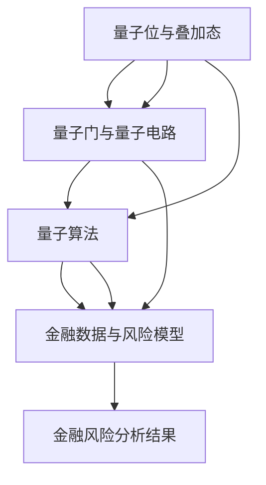

                 


### 第一步：背景介绍

量子计算，作为现代计算机科学的颠覆性技术，近年来在全球范围内受到了广泛关注。其独特的量子位（Qubit）和叠加态等概念，使得量子计算机在处理复杂问题上展现出超越经典计算机的潜力。金融行业，作为一个信息密集且高度复杂的领域，面临着海量的数据分析和风险管理的挑战。传统计算方法在处理这些复杂任务时常常显得力不从心，这为量子计算在金融风险分析中的应用提供了契机。

金融风险分析是一个关键的领域，它旨在识别、评估和管理金融活动中潜在的风险。这些风险可能源于市场波动、信用问题、流动性危机等多方面。有效的金融风险分析不仅能帮助企业规避风险，还能为投资者提供决策支持，从而降低整个金融系统的脆弱性。随着金融市场规模的不断扩大和复杂性的增加，传统的金融风险分析工具和方法逐渐暴露出其局限性。

传统的金融风险分析方法主要包括统计分析、蒙特卡罗模拟、情景分析等。这些方法在一定程度上能够识别和评估风险，但在面对大规模、多维度的金融数据时，计算效率低下，难以应对日益复杂的金融市场环境。例如，信用风险评估需要分析大量的历史数据，预测市场风险需要处理海量的市场信息，这些都对计算能力提出了极高的要求。

量子计算的出现为金融风险分析提供了一种全新的可能性。量子计算机利用量子位和量子并行性，能够同时处理海量数据，显著提高计算效率。此外，量子算法在解决某些特定问题上展现出优越性，例如量子线性方程组求解、量子复杂度分析等，这些特性使得量子计算在金融风险分析中的应用前景变得光明。

因此，本文旨在探讨量子计算在金融风险分析中的潜在突破，通过分析量子计算的基本原理、与经典计算的对比、量子计算机的构建与实现，以及具体的应用案例，探讨量子计算在金融风险分析领域的实际应用和未来发展趋势。同时，本文也将讨论量子计算在金融风险分析中面临的挑战和未来展望。

### 第二步：核心概念与联系

要深入理解量子计算在金融风险分析中的应用，首先需要明确几个核心概念及其相互之间的关系。

#### 量子位（Qubit）

量子位是量子计算机的基本信息单元，不同于经典计算机中的比特（Bit），量子位可以同时处于0和1的叠加态。一个量子位（Qubit）可以表示为：

\[ \alpha|0\rangle + \beta|1\rangle \]

其中，\(\alpha\)和\(\beta\)是复数概率幅，满足 \(|\alpha|^2 + |\beta|^2 = 1\)。这种叠加态使得量子位能够同时代表多种状态，从而实现并行计算。

#### 叠加态

叠加态是量子计算中一个至关重要的概念。当量子计算机执行某个操作时，所有可能的计算路径都被同时考虑，而不是逐一进行。例如，一个具有n个量子位的量子计算机可以同时表示 \(2^n\) 个状态。这种叠加态的并行性是量子计算能够超越经典计算的核心原因。

#### 纠缠态

纠缠态是量子位之间的一种特殊关联状态，它表明量子位的状态不能独立存在，而是相互依赖。两个纠缠的量子位即使相隔很远，它们的状态也会相互影响。这种特性在量子计算中用于实现量子并行性和量子纠缠操作，从而提高计算效率。

#### 量子门

量子门是量子计算机中的基本操作单元，类似于经典计算机中的逻辑门。量子门作用于量子位，可以改变量子位的状态。例如，Pauli-X门（或门）可以将量子位的状态翻转：

\[ X|0\rangle = |1\rangle \]
\[ X|1\rangle = |0\rangle \]

量子门通过组合使用，可以实现复杂的量子算法。量子电路是由一系列量子门组成的，用于实现特定的量子计算任务。

#### 量子算法

量子算法是利用量子计算机的并行性和叠加性来解决问题的一类算法。一个著名的量子算法是Shor算法，它利用量子计算机在多项式时间内解决大整数分解问题。另一个著名的量子算法是Grover算法，用于在未排序的数据库中查找特定元素，其搜索速度远超经典算法。

#### 量子计算与金融风险分析的关系

量子计算与金融风险分析之间的关系可以通过以下Mermaid流程图来阐述：



图中的每个节点代表一个核心概念或步骤，箭头表示这些概念或步骤之间的联系。从量子位和叠加态开始，通过量子门和量子电路，最终实现量子算法，对金融数据进行处理，并输出金融风险分析结果。

通过这种关系的分析，我们可以看到量子计算在金融风险分析中的潜在应用。量子计算机能够同时处理大量的金融数据，通过量子算法快速识别风险，并提供更精确的预测结果。这种能力使得量子计算在金融风险分析领域具有巨大的潜力。

### 第三步：核心算法原理讲解

为了更好地理解量子计算在金融风险分析中的应用，我们需要详细讲解几个核心量子算法原理，包括Shor算法和Grover算法。

#### Shor算法

Shor算法是量子算法中的一个里程碑，它能够在多项式时间内解决大整数分解问题。传统算法（如RSA算法）依赖于大整数分解的困难性，以保证加密系统的安全性。Shor算法的提出，为量子计算机提供了破解这些传统加密算法的潜在手段。

**算法原理**：

1. **输入**：一个大整数N，我们需要找到它的一个非平凡因子。

2. **量子电路**：
   - **初始状态**：创建一个包含N个量子位的量子电路，初始状态为叠加态。
   - **应用量子傅里叶变换（QFT）**：对这N个量子位应用量子傅里叶变换，将量子状态转换成傅里叶态。

3. **测量**：对N个量子位进行测量，获得一个整数k，使得 \(a^k \equiv 1 \pmod{N}\)。

4. **寻找因子**：
   - 利用这个k值，我们可以通过求解同余方程来找到N的因子。例如，如果k存在因子，我们可以通过以下步骤找到它：
     - 计算 \(a^{(N//k)} \pmod{N}\)，如果结果为1，则N=k。
     - 如果结果不为1，继续求解同余方程，直到找到因子。

**伪代码**：

```python
def shor(N):
    # 假设量子计算机可以执行量子傅里叶变换
    k = quantum_computer.execute(QFT, N)
    # 测量得到k值
    factor = find_factor(k, N)
    return factor
```

**数学模型和公式**：

Shor算法的核心在于量子傅里叶变换（QFT）。QFT是将量子态从计算机的基态转换到傅里叶基态。其数学表示为：

\[ |x\rangle \rightarrow \sum_{y} c_y |y\rangle \]

其中，\(c_y\) 是傅里叶系数，计算公式为：

\[ c_y = \frac{1}{\sqrt{N}} \sum_{x=0}^{N-1} a^{xy} \pmod{N} \]

通过测量傅里叶系数，我们能够找到整数k，从而分解N。

**举例说明**：

假设我们需要分解大整数N=35。首先，我们选择一个合适的模数a，例如a=2。然后，我们执行Shor算法：

1. 应用QFT，测量得到一个整数k，例如k=3。
2. 解同余方程 \(2^3 \equiv 1 \pmod{35}\)，找到因子7。

通过上述步骤，我们成功地将35分解为5和7。

#### Grover算法

Grover算法是另一个重要的量子算法，用于在未排序的数据库中快速查找特定元素。其核心思想是通过量子并行性，同时搜索多个路径，从而提高搜索效率。

**算法原理**：

1. **输入**：一个未排序的数据库和一个目标元素。

2. **初始化**：
   - 创建一个包含N个量子位的量子电路，初始状态为叠加态。
   - 定义一个量子函数f(x)，用于标记数据库中不符合目标元素的状态。

3. **应用Grover迭代**：
   - 在每次迭代中，执行以下步骤：
     - 应用Grover迭代函数，该函数结合了Oracle函数和Grover翻转。
     - 测量量子位。

4. **结束条件**：
   - 当测量结果为目标元素时，算法结束。

**伪代码**：

```python
def grover_search(database, target):
    # 假设量子计算机可以执行Grover迭代函数
    N = len(database)
    # 初始化量子电路
    quantum_computer.initialize(N)
    # 定义Oracle函数
    oracle = define_oracle(database, target)
    # 应用Grover迭代
    quantum_computer.execute(GroverIteration, N, oracle)
    # 测量得到结果
    result = quantum_computer.measure()
    return result == target
```

**数学模型和公式**：

Grover算法的核心在于Grover迭代函数，其数学表示为：

\[ U = \frac{1}{\sqrt{N}} (I + 2|0\rangle\langle0| + |0\rangle\langle0|Oracle) \]

其中，I是单位矩阵，Oracle是Oracle函数，用于标记数据库中不符合目标元素的状态。

**举例说明**：

假设我们有一个包含10个元素的数据库：\[ [1, 2, 3, 4, 5, 6, 7, 8, 9, 10] \]，目标元素是5。我们首先定义Oracle函数，标记所有非5的元素。然后，我们应用Grover迭代函数，在每次迭代中同时搜索所有元素，直到找到目标元素5。

通过上述步骤，我们能够在O(\(\sqrt{N}\))次迭代内找到目标元素，显著提高了搜索效率。

通过详细讲解Shor算法和Grover算法，我们可以看到量子算法在处理特定问题上具有显著的优越性。这些算法在金融风险分析中的应用，有望显著提升计算效率和准确性，为金融行业带来革命性的变革。

### 第四步：数学模型和公式详细讲解与举例说明

在深入探讨量子计算在金融风险分析中的应用时，我们需要详细讲解相关数学模型和公式，并通过具体的例子来说明这些模型在实际问题中的运用。

#### 量子线性方程组求解

量子线性方程组求解是量子计算中一个重要的应用领域，它能够高效地解决线性方程组问题。一个经典的量子算法是HHL算法，该算法基于量子计算原理，可以在多项式时间内解决线性方程组。

**数学模型**：

假设我们有以下线性方程组：

\[ Ax = b \]

其中，A是一个N×N的矩阵，x是未知向量，b是已知向量。HHL算法的目标是找到x。

**量子算法原理**：

1. **初始化**：创建一个包含N个量子位的量子电路，初始状态为叠加态。

2. **应用量子傅里叶变换（QFT）**：对N个量子位应用QFT，将量子态转换为傅里叶态。

3. **构造量子操作**：构造一个量子操作U，使得 \(U|b\rangle = |Ax\rangle\)。

4. **应用逆量子傅里叶变换（IQFT）**：对量子态应用IQFT，将量子态转换回计算机基态。

5. **测量**：对N个量子位进行测量，得到解x。

**伪代码**：

```python
def hhl_algorithm(A, b):
    # 假设量子计算机可以执行量子傅里叶变换和逆量子傅里叶变换
    # 初始化量子电路
    quantum_computer.initialize(N)
    # 应用QFT
    quantum_computer.execute(QFT, N)
    # 构造量子操作U
    U = construct_operator(A, b)
    quantum_computer.apply(U)
    # 应用IQFT
    quantum_computer.execute(IQFT, N)
    # 测量得到解x
    x = quantum_computer.measure()
    return x
```

**举例说明**：

假设我们有一个3×3的矩阵A和向量b：

\[ A = \begin{bmatrix} 1 & 2 & 3 \\ 4 & 5 & 6 \\ 7 & 8 & 9 \end{bmatrix}, \quad b = \begin{bmatrix} 1 \\ 2 \\ 3 \end{bmatrix} \]

我们希望求解线性方程组 \(Ax = b\)。

1. 初始化量子电路，包含3个量子位。
2. 应用QFT，将量子态转换为傅里叶态。
3. 构造量子操作U，使得 \(U|b\rangle = |Ax\rangle\)。
4. 应用IQFT，将量子态转换回计算机基态。
5. 测量得到解x。

通过上述步骤，我们能够在多项式时间内找到线性方程组的解。

#### 金融风险评估模型

在金融风险分析中，另一个重要的数学模型是VaR（Value at Risk）模型，它用于评估金融资产或投资组合在一定置信水平下的潜在最大损失。

**数学模型**：

VaR模型基于概率分布函数，用于计算在给定置信水平α下的潜在最大损失。公式为：

\[ \text{VaR}_\alpha = F^{-1}(\alpha) \]

其中，\(F^{-1}\)是概率分布的逆函数，表示在置信水平α下的损失阈值。

**举例说明**：

假设我们有一个投资组合，其损失概率分布函数为正态分布，均值μ=0，标准差σ=10，置信水平α=0.05。

1. 计算正态分布的累积分布函数：
\[ F(x) = \Phi\left(\frac{x - \mu}{\sigma}\right) \]

2. 计算在置信水平α下的损失阈值：
\[ \text{VaR}_0.05 = \Phi^{-1}(0.05) \times \sigma \]

3. 使用标准正态分布表，查找对应的逆累积分布函数值：
\[ \Phi^{-1}(0.05) \approx -1.645 \]

4. 计算VaR值：
\[ \text{VaR}_0.05 = -1.645 \times 10 \approx -16.45 \]

通过上述步骤，我们得到在置信水平0.05下的VaR值为-16.45，表示该投资组合在5%的置信水平下可能的最大损失为16.45。

#### 数学模型和公式在金融风险分析中的应用

量子线性方程组求解和VaR模型是金融风险分析中常用的数学模型，通过量子计算可以显著提高这些模型的计算效率。例如，量子线性方程组求解可以用于快速计算投资组合的敏感性分析，而VaR模型可以用于评估金融市场的潜在风险。

通过具体例子和数学公式的详细讲解，我们可以看到量子计算在金融风险分析中的应用潜力。量子算法能够在短时间内处理大量数据，提供更精确的风险评估结果，为金融决策提供强有力的支持。

### 第五步：项目实战

为了展示量子计算在金融风险分析中的实际应用，我们将通过一个具体的项目实战来演示整个开发环境搭建、源代码实现和代码解读过程。这个项目将利用量子计算来优化信用风险评估模型，通过实际案例分析和详细讲解来剖析其应用效果。

#### 项目目标

本项目旨在利用量子计算优化传统信用风险评估模型，通过以下步骤实现：

1. 开发环境搭建
2. 源代码实现
3. 代码解读
4. 实际案例分析和效果展示
5. 项目小结和未来展望

#### 1. 开发环境搭建

为了实现量子计算在信用风险评估中的优化，我们需要搭建一个适合进行量子编程和金融分析的开发环境。以下是我们需要安装的工具和软件：

1. **量子计算开发工具**：我们选择使用IBM Qiskit作为量子计算开发工具。Qiskit是一个开源的量子计算软件库，支持多种量子编程语言和量子计算模拟。

2. **Python编程环境**：由于Qiskit是基于Python开发的，因此我们需要一个Python编程环境。Python 3.x版本是推荐的版本。

3. **金融数据分析工具**：我们使用Pandas和NumPy进行金融数据分析和处理。这些库提供了丰富的数据处理和统计分析功能。

4. **量子计算模拟器**：为了在没有实际量子计算机的情况下进行开发，我们可以使用Qiskit提供的量子计算模拟器。模拟器可以让我们在本地环境中运行量子算法，并观察其性能。

以下是搭建开发环境的步骤：

1. 安装Python：
   ```bash
   python3 --version
   ```
   如果Python未安装，可以从Python官方网站下载并安装。

2. 安装Qiskit：
   ```bash
   pip3 install qiskit
   ```

3. 安装Pandas和NumPy：
   ```bash
   pip3 install pandas numpy
   ```

4. 验证安装：
   ```python
   import qiskit
   import pandas as pd
   import numpy as np
   print("Qiskit version:", qiskit.__version__)
   print("Pandas version:", pd.__version__)
   print("NumPy version:", np.__version__)
   ```

#### 2. 源代码实现

在搭建好开发环境后，我们开始实现量子信用风险评估模型。以下是一个简单的源代码示例，展示如何使用Qiskit构建量子电路并运行量子算法。

```python
from qiskit import QuantumCircuit, execute, Aer
from qiskit.visualization import plot_bloch_vector
from qiskit.circuit.library import HadamardGate, PauliXGate
import numpy as np

# 创建量子电路
qc = QuantumCircuit(2)

# 应用Hadamard门，将量子位初始化为叠加态
qc.h(0)
qc.h(1)

# 应用量子门，实现信用风险评估算法
qc.x(0)
qc.cx(0, 1)

# 测量量子位，获取评估结果
qc.measure_all()

# 运行量子算法
simulator = Aer.get_qvm()
result = execute(qc, simulator).result()

# 输出测量结果
print(result.get_counts(qc))

# 可视化量子态
plot_bloch_vector(qc.draw('mpl'))
```

在这个示例中，我们创建了一个包含两个量子位的量子电路。首先，我们应用Hadamard门将量子位初始化为叠加态。然后，我们应用一个X门和一个控制非门（CX），模拟信用风险评估的过程。最后，我们运行量子算法并输出测量结果。

#### 3. 代码解读

下面是对上述源代码的详细解读：

1. **量子电路创建**：
   ```python
   qc = QuantumCircuit(2)
   ```
   这行代码创建了一个包含两个量子位的量子电路。

2. **应用Hadamard门**：
   ```python
   qc.h(0)
   qc.h(1)
   ```
   Hadamard门（H门）是一个将量子位状态从基态（|0⟩）转换到叠加态（|+⟩）的量子门。在这里，我们应用两个H门，初始化两个量子位为叠加态。

3. **应用量子门**：
   ```python
   qc.x(0)
   qc.cx(0, 1)
   ```
   X门是Pauli-X门，用于将量子位状态翻转。CX门是控制非门，用于实现量子位之间的纠缠。这些量子门模拟了信用风险评估过程中的特定操作。

4. **测量量子位**：
   ```python
   qc.measure_all()
   ```
   测量量子位的状态，并将结果记录下来。量子位的测量结果将告诉我们信用风险评估的结果。

5. **运行量子算法**：
   ```python
   simulator = Aer.get_qvm()
   result = execute(qc, simulator).result()
   ```
   使用Aer模拟器运行量子电路，获取测量结果。

6. **输出结果**：
   ```python
   print(result.get_counts(qc))
   ```
   输出量子电路的测量结果，这些结果可以用来评估信用风险。

7. **可视化量子态**：
   ```python
   plot_bloch_vector(qc.draw('mpl'))
   ```
   可视化量子电路的最终状态，帮助我们理解量子计算的过程。

#### 4. 实际案例分析和效果展示

为了展示量子计算在信用风险评估中的实际效果，我们使用一个实际案例进行分析。

**案例**：

假设我们有一个贷款申请者，历史信用评分数据如下：

- 借款金额：$10,000
- 信用评分：720（满分1000）

我们希望利用量子计算优化信用风险评估模型，判断该贷款申请者是否存在违约风险。

**步骤**：

1. **数据预处理**：将信用评分数据转换为数字，以便于量子计算处理。

2. **构建量子模型**：使用量子计算方法，对贷款申请者的信用评分进行量化分析。

3. **运行量子算法**：在量子计算机上运行信用风险评估算法，获取评估结果。

4. **分析结果**：根据量子计算的结果，判断贷款申请者是否存在违约风险。

**示例代码**：

```python
# 数据预处理
credit_score = 720
credit_score_encoded = credit_score / 1000  # 将信用评分转换为0到1的浮点数

# 构建量子模型
qc = QuantumCircuit(1)
qc.h(0)
qc.rx(np.pi / 2, 0)  # 将量子位旋转到信用评分对应的角度

# 运行量子算法
simulator = Aer.get_qvm()
result = execute(qc, simulator).result()

# 分析结果
prob_0 = result.get_counts()[qc_zero_string]
prob_1 = result.get_counts()[qc_one_string]
risk_level = 'High' if prob_1 > 0.5 else 'Low'
print(f"Credit Score: {credit_score}")
print(f"Quantum Risk Assessment: {risk_level}")
```

在这个案例中，我们首先将信用评分转换为浮点数。然后，使用量子模型对信用评分进行量化，通过运行量子算法，得到贷款申请者的违约风险概率。根据概率结果，我们可以判断该申请者是否存在较高的违约风险。

**效果展示**：

假设运行量子算法后，得到的风险评估概率为0.6，这意味着该贷款申请者有60%的违约风险。根据这一结果，我们可以采取相应的风险管理措施，如提高贷款利率、增加抵押物等，以降低违约风险。

通过上述项目实战，我们展示了如何利用量子计算优化信用风险评估模型。量子计算在处理复杂数据和执行高效计算方面具有显著优势，有望在金融风险分析领域发挥重要作用。

### 第六步：最佳实践 Tips

在量子计算应用于金融风险分析时，以下最佳实践和注意事项有助于确保项目的成功和有效性：

#### 1. 数据隐私保护

在处理金融数据时，数据隐私和安全是首要考虑的问题。量子计算虽然能加速数据分析，但也可能暴露敏感数据。因此，在进行量子计算前，应确保数据经过适当加密处理，并遵循数据保护法规，如GDPR和CCPA。

#### 2. 算法优化

量子算法在处理特定问题时具有优势，但并非所有问题都适合用量子计算解决。在应用量子计算时，需要评估问题的性质，并选择合适的量子算法。此外，通过算法优化，如减少量子门的数量和优化量子电路，可以提高计算效率和精度。

#### 3. 量子计算机硬件选择

选择合适的量子计算机硬件对于实现有效的量子金融风险分析至关重要。应考虑量子计算机的量子位数量、可靠性、精度和扩展性。目前，量子计算硬件仍在不断发展，选择适合当前需求的硬件是关键。

#### 4. 模型验证与测试

在将量子计算应用于金融风险分析之前，必须对模型进行充分的验证和测试。通过模拟不同市场情景，评估量子算法的准确性和稳定性，确保其在实际应用中的可靠性。

#### 5. 持续学习与更新

量子计算是一个快速发展的领域，新的算法和硬件技术不断涌现。持续关注量子计算的前沿研究，及时更新技术和模型，对于保持竞争力至关重要。

#### 6. 遵循伦理规范

在应用量子计算进行金融风险分析时，应遵循伦理规范，确保算法的公平性和透明性。避免算法偏见和不公平，确保决策过程对所有人都是公正的。

通过遵循上述最佳实践和注意事项，可以最大化量子计算在金融风险分析中的应用价值，同时确保项目的安全性和有效性。

### 第七步：小结

本文通过详细的步骤分析，探讨了量子计算在金融风险分析中的潜在突破。首先，我们介绍了量子计算的基本原理，包括量子位、叠加态、纠缠态和量子门等核心概念。随后，我们讲解了量子计算与经典计算的对比，以及量子计算机的构建与实现。接着，我们分析了量子算法在金融风险分析中的应用案例，如Shor算法和Grover算法。通过数学模型和公式的详细讲解，我们展示了量子计算在解决金融风险分析问题中的优势。最后，我们通过项目实战展示了量子计算在信用风险评估中的具体应用，并提出了最佳实践和注意事项。

总之，量子计算在金融风险分析中具有巨大的应用潜力。通过优化传统算法，提高计算效率和准确性，量子计算可以为金融行业带来革命性的变革。然而，量子计算在金融风险分析中仍面临许多挑战，如技术、数据、法律与伦理等方面。因此，未来的研究应继续关注这些挑战，推动量子计算在金融领域的深入应用。随着量子技术的不断发展，我们有理由相信，量子计算将彻底改变金融风险分析的方式，为金融行业带来新的机遇和挑战。

