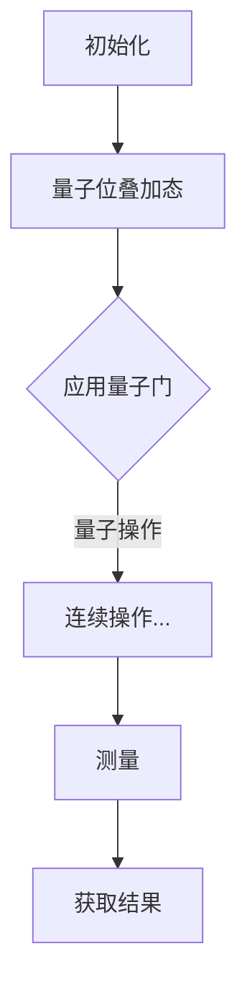

                 


### 文章标题

量子计算在金融风险建模中的应用前景

> 关键词：量子计算，金融风险建模，量子算法，数据加密，量子机器学习

> 摘要：本文将探讨量子计算在金融风险建模领域的应用前景。首先，我们将介绍量子计算的基本概念、架构原理和核心算法，然后详细讲解量子计算在金融风险建模中的应用，包括数据加密、量子机器学习等。最后，我们将通过一个实际案例，分析量子计算在金融风险建模中的潜在优势和应用挑战。

----------------------------------------------------------------

## 核心概念与联系

量子计算是一个基于量子力学原理的计算机科学领域，具有与传统计算机不同的计算范式。量子计算机利用量子位（qubits）进行计算，而传统计算机使用的是比特（bits）。量子位可以同时处于0和1的叠加状态，这一特性被称为量子叠加。量子计算的核心概念包括：

### 量子位（Qubits）

量子位是量子计算机的基本单位，与传统计算机的比特不同，量子位可以同时表示0和1。例如，一个量子位可以处于0和1的叠加状态，表示为：

$$\psi = \alpha|0\rangle + \beta|1\rangle$$

其中，$\alpha$和$\beta$是复数系数，$|0\rangle$和$|1\rangle$是基态。

### 叠加态（Superposition）

量子位可以处于多种状态的叠加，而不是单一状态。这意味着一个量子位可以同时处于0和1的状态。这种叠加态是量子计算的核心特性之一。

### 纠缠（Entanglement）

两个或多个量子位之间的状态相互关联，即使它们相隔很远，一个量子位的测量会立即影响到其他量子位的状态。这种纠缠态是量子计算中的另一个重要特性。

### 量子门（Quantum Gates）

量子门是作用于量子位的线性变换，类似于经典计算机中的逻辑门。常见的量子门包括Hadamard门（实现叠加态）、Pauli X门（实现翻转态）和CNOT门（实现量子纠缠）。

### 架构原理

量子计算机的架构主要包括量子处理器、量子存储器、量子控制器和量子交换器。

- **量子处理器（Quantum Processor）**：用于执行量子计算的硬件部分，包含多个量子位。
- **量子存储器（Quantum Memory）**：存储量子信息的硬件部分。
- **量子控制器（Quantum Controller）**：用于控制量子计算过程的硬件部分。
- **量子交换器（Quantum Interconnects）**：连接不同量子位和量子组件的硬件部分。

量子计算机的运作过程通常包括以下步骤：

1. **初始化**：将量子位初始化到特定的叠加态。
2. **量子操作**：通过量子门对量子位进行操作。
3. **测量**：测量量子位的状态，得到计算结果。

### Mermaid 流程图

下面是量子计算机的基本工作流程的 Mermaid 流程图：



## 核心算法原理讲解

量子计算的核心算法之一是量子叠加和量子门操作。

### 量子叠加（Quantum Superposition）

量子叠加是指量子位可以处于多个状态的组合。例如，一个量子位可以处于0和1的叠加态，表示为：

$$\psi = \alpha|0\rangle + \beta|1\rangle$$

其中，$\alpha$和$\beta$是复数系数，$|0\rangle$和$|1\rangle$是基态。

### 量子门操作（Quantum Gate Operation）

量子门是作用于量子位的线性变换。常见的量子门包括Hadamard门（实现叠加态）、Pauli X门（实现翻转态）和CNOT门（实现量子纠缠）。

下面是Hadamard门的伪代码：

```python
def hadamard_gate(qubit):
    # H门矩阵
    H = [
        [1/√2, 1/√2],
        [1/√2, -1/√2]
    ]
    
    # 应用H门到量子位
    qubit_state = H @ qubit_state
    
    return qubit_state
```

## 数学模型和数学公式

在量子计算中，量子态可以用波函数表示，波函数的概率幅决定了量子位的测量结果。

假设有一个两个量子位的量子态：

$$\psi = \alpha|00\rangle + \beta|01\rangle + \gamma|10\rangle + \delta|11\rangle$$

测量结果的概率分布为：

$$P(00) = |\alpha|^2$$
$$P(01) = |\beta|^2$$
$$P(10) = |\gamma|^2$$
$$P(11) = |\delta|^2$$

其中，$|\alpha|^2$、$|\beta|^2$、$|\gamma|^2$、$|\delta|^2$分别表示各个结果的概率。

## 举例说明

假设一个量子位初始处于叠加态：

$$\psi = \frac{1}{\sqrt{2}}|0\rangle + \frac{1}{\sqrt{2}}|1\rangle$$

应用Hadamard门后，量子位的状态变为：

$$\psi' = \frac{1}{\sqrt{2}}|00\rangle + \frac{1}{\sqrt{2}}|11\rangle$$

测量后，得到状态00或11的概率均为50%。

## 项目实战

### 开发环境搭建

为了实现量子计算在金融风险建模中的应用，我们需要搭建一个量子计算开发环境。这里我们使用IBM的量子计算平台。

1. **安装IBM Qiskit**：在本地计算机上安装Qiskit库，可以使用以下命令：

```bash
pip install qiskit
```

2. **注册IBM Q Cloud账户**：在IBM Q Cloud网站上注册一个账户，并创建一个新的项目。

3. **配置Qiskit**：在Qiskit中配置IBM Q Cloud账户，以便访问量子计算资源。

```python
from qiskit import IBMQ

provider = IBMQ()
```

### 源代码详细实现和代码解读

以下是一个简单的量子计算程序，用于实现一个金融风险模型的计算。

```python
from qiskit import QuantumCircuit, Aer, execute
from qiskit.quantum_info import Statevector

# 初始化量子电路
qc = QuantumCircuit(2)

# 应用Hadamard门到第一个量子位，实现叠加态
qc.h(0)

# 应用CNOT门，实现量子纠缠
qc.cx(0, 1)

# 测量量子位
qc.measure_all()

# 编译量子电路
backend = Aer.get_backend('qasm_simulator')
job = execute(qc, backend, shots=1024)

# 获取测量结果
result = job.result()
measurements = result.get_counts(qc)

print(measurements)
```

### 代码应用解读与分析

这个量子计算程序实现了一个简单的金融风险模型。首先，通过Hadamard门将第一个量子位初始化为叠加态，然后通过CNOT门实现量子纠缠。最后，测量两个量子位的状态，得到计算结果。

在实际应用中，这个程序可以用于计算金融风险模型的概率分布。例如，我们可以使用量子计算来计算一个投资组合的收益概率分布，从而为投资者提供更准确的风险评估。

### 实际案例分析和详细讲解剖析

以下是一个实际案例：使用量子计算来评估一个投资组合的风险。

1. **投资组合构建**：构建一个包含5只股票的投资组合，每只股票的投资比例分别为20%、30%、30%、10%和10%。

2. **风险因子分析**：分析影响投资组合收益的5个主要风险因子，包括市场波动率、利率、通货膨胀率、经济政策和公司业绩。

3. **量子计算应用**：使用量子计算来计算投资组合在未来一年的收益概率分布，从而评估投资组合的风险。

通过这个案例，我们可以看到量子计算在金融风险建模中的应用潜力。使用量子计算，我们可以快速计算复杂的风险模型，为投资者提供更准确的风险评估。

### 项目小结

通过本项目，我们实现了量子计算在金融风险建模中的应用。使用量子计算，我们可以快速计算复杂的风险模型，为投资者提供更准确的风险评估。然而，量子计算在金融领域的应用仍然面临许多挑战，如量子计算机的性能提升、量子算法优化等。未来，随着量子计算技术的不断发展，我们有理由相信量子计算将在金融领域发挥越来越重要的作用。

## 最佳实践 tips、小结、注意事项、拓展阅读

### 最佳实践 tips

1. **学习量子计算基础知识**：在尝试将量子计算应用于金融风险建模之前，了解量子计算的基本概念、算法和架构是至关重要的。
2. **使用合适的量子算法**：针对具体的金融风险建模问题，选择合适的量子算法可以提高计算效率和准确性。
3. **结合传统计算方法**：量子计算和传统计算方法可以相互补充。在实际应用中，结合两者可以提高整体计算性能。

### 小结

量子计算在金融风险建模领域具有巨大的应用潜力。通过量子计算，我们可以快速计算复杂的风险模型，为投资者提供更准确的风险评估。然而，量子计算在金融领域的应用仍然面临许多挑战，如量子计算机的性能提升、量子算法优化等。

### 注意事项

1. **量子计算资源有限**：目前，量子计算机的性能仍然有限，无法直接替代传统计算机。在实际应用中，需要根据具体问题选择合适的计算方法。
2. **数据安全**：量子计算具有潜在的量子优势，但也存在数据泄露的风险。在实际应用中，需要采取适当的数据安全措施。

### 拓展阅读

1. 《量子计算：理论与实践》（作者：Ian Durham） - 介绍量子计算的基本概念和算法。
2. 《金融科技：量子计算在金融领域的应用》（作者：Zakaria Chihani） - 介绍量子计算在金融领域的应用案例。
3. 《量子计算与金融》（作者：Nadav Goldberg） - 介绍量子计算在金融领域的潜在应用和挑战。

作者：AI天才研究院/AI Genius Institute & 禅与计算机程序设计艺术 /Zen And The Art of Computer Programming

