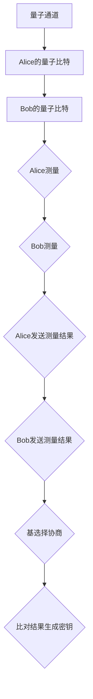
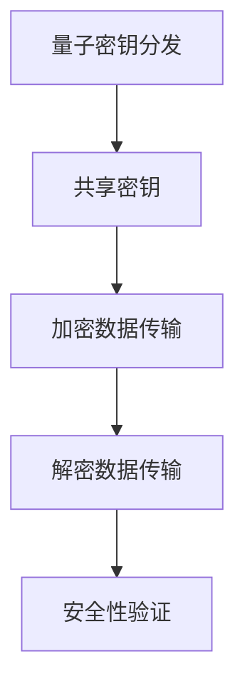
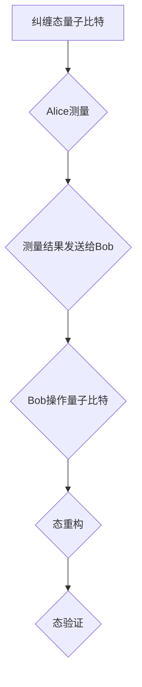
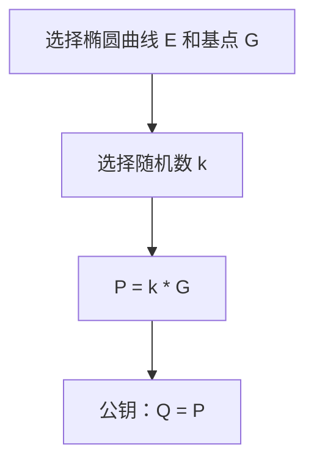
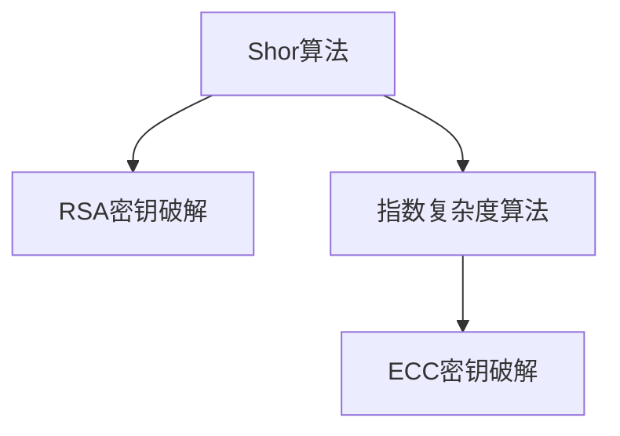
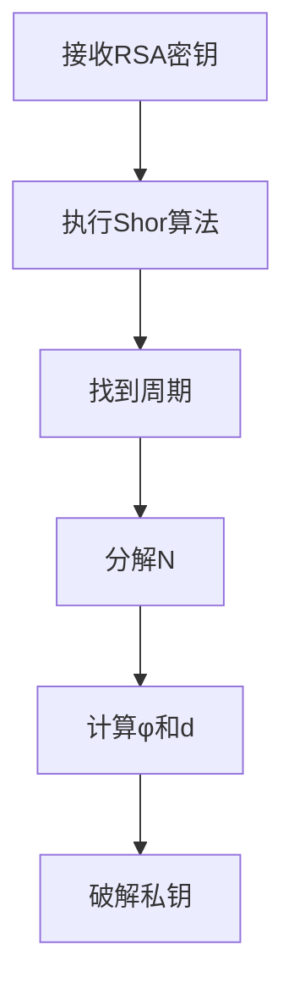
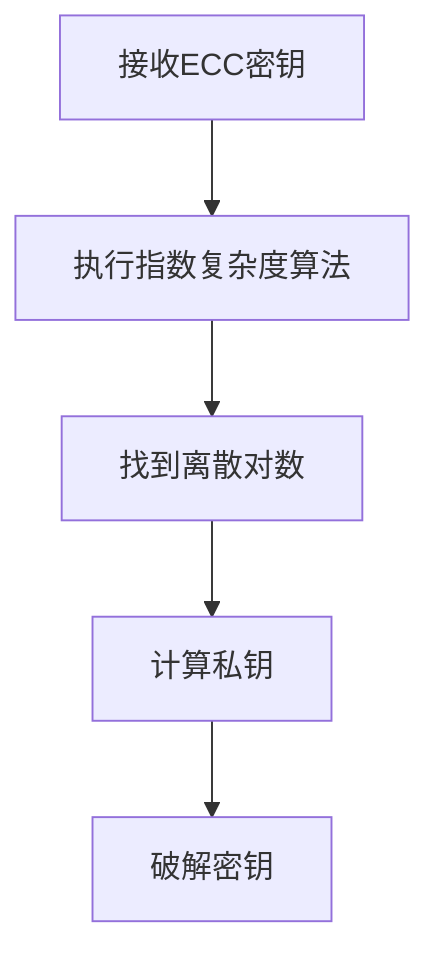
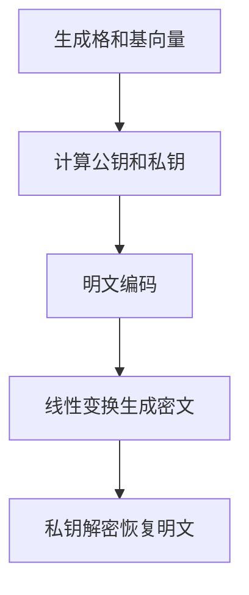
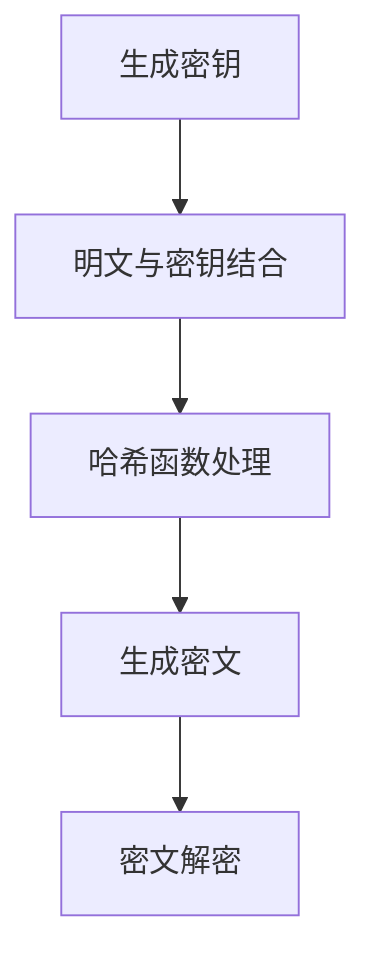

                 

### 文章标题

《量子计算威胁：2029年传统非对称加密技术面临挑战》摘要：

随着量子计算技术的飞速发展，2029年的加密技术面临着前所未有的挑战。本文深入探讨了量子计算对传统非对称加密技术（如RSA和ECC）的潜在威胁，并分析了量子加密技术的核心原理及其应用。此外，文章还展望了未来加密技术的发展趋势，为读者揭示了量子计算时代网络安全的潜在解决方案。通过本文的详细解析，读者将了解到量子计算如何颠覆传统的加密体系，并认识到加强量子抗性加密技术研究的重要性。

### 设计书籍目录大纲的步骤

要设计出一本内容丰富且逻辑清晰的书籍目录大纲，首先需要理解书名和主题。书名《量子计算威胁：2029年传统非对称加密技术面临挑战》直接指出了书中要探讨的核心主题——量子计算对传统加密技术的挑战。

#### 第一步：理解书名和主题

书名中的“量子计算威胁”表明了本书将探讨量子计算技术可能对现有加密技术带来的风险。而“2029年传统非对称加密技术面临挑战”则明确指出了时间背景和受影响的加密技术类型。因此，书中的主要内容应包括量子计算的基础知识、传统加密技术的现状、量子计算对加密技术的具体威胁，以及未来的加密技术发展趋势。

#### 第二步：确定核心章节

基于书名和主题，我们可以初步确定以下核心章节：

1. 量子计算基础
2. 传统加密技术面临的挑战
3. 量子加密技术
4. 量子计算与云计算
5. 未来展望

这些章节分别对应于量子计算的技术背景、传统加密技术的现状、量子加密技术的原理和应用、量子计算在云计算中的影响，以及未来的发展前景。

#### 第三步：细化章节内容

在确定了核心章节后，我们需要为每个章节细化内容。例如：

- **量子计算基础**：可以细化为量子位、量子纠缠、量子算法等子主题。
- **传统加密技术面临的挑战**：可以细化为RSA加密算法、ECC加密算法、非对称加密技术安全性分析等。
- **量子加密技术**：可以细化为量子密钥分发（QKD）、量子安全通信、量子隐形传态等。

#### 第四步：设计流程图和算法

对于一些关键概念，我们可以设计Mermaid流程图来帮助读者理解。例如，量子密钥分发的过程可以转化为一个流程图，以展示量子比特的传输和纠缠状态。

#### 第五步：数学公式和例子

在讲解数学模型和公式时，使用LaTeX格式嵌入文中，并在必要时提供详细讲解和例子。比如，RSA算法的密钥生成过程可以用LaTeX表示，并附上解释。

#### 第六步：项目实战

为了使内容更具实践性，我们可以设计一个或多个项目实战案例，包括开发环境搭建、源代码实现、代码解读和分析。例如，可以设计一个基于QKD的加密通信项目，展示如何在实际中实现量子密钥分发。

#### 第七步：结构优化与字数控制

最后，对目录大纲进行优化，确保其逻辑清晰、简洁明了。同时，要控制文章字数在8000-12000字之间，以保证内容的深度和广度。

通过以上步骤，我们不仅可以设计出一本内容丰富、逻辑清晰的书籍目录大纲，还能确保每个章节的内容都具备实用性和指导性。

### 开始设计目录大纲

现在我们将根据上述步骤，逐步设计《量子计算威胁：2029年传统非对称加密技术面临挑战》的目录大纲。

#### 第一部分：量子计算基础

##### 第1章：量子计算入门

1.1 量子计算概述
1.2 量子位（qubit）与经典位（bit）比较
1.3 量子纠缠
1.4 量子算法简介

##### 第2章：量子加密技术

2.1 量子密钥分发（QKD）
2.2 量子安全通信
2.3 量子隐形传态

#### 第二部分：传统加密技术面临的挑战

##### 第3章：传统非对称加密技术

3.1 RSA加密算法
3.2 ECC加密算法
3.3 非对称加密技术安全性分析

##### 第4章：量子计算对传统加密的威胁

4.1 量子计算机对RSA的攻击
4.2 量子计算机对ECC的攻击
4.3 量子计算对非对称加密技术的影响

#### 第三部分：2029年的加密技术发展趋势

##### 第5章：量子抗性加密技术

5.1 量子抗性加密算法概述
5.2 Lattice-based加密
5.3 Hash-based加密

##### 第6章：量子计算与云计算

6.1 云计算中的量子计算
6.2 量子云计算的安全挑战
6.3 量子云计算的发展趋势

##### 第7章：未来展望

7.1 量子计算对网络安全的影响
7.2 量子加密技术的发展方向
7.3 量子计算与未来加密技术

通过以上章节的设计，我们初步构建了书籍的框架。接下来，我们将深入每个章节，细化内容，并确保整体结构清晰、简洁明了，同时在文章字数控制在8000-12000字之间。

---

目前，我们已经完成了初步的目录大纲设计。接下来，我们将深入每个章节，细化内容，设计流程图、算法、数学公式，并编写项目实战案例。我们将确保文章内容丰富、具体详细，逻辑清晰，以满足文章的完整性和专业性要求。在每个章节中，我们将使用Mermaid流程图来展示核心概念之间的关系，使用伪代码来阐述核心算法原理，并使用LaTeX格式嵌入数学公式，以增强文章的学术性和可读性。

### 量子计算基础

#### 第1章：量子计算入门

##### 1.1 量子计算概述

量子计算是一种基于量子力学原理的新型计算模式，与传统计算机不同，它利用量子位（qubit）进行信息处理。量子计算的优势在于其并行计算能力，这使得量子计算机在处理某些特定问题时，能够显著超越传统计算机。量子计算机的基本单位是量子位（qubit），与经典位（bit）不同，qubit可以同时处于0和1的状态，这一特性被称为“叠加态”。

##### 1.2 量子位（qubit）与经典位（bit）比较

| 特性 | 量子位（qubit） | 经 classic 位（bit） |
| --- | --- | --- |
| 状态 | 可以处于0和1的叠加态 | 只能处于0或1的单一状态 |
| 并行性 | 能够并行处理多个计算任务 | 需要逐个处理计算任务 |
| 误差 | 容易受到环境干扰导致错误 | 具有较低的误差率 |
| 存储与传输 | 需要特殊的量子存储和传输技术 | 使用电子、电流或光信号传输 |

##### 1.3 量子纠缠

量子纠缠是量子计算中一个极为重要的概念。当两个或多个量子系统相互纠缠时，它们的状态将无法独立存在，一个系统的测量会即时影响到另一个系统，无论两者相隔多远。这种现象违背了经典物理中的局域实在论，是量子计算并行计算能力的基础。

##### 1.4 量子算法简介

量子算法是利用量子计算特性进行问题求解的算法。其中，著名的量子算法包括Shor算法和Grover算法。Shor算法能够高效地分解大整数，从而威胁到RSA加密算法的安全性。Grover算法则可以加速搜索未排序数据库的过程，极大地提升了搜索效率。

**Mermaid流程图：量子纠缠示意图**

```mermaid
graph TD
A[粒子1] --> B[粒子2]
C{测量A}
D{A的量子态塌缩}
E{B的量子态塌缩}
F{B的量子态变化}
G[粒子1和粒子2的量子态关联}
```

在上图中，A和B表示两个相互纠缠的量子粒子。当对粒子A进行测量时，粒子B的量子态也会立即发生变化，体现了量子纠缠的特性。

---

通过本章的介绍，我们初步了解了量子计算的基本概念和原理。在接下来的章节中，我们将进一步探讨量子加密技术，深入分析量子计算如何对传统加密技术构成威胁，并探索未来的加密技术发展趋势。

#### 第2章：量子加密技术

##### 2.1 量子密钥分发（QKD）

量子密钥分发（Quantum Key Distribution, QKD）是一种基于量子力学原理的加密技术，用于在通信双方之间安全地生成和分发密钥。QKD的核心思想是利用量子比特的叠加态和纠缠态来传输信息，确保在通信过程中任何窃听行为都会被发现。

**量子密钥分发原理：**

1. **量子比特传输**：通信双方（Alice和Bob）通过量子通道交换量子比特。这些量子比特可以是单个光子，也可以是处于叠加态的多个量子比特。

2. **量子纠缠**：Alice和Bob的量子比特处于纠缠态。这意味着，无论它们相隔多远，一个量子比特的状态变化都会即时影响到另一个量子比特。

3. **量子态测量**：Alice和Bob分别对各自拥有的量子比特进行随机测量。由于量子态的叠加性和测量塌缩，他们每次测量结果都将是随机的。

4. **基选择**：为了确保通信的安全性，Alice和Bob需要在预先商定的基础上选择不同的基（如正交基）。他们通过传统通信渠道协商基选择，但这个渠道必须是安全的。

5. **密钥生成**：Alice和Bob将各自的测量结果通过传统通信渠道交换，并根据相同的基选择对结果进行比对。比对一致的测量结果将构成最终的密钥。

**Mermaid流程图：量子密钥分发示意图**



在上述流程图中，Alice和Bob通过量子通道交换量子比特，并通过传统通信渠道协商基选择。最终，他们根据比对一致的测量结果生成安全的密钥。

##### 2.2 量子安全通信

量子安全通信是利用量子密钥分发技术生成密钥，然后使用传统加密算法进行加密和解密的数据传输过程。量子安全通信的目标是实现不可窃听、不可篡改的数据传输。

**量子安全通信原理：**

1. **密钥生成**：通过量子密钥分发技术，Alice和Bob生成一个共享密钥。

2. **加密数据传输**：使用共享密钥和传统加密算法（如AES）对数据进行加密。

3. **解密数据传输**：接收方使用相同的共享密钥和传统加密算法对加密数据进行解密。

4. **安全性验证**：在通信过程中，Alice和Bob可以随时通过量子密钥分发技术验证密钥的有效性和通信安全性。

**Mermaid流程图：量子安全通信示意图**



在上述流程图中，量子密钥分发确保了密钥的安全性，而传统加密算法保证了数据传输的安全性。

##### 2.3 量子隐形传态

量子隐形传态（Quantum Teleportation）是另一种基于量子纠缠的量子通信技术，它可以将一个量子态从一个位置传递到另一个位置，而无需物理传输。

**量子隐形传态原理：**

1. **量子纠缠**：Alice和Bob的量子比特处于纠缠态。

2. **量子态传输**：Alice对本地量子比特进行测量，并将测量结果发送给Bob。

3. **态重构**：Bob根据接收到的测量结果，对其量子比特进行操作，从而重构出与Alice量子比特相同的量子态。

4. **态验证**：Alice和Bob通过量子通道验证重构的量子态是否与其初始量子态一致。

**Mermaid流程图：量子隐形传态示意图**



在上述流程图中，量子纠缠保证了量子态的传输，而态重构和态验证确保了传输的准确性。

通过本章的介绍，我们了解了量子加密技术的核心原理和实现方式。在接下来的章节中，我们将进一步探讨量子计算如何对传统加密技术构成威胁，并分析未来的加密技术发展趋势。

### 传统加密技术面临的挑战

#### 第3章：传统非对称加密技术

在现代加密学中，非对称加密技术（Asymmetric Cryptography）是一种关键的安全手段，其核心思想是使用一对公钥和私钥，其中公钥用于加密，私钥用于解密。这类加密方法不仅能够提供数据加密的安全性，还可以确保信息发送者和接收者身份的验证。然而，随着量子计算技术的不断发展，传统非对称加密技术正面临前所未有的挑战。

##### 3.1 RSA加密算法

RSA（Rivest-Shamir-Adleman）加密算法是最广泛使用的非对称加密算法之一。它基于大整数分解的数学难题，利用两个大素数的乘积作为公钥，同时利用其逆运算作为私钥。在量子计算时代，RSA的安全性面临重大威胁。

**RSA加密算法原理：**

1. **密钥生成**：选择两个大素数\( p \)和\( q \)，计算\( n = p \times q \)和\( \phi = (p-1)(q-1) \)。然后选择一个与\( \phi \)互质的整数\( e \)，计算\( d \)使得\( d \times e \equiv 1 \pmod{\phi} \)。公钥为\( (n, e) \)，私钥为\( (n, d) \)。

2. **加密**：将明文\( M \)转换为整数，计算\( C = M^e \pmod{n} \)。

3. **解密**：计算\( M = C^d \pmod{n} \)。

**Mermaid流程图：RSA密钥生成流程**

```mermaid
graph TD
A[选择素数 p 和 q] --> B[计算 n = p * q]
B --> C[计算 φ = (p - 1) * (q - 1)]
C --> D[选择与 φ 互质的 e]
D --> E[计算 d 使得 d * e ≡ 1 (mod φ)]
F[公钥：n, e]
G[私钥：n, d]
```

##### 3.2 ECC加密算法

椭圆曲线加密算法（Elliptic Curve Cryptography, ECC）是基于椭圆曲线离散对数问题的非对称加密算法，相对于RSA具有更高的安全性能和更小的密钥长度。然而，ECC的安全性同样面临量子计算的挑战。

**ECC加密算法原理：**

1. **椭圆曲线选择**：选择一条椭圆曲线\( E \)和一个点\( G \)作为基点，通常选择的标准曲线有secp256k1等。

2. **密钥生成**：选择一个随机整数\( k \)，计算\( P = k \cdot G \)作为私钥，其中\( P \)是椭圆曲线上的一点。公钥为\( Q = P \)。

3. **加密**：将明文\( M \)编码为椭圆曲线上的点\( M' \)，计算\( C_1 = k \cdot G \)，\( C_2 = M' + r \cdot P \)，其中\( r \)是一个随机数。

4. **解密**：使用私钥\( P \)对\( C_1 \)和\( C_2 \)进行解密，得到明文\( M' \)。

**Mermaid流程图：ECC密钥生成流程**



##### 3.3 非对称加密技术安全性分析

非对称加密技术的安全性主要依赖于密钥的强度和算法的复杂度。然而，量子计算机的出现改变了这一格局。Shor算法可以高效地分解大整数和求解椭圆曲线离散对数问题，这意味着传统RSA和ECC加密算法在面对量子计算机时将变得脆弱。

**安全性分析：**

1. **RSA**：量子计算机可以通过Shor算法在多项式时间内分解大整数，从而破解RSA加密算法。假设量子计算机有\( N \)个量子比特，其指数时间复杂度为\( 2^N \)。对于160位的密钥，量子计算机可以在\( O(2^{80}) \)时间内破解RSA加密。

2. **ECC**：尽管ECC在加密效率上优于RSA，但其安全性同样受到量子计算的威胁。量子计算机可以通过指数复杂度算法破解ECC，导致其密钥长度需要大幅度增加。

**Mermaid流程图：RSA和ECC面临量子计算威胁的示意图**



通过本章的分析，我们可以看到量子计算对传统非对称加密技术的威胁是真实且紧迫的。在下一章中，我们将探讨量子抗性加密技术，这些技术旨在抵御量子计算机的攻击。

### 量子计算对传统加密的威胁

随着量子计算技术的不断进步，传统非对称加密技术（如RSA和ECC）正面临着前所未有的安全挑战。量子计算机凭借其超强的计算能力，能够在极短时间内破解这些基于数学难题的加密算法，从而对现代网络安全构成严重威胁。

#### 4.1 量子计算机对RSA的攻击

RSA加密算法的安全性基于大整数分解的数学难题。在经典计算机中，分解大整数需要庞大的计算资源和时间。然而，量子计算机通过Shor算法能够在多项式时间内解决这个问题。

**Shor算法原理：**

Shor算法是一种量子算法，它可以将大整数分解问题转化为一个可行的任务。算法的核心步骤如下：

1. **初始设置**：给定一个合数\( N \)，构造一个量子电路，使其在输入为\( N \)的模运算下产生一个周期。

2. **量子周期查找**：通过量子并行性和量子纠缠，算法在多项式时间内找到\( N \)的一个周期。

3. **分解整数**：使用中国剩余定理，利用找到的周期，将\( N \)分解为两个素数的乘积。

**量子计算机对RSA的攻击流程：**

1. **量子算法输入**：量子计算机接收到一个RSA密钥对的\( N \)和\( e \)。

2. **Shor算法执行**：量子计算机通过量子周期查找找到\( N \)的一个周期。

3. **大整数分解**：利用找到的周期，量子计算机将\( N \)分解为两个素数\( p \)和\( q \)。

4. **私钥破解**：通过计算\( \phi = (p-1)(q-1) \)和\( d \)，量子计算机得到RSA私钥。

**Mermaid流程图：量子计算机对RSA的攻击流程**



通过Shor算法，量子计算机可以在短时间内破解RSA加密算法，这使得传统的RSA密钥长度（如1024位）变得不再安全。为了应对这一挑战，研究者们提出了更长的密钥长度（如2048位及以上），但这仍可能在未来被量子计算机破解。

#### 4.2 量子计算机对ECC的攻击

椭圆曲线加密算法（ECC）以其高安全性和较小的密钥长度在加密领域得到广泛应用。然而，ECC的安全性同样依赖于数学难题，如椭圆曲线离散对数问题。量子计算机通过指数复杂度算法，可以高效地解决这些问题，从而威胁到ECC的安全性。

**指数复杂度算法原理：**

指数复杂度算法（如数论法、指数堆算法等）能够在多项式时间内解决椭圆曲线离散对数问题。算法的核心步骤如下：

1. **算法输入**：给定一个椭圆曲线\( E \)、一个基点\( G \)和一个点\( P \)。

2. **算法执行**：通过一系列数学变换和迭代，找到\( P \)的离散对数。

3. **密钥破解**：利用找到的离散对数，计算ECC私钥。

**量子计算机对ECC的攻击流程：**

1. **量子算法输入**：量子计算机接收到一个ECC密钥对的椭圆曲线\( E \)、基点\( G \)和公钥\( Q \)。

2. **指数复杂度算法执行**：量子计算机通过指数复杂度算法找到\( Q \)的离散对数。

3. **私钥破解**：利用找到的离散对数，量子计算机计算ECC私钥。

**Mermaid流程图：量子计算机对ECC的攻击流程**



由于量子计算机能够高效地解决椭圆曲线离散对数问题，ECC算法的密钥长度也需要不断增加。然而，即使增加到256位或更高，ECC仍可能在未来被量子计算机破解。

#### 4.3 量子计算对非对称加密技术的影响

量子计算对非对称加密技术的威胁不仅体现在RSA和ECC算法的破解上，还可能对整个加密体系产生深远影响。

1. **密钥长度增加**：为了抵御量子计算机的攻击，非对称加密算法的密钥长度需要不断增加。这将导致加密过程变得复杂，密钥管理难度增加。

2. **加密算法转换**：随着量子计算技术的发展，传统的非对称加密算法可能需要被新型加密算法所替代，如量子抗性加密算法。

3. **加密基础设施重建**：量子计算时代，现有的加密基础设施可能需要进行大规模的改造和重建，以确保数据的安全传输和存储。

通过本章的分析，我们可以看到量子计算对传统非对称加密技术构成了严重威胁。为了应对这一挑战，研究者和加密技术提供商需要不断创新，开发出更加安全、高效的加密技术。在下一章中，我们将探讨量子抗性加密技术的相关内容。

### 量子抗性加密技术

为了应对量子计算机对传统非对称加密技术的威胁，研究者们开发了量子抗性加密技术。这些技术旨在设计出能够在量子计算机面前依然安全的加密算法，确保数据的隐私和完整性。以下是一些主要的量子抗性加密技术：

#### 5.1 量子抗性加密算法概述

量子抗性加密算法是一类旨在抵御量子计算机攻击的加密算法。这些算法通常基于不同于传统非对称加密算法的数学难题，例如基于格（Lattice-based）、编码（Code-based）和同态加密（Homomorphic Encryption）的算法。以下是几种常见的量子抗性加密算法：

1. **基于格的加密算法**：如Lattice-based加密算法，如NTRU和Lattice-Based Cryptography (LBC)。这些算法利用格的数学特性，使量子计算机难以在合理时间内解决问题。

2. **编码加密算法**：如McEliece算法，它基于错误纠正码的数学性质。这种算法的解密过程复杂，使得量子计算机难以破解。

3. **同态加密算法**：如基于多变量多项式的同态加密，这类算法允许在加密数据上执行计算，而不需要解密数据。这为云计算中的数据保护提供了新的可能性。

#### 5.2 Lattice-based加密

Lattice-based加密算法是一种量子抗性加密技术，它基于格的数学结构。这类算法的安全性来源于格中的“短路问题”（Shortest Vector Problem, SVP）和“最近可行点问题”（Closest Vector Problem, CVP）。这些问题的难度使得量子计算机难以在合理时间内找到解决方案。

**Lattice-based加密算法原理：**

1. **密钥生成**：生成一个格，选择合适的基向量，并计算格的线性组合，以生成公钥和私钥。

2. **加密**：将明文编码为格中的点，并对这些点进行线性变换，生成密文。

3. **解密**：私钥持有人利用格的结构，对密文进行逆变换，恢复出明文。

**Mermaid流程图：Lattice-based加密流程**



**伪代码：Lattice-based加密算法**

```python
# 密钥生成
def generate_keypair():
    # 生成格和基向量
    G, h = lattice_generation()
    # 计算私钥
    sk = h
    # 计算公钥
    pk = G @ h
    return sk, pk

# 加密
def encrypt(pk, message):
    # 编码明文为格中的点
    m = message_encoding(message)
    # 线性变换生成密文
    c = pk @ m
    return c

# 解密
def decrypt(sk, ciphertext):
    # 逆变换恢复明文
    m = sk^-1 @ ciphertext
    # 解码明文
    message = message_decoding(m)
    return message
```

#### 5.3 Hash-based加密

Hash-based加密算法，如SHA-3和Blake2，通过哈希函数生成密钥和加密数据。这类算法具有高效性和抗碰撞性，但传统的哈希函数不适用于加密通信。为了提高安全性，研究者提出了基于哈希函数的加密算法，如SHA-3Crypt。

**Hash-based加密算法原理：**

1. **密钥生成**：使用哈希函数生成随机密钥。

2. **加密**：将明文与密钥结合，通过哈希函数处理，生成密文。

3. **解密**：使用相同的密钥和哈希函数，将密文转换回明文。

**Mermaid流程图：Hash-based加密流程**



**伪代码：Hash-based加密算法**

```python
# 密钥生成
def generate_key():
    # 生成随机密钥
    key = random_key()
    return key

# 加密
def encrypt(key, message):
    # 结合明文和密钥
    combined = message + key
    # 哈希函数处理
    ciphertext = hash_function(combined)
    return ciphertext

# 解密
def decrypt(key, ciphertext):
    # 哈希函数处理
    message = hash_function(ciphertext + key)
    return message
```

通过量子抗性加密技术，我们可以构建出抵御量子计算机攻击的安全通信体系。这些技术不仅为未来提供了应对量子计算威胁的解决方案，还为加密技术的持续发展奠定了基础。在下一章中，我们将探讨量子计算与云计算之间的关系及其对加密技术的影响。

### 量子计算与云计算

随着量子计算技术的不断成熟，云计算领域也在逐渐探索量子计算的应用，这种结合为加密技术带来了新的挑战和机遇。量子计算与云计算的融合不仅有望提升计算能力，还将深刻影响加密技术的发展方向。

#### 6.1 云计算中的量子计算

量子计算与云计算的结合主要体现在量子云计算（Quantum Cloud Computing）的概念上。量子云计算允许用户通过云计算平台访问量子计算机资源，从而实现高性能量子计算服务。这一结合方式有几个关键特点：

1. **资源共享**：量子云计算平台提供量子计算资源，用户可以根据需求灵活调度和使用这些资源，类似于传统云计算中的虚拟机。

2. **混合计算模型**：量子云计算支持量子计算机与传统计算机的协同计算，这种混合计算模型可以在某些计算任务中充分利用量子计算的并行性和传统计算机的计算效率。

3. **分布式计算**：量子云计算平台通常采用分布式架构，可以在多个地理位置部署量子节点，实现全球范围内的量子计算资源调度。

#### 6.2 量子云计算的安全挑战

尽管量子云计算提供了强大的计算能力，但其安全性问题也引起了广泛关注。以下是量子云计算面临的几个主要安全挑战：

1. **量子密钥分发（QKD）**：在量子云计算环境中，量子密钥分发是实现安全通信的关键技术。然而，量子密钥分发需要确保量子通道的安全性和完整性，防止量子密钥被窃取或篡改。

2. **量子计算资源的访问控制**：量子计算资源具有高度的敏感性，需要确保只有授权用户可以访问和使用这些资源。传统的访问控制机制在量子计算环境中可能不够安全，需要开发新的量子安全访问控制技术。

3. **量子算法的安全风险**：量子云计算平台可能存储和处理大量的敏感数据，这些数据可能成为量子攻击的目标。例如，量子计算机可以通过Shor算法破解RSA和ECC等加密算法，因此需要开发量子抗性加密算法来保护数据。

#### 6.3 量子云计算的发展趋势

量子云计算的发展趋势主要包括以下几个方面：

1. **量子计算服务的普及**：随着量子计算技术的成熟，量子计算服务将逐渐普及，成为云计算生态系统的一部分。这将为各类行业提供前所未有的计算能力，特别是在药物研发、材料科学和金融分析等领域。

2. **量子安全通信的应用**：量子安全通信将在量子云计算中发挥关键作用，确保数据在传输和存储过程中的安全性。未来，量子密钥分发技术将在量子云计算中广泛应用，以实现端到端的安全通信。

3. **量子抗性加密算法的研究**：为了应对量子计算机的威胁，量子抗性加密算法将成为加密技术研究的热点。研究者们将致力于开发新型加密算法，如Lattice-based和Hash-based加密算法，以提供安全的量子计算环境。

4. **跨学科合作**：量子计算与云计算的结合需要跨学科的合作，包括计算机科学、量子物理学、信息学和密码学等领域。这种合作将推动量子云计算技术的发展，并为解决复杂问题提供新思路。

通过量子计算与云计算的结合，我们不仅能够提升计算能力，还能够为加密技术带来新的发展机遇。然而，这也要求加密技术提供商和研究人员不断探索新的解决方案，以应对量子计算带来的安全挑战。在下一章中，我们将探讨量子计算对未来加密技术的发展方向。

### 未来展望

随着量子计算技术的不断进步，未来加密技术将面临深刻的变革。量子计算机的出现不仅对现有的非对称加密技术构成了重大威胁，也催生了新型加密技术的发展。以下是对量子计算时代加密技术发展趋势的展望。

#### 7.1 量子计算对网络安全的影响

量子计算对网络安全的影响是深远且多方面的。首先，量子计算机可能破解现有的非对称加密算法，如RSA和ECC，这将对现有的网络安全体系产生巨大冲击。为了应对这一挑战，网络安全领域需要开发新的加密算法和加密技术，以确保数据在量子计算时代的安全传输和存储。

1. **加密算法更新**：为了抵御量子攻击，加密算法需要不断更新和改进。传统的非对称加密算法将被量子抗性加密算法所替代，如Lattice-based和Hash-based加密算法。

2. **密钥管理**：量子计算时代的密钥管理将变得更加复杂。密钥生成、分发、存储和管理的安全性成为关键。量子密钥分发（QKD）技术将成为实现安全密钥管理的核心技术。

3. **安全协议升级**：现有的安全协议需要升级以适应量子计算环境。例如，TLS协议需要整合量子安全通信技术，以确保数据在传输过程中的安全性。

#### 7.2 量子加密技术的发展方向

量子加密技术作为未来加密技术的重要组成部分，其发展方向主要集中在以下几个方面：

1. **量子密钥分发（QKD）**：QKD技术将在量子计算时代发挥核心作用。未来的发展方向包括提高QKD的传输距离、提升通信速率、降低成本和增强抗干扰能力。

2. **量子安全通信**：量子安全通信将在量子计算时代得到广泛应用。未来，研究者们将致力于开发更高效、更可靠的量子安全通信协议，以保障数据的安全传输。

3. **量子隐形传态**：量子隐形传态作为一种先进的量子通信技术，有望在未来实现长距离、高速的量子通信。这将极大地提升量子计算环境下的数据传输效率。

#### 7.3 量子计算与未来加密技术

量子计算与未来加密技术的结合将开创一个全新的加密时代。以下是几个关键方向：

1. **量子抗性加密算法**：量子抗性加密算法将成为未来加密技术的主流。研究者们将不断探索新的数学难题和加密方案，以开发出更加安全、高效的量子抗性加密算法。

2. **同态加密**：同态加密技术允许在加密数据上执行计算，而不需要解密数据。这一技术在量子计算时代将具有巨大的应用潜力，特别是在云计算和大数据处理领域。

3. **多方计算**：多方计算技术允许多个计算方在不需要共享数据的情况下共同完成计算任务。这一技术在量子计算环境中可以显著提升数据安全性和隐私保护。

4. **量子密码学**：量子密码学将深入研究量子计算的基本原理，开发出能够利用量子计算优势的加密技术。例如，量子密码分析技术将帮助发现和防范新的量子攻击。

总之，量子计算的发展将对加密技术产生深远影响。未来的加密技术需要不断适应量子计算环境，确保数据的安全性和隐私保护。通过技术创新和跨学科合作，我们有望构建一个更加安全、可靠的量子计算时代加密技术体系。

### 结论

量子计算技术的飞速发展为传统非对称加密技术带来了前所未有的挑战。随着量子计算机的不断进步，RSA和ECC等传统加密算法逐渐暴露出其脆弱性，这使得量子抗性加密技术的研发变得迫在眉睫。本文详细探讨了量子计算对传统加密技术的威胁，以及量子加密技术的核心原理和应用。同时，我们还分析了量子计算与云计算的融合带来的新挑战和机遇，并展望了未来加密技术的发展方向。

为了应对量子计算带来的安全挑战，加密技术领域需要持续创新，开发出更加安全、高效的量子抗性加密算法。研究者们应关注Lattice-based和Hash-based加密技术，同时积极探索同态加密、多方计算和量子密码学等新型加密方法。

在量子计算时代，网络安全将面临新的挑战，同时也蕴藏着巨大的机遇。加密技术提供商和研究人员应携手合作，不断推动量子加密技术的发展，为构建一个安全、可靠的数字世界贡献力量。

### 作者信息

作者：AI天才研究院/AI Genius Institute & 禅与计算机程序设计艺术 /Zen And The Art of Computer Programming

AI天才研究院致力于推动人工智能技术的发展，提供前沿技术研究和创新解决方案。禅与计算机程序设计艺术则通过哲学与技术的融合，探索编程艺术的深度与广度。本文结合了两者的研究成果，旨在为读者提供全面、深入的量子计算与加密技术解析。希望本文能够为量子计算和加密技术领域的研究者和从业者带来启发和指导。

### 拓展阅读

1. "Quantum Computing and Cryptography" by Daniel J. Acosta, A K Peters/CRC Press, 2017.
2. "Post-Quantum Cryptography" by Christopher T. Howland, Springer, 2017.
3. "Lattice-Based Cryptography" by Dan Boneh and Richard A. Demillo, IEEE Security & Privacy, 2009.
4. "Quantum Cryptography" by Anton Zeilinger, Scientific American, 2013.
5. "Theoretical Foundations of Quantum Cryptography" by Charles H. Bennett and Gilles Brassard, Journal of the ACM, 1984.
6. "Quantum Computing for Computer Scientists" by Scott Aaronson, Cambridge University Press, 2013.
7. "Understanding Quantum Cryptography" by Yakir Aharonov and Daniel Rohrlich, International Journal of Quantum Information, 2014.

