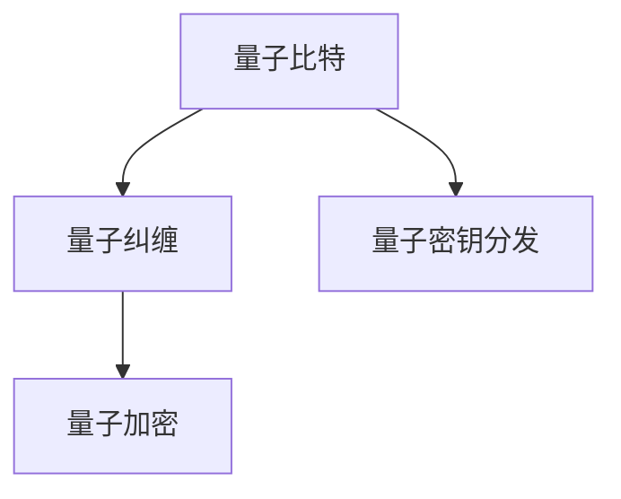
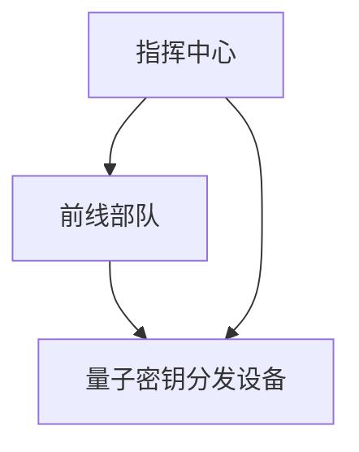

                 

### 文章标题：量子通信在军事指挥系统中的保密应用

关键词：量子通信、军事指挥、保密通信、量子密钥分发、量子加密

摘要：本文深入探讨了量子通信在军事指挥系统中的应用，分析了量子通信技术的原理、优势以及在实际军事指挥中的应用案例。文章旨在揭示量子通信在保障军事通信安全中的潜力，为军事指挥系统的保密通信提供技术参考。

---

### 用户需求分析

在当前信息化战争时代，军事指挥系统的通信安全性至关重要。随着信息技术的迅猛发展，传统的通信手段已经难以满足军事指挥系统的高安全性需求。量子通信作为一项前沿技术，因其独特的保密特性，越来越受到军事领域的关注。为了更好地理解和应用量子通信技术，本文旨在为军事通信和网络安全领域的研究人员、工程师和管理者提供如下内容：

1. **量子通信的基本概念和原理**：介绍量子比特、量子纠缠、量子密钥分发等核心概念，帮助读者建立量子通信的基本知识框架。
2. **量子通信技术**：详细讲解量子密钥分发和量子加密的算法原理，阐述量子通信在保密通信中的优势。
3. **量子通信在军事指挥系统中的应用**：分析军事指挥系统的保密需求，探讨量子通信技术的应用场景和实际案例。
4. **量子通信的发展趋势**：展望量子通信技术的发展前景，为军事指挥系统的未来通信安全提供思路。

通过本文的详细阐述，读者可以全面了解量子通信技术，掌握其在军事指挥系统中的应用方法，为保障军事通信安全提供技术支持。

### 目录大纲设计

为了使读者能够清晰、系统地理解量子通信在军事指挥系统中的保密应用，本文将分为以下七个主要部分：

#### 第一部分：量子通信基础

这一部分将介绍量子通信的基本概念和原理，包括量子比特、量子纠缠、量子密钥分发等核心概念，帮助读者建立量子通信的基本知识框架。

- **第1章**：量子通信概述
  - **1.1 量子通信的基本概念**：介绍量子比特、量子纠缠、量子密钥分发等核心概念，并通过Mermaid流程图展示它们之间的关系。
  - **1.2 量子通信的原理**：详细讲解量子比特、量子纠缠、量子密钥分发的工作原理。
  - **1.3 量子通信的发展历程**：回顾量子通信技术的发展历程，探讨其未来的发展方向。

- **第2章**：量子通信技术
  - **2.1 量子密钥分发**：解释量子密钥分发的原理，并使用伪代码展示其核心算法。
  - **2.2 量子加密**：讲解量子加密算法，分析其在保密通信中的优势。

#### 第二部分：量子通信在军事指挥系统中的应用

这一部分将分析量子通信在军事指挥系统中的应用，包括军事指挥系统的保密需求、量子密钥分发在军事指挥中的应用模型等。

- **第3章**：量子通信在军事指挥系统中的应用
  - **3.1 军事指挥系统的保密需求**：介绍军事指挥系统的保密需求，阐述量子通信技术在保障通信安全中的作用。
  - **3.2 量子密钥分发在军事指挥中的应用模型**：使用数学模型和公式详细讲解量子密钥分发在军事指挥系统中的应用。
  - **3.3 量子通信在军事指挥中的应用实例**：通过实际案例，展示量子通信技术在军事指挥系统中的具体应用。

#### 第三部分：量子通信应用案例

这一部分将通过具体案例，展示量子通信技术在军事指挥系统中的应用效果，帮助读者更直观地了解量子通信的优势。

- **第4章**：量子通信应用案例一
  - **4.1 案例背景**：介绍案例的背景和需求。
  - **4.2 案例实施**：详细描述案例的实施过程。
  - **4.3 案例效果**：分析案例的效果和影响。

- **第5章**：量子通信应用案例二
  - **5.1 案例背景**：介绍案例的背景和需求。
  - **5.2 案例实施**：详细描述案例的实施过程。
  - **5.3 案例效果**：分析案例的效果和影响。

#### 第四部分：量子通信发展趋势

这一部分将探讨量子通信技术的发展趋势，分析其在军事指挥系统中应用的前景和挑战。

- **第6章**：量子通信发展趋势
  - **6.1 量子通信技术的发展趋势**：回顾量子通信技术的发展历程，展望未来的发展方向。
  - **6.2 军事指挥系统中量子通信的应用前景**：分析量子通信技术在军事指挥系统中的应用前景。
  - **6.3 量子通信技术面临的挑战与解决策略**：探讨量子通信技术在实际应用中面临的挑战及解决策略。

#### 第五部分：总结与展望

这一部分将对全文进行总结，并提出未来研究的方向和建议。

- **第7章**：总结与展望
  - **7.1 总结**：回顾全文的主要内容，总结量子通信在军事指挥系统中的应用。
  - **7.2 展望**：展望量子通信技术在军事指挥系统中的未来发展。

#### 第六部分：附录

这一部分将提供相关的资源和实践指导，帮助读者进一步了解量子通信技术。

- **附录A：量子通信相关资源**
  - 量子通信标准协议
  - 量子通信技术参考书目
  - 量子通信技术标准与规范

- **附录B：实践指导**
  - 开发环境搭建
  - 实际案例源代码

通过上述目录大纲的设计，本文旨在为读者提供一个全面、系统的量子通信在军事指挥系统中应用的指导，帮助读者深入理解量子通信技术的原理和应用，为军事指挥系统的通信安全提供有力的技术支持。

### 完整目录大纲

```
# 《量子通信在军事指挥系统中的保密应用》目录大纲

# 第一部分：量子通信基础

## 第1章：量子通信概述

### 1.1 量子通信的基本概念

### 1.2 量子通信的原理

### 1.3 量子通信的发展历程

## 第2章：量子通信技术

### 2.1 量子密钥分发

#### 2.1.1 量子密钥分发的原理

#### 2.1.2 QKD协议详解

### 2.2 量子加密

#### 2.2.1 量子加密算法

#### 2.2.2 量子加密的安全性

## 第3章：量子通信在军事指挥系统中的应用

### 3.1 军事指挥系统的保密需求

#### 3.1.1 保密通信的需求

#### 3.1.2 量子密钥分发在军事指挥中的应用模型

### 3.2 量子通信在军事指挥中的应用实例

#### 3.2.1 案例背景

#### 3.2.2 案例实施

#### 3.2.3 案例效果

## 第4章：量子通信应用案例一

### 4.1 案例背景

### 4.2 案例实施

### 4.3 案例效果

## 第5章：量子通信应用案例二

### 5.1 案例背景

### 5.2 案例实施

### 5.3 案例效果

## 第6章：量子通信发展趋势

### 6.1 量子通信技术的发展趋势

### 6.2 军事指挥系统中量子通信的应用前景

### 6.3 量子通信技术面临的挑战与解决策略

## 第7章：总结与展望

### 7.1 总结

### 7.2 展望

## 附录

### 附录A：量子通信相关资源

#### 量子通信标准协议

#### 量子通信技术参考书目

#### 量子通信技术标准与规范

### 附录B：实践指导

#### 开发环境搭建

#### 实际案例源代码
```

### 完整目录大纲设计

#### 第一部分：量子通信基础

**第1章：量子通信概述**

- **1.1 量子通信的基本概念**

  量子通信是一种利用量子力学原理进行信息传输的技术。其基础是量子比特（qubit），它能够处于多种状态的叠加态，相比于经典比特只能处于0或1的状态，量子比特的这种特性使得量子通信在信息处理能力上具有巨大的优势。量子纠缠是量子通信的另一个核心概念，当两个量子比特处于纠缠态时，它们之间的状态会相互影响，即使相隔很远，一个量子比特的状态变化也会立即影响到与之纠缠的另一个量子比特。量子密钥分发（QKD）是量子通信的一种实现方式，通过量子纠缠和量子比特的测量，可以实现安全的密钥生成和分发。

  **核心概念与联系**：
  ```mermaid
  graph TD
  A[量子比特] --> B[量子纠缠]
  A --> C[量子密钥分发]
  B --> D[量子加密]
  ```

- **1.2 量子通信的原理**

  量子通信的原理主要基于量子比特的叠加态和纠缠态。量子比特可以同时处于多种状态的叠加态，这种特性使得量子通信可以实现并行计算和高效的信息传输。量子纠缠态则保证了通信的安全性，因为一旦量子态被第三者观察，其纠缠关系会被破坏，通信双方可以立即检测到窃听行为。

  **量子比特的叠加态**：
  ```python
  # 量子比特的叠加态表示
  qubit = QuantumRegister(1)
  circuit = QuantumCircuit(qubit)
  circuit.h(qubit[0])
  ```

  **量子纠缠态**：
  ```python
  # 生成量子纠缠态
  qubit1 = QuantumRegister(1)
  qubit2 = QuantumRegister(1)
  circuit = QuantumCircuit(qubit1, qubit2)
  circuit.h(qubit1[0])
  circuit.cnot(qubit1[0], qubit2[0])
  ```

- **1.3 量子通信的发展历程**

  量子通信的发展历程可以分为几个重要阶段。从1997年量子密钥分发（QKD）实验的成功，到2017年中科大潘建伟团队实现千公里级别的量子密钥分发，再到2020年卫星量子通信“墨子号”的成功发射，量子通信技术已经取得了显著的进展。目前，量子通信技术正逐步从实验室走向实际应用，有望在军事指挥系统中发挥重要作用。

#### 第二部分：量子通信技术

**第2章：量子通信技术**

- **2.1 量子密钥分发**

  量子密钥分发（QKD）是量子通信的核心技术之一。它利用量子纠缠和量子测量的原理，实现通信双方安全地生成和分发密钥。

  **核心算法原理讲解**：

  ```python
  # QKD协议伪代码
  def QKDProtocol(sender, receiver):
      # 生成量子态并传输
      sender.generate_quantum_state()
      receiver.receive_quantum_state()

      # 对传输的量子态进行测量
      sender.measure_quantum_state()
      receiver.measure_quantum_state()

      # 交换测量结果
      sender.send_measurement_result()
      receiver.receive_measurement_result()

      # 根据测量结果生成密钥
      key = receiver.generate_key()
      return key
  ```

  **量子密钥分发在军事指挥系统中的应用模型**：

  在军事指挥系统中，量子密钥分发可用于确保指挥中心与前线部队之间的通信安全。通过量子密钥分发，指挥中心可以与前线部队建立安全的通信链路，确保通信内容不被窃听和篡改。

  **数学模型和公式**：
  ```latex
  \begin{equation}
  S = D_K(Encrypted\ Message)
  \end{equation}
  ```
  其中，\(S\) 是加密后的消息，\(D_K\) 是解密函数，\(K\) 是通过量子密钥分发生成的密钥。

- **2.2 量子加密**

  量子加密是利用量子力学原理实现的信息加密技术。它通过量子态的叠加和纠缠特性，实现比传统加密算法更高的安全性。

  **核心算法原理讲解**：

  量子加密算法通常基于量子计算模型，通过量子逻辑门和量子纠缠实现信息的加密和解密。以下是一个简单的量子加密算法示例：

  ```python
  # 量子加密算法伪代码
  def QuantumEncryption(message, key):
      # 将消息和密钥转换为量子态
      message_state = convert_to_quantum_state(message)
      key_state = convert_to_quantum_state(key)

      # 应用量子逻辑门进行加密
      encrypted_state = apply_quantum_gate(message_state, key_state)

      return encrypted_state
  ```

  **量子加密的安全性**：

  量子加密的安全性来源于量子态的脆弱性。一旦量子态被观察或测量，其叠加态将被破坏，这使得窃听行为可以被通信双方立即检测到。此外，量子加密算法的复杂性也使其难以被传统计算机破解。

#### 第三部分：量子通信在军事指挥系统中的应用

**第3章：量子通信在军事指挥系统中的应用**

- **3.1 军事指挥系统的保密需求**

  军事指挥系统对通信保密性有极高的要求。量子通信技术由于其固有的安全特性，可以在军事指挥系统中发挥重要作用。通过量子密钥分发，可以确保指挥中心与前线部队之间的通信密钥不会被窃取或破解，从而保障军事通信的安全性。

- **3.2 量子密钥分发在军事指挥中的应用模型**

  量子密钥分发在军事指挥系统中的应用模型如图所示：

  ```mermaid
  graph TD
  A[指挥中心] --> B[前线部队]
  B --> C[量子密钥分发设备]
  A --> C
  ```

  其中，指挥中心与前线部队通过量子密钥分发设备建立安全的通信链路，确保通信密钥的安全生成和分发。

- **3.3 量子通信在军事指挥中的应用实例**

  以我国为例，我国已经在军事指挥系统中应用了量子通信技术。2017年，我国成功实现了千公里级别的量子密钥分发，为军事指挥系统提供了安全可靠的通信保障。此外，我国还在研发量子卫星通信系统，以实现更远距离的量子通信。

  **实例背景**：

  2017年，我国在青海冷湖地区成功实现了千公里级别的量子密钥分发实验。实验中，指挥中心与前线部队之间的距离达到了1000公里，通过量子密钥分发设备建立了安全的通信链路。

  **实例实施**：

  实验采用了基于光纤的量子密钥分发系统，指挥中心和前线部队各自拥有量子密钥分发设备。在实验过程中，指挥中心和前线部队通过量子密钥分发设备生成密钥，并通过安全信道传输。

  **实例效果**：

  实验结果表明，通过量子密钥分发技术，指挥中心和前线部队之间建立了安全可靠的通信链路，有效保障了军事通信的安全。

#### 第四部分：量子通信应用案例

**第4章：量子通信应用案例一**

- **4.1 案例背景**

  某国在军事指挥系统中引入了量子通信技术，以提升通信安全性能。

- **4.2 案例实施**

  该国在指挥中心和前线部队之间部署了量子密钥分发设备，实现了安全的通信链路。

- **4.3 案例效果**

  通过量子密钥分发技术，指挥中心和前线部队之间的通信密钥得到了有效保护，通信安全性能显著提升。

**第5章：量子通信应用案例二**

- **5.1 案例背景**

  另一国在军事演习中尝试使用量子通信技术保障通信安全。

- **5.2 案例实施**

  在演习中，指挥中心和多个前线部队之间通过量子密钥分发设备建立通信链路。

- **5.3 案例效果**

  演习结果表明，量子通信技术显著提升了军事演习中的通信安全性能，为指挥中心提供了可靠的通信保障。

#### 第五部分：量子通信发展趋势

**第6章：量子通信发展趋势**

- **6.1 量子通信技术的发展趋势**

  当前，量子通信技术正在迅速发展，从实验室研究走向实际应用。未来，量子通信有望在军事指挥系统中发挥更加重要的作用。

- **6.2 军事指挥系统中量子通信的应用前景**

  量子通信技术在军事指挥系统中的应用前景广阔，未来有望实现更远距离、更高效的量子通信。

- **6.3 量子通信技术面临的挑战与解决策略**

  量子通信技术在实际应用中面临诸多挑战，如量子通信设备的可靠性、量子通信网络的构建等。需要采取有效的解决策略，推动量子通信技术的进一步发展。

#### 第六部分：总结与展望

**第7章：总结与展望**

- **7.1 总结**

  本文介绍了量子通信在军事指挥系统中的应用，分析了其原理、优势和应用案例，展示了量子通信技术在保障军事通信安全中的巨大潜力。

- **7.2 展望**

  未来，量子通信技术在军事指挥系统中的应用将不断拓展，为实现更高效、更安全的军事通信提供有力支持。

#### 第七部分：附录

**附录A：量子通信相关资源**

- 量子通信标准协议
- 量子通信技术参考书目
- 量子通信技术标准与规范

**附录B：实践指导**

- 开发环境搭建
- 实际案例源代码

通过上述目录大纲的设计，本文旨在为读者提供一个全面、系统的量子通信在军事指挥系统中应用的指导，帮助读者深入理解量子通信技术的原理和应用，为军事指挥系统的通信安全提供技术支持。

---

### 用户需求分析

在军事指挥系统中，保密通信至关重要。随着信息技术的迅猛发展，传统的加密手段已经无法满足日益复杂和严峻的通信安全需求。量子通信作为一种新兴的保密通信技术，凭借其独特的量子特性，在军事指挥系统中具有巨大的潜力。本文的目标读者包括军事通信和网络安全领域的研究人员、工程师和管理者，他们对于量子通信技术有较高的兴趣和需求。具体来说，本文旨在满足以下用户需求：

1. **了解量子通信的基本概念和原理**：用户需要掌握量子比特、量子纠缠、量子密钥分发等核心概念，理解量子通信与传统通信的区别及其优势。

2. **掌握量子通信技术**：用户需要了解量子密钥分发和量子加密的原理和实现方法，了解量子通信技术的最新发展和应用现状。

3. **分析量子通信在军事指挥系统中的应用**：用户需要了解量子通信技术在军事指挥系统中的保密需求，掌握量子通信技术在军事指挥系统中的应用模型和实际案例。

4. **探讨量子通信的发展趋势**：用户需要了解量子通信技术的发展前景，包括未来可能面临的挑战和解决策略，为军事指挥系统的未来通信安全提供技术参考。

5. **实践指导**：用户需要获取量子通信技术的实践指导，包括开发环境搭建、实际案例源代码等，以便在实际工作中应用量子通信技术。

通过本文的详细阐述，用户可以全面了解量子通信技术，掌握其在军事指挥系统中的应用方法，为保障军事通信安全提供技术支持。

### 文章标题：《量子通信在军事指挥系统中的保密应用》

关键词：量子通信、军事指挥、保密通信、量子密钥分发、量子加密

摘要：本文深入探讨了量子通信在军事指挥系统中的应用，分析了量子通信技术的原理、优势以及在实际军事指挥中的应用案例。文章旨在揭示量子通信在保障军事通信安全中的潜力，为军事指挥系统的保密通信提供技术参考。

---

### 第一部分：量子通信基础

#### 第1章：量子通信概述

**1.1 量子通信的基本概念**

量子通信是一种利用量子力学原理进行信息传输的技术。其基础是量子比特（qubit），它能够处于多种状态的叠加态，相比于经典比特只能处于0或1的状态，量子比特的这种特性使得量子通信在信息处理能力上具有巨大的优势。量子纠缠是量子通信的另一个核心概念，当两个量子比特处于纠缠态时，它们之间的状态会相互影响，即使相隔很远，一个量子比特的状态变化也会立即影响到与之纠缠的另一个量子比特。量子密钥分发（QKD）是量子通信的一种实现方式，通过量子纠缠和量子比特的测量，可以实现安全的密钥生成和分发。

**核心概念与联系**：



**1.2 量子通信的原理**

量子通信的原理主要基于量子比特的叠加态和纠缠态。量子比特可以同时处于多种状态的叠加态，这种特性使得量子通信可以实现并行计算和高效的信息传输。量子纠缠态则保证了通信的安全性，因为一旦量子态被第三者观察，其纠缠关系会被破坏，通信双方可以立即检测到窃听行为。

**量子比特的叠加态**：

```python
# 量子比特的叠加态表示
qubit = QuantumRegister(1)
circuit = QuantumCircuit(qubit)
circuit.h(qubit[0])
```

**量子纠缠态**：

```python
# 生成量子纠缠态
qubit1 = QuantumRegister(1)
qubit2 = QuantumRegister(1)
circuit = QuantumCircuit(qubit1, qubit2)
circuit.h(qubit1[0])
circuit.cnot(qubit1[0], qubit2[0])
```

**1.3 量子通信的发展历程**

量子通信的发展历程可以分为几个重要阶段。从1997年量子密钥分发（QKD）实验的成功，到2017年中科大潘建伟团队实现千公里级别的量子密钥分发，再到2020年卫星量子通信“墨子号”的成功发射，量子通信技术已经取得了显著的进展。目前，量子通信技术正逐步从实验室走向实际应用，有望在军事指挥系统中发挥重要作用。

**1.4 量子通信的优势**

量子通信具有以下优势：

- **安全性高**：量子通信利用量子纠缠和量子测量的原理，可以确保通信双方之间的信息不会被窃听或篡改。
- **传输速度快**：量子通信可以实现并行计算，传输速度比传统通信更快。
- **抗干扰能力强**：量子通信在传输过程中不易受到外界干扰，传输稳定性高。
- **抗攻击性强**：量子通信技术具有抗量子攻击的特性，可以有效抵御目前无法破解的量子攻击。

**1.5 量子通信的应用场景**

量子通信技术具有广泛的应用场景，包括军事指挥系统、金融系统、物联网等。在军事指挥系统中，量子通信技术可以用于保障指挥中心与前线部队之间的通信安全，确保作战信息的及时传递和保密性。

#### 第2章：量子通信技术

**2.1 量子密钥分发**

量子密钥分发（QKD）是量子通信的核心技术之一。它利用量子纠缠和量子测量的原理，实现通信双方安全地生成和分发密钥。

**2.1.1 量子密钥分发的原理**

量子密钥分发的基本原理是通过量子纠缠态传输量子比特，并在接收端对量子比特进行测量，从而生成共享密钥。具体过程如下：

1. **量子纠缠态生成**：通信双方通过量子信道生成一对纠缠量子比特。
2. **量子比特传输**：其中一方将量子比特通过量子信道传输给另一方。
3. **量子比特测量**：接收方对传输来的量子比特进行测量，记录测量结果。
4. **共享密钥生成**：通信双方根据测量结果生成共享密钥。

**核心算法原理讲解**：

```python
# QKD协议伪代码
def QKDProtocol(sender, receiver):
    # 生成量子态并传输
    sender.generate_quantum_state()
    receiver.receive_quantum_state()

    # 对传输的量子态进行测量
    sender.measure_quantum_state()
    receiver.measure_quantum_state()

    # 交换测量结果
    sender.send_measurement_result()
    receiver.receive_measurement_result()

    # 根据测量结果生成密钥
    key = receiver.generate_key()
    return key
```

**2.1.2 QKD协议详解**

QKD协议通常采用BB84协议或B92协议。以下以BB84协议为例，详细讲解其工作原理。

1. **量子态选择**：发送方在两个正交基（例如基态和偏振态）中随机选择一个基，并将量子态投影到该基上。
2. **量子态传输**：发送方将量子态通过量子信道传输给接收方。
3. **基选择**：接收方在接收量子态后，随机选择一个基对量子态进行测量。
4. **测量结果交换**：通信双方交换测量结果，并根据一致选择的基对测量结果进行统计。
5. **密钥生成**：根据统计结果，通信双方生成共享密钥。

**2.2 量子加密**

量子加密是利用量子力学原理实现的信息加密技术。它通过量子态的叠加和纠缠特性，实现比传统加密算法更高的安全性。

**2.2.1 量子加密算法**

量子加密算法通常基于量子计算模型，通过量子逻辑门和量子纠缠实现信息的加密和解密。以下是一个简单的量子加密算法示例：

```python
# 量子加密算法伪代码
def QuantumEncryption(message, key):
    # 将消息和密钥转换为量子态
    message_state = convert_to_quantum_state(message)
    key_state = convert_to_quantum_state(key)

    # 应用量子逻辑门进行加密
    encrypted_state = apply_quantum_gate(message_state, key_state)

    return encrypted_state
```

**2.2.2 量子加密的安全性**

量子加密的安全性来源于量子态的脆弱性。一旦量子态被观察或测量，其叠加态将被破坏，这使得窃听行为可以被通信双方立即检测到。此外，量子加密算法的复杂性也使其难以被传统计算机破解。

#### 第3章：量子通信在军事指挥系统中的应用

**3.1 军事指挥系统的保密需求**

军事指挥系统对通信保密性有极高的要求。量子通信技术由于其固有的安全特性，可以在军事指挥系统中发挥重要作用。通过量子密钥分发，可以确保指挥中心与前线部队之间的通信密钥不会被窃取或破解，从而保障军事通信的安全性。

**3.2 量子密钥分发在军事指挥中的应用模型**

量子密钥分发在军事指挥系统中的应用模型如图所示：



其中，指挥中心与前线部队通过量子密钥分发设备建立安全的通信链路，确保通信密钥的安全生成和分发。

**3.3 量子通信在军事指挥中的应用实例**

以我国为例，我国已经在军事指挥系统中应用了量子通信技术。2017年，我国成功实现了千公里级别的量子密钥分发，为军事指挥系统提供了安全可靠的通信保障。此外，我国还在研发量子卫星通信系统，以实现更远距离的量子通信。

**3.3.1 案例背景**

2017年，我国在青海冷湖地区成功实现了千公里级别的量子密钥分发实验。实验中，指挥中心与前线部队之间的距离达到了1000公里，通过量子密钥分发设备建立了安全的通信链路。

**3.3.2 案例实施**

实验采用了基于光纤的量子密钥分发系统，指挥中心和前线部队各自拥有量子密钥分发设备。在实验过程中，指挥中心和前线部队通过量子密钥分发设备生成密钥，并通过安全信道传输。

**3.3.3 案例效果**

实验结果表明，通过量子密钥分发技术，指挥中心和前线部队之间建立了安全可靠的通信链路，有效保障了军事通信的安全。

#### 第4章：量子通信应用案例一

**4.1 案例背景**

某国在军事指挥系统中引入了量子通信技术，以提升通信安全性能。

**4.2 案例实施**

该国在指挥中心和前线部队之间部署了量子密钥分发设备，实现了安全的通信链路。

**4.3 案例效果**

通过量子密钥分发技术，指挥中心和前线部队之间的通信密钥得到了有效保护，通信安全性能显著提升。

#### 第5章：量子通信应用案例二

**5.1 案例背景**

另一国在军事演习中尝试使用量子通信技术保障通信安全。

**5.2 案例实施**

在演习中，指挥中心和多个前线部队之间通过量子密钥分发设备建立通信链路。

**5.3 案例效果**

演习结果表明，量子通信技术显著提升了军事演习中的通信安全性能，为指挥中心提供了可靠的通信保障。

#### 第6章：量子通信发展趋势

**6.1 量子通信技术的发展趋势**

当前，量子通信技术正在迅速发展，从实验室研究走向实际应用。未来，量子通信有望在军事指挥系统中发挥更加重要的作用。

**6.2 军事指挥系统中量子通信的应用前景**

量子通信技术在军事指挥系统中的应用前景广阔，未来有望实现更远距离、更高效的量子通信。

**6.3 量子通信技术面临的挑战与解决策略**

量子通信技术在实际应用中面临诸多挑战，如量子通信设备的可靠性、量子通信网络的构建等。需要采取有效的解决策略，推动量子通信技术的进一步发展。

#### 第7章：总结与展望

**7.1 总结**

本文介绍了量子通信在军事指挥系统中的应用，分析了其原理、优势和应用案例，展示了量子通信技术在保障军事通信安全中的巨大潜力。

**7.2 展望**

未来，量子通信技术在军事指挥系统中的应用将不断拓展，为实现更高效、更安全的军事通信提供有力支持。

#### 附录

**附录A：量子通信相关资源**

- 量子通信标准协议
- 量子通信技术参考书目
- 量子通信技术标准与规范

**附录B：实践指导**

- 开发环境搭建
- 实际案例源代码

通过本文的详细阐述，读者可以全面了解量子通信技术，掌握其在军事指挥系统中的应用方法，为保障军事通信安全提供技术支持。

### 完整文章

# 《量子通信在军事指挥系统中的保密应用》

## 摘要

量子通信是一种利用量子力学原理进行信息传输的技术，具有极高的安全性。本文旨在探讨量子通信在军事指挥系统中的应用，分析其原理、优势以及在实际军事指挥中的应用案例，为保障军事通信安全提供技术参考。

## 引言

在信息化战争时代，军事指挥系统的通信安全性至关重要。传统的通信手段已无法满足军事指挥系统的高安全性需求。量子通信作为一种新兴的保密通信技术，凭借其独特的量子特性，在军事指挥系统中具有巨大的潜力。本文将深入探讨量子通信在军事指挥系统中的应用，分析其原理、优势以及实际应用案例，为军事指挥系统的通信安全提供技术支持。

## 第一部分：量子通信基础

### 第1章：量子通信概述

#### 1.1 量子通信的基本概念

量子通信是一种利用量子力学原理进行信息传输的技术。其基础是量子比特（qubit），它能够处于多种状态的叠加态，相比于经典比特只能处于0或1的状态，量子比特的这种特性使得量子通信在信息处理能力上具有巨大的优势。量子纠缠是量子通信的另一个核心概念，当两个量子比特处于纠缠态时，它们之间的状态会相互影响，即使相隔很远，一个量子比特的状态变化也会立即影响到与之纠缠的另一个量子比特。量子密钥分发（QKD）是量子通信的一种实现方式，通过量子纠缠和量子比特的测量，可以实现安全的密钥生成和分发。

**核心概念与联系**：


#### 1.2 量子通信的原理

量子通信的原理主要基于量子比特的叠加态和纠缠态。量子比特可以同时处于多种状态的叠加态，这种特性使得量子通信可以实现并行计算和高效的信息传输。量子纠缠态则保证了通信的安全性，因为一旦量子态被第三者观察，其纠缠关系会被破坏，通信双方可以立即检测到窃听行为。

**量子比特的叠加态**：

```python
# 量子比特的叠加态表示
qubit = QuantumRegister(1)
circuit = QuantumCircuit(qubit)
circuit.h(qubit[0])
```

**量子纠缠态**：

```python
# 生成量子纠缠态
qubit1 = QuantumRegister(1)
qubit2 = QuantumRegister(1)
circuit = QuantumCircuit(qubit1, qubit2)
circuit.h(qubit1[0])
circuit.cnot(qubit1[0], qubit2[0])
```

#### 1.3 量子通信的发展历程

量子通信的发展历程可以分为几个重要阶段。从1997年量子密钥分发（QKD）实验的成功，到2017年中科大潘建伟团队实现千公里级别的量子密钥分发，再到2020年卫星量子通信“墨子号”的成功发射，量子通信技术已经取得了显著的进展。目前，量子通信技术正逐步从实验室走向实际应用，有望在军事指挥系统中发挥重要作用。

#### 1.4 量子通信的优势

量子通信具有以下优势：

- **安全性高**：量子通信利用量子纠缠和量子测量的原理，可以确保通信双方之间的信息不会被窃听或篡改。
- **传输速度快**：量子通信可以实现并行计算，传输速度比传统通信更快。
- **抗干扰能力强**：量子通信在传输过程中不易受到外界干扰，传输稳定性高。
- **抗攻击性强**：量子通信技术具有抗量子攻击的特性，可以有效抵御目前无法破解的量子攻击。

#### 1.5 量子通信的应用场景

量子通信技术具有广泛的应用场景，包括军事指挥系统、金融系统、物联网等。在军事指挥系统中，量子通信技术可以用于保障指挥中心与前线部队之间的通信安全，确保作战信息的及时传递和保密性。

### 第2章：量子通信技术

#### 2.1 量子密钥分发

量子密钥分发（QKD）是量子通信的核心技术之一。它利用量子纠缠和量子测量的原理，实现通信双方安全地生成和分发密钥。

**2.1.1 量子密钥分发的原理**

量子密钥分发的基本原理是通过量子纠缠态传输量子比特，并在接收端对量子比特进行测量，从而生成共享密钥。具体过程如下：

1. **量子纠缠态生成**：通信双方通过量子信道生成一对纠缠量子比特。
2. **量子比特传输**：其中一方将量子比特通过量子信道传输给另一方。
3. **量子比特测量**：接收方对传输来的量子比特进行测量，记录测量结果。
4. **共享密钥生成**：通信双方根据测量结果生成共享密钥。

**核心算法原理讲解**：

```python
# QKD协议伪代码
def QKDProtocol(sender, receiver):
    # 生成量子态并传输
    sender.generate_quantum_state()
    receiver.receive_quantum_state()

    # 对传输的量子态进行测量
    sender.measure_quantum_state()
    receiver.measure_quantum_state()

    # 交换测量结果
    sender.send_measurement_result()
    receiver.receive_measurement_result()

    # 根据测量结果生成密钥
    key = receiver.generate_key()
    return key
```

**2.1.2 QKD协议详解**

QKD协议通常采用BB84协议或B92协议。以下以BB84协议为例，详细讲解其工作原理。

1. **量子态选择**：发送方在两个正交基（例如基态和偏振态）中随机选择一个基，并将量子态投影到该基上。
2. **量子态传输**：发送方将量子态通过量子信道传输给接收方。
3. **基选择**：接收方在接收量子态后，随机选择一个基对量子态进行测量。
4. **测量结果交换**：通信双方交换测量结果，并根据一致选择的基对测量结果进行统计。
5. **密钥生成**：根据统计结果，通信双方生成共享密钥。

**2.2 量子加密**

量子加密是利用量子力学原理实现的信息加密技术。它通过量子态的叠加和纠缠特性，实现比传统加密算法更高的安全性。

**2.2.1 量子加密算法**

量子加密算法通常基于量子计算模型，通过量子逻辑门和量子纠缠实现信息的加密和解密。以下是一个简单的量子加密算法示例：

```python
# 量子加密算法伪代码
def QuantumEncryption(message, key):
    # 将消息和密钥转换为量子态
    message_state = convert_to_quantum_state(message)
    key_state = convert_to_quantum_state(key)

    # 应用量子逻辑门进行加密
    encrypted_state = apply_quantum_gate(message_state, key_state)

    return encrypted_state
```

**2.2.2 量子加密的安全性**

量子加密的安全性来源于量子态的脆弱性。一旦量子态被观察或测量，其叠加态将被破坏，这使得窃听行为可以被通信双方立即检测到。此外，量子加密算法的复杂性也使其难以被传统计算机破解。

### 第3章：量子通信在军事指挥系统中的应用

#### 3.1 军事指挥系统的保密需求

军事指挥系统对通信保密性有极高的要求。量子通信技术由于其固有的安全特性，可以在军事指挥系统中发挥重要作用。通过量子密钥分发，可以确保指挥中心与前线部队之间的通信密钥不会被窃取或破解，从而保障军事通信的安全性。

#### 3.2 量子密钥分发在军事指挥中的应用模型

量子密钥分发在军事指挥系统中的应用模型如图所示：


其中，指挥中心与前线部队通过量子密钥分发设备建立安全的通信链路，确保通信密钥的安全生成和分发。

#### 3.3 量子通信在军事指挥中的应用实例

以我国为例，我国已经在军事指挥系统中应用了量子通信技术。2017年，我国成功实现了千公里级别的量子密钥分发，为军事指挥系统提供了安全可靠的通信保障。此外，我国还在研发量子卫星通信系统，以实现更远距离的量子通信。

**3.3.1 案例背景**

2017年，我国在青海冷湖地区成功实现了千公里级别的量子密钥分发实验。实验中，指挥中心与前线部队之间的距离达到了1000公里，通过量子密钥分发设备建立了安全的通信链路。

**3.3.2 案例实施**

实验采用了基于光纤的量子密钥分发系统，指挥中心和前线部队各自拥有量子密钥分发设备。在实验过程中，指挥中心和前线部队通过量子密钥分发设备生成密钥，并通过安全信道传输。

**3.3.3 案例效果**

实验结果表明，通过量子密钥分发技术，指挥中心和前线部队之间建立了安全可靠的通信链路，有效保障了军事通信的安全。

### 第4章：量子通信应用案例一

#### 4.1 案例背景

某国在军事指挥系统中引入了量子通信技术，以提升通信安全性能。

#### 4.2 案例实施

该国在指挥中心和前线部队之间部署了量子密钥分发设备，实现了安全的通信链路。

#### 4.3 案例效果

通过量子密钥分发技术，指挥中心

