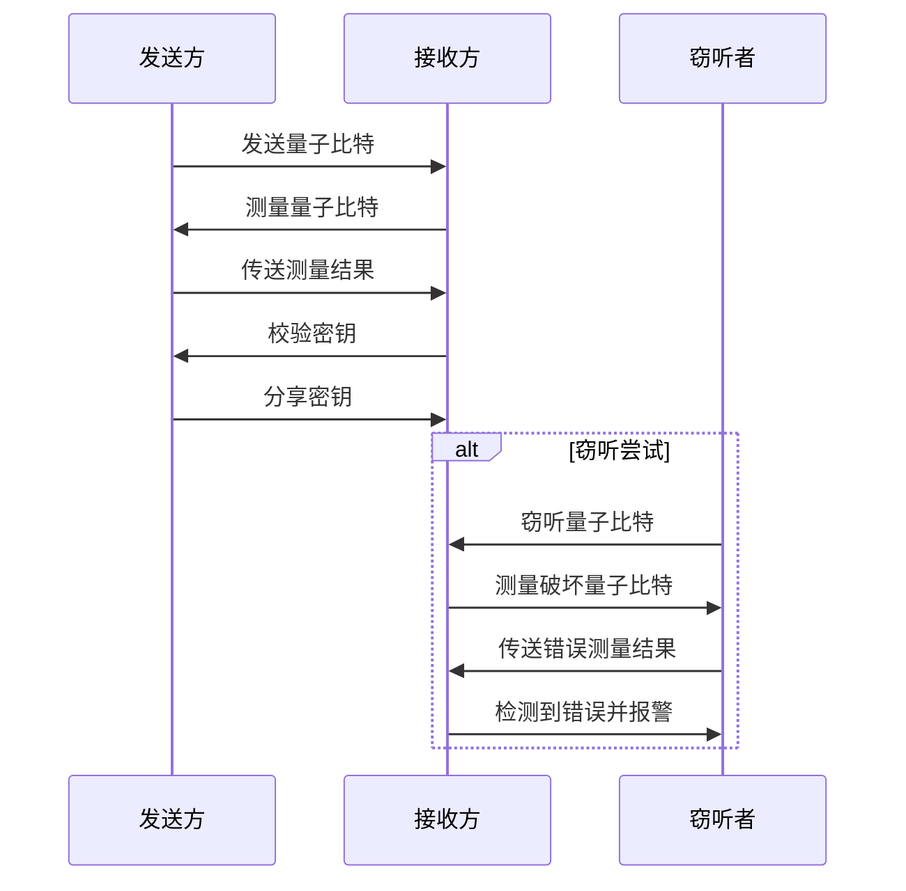

                 

### 文章标题：量子通信在军事领域的保密应用

关键词：量子通信、军事领域、保密通信、量子密钥分发、量子加密算法、安全性

摘要：本文详细探讨了量子通信在军事领域的保密应用。首先，介绍了量子通信的基本概念和原理，随后分析了军事领域保密通信的需求，并阐述了量子通信在这一领域的独特优势。本文重点讲解了量子密钥分发和量子加密算法，详细描述了它们的工作原理、数学模型和实际应用案例。最后，探讨了量子通信在军事通信中的挑战与未来发展方向，并提供了相关工具和资源的介绍。本文旨在为读者提供对量子通信在军事保密领域应用的全面理解和深刻洞察。

----------------------------------------------------------------

## 第一部分：量子通信基础

### 第1章：量子通信概述

#### 1.1 量子通信的基本概念

量子通信是基于量子力学原理实现信息传输的一种通信方式。量子通信的核心概念包括量子比特（qubit）、量子纠缠（entanglement）和量子隐形传态（quantum teleportation）等。

- **量子比特**：量子比特是量子计算机的基本单元，它可以同时处于0和1的状态，即叠加态。与经典比特不同，量子比特能够实现超平行性，极大地提高了计算能力。

- **量子纠缠**：量子纠缠是两个或多个量子系统之间存在的一种特殊关联，当其中一个量子系统的状态改变时，与之纠缠的量子系统状态也会瞬间改变，不论它们之间的距离有多远。

- **量子隐形传态**：量子隐形传态是一种利用量子纠缠将一个量子系统的状态准确无误地传递到另一个量子系统中的过程。这一过程不涉及经典信息的传输，因此具有极高的安全性。

#### 1.2 量子通信的优势与挑战

**量子通信的优势**：

1. **绝对安全性**：由于量子态的不可克隆特性，量子通信可以实现绝对安全的通信，保证了信息的保密性。
2. **超长距离传输**：量子纠缠可以实现超远程通信，打破了传统通信手段的距离限制。
3. **高速计算**：量子比特的叠加态可以实现并行计算，使得量子通信在处理大量数据时具有巨大的优势。

**量子通信的挑战**：

1. **量子比特的稳定性**：量子比特对环境极其敏感，容易受到外界干扰而失去量子态，这限制了量子通信的实际应用。
2. **传输效率**：量子通信的传输效率较低，需要大量的时间和资源来建立和维护量子信道。
3. **量子计算技术**：量子通信的实现依赖于量子计算技术的发展，而当前量子计算技术尚处于早期阶段。

#### 1.3 量子密钥分发

**量子密钥分发（Quantum Key Distribution，QKD）**是一种利用量子通信原理实现密钥分发的技术。QKD的基本原理是利用量子纠缠或量子隐形传态传输量子比特，通过测量和校验量子态来生成共享密钥。

- **工作原理**：在QKD过程中，发送方和接收方通过量子信道交换量子比特，接收方对量子比特进行测量，并根据测量结果与发送方进行经典通信来确认密钥的有效性。
- **安全性证明**：QKD的安全性基于量子态的不可克隆特性和测量破坏原理。任何试图窃听量子通信的过程都会不可避免地破坏量子态，从而被发送方和接收方检测到，确保通信的绝对安全性。

### 1.4 小结

量子通信作为一种新兴的通信方式，具有绝对安全性、超长距离传输和高速计算等显著优势。然而，实现量子通信面临着量子比特稳定性、传输效率和量子计算技术等挑战。量子密钥分发是量子通信的关键应用之一，通过利用量子态的不可克隆特性和测量破坏原理，实现了绝对安全的密钥分发。量子通信在军事领域的保密应用具有巨大的潜力，但同时也需要克服一系列技术难题。

#### Mermaid 流程图

---

## 第二部分：量子通信在军事领域的应用

### 第3章：量子通信在军事保密通信中的应用

#### 3.1 军事保密通信的需求

军事通信在信息安全方面具有极高的要求。传统通信手段虽然可以满足基本的通信需求，但在面临敌对势力的侦察和干扰时，其安全性往往无法得到保障。军事保密通信的需求主要体现在以下几个方面：

- **绝对安全性**：军事通信需要确保信息在传输过程中不被敌对方窃取或篡改，因此绝对安全性是军事保密通信的首要需求。
- **抗干扰性**：军事通信往往需要在复杂的电磁环境中进行，需要具备抗干扰能力，保证通信的稳定性。
- **实时性**：军事行动通常要求通信的实时性，以便及时获取和传递关键信息。

#### 3.2 量子通信在军事保密通信中的优势

量子通信在军事保密通信中具有独特的优势，可以有效满足军事通信的高安全性和实时性需求。

- **绝对安全性**：量子通信利用量子态的不可克隆特性和测量破坏原理，实现了绝对安全的通信。这意味着敌对方无法窃取或篡改传输的信息，从而保障了军事通信的保密性。
- **抗干扰性**：量子通信不依赖于电磁波传输，而是通过量子信道进行，因此具有较强的抗干扰能力，能够在复杂电磁环境中保持通信的稳定性。
- **实时性**：量子通信可以实现超长距离、超高速的通信，满足军事行动中实时通信的需求。

#### 3.3 量子密钥分发在军事通信中的应用

**量子密钥分发**在军事通信中具有重要的应用价值，可以实现军事通信的绝对安全性。

- **QKD通信网络**：利用量子密钥分发技术，可以构建量子通信网络，实现军事单位之间的安全通信。在QKD通信网络中，发送方和接收方通过量子信道交换量子比特，生成共享密钥，并通过经典信道进行密钥分发和加密通信。
- **量子加密算法**：量子密钥分发可以结合量子加密算法，进一步提高军事通信的安全性。量子加密算法利用量子态的叠加和纠缠特性，实现了无法被破解的加密通信。

#### 3.4 量子加密算法在军事通信中的应用

量子加密算法在军事通信中具有广泛的应用前景，可以实现高度安全的加密通信。

- **量子密钥加密**：量子密钥加密技术利用量子密钥分发生成的共享密钥，对军事通信进行加密。由于量子密钥分发具有绝对安全性，因此量子密钥加密通信也具有高度安全性。
- **量子密码学**：量子密码学技术利用量子态的叠加和纠缠特性，实现了无法被破解的加密通信。量子密码学可以应用于军事通信中的数据加密、身份认证和数字签名等。

#### 3.5 小结

量子通信在军事保密通信中具有巨大的应用潜力，可以有效满足军事通信的绝对安全性、抗干扰性和实时性需求。量子密钥分发和量子加密算法是量子通信在军事领域的重要应用技术，为实现军事通信的安全提供了有力保障。然而，量子通信在军事领域的应用仍面临一系列技术挑战，需要继续深入研究和发展。

---

## 第三部分：量子通信在军事通信中的挑战与未来

### 第4章：量子通信在军事通信中的挑战与未来发展方向

#### 4.1 军事通信中的量子通信挑战

尽管量子通信在军事保密通信中具有显著优势，但其在实际应用中仍面临一系列挑战。

- **量子比特的稳定性**：量子比特对环境极其敏感，容易受到外界干扰而失去量子态。这使得量子通信在军事通信中的稳定性成为一个重要挑战。
- **传输效率**：量子通信的传输效率较低，需要大量的时间和资源来建立和维护量子信道。这限制了量子通信在军事通信中的实际应用。
- **量子计算技术**：量子通信的实现依赖于量子计算技术的发展，而当前量子计算技术尚处于早期阶段。这使得量子通信在军事通信中的应用受到限制。

#### 4.2 量子通信在军事通信中的未来发展方向

为了克服量子通信在军事通信中的挑战，并充分发挥其优势，未来需要从以下几个方面进行研究和开发：

- **提高量子比特稳定性**：通过改进量子比特的设计和制造工艺，提高量子比特的稳定性，减少外界干扰对其影响。
- **提升传输效率**：通过研发高效的量子信道传输技术，提高量子通信的传输效率，缩短通信建立时间。
- **发展实用化的量子计算技术**：推动量子计算技术的发展，为量子通信提供强大的技术支持，实现实用化的量子通信系统。
- **构建量子通信网络**：建立覆盖全球的量子通信网络，实现军事单位之间的安全、高效通信。

#### 4.3 量子通信在军事通信中的实际案例

以下是一些量子通信在军事通信中的实际案例：

- **中国**：中国已成功实现地面和卫星之间的量子密钥分发，构建了世界首个天地一体化量子通信网络，为军事通信提供了安全保障。
- **美国**：美国在量子通信领域也进行了大量研究，并在量子密钥分发和量子加密算法方面取得了重要突破，为军事通信提供了先进的技术支持。

#### 4.4 小结

量子通信在军事通信中具有巨大的应用潜力，但同时也面临一系列挑战。通过不断研究和开发，克服这些挑战，量子通信有望在军事通信中发挥更重要的作用，为国家安全提供有力保障。未来，量子通信将在军事领域得到更广泛的应用，推动军事通信技术的不断发展。

---

## 第四部分：附录

### 第5章：量子通信工具与资源

#### 5.1 量子通信相关工具

- **量子密钥分发实验平台**：量子密钥分发实验平台是一种用于演示和验证量子密钥分发技术的工具。通过这个平台，用户可以模拟量子密钥分发过程，验证QKD的安全性。
- **量子加密算法实现工具**：量子加密算法实现工具是一种用于实现量子加密算法的软件开发工具。用户可以使用这些工具开发自己的量子加密算法应用，保护敏感信息。

#### 5.2 量子通信相关资源

- **学术论文**：量子通信领域的学术论文是了解量子通信最新研究进展的重要资源。用户可以通过学术搜索引擎，如谷歌学术（Google Scholar），查找相关论文。
- **量子通信教材**：量子通信教材是学习量子通信基础知识的重要资料。这些教材涵盖了量子通信的基本概念、原理和应用，有助于用户深入理解量子通信。
- **量子通信技术报告**：量子通信技术报告是由科研机构和政府部门发布的关于量子通信技术发展状况的报告。这些报告提供了量子通信技术的最新发展趋势和应用案例。

#### 5.3 小结

量子通信工具与资源为研究者提供了丰富的学习和实践资源，有助于深入了解量子通信技术。通过使用这些工具和资源，用户可以更好地理解和应用量子通信技术，为国家安全和信息技术的发展贡献力量。

---

### 作者信息

作者：AI天才研究院/AI Genius Institute & 禅与计算机程序设计艺术/Zen And The Art of Computer Programming

本文由AI天才研究院/AI Genius Institute与禅与计算机程序设计艺术/Zen And The Art of Computer Programming联合撰写，旨在为读者提供对量子通信在军事领域保密应用的全面理解和深刻洞察。

