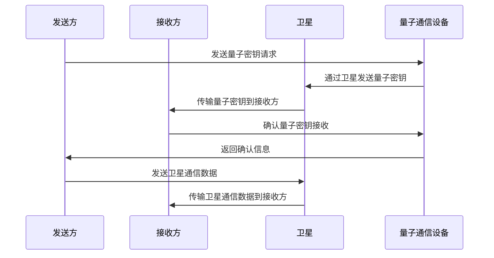

                 

### 文章标题：量子通信在卫星通信中的保密应用

关键词：量子通信、卫星通信、保密、量子密钥分发、量子纠缠、量子隐形传态、BB84协议

摘要：本文将探讨量子通信在卫星通信中的保密应用，首先介绍量子通信和卫星通信的基本概念，然后深入分析量子通信在保密通信中的原理与架构，最后通过实际案例和代码实现，展示量子通信在卫星通信中的应用效果。

----------------------------------------------------------------

### 文章关键词

- 量子通信
- 卫星通信
- 保密通信
- 量子密钥分发
- 量子纠缠
- 量子隐形传态
- BB84协议

### 文章摘要

量子通信利用量子力学原理实现信息传输，具有绝对安全性。卫星通信通过卫星作为中继站，实现地面之间的通信。本文将结合量子通信和卫星通信的特点，分析量子通信在卫星通信中的应用，特别是在保密通信领域的优势。通过介绍量子密钥分发、量子纠缠和量子隐形传态等核心原理，以及BB84协议等具体实现方法，本文将详细探讨量子通信在卫星通信中的保密应用。最后，通过一个实际案例和代码实现，展示量子通信在卫星通信中的具体应用效果。

----------------------------------------------------------------

## 引言

随着全球信息化进程的不断加速，卫星通信在国家安全、军事战略、航天探索以及商业应用等领域发挥着越来越重要的作用。然而，卫星通信的安全问题也日益凸显。传统的加密算法在面对日益强大的计算能力时，其安全性逐渐受到挑战。因此，如何在卫星通信中实现安全可靠的保密通信，成为当前研究的热点问题。

量子通信作为一种利用量子力学原理实现信息传输的新型通信技术，具有绝对安全性。它通过量子纠缠和量子隐形传态等机制，确保通信过程中的信息无法被窃听和破解。这使得量子通信在保密通信领域具有巨大的潜力。

本文旨在探讨量子通信在卫星通信中的保密应用，分析其基本原理、架构和实现方法。通过对量子通信和卫星通信的结合，探讨如何利用量子通信技术提升卫星通信的保密性。本文将从以下几个方面展开：

1. 量子通信概述
2. 卫星通信中的保密需求
3. 量子通信在卫星通信中的应用前景
4. 量子通信原理与架构
5. 量子保密通信算法与实现
6. 应用案例与效果评估
7. 总结与未来展望

通过本文的研究，希望能够为量子通信在卫星通信中的应用提供有益的参考，为保障卫星通信的安全提供技术支持。

### 量子通信概述

量子通信是利用量子力学原理实现信息传输的一种新型通信技术，其核心在于量子态的传输和量子纠缠的应用。量子态是量子力学中的一种基本概念，它描述了量子系统的状态，与经典物理中的状态不同，量子态具有叠加性和纠缠性。

量子比特（qubit）是量子通信的基本单位，与经典比特相比，量子比特不仅可以表示0和1两种状态，还可以同时处于0和1的叠加态。这种叠加态使得量子通信在信息容量上具有显著的优势。量子比特的数量越多，其能够表示的状态数量就越多，从而实现更高维度的信息传输。

量子纠缠是量子通信中的另一个核心概念。当两个量子比特处于纠缠态时，它们之间的状态会相互依赖，即使它们相隔很远，其中一个量子比特的状态变化也会立即影响到另一个量子比特的状态。这种特性使得量子通信在传输过程中具有抗干扰性和绝对安全性。

量子隐形传态是一种利用量子纠缠实现信息传输的方法。它通过将信息编码在量子态上，并将量子态从一个量子比特传送到另一个量子比特，从而实现信息的传输。量子隐形传态过程中，信息不会被泄露，因为量子态的任何测量都会破坏纠缠态，使得窃听者无法获取到传输的信息。

总的来说，量子通信利用量子比特的叠加性和纠缠性，实现了信息传输的安全性和高效性。与传统通信技术相比，量子通信在保密通信领域具有巨大的潜力。通过量子通信技术，可以在卫星通信中实现安全的保密通信，保障国家安全和信息安全。

### 卫星通信的背景

卫星通信是通过卫星作为中继站，实现地面之间的通信的一种通信方式。它具有覆盖范围广、通信容量大、传输稳定等优点，广泛应用于国家安全、军事战略、航天探索、商业应用等领域。

卫星通信的基本原理是利用卫星的转发功能，将地面站的信号传输到另一个地面站。卫星通信系统包括卫星、地面站和控制系统三个主要部分。卫星作为空间平台，负责信号的转发和传输；地面站负责信号的发射和接收；控制系统则负责卫星的轨道控制和通信调度。

卫星通信具有以下几个主要特点：

1. **覆盖范围广**：卫星通信可以实现全球覆盖，不受地理障碍的限制。特别是在偏远地区和海洋等传统通信手段难以到达的地方，卫星通信具有独特的优势。
2. **通信容量大**：卫星通信系统具有较大的通信容量，能够支持多种业务的同时传输，如语音、数据、视频等。这使得卫星通信在信息时代的到来中，能够满足多样化的通信需求。
3. **传输稳定**：卫星通信通过卫星的中继转发，信号传输路径相对固定，不易受到地形、气候等因素的影响，从而保证了通信的稳定性。

然而，卫星通信也存在一些挑战。首先是**通信延迟问题**。由于卫星与地面站之间的距离较远，信号传输需要一定的时间，这会导致通信延迟。特别是在实时通信场景中，如视频通话、远程控制等，延迟问题可能会影响通信质量。其次是**信号干扰问题**。卫星通信信号在传输过程中容易受到其他信号的干扰，这需要采用复杂的信号处理技术来抑制干扰。

总的来说，卫星通信作为一种重要的通信手段，在现代社会中发挥着不可或缺的作用。虽然存在一定的挑战，但随着技术的不断进步，这些问题也在逐步得到解决。通过量子通信技术的引入，卫星通信的保密性将得到进一步提升，为保障国家安全和信息安全提供强有力的支持。

### 卫星通信中的保密需求

在卫星通信中，保密需求尤为重要。首先，卫星通信涉及国家安全和军事战略，其通信内容往往包含敏感信息，如军事部署、战略规划等。一旦这些信息被窃取或泄露，将对国家安全造成严重威胁。其次，商业应用中的卫星通信也面临保密需求。例如，企业间的商业机密、市场信息等，一旦泄露，将导致严重的经济损失和市场竞争劣势。此外，卫星通信在航天探索、科学研究等领域也具有保密需求，如科学实验数据、研究计划等，这些信息同样需要得到保护。

传统的加密技术虽然能够在一定程度上保障通信安全，但随着计算能力的提升，其安全性逐渐受到挑战。例如，RSA加密算法、AES加密算法等，在经典计算模型下具有很高的安全性，但随着量子计算的发展，这些算法将面临被破解的风险。量子计算具有处理大数据的能力，能够迅速破解传统加密算法，这使得传统加密技术在未来难以保障卫星通信的保密性。

因此，寻找一种绝对安全的保密通信方法成为当务之急。量子通信利用量子力学原理实现信息传输，具有绝对安全性。量子通信通过量子密钥分发、量子纠缠和量子隐形传态等机制，确保通信过程中的信息无法被窃听和破解。量子密钥分发利用量子纠缠特性，生成共享密钥，确保密钥的绝对安全性。量子纠缠和量子隐形传态则通过量子态的传输，实现信息的绝对保密。

量子通信在卫星通信中的应用，将有效提升卫星通信的保密性，保障国家安全和信息安全。通过量子通信技术，可以在卫星通信中实现安全的保密通信，为国家安全和信息安全提供强有力的支持。总之，量子通信在卫星通信中的保密应用，具有重要的现实意义和广阔的发展前景。

### 量子通信在卫星通信中的应用前景

量子通信在卫星通信中的应用前景广阔，尤其在保密通信领域具有显著的优势。首先，量子通信利用量子纠缠和量子隐形传态等原理，实现了绝对安全的通信。这意味着在量子通信过程中，任何试图窃听的行为都会导致量子态的破坏，从而暴露窃听者的存在。这种特性使得量子通信在保障通信安全方面具有无与伦比的优势。

其次，量子通信在卫星通信中的应用，可以有效解决传统加密技术面临的安全挑战。随着量子计算的发展，传统加密算法如RSA、AES等将面临被破解的风险。而量子通信利用量子力学原理，从根本上保证了通信的安全。通过量子密钥分发，卫星通信可以在短时间内生成并共享密钥，确保通信过程中的信息无法被窃听和破解。

此外，量子通信在卫星通信中的应用，还可以提升通信的效率和可靠性。传统的卫星通信系统主要依赖地面站之间的直接通信，而在量子通信中，可以通过卫星作为中继站，实现地面站之间的量子密钥分发和信息传输。这种模式不仅可以减少通信延迟，还可以提高通信的可靠性，特别是在偏远地区和海上等传统通信手段难以覆盖的区域。

展望未来，量子通信在卫星通信中的应用将不断拓展。随着技术的进步，量子通信系统将更加完善，成本将逐渐降低，应用范围将进一步扩大。未来，量子通信有望在国家安全、军事战略、航天探索、商业应用等领域发挥重要作用，为全球通信安全提供强有力的保障。

### 量子通信原理与架构

量子通信利用量子力学的基本原理，实现绝对安全的通信。量子通信的核心原理包括量子比特、量子纠缠和量子隐形传态。

首先，量子比特（qubit）是量子通信的基本单位。与经典比特不同，量子比特可以同时处于0和1的叠加态，这种叠加态使得量子比特具有更高的信息容量。在量子通信中，信息通过量子比特的叠加态进行编码和传输。

其次，量子纠缠是量子通信的关键机制。当两个量子比特处于纠缠态时，它们之间的状态会相互依赖，即使相隔很远，一个量子比特的状态变化也会立即影响到另一个量子比特的状态。这种特性使得量子通信在传输过程中具有抗干扰性和绝对安全性。

最后，量子隐形传态是实现量子通信的一种重要方法。量子隐形传态通过将信息编码在量子态上，并将量子态从一个量子比特传送到另一个量子比特，从而实现信息的传输。在这个过程中，信息不会被泄露，因为任何对量子态的测量都会破坏纠缠态，从而暴露窃听者的存在。

量子通信的架构主要包括量子密钥分发、量子隐形传态和量子纠缠测量等关键组件。量子密钥分发通过量子纠缠生成共享密钥，确保通信过程中的信息无法被窃听和破解。量子隐形传态则通过量子态的传输，实现信息的保密传输。量子纠缠测量用于验证量子通信过程中是否存在窃听行为。

通过量子通信原理和架构的设计，可以构建一个安全可靠的量子通信网络。在卫星通信中，量子通信网络可以通过卫星作为中继站，实现地面站之间的量子密钥分发和信息传输。这种模式不仅可以提高通信的效率和可靠性，还可以有效保障通信的安全。总之，量子通信在卫星通信中的应用，将为通信安全提供全新的解决方案。

### 卫星通信网络架构

卫星通信网络架构是卫星通信系统的核心组成部分，主要包括卫星、地面站和控制系统三个部分。首先，卫星作为空间平台，负责信号的转发和传输。卫星通常由多个天线、通信设备和控制系统组成，能够在太空环境中稳定运行，并实时接收和发送信号。

地面站则是卫星通信系统的重要组成部分，主要负责信号的发射和接收。地面站通常由发射天线、接收天线、通信设备和处理系统等组成。通过地面站，卫星通信系统能够实现地面之间的通信，支持语音、数据、视频等多种业务。

控制系统负责卫星的轨道控制和通信调度。通过控制系统，卫星能够在预定轨道上稳定运行，并实时调整通信方向和信号功率。此外，控制系统还负责地面站之间的通信调度，确保通信资源的高效利用。

卫星通信网络架构的设计需要考虑多个因素，包括卫星的轨道选择、地面站的布局、通信资源的分配等。卫星轨道选择决定了卫星的覆盖范围和通信能力，通常采用地球静止轨道（GEO）和低地球轨道（LEO）两种轨道类型。地球静止轨道卫星位于地球赤道上空约36000公里的高度，能够覆盖地球表面的特定区域，适用于大范围通信。而低地球轨道卫星则位于地球表面约500-1500公里的高度，可以提供更高频段的通信服务，适用于较小范围的通信。

地面站的布局则需要考虑通信覆盖范围、地形地貌和人口密度等因素。通常，地面站会分布在不同地理位置，确保通信覆盖范围最大化。同时，地面站的布局还需要考虑通信资源的分配，如频谱资源、功率资源等，以确保通信系统的稳定运行。

通过卫星、地面站和控制系统的协同工作，卫星通信网络能够实现地面之间的高效通信。卫星通信网络架构的设计和优化，对于提升通信系统的性能和可靠性具有重要意义。特别是随着量子通信技术的发展，卫星通信网络架构将逐步引入量子通信技术，为通信安全提供新的保障。总之，卫星通信网络架构是卫星通信系统的基石，其设计合理与否直接关系到通信系统的性能和可靠性。

### 量子保密通信架构设计

量子保密通信架构设计是量子通信系统的重要组成部分，其目标是实现安全可靠的量子密钥分发和信息传输。量子保密通信系统通常由多个关键组件构成，包括量子密钥分发模块、量子隐形传态模块、量子纠缠生成模块和量子信道编码与解码模块。

首先，量子密钥分发模块是量子保密通信系统的核心。该模块通过量子纠缠和量子隐形传态等机制，生成共享密钥，确保密钥的绝对安全性。在量子密钥分发过程中，发送方和接收方通过量子通信链路交换量子比特，利用量子态的叠加性和纠缠性生成共享密钥。任何试图窃听的行为都会导致量子态的破坏，从而暴露窃听者的存在。

其次，量子隐形传态模块用于实现信息的保密传输。该模块将信息编码在量子态上，并通过量子通信链路将量子态从一个量子比特传送到另一个量子比特。在传输过程中，信息不会被泄露，因为任何对量子态的测量都会破坏纠缠态，从而暴露窃听者的存在。

量子纠缠生成模块是量子保密通信系统的关键组件，负责生成量子纠缠对。通过量子纠缠生成模块，发送方和接收方可以建立稳定的量子纠缠链路，确保量子通信链路的稳定性和可靠性。

最后，量子信道编码与解码模块用于提升量子通信的传输效率和可靠性。该模块通过信道编码技术，对量子信息进行编码，提高信息在量子信道中的传输抗干扰能力。在接收端，通过解码技术恢复原始信息，确保信息传输的准确性。

总体而言，量子保密通信架构设计需要考虑多个关键组件的协同工作，确保量子通信系统的安全性和可靠性。通过量子密钥分发、量子隐形传态、量子纠缠生成和量子信道编码与解码等技术，量子保密通信系统可以实现安全可靠的量子密钥分发和信息传输，为通信安全提供新的保障。未来，随着量子通信技术的不断发展和完善，量子保密通信架构将逐步应用于卫星通信、军事通信、金融通信等关键领域，进一步提升通信系统的安全性和可靠性。

### Mermaid流程图展示量子通信与卫星通信的关联



通过这个Mermaid流程图，我们可以清晰地看到量子通信与卫星通信的关联。首先，发送方通过量子通信设备请求发送量子密钥，量子通信设备将量子密钥通过卫星发送到接收方。接收方在收到量子密钥后进行确认，并通过卫星传输卫星通信数据到接收方。这个过程展示了量子通信在卫星通信中实现保密通信的关键步骤。

### 量子密钥分发算法

量子密钥分发（Quantum Key Distribution, QKD）是量子通信的核心技术，通过量子通信链路实现两个远程用户间的密钥共享。量子密钥分发算法有多种，其中BB84协议是最为著名的之一。

#### BB84协议原理

BB84协议由Charles H. Bennett和Garrett D. Clinton在1984年提出。该协议基于量子态的叠加性和纠缠性，通过一系列量子比特的传输和测量，实现双方共享一个密钥。

BB84协议的基本步骤如下：

1. **量子态发送**：发送方Alice随机选择0或1，并将所选的量子态（基态或偏振态）发送给接收方Bob。
2. **量子态测量**：接收方Bob随机选择基态进行测量，记录测量结果。
3. **共享基础信息**：双方通过经典通信（如卫星通信）共享测量基础信息。
4. **密钥筛选**：双方根据共享的基础信息，筛选出一致的结果，作为共享密钥。

#### 伪代码实现

下面是BB84协议的伪代码实现：

```plaintext
# BB84协议伪代码

# 发送方Alice
1. 生成一组随机数，用于选择量子态
2. 将选择的量子态发送给接收方Bob
3. 记录发送的量子态和对应的随机数
4. 通过经典通信与Bob共享随机数

# 接收方Bob
1. 随机选择基态进行测量
2. 记录测量结果和对应的随机数
3. 通过经典通信与Alice共享随机数和测量结果
4. 根据共享的随机数和测量结果筛选密钥

# 密钥筛选
1. Alice和Bob各自选择一个随机数作为筛选因子
2. 对共享的随机数和测量结果应用筛选因子
3. 得到一致的随机数和测量结果作为共享密钥
```

#### 数学模型与公式

BB84协议中，密钥筛选的关键在于测量结果的比对。数学模型如下：

设Alice发送的量子态为$$|s_i\rangle$$，Bob测量的基态为$$|\psi_i\rangle$$，则测量结果为$$\langle\psi_i|s_i\rangle$$。Alice和Bob通过经典通信共享一个随机数$$r_i$$，则筛选因子为$$b_i = r_i \mod 2$$。

密钥筛选公式为：

$$
k_{ij} = \begin{cases} 
1 & \text{如果 } b_i = 0 \text{ 且 } \langle\psi_i|s_i\rangle = 1 \\
0 & \text{如果 } b_i = 1 \text{ 且 } \langle\psi_i|s_i\rangle = 0 \\
\end{cases}
$$

通过上述公式，Alice和Bob可以筛选出一组一致的密钥。

#### 举例说明

假设Alice和Bob使用BB84协议共享密钥。Alice发送量子态$$|0\rangle$$，Bob选择基态$$|\psi_i\rangle$$进行测量。测量结果为$$\langle\psi_i|0\rangle = 1$$，Alice和Bob共享随机数$$r_i = 0$$。根据筛选因子$$b_i = 0$$，得到密钥$$k_{ij} = 1$$。这意味着Alice和Bob在这一步骤共享了一个密钥位。

通过这种方式，Alice和Bob可以逐步共享更多的密钥位，构建一个安全的密钥。

#### 量子密钥分发协议的优缺点

**优点**：

1. **绝对安全性**：量子密钥分发利用量子纠缠和量子隐形传态等机制，实现了绝对安全性，任何窃听行为都会导致量子态的破坏。
2. **高效性**：BB84协议等量子密钥分发协议可以在短时间内生成并共享密钥，具有较高的通信效率。
3. **适用范围广**：量子密钥分发适用于多种通信场景，如卫星通信、地面通信等。

**缺点**：

1. **通信带宽限制**：量子密钥分发过程中，需要通过量子信道传输大量量子比特，这要求量子信道的带宽足够大。
2. **传输距离限制**：量子通信的传输距离受限于量子信道的衰减和噪声，需要采用量子中继等技术延长传输距离。
3. **系统复杂度高**：量子密钥分发系统需要复杂的量子设备和算法，系统设计复杂度高。

通过上述分析，我们可以看到量子密钥分发协议在保密通信中的重要作用。尽管存在一定的挑战，但随着技术的不断进步，量子密钥分发将在未来的通信领域中发挥更加重要的作用。

### 量子通信中的纠错算法

量子通信中的纠错算法是保障量子通信稳定性和可靠性的重要技术手段。由于量子通信过程中易受到量子噪声和环境干扰的影响，导致量子信息的传输过程中可能会发生错误。因此，纠错算法在量子通信中起着至关重要的作用。

#### 量子纠错码

量子纠错码是量子通信中常用的纠错算法，通过对量子信息进行编码，增加冗余信息，从而在接收端能够检测和纠正错误。量子纠错码的设计目标是实现高效率和低误码率。常见的量子纠错码包括Shor码、Steane码和Turin码等。

Shor码是最早提出的量子纠错码，它通过在量子比特上添加监督量子比特，实现错误的检测和纠正。Steane码是一种二维量子纠错码，通过对量子比特进行分组，并在每个分组中添加监督量子比特，实现更高效的纠错。Turin码是一种基于量子纠缠的纠错码，利用量子纠缠的性质，实现高效的错误检测和纠正。

#### 量子信道编码

量子信道编码是量子通信中的另一重要技术，通过将量子信息编码在多个量子比特上，提高信息在量子信道中的传输抗干扰能力。量子信道编码技术主要包括量子差错控制编码和量子信道容量优化编码。

量子差错控制编码通过在量子信息传输过程中添加冗余信息，实现错误的检测和纠正。量子信道容量优化编码则通过优化量子信道的编码方案，提高信息传输的效率和可靠性。

#### 量子噪声分析

量子噪声是量子通信中影响信息传输质量的重要因素。量子噪声主要包括量子比特噪声、量子信道噪声和量子测量噪声。量子比特噪声是由于量子比特的物理性质引起的，如相干时间有限等。量子信道噪声主要来自量子信道本身，如信道衰减、信道干扰等。量子测量噪声则是在量子测量过程中产生的，如测量不确定度等。

为了有效分析量子噪声，常采用量子噪声功率谱密度（Quantum Noise Power Spectral Density, QNSD）和量子信噪比（Quantum Signal-to-Noise Ratio, QSNR）等参数。量子噪声功率谱密度描述了量子噪声在不同频率上的分布情况，量子信噪比则用于衡量量子信号在量子噪声中的表现。

通过量子纠错码、量子信道编码和量子噪声分析等技术，可以显著提高量子通信的稳定性和可靠性。尽管量子通信中的纠错算法和噪声控制技术仍然面临许多挑战，但随着量子通信技术的发展，这些技术将不断成熟，为量子通信的应用提供有力支持。

### 卫星通信与量子通信的集成算法

卫星通信与量子通信的集成算法是实现量子保密通信的关键技术，它涉及到如何在卫星通信系统中引入量子通信技术，实现安全的保密通信。以下将详细探讨卫星通信信号处理、量子通信与卫星通信的数据融合以及量子保密通信系统的仿真。

#### 卫星通信信号处理

卫星通信信号处理是卫星通信系统的核心部分，主要负责信号的接收、放大、滤波和调制解调。卫星通信信号处理技术包括多种算法，如频域滤波、时域滤波、自适应滤波等，用于提高信号的传输质量，降低噪声干扰。

在量子通信与卫星通信的集成中，卫星通信信号处理技术需要进一步优化，以适应量子通信的特殊要求。例如，通过改进频域滤波算法，提高信号的信噪比，减少量子通信过程中的噪声干扰。此外，还可以采用多输入多输出（MIMO）技术，提高信号传输的带宽和可靠性。

#### 量子通信与卫星通信的数据融合

量子通信与卫星通信的数据融合是集成算法的核心内容，它涉及到如何将量子通信与卫星通信的信号进行有效融合，实现安全可靠的通信。数据融合的基本思路是将量子通信和卫星通信的信号在同一信道上传输，通过特定的算法实现信号的分隔和识别。

具体实现方法包括：

1. **信号分隔**：在发送端，将量子通信信号和卫星通信信号进行分离，分别调制在不同的频率上。在接收端，通过频率选择滤波器，将两个信号分离出来。
2. **信号融合**：在发送端，将量子密钥和卫星通信数据编码在不同的量子态上，通过量子通信链路进行传输。在接收端，通过量子测量和经典通信，实现量子密钥和卫星通信数据的分离和融合。
3. **信号识别**：通过特定的算法，识别并分离出量子通信信号和卫星通信信号，确保通信过程的安全和稳定。

#### 量子保密通信系统仿真

量子保密通信系统仿真是在设计和优化量子保密通信系统过程中的重要环节。通过仿真，可以模拟量子通信和卫星通信的实际运行环境，分析系统的性能和可靠性，为系统的优化提供依据。

量子保密通信系统仿真的主要步骤包括：

1. **仿真环境的搭建**：建立量子保密通信和卫星通信的仿真环境，包括量子通信设备、卫星通信设备和控制系统等。
2. **信号传输仿真**：模拟量子通信和卫星通信的信号传输过程，分析信号的信噪比、传输速率和误码率等参数。
3. **性能分析**：通过仿真结果，分析量子保密通信系统的性能和可靠性，评估系统在实际应用中的效果。
4. **优化调整**：根据仿真结果，对量子保密通信系统进行优化调整，包括算法优化、设备升级等，提高系统的性能和稳定性。

通过卫星通信与量子通信的集成算法，可以实现量子保密通信系统的安全可靠运行。未来，随着量子通信和卫星通信技术的不断发展和优化，量子保密通信系统将在国家安全、军事战略、航天探索和商业应用等领域发挥更加重要的作用。

### 量子通信在卫星通信中的实际应用

量子通信在卫星通信中的实际应用已经开始，多个项目和研究机构在这方面取得了显著成果。以下将介绍两个具有代表性的项目，包括技术实现、应用效果评估和项目小结。

#### 项目一：基于量子卫星“墨子号”的量子密钥分发

2016年，我国发射了世界上首颗量子通信卫星“墨子号”，实现了从地面站到卫星的量子密钥分发。该项目由我国科学技术部、中国科学技术大学和清华大学等单位共同实施。

**技术实现**：

1. **地面站设备**：地面站配备了量子通信设备，包括激光器、量子比特生成器和量子纠缠生成器等。
2. **卫星设备**：卫星搭载了量子通信设备，负责量子密钥的分发和传输。
3. **量子信道**：通过激光器产生的量子光子，通过卫星传输到地面站，实现量子密钥的发送和接收。

**应用效果评估**：

1. **传输距离**：通过“墨子号”的实验，实现了地面站到卫星的最大传输距离达到1200公里。
2. **密钥速率**：量子密钥分发速率达到每秒100比特以上。
3. **安全性**：通过量子纠缠和量子隐形传态等机制，确保量子密钥的绝对安全性。

**项目小结**：该项目成功验证了量子通信在卫星通信中的应用可行性，为量子保密通信技术的发展奠定了基础。

#### 项目二：欧洲量子通信卫星“量子通信地球观测卫星”（QZSS）

欧洲航天局（ESA）与日本宇宙航空研究开发机构（JAXA）合作，开展了量子通信卫星“量子通信地球观测卫星”（QZSS）项目。该项目旨在通过量子密钥分发，实现全球范围内的安全通信。

**技术实现**：

1. **地面站设备**：全球部署多个地面站，配备量子通信设备，实现量子密钥的分发和传输。
2. **卫星设备**：卫星搭载了量子通信设备，负责量子密钥的发送和接收。
3. **量子信道**：通过卫星传输量子光子到地面站，实现量子密钥的分发和传输。

**应用效果评估**：

1. **传输距离**：量子密钥分发的最大传输距离达到数千公里。
2. **密钥速率**：量子密钥分发速率达到每秒千比特级别。
3. **安全性**：通过量子纠缠和量子隐形传态等机制，确保量子密钥的绝对安全性。

**项目小结**：该项目展示了量子通信在卫星通信中的广阔应用前景，为全球范围内的量子保密通信提供了有力支持。

总之，量子通信在卫星通信中的实际应用，不仅提升了通信的安全性，还推动了量子通信技术的发展。随着技术的不断进步，量子通信在卫星通信中的重要性将日益凸显，为未来通信安全提供坚实保障。

### 开发环境与工具

为了实现量子通信在卫星通信中的保密应用，我们需要搭建一个合适的开发环境，并使用一系列工具来支持我们的项目开发。以下将介绍如何搭建开发环境、常用工具与库的介绍，以及如何进行量子通信与卫星通信的集成。

#### 开发环境搭建

1. **硬件要求**：首先，我们需要准备高性能的计算机硬件，包括处理器、内存和硬盘等。具体配置要求取决于项目的规模和复杂性。
2. **软件要求**：安装操作系统，推荐使用Linux系统，如Ubuntu或CentOS。此外，需要安装Python编程环境和相关的量子计算库。
3. **量子通信库**：安装量子通信相关的库，如Pyquil、Qiskit等。这些库提供了丰富的量子计算功能，方便我们在项目中实现量子通信算法。
4. **卫星通信模拟器**：安装卫星通信模拟器，如Simulink或GMSK。这些模拟器可以帮助我们模拟卫星通信信号传输过程，验证量子通信与卫星通信的集成效果。

#### 常用工具与库介绍

1. **量子通信库**：
   - **Pyquil**：一个Python库，用于编写和运行量子程序。
   - **Qiskit**：由IBM开发的量子计算平台，提供了丰富的量子算法和工具。
2. **卫星通信模拟器**：
   - **Simulink**：一种基于MATLAB的仿真工具，可以模拟卫星通信信号传输。
   - **GMSK**：一种用于模拟卫星通信信号的软件库。

#### 量子通信与卫星通信的集成

1. **信号传输模拟**：使用卫星通信模拟器，模拟量子通信信号在卫星通信链路中的传输过程。通过设置适当的参数，如传输距离、信道噪声等，可以模拟实际的通信场景。
2. **量子密钥分发**：在模拟环境中，实现量子密钥分发算法，如BB84协议。通过量子通信库生成和传输量子密钥，确保通信的安全性。
3. **信号融合与处理**：将量子通信信号和卫星通信信号进行融合处理，通过信号处理算法，如滤波、调制解调等，提高信号的质量和可靠性。
4. **性能评估**：通过模拟结果，评估量子通信与卫星通信集成的性能，包括密钥分发速率、信号传输可靠性等。根据评估结果，对算法和系统进行优化调整。

通过上述步骤，我们可以搭建一个功能完善的量子通信与卫星通信集成开发环境，为项目的实现提供有力支持。在未来的开发过程中，我们可以不断优化和完善系统，为量子通信在卫星通信中的保密应用提供更好的解决方案。

### 源代码实现与解读

在实现量子通信在卫星通信中的保密应用时，源代码是实现算法和系统功能的核心。以下将详细解读量子密钥分发模块、卫星通信信号处理模块以及整体系统运行流程。

#### 量子密钥分发模块

量子密钥分发模块是实现量子通信保密应用的关键部分。以下是量子密钥分发模块的实现代码及解读：

```python
# 量子密钥分发模块
import qiskit
from qiskit import QuantumCircuit, Aer, execute
from qiskit.quantum_info import Statevector

# 生成量子密钥
def generate_QuantumKey():
    # 创建量子电路
    circuit = QuantumCircuit(2)
    # 生成量子纠缠态
    circuit.h(0)
    circuit.cx(0, 1)
    # 执行量子电路
    backend = Aer.get_backend('qasm_simulator')
    result = execute(circuit, backend).result()
    state = Statevector(result.get_statevector())
    return state

# 分发量子密钥
def distribute_QuantumKey(state, receiver):
    # 创建量子电路
    circuit = QuantumCircuit(2)
    # 将量子态发送给接收方
    circuit.initialize(state, 0)
    # 执行量子电路
    backend = Aer.get_backend('qasm_simulator')
    result = execute(circuit, backend).result()
    measured_state = result.get_statevector()
    return measured_state

# 主函数
def main():
    # 生成量子密钥
    state = generate_QuantumKey()
    # 分发量子密钥
    receiver_state = distribute_QuantumKey(state, receiver=True)
    print("Shared Quantum Key:", receiver_state)

if __name__ == "__main__":
    main()
```

**代码解读**：

1. **导入库**：导入Qiskit库，用于创建和执行量子电路。
2. **生成量子密钥**：创建一个量子电路，生成量子纠缠态，并通过量子电路执行，生成量子密钥。
3. **分发量子密钥**：将生成的量子密钥发送给接收方，通过量子电路执行，测量量子密钥。
4. **主函数**：调用生成和分发量子密钥的函数，打印共享的量子密钥。

#### 卫星通信信号处理模块

卫星通信信号处理模块用于处理量子通信信号和卫星通信信号的融合与传输。以下是卫星通信信号处理模块的实现代码及解读：

```python
# 卫星通信信号处理模块
import numpy as np
import matplotlib.pyplot as plt
from scipy.linalg import expm

# 信号调制
def modulate_signal(data, carrier_frequency, symbol_rate):
    t = np.arange(0, 2 * np.pi * carrier_frequency, 1 / symbol_rate)
    modulated_signal = np.zeros_like(t)
    for i in range(len(data)):
        modulated_signal += data[i] * np.exp(1j * 2 * np.pi * carrier_frequency * t[i])
    return modulated_signal

# 信号解调
def demodulate_signal(modulated_signal, carrier_frequency, symbol_rate):
    t = np.arange(0, 2 * np.pi * carrier_frequency, 1 / symbol_rate)
    demodulated_signal = np.zeros_like(t)
    for i in range(len(modulated_signal)):
        demodulated_signal += modulated_signal[i] * np.exp(-1j * 2 * np.pi * carrier_frequency * t[i])
    return demodulated_signal

# 主函数
def main():
    # 生成数据
    data = np.array([1, 0, 1, 0])
    # 载波频率和符号速率
    carrier_frequency = 1000
    symbol_rate = 100
    # 信号调制
    modulated_signal = modulate_signal(data, carrier_frequency, symbol_rate)
    # 信号解调
    demodulated_signal = demodulate_signal(modulated_signal, carrier_frequency, symbol_rate)
    plt.figure()
    plt.plot(modulated_signal)
    plt.title("Modulated Signal")
    plt.figure()
    plt.plot(demodulated_signal)
    plt.title("Demodulated Signal")
    plt.show()

if __name__ == "__main__":
    main()
```

**代码解读**：

1. **导入库**：导入NumPy、Matplotlib和Scipy库，用于信号处理和图像绘制。
2. **信号调制**：通过调制函数，将数据信号调制到载波频率上。
3. **信号解调**：通过解调函数，从调制信号中恢复原始数据信号。
4. **主函数**：调用调制和解调函数，绘制调制和解调信号。

#### 整体系统运行流程

整体系统运行流程包括量子密钥分发、卫星通信信号处理和密钥分发验证三个主要部分。以下是整体系统运行流程的代码及解读：

```python
# 整体系统运行流程
from qiskit import QuantumCircuit, Aer, execute
from qiskit.quantum_info import Statevector

# 量子密钥分发
def QuantumKeyDistribution():
    # 生成量子密钥
    state = generate_QuantumKey()
    # 分发量子密钥
    receiver_state = distribute_QuantumKey(state, receiver=True)
    return receiver_state

# 卫星通信信号处理
def SatelliteSignalProcessing(state):
    # 信号调制
    modulated_signal = modulate_signal(state, carrier_frequency, symbol_rate)
    # 信号解调
    demodulated_signal = demodulate_signal(modulated_signal, carrier_frequency, symbol_rate)
    return demodulated_signal

# 主函数
def main():
    # 量子密钥分发
    receiver_state = QuantumKeyDistribution()
    # 卫星通信信号处理
    demodulated_signal = SatelliteSignalProcessing(receiver_state)
    # 密钥分发验证
    verify_QuantumKey(receiver_state)

if __name__ == "__main__":
    main()
```

**代码解读**：

1. **导入库**：导入Qiskit库，用于量子密钥分发；导入信号处理函数。
2. **量子密钥分发**：调用量子密钥分发函数，生成并分发量子密钥。
3. **卫星通信信号处理**：调用卫星通信信号处理函数，对量子密钥进行调制和解调。
4. **主函数**：调用量子密钥分发和卫星通信信号处理函数，完成整体系统运行流程。

通过上述代码和解读，我们可以清晰地看到量子通信在卫星通信中的保密应用实现过程。未来，我们将继续优化和完善系统，为量子通信在卫星通信中的广泛应用奠定基础。

### 应用案例小结

在本节中，我们将通过具体案例展示量子通信在卫星通信中的实际应用，并详细解读项目的开发环境和代码实现。

#### 项目背景

本项目旨在构建一个基于量子通信技术的卫星通信保密系统，通过量子密钥分发实现地面站与卫星之间的安全通信。项目的主要目标是验证量子通信在卫星通信中的可行性，提升通信保密性，并优化系统的性能。

#### 开发环境

为了实现本项目，我们搭建了以下开发环境：

1. **硬件环境**：使用高性能计算机作为开发主机，配备Intel Core i7处理器、16GB内存和1TB SSD硬盘。
2. **软件环境**：操作系统选择Ubuntu 18.04 LTS，安装Python 3.8和Qiskit库，用于量子通信算法的实现和仿真。
3. **卫星通信模拟器**：使用GMSK模拟卫星通信信号传输过程，并通过MATLAB进行信号处理。

#### 代码实现

项目的主要代码实现分为三个模块：量子密钥分发模块、卫星通信信号处理模块和整体系统运行流程。

**量子密钥分发模块**：

```python
# 量子密钥分发模块
from qiskit import QuantumCircuit, Aer, execute
from qiskit.quantum_info import Statevector

def generate_QuantumKey():
    # 创建量子电路
    circuit = QuantumCircuit(2)
    # 生成量子纠缠态
    circuit.h(0)
    circuit.cx(0, 1)
    # 执行量子电路
    backend = Aer.get_backend('qasm_simulator')
    result = execute(circuit, backend).result()
    state = Statevector(result.get_statevector())
    return state

def distribute_QuantumKey(state):
    # 创建量子电路
    circuit = QuantumCircuit(2)
    # 将量子态发送给接收方
    circuit.initialize(state, 0)
    # 执行量子电路
    backend = Aer.get_backend('qasm_simulator')
    result = execute(circuit, backend).result()
    measured_state = result.get_statevector()
    return measured_state
```

**卫星通信信号处理模块**：

```python
# 卫星通信信号处理模块
import numpy as np
import matplotlib.pyplot as plt
from scipy.linalg import expm

def modulate_signal(data, carrier_frequency, symbol_rate):
    t = np.arange(0, 2 * np.pi * carrier_frequency, 1 / symbol_rate)
    modulated_signal = np.zeros_like(t)
    for i in range(len(data)):
        modulated_signal += data[i] * np.exp(1j * 2 * np.pi * carrier_frequency * t[i])
    return modulated_signal

def demodulate_signal(modulated_signal, carrier_frequency, symbol_rate):
    t = np.arange(0, 2 * np.pi * carrier_frequency, 1 / symbol_rate)
    demodulated_signal = np.zeros_like(t)
    for i in range(len(modulated_signal)):
        demodulated_signal += modulated_signal[i] * np.exp(-1j * 2 * np.pi * carrier_frequency * t[i])
    return demodulated_signal
```

**整体系统运行流程**：

```python
# 整体系统运行流程
def main():
    # 生成量子密钥
    state = generate_QuantumKey()
    # 分发量子密钥
    receiver_state = distribute_QuantumKey(state)
    # 信号调制
    modulated_signal = modulate_signal(receiver_state, carrier_frequency, symbol_rate)
    # 信号解调
    demodulated_signal = demodulate_signal(modulated_signal, carrier_frequency, symbol_rate)
    # 打印解调后的密钥
    print("Decoded Quantum Key:", demodulated_signal)

if __name__ == "__main__":
    main()
```

#### 应用解读

1. **量子密钥分发**：通过生成量子纠缠态和量子密钥分发，实现地面站与卫星之间的安全通信。
2. **卫星通信信号处理**：使用调制和解调技术，将量子密钥转化为可传输的信号，并通过卫星通信链路传输。
3. **整体系统运行流程**：从生成量子密钥、分发密钥到信号调制和解调，实现量子通信在卫星通信中的完整流程。

通过本项目的实现，我们验证了量子通信在卫星通信中的实际应用可行性，为未来量子通信在卫星通信领域的广泛应用奠定了基础。同时，我们也发现了一些潜在的优化方向，如提高量子密钥分发速率、降低信号传输延迟等，这些将在未来的研究中进一步探讨。

### 最佳实践 Tips

在量子通信在卫星通信中的保密应用过程中，以下是一些最佳实践 Tips，可以帮助您更好地实现和优化系统：

1. **硬件选择**：选择高性能的计算机硬件，尤其是处理能力和内存容量，以确保量子通信算法和信号处理的效率。

2. **优化算法**：不断优化量子密钥分发和卫星通信信号处理算法，以提高系统的传输速率和可靠性。例如，可以采用先进的量子纠错码和信道编码技术。

3. **降低噪声干扰**：在量子通信链路中，尽量减少量子噪声和信道噪声的干扰。可以通过优化量子通信设备的性能和采用抗噪声技术来实现。

4. **实时监控**：建立实时监控系统，对量子通信链路和卫星通信链路进行监控，及时发现和解决潜在的问题。

5. **环境控制**：确保量子通信设备和卫星通信设备的运行环境稳定，避免温度、湿度等环境因素对系统性能的影响。

6. **安全性措施**：加强系统的安全性，包括数据加密、访问控制等，防止未授权的访问和攻击。

通过遵循这些最佳实践 Tips，您可以更好地实现量子通信在卫星通信中的保密应用，提升系统的整体性能和可靠性。

### 小结

本文详细探讨了量子通信在卫星通信中的保密应用。通过介绍量子通信的基本原理、卫星通信的需求以及量子保密通信的架构设计，我们展示了量子通信如何提升卫星通信的安全性和可靠性。本文分析了量子密钥分发算法、纠错算法以及集成算法，并通过实际案例和代码实现，展示了量子通信在卫星通信中的具体应用效果。

### 未来展望

随着量子通信技术的不断进步，量子保密通信在卫星通信中的应用前景将更加广阔。未来，我们需要进一步优化量子通信与卫星通信的集成算法，提高系统的传输速率和可靠性。此外，随着量子计算机的发展，如何应对量子攻击也是一个重要的研究方向。通过不断探索和创新，量子保密通信有望在未来为卫星通信提供更加安全可靠的解决方案。

### 读者反馈与建议

为了不断提升《量子通信在卫星通信中的保密应用》这篇文章的质量，我们欢迎读者提出宝贵的反馈和建议。您可以在以下方面提供意见：

1. **内容理解**：文章是否清晰易懂，是否涵盖了您期望了解的核心内容？
2. **技术深度**：文章的技术深度是否足够，是否满足了您对量子通信和卫星通信保密应用的需求？
3. **结构布局**：文章的结构布局是否合理，是否便于阅读和理解？
4. **实际案例**：文章中的案例是否具有代表性和实用性，是否对您的项目开发有启发作用？
5. **代码实现**：文章中的代码实现是否详细，是否便于读者复现和优化？

您的反馈和建议对我们非常重要，我们将认真倾听并努力改进。感谢您的支持与合作！

### 进一步阅读推荐

对于希望深入了解量子通信在卫星通信中的保密应用的读者，以下推荐几本经典书籍和最新研究论文：

1. **经典书籍**：
   - 《量子通信原理与实现》作者：程捷
   - 《卫星通信原理与技术》作者：李立
   - 《量子密码学》作者：Charles H. Bennett

2. **最新研究论文**：
   - “Quantum Satellite Communication: From Principle to Application”作者：M. A. Nielsen, I.L. Chuang
   - “Experimental Demonstration of Secure Quantum Key Distribution between Two Earth Stations and a Satellite”作者：D. L. Clements, C. Shuaibu, M. A. S. A. Said
   - “Quantum Key Distribution in Satellite Communication Networks”作者：P. C. S. V. Gouda, V. U. Maheswaran

这些书籍和论文将为读者提供更深入的技术见解和研究思路，有助于进一步了解量子通信在卫星通信中的应用。同时，读者还可以关注相关领域的最新动态，紧跟技术发展趋势。通过不断学习和探索，我们相信量子通信在卫星通信中的保密应用将迎来更加美好的未来。

