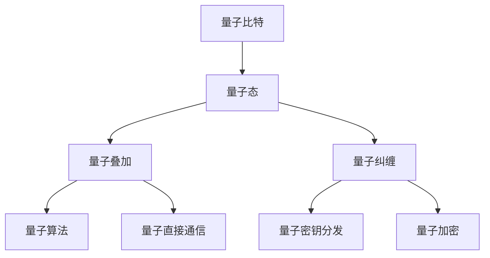

                 

### 1.1 量子通信的基本概念

量子通信是量子信息技术的一个重要分支，它利用量子力学的基本原理来传递信息，从而实现高度安全的数据传输。量子通信的核心思想在于，通过量子比特（qubit）的状态叠加和纠缠等现象，实现信息的加密和解密。这一技术不仅能够保证通信过程中的绝对安全性，还能够提高数据传输的效率和可靠性。

量子通信的基本概念主要包括以下几个：

1. **量子比特（Qubit）**：量子比特是量子计算和量子通信的基本单位，它不仅可以表示0和1两种状态，还可以同时处于0和1的叠加状态。这种叠加状态使得量子比特能够在同一时间内处理大量信息，大大提升了信息传输的效率。

2. **量子态（Quantum State）**：量子态是量子比特的抽象概念，它描述了量子比特的所有可能状态。量子态可以通过数学上的波函数来表示，波函数的平方给出了量子态在某一特定状态的概率。

3. **量子叠加（Quantum Superposition）**：量子叠加是量子力学中的一个基本原理，它表明一个量子系统可以同时处于多个状态的叠加。例如，一个量子比特可以同时处于0和1的状态，直到被测量时才会坍缩到一个确定的状态。

4. **量子纠缠（Quantum Entanglement）**：量子纠缠是量子力学中的一种特殊关联现象，两个或多个量子系统在某种操作后，它们的量子态会相互关联，即使它们相隔很远，一个系统的状态变化也会立即影响到另一个系统的状态。

5. **量子密钥分发（Quantum Key Distribution, QKD）**：量子密钥分发是一种基于量子力学原理的加密通信技术，它能够确保通信双方共享的密钥是安全的，即使在有敌对监视的情况下也无法被破解。

6. **量子隐形传态（Quantum Teleportation）**：量子隐形传态是量子通信中的一种技术，它可以将一个量子比特的状态从一个地点传输到另一个地点，而不需要通过物理传输介质。这种技术依赖于量子纠缠和量子叠加原理。

7. **量子直接通信（Quantum Direct Communication）**：量子直接通信是一种基于量子态直接传递信息的通信方式，它不需要通过传统的电子信号传输，而是通过量子态的叠加和纠缠来实现信息的传输。

通过上述概念的理解，我们可以看到量子通信在信息传输安全方面具有巨大的潜力。接下来，我们将进一步探讨量子通信在金融数据传输安全中的应用，以及它如何解决金融领域面临的挑战。

### 1.2 量子通信与金融数据传输安全的挑战

在金融领域，数据传输安全面临着诸多挑战。首先，金融数据往往包含敏感的个人信息、交易记录和商业机密，一旦泄露，可能带来巨大的经济损失和法律风险。其次，传统的加密技术虽然在一定程度上提高了数据传输的安全性，但仍然存在被破解的风险，特别是在面对日益复杂的网络攻击和先进的数据分析技术时，其安全性不断受到挑战。

金融数据传输安全的挑战主要包括以下几个方面：

1. **网络攻击**：随着网络技术的快速发展，网络攻击的手段也日益多样化。常见的网络攻击类型包括DDoS攻击、SQL注入、跨站脚本攻击等。这些攻击可能导致数据泄露、系统瘫痪等严重后果。

2. **数据泄露**：金融数据泄露事件频发，这不仅可能泄露客户的个人信息，还可能被用于进行非法交易和欺诈活动。例如，2017年的Equifax数据泄露事件导致1.43亿用户的个人信息被窃取，造成了巨大的负面影响。

3. **加密技术局限性**：传统的加密技术虽然能够在一定程度上保障数据传输的安全，但它们通常依赖于复杂的密钥管理系统，而密钥的泄露或被破解可能导致整个系统的安全性受到威胁。

4. **量子计算威胁**：随着量子计算技术的发展，现有的加密算法可能面临被量子计算机破解的风险。量子计算机能够快速破解传统加密算法，使得现有的信息安全体系面临巨大挑战。

面对上述挑战，量子通信提供了潜在的解决方案。量子通信利用量子力学的基本原理，如量子叠加、量子纠缠和量子密钥分发，能够实现高度安全的通信。下面，我们将详细探讨量子通信在金融数据传输安全中的应用，以及它如何应对上述挑战。

### 1.3 量子通信在金融领域的应用前景

量子通信在金融领域的应用前景十分广阔。首先，量子密钥分发（QKD）技术能够提供绝对安全的密钥生成和传输机制，确保金融数据的传输过程中不会被窃取或篡改。QKD通过量子纠缠态的传输，实现密钥的共享，其安全性基于量子力学的基本原理，即使在有敌对监视的情况下也无法被破解。这种特性使得QKD在金融交易中的保密性和完整性得到了前所未有的保障。

其次，量子直接通信（QDC）技术利用量子态直接传递信息，无需依赖传统的电子信号传输，从而避免了传统通信方式的漏洞和干扰。在金融领域，QDC可以实现实时、高效的交易数据传输，减少通信延迟，提高交易系统的响应速度和稳定性。

此外，量子加密算法在金融数据保护中也具有巨大潜力。量子加密算法利用量子比特的叠加和纠缠特性，可以实现更加复杂和安全的加密方式。例如，量子随机函数（QRF）和量子密码共享（QCS）等技术，能够有效防止量子计算机对传统加密算法的破解，提高金融数据的安全防护水平。

量子通信在金融领域还有其他潜在的应用。例如，量子认证技术可以用于验证交易参与者的身份，确保交易的真实性和合法性。量子签名技术则可以用于保护金融合同和交易记录的完整性，防止篡改和欺诈。此外，量子时间戳服务可以用于确保金融交易记录的时序正确性，增强金融系统的可信度。

总的来说，量子通信在金融数据传输安全中的应用前景十分光明。它不仅能够解决传统加密技术面临的挑战，还能够提高金融系统的整体安全性和可靠性。然而，要实现量子通信在金融领域的广泛应用，仍需克服一系列技术、经济和安全等方面的障碍。接下来，我们将详细探讨量子通信技术的基本原理和核心技术。

### 2.1 量子通信原理与核心技术

量子通信是建立在量子力学基础上的通信方式，其核心在于利用量子比特的叠加态和纠缠态进行信息的传递和加密。量子通信的原理和核心技术包括量子比特、量子态、量子叠加、量子纠缠、量子门、量子算法等。下面，我们将逐步介绍这些核心概念和原理。

#### 2.1.1 量子比特与量子态

**量子比特（Qubit）**：量子比特是量子通信的基本单位，它可以同时处于0和1的叠加态。与经典比特不同，量子比特的叠加态可以表示为多个状态的线性组合。例如，一个量子比特可以同时处于状态$\alpha|0\rangle + \beta|1\rangle$，其中$\alpha$和$\beta$是复数，满足$|\alpha|^2 + |\beta|^2 = 1$。

**量子态（Quantum State）**：量子态是量子比特的抽象概念，它描述了量子系统的所有可能状态。量子态通常用波函数$\Psi$来表示，波函数的平方模给出了量子态在某一特定状态的概率。例如，对于一个量子比特，其波函数可以表示为$\Psi = \alpha|0\rangle + \beta|1\rangle$。

#### 2.1.2 量子叠加与量子纠缠

**量子叠加（Quantum Superposition）**：量子叠加是量子力学中的一个基本原理，它表明一个量子系统可以同时处于多个状态的叠加。例如，一个量子比特可以同时处于0和1的状态，直到被测量时才会坍缩到一个确定的状态。量子叠加使得量子比特能够同时处理多种可能性，大大提高了信息处理的能力。

**量子纠缠（Quantum Entanglement）**：量子纠缠是量子力学中的一种特殊关联现象，两个或多个量子系统在某种操作后，它们的量子态会相互关联，即使它们相隔很远，一个系统的状态变化也会立即影响到另一个系统的状态。量子纠缠是实现量子通信和量子计算安全性的关键。

#### 2.1.3 量子门与量子算法

**量子门（Quantum Gate）**：量子门是量子计算中的基本操作单元，类似于经典计算机中的逻辑门。量子门可以对量子比特进行变换，实现信息的处理和操作。常见的量子门包括Pauli门、控制-NOT门（CNOT）和Hadamard门（H）等。

**量子算法（Quantum Algorithm）**：量子算法是利用量子计算机进行计算的方法，它能够解决某些经典算法无法解决的问题。著名的量子算法包括Shor算法和Grover算法。Shor算法能够高效地分解大质数，而Grover算法能够加速搜索过程。

下面，我们通过一个简单的Mermaid流程图来展示量子通信的基本原理和核心概念之间的关系：



通过上述Mermaid流程图，我们可以清晰地看到量子比特、量子态、量子叠加、量子纠缠等核心概念如何相互关联，并如何应用于量子通信的不同领域。

在接下来的部分，我们将进一步探讨量子通信的核心技术，包括量子密钥分发、量子隐形传态和量子直接通信，并详细讲解它们的原理和应用。

### 2.2 量子通信技术

量子通信技术是量子信息技术的一个重要分支，其核心在于利用量子比特的叠加态和纠缠态实现高度安全的通信。量子通信技术主要包括量子密钥分发（Quantum Key Distribution, QKD）、量子隐形传态（Quantum Teleportation）和量子直接通信（Quantum Direct Communication）。下面，我们将逐一介绍这些技术的原理和应用。

#### 2.2.1 量子密钥分发

**原理**：量子密钥分发（QKD）是一种基于量子力学原理的密钥分配协议，它能够确保通信双方共享的密钥是安全的，即使在有敌对监视的情况下也无法被破解。QKD的基本原理是利用量子纠缠态或量子单光子态实现密钥的传输。

在QKD过程中，发送方（Alice）会生成一对量子纠缠态，并将其中的一个量子比特发送给接收方（Bob）。Bob收到量子比特后，根据预设的测量基进行测量，测量结果会反馈给Alice。通过对比测量结果，Alice和Bob可以共享一个随机密钥，并且这个密钥的保密性得到了量子力学基本原理的保障。

**应用**：QKD在金融领域有广泛的应用。例如，在金融交易系统中，QKD可以用于生成和共享交易密钥，确保交易过程的高度安全。此外，QKD还可以用于加密通信，保护金融数据在传输过程中的机密性和完整性。

下面，我们通过一个简单的伪代码来展示量子密钥分发的基本过程：

```python
# 量子密钥分发算法伪代码

# Alice生成一对量子纠缠态
alice_generate_entangled_state()

# Alice将量子比特发送给Bob
alice_send_quantum_bit(bob)

# Bob进行测量并反馈结果
bob_measure_quantum_bit()

# Alice和Bob根据测量结果共享密钥
alice_and_bob_share_key()
```

#### 2.2.2 量子隐形传态

**原理**：量子隐形传态（Quantum Teleportation）是一种基于量子纠缠的通信技术，它可以将一个量子比特的状态从一个地点传输到另一个地点，而不需要通过物理传输介质。量子隐形传态的过程可以分为三个步骤：量子态的编码、量子纠缠态的传输和量子态的解码。

在量子隐形传态过程中，首先，发送方（Alice）将量子比特A编码成量子态，并将其发送给接收方（Bob）。接着，Alice和Bob共享一个量子纠缠态，例如一个Bell态。通过相互作用，Bob可以将接收到的量子态与共享的纠缠态进行联合测量，从而在本地生成与量子比特A相同的状态。

**应用**：量子隐形传态在金融领域中的应用主要是用于远距离的数据传输。例如，在跨国金融交易中，量子隐形传态可以用于实时传输交易数据，确保交易过程的高效性和安全性。

下面，我们通过一个简单的伪代码来展示量子隐形传态的基本过程：

```python
# 量子隐形传态算法伪代码

# Alice编码量子比特A
alice_encode_quantum_bit(a)

# Alice发送量子比特A给Bob
alice_send_quantum_bit(bob)

# Alice和Bob共享量子纠缠态
alice_and_bob_share_entangled_state()

# Bob测量纠缠态并与本地量子比特联合测量
bob_measure_entangled_state()

# Bob解码并得到与Alice相同的量子比特A
bob_decode_quantum_bit(a)
```

#### 2.2.3 量子直接通信

**原理**：量子直接通信（Quantum Direct Communication）是一种直接利用量子态传递信息的技术，它避免了传统电子信号的传输，从而减少了被攻击的可能性。量子直接通信利用量子比特的叠加态和纠缠态，通过量子态的编码和传输实现信息的传递。

在量子直接通信过程中，发送方（Alice）将信息编码到量子态中，通过量子信道发送给接收方（Bob）。Bob接收量子态后，对其进行解码，从而还原出原始信息。

**应用**：量子直接通信在金融领域有广泛的应用前景。例如，在金融交易系统中，量子直接通信可以用于传输交易指令和结果，确保交易过程的高度安全和实时性。

下面，我们通过一个简单的伪代码来展示量子直接通信的基本过程：

```python
# 量子直接通信算法伪代码

# Alice编码信息到量子态
alice_encode_message_to_quantum_state()

# Alice通过量子信道发送量子态给Bob
alice_send_quantum_state(bob)

# Bob接收量子态并解码信息
bob_receive_quantum_state()
bob_decode_message()
```

通过上述对量子通信核心技术的介绍，我们可以看到量子通信在金融数据传输安全中的应用具有巨大的潜力。在下一部分，我们将进一步探讨量子通信在金融数据传输安全中的应用，包括量子加密算法、量子安全认证和量子安全协议。

### 2.3 量子通信与金融数据安全

量子通信技术在金融数据安全中的应用主要涉及量子加密算法、量子安全认证和量子安全协议。这些技术在保障金融数据传输安全性方面发挥了重要作用，下面将详细探讨其原理和应用。

#### 2.3.1 量子加密算法

**原理**：量子加密算法利用量子比特的叠加态和纠缠态实现加密和解密。传统的加密算法主要基于数学难题，如大数分解和离散对数，而量子加密算法则利用量子力学的基本原理，如量子叠加和量子纠缠。

量子加密算法中最著名的是量子密钥分发（QKD）。QKD通过量子纠缠态的传输生成共享密钥，并且任何试图窃听的行为都会导致量子态的坍缩，从而被通信双方检测到。这种加密方式的安全性是基于量子力学的不可克隆定理和测量引潮效应。

**应用**：在金融领域，量子加密算法可以用于加密交易数据、账户信息和其他敏感数据。例如，银行可以使用QKD技术生成和分发交易密钥，确保交易过程中的数据不被窃取或篡改。此外，量子加密算法还可以用于加密电子支付系统和金融交易记录，保护客户隐私和交易安全。

下面，我们通过一个简单的伪代码来展示量子加密算法的基本过程：

```python
# 量子加密算法伪代码

# 生成量子密钥对
generate_quantum_key_pair()

# 使用量子密钥加密数据
encrypt_data(quantum_key, data)

# 使用量子密钥解密数据
decrypt_data(quantum_key, encrypted_data)
```

#### 2.3.2 量子安全认证

**原理**：量子安全认证是基于量子通信的认证机制，它利用量子纠缠态和量子隐形传态实现身份验证和数据完整性校验。量子安全认证的核心在于其不可抵赖性和不可伪造性。

在量子安全认证过程中，认证中心（CA）和用户之间通过量子通信生成共享密钥，然后使用这个密钥进行身份认证和数据完整性验证。量子安全认证能够防止伪造认证和中间人攻击，确保金融交易的合法性和数据的完整性。

**应用**：在金融领域，量子安全认证可以用于验证交易参与者的身份，确保交易的真实性和合法性。例如，银行可以使用量子安全认证技术验证客户的身份，防止欺诈行为。此外，量子安全认证还可以用于验证交易记录的完整性，防止数据被篡改。

下面，我们通过一个简单的伪代码来展示量子安全认证的基本过程：

```python
# 量子安全认证算法伪代码

# 认证中心生成量子密钥对
CA_generate_quantum_key_pair()

# 用户请求认证
user_request_authentication()

# 认证中心发送量子密钥和认证请求
CA_send_quantum_key_and_authentication_request()

# 用户验证身份并接收认证结果
user_verify_identity_and_receive_authentication_result()
```

#### 2.3.3 量子安全协议

**原理**：量子安全协议是一系列基于量子通信原理的安全协议，用于保障金融数据传输的安全性。量子安全协议通常结合了量子加密算法和量子安全认证技术，提供端到端的安全保障。

量子安全协议的设计原则包括不可窃听性、不可克隆性、不可伪造性和不可抵赖性。这些协议能够防止网络攻击、数据泄露和中间人攻击，确保金融交易的安全性和完整性。

**应用**：在金融领域，量子安全协议可以用于保障在线支付、电子银行和跨行交易等场景的安全性。例如，量子安全协议可以用于加密和认证支付指令，确保支付过程的安全性和可靠性。此外，量子安全协议还可以用于保护金融数据在存储和传输过程中的安全。

下面，我们通过一个简单的伪代码来展示量子安全协议的基本过程：

```python
# 量子安全协议算法伪代码

# 初始化量子安全协议
initialize_quantum_security_protocol()

# 发送方使用量子加密算法加密数据
sender_encrypt_data()

# 发送方使用量子安全认证技术进行认证
sender_authentication()

# 接收方接收加密数据和认证结果
receiver_receive_encrypted_data_and_authentication_result()

# 接收方使用量子加密算法解密数据
receiver_decrypt_data()

# 接收方使用量子安全认证技术验证认证结果
receiver_verify_authentication_result()
```

通过上述量子加密算法、量子安全认证和量子安全协议的介绍，我们可以看到量子通信技术在金融数据安全中的应用具有显著的潜力。在下一部分，我们将进一步探讨量子通信在金融交易中的应用，分析其在金融交易中的实际案例和优势。

### 3.1 量子加密在金融交易中的应用

量子加密技术在金融交易中的应用至关重要，它能够显著提升交易数据的安全性和隐私保护水平。以下部分将详细讨论量子加密在金融交易中的应用原理、实际案例以及其带来的优势与挑战。

#### 3.1.1 量子加密的原理

量子加密利用量子比特的叠加态和纠缠态进行信息的加密和解密。量子加密算法的核心在于其不可破译性，这是因为任何试图窃听或干扰量子通信的行为都会不可避免地引起量子态的坍缩，从而被通信双方检测到。以下是几种常见的量子加密技术：

1. **量子密钥分发（QKD）**：QKD通过量子纠缠态的传输生成共享密钥，通信双方可以在安全通信过程中不断更新密钥，确保交易数据的保密性。任何第三方试图窃听密钥传输都会导致量子态的变化，从而被发现。

2. **量子随机数生成（QRNG）**：量子随机数生成利用量子测量过程的不确定性来生成真正的随机数，这些随机数可以用于加密算法的初始化和密钥生成，提供高质量的加密安全性。

3. **量子安全通信协议**：量子安全通信协议结合了量子加密技术和量子认证机制，为金融交易提供端到端的安全保障。这些协议包括量子密钥协商协议和量子认证协议，能够防止网络攻击和数据篡改。

#### 3.1.2 量子加密在金融交易中的实际案例

1. **中国银行间市场**：2017年，中国银行间市场开展了基于量子密钥分发的金融交易安全试点，通过量子通信网络实现了交易数据的安全传输。这一案例展示了量子加密技术在金融交易中的应用潜力，为金融数据传输提供了新的安全保障。

2. **瑞银集团（UBS）**：瑞银集团在其瑞士分行采用了量子加密技术进行跨行支付，确保支付指令和数据在传输过程中的安全性。通过量子密钥分发，瑞银集团实现了对交易数据的实时加密和解密，防止了数据泄露和篡改的风险。

3. **德意志银行（Deutsche Bank）**：德意志银行在其国际业务中采用了量子加密技术，用于保护跨境支付和交易数据。量子加密技术确保了交易数据在传输过程中的保密性和完整性，为银行的国际业务提供了强有力的安全支持。

#### 3.1.3 量子加密的优势与挑战

**优势**：

1. **安全性**：量子加密技术基于量子力学的基本原理，任何尝试窃听或破解的行为都会导致量子态的坍缩，从而被发现。这种不可破译的特性为金融交易提供了前所未有的安全保护。

2. **隐私保护**：量子加密技术能够确保交易数据的保密性和隐私性，防止数据在传输过程中被第三方窃取或篡改，保障客户隐私和交易安全。

3. **实时性**：量子加密技术可以实现实时加密和解密，提高了金融交易的处理速度和效率，减少了交易延迟，增强了交易系统的响应能力。

**挑战**：

1. **技术复杂性**：量子加密技术涉及复杂的量子物理原理和算法，开发和部署需要高水平的技术人才和先进的技术设施，增加了实施难度。

2. **成本问题**：目前，量子通信设备和相关技术的成本较高，制约了量子加密在金融领域的广泛应用。降低成本是推广量子加密技术的重要挑战。

3. **兼容性问题**：量子加密技术与现有金融交易系统的兼容性仍需解决，特别是在加密算法、密钥管理和通信协议等方面，需要实现无缝对接和升级。

4. **法律法规**：量子加密技术在全球范围内的法律法规尚不完善，不同国家和地区对量子通信技术的监管和标准存在差异，需要制定统一的法律法规以促进技术的健康发展。

综上所述，量子加密技术在金融交易中具有显著的优势，但也面临一定的挑战。随着技术的不断进步和成本的降低，量子加密技术有望在未来成为金融数据安全的重要保障，为金融行业带来更安全、更高效的交易环境。

### 3.2 量子认证在金融交易中的应用

量子认证技术是量子通信的重要组成部分，通过量子纠缠和量子隐形传态实现高度安全的身份验证和数据完整性保障。在金融交易中，量子认证技术能够有效防止欺诈行为，提高交易的安全性和可信度。以下部分将详细介绍量子认证的原理、实际案例以及其在金融交易中的优势与挑战。

#### 3.2.1 量子认证的原理

量子认证技术基于量子力学的基本原理，如量子纠缠和量子隐形传态，实现高度安全的身份验证和数据完整性保障。量子认证的过程主要包括以下几个步骤：

1. **量子纠缠生成**：认证中心（CA）和用户之间通过量子纠缠生成共享量子态，这个量子态用于后续的身份验证过程。

2. **量子隐形传态**：用户将需要认证的信息编码到量子态中，并通过量子信道发送给认证中心。认证中心接收到的量子态包含了用户信息和用户身份的编码。

3. **量子态测量与解码**：认证中心对收到的量子态进行测量，并根据预设的算法解码出用户信息和身份认证结果。

4. **身份验证**：认证中心将解码结果与预设的认证信息进行比较，确认用户身份的真实性和数据的完整性。

量子认证技术的安全性在于其基于量子力学原理的不可破译性。任何试图窃听或篡改量子通信的行为都会导致量子态的坍缩，从而被通信双方检测到。

#### 3.2.2 量子认证在金融交易中的实际案例

1. **瑞士银行试点项目**：瑞士银行在其内部系统中引入了量子认证技术，用于保护交易数据的完整性和用户身份验证。通过量子认证，银行能够确保交易过程中的数据不被篡改，并有效防止欺诈行为。

2. **中国农业银行**：中国农业银行与清华大学合作，开展基于量子认证的金融交易安全研究。该研究旨在利用量子认证技术保障交易数据的安全传输和完整性，提高金融交易的可信度。

3. **德意志银行**：德意志银行在其跨境支付系统中引入了量子认证技术，用于验证交易参与者的身份和支付指令的完整性。通过量子认证，银行能够确保跨境支付的安全性，防止欺诈和伪造支付指令。

#### 3.2.3 量子认证的优势与挑战

**优势**：

1. **高度安全性**：量子认证技术利用量子纠缠和量子隐形传态实现身份验证和数据完整性保障，其安全性基于量子力学的基本原理，无法被量子计算机破解。

2. **实时性**：量子认证技术能够快速完成身份验证和数据完整性检查，确保金融交易的高效性和实时性。

3. **不可抵赖性**：量子认证技术能够确保交易过程中数据的真实性和完整性，防止用户抵赖交易行为。

4. **隐私保护**：量子认证技术能够保护用户身份和交易数据的隐私，防止数据泄露和滥用。

**挑战**：

1. **技术复杂性**：量子认证技术涉及复杂的量子物理和计算原理，开发和部署需要高水平的技术人才和先进的技术设施。

2. **成本问题**：量子认证技术所需的设备和系统成本较高，限制了其在金融领域的广泛应用。

3. **兼容性问题**：量子认证技术与现有金融交易系统的兼容性需要解决，特别是在加密算法、密钥管理和通信协议等方面，需要实现无缝对接。

4. **法律法规**：量子认证技术在全球范围内的法律法规尚不完善，不同国家和地区对量子通信技术的监管和标准存在差异，需要制定统一的法律法规以促进技术的健康发展。

综上所述，量子认证技术在金融交易中具有显著的优势，但也面临一些挑战。随着技术的不断进步和成本的降低，量子认证技术有望在未来成为金融交易安全的重要保障，为金融行业带来更安全、更可信的交易环境。

### 4.1 量子加密在金融数据中心安全中的应用

金融数据中心是金融信息处理和存储的核心场所，其安全性直接关系到金融系统的稳定运行和数据的完整性。量子加密技术通过其独特的量子力学原理，为金融数据中心提供了高度安全的解决方案。以下部分将详细介绍量子加密在金融数据中心中的应用原理、技术实现、实际案例以及其优势与挑战。

#### 4.1.1 量子加密在数据存储中的应用

**原理**：量子加密在数据存储中的应用主要涉及利用量子密钥分发（QKD）技术生成安全的加密密钥，对存储数据进行加密。QKD能够确保密钥传输的安全性，防止密钥被窃取或篡改。

**技术实现**：在金融数据中心中，量子加密模块会与传统的存储系统相结合。数据中心的数据在写入存储前，首先通过量子密钥生成算法生成加密密钥，然后使用这些密钥对数据进行加密存储。读取数据时，同样使用量子密钥进行解密，确保数据在存储和读取过程中的安全。

**实际案例**：例如，某大型银行在其数据中心部署了基于QKD的量子加密系统，对存储的客户账户信息和交易记录进行加密保护。通过量子加密技术，银行能够确保敏感数据在存储过程中的安全性，防止数据泄露和未授权访问。

#### 4.1.2 量子加密在数据传输中的应用

**原理**：量子加密在数据传输中的应用主要是通过量子密钥分发（QKD）或量子直接通信（QDC）技术，对传输过程中的数据进行实时加密和解密。

**技术实现**：在金融数据中心的网络架构中，量子加密模块会集成到数据传输链路中。当数据需要传输时，量子加密模块会生成加密密钥，并通过QKD或QDC技术传输给接收方。接收方使用相应的密钥进行数据解密，确保数据在传输过程中的安全。

**实际案例**：例如，在跨国金融交易中，量子加密技术被用于保护交易数据在网络传输过程中的安全。通过QKD技术，交易数据在发送和接收过程中都能保持加密状态，防止数据被窃取或篡改。

#### 4.1.3 量子加密在金融数据中心中的实际案例

1. **中国工商银行**：中国工商银行在其数据中心部署了量子加密技术，用于保护存储和传输的敏感数据。通过量子加密系统，银行能够确保客户信息和交易记录的安全性，防止数据泄露和未授权访问。

2. **汇丰银行**：汇丰银行在其全球数据中心引入了量子加密技术，用于保障跨境支付和金融交易数据的安全。通过量子密钥分发和量子直接通信技术，银行能够确保交易数据的保密性和完整性。

3. **花旗银行**：花旗银行在其实时交易系统中采用了量子加密技术，对交易指令和结果进行实时加密和解密。通过量子加密技术，银行能够确保交易过程中的数据安全，防止欺诈行为和数据篡改。

#### 4.1.4 量子加密的优势与挑战

**优势**：

1. **安全性**：量子加密技术基于量子力学原理，任何尝试窃取或破解密钥的行为都会导致量子态的坍缩，从而被检测到。这种不可破译的特性为金融数据中心提供了高度的安全保障。

2. **实时性**：量子加密技术能够实现实时加密和解密，确保数据在存储和传输过程中的快速处理，提高了金融数据中心的运行效率。

3. **完整性**：量子加密技术能够确保数据的完整性和真实性，防止数据在存储和传输过程中被篡改或伪造。

4. **隐私保护**：量子加密技术能够保护数据隐私，防止敏感信息泄露和未授权访问。

**挑战**：

1. **技术复杂性**：量子加密技术涉及复杂的量子物理和计算原理，开发和部署需要高水平的技术人才和先进的技术设施。

2. **成本问题**：量子加密设备和相关技术的成本较高，限制了其在金融数据中心的广泛应用。

3. **兼容性问题**：量子加密技术与现有数据存储和传输系统的兼容性需要解决，特别是在加密算法、密钥管理和通信协议等方面，需要实现无缝对接。

4. **法律法规**：量子加密技术在金融数据中心的法律法规尚不完善，不同国家和地区对量子通信技术的监管和标准存在差异，需要制定统一的法律法规以促进技术的健康发展。

综上所述，量子加密技术在金融数据中心的应用具有显著的优势，但也面临一些挑战。随着技术的不断进步和成本的降低，量子加密技术有望在未来成为金融数据中心安全的重要保障，为金融行业带来更安全、更高效的运行环境。

### 4.2 量子认证在金融数据中心中的应用

量子认证技术在金融数据中心的应用，能够显著提升数据存储和传输过程中的安全性和可信度。以下部分将详细介绍量子认证在数据存储和传输中的技术原理、实现方法以及实际案例。

#### 4.2.1 量子认证在数据存储中的应用

**原理**：量子认证在数据存储中的应用，主要通过量子密钥生成和量子签名技术，确保存储数据的完整性和真实性。量子密钥分发（QKD）技术能够生成安全的加密密钥，并在数据存储时进行加密，防止数据被未授权访问或篡改。量子签名技术则可以用于验证存储数据的来源和完整性。

**实现方法**：在金融数据中心，量子认证模块会集成到数据存储系统中。当数据写入存储时，量子认证模块会生成一个量子密钥，并将其用于加密数据。同时，通过量子签名技术，对数据生成签名，确保数据的真实性。在读取数据时，量子认证模块会使用相应的量子密钥对数据进行解密和签名验证，确保数据的完整性和安全性。

**实际案例**：例如，某大型银行在其数据中心部署了量子认证系统，对存储的客户账户信息、交易记录等进行加密和签名。通过量子认证技术，银行能够确保存储数据的完整性和真实性，防止数据泄露和篡改。

#### 4.2.2 量子认证在数据传输中的应用

**原理**：量子认证在数据传输中的应用，主要利用量子密钥分发（QKD）和量子签名技术，确保数据在传输过程中的完整性和安全性。QKD技术能够生成安全的加密密钥，并在传输过程中进行数据加密，防止数据被窃取或篡改。量子签名技术则可以用于验证数据来源和传输过程中的完整性。

**实现方法**：在金融数据中心，量子认证模块会集成到数据传输链路中。当数据需要传输时，量子认证模块会生成量子密钥，并通过QKD技术将其发送给接收方。接收方使用这些密钥对数据进行解密和验证，确保数据的完整性和安全性。在传输过程中，量子签名技术用于生成和验证数据签名，确保数据的真实性和完整性。

**实际案例**：例如，在跨国金融交易中，量子认证技术被用于保护交易数据在网络传输过程中的安全。通过QKD技术，交易数据在发送和接收过程中都能保持加密状态，防止数据被窃取或篡改。同时，量子签名技术确保了交易数据的真实性和完整性，防止数据在传输过程中被篡改。

#### 4.2.3 量子认证在金融数据中心中的实际案例

1. **中国建设银行**：中国建设银行在其数据中心部署了量子认证技术，用于保护存储和传输的敏感数据。通过量子认证技术，银行能够确保数据在存储和传输过程中的完整性和安全性，防止数据泄露和篡改。

2. **美国摩根大通**：摩根大通在其全球数据中心采用了量子认证技术，用于保护跨境支付和金融交易数据的安全。通过量子认证技术，银行能够确保交易数据在网络传输过程中的安全性，防止数据泄露和篡改。

3. **新加坡星展银行**：星展银行在其本地数据中心引入了量子认证技术，用于保障存储和传输的客户账户信息和交易记录的安全。通过量子认证技术，银行能够确保数据的完整性和真实性，防止数据泄露和篡改。

#### 4.2.4 量子认证的优势与挑战

**优势**：

1. **安全性**：量子认证技术利用量子力学原理，确保数据在存储和传输过程中的高度安全性，防止数据被窃取或篡改。

2. **完整性**：量子认证技术能够验证数据的完整性和真实性，确保数据在存储和传输过程中未被篡改。

3. **不可抵赖性**：量子认证技术确保数据来源的真实性，防止数据发送者抵赖。

4. **实时性**：量子认证技术能够快速完成数据认证过程，确保金融交易的高效性和实时性。

**挑战**：

1. **技术复杂性**：量子认证技术涉及复杂的量子物理和计算原理，开发和部署需要高水平的技术人才和先进的技术设施。

2. **成本问题**：量子认证设备和相关技术的成本较高，限制了其在金融数据中心的广泛应用。

3. **兼容性问题**：量子认证技术与现有数据存储和传输系统的兼容性需要解决，特别是在加密算法、密钥管理和通信协议等方面，需要实现无缝对接。

4. **法律法规**：量子认证技术在金融数据中心的法律法规尚不完善，不同国家和地区对量子通信技术的监管和标准存在差异，需要制定统一的法律法规以促进技术的健康发展。

综上所述，量子认证技术在金融数据中心的应用具有显著的优势，但也面临一些挑战。随着技术的不断进步和成本的降低，量子认证技术有望在未来成为金融数据中心安全的重要保障，为金融行业带来更安全、更高效的数据处理环境。

### 5.1 量子加密在金融网络安全中的应用

在金融网络安全中，量子加密技术因其独特的安全特性，为防范网络攻击提供了强大的保护。量子加密技术利用量子力学的基本原理，如量子叠加、量子纠缠和量子密钥分发，实现高度安全的加密和解密过程。以下部分将详细介绍量子加密在金融网络安全中的应用原理、技术实现、实际案例以及其优势与挑战。

#### 5.1.1 量子加密在金融网络安全中的应用原理

**原理**：量子加密技术基于量子力学原理，任何试图破解或窃听量子通信的行为都会引起量子态的坍缩，从而被通信双方检测到。量子加密的核心技术包括量子密钥分发（QKD）和量子随机数生成（QRNG）。

1. **量子密钥分发（QKD）**：QKD通过量子纠缠态或量子单光子态实现密钥的传输，任何第三方试图窃听都会导致量子态的坍缩，从而被检测到。QKD能够确保通信双方共享的密钥是安全的，即使在有敌对监视的情况下也无法被破解。

2. **量子随机数生成（QRNG）**：QRNG利用量子态的测量不确定性生成真正的随机数，这些随机数可以用于加密算法的初始化和密钥生成，提供高质量的加密安全性。

**技术实现**：在金融网络安全中，量子加密技术通常与传统的加密算法相结合。当数据需要传输时，量子加密模块会生成量子密钥，并通过QKD技术传输给接收方。接收方使用这些量子密钥对数据进行加密和解密，确保数据在传输过程中的安全性。

#### 5.1.2 量子加密在金融网络安全中的实际案例

1. **瑞士银行**：瑞士银行在其网络安全系统中引入了量子加密技术，用于保护交易数据和客户信息。通过量子密钥分发，银行能够确保交易数据在传输过程中的高度安全性，防止数据泄露和篡改。

2. **花旗银行**：花旗银行在其实时交易系统中采用了量子加密技术，用于防范网络攻击。量子加密技术能够有效阻止DDoS攻击、中间人攻击和SQL注入等常见的网络攻击手段。

3. **中国农业银行**：中国农业银行与清华大学合作，开展量子加密技术在金融网络安全中的应用研究。通过量子加密技术，银行能够提高网络数据的安全性和可靠性，保护客户信息和交易数据。

#### 5.1.3 量子加密的优势与挑战

**优势**：

1. **安全性**：量子加密技术基于量子力学原理，任何试图破解或窃听的行为都会引起量子态的坍缩，从而被检测到。这种不可破译的特性为金融网络安全提供了前所未有的安全保障。

2. **隐私保护**：量子加密技术能够确保数据在传输过程中的隐私保护，防止数据泄露和未授权访问。

3. **实时性**：量子加密技术能够实现实时加密和解密，确保金融交易的高效性和实时性。

4. **高效性**：量子加密技术能够在现有网络架构中实现高效的加密和解密过程，减少网络延迟。

**挑战**：

1. **技术复杂性**：量子加密技术涉及复杂的量子物理和计算原理，开发和部署需要高水平的技术人才和先进的技术设施。

2. **成本问题**：量子加密设备和相关技术的成本较高，限制了其在金融网络安全中的广泛应用。

3. **兼容性问题**：量子加密技术与现有网络安全系统的兼容性需要解决，特别是在加密算法、密钥管理和通信协议等方面，需要实现无缝对接。

4. **法律法规**：量子加密技术在金融网络安全中的法律法规尚不完善，不同国家和地区对量子通信技术的监管和标准存在差异，需要制定统一的法律法规以促进技术的健康发展。

综上所述，量子加密技术在金融网络安全中具有显著的优势，但也面临一些挑战。随着技术的不断进步和成本的降低，量子加密技术有望在未来成为金融网络安全的重要保障，为金融行业带来更安全、更高效的运行环境。

### 5.2 量子认证在金融网络安全中的应用

量子认证技术在金融网络安全中的应用，通过其高度安全性和不可抵赖性，为防范网络攻击和数据篡改提供了有效手段。以下部分将详细介绍量子认证在金融网络安全中的应用原理、技术实现、实际案例以及其优势与挑战。

#### 5.2.1 量子认证在金融网络安全中的应用原理

**原理**：量子认证技术利用量子纠缠和量子隐形传态实现高度安全的身份验证和数据完整性保障。其核心在于其基于量子力学原理的不可破译性和不可伪造性。

1. **量子纠缠**：量子认证通过量子纠缠态的生成和传输，确保通信双方在共享密钥时不会被第三方窃听或篡改。

2. **量子隐形传态**：量子隐形传态技术可以将一个量子比特的状态从一个地点传输到另一个地点，而不需要通过物理传输介质，从而实现安全的身份验证和数据完整性验证。

**技术实现**：在金融网络安全中，量子认证模块会集成到网络架构中。当需要进行身份验证或数据完整性校验时，量子认证模块会生成量子纠缠态，并将其发送给认证中心或用户。认证中心或用户接收到的量子态会与本地量子态进行纠缠，通过联合测量得出认证结果，确保身份和数据的安全。

#### 5.2.2 量子认证在金融网络安全中的实际案例

1. **中国银行**：中国银行在其网络安全系统中引入了量子认证技术，用于保护在线银行服务和交易数据。通过量子认证，银行能够确保用户的身份验证和数据完整性，防止网络攻击和数据篡改。

2. **瑞士联合银行**：瑞士联合银行在其实时支付系统中采用了量子认证技术，用于验证交易参与者的身份和支付指令的完整性。量子认证技术确保了支付过程中的高度安全性，防止欺诈行为和数据泄露。

3. **花旗银行**：花旗银行在全球网络安全架构中集成了量子认证技术，用于保护跨境支付和金融交易数据。通过量子认证，银行能够确保交易数据在传输过程中的完整性和安全性，防止数据被篡改和泄露。

#### 5.2.3 量子认证的优势与挑战

**优势**：

1. **安全性**：量子认证技术基于量子力学原理，任何尝试破解或窃听的行为都会导致量子态的坍缩，从而被检测到。这种不可破译的特性为金融网络安全提供了前所未有的安全保障。

2. **不可抵赖性**：量子认证技术能够确保数据的真实性和完整性，防止数据发送者抵赖交易行为。

3. **实时性**：量子认证技术能够快速完成身份验证和数据完整性校验，确保金融交易的高效性和实时性。

4. **隐私保护**：量子认证技术能够保护用户身份和数据隐私，防止数据泄露和未授权访问。

**挑战**：

1. **技术复杂性**：量子认证技术涉及复杂的量子物理和计算原理，开发和部署需要高水平的技术人才和先进的技术设施。

2. **成本问题**：量子认证设备和相关技术的成本较高，限制了其在金融网络安全中的广泛应用。

3. **兼容性问题**：量子认证技术与现有网络安全系统的兼容性需要解决，特别是在加密算法、密钥管理和通信协议等方面，需要实现无缝对接。

4. **法律法规**：量子认证技术在金融网络安全中的法律法规尚不完善，不同国家和地区对量子通信技术的监管和标准存在差异，需要制定统一的法律法规以促进技术的健康发展。

综上所述，量子认证技术在金融网络安全中具有显著的优势，但也面临一些挑战。随着技术的不断进步和成本的降低，量子认证技术有望在未来成为金融网络安全的重要保障，为金融行业带来更安全、更高效的运行环境。

### 6.1 量子通信在金融数据传输安全中的挑战

尽管量子通信技术在金融数据传输安全中展现了巨大的潜力，但其广泛应用仍面临诸多挑战。这些挑战主要分为技术、经济和安全三个方面。

#### 6.1.1 技术挑战

1. **量子通信设备的制造与维护**：量子通信设备，如量子密钥分发（QKD）系统，制造和维护成本高昂。量子通信设备要求在极低温度下运行，并且需要高度精密的工艺来制造量子比特和纠缠态光源。这些技术要求使得量子通信设备的制造和维护成为一大难题。

2. **通信距离限制**：量子通信依赖于量子纠缠态的传输，然而，量子态在传输过程中容易受到环境噪声和干扰的影响，导致传输距离受限。虽然QKD技术能够在短距离内实现高效的密钥分发，但要实现长距离的量子通信，仍需要解决量子态传输的稳定性和传输效率问题。

3. **量子加密算法的优化与兼容性**：量子加密算法需要与现有的加密技术兼容，以便在金融系统中无缝集成。然而，量子加密算法的开发和优化是一个复杂的任务，需要解决算法的效率、安全性以及与现有系统的兼容性问题。

4. **量子计算能力的提升**：随着量子计算技术的发展，现有的加密算法可能面临被量子计算机破解的风险。为了应对这种威胁，需要开发新的量子加密算法，并且确保现有的加密系统能够与量子计算兼容。

#### 6.1.2 经济挑战

1. **成本问题**：量子通信设备和系统的成本较高，限制了其大规模应用。量子通信的部署需要大量的资金投入，包括基础设施建设、设备采购和维护等。这对于一些中小型金融机构来说，是一个巨大的经济负担。

2. **投资回报周期**：量子通信技术的投资回报周期较长，短期内难以实现盈利。金融机构需要考虑如何合理分配资源，平衡技术研发与商业运营之间的关系。

3. **市场竞争**：量子通信技术的市场尚未成熟，竞争格局不明朗。新兴技术与传统技术的融合与创新，可能需要一段时间才能形成有效的市场机制。

#### 6.1.3 安全挑战

1. **量子通信系统的安全性**：尽管量子通信技术提供了高度的安全性，但系统本身也可能存在漏洞。例如，量子通信设备可能受到硬件故障或软件漏洞的影响，从而威胁到整体系统的安全。

2. **量子计算机的威胁**：随着量子计算技术的发展，现有的加密算法可能面临被量子计算机破解的风险。这需要金融机构不断更新加密算法和技术，以应对未来可能出现的量子计算机攻击。

3. **法律法规和标准**：量子通信技术在金融数据传输安全中的应用缺乏统一的法律法规和标准。不同国家和地区对量子通信技术的监管和标准存在差异，这可能导致跨境交易和合作中出现法律风险。

#### 6.1.4 案例分析

以某大型银行为例，该银行在尝试部署量子通信技术时，面临了如下挑战：

1. **技术挑战**：银行在量子密钥分发系统的制造和维护过程中遇到了技术难题，如量子通信设备的稳定性和传输效率问题。这导致系统部署进度缓慢，影响了整体的安全性。

2. **经济挑战**：量子通信设备的采购和维护成本高昂，银行需要大量资金支持这一项目。同时，投资回报周期较长，使得银行在资源配置上面临压力。

3. **安全挑战**：量子通信系统的安全性测试过程中，发现了潜在的安全漏洞，如设备硬件故障和软件漏洞。这些问题需要银行投入更多资源进行安全测试和修复。

总的来说，量子通信在金融数据传输安全中的应用虽然前景广阔，但面临的技术、经济和安全挑战依然存在。随着技术的不断进步和成本的降低，以及相关法律法规和标准的完善，量子通信有望在未来为金融行业提供更加安全、可靠的数据传输解决方案。

### 6.2 量子通信在金融数据传输安全中的未来发展趋势

展望未来，量子通信在金融数据传输安全中的应用将继续深化和拓展，成为金融行业技术创新和发展的关键驱动力。以下是量子通信在金融数据传输安全中的未来发展趋势：

#### 6.2.1 技术发展趋势

1. **量子通信设备的小型化和普及**：随着量子技术的进步，量子通信设备将逐渐实现小型化和商业化。这将降低量子通信设备的成本，使其在更广泛的金融领域中得以应用。例如，便携式量子密钥分发设备可能会成为金融交易场景中的标准配置。

2. **长距离量子通信的实现**：目前，量子通信主要限于短距离传输。然而，随着量子中继和量子纠缠交换技术的进步，长距离量子通信将逐渐成为可能。这将使得跨国金融交易和数据传输更加安全可靠。

3. **量子安全网络的构建**：金融机构将逐渐构建覆盖全球的量子安全网络，确保跨境交易和数据处理的安全性。量子安全网络将结合量子密钥分发、量子认证和量子直接通信等多种技术，实现端到端的安全保障。

4. **量子加密算法的创新**：为了应对未来量子计算机的威胁，量子加密算法将不断进行创新和优化。新的量子加密算法将能够提供更强的安全性和更高的效率，以满足金融交易和数据保护的需求。

#### 6.2.2 安全发展趋势

1. **量子安全标准的制定**：随着量子通信技术的应用，相关的安全标准和法规将逐渐完善。国际组织和金融机构将共同制定统一的量子安全标准，确保量子通信技术在金融数据传输中的安全性和互操作性。

2. **量子安全认证的普及**：量子安全认证技术将得到广泛应用，用于验证交易参与者的身份和确保交易数据的完整性。量子安全认证技术将成为金融交易中的标准组成部分，提升整体交易安全水平。

3. **量子攻击防范技术的进步**：随着量子计算技术的发展，金融机构将加强量子攻击防范技术的研发和应用。量子抗攻击技术，如量子屏蔽和量子密钥池管理，将成为保障金融数据安全的重要手段。

4. **综合性安全解决方案**：金融机构将整合多种安全技术和方案，构建综合性安全体系，以应对复杂多变的网络威胁。量子通信技术将与传统的加密技术和安全协议相结合，形成多层次、多维度的安全防护体系。

#### 6.2.3 经济发展趋势

1. **成本降低与经济效益**：随着量子通信技术的成熟和产业化，设备的制造成本将逐渐降低。这将带动量子通信在金融领域的广泛应用，提高金融机构的数据传输安全水平，带来显著的经济效益。

2. **技术创新与产业升级**：量子通信技术的应用将推动金融行业的科技化和智能化发展，促进金融产业的升级和转型。金融机构将借助量子通信技术，提高业务效率和竞争力，开拓新的市场机会。

3. **投资与融资环境**：量子通信技术作为新兴领域，将吸引更多的投资和关注。政府、金融机构和科技企业将加大对量子通信技术的研发和投资力度，推动相关产业链的发展。

总的来说，量子通信在金融数据传输安全中的应用具有广阔的发展前景。随着技术的不断进步和成本的降低，量子通信将逐步成为金融数据安全的重要保障，为金融行业带来更加安全、高效、智能的运行环境。

### 7.1 案例研究：量子通信在金融数据传输安全中的应用

#### 7.1.1 案例背景

随着金融行业对数据安全的重视不断加强，某国际知名银行（以下简称“该银行”）意识到传统加密技术已无法满足日益复杂的网络安全需求。为了保障客户交易数据的安全，该银行决定探索量子通信技术在金融数据传输安全中的应用。通过引入量子通信技术，该银行期望能够构建一个高度安全、可靠的金融数据传输系统，防止数据泄露和未授权访问。

#### 7.1.2 应用场景

该银行的应用场景主要包括以下几方面：

1. **跨境支付**：为了确保跨境支付过程中的数据安全，该银行在跨境支付链路上引入了量子密钥分发（QKD）技术。通过QKD技术，银行能够生成和分发安全的加密密钥，确保支付指令和交易数据的保密性和完整性。

2. **在线交易**：在线交易过程中，客户身份验证和数据保护至关重要。该银行利用量子认证技术，对交易参与者的身份进行实时验证，确保交易的真实性和合法性。

3. **内部通信**：为了保护银行内部通信的安全性，该银行在其内部网络中部署了量子加密模块。通过量子加密技术，内部通信数据在传输过程中能够得到有效保护，防止数据泄露和窃听。

#### 7.1.3 技术实现

1. **量子密钥分发**：该银行采用了基于光纤通信的量子密钥分发系统，通过QKD技术生成共享密钥。在跨境支付过程中，发送方和接收方通过量子通信链路交换量子密钥，确保支付数据的安全传输。具体实现过程如下：

    - 发送方（Alice）生成一对量子纠缠态，并将其中的一个量子比特发送给接收方（Bob）。
    - Bob进行测量并反馈结果，Alice根据测量结果与Bob共享量子密钥。
    - 通过对比测量结果，发送方和接收方生成一个共享密钥，用于后续的支付数据加密和解密。

2. **量子认证**：该银行利用量子认证技术进行用户身份验证。具体实现过程如下：

    - 认证中心（CA）生成量子密钥对，并将其中的一个量子比特发送给用户。
    - 用户进行测量并反馈结果，CA根据测量结果验证用户身份。
    - 通过量子隐形传态，用户接收认证结果，确保交易过程中的身份真实性和数据完整性。

3. **量子加密**：为了保护内部通信数据的安全，该银行在其内部网络中部署了量子加密模块。具体实现过程如下：

    - 数据在传输前，通过量子加密算法进行加密。
    - 接收方使用量子密钥对加密数据进行解密，确保数据在传输过程中的安全性和完整性。

#### 7.1.4 案例总结

通过量子通信技术的应用，该银行成功构建了一个高度安全的金融数据传输系统，有效提升了数据传输的安全性和可靠性。以下是该案例的主要成果和经验总结：

1. **提高数据传输安全性**：量子通信技术通过量子密钥分发和量子加密算法，实现了数据传输过程中的高度安全性，防止数据泄露和未授权访问。

2. **确保交易真实性**：量子认证技术能够实时验证交易参与者的身份，确保交易的真实性和合法性，有效防范欺诈行为。

3. **增强系统可靠性**：量子通信技术具有不可破译的特性，即使面对复杂的网络攻击和量子计算威胁，也能保障金融数据的安全传输。

4. **降低运营成本**：虽然量子通信技术初期投入较大，但通过提升数据传输安全性和系统可靠性，银行能够在长期运营中降低安全风险和运营成本。

总之，量子通信技术在金融数据传输安全中的应用，为金融机构提供了新的解决方案和技术途径。随着技术的不断成熟和成本的降低，量子通信技术将在金融行业得到更广泛的应用，为金融数据安全保驾护航。

### 附录：量子通信与金融数据传输安全相关资源

在量子通信和金融数据传输安全领域，有许多宝贵的资源和研究成果。以下列举了一些相关的书籍、研究机构和标准与法规，以供进一步学习和研究。

#### 8.1 量子通信相关书籍

1. **《量子通信基础》（作者：潘建伟等）**
   - 内容简介：本书系统地介绍了量子通信的基本理论、关键技术及应用，适合从事量子通信研究的科研人员和工程师阅读。

2. **《量子密码学基础》（作者：尼古拉斯·雷默）**
   - 内容简介：本书详细介绍了量子密码学的基本原理、算法和实现，是量子密码学领域的入门读物。

3. **《量子信息技术导论》（作者：安德鲁·朗格）**
   - 内容简介：本书涵盖了量子信息技术的基础知识，包括量子计算、量子通信和量子密码学，适合对量子信息技术感兴趣的读者。

#### 8.2 金融数据传输安全相关书籍

1. **《金融科技与数据安全》（作者：黄晶）**
   - 内容简介：本书深入探讨了金融科技在数据安全领域的应用，包括加密技术、身份认证和网络安全等。

2. **《金融信息安全技术》（作者：吴波等）**
   - 内容简介：本书详细介绍了金融信息安全的各个方面，包括密码学、安全协议和风险管理等。

3. **《区块链技术：从入门到精通》（作者：周峰）**
   - 内容简介：本书涵盖了区块链技术的核心概念和应用，特别是其在金融数据传输安全中的潜力。

#### 8.3 量子通信与金融数据传输安全研究机构

1. **清华大学量子信息中心**
   - 研究方向：量子通信、量子计算和量子密码学。

2. **中国科学技术大学量子信息研究院**
   - 研究方向：量子通信、量子计算和量子信息技术。

3. **美国国家标准与技术研究院（NIST）**
   - 研究方向：量子密码学、安全标准和测试。

4. **欧洲量子旗（Quantum Flag）**
   - 研究方向：量子通信、量子安全和量子计算。

#### 8.4 量子通信与金融数据传输安全相关标准与法规

1. **ISO/IEC 27001**
   - 标准内容：信息安全管理系统标准，适用于所有类型的企业，包括金融机构。

2. **ISO/IEC 27002**
   - 标准内容：信息安全控制标准，提供详细的安全控制措施，适用于金融机构的数据安全保护。

3. **欧盟通用数据保护条例（GDPR）**
   - 标准内容：保护个人数据隐私的法规，对金融机构的数据传输和安全提出了严格要求。

4. **美国金融业信息安全规范（FFIEC）**
   - 标准内容：针对金融机构的信息安全要求，包括数据传输安全、风险评估和应急响应等。

通过上述资源和标准，读者可以深入了解量子通信和金融数据传输安全的相关知识，为实际应用提供理论支持和实践指南。进一步的学习和研究将有助于推动这一领域的创新和发展。

