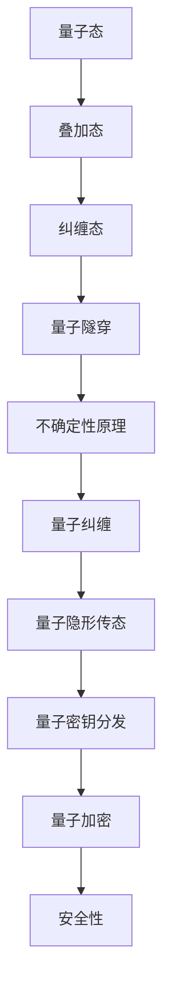

                 

### 文章标题

#### 量子通信：构建不可破解的通信网络

### 关键词

- 量子通信
- 量子密钥分发
- 量子加密
- 量子纠缠
- 量子隐形传态

### 摘要

本文将深入探讨量子通信这一前沿技术，阐述其构建不可破解通信网络的原理与应用。首先，我们将回顾量子力学的基础概念，理解量子纠缠与量子隐形传态的原理，并通过Mermaid流程图展示它们之间的联系。接着，本文将详细介绍量子密钥分发（QKD）的核心算法，包括BB84协议和E91协议，并探讨量子重复器和量子中继技术的实现方法。随后，我们将探讨量子加密与量子密码学的应用，对比量子加密与经典加密的优势。最后，本文将讨论量子通信网络构建的挑战与未来展望，提供相关资源和最佳实践建议。

### 引言

在信息时代，通信安全是至关重要的一环。然而，随着计算能力的不断提升，传统加密技术正面临前所未有的挑战。为了构建一个更为安全、不可破解的通信网络，量子通信应运而生。量子通信利用量子力学的独特性质，提供了一种全新的安全通信手段。本文旨在详细探讨量子通信的原理、应用以及面临的挑战，以帮助读者理解这一颠覆性的技术。

量子通信的核心理念源于量子力学的基本原理，包括量子纠缠、量子隐形传态和量子密钥分发。量子纠缠使得两个量子系统在物理上相互关联，即使相隔遥远，一个系统的变化也能瞬间影响另一个系统。量子隐形传态则是利用量子纠缠实现信息传输，不经过传统意义上的传输通道。量子密钥分发（Quantum Key Distribution, QKD）利用量子态的不确定性和不可克隆特性，确保通信双方能够安全地共享密钥。

本文结构如下：首先介绍量子通信的基础概念，包括量子力学的基本原理和量子通信的核心原理。然后，详细讨论量子密钥分发和量子隐形传态的技术原理及其实现方法。接下来，分析量子加密和量子密码学的应用，对比量子加密与经典加密的优势。随后，讨论量子通信网络的构建及其面临的挑战。最后，总结全文，并提供量子通信领域的相关资源和最佳实践建议。

### 第一部分：量子通信基础

#### 1. 量子力学与量子通信原理

量子力学是研究物质世界微观规律的基础物理学理论，它揭示了微观粒子在量子尺度上的奇异行为。量子力学的基本概念包括量子态、叠加态、纠缠态、量子隧穿、不确定性原理和量子纠缠等。这些概念构成了量子通信的理论基石。

**量子态**

量子态是量子系统所处的状态，可以用波函数或态矢量来描述。一个量子态可以是叠加态，即一个量子系统可以同时处于多个状态的组合。例如，一个电子的自旋状态可以同时是向上和向下的叠加态。

**叠加态**

叠加态是指一个量子系统同时处于多个可能状态的组合。例如，一个电子的自旋状态可以同时是向上和向下的叠加态。这种叠加态的存在使得量子系统具有量子计算的潜力。

**纠缠态**

量子纠缠是指两个或多个量子系统之间存在的一种特殊的相互关联关系。即使这些量子系统相隔遥远，它们之间的量子态变化也会瞬间相互影响。这种纠缠现象是量子通信的核心原理之一。

**量子隧穿**

量子隧穿是指一个量子粒子通过一个本来不可能通过的经典势垒的现象。这种特性使得量子通信中的量子态传输具有特殊的优势。

**不确定性原理**

不确定性原理是量子力学的基本原理之一，它指出无法同时准确测量一个粒子的位置和动量。这一原理对量子通信的安全性提供了保障。

**量子通信原理**

量子通信利用量子力学的独特性质来实现安全通信。以下是量子通信的核心原理：

**量子纠缠**

量子纠缠使得两个量子系统在物理上相互关联，即使相隔遥远，一个系统的变化也能瞬间影响另一个系统。这种关联性为量子通信提供了传输信息的可能性。

**量子隐形传态**

量子隐形传态是指利用量子纠缠将一个量子态从一个位置传送到另一个位置，而不经过传统意义上的传输通道。这一原理实现了量子态的远程传输。

**量子密钥分发**

量子密钥分发（QKD）利用量子态的不确定性和不可克隆特性，确保通信双方能够安全地共享密钥。通过量子纠缠和量子隐形传态，QKD可以生成一个安全的共享密钥，使得通信过程中的信息无法被窃听或篡改。

**量子加密**

量子加密利用量子态的不可克隆特性，实现数据的安全传输。与经典加密不同，量子加密具有无法破解的潜力。

**核心概念与联系**

为了更好地理解量子通信的原理，我们可以通过Mermaid流程图展示其核心概念之间的联系：

通过上述流程图，我们可以清晰地看到量子态、叠加态、纠缠态、量子隧穿、不确定性原理等概念之间的联系，以及它们如何共同构成了量子通信的理论基础。

#### 2. 量子密钥分发

量子密钥分发（Quantum Key Distribution, QKD）是量子通信的核心技术之一，它利用量子态的不确定性和不可克隆特性来实现通信双方安全地共享密钥。QKD的基本原理是通过量子通信信道传输量子态，并对传输的量子态进行测量，从而生成共享密钥。

**量子密钥分发的原理**

量子密钥分发的原理可以概括为以下几个步骤：

1. **量子态传输**：通信双方（Alice和Bob）通过量子通信信道传输量子态。这个量子态可以是单光子的极化态、相位态或时间编码态等。

2. **量子态测量**：Alice和Bob各自对传输的量子态进行测量，并根据测量结果生成一个初始密钥。

3. **密钥筛选**：由于量子态的不确定性，传输过程中可能会受到外部干扰，导致部分量子态无法正确测量。因此，需要对测量结果进行筛选，只保留正确的测量结果，形成最终密钥。

4. **密钥认证**：为了确保密钥的完整性，Alice和Bob可以使用经典通信信道对密钥进行认证。如果发现密钥存在错误，可以重新生成密钥。

**BB84协议**

BB84协议是最早提出的量子密钥分发协议，它基于量子态的极化编码。以下是BB84协议的基本步骤：

1. **量子态编码**：Alice生成一系列随机的极化态，并使用一个随机数生成器选择极化方向。Alice将编码后的量子态发送给Bob。

2. **量子态测量**：Bob接收到Alice发送的量子态后，使用一个随机数生成器选择测量方向，并对量子态进行测量。

3. **结果传输**：Bob将测量结果通过经典通信信道传输给Alice。

4. **密钥生成**：Alice和Bob根据测量结果，选择在相同测量方向上获得一致结果的量子态，生成共享密钥。

BB84协议的安全性依赖于量子态的不可克隆特性和测量破坏原理。如果量子态被窃听，窃听者无法完全复制量子态，导致测量结果不一致，从而暴露窃听行为。

**E91协议**

E91协议是基于量子纠缠态的量子密钥分发协议，它扩展了BB84协议的原理。E91协议的基本步骤如下：

1. **量子纠缠态生成**：Alice和Bob共享一个量子纠缠态，这个纠缠态可以由一个光源产生，并通过量子通信信道传输。

2. **量子态测量**：Alice和Bob各自对纠缠态的量子态进行测量，并根据测量结果生成初始密钥。

3. **密钥筛选**：与BB84协议类似，E91协议也需要对测量结果进行筛选，只保留正确的测量结果，形成最终密钥。

4. **密钥认证**：Alice和Bob使用经典通信信道对密钥进行认证。

E91协议相对于BB84协议具有更高的密钥生成速率，因为纠缠态可以同时传输多个量子态。然而，E91协议的实现较为复杂，需要精确的纠缠态生成和测量技术。

**量子密钥分发技术的优缺点分析**

量子密钥分发技术具有以下优点：

1. **安全性**：量子密钥分发利用量子态的不可克隆特性和测量破坏原理，确保密钥不会被窃听者完全复制或篡改。

2. **不可破解**：由于量子态的不可克隆特性，量子密钥分发产生的密钥具有无法破解的潜力。

3. **高保密性**：量子密钥分发产生的密钥具有高保密性，因为即使密钥被窃听，也无法恢复原始信息。

然而，量子密钥分发技术也存在一些缺点：

1. **传输距离限制**：量子通信信道的传输距离受到量子态退相干时间的限制，通常只能实现短距离通信。

2. **实现难度**：量子密钥分发需要高精度的量子态生成、测量和纠错技术，实现较为复杂。

3. **成本问题**：目前，量子通信设备和技术成本较高，大规模应用受到一定的限制。

#### 3. 量子隐形传态

量子隐形传态（Quantum Teleportation）是一种利用量子纠缠实现量子态传输的技术。它能够在不经过传统传输通道的情况下，将一个量子系统的状态从一个位置传送到另一个位置。量子隐形传态不仅展示了量子通信的奇特现象，还为构建量子互联网提供了可能。

**量子隐形传态原理**

量子隐形传态的基本原理基于量子纠缠和量子态的远程传输。具体步骤如下：

1. **纠缠态生成**：Alice和Bob共享一个量子纠缠态，这个纠缠态可以由一个光源产生，并通过量子通信信道传输。

2. **量子态编码**：Alice将需要传输的量子态与共享的纠缠态进行叠加，形成一个新的量子态。这个新的量子态包含了Alice的量子态和共享的纠缠态信息。

3. **量子态传输**：Alice将编码后的量子态发送给Bob。

4. **量子态测量**：Bob接收到Alice发送的量子态后，对其进行测量，并根据测量结果生成一个新的量子态。

5. **量子态重编码**：Bob将测量结果与共享的纠缠态进行叠加，形成一个新的量子态。这个新的量子态包含了原始量子态的信息。

6. **量子态重构**：Bob使用量子门操作，将新的量子态重构为原始量子态。

通过量子隐形传态，量子态能够在不经过传统传输通道的情况下，从一个位置传送到另一个位置。这个过程展示了量子纠缠的神奇特性，同时也为量子通信提供了新的可能性。

**量子隐形传态的实验实现**

量子隐形传态的实验实现需要精确的量子态生成、测量和操控技术。以下是一个典型的实验流程：

1. **纠缠态生成**：使用一个激光器产生两个光子，并通过一个分束器将它们分离开来。这两个光子处于量子纠缠态。

2. **量子态编码**：Alice将需要传输的量子态（例如，一个光子的极化态）与量子纠缠态进行叠加。

3. **量子态传输**：Alice将编码后的量子态发送给Bob，通过量子通信信道进行传输。

4. **量子态测量**：Bob接收到Alice发送的量子态后，对其进行测量，并根据测量结果生成一个新的量子态。

5. **量子态重编码**：Bob将测量结果与量子纠缠态进行叠加，形成一个新的量子态。

6. **量子态重构**：Bob使用量子门操作，将新的量子态重构为原始量子态。

通过上述实验步骤，可以实现量子隐形传态的实验验证。目前，量子隐形传态实验已经取得了显著的进展，实现了长距离的量子态传输。

**量子隐形传态的优缺点分析**

量子隐形传态具有以下优点：

1. **远距离传输**：量子隐形传态可以实现远距离的量子态传输，突破了传统通信传输距离的限制。

2. **无需物理传输通道**：量子隐形传态不依赖于传统传输通道，通过量子纠缠实现量子态的远程传输。

3. **安全性**：量子隐形传态利用量子态的不可克隆特性，确保传输过程中的信息无法被窃听或篡改。

然而，量子隐形传态也存在一些缺点：

1. **技术复杂性**：量子隐形传态需要高精度的量子态生成、测量和操控技术，实现较为复杂。

2. **传输速率限制**：目前，量子隐形传态的传输速率较低，尚无法实现大规模应用。

3. **成本问题**：量子隐形传态的实验设备和操作成本较高，限制了其大规模应用。

尽管存在一定的挑战，量子隐形传态作为量子通信的重要技术，展示了巨大的潜力。随着技术的不断进步，量子隐形传态有望在未来的量子通信网络中发挥重要作用。

#### 4. 量子重复器与量子中继

在量子通信中，量子重复器和量子中继器是确保量子态在长距离传输中保持稳定性的关键设备。它们的作用类似于经典通信中的中继站，能够放大或重构量子信号，从而延长量子通信的距离。

**量子重复器**

量子重复器（Quantum Repeater）是一种能够放大或重构量子态的设备。它的基本原理是通过量子态的测量和重构，将量子信号在传输过程中逐渐衰减的量子态恢复到初始状态。量子重复器的主要作用是延长量子通信的距离，使其能够跨越长距离传输。

**量子中继器**

量子中继器（Quantum Relay）与量子重复器类似，也是用于延长量子通信距离的设备。然而，量子中继器主要依赖于量子态的纠缠特性，通过量子纠缠来重构传输中的量子信号。量子中继器通过在接收端生成与传输量子态纠缠的辅助量子态，并将其与传输量子态进行量子纠缠，从而实现量子信号的传输和重构。

**量子重复器与量子中继器的比较**

量子重复器和量子中继器在原理和功能上存在一定的差异：

1. **原理差异**：量子重复器主要依赖于量子态的测量和重构，而量子中继器则依赖于量子纠缠。

2. **性能差异**：量子重复器在放大量子信号时，可能会引入更多的噪声，而量子中继器则通过量子纠缠减少了噪声的影响。

3. **适用范围**：量子重复器适用于长距离、低噪声的量子通信场景，而量子中继器则更适合长距离、高噪声的量子通信场景。

**量子重复器的原理**

量子重复器的基本原理包括以下几个步骤：

1. **量子态测量**：在传输过程中，对量子态进行测量，获取其状态信息。

2. **量子态重构**：根据测量结果，使用量子门操作重构量子态，使其恢复到初始状态。

3. **量子态放大**：使用量子放大器对重构后的量子态进行放大，使其能量恢复到初始状态。

4. **量子态传输**：将放大后的量子态传输到下一个节点。

通过上述步骤，量子重复器能够延长量子通信的距离，确保量子信号在传输过程中的稳定性。

**量子中继器的原理**

量子中继器的基本原理包括以下几个步骤：

1. **量子态接收**：接收传输中的量子态。

2. **量子态纠缠**：生成一个与传输量子态纠缠的辅助量子态。

3. **量子态重构**：通过量子纠缠将传输量子态重构为辅助量子态。

4. **量子态传输**：将重构后的量子态传输到下一个节点。

通过量子纠缠和量子态的重构，量子中继器能够实现量子信号的远程传输，并保持其稳定性。

**量子重复器与量子中继器的比较**

量子重复器和量子中继器在性能和应用上存在以下差异：

1. **性能差异**：量子重复器在放大量子信号时，可能会引入更多的噪声，而量子中继器则通过量子纠缠减少了噪声的影响。

2. **适用范围**：量子重复器适用于长距离、低噪声的量子通信场景，而量子中继器则更适合长距离、高噪声的量子通信场景。

3. **技术复杂度**：量子重复器的实现相对简单，而量子中继器的实现需要更高的技术复杂度。

尽管量子重复器和量子中继器在原理和应用上存在差异，但它们都是量子通信中不可或缺的技术。随着技术的不断进步，量子重复器和量子中继器将在量子通信网络中发挥越来越重要的作用。

#### 5. 量子加密与量子密码学

量子加密与量子密码学是量子通信领域的重要组成部分，它们利用量子力学的独特性质，提供了一种全新的安全通信手段。与传统加密技术相比，量子加密具有无法被破解的潜力，为信息安全提供了坚实的保障。

**量子加密原理**

量子加密（Quantum Cryptography）利用量子态的不确定性、不可克隆性和纠缠特性，实现数据的安全传输。其基本原理包括以下几个步骤：

1. **量子态编码**：将待加密的信息编码成量子态，例如，将信息编码成光子的极化态或相位态。

2. **量子态传输**：通过量子通信信道传输编码后的量子态。

3. **量子态测量**：接收方对传输的量子态进行测量，获取加密信息。

4. **量子态重构**：根据测量结果，重构加密信息。

量子加密利用量子态的不可克隆特性，确保传输过程中信息无法被窃听或篡改。即使窃听者试图复制或测量量子态，也会导致量子态发生变化，从而暴露窃听行为。

**量子密码学应用**

量子密码学（Quantum Cryptography）是一系列基于量子力学原理的加密和解密技术。其主要应用包括：

1. **量子密钥分发**：量子密钥分发（Quantum Key Distribution, QKD）是量子密码学的核心应用之一。通过QKD，通信双方可以安全地生成共享密钥，确保通信过程中的信息无法被窃听或篡改。

2. **量子加密通信**：量子加密通信利用量子态实现数据加密，提供了一种无法被破解的通信方式。与经典加密技术相比，量子加密通信具有更高的安全性。

3. **量子安全认证**：量子安全认证利用量子态的不可克隆特性，实现对身份和信息的认证，确保通信双方的身份真实可靠。

**量子加密与经典加密的比较**

量子加密与经典加密在原理和安全性上存在显著差异。以下是两者的比较：

1. **安全性**：经典加密技术依赖于算法的复杂性和密钥的保密性，而量子加密利用量子态的不可克隆特性和纠缠特性，提供无法被破解的保障。

2. **加密算法**：经典加密算法包括对称加密和非对称加密，如AES和RSA等。量子加密则利用量子态的编码、测量和重构，实现数据加密和解密。

3. **密钥管理**：经典加密需要确保密钥的保密性，而量子加密通过量子密钥分发实现密钥的安全生成和共享。

4. **计算复杂度**：经典加密算法的破解依赖于计算复杂度，而量子加密利用量子计算机的量子并行性，实现高效的数据加密和解密。

尽管量子加密具有更高的安全性，但其实现和部署面临一定的挑战。量子加密设备的成本较高，量子通信信道的传输距离受限，都是当前亟待解决的问题。随着量子技术的发展，量子加密将在信息安全领域发挥越来越重要的作用。

#### 6. 量子通信网络构建

量子通信网络是构建量子互联网的基础，它利用量子通信技术实现远程量子态的传输和共享，为未来的信息通信提供了一种全新的解决方案。构建量子通信网络的关键在于量子中继器、量子路由器等设备的研发和部署。

**量子通信网络原理**

量子通信网络的基本原理包括以下几个步骤：

1. **量子态传输**：通过量子中继器和量子路由器，将量子态从一个节点传输到另一个节点。

2. **量子态共享**：在量子通信网络中，多个节点可以通过量子纠缠实现量子态的共享，实现量子态的远程传输。

3. **量子态重构**：在接收节点，通过量子门操作和量子态重构，恢复原始的量子态。

4. **量子态测量**：在接收节点，对重构后的量子态进行测量，获取传输的信息。

**量子通信网络架构**

量子通信网络的架构可以分为以下几个层次：

1. **基础层**：包括量子中继器和量子路由器，用于实现量子态的长距离传输和共享。

2. **网络层**：包括量子通信网络的控制和管理系统，用于管理和调度量子通信资源，实现网络的优化和可靠性。

3. **应用层**：包括量子加密、量子计算、量子存储等应用，实现量子通信网络的具体应用场景。

**量子通信网络的实现技术**

量子通信网络的实现涉及多种先进技术和设备，包括：

1. **量子中继器**：用于延长量子通信的距离，保持量子态的稳定性。

2. **量子路由器**：用于路由量子通信信号，实现量子态的转发和共享。

3. **量子加密设备**：用于实现量子通信过程中的数据加密，确保信息的安全传输。

4. **量子存储设备**：用于存储量子态，实现长时间的信息保持。

5. **量子态生成器**：用于生成量子态，实现量子通信的初始态。

6. **量子态测量设备**：用于测量量子态，获取传输的信息。

**量子通信网络的挑战与未来展望**

尽管量子通信网络具有巨大的潜力，但其构建面临诸多挑战：

1. **传输距离限制**：量子通信信道的传输距离受到量子态退相干时间的限制，目前只能实现短距离通信。

2. **实现复杂性**：量子通信网络的实现需要高精度的量子态生成、测量和操控技术，实现较为复杂。

3. **成本问题**：量子通信设备的成本较高，限制了其大规模应用。

然而，随着量子技术的不断发展，量子通信网络的未来展望光明。随着量子中继器、量子路由器等设备的研发和部署，量子通信网络的传输距离将不断延长，实现全球范围的量子通信。量子加密的应用将使信息安全得到全面提升，量子计算和量子存储的发展将推动量子通信网络的智能化和高效化。未来，量子通信网络有望成为信息时代的重要基础设施，为人类社会带来巨大的变革。

#### 7. 量子通信挑战与未来展望

尽管量子通信展示了巨大的潜力和优势，但在实际应用中仍面临诸多挑战。以下是对量子通信面临的挑战以及未来展望的详细分析。

**量子通信面临的挑战**

1. **传输距离限制**：量子通信信道的传输距离受到量子态退相干时间的限制。量子态在传输过程中容易受到环境噪声的影响，导致退相干现象。目前，量子通信的传输距离通常只能达到几十公里到上百公里，远远无法满足全球通信的需求。

2. **技术复杂性**：量子通信的实现需要高精度的量子态生成、测量和操控技术，这涉及到光学、电子学、计算机科学等多个领域。当前的技术水平尚无法完全解决这些问题，限制了量子通信的广泛应用。

3. **成本问题**：量子通信设备的成本较高，包括量子中继器、量子路由器、量子加密设备等。这些设备的研发、制造和部署都需要大量资金投入，限制了量子通信的大规模应用。

4. **标准化问题**：量子通信的标准尚未统一，不同厂家和机构之间的设备和协议可能存在兼容性问题。这导致量子通信网络的互联互通性较差，影响了量子通信的普及和应用。

**未来展望**

尽管面临挑战，量子通信的未来仍然充满希望。以下是对量子通信未来发展的展望：

1. **传输距离延长**：随着量子中继器、量子隐形传态等技术的不断发展，量子通信的传输距离有望得到显著延长。通过结合量子隐形传态技术，可以实现远距离的量子通信，满足全球范围内的通信需求。

2. **技术成熟**：随着量子技术的不断进步，量子态生成、测量和操控技术将逐渐成熟。这将为量子通信的广泛应用奠定基础，降低量子通信设备的成本和复杂性。

3. **标准化进程**：量子通信的标准化工作正在逐步推进。国际标准化组织（ISO）和其他相关机构正在制定量子通信的标准，以促进量子通信设备的互联互通。这将为量子通信网络的建设和应用提供有力支持。

4. **应用领域拓展**：量子通信不仅在通信领域具有广泛的应用，还可以拓展到量子计算、量子加密、量子安全认证等领域。量子通信网络的建立将推动这些领域的快速发展，为人类社会带来巨大的变革。

5. **政策支持**：随着各国对量子通信技术的重视，政策支持将成为量子通信发展的重要推动力。政府资金投入、政策扶持和人才培养等措施将有助于量子通信技术的研发和推广。

总之，尽管量子通信面临诸多挑战，但其巨大的潜力和广阔的应用前景使人们对其未来充满信心。随着技术的不断进步和政策的支持，量子通信有望在未来成为信息时代的重要基础设施，为人类社会带来革命性的变革。

### 附录

#### 附录A：量子通信相关术语解释

- **量子态**：量子态是量子系统所处的状态，可以用波函数或态矢量来描述。量子态可以是叠加态，即一个量子系统可以同时处于多个可能状态的组合。

- **叠加态**：叠加态是指一个量子系统同时处于多个可能状态的组合。例如，一个电子的自旋状态可以同时是向上和向下的叠加态。

- **纠缠态**：纠缠态是指两个或多个量子系统之间存在的一种特殊的相互关联关系。即使这些量子系统相隔遥远，它们之间的量子态变化也会瞬间相互影响。

- **量子隧穿**：量子隧穿是指一个量子粒子通过一个本来不可能通过的经典势垒的现象。

- **不确定性原理**：不确定性原理是量子力学的基本原理之一，它指出无法同时准确测量一个粒子的位置和动量。

- **量子密钥分发**（Quantum Key Distribution, QKD）：量子密钥分发是一种利用量子态的不确定性和不可克隆特性，确保通信双方能够安全地共享密钥的技术。

- **量子隐形传态**：量子隐形传态是指利用量子纠缠将一个量子态从一个位置传送到另一个位置，而不经过传统意义上的传输通道。

- **量子重复器**（Quantum Repeater）：量子重复器是一种能够放大或重构量子态的设备，用于延长量子通信的距离。

- **量子中继器**（Quantum Relay）：量子中继器是一种利用量子纠缠特性，实现量子信号远程传输和重构的设备。

- **量子加密**：量子加密利用量子态的不可克隆特性，实现数据的安全传输。

#### 附录B：量子通信实验案例

- **实验一：量子纠缠态生成与测量**：通过光学实验实现两个光子之间的量子纠缠态生成，并通过测量验证纠缠特性。

- **实验二：量子隐形传态**：通过实验验证量子隐形传态现象，将一个量子态从一个位置传送到另一个位置。

- **实验三：量子密钥分发**：利用BB84协议实现量子密钥分发，验证量子密钥分发的安全性。

- **实验四：量子重复器与量子中继器**：通过实验验证量子重复器和量子中继器在量子通信中的作用，延长量子通信的距离。

#### 附录C：量子通信资源推荐

- **书籍推荐**：
  - 《量子计算与量子通信》：详细介绍了量子计算和量子通信的基本原理和应用。
  - 《量子密码学》：深入探讨了量子密码学的基本概念和技术。

- **在线课程**：
  - Coursera上的“Quantum Mechanics and Quantum Computation”课程：由加州大学伯克利分校教授提供，涵盖了量子力学和量子计算的基本知识。
  - edX上的“Introduction to Quantum Information”课程：由麻省理工学院教授提供，介绍了量子信息的基本概念和应用。

- **学术论文**：
  - 《物理评论快报》（Physical Review Letters）：收录了量子通信领域的最新研究成果和实验进展。
  - 《量子信息处理》（Quantum Information Processing）：专注于量子计算和量子通信的理论与应用。

- **开放源代码项目**：
  - Q#语言（Q#）：一种用于量子编程的编程语言，提供了丰富的库和工具，用于量子算法的实现和优化。
  - IBM Quantum Development Kit：提供了IBM量子计算机的模拟器和开发工具，方便开发者进行量子编程和实验。

通过阅读书籍、参加在线课程、阅读学术论文和参与开放源代码项目，可以深入了解量子通信的理论和应用，为自己的研究和工作提供有力支持。

### 总结

量子通信作为一门前沿技术，以其独特的安全性和潜力，正在引发一场通信技术的革命。从量子密钥分发到量子加密，从量子隐形传态到量子通信网络，量子通信为我们提供了一个全新的信息安全解决方案。尽管量子通信面临着技术复杂性和成本问题等挑战，但其发展势头不可阻挡。随着量子技术的不断进步，我们有理由相信，量子通信将在未来成为信息时代的重要基础设施，为人类社会带来巨大的变革。

在此，感谢各位读者对本文的关注和阅读。希望本文能够帮助您对量子通信有一个全面而深入的理解。如果您对量子通信有更多的问题或想法，欢迎在评论区留言交流。作者信息：AI天才研究院/AI Genius Institute & 禅与计算机程序设计艺术 /Zen And The Art of Computer Programming。希望本文能为您的量子通信之旅提供一些启示和帮助。再次感谢您的支持！

