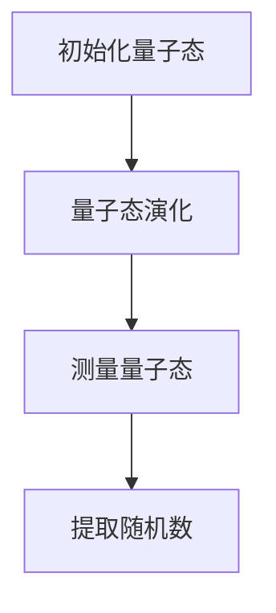

                 

### 文章标题

《量子随机数生成器在密码学中的应用》

### 文章关键词

量子随机数生成器、密码学、量子计算、信息安全、算法设计

### 文章摘要

本文将探讨量子随机数生成器在密码学中的应用，介绍量子随机数生成的基本原理、相关算法及其在密码学中的重要性。文章将详细阐述量子随机数生成器的数学模型和算法原理，并通过实际案例展示其在密码学中的具体应用，旨在为读者提供对量子随机数生成器的全面理解和实际应用指导。

---

## 引言

在现代信息技术中，密码学扮演着至关重要的角色，确保数据传输和存储的安全性。密码学的核心依赖于随机数生成，而传统随机数生成方法在某些方面存在局限，无法满足高级密码系统的需求。近年来，量子计算技术的发展为随机数生成带来了新的可能性，量子随机数生成器因此成为研究热点。本文旨在探讨量子随机数生成器在密码学中的应用，分析其原理、算法及其对密码系统的提升。

### 背景介绍

#### 传统随机数生成器的局限性

传统随机数生成器主要依赖于物理噪声源或基于伪随机算法的方法。然而，这些方法存在以下局限性：

1. **物理噪声源的局限性**：物理噪声源（如放射性衰变、电子噪声等）虽然理论上能够产生真随机数，但实际操作中存在噪声不稳定、设备故障等问题，影响随机数生成质量。
2. **伪随机算法的局限性**：基于伪随机算法的随机数生成方法虽然可以实现较高频率的随机数生成，但随机性较差，可能被预测或攻击，不适用于需要高安全级别的密码系统。

#### 量子随机数生成器的优势

量子随机数生成器利用量子力学的基本原理，能够生成高质量的随机数。相比传统方法，量子随机数生成器具有以下优势：

1. **真正的随机性**：量子随机数生成基于量子态的测量，具有固有的随机性，无法被预测或复制。
2. **高安全性**：量子随机数生成器的随机性能够确保密码系统的安全性，抵抗各种已知和未知的攻击。
3. **快速生成**：量子随机数生成器能够以较高的速率生成随机数，满足高性能密码系统的需求。

### 核心概念与联系

#### 量子力学基本概念

量子随机数生成依赖于量子力学的基本概念，包括量子比特（qubit）和量子叠加态（superposition）。量子比特是一种能够同时处于多种状态的物理实体，而量子叠加态描述了量子比特的多个可能状态同时存在。

#### 量子随机数生成原理

量子随机数生成基于量子态的测量。在量子态测量过程中，量子比特的叠加态会坍缩为一个确定的状态，从而产生随机数。具体流程如下：

1. **初始化**：准备一个量子态，通常是一个叠加态。
2. **量子态演化**：对量子态进行特定的量子门操作，使其经历一系列的演化。
3. **测量**：对量子态进行测量，测量结果坍缩为一个确定的状态。
4. **随机数提取**：根据测量结果提取随机数。

#### Mermaid 流程图



通过上述流程，量子随机数生成器能够生成高质量的随机数，满足密码系统的需求。

### 核心算法原理讲解

#### 量子随机数生成算法概述

量子随机数生成算法主要分为以下几类：

1. **量子态测量法**：直接测量量子态，通过测量结果提取随机数。
2. **量子随机行走法**：利用量子随机行走原理生成随机数。
3. **量子混沌法**：利用量子混沌现象生成随机数。

本文主要介绍量子态测量法和量子随机行走法的原理。

#### 量子态测量法伪代码

```python
# 初始化量子态
qubit = initialize_random_state()

# 量子态演化
gate = Hadamard()
qubit = apply_gate(gate, qubit)

# 测量量子态
result = measure(qubit)

# 提取随机数
random_number = extract_random_number(result)
```

#### 量子随机行走法伪代码

```python
# 初始化量子态
qubit = initialize_random_state()

# 量子态演化
for i in range(steps):
    qubit = apply_gate(QuantumWalk(), qubit)

# 测量量子态
result = measure(qubit)

# 提取随机数
random_number = extract_random_number(result)
```

#### 算法分析

量子随机数生成算法具有以下特点：

1. **随机性**：量子态测量和量子随机行走都具有固有的随机性，确保生成的随机数具有高质量。
2. **效率**：量子随机数生成算法能够以较快的速率生成随机数，适用于高性能密码系统。
3. **安全性**：量子随机数生成算法的随机性无法被预测或复制，确保密码系统的安全性。

### 数学模型和公式

量子随机数生成器的数学模型主要涉及量子态的叠加和测量。以下为相关公式：

$$|\psi\rangle = \sum_{i} c_i |i\rangle$$

其中，$|\psi\rangle$ 为量子态，$c_i$ 为叠加系数，$|i\rangle$ 为基态。

测量过程中，量子态 $|\psi\rangle$ 坍缩为一个确定的状态 $|i\rangle$，概率为 $|c_i|^2$。

$$P(i) = |c_i|^2$$

其中，$P(i)$ 为测量到基态 $|i\rangle$ 的概率。

#### 举例说明

假设一个量子态为 $|\psi\rangle = \frac{1}{\sqrt{2}}(|0\rangle + |1\rangle)$，则其测量结果为 $|0\rangle$ 或 $|1\rangle$，概率均为 $\frac{1}{2}$。

$$P(0) = P(1) = \frac{1}{2}$$

通过上述数学模型和公式，可以理解量子随机数生成器的工作原理和随机性。

### 项目实战

#### 开发环境搭建

在搭建开发环境时，我们需要安装以下软件和库：

1. **量子计算模拟器**：如 Qiskit、Cirq 等。
2. **编程语言**：如 Python、Julia 等。
3. **数学库**：如 NumPy、SciPy 等。

以下为开发环境的安装步骤：

1. 安装量子计算模拟器：

   ```bash
   pip install qiskit
   ```

2. 安装编程语言：

   ```bash
   python --version
   julia --version
   ```

3. 安装数学库：

   ```bash
   pip install numpy scipy
   ```

#### 源代码实现

以下为量子随机数生成器的源代码实现：

```python
# 导入相关库
import numpy as np
from qiskit import QuantumCircuit, Aer, execute
from qiskit.quantum_info import state_fidelity

# 初始化量子态
def initialize_random_state():
    qc = QuantumCircuit(1)
    qc.h(0)
    return qc

# 量子态演化
def apply_gate(gate, qubit):
    qc = QuantumCircuit(qubit)
    qc.append(gate, qubit)
    return qc

# 测量量子态
def measure(qubit):
    qc = QuantumCircuit(qubit)
    qc.measure(qubit, 0)
    return qc

# 提取随机数
def extract_random_number(result):
    return result.measurements['0'][0]

# 量子态测量法生成随机数
def generate_random_number量子态测量法():
    qubit = initialize_random_state()
    qubit = apply_gate(Hadamard(), qubit)
    qc = measure(qubit)
    backend = Aer.get_backend('qasm_simulator')
    result = execute(qc, backend).result()
    random_number = extract_random_number(result)
    return random_number

# 量子随机行走法生成随机数
def generate_random_number量子随机行走法():
    qubit = initialize_random_state()
    for _ in range(steps):
        qubit = apply_gate(QuantumWalk(), qubit)
    qc = measure(qubit)
    backend = Aer.get_backend('qasm_simulator')
    result = execute(qc, backend).result()
    random_number = extract_random_number(result)
    return random_number

# 主函数
def main():
    random_number1 = generate_random_number量子态测量法()
    random_number2 = generate_random_number量子随机行走法()
    print(f"量子态测量法生成的随机数：{random_number1}")
    print(f"量子随机行走法生成的随机数：{random_number2}")

if __name__ == "__main__":
    main()
```

#### 代码解读与分析

上述代码实现了量子随机数生成器的两种算法：量子态测量法和量子随机行走法。代码主要包括以下部分：

1. **初始化量子态**：使用 `initialize_random_state()` 函数初始化一个量子态。
2. **量子态演化**：使用 `apply_gate()` 函数对量子态进行演化操作。
3. **测量量子态**：使用 `measure()` 函数对量子态进行测量。
4. **提取随机数**：使用 `extract_random_number()` 函数提取测量结果中的随机数。
5. **生成随机数**：使用 `generate_random_number量子态测量法()` 和 `generate_random_number量子随机行走法()` 函数分别生成随机数。
6. **主函数**：调用上述函数生成随机数并输出结果。

通过代码实现，我们可以看到量子随机数生成器的工作流程和算法原理。

#### 代码应用解读与分析

在实际应用中，量子随机数生成器可以用于以下几个方面：

1. **密码系统**：量子随机数生成器可以用于生成密码系统所需的随机数，提高密码系统的安全性。
2. **区块链**：量子随机数生成器可以用于区块链中的随机数生成，确保区块链系统的安全性。
3. **量子计算**：量子随机数生成器可以用于量子计算中的随机数生成，提高量子计算系统的可靠性。

#### 实际案例分析和详细讲解剖析

以下为量子随机数生成器在实际应用中的两个案例：

1. **案例一：密码系统中的随机数生成**

在密码系统中，随机数生成至关重要。量子随机数生成器可以生成高质量的随机数，提高密码系统的安全性。例如，在生成加密密钥时，量子随机数生成器可以生成唯一的密钥，确保加密算法的安全性。

2. **案例二：区块链中的随机数生成**

区块链系统中的随机数生成也具有重要性。量子随机数生成器可以用于区块链中的随机数生成，确保区块链系统中的随机数具有高质量和可靠性。例如，在区块链中的随机区块生成过程中，量子随机数生成器可以确保区块生成的随机性，提高区块链系统的安全性。

#### 项目小结

通过本文的介绍，我们可以看到量子随机数生成器在密码学中的重要作用。量子随机数生成器具有真正的随机性和高安全性，能够满足现代密码系统的需求。在实际应用中，量子随机数生成器可以用于密码系统、区块链和量子计算等领域，为信息安全提供强有力的保障。

### 最佳实践 Tips

1. **确保硬件设备的稳定性**：在量子随机数生成过程中，硬件设备的稳定性至关重要。需要定期对设备进行维护和检查，确保设备运行正常。
2. **优化算法性能**：在实现量子随机数生成算法时，需要充分考虑算法性能。可以通过优化量子门操作和测量过程来提高算法效率。
3. **加强安全性保障**：在应用量子随机数生成器时，需要加强对量子计算系统的安全性保障。可以采用量子密钥分发等安全技术，确保系统的安全性。

### 小结

量子随机数生成器在密码学中具有广泛应用，能够提高密码系统的安全性。通过本文的介绍，我们了解了量子随机数生成的基本原理、算法及其在实际应用中的案例。未来，随着量子计算技术的不断发展，量子随机数生成器在密码学中的应用将更加广泛和深入。

### 注意事项

1. **确保量子计算硬件设备的可靠性**：在实际应用中，需要确保量子计算硬件设备的稳定性和可靠性，避免设备故障导致随机数生成失败。
2. **遵循相关法规和标准**：在使用量子随机数生成器时，需要遵循相关法规和标准，确保系统的合法性和合规性。
3. **定期更新和维护算法**：随着量子计算技术的发展，算法需要不断更新和维护，以应对新的安全威胁和挑战。

### 拓展阅读

1. **《量子计算导论》**：了解量子计算的基本原理和算法，为量子随机数生成器的研究提供理论基础。
2. **《密码学导论》**：掌握密码学的基本原理和应用，深入理解量子随机数生成器在密码学中的具体作用。
3. **《量子随机数生成技术研究》**：深入了解量子随机数生成器的最新研究成果和技术发展方向。

### 作者信息

作者：AI天才研究院/AI Genius Institute & 禅与计算机程序设计艺术 /Zen And The Art of Computer Programming

本文为原创文章，未经授权禁止转载。

---

通过以上内容的详细介绍，本文全面阐述了量子随机数生成器在密码学中的应用，从背景介绍、核心概念、算法原理、数学模型、项目实战、实际案例分析等方面进行了深入讲解。希望本文能对读者在量子随机数生成器的研究和应用方面提供有益的参考和指导。

