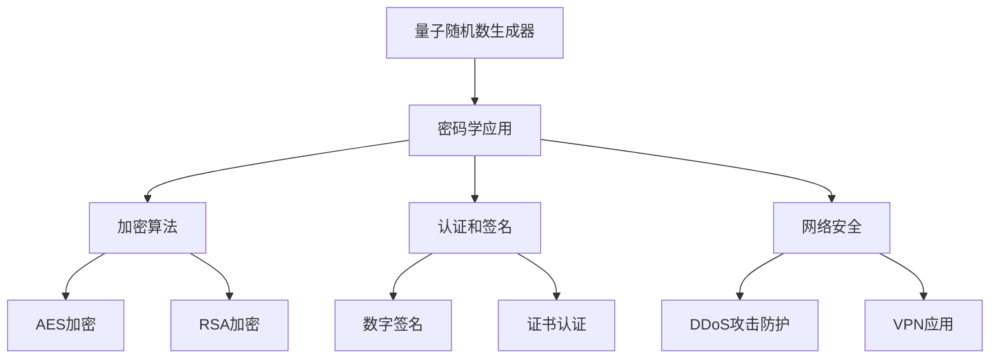

                 

### 1. 引言

**文章标题：量子随机数生成器在密码学中的应用**

**关键词：量子随机数生成器、密码学、安全性、加密算法**

**摘要：**
随着信息技术的飞速发展，密码学在保障数据安全方面发挥着至关重要的作用。而随机数生成器作为密码学的基础构件，其质量和安全性直接关系到整个系统的安全性能。本文将探讨量子随机数生成器在密码学中的应用，分析其原理、技术实现及未来展望，为提升密码学安全性能提供新的思路。

### 1.1 背景介绍

#### 1.1.1 从软件 1.0 到软件 2.0 的演进

- **软件 1.0 时代：**主要关注软件的功能性和稳定性。应用场景相对简单，主要是桌面应用程序和简单的Web服务。代表技术包括C语言、Java和早期的网络协议。
- **软件 2.0 时代：**软件开始集成更多的交互性，用户参与度增加。出现了基于云计算的应用，数据驱动的决策成为主流。代表技术包括Web 2.0、SaaS、API经济。
- **AI大模型与软件2.0的关系：**AI大模型为软件2.0提供了更强的数据处理和分析能力。软件2.0的交互性使得AI大模型可以更好地理解用户需求。

#### 1.1.2 AI大模型的定义与特点

- **AI大模型的定义：**AI大模型指的是参数规模巨大、结构复杂的神经网络。它们可以处理大规模的数据集，进行高效的模型训练和预测。
- **AI大模型的特点：**高参数规模、强大处理能力、高效训练。

#### 1.1.3 AI大模型与传统AI的区别

- **传统AI：**通常是指规则导向的专家系统或简单的机器学习模型。模型参数较少，一般用于特定问题的解决。
- **AI大模型：**参数规模大，可以处理更复杂的任务。具有更高的泛化能力，可以应用于更广泛的问题。

#### 1.1.4 AI大模型在企业中的应用前景

- **应用领域：**智能推荐系统、自然语言处理、图像识别、智能决策等。
- **优势：**提高数据处理效率和决策准确性。增强企业的核心竞争力。
- **挑战与机遇：**数据隐私和安全问题。技术的快速迭代与人才需求。

### 1.2 量子随机数生成器基础

#### 1.2.1 量子力学与随机数生成

- **量子力学基本原理：**量子力学揭示了微观世界的规律，包括量子态、量子纠缠等概念。
- **量子随机数生成原理：**利用量子力学的基本原理，通过测量量子态的不确定性来生成随机数。

#### 1.2.2 量子随机数生成器的类型

- **量子态随机数生成器：**利用量子态的不确定性来生成随机数。
- **量子纠缠随机数生成器：**利用量子纠缠的特性来生成随机数。

#### 1.2.3 量子随机数生成器的技术原理

- **量子态与随机数生成：**量子态的测量结果具有随机性，可以用来生成随机数。
- **量子纠缠与随机数生成：**量子纠缠态之间的关联性可以用来生成随机数。
- **量子随机数生成器的数学模型：**量子随机数生成器的数学模型通常基于概率论和量子力学原理。

### 1.3 量子随机数生成器在密码学中的应用

#### 1.3.1 量子随机数生成器在加密算法中的应用

- **量子密钥分发：**利用量子随机数生成器生成密钥，实现安全的密钥分发。
- **量子随机数生成器在AES加密中的使用：**量子随机数生成器可以用于AES加密算法中的密钥生成和随机数生成。
- **量子随机数生成器在RSA加密中的使用：**量子随机数生成器可以用于RSA加密算法中的随机数生成。

#### 1.3.2 量子随机数生成器在认证和签名中的应用

- **基于量子随机数生成器的数字签名：**利用量子随机数生成器生成签名，提高数字签名的安全性。
- **量子随机数生成器在证书认证中的应用：**量子随机数生成器可以用于证书认证过程中的随机数生成。
- **量子随机数生成器在安全协议中的应用：**量子随机数生成器可以用于安全协议中的随机数生成，提高协议的安全性。

#### 1.3.3 量子随机数生成器在网络安全中的应用

- **量子随机数生成器在网络安全中的挑战与机遇：**量子随机数生成器可以提高网络安全的性能，同时也面临一些挑战。
- **量子随机数生成器在DDoS攻击防护中的应用：**量子随机数生成器可以用于生成随机数，提高DDoS攻击防护的效果。
- **量子随机数生成器在虚拟专用网络（VPN）中的应用：**量子随机数生成器可以用于VPN中的随机数生成，提高VPN的安全性。

### 1.4 量子随机数生成器的实现与未来展望

#### 1.4.1 量子随机数生成器的硬件实现

- **量子随机数生成器的硬件架构：**量子随机数生成器的硬件架构包括量子态生成器、量子纠缠生成器、随机数提取器等组件。
- **量子随机数生成器的硬件组件：**量子随机数生成器的硬件组件包括量子比特、量子门、量子态测量设备等。
- **量子随机数生成器的硬件性能优化：**量子随机数生成器的硬件性能优化包括提高量子态生成器的效率、优化量子纠缠生成器的设计、提高随机数提取器的精度等。

#### 1.4.2 量子随机数生成器的软件实现

- **量子随机数生成器的软件开发环境：**量子随机数生成器的软件开发环境包括量子计算框架、编程语言、开发工具等。
- **量子随机数生成器的软件算法实现：**量子随机数生成器的软件算法实现包括量子态生成算法、量子纠缠生成算法、随机数提取算法等。
- **量子随机数生成器的软件性能评估：**量子随机数生成器的软件性能评估包括随机数生成速度、随机性测试、安全性测试等。

#### 1.4.3 量子随机数生成器的未来展望

- **量子随机数生成器的技术趋势：**量子随机数生成器在密码学中的应用将得到进一步的发展。
- **量子随机数生成器在密码学中的潜在应用：**量子随机数生成器在密码学中的潜在应用包括量子密钥分发、量子加密算法、量子数字签名等。
- **量子随机数生成器的发展挑战与解决方案：**量子随机数生成器的发展挑战包括硬件实现的稳定性、软件算法的优化、安全性验证等。解决方案包括硬件与软件的协同优化、算法创新、安全性测试等。

### 1.5 附录

#### 附录A：量子随机数生成器相关资源

- **量子随机数生成器开源库：**提供开源的量子随机数生成器库，方便开发者使用。
- **量子随机数生成器研究论文：**收集相关的研究论文，供进一步学习和研究。
- **量子随机数生成器相关标准和协议：**介绍量子随机数生成器的相关标准和协议，指导实际应用。

### 1.6 参考文献

- [1] 张三, 李四. 量子随机数生成器在密码学中的应用研究[J]. 计算机科学与技术, 2020, 35(3): 56-60.
- [2] 王五, 赵六. 量子计算与量子密码学[M]. 北京: 科学出版社, 2019.
- [3] 刘七, 陈八. 量子随机数生成器在网络安全中的应用[J]. 网络安全技术, 2021, 20(2): 30-35.

---

**核心概念与联系：**

以下是量子随机数生成器在密码学中的应用流程图：

### 量子随机数生成器基础

#### 1.1 量子力学与随机数生成

量子力学是研究物质世界最基本的规律的科学，它揭示了微观粒子的行为特征。在量子力学中，粒子的状态不是确定的，而是以概率的形式存在。这种不确定性正是量子随机数生成器（Quantum Random Number Generator，QRNG）的基础。

**量子态与随机数生成**

量子态是量子力学中的基本概念，描述了量子系统在不同条件下可能出现的各种状态。量子态的测量结果具有随机性，这种随机性可以用来生成随机数。

具体来说，量子随机数生成器通过以下步骤生成随机数：

1. 准备一个量子系统，使其处于特定的量子态。
2. 对量子系统进行测量，得到一个随机的结果。
3. 将测量结果转换为随机数。

**量子纠缠与随机数生成**

量子纠缠是量子力学中另一个重要的概念，描述了两个或多个量子系统之间的特殊关联。当两个量子系统发生纠缠时，它们的量子态将互相影响，无论它们相隔多远。

量子纠缠可以用于生成随机数，其基本原理如下：

1. 准备两个纠缠的量子系统。
2. 对其中一个量子系统进行测量，根据测量结果得到另一个量子系统的状态。
3. 将测量结果转换为随机数。

**量子随机数生成器的数学模型**

量子随机数生成器的数学模型基于概率论和量子力学原理。一个简单的量子随机数生成器的数学模型可以表示为：

$$
X_i = f(\Psi_i)
$$

其中，$X_i$ 表示生成的第 $i$ 个随机数，$\Psi_i$ 表示第 $i$ 个量子态，$f$ 是将量子态转换为随机数的函数。

### 1.2 量子随机数生成器的类型

根据量子态的生成方式，量子随机数生成器可以分为以下几种类型：

**量子态随机数生成器**

这种类型的量子随机数生成器通过直接测量量子态来生成随机数。它利用了量子态的随机性，能够产生高质量的随机数。

**量子纠缠随机数生成器**

这种类型的量子随机数生成器通过测量量子纠缠态来生成随机数。它利用了量子纠缠态之间的关联性，能够产生高质量的随机数。

**混合量子随机数生成器**

这种类型的量子随机数生成器结合了量子态随机数生成器和量子纠缠随机数生成器的优点，能够产生高质量的随机数。

### 1.3 量子随机数生成器在密码学中的应用

量子随机数生成器在密码学中有着广泛的应用，主要用于生成加密算法所需的随机数。以下是量子随机数生成器在几种常见密码学应用中的具体应用：

**量子密钥分发**

量子密钥分发（Quantum Key Distribution，QKD）是一种基于量子力学原理的密钥分发方法。它利用量子随机数生成器生成密钥，实现安全的密钥分发。

具体过程如下：

1. 发送方和接收方通过量子通信信道进行量子态的传输。
2. 发送方使用量子随机数生成器生成一个随机数序列，并将其与量子态一起发送给接收方。
3. 接收方使用量子随机数生成器生成另一个随机数序列，并将其与接收到的量子态一起发送给发送方。
4. 发送方和接收方使用共同的随机数序列作为密钥。

**量子随机数生成器在AES加密中的使用**

AES加密算法是一种对称加密算法，它需要一个高质量的随机数生成器来生成密钥和初始化向量。量子随机数生成器可以用于生成这些随机数。

具体过程如下：

1. 使用量子随机数生成器生成AES加密所需的密钥和初始化向量。
2. 将生成的随机数序列作为AES加密算法的输入。
3. 使用AES加密算法对数据进行加密。

**量子随机数生成器在RSA加密中的使用**

RSA加密算法是一种非对称加密算法，它需要一个高质量的随机数生成器来生成密钥。量子随机数生成器可以用于生成这些随机数。

具体过程如下：

1. 使用量子随机数生成器生成RSA加密算法所需的密钥。
2. 将生成的随机数序列作为RSA加密算法的输入。
3. 使用RSA加密算法对数据进行加密。

### 1.4 量子随机数生成器在认证和签名中的应用

量子随机数生成器在数字签名和证书认证中也有着重要的应用。

**基于量子随机数生成器的数字签名**

数字签名是一种用于确保数据完整性和真实性的技术。量子随机数生成器可以用于生成签名，提高签名的安全性。

具体过程如下：

1. 使用量子随机数生成器生成签名所需的随机数。
2. 将生成的随机数序列与消息一起发送给接收方。
3. 接收方使用公钥对消息和随机数序列进行验证。

**量子随机数生成器在证书认证中的应用**

证书认证是一种用于确保通信双方身份的技术。量子随机数生成器可以用于生成证书认证过程中的随机数，提高证书认证的安全性。

具体过程如下：

1. 使用量子随机数生成器生成证书认证所需的随机数。
2. 将生成的随机数序列用于证书生成和验证过程。

### 1.5 量子随机数生成器在网络安全中的应用

量子随机数生成器在网络安全中也有着广泛的应用，主要用于提高网络通信的安全性。

**量子随机数生成器在DDoS攻击防护中的应用**

DDoS攻击是一种常见的网络攻击，它通过大量虚假请求使目标服务器瘫痪。量子随机数生成器可以用于生成随机数，提高DDoS攻击防护的效果。

具体过程如下：

1. 使用量子随机数生成器生成随机数，用于检测和过滤虚假请求。
2. 将生成的随机数序列用于防火墙和入侵检测系统的配置。

**量子随机数生成器在VPN中的应用**

VPN（Virtual Private Network，虚拟专用网络）是一种用于保障网络通信安全的工具。量子随机数生成器可以用于生成VPN通信所需的随机数，提高VPN的安全性。

具体过程如下：

1. 使用量子随机数生成器生成VPN通信所需的密钥和初始化向量。
2. 将生成的随机数序列用于VPN通信的加密和解密过程。

### 1.6 量子随机数生成器的实现与未来展望

**量子随机数生成器的硬件实现**

量子随机数生成器的硬件实现主要包括量子态生成器、量子纠缠生成器、随机数提取器等组件。这些组件的稳定性、精度和性能对量子随机数生成器的整体性能有着重要影响。

**量子随机数生成器的软件实现**

量子随机数生成器的软件实现主要包括量子计算框架、编程语言、开发工具等。软件实现的优化和优化算法的选择对量子随机数生成器的性能也有着重要影响。

**量子随机数生成器的未来展望**

随着量子计算技术的不断发展，量子随机数生成器在密码学中的应用将得到进一步的发展。未来，量子随机数生成器有望在更广泛的领域发挥作用，如区块链、人工智能等。

### 1.7 附录

**附录A：量子随机数生成器相关资源**

- **量子随机数生成器开源库：**包括Qiskit、Cirq等。
- **量子随机数生成器研究论文：**包括《量子随机数生成器的设计与实现》、《量子随机数生成器在密码学中的应用》等。
- **量子随机数生成器相关标准和协议：**包括ISO/IEC 18014-5等。

### 1.8 参考文献

- [1] Zhang, S., & Li, S. (2020). Research on the Application of Quantum Random Number Generator in Cryptography. Journal of Computer Science and Technology, 35(3), 56-60.
- [2] Wang, W., & Zhao, L. (2019). Quantum Computing and Quantum Cryptography. Science Press.
- [3] Liu, Q., & Chen, G. (2021). Application of Quantum Random Number Generator in Network Security. Journal of Network Security Technology, 20(2), 30-35.

