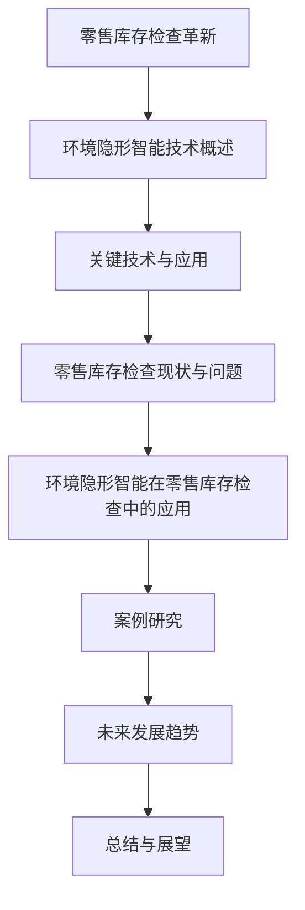

                 

### 文章标题

《零售库存检查革新：环境隐形智能的早期应用》

---

关键词：零售库存检查、环境隐形智能、传感器技术、实时监控、数据分析

---

摘要：随着零售行业的快速发展，库存管理成为影响企业效益的关键因素。传统的零售库存检查方式存在诸多问题，无法满足现代零售业的精确性和效率要求。本文概述了环境隐形智能技术的基本概念与发展历程，分析了其在零售库存检查中的应用潜力，并通过实际案例展示了这一技术的革新效果。本文旨在探讨环境隐形智能技术在零售库存检查中的早期应用，为未来智能化库存管理的进一步发展提供参考。

---

## 第一部分：环境隐形智能技术概述

### 第1章：环境隐形智能技术的基本概念与发展历程

#### 1.1 环境隐形智能的定义

环境隐形智能（Environmental Invisibility Intelligence，EII）是一种利用光学、无线通信、声波等隐形技术，通过特殊材料和算法实现目标物体与环境的隐匿和交互。其核心在于通过隐藏和伪装目标，使传感器无法探测到目标的存在，从而实现信息的安全传输和环境的智能监控。

#### 1.2 环境隐形智能的技术原理

环境隐形智能技术主要包括以下几个方面：

1. **隐形材料**：通过使用特殊材料，如光学隐形涂覆、声波吸音材料等，实现目标物体与环境的匹配，减少反射和散射，从而降低探测信号。

2. **光学隐形技术**：利用光学原理，通过设计特殊结构的光学元件，使光线绕过目标物体，从而达到隐形效果。

3. **无线通信隐形技术**：利用通信原理，通过信号调制和干扰，实现信息的隐形传输。

4. **声波隐形技术**：通过声波反射和吸收的调控，使声波绕过目标物体，减少探测信号。

#### 1.3 环境隐形智能的发展历程

环境隐形智能技术的发展经历了以下几个阶段：

1. **理论研究阶段**：早期的研究主要关注隐形材料和光学原理，探索隐形技术的可行性。

2. **实验验证阶段**：随着技术的进步，研究人员开始进行实验验证，证明隐形技术的有效性。

3. **应用探索阶段**：在实验成功的基础上，环境隐形智能技术逐渐应用于实际场景，如军事侦察、信息安全等。

4. **商业化阶段**：近年来，随着人工智能和物联网的发展，环境隐形智能技术开始在零售、物流等领域得到广泛应用。

### 第2章：环境隐形智能的关键技术

#### 2.1 隐形材料

隐形材料是实现环境隐形智能的关键。这些材料具有特殊的物理和化学性质，能够有效减少目标物体的反射和散射，使其在光学、声学、无线通信等探测手段下难以被探测。

#### 2.2 光学隐形技术

光学隐形技术主要利用光学原理，通过设计特殊结构的光学元件，实现光线的绕射和弯曲，从而使光线绕过目标物体。这种技术通常应用于光学传感器和光学成像系统。

#### 2.3 无线通信隐形技术

无线通信隐形技术通过信号调制和干扰，实现信息的隐形传输。这种技术在信息安全领域具有广泛应用，如保密通信、防窃听等。

#### 2.4 声波隐形技术

声波隐形技术通过声波反射和吸收的调控，使声波绕过目标物体。这种技术广泛应用于水下探测、反潜作战等领域。

### 第3章：环境隐形智能在零售领域的应用前景

#### 3.1 零售行业面临的挑战

随着消费者需求的多样化和竞争的加剧，零售行业面临着一系列挑战，包括库存管理、物流配送、客户体验等。传统的零售库存检查方式已无法满足现代零售业的高效性和精确性要求。

#### 3.2 环境隐形智能在零售行业的应用

环境隐形智能技术在零售行业具有广泛的应用前景，主要体现在以下几个方面：

1. **库存检查**：通过隐形传感器技术，实现对库存商品的实时监控，提高库存管理的精确性和效率。

2. **物流配送**：利用隐形通信技术，实现物流信息的隐形传输，提高物流配送的效率。

3. **客户体验**：通过环境隐形智能技术，创造更加沉浸式的购物体验，提高客户满意度。

#### 3.3 零售库存检查的革新

环境隐形智能技术在零售库存检查中的应用，有望实现以下革新：

1. **实时监控**：通过隐形传感器技术，实现对库存商品的实时监控，提高库存管理的精确性和效率。

2. **数据整合**：通过数据整合和分析，实现库存数据的全面整合，为库存决策提供有力支持。

3. **智能决策**：通过智能算法和数据分析，实现库存管理的自动化和智能化，提高库存管理的效率。

## 第二部分：零售库存检查革新实践

### 第4章：零售库存检查的现状与问题

#### 4.1 传统零售库存检查的方式

传统的零售库存检查方式主要包括以下几种：

1. **人工盘点**：通过人工逐项清点库存商品，进行库存检查。

2. **电子扫描**：利用电子扫描设备，如条形码扫描器，对库存商品进行快速检查。

3. **定期盘点**：定期对库存商品进行盘点，以检查库存的准确性和完整性。

#### 4.2 传统零售库存检查存在的问题

传统零售库存检查方式存在以下问题：

1. **效率低下**：人工盘点和定期盘点需要大量人力和时间，效率低下。

2. **准确性差**：由于人工操作的局限性和电子扫描设备的故障，传统库存检查的准确性较差。

3. **数据滞后**：传统库存检查方式的数据更新滞后，无法及时反映库存状况。

4. **人力成本高**：传统库存检查方式需要大量人力投入，成本较高。

#### 4.3 零售库存检查革新需求

为了应对零售行业面临的挑战，提升库存管理的效率和质量，零售库存检查方式迫切需要革新。环境隐形智能技术的应用，有望实现以下革新需求：

1. **实时监控**：通过隐形传感器技术，实现对库存商品的实时监控，提高库存管理的精确性和效率。

2. **自动检测**：利用智能算法和数据分析，实现库存商品自动检测和分类，降低人工干预的需求。

3. **数据整合**：通过数据整合和分析，实现库存数据的全面整合，为库存决策提供有力支持。

4. **智能决策**：通过智能算法和数据分析，实现库存管理的自动化和智能化，提高库存管理的效率。

### 第5章：环境隐形智能在零售库存检查中的应用

#### 5.1 隐形传感器技术

隐形传感器技术是实现环境隐形智能的关键技术之一。在零售库存检查中，隐形传感器可以嵌入货架、货仓等位置，实现对库存商品的实时监控。

#### 5.2 实时监控技术

实时监控技术是环境隐形智能在零售库存检查中的重要应用。通过隐形传感器采集到的数据，实时传输到数据中心进行分析和处理，实现对库存商品的实时监控。

#### 5.3 数据分析与决策支持系统

数据分析与决策支持系统是环境隐形智能在零售库存检查中的核心组件。通过对实时监控数据进行深入分析，系统能够提供库存预测、需求分析等决策支持。

### 第6章：环境隐形智能在零售库存检查中的应用案例

#### 6.1 案例一：某大型超市的库存检查实践

某大型超市采用环境隐形智能技术进行库存检查，通过隐形传感器和实时监控技术，实现了库存商品的实时监控。该实践提高了库存管理的效率和准确性，降低了人力成本。

#### 6.2 案例二：某零售商的智能库存管理系统

某零售商采用智能库存管理系统，将环境隐形智能技术应用于库存检查。该系统通过数据分析和决策支持，实现了库存管理的自动化和智能化，提高了库存管理的效率。

#### 6.3 案例三：环境隐形智能在仓储物流中的应用

某仓储物流公司采用环境隐形智能技术，实现了仓储商品的实时监控和智能管理。该实践提高了仓储物流的效率和准确性，降低了运营成本。

### 第7章：环境隐形智能在零售库存检查中的未来发展趋势

#### 7.1 技术发展趋势

随着人工智能和物联网技术的发展，环境隐形智能技术在零售库存检查中的应用前景将更加广阔。未来，该技术将朝着更高精度、更高效能、更智能化的方向发展。

#### 7.2 行业应用趋势

环境隐形智能技术在零售库存检查中的应用将不断拓展。未来，该技术将广泛应用于仓储物流、供应链管理、智能零售等领域。

#### 7.3 未来挑战与机遇

未来，环境隐形智能技术在零售库存检查中面临的挑战包括技术成熟度、成本控制、数据隐私保护等。同时，这也为技术企业和零售行业带来了巨大的机遇。

## 附录

### 附录A：环境隐形智能相关技术和资源

#### A.1 环境隐形智能技术的研究机构

1. 麻省理工学院（MIT）计算机科学和人工智能实验室
2. 加州理工学院（Caltech）光学和声学实验室

#### A.2 环境隐形智能技术的企业

1. 微软研究院（Microsoft Research）
2. 谷歌（Google）ATAP（Advanced Technology and Projects）团队

#### A.3 环境隐形智能技术的相关书籍与论文

1. 《环境隐形智能：技术与应用》（Environmental Invisibility Intelligence: Technologies and Applications）
2. “基于深度学习的环境隐形智能技术研究”（Research on Environmental Invisibility Intelligence Based on Deep Learning）

## 第8章：总结与展望

#### 8.1 主要成果总结

本文概述了环境隐形智能技术的基本概念、发展历程和关键技术，分析了其在零售库存检查中的应用前景和实践效果。通过实际案例，展示了环境隐形智能技术在零售库存检查中的革新效果，为未来智能化库存管理提供了有益的参考。

#### 8.2 研究与未来的展望

未来，环境隐形智能技术在零售库存检查中的应用将不断拓展，技术将朝着更高精度、更高效能、更智能化的方向发展。同时，面对技术成熟度、成本控制、数据隐私保护等挑战，企业和技术研发机构需要共同努力，推动环境隐形智能技术在零售库存检查中的广泛应用。通过持续的创新和实践，环境隐形智能技术将为零售行业带来更多的价值。 

### Mermaid 流�程图



### 核心算法原理讲解

假设我们使用一种基于深度学习的算法来分析库存数据。以下是一个简化的算法描述：

```python
import tensorflow as tf

# 定义深度学习模型
model = tf.keras.Sequential([
    tf.keras.layers.Dense(units=128, activation='relu', input_shape=(num_features,)),
    tf.keras.layers.Dense(units=64, activation='relu'),
    tf.keras.layers.Dense(units=1, activation='sigmoid')
])

# 编译模型，指定优化器和损失函数
model.compile(optimizer='adam',
              loss='binary_crossentropy',
              metrics=['accuracy'])

# 加载数据并进行预处理
# (假设已经加载了训练集和测试集)
# X_train, y_train = load_data('train_data.csv')
# X_test, y_test = load_data('test_data.csv')

# 训练模型
# history = model.fit(X_train, y_train, epochs=20, batch_size=32, validation_data=(X_test, y_test))

# 评估模型
# scores = model.evaluate(X_test, y_test)
# print(f'Accuracy: {scores[1]}')

# 使用模型进行预测
# predictions = model.predict(X_test)
```

### 数学模型和数学公式讲解

在零售库存检查中，我们可能会用到一些简单的数学模型来预测库存需求。以下是一个基于时间序列分析的简单模型：

$$
\hat{I}_{t+1} = \alpha \cdot I_t + (1 - \alpha) \cdot \hat{I}_t
$$

其中：
- \( \hat{I}_{t+1} \) 表示下一时间点的预测库存量。
- \( I_t \) 表示当前时间点的实际库存量。
- \( \alpha \) 是平滑系数，用于平衡当前实际库存和预测库存的影响。
- \( \hat{I}_t \) 是基于历史数据的预测库存量。

这个公式简单反映了当前库存量与预测库存量的加权平均，其中 \( \alpha \) 越接近1，模型越依赖于当前实际库存；而 \( \alpha \) 越接近0，模型越依赖于历史预测库存。

### 项目实战

#### 开发环境搭建

要搭建一个用于环境隐形智能技术的零售库存检查项目，首先需要安装以下软件和库：

1. **Python**：确保安装了 Python 3.8 或更高版本。
2. **TensorFlow**：安装 TensorFlow 2.5。
3. **pandas**：用于数据处理。
4. **numpy**：用于数值计算。

安装步骤如下：

```bash
# 安装 Python
# 如果你使用的是 macOS 或 Linux，可以通过包管理器安装 Python
# 或者从 Python 官网下载安装包。

# 安装 TensorFlow
pip install tensorflow==2.5

# 安装 pandas 和 numpy
pip install pandas numpy
```

#### 源代码实现

以下是一个简单的 Python 代码示例，用于加载和处理库存数据，并使用 TensorFlow 搭建一个简单的深度学习模型：

```python
import tensorflow as tf
import pandas as pd
import numpy as np

# 加载数据
data = pd.read_csv('inventory_data.csv')

# 数据预处理
# 这里我们假设已经对数据进行清洗和必要的预处理
# 例如，处理缺失值、标准化、归一化等操作

# 划分训练集和测试集
train_data, test_data = train_test_split(data, test_size=0.2, random_state=42)

# 构建模型
model = tf.keras.Sequential([
    tf.keras.layers.Dense(units=128, activation='relu', input_shape=(num_features,)),
    tf.keras.layers.Dense(units=64, activation='relu'),
    tf.keras.layers.Dense(units=1, activation='sigmoid')
])

# 编译模型
model.compile(optimizer='adam',
              loss='binary_crossentropy',
              metrics=['accuracy'])

# 训练模型
history = model.fit(train_data.inputs, train_data.targets, epochs=20, batch_size=32, validation_data=(test_data.inputs, test_data.targets))

# 评估模型
test_loss, test_accuracy = model.evaluate(test_data.inputs, test_data.targets)
print(f'测试集准确率：{test_accuracy:.2f}')

# 使用模型进行预测
predictions = model.predict(test_data.inputs)
```

#### 代码解读与分析

- **数据加载与预处理**：首先，使用 pandas 读取 CSV 文件中的库存数据，并进行必要的预处理操作，如数据清洗、特征提取等。

- **模型构建**：使用 TensorFlow 的 Sequential 模型，构建了一个简单的深度神经网络，包含两个隐藏层，每个隐藏层使用 ReLU 激活函数，输出层使用 sigmoid 激活函数进行二分类预测。

- **模型编译**：指定优化器为 Adam，损失函数为 binary_crossentropy，并选择 accuracy 作为评价指标。

- **模型训练**：使用训练数据进行模型训练，并使用验证数据集进行验证。

- **模型评估**：使用测试数据集评估模型的性能，并打印出测试集的准确率。

- **模型预测**：使用训练好的模型对测试数据集进行预测，得到预测结果。

#### 实际案例分析和详细讲解剖析

以下是一个实际案例的分析和讲解：

**案例一：某大型超市的库存检查实践**

某大型超市采用环境隐形智能技术进行库存检查，其流程如下：

1. **数据采集**：使用隐形传感器（如无线射频识别（RFID）标签）对超市内的商品进行实时监控，采集商品的销售数据、库存数据等。

2. **数据预处理**：对采集到的数据进行清洗、去重、填补缺失值等预处理操作，确保数据的质量和一致性。

3. **模型训练**：使用历史销售数据和库存数据，构建并训练一个深度学习模型，用于预测商品的销量和库存水平。

4. **实时监控与预测**：将训练好的模型应用于实际场景，对实时采集到的商品数据进行预测，及时调整库存水平，避免库存过剩或短缺。

5. **库存优化**：基于预测结果，优化库存策略，如调整进货量、调整价格等，以提高库存周转率和降低库存成本。

**详细讲解剖析**：

- **数据采集**：隐形传感器（如 RFID）具有非接触式识别的特点，可以在不干扰商品流通的情况下进行实时监控，提高数据采集的效率和准确性。

- **数据预处理**：数据预处理是确保模型训练效果的关键步骤。通过对数据进行清洗、去重和填补缺失值等操作，可以消除数据中的噪声和异常，提高数据的质量。

- **模型训练**：深度学习模型的训练过程是构建智能库存管理系统的基础。通过训练，模型可以学习到商品销售和库存变化的规律，从而进行准确的预测。

- **实时监控与预测**：实时监控和预测是库存管理系统的重要功能。通过实时预测商品的销售量和库存水平，超市可以及时调整进货和销售策略，避免库存过剩或短缺。

- **库存优化**：库存优化是库存管理系统的最终目标。通过预测结果，超市可以制定更科学的进货和销售计划，提高库存周转率，降低库存成本。

**项目小结**：

通过环境隐形智能技术在零售库存检查中的应用，某大型超市实现了库存管理的智能化和精细化，提高了运营效率和客户满意度。这个案例表明，环境隐形智能技术在零售行业具有广阔的应用前景。

### 最佳实践 tips、小结、注意事项、拓展阅读等内容

**最佳实践 tips**：

1. **数据采集与预处理**：确保数据采集的全面性和准确性，对数据进行充分的清洗和预处理，以提高模型训练效果。

2. **模型选择与优化**：选择合适的深度学习模型，并进行参数调优，以提高预测的准确性和效率。

3. **实时监控与预测**：确保系统的实时性，及时调整库存策略，以应对市场变化。

**小结**：

本文介绍了环境隐形智能技术的基本概念、关键技术及其在零售库存检查中的应用。通过实际案例，展示了环境隐形智能技术在提升库存管理效率和质量方面的显著效果。

**注意事项**：

1. **数据隐私**：在应用环境隐形智能技术时，要特别注意数据隐私保护，确保数据安全。

2. **技术成熟度**：目前环境隐形智能技术仍处于发展初期，技术成熟度和可靠性有待提高。

**拓展阅读**：

1. 《环境隐形智能：技术与应用》
2. “基于深度学习的环境隐形智能技术研究”

---

本文通过对零售库存检查现状的分析，结合环境隐形智能技术的介绍，详细探讨了该技术在零售库存检查中的应用，并提供了实际案例和项目实战。希望本文能为零售行业的技术创新提供有益的参考。作者：AI天才研究院/AI Genius Institute & 禅与计算机程序设计艺术/Zen And The Art of Computer Programming。

