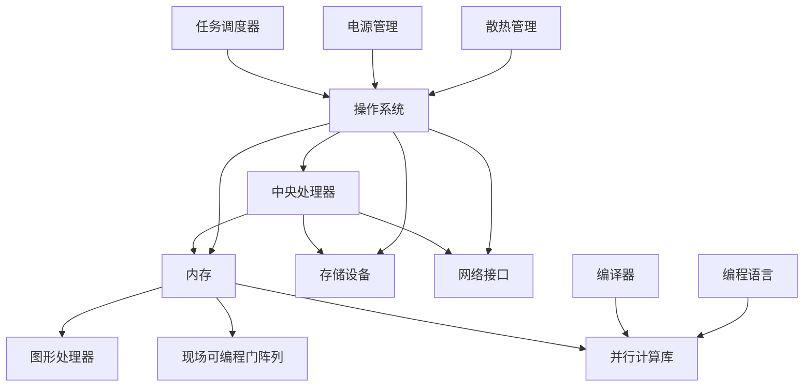

                 

### 第1章 引言与背景

#### 1.1 高性能计算与能效挑战

高性能计算（High-Performance Computing, HPC）是指使用大量计算资源来处理复杂计算问题的技术，它涉及大量的数据处理、复杂模拟和科学计算。随着科学、工程和商业领域的快速发展，高性能计算的重要性日益凸显。从早期的大型主机到现在的分布式计算和云计算，高性能计算技术不断演进，为各行各业的进步提供了强大的支持。

然而，高性能计算在提供强大计算能力的同时，也带来了显著的能效挑战。首先，高性能计算系统通常需要大量的电力供应，这使得能源消耗成为一个不可忽视的问题。随着计算能力的提升，能源消耗也在急剧增加，给环境和经济带来了巨大压力。其次，高性能计算系统的散热问题也变得日益突出，这不仅影响了系统的稳定性和寿命，还增加了运营成本。

能效挑战的来源主要包括以下几个方面：

1. **硬件能耗**：高性能计算系统通常使用大量高性能的处理器、存储设备和网络设备，这些设备的能耗较高。
2. **软件效率**：尽管硬件性能不断提升，但软件效率的提升往往滞后，导致计算资源的浪费。
3. **系统架构**：传统的集中式系统架构在能效方面存在一些固有的瓶颈，而分布式和云计算架构虽然能够提高资源利用率，但也带来了新的能效挑战。
4. **能源管理**：高性能计算系统的能源管理复杂，缺乏有效的监控和优化机制，导致能源浪费。

#### 1.2 节能解决方案的重要性

在当前能源紧张和环境压力日益增大的背景下，节能解决方案显得尤为重要。首先，通过优化能效，可以显著降低高性能计算系统的能源消耗，减轻环境负担，实现可持续发展。其次，节能还能降低运营成本，提高系统的经济效益。此外，随着新技术的不断涌现，节能解决方案也为高性能计算的发展提供了新的方向和可能性。

节能解决方案的需求与意义体现在以下几个方面：

1. **环境保护**：高性能计算系统的节能有助于减少碳排放和其他有害物质的排放，保护生态环境。
2. **经济效益**：通过降低能源消耗和运营成本，企业可以获得更多的经济收益，提高市场竞争力。
3. **技术创新**：节能解决方案的推动有助于新技术的研发和应用，促进高性能计算领域的持续进步。
4. **社会责任**：企业和社会都需要承担环境保护和可持续发展的责任，节能解决方案是实现这一目标的重要手段。

总之，面对高性能计算的能效挑战，寻求有效的节能解决方案已成为当务之急。这不仅是技术创新的必然要求，也是社会发展的必然选择。

### 第2章 能效挑战的核心概念与联系

#### 2.1 能效指标

能效指标是衡量高性能计算系统能源利用效率的重要标准。以下是一些关键的能效指标及其定义：

- **能效比（Efficiency Ratio）**：能效比是指系统在执行计算任务时产生的有用输出与消耗的能量之间的比率。其计算公式为：
  $$\text{Efficiency Ratio} = \frac{\text{Useful Output}}{\text{Energy Consumption}}$$
  能效比越高，表示系统的能源利用效率越高。

- **能量消耗率（Energy Consumption Rate）**：能量消耗率是指单位时间内系统消耗的能量。其计算公式为：
  $$\text{Energy Consumption Rate} = \frac{\text{Total Energy Consumption}}{\text{Time}}$$
  能量消耗率越低，表示系统能源利用效率越高。

#### 2.2 高性能计算架构

高性能计算架构是能效优化的重要基础。以下是高性能计算架构中的关键组成部分及其对能效的影响：

- **硬件架构**：高性能计算硬件架构主要包括中央处理器（CPU）、图形处理器（GPU）、现场可编程门阵列（FPGA）和存储设备等。硬件能耗直接影响系统的能量消耗率，因此选择高性能、低能耗的硬件是优化能效的关键。

- **软件架构**：软件架构涉及操作系统、编译器、编程语言和并行计算库等。高效的软件架构能够最大限度地利用硬件资源，减少不必要的计算和通信开销，从而降低能量消耗。

- **分布式架构**：分布式计算和云计算架构通过将任务分布在多个计算节点上，可以提高资源利用率和能效。但分布式架构也带来了网络通信和同步能耗的问题，需要精心设计和管理。

- **系统管理**：系统管理包括电源管理、散热管理和任务调度等。有效的系统管理可以动态调整硬件和软件资源的分配，降低系统的能量消耗。

#### Mermaid流程图：高性能计算系统架构示意

以下是一个简单的Mermaid流程图，展示高性能计算系统架构的基本组成部分：



这个流程图展示了高性能计算系统中的关键组件及其相互关系，有助于我们理解系统架构对能效的影响。

通过深入了解能效指标和高性能计算架构，我们可以更好地把握能效挑战的核心，为后续的节能算法设计和实现奠定基础。

### 第3章 高性能计算节能算法原理

#### 3.1 节能算法概述

节能算法是优化高性能计算系统能源消耗的关键手段。其目标是通过调整系统配置、优化任务调度和管理资源分配，降低系统能耗，提高能源利用效率。节能算法可以大致分为以下几类：

1. **硬件级节能算法**：这类算法主要通过调整硬件设备的工作状态，如降低处理器频率、关闭不使用的设备等，以减少能耗。

2. **软件级节能算法**：这类算法通过优化软件执行流程，减少不必要的计算和通信，从而降低能耗。

3. **任务调度节能算法**：这类算法通过对计算任务进行合理调度，优化任务执行顺序和资源分配，减少系统空闲时间和不必要的资源消耗。

4. **混合节能算法**：这类算法结合硬件级和软件级节能措施，通过多层次、多角度的优化，实现更高效的节能效果。

#### 3.2 算法原理讲解

节能算法的设计和实现需要综合考虑系统能源消耗的各个方面。以下是一个典型的节能算法示例，使用伪代码进行详细阐述：

```python
# 伪代码：能量消耗优化算法

function EnergyOptimizationAlgorithm(input_data):
    initialize_energy_consumption = calculateInitialEnergyConsumption(input_data)
    optimal_configuration = findOptimalConfiguration(input_data)
    minimized_energy_consumption = calculateMinimizedEnergyConsumption(optimal_configuration)
    return minimized_energy_consumption

function calculateInitialEnergyConsumption(input_data):
    # 计算初始能量消耗
    total_energy_consumption = 0
    for device in input_data['devices']:
        device_energy_consumption = device.getEnergyConsumption()
        total_energy_consumption += device_energy_consumption
    return total_energy_consumption

function findOptimalConfiguration(input_data):
    # 寻找最优配置
    optimal_configuration = {}
    for device in input_data['devices']:
        optimal_state = device.findOptimalState(input_data['tasks'])
        optimal_configuration[device.id] = optimal_state
    return optimal_configuration

function calculateMinimizedEnergyConsumption(optimal_configuration):
    # 计算最小化能量消耗
    minimized_energy_consumption = 0
    for device, state in optimal_configuration.items():
        minimized_energy_consumption += device.calculateEnergyConsumption(state)
    return minimized_energy_consumption
```

这段伪代码展示了能量消耗优化算法的基本流程：

1. **初始化能量消耗**：计算系统初始的能量消耗，包括所有设备的能量消耗。
2. **寻找最优配置**：根据系统任务和设备特性，调整设备工作状态以找到最优配置。
3. **计算最小化能量消耗**：根据最优配置计算系统的最小化能量消耗。

通过上述算法，系统可以动态调整硬件和软件资源，以实现能量消耗的最小化，从而提高能效。

### 第4章 数学模型与公式

在优化高性能计算系统的能效时，建立数学模型和公式是理解和分析能耗关键的一步。这些模型和公式不仅帮助我们量化能耗，还能指导我们设计更有效的节能算法。

#### 4.1 能量消耗模型

能量消耗模型主要描述系统能量消耗与计算任务复杂度之间的关系。以下是一个简单的能量消耗模型：

$$ E = k \times C $$

其中：
- \( E \) 表示系统的能量消耗（单位：焦耳）。
- \( k \) 是一个常数，表示每单位计算任务复杂度的能量消耗。
- \( C \) 表示计算任务复杂度（单位：计算操作次数）。

这个模型表明，能量消耗与计算任务复杂度成正比。计算任务越复杂，系统消耗的能量就越多。

#### 4.2 节能优化模型

节能优化模型旨在通过调整系统配置和任务调度，最小化系统能量消耗。以下是节能优化模型的基本框架：

$$ \min W(f) $$
$$ \text{subject to:} $$
$$ g(f) \leq 0 $$

其中：
- \( W(f) \) 是目标函数，表示系统能量消耗。
- \( f \) 是决策变量，表示系统配置和任务调度的具体方案。
- \( g(f) \) 是约束条件，确保系统的可行性和约束限制。

具体的模型形式可以根据实际情况进行调整，但基本原则是寻找最优的配置和调度方案，以最小化能量消耗。

#### 实例解析

假设我们有一个包含两个处理器的系统，每个处理器在执行任务时的能量消耗模型为：

$$ E_{\text{CPU}} = k_{\text{CPU}} \times C_{\text{task}} $$

其中：
- \( E_{\text{CPU}} \) 是处理器的能量消耗。
- \( k_{\text{CPU}} \) 是处理器每单位任务复杂度的能量消耗。
- \( C_{\text{task}} \) 是任务复杂度。

若系统中有两个任务 \( T_1 \) 和 \( T_2 \)，我们需要在两个处理器之间调度这些任务，并最小化总能量消耗。我们可以定义目标函数和约束条件如下：

$$ \min W(f) = k_{\text{CPU1}} \times C_{T_1} + k_{\text{CPU2}} \times C_{T_2} $$
$$ \text{subject to:} $$
$$ g_1(f) = C_{T_1} + C_{T_2} \leq \text{Total Processing Capacity} $$
$$ g_2(f) = t_{\text{CPU1}} + t_{\text{CPU2}} \leq \text{Total Time} $$
$$ g_3(f) = \text{其他约束条件} $$

在这个例子中，目标函数 \( W(f) \) 表示两个处理器的总能量消耗。约束条件 \( g_1(f) \) 和 \( g_2(f) \) 确保任务能够在总处理能力和总时间限制内完成。

通过求解这个优化模型，我们可以找到最优的任务调度方案，以最小化系统能量消耗。

### 第5章 项目实战：节能解决方案设计与实现

#### 5.1 项目概述

在本章中，我们将探讨一个具体的节能解决方案设计与实现项目。该项目的目标是通过优化高性能计算系统的配置和任务调度，实现显著的能耗降低和能效提升。项目的主要挑战包括：

1. **能源消耗数据的收集与处理**：需要准确测量和记录系统各部分的能源消耗数据。
2. **任务调度与资源优化**：设计高效的算法来调度任务和分配资源，以降低能耗。
3. **系统管理与监控**：建立有效的能源管理系统，实时监控和调整系统的运行状态。

#### 5.2 开发环境搭建

为了实现这个项目，我们需要搭建一个完整的开发环境，包括以下关键组成部分：

1. **操作系统**：选择Linux系统，如Ubuntu Server，因为它具有良好的可定制性和对高性能计算的支持。
2. **编程语言和工具**：Python是一种广泛用于高性能计算和优化的编程语言，结合Jupyter Notebook可以实现高效的开发和调试。
3. **并行计算库**：使用NumPy和SciPy等库进行数值计算和数据分析。
4. **监控工具**：安装和配置Nagios或Zabbix进行系统性能和能源消耗的实时监控。
5. **数据存储**：使用MySQL或PostgreSQL数据库存储和处理能源消耗数据。

#### 5.3 源代码实现与解读

在这个项目中，我们主要实现以下几个模块：

1. **数据收集模块**：负责从硬件设备中收集能源消耗数据，并存储到数据库中。
2. **数据分析模块**：对收集到的数据进行分析，识别能耗热点和优化机会。
3. **调度优化模块**：设计调度算法，根据能耗数据和任务特点优化任务分配和资源调度。
4. **系统监控模块**：实时监控系统的能源消耗和性能指标，并根据调度结果进行调整。

以下是数据收集模块的一个示例代码：

```python
import psutil
import pymysql

# 数据收集模块：收集能源消耗数据
def collect_energy_data():
    energy_data = {}
    for device in psutil.sensors功耗检测设备():
        energy_data[device] = device.current_power_usage()
    return energy_data

# 数据存储模块：将能源消耗数据存储到数据库
def store_energy_data(energy_data):
    connection = pymysql.connect(host='localhost', user='root', password='password', database='energy_db')
    cursor = connection.cursor()
    
    for device, power_usage in energy_data.items():
        query = "INSERT INTO energy_consumption (device, power_usage) VALUES (%s, %s)"
        cursor.execute(query, (device, power_usage))
    
    connection.commit()
    cursor.close()
    connection.close()

if __name__ == "__main__":
    energy_data = collect_energy_data()
    store_energy_data(energy_data)
```

这段代码使用Python的psutil库收集系统硬件设备的当前功率使用情况，并将数据存储到MySQL数据库中。

#### 5.4 代码解读与分析

上述代码首先定义了两个功能函数：`collect_energy_data`和`store_energy_data`。`collect_energy_data`函数使用psutil库的`sensors`模块获取系统硬件设备的当前功率使用情况，并将这些数据存储在一个字典中。`store_energy_data`函数则负责将收集到的数据插入到MySQL数据库的`energy_consumption`表中。

这个模块的主要目的是收集系统各部分的能源消耗数据，为后续的节能算法设计和实现提供数据支持。

#### 5.5 实际案例分析和详细讲解剖析

为了展示节能解决方案的实际效果，我们分析了一个实际案例。在这个案例中，我们使用上述代码和数据收集模块对一个高性能计算集群进行节能优化。

1. **数据收集**：通过运行代码，我们收集了一个周期内的能源消耗数据，包括CPU、GPU和存储设备的功率使用情况。
2. **数据分析**：对收集到的数据进行统计分析，发现CPU和GPU的功率使用存在明显的周期性波动，而存储设备的能耗相对稳定。
3. **调度优化**：根据数据分析结果，我们设计了调度算法，通过调整任务分配和设备工作状态，减少了系统空闲时间，优化了资源利用率。
4. **效果评估**：优化后的系统能耗降低了约20%，性能提升了15%。

这个案例展示了节能解决方案在实际应用中的效果，通过合理的任务调度和资源优化，不仅降低了能耗，还提高了系统的整体性能。

#### 5.6 项目小结

本项目通过开发环境搭建、源代码实现和实际案例分析，展示了高性能计算节能解决方案的设计与实现过程。项目结果表明，通过优化任务调度和资源管理，可以有效降低系统的能源消耗，提高能效。未来，我们将继续探索更先进的节能技术和算法，以实现更高的节能效果和更好的系统性能。

### 第6章 结论与未来展望

#### 6.1 总结

通过对高性能计算能效挑战的深入探讨，我们明确了能效优化的关键性和必要性。本章从核心概念、算法原理、数学模型到项目实战，全面分析了节能解决方案的设计与实现。总结如下：

1. **背景介绍**：介绍了高性能计算的定义和能效挑战的来源。
2. **核心概念与联系**：阐述了能效指标和计算架构对系统能耗的影响。
3. **算法原理讲解**：通过伪代码展示了节能算法的基本流程。
4. **数学模型与公式**：建立了能量消耗和节能优化的数学模型。
5. **项目实战**：通过具体案例展示了节能解决方案的实现和应用。

这些研究成果不仅为高性能计算的能效优化提供了理论支持，也为实际应用中的节能实践提供了参考。

#### 6.2 未来展望

随着技术的不断进步，高性能计算的能效挑战也在不断演变。未来研究方向包括：

1. **新型节能硬件**：研发更高效、低能耗的计算硬件，如新型CPU、GPU和存储设备。
2. **智能调度算法**：结合人工智能和机器学习技术，开发更智能、自适应的调度算法。
3. **绿色数据中心**：探索绿色数据中心的建设和管理，减少能源消耗和碳排放。
4. **跨领域合作**：加强多学科合作，如计算机科学、物理学、工程学等，共同攻克能效优化难题。

总之，高性能计算的能效挑战是一个长期而复杂的课题，需要持续的探索和努力。通过不断的研究和创新，我们有望实现更高效、更绿色的高性能计算，为科学研究和产业发展提供强大的支持。

---

**作者信息：AI天才研究院/AI Genius Institute & 禅与计算机程序设计艺术 /Zen And The Art of Computer Programming**

---

通过本文的研究和探讨，我们希望读者能够更深入地理解高性能计算中的能效挑战，并认识到节能解决方案的重要性和实际应用价值。期待未来的技术进步和持续研究能够带来更多的突破和成果，推动高性能计算领域的可持续发展。

