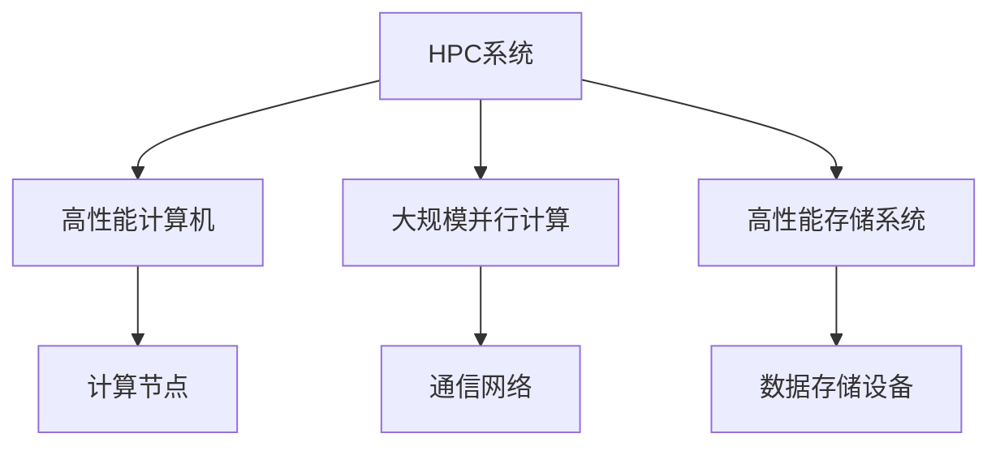
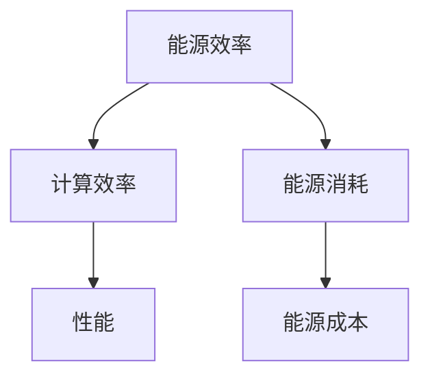
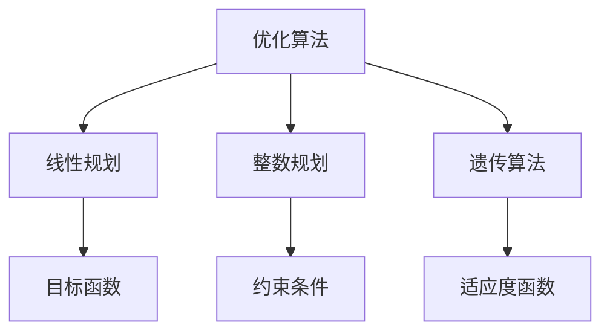

                 

### 引言与背景介绍

高性能计算（High-Performance Computing, HPC）是现代科技领域中不可或缺的一部分。随着科学研究和工业应用对计算能力的需求不断增加，高性能计算的重要性日益凸显。高性能计算不仅在气象预测、生物信息学、金融分析、药物研发等领域发挥着关键作用，还在国防、航空航天、汽车制造等高技术行业中具有重要应用价值。

能源效率优化（Energy Efficiency Optimization）则是高性能计算领域中一个备受关注的问题。在HPC系统中，大量的计算资源和能源消耗是不可避免的，这导致了对能源效率和环保的关注。传统的HPC系统通常存在能源浪费和效率低下的问题，随着能源价格的上涨和环保意识的提高，提高能源效率已成为当务之急。

目前，高性能计算能源效率优化面临着以下几个挑战：

1. **计算密集型任务的需求不断增加**：科学和工业应用对计算速度和数据处理能力的要求不断提升，这导致了HPC系统的规模和复杂度增加，从而加剧了能源消耗问题。
2. **能源成本的压力**：随着全球能源价格波动，特别是化石燃料价格的上涨，高性能计算机构建和维护的成本压力不断增加。
3. **环保法规的约束**：许多国家和地区对企业的能源消耗和碳排放有严格的规定，这迫使高性能计算领域需要采取更加环保的解决方案。
4. **技术发展的限制**：当前的HPC技术和能源管理技术还存在很多瓶颈，难以在短时间内实现显著突破。

本文旨在系统地探讨高性能计算的能源效率优化问题。首先，我们将介绍高性能计算和能源效率优化相关的基本概念，并使用Mermaid流程图展示它们之间的联系。接着，我们将详细讨论高性能计算能源效率优化的原理，使用伪代码和数学模型来阐述核心算法。此外，我们将通过一个实际项目案例，展示如何在具体环境中进行能源效率优化。最后，我们将探讨一些高级话题和前沿研究方向，总结全文并提出未来的研究方向。

通过本文的深入探讨，我们希望读者能够全面理解高性能计算的能源效率优化问题，并掌握相关的技术方法和实践技巧。无论您是高性能计算领域的从业者，还是对该领域有兴趣的科研人员，本文都希望能够为您提供有价值的参考和启示。

### 核心概念与联系

在高性能计算（HPC）和能源效率优化领域，理解几个核心概念以及它们之间的关系至关重要。这些概念包括高性能计算、能源效率、优化算法等。在本节中，我们将分别介绍这些概念，并使用Mermaid流程图展示它们之间的联系。

#### 1. 高性能计算（HPC）

高性能计算是一种旨在通过大量计算资源和高效算法解决复杂问题的计算方法。HPC系统通常包括高性能计算机、大规模并行计算（Parallel Computing）、高性能存储系统等组成部分。HPC的关键特点是高计算速度、高数据吞吐率和强大的数据处理能力。

**Mermaid流程图**：



#### 2. 能源效率

能源效率是指能源系统在提供某种功能或服务时，所消耗的能源与其所能提供的有效能量之比。在HPC系统中，能源效率涉及到计算资源的有效利用和能源消耗的最小化。

**Mermaid流程图**：



#### 3. 优化算法

优化算法是一类用于求解优化问题的算法，其目标是在满足某些约束条件下，找到最优解。在高性能计算能源效率优化中，常见的优化算法包括线性规划、整数规划、遗传算法等。

**Mermaid流程图**：



通过这些流程图，我们可以清晰地看到高性能计算、能源效率和优化算法之间的关系。高性能计算系统通过并行计算和高效算法提供强大的计算能力，而能源效率优化则致力于降低系统在提供计算服务时的能源消耗。优化算法作为实现能源效率优化的重要工具，通过对计算资源和能源消耗的优化，最终提升整个系统的效率。

接下来，我们将详细探讨高性能计算能源效率优化的原理，使用伪代码和数学模型来进一步阐述相关核心算法。

### 高性能计算能源效率优化的原理

高性能计算（HPC）的能源效率优化是一个复杂的系统问题，它涉及到硬件、软件和系统管理等多个层面的优化。为了理解这一优化过程，我们需要从核心算法原理入手。以下内容将详细阐述几种常见的优化算法原理，并通过伪代码展示其步骤和流程。

#### 1. 优化算法分类

在高性能计算能源效率优化中，常见的优化算法包括线性规划（Linear Programming, LP）、整数规划（Integer Programming, IP）和遗传算法（Genetic Algorithm, GA）等。每种算法都有其特定的应用场景和优点。

##### 线性规划（LP）

线性规划是一种用于求解线性目标函数在给定线性约束条件下的最优解的优化方法。它在能源效率优化中用于优化计算资源的使用和能源分配。

**伪代码**：

```
算法：线性规划（LP）

输入：目标函数C，约束条件Ax ≤ b，x为变量
输出：最优解x

步骤：
1. 初始化：设置初始解x0，设定迭代次数t=0
2. while t < 最大迭代次数 do
   1. 对每个变量x，计算梯度∇Cx
   2. 根据梯度信息更新解x：x = x - α∇Cx
   3. 检查约束条件是否满足：如果满足，继续下一次迭代；否则，调整步长α
   4. t = t + 1
3. 输出最优解x
```

##### 整数规划（IP）

整数规划是线性规划的一种扩展，用于求解变量需要取整数值的优化问题。在HPC系统中，IP可以用于优化任务调度和资源分配。

**伪代码**：

```
算法：整数规划（IP）

输入：目标函数C，约束条件Ax ≤ b，x为整数变量
输出：最优解x

步骤：
1. 初始化：设置初始解x0，设定迭代次数t=0
2. while t < 最大迭代次数 do
   1. 对每个变量x，计算梯度∇Cx
   2. 根据梯度信息更新解x：x = x - α∇Cx
   3. 对每个变量x，检查是否需要取整：如果需要，则将x取整
   4. 检查约束条件是否满足：如果满足，继续下一次迭代；否则，调整步长α
   5. t = t + 1
3. 输出最优解x
```

##### 遗传算法（GA）

遗传算法是一种基于自然进化机制的优化算法，通过模拟自然进化过程来寻找最优解。GA在HPC系统中用于动态调度和任务分配。

**伪代码**：

```
算法：遗传算法（GA）

输入：种群P，适应度函数f，交叉率c，变异率m
输出：最优解个体

步骤：
1. 初始化：生成初始种群P，设置迭代次数t=0
2. while t < 最大迭代次数 do
   1. 计算种群P中每个个体的适应度值
   2. 根据适应度值进行选择，选择出最优个体
   3. 进行交叉操作，产生新的子代种群
   4. 对新种群进行变异操作
   5. 计算新种群中每个个体的适应度值
   6. 根据适应度值选择出下一代种群P
   7. t = t + 1
3. 输出最优解个体
```

#### 2. 数学模型

为了更好地理解这些优化算法，我们引入相关的数学模型。在HPC系统中，常见的数学模型包括目标函数和约束条件。

##### 目标函数

目标函数是优化算法的核心，用于衡量系统的性能和能源效率。常见的目标函数包括：

- **最小化能源消耗**：minimize E = ΣEi（i=1到n，Ei为第i个节点的能源消耗）
- **最大化性能**：maximize P = ΣPi（i=1到n，Pi为第i个节点的计算性能）

##### 约束条件

约束条件是优化过程中必须满足的条件，用于限制系统的行为。常见的约束条件包括：

- **计算能力约束**：P ≥ Pmin（Pmin为系统所需的最小计算性能）
- **能源预算约束**：E ≤ Ebudget（Ebudget为系统的能源预算）

##### 数学公式

使用LaTeX格式，我们可以将上述目标函数和约束条件表示为：

```
$$
\begin{aligned}
\text{目标函数:} &\ \minimize \ E = \sum_{i=1}^{n} E_i \\
\text{约束条件:} &\ P \geq P_{\min}, \ E \leq E_{\budget}
\end{aligned}
$$
```

通过以上数学模型和算法原理的讲解，我们可以看到高性能计算能源效率优化是一个多维度、复杂的问题。优化算法和数学模型为我们提供了有效的工具，帮助我们在这个领域中实现能源效率的最优化。

#### 数学模型与数学公式

在探讨高性能计算能源效率优化的过程中，数学模型和数学公式是理解核心算法原理的关键。通过这些模型和公式，我们可以将复杂的实际问题转化为可计算的数学问题，从而利用优化算法找到最优解。以下是几个关键的数学模型及其LaTeX格式的表达和详细讲解。

##### 1. 线性规划模型

线性规划模型（Linear Programming Model, LP）是优化能源效率的常用工具。它的核心是一个线性目标函数和一组线性约束条件。以下是一个简单的线性规划模型，用于最小化能源消耗：

**目标函数**：
$$
\min \ Z = c^T x
$$
其中，$Z$ 是要最小化的目标函数，$c$ 是系数向量，$x$ 是决策变量向量。

**约束条件**：
$$
\begin{cases}
A x \leq b \\
x \geq 0
\end{cases}
$$
其中，$A$ 是约束矩阵，$b$ 是约束向量，$x$ 是决策变量向量。

- **目标函数讲解**：目标函数表示了要优化的目标，例如最小化总能源消耗或最大化性能。$c^T$ 是系数向量的转置，$x$ 是决策变量，每个元素代表系统中的一个可调参数。
- **约束条件讲解**：约束条件定义了系统的限制。$A x \leq b$ 表示每个计算节点或组件的能源消耗不能超过预算，$x \geq 0$ 表示决策变量不能为负。

##### 2. 整数规划模型

整数规划模型（Integer Programming Model, IP）扩展了线性规划模型，用于解决决策变量需要取整数值的问题。以下是一个整数规划模型的例子：

**目标函数**：
$$
\min \ Z = c^T x
$$
**约束条件**：
$$
\begin{cases}
A x \leq b \\
x \in \mathbb{Z}
\end{cases}
$$
其中，$\mathbb{Z}$ 表示整数集。

- **目标函数讲解**：与线性规划相同，目标函数用于最小化总能源消耗或最大化性能。
- **约束条件讲解**：$A x \leq b$ 定义了线性约束，$x \in \mathbb{Z}$ 表示决策变量必须是整数，这在任务调度和资源分配中非常重要。

##### 3. 遗传算法模型

遗传算法（Genetic Algorithm, GA）是一种基于自然进化机制的优化算法，用于解决复杂的优化问题。遗传算法的模型包括种群初始化、选择、交叉、变异等步骤。以下是一个简化的遗传算法模型：

**种群初始化**：
$$
P_0 = \{x_1, x_2, ..., x_n\}
$$
其中，$P_0$ 是初始种群，$x_i$ 是种群中的个体。

**适应度函数**：
$$
f(x_i) = \sum_{j=1}^{m} w_j g_j(x_i)
$$
其中，$f(x_i)$ 是个体$x_i$ 的适应度值，$w_j$ 是权重，$g_j(x_i)$ 是第$j$ 个评估函数。

**选择**：
$$
P_t = \text{select}(P_{t-1})
$$
选择操作用于从当前种群中选择个体组成下一代种群。

**交叉**：
$$
C = \text{ crossover}(P_t)
$$
交叉操作用于创建新的个体。

**变异**：
$$
V = \text{ mutation}(P_t)
$$
变异操作用于增加种群的多样性。

- **种群初始化讲解**：初始种群是通过随机生成或基于某些初始条件生成的，每个个体代表一种可能的解决方案。
- **适应度函数讲解**：适应度函数用于评估个体的优劣，通常结合多个评估函数来综合评价。
- **选择讲解**：选择操作基于适应度值选择个体，优化的个体更有可能被选择。
- **交叉和变异讲解**：交叉操作通过结合两个个体的基因来创建新的个体，变异操作通过随机改变个体的某些基因来增加多样性。

##### 4. 数学公式的详细讲解与举例说明

**例子**：考虑一个简单的线性规划问题，目标是最小化总能源消耗，约束条件是计算节点的能源消耗不超过预算。以下是该问题的数学模型：

**目标函数**：
$$
\min \ Z = 10x_1 + 20x_2
$$
**约束条件**：
$$
\begin{cases}
x_1 + x_2 \leq 50 \\
2x_1 + 3x_2 \leq 100 \\
x_1, x_2 \geq 0
\end{cases}
$$

- **目标函数解释**：目标函数表示总能源消耗，系数10和20分别代表两个节点的能源消耗。
- **约束条件解释**：第一个约束条件表示两个节点的总能源消耗不能超过50单位，第二个约束条件表示两个节点的特定组合的能源消耗不能超过100单位，第三行约束条件表示节点能源消耗必须非负。

通过上述数学模型和公式的讲解，我们可以看到高性能计算能源效率优化是一个多维度的复杂问题，需要结合多种数学工具和算法来求解。这些模型和公式不仅帮助我们更好地理解核心算法，还为实际应用提供了有效的理论基础。

### 项目实战

为了更直观地展示如何在实际环境中进行高性能计算能源效率优化，我们将通过一个实际项目案例进行详细讲解。该项目案例涉及一个大型数据中心，目标是降低其能源消耗并提高计算效率。

#### 1. 项目背景

某大型互联网公司拥有一个大规模数据中心，负责处理大量的用户请求和数据存储。随着业务量的增长，数据中心的能源消耗和运行成本不断上升，同时，环保法规也对企业的能源消耗提出了严格要求。为了应对这些挑战，公司决定对数据中心进行能源效率优化。

#### 2. 实际案例

**案例目标**：降低数据中心的能源消耗，提高计算效率，同时满足环保法规的要求。

**项目步骤**：

**2.1 需求分析**

首先，项目团队对数据中心的当前运行状况进行了详细的需求分析。主要内容包括：
- 数据中心的总能源消耗和各部分的能耗分布。
- 现有的计算资源分配和使用情况。
- 数据中心的性能指标和瓶颈。

通过需求分析，项目团队发现：
- 计算节点的能源消耗较高，尤其是部分老旧设备。
- 资源利用率不高，部分计算节点存在闲置现象。
- 数据传输和存储系统也存在一定的能源浪费。

**2.2 设备升级与优化**

针对需求分析结果，项目团队制定了设备升级和优化的方案：
- 替换老旧的计算节点，引入更高效的硬件设备。
- 对计算资源进行重新分配和调度，优化负载均衡。
- 对数据传输和存储系统进行优化，提高数据访问效率。

**2.3 开发环境搭建**

在实施设备升级和优化方案之前，项目团队搭建了开发环境，包括：
- 安装并配置高性能计算软件和工具。
- 搭建模拟测试平台，用于验证优化方案的效果。

**2.4 源代码实现**

项目团队编写了以下关键部分的源代码：
- **能源消耗监控模块**：用于实时监控计算节点的能源消耗，提供能耗数据。
- **负载均衡调度模块**：用于根据实时能耗数据和计算负载，动态调整计算节点的任务分配。
- **节能策略优化模块**：基于优化算法，对数据中心的整体能源效率进行优化。

**2.5 代码解读**

以下是关键部分的代码解读：

**能源消耗监控模块**

```python
# 能源消耗监控模块伪代码
class EnergyMonitor:
    def __init__(self):
        self能耗数据 = []

    def monitor(self, node_id):
        # 采集node_id节点的能源消耗数据
        energy_consumption = get_energy_consumption(node_id)
        self能耗数据.append(energy_consumption)

    def report(self):
        # 输出能耗报告
        print("节点能耗数据：", self能耗数据)
```

**负载均衡调度模块**

```python
# 负载均衡调度模块伪代码
class LoadBalancer:
    def __init__(self, energy_monitor):
        self.energy_monitor = energy_monitor

    def schedule_tasks(self, tasks, nodes):
        # 根据能耗数据和任务负载，动态分配任务到节点
        for task in tasks:
            min_energy = float('inf')
            best_node = None
            for node in nodes:
                energy_consumption = self.energy_monitor.get_consumption(node)
                if energy_consumption + task.get_energy_requirement() < min_energy:
                    min_energy = energy_consumption + task.get_energy_requirement()
                    best_node = node
            best_node.assign_task(task)
```

**节能策略优化模块**

```python
# 节能策略优化模块伪代码
class EnergyOptimizer:
    def __init__(self, load_balancer):
        self.load_balancer = load_balancer

    def optimize(self, nodes, tasks):
        # 基于优化算法，优化数据中心的能源效率
        best_solution = None
        best_energy = float('inf')
        for solution in generate_solutions(nodes, tasks):
            total_energy = self.calculate_total_energy(solution)
            if total_energy < best_energy:
                best_energy = total_energy
                best_solution = solution
        self.load_balancer.apply_solution(best_solution)

    def calculate_total_energy(self, solution):
        # 计算解决方案的总能源消耗
        total_energy = 0
        for node in solution.get_nodes():
            total_energy += node.get_energy_consumption()
        return total_energy
```

**2.6 代码应用解读与分析**

通过上述代码，项目团队实现了对数据中心能源消耗的实时监控、动态负载均衡和节能策略优化。以下是代码应用解读与分析：

- **能源消耗监控模块**：该模块能够实时获取各计算节点的能源消耗数据，为后续的负载均衡和节能优化提供基础数据。
- **负载均衡调度模块**：该模块根据实时能耗数据和任务负载，动态调整任务分配，确保计算资源的高效利用，从而降低总体能源消耗。
- **节能策略优化模块**：该模块通过优化算法，寻找最优的能源消耗方案，进一步提升数据中心的能源效率。

**2.7 实际案例分析和详细讲解剖析**

在实施优化方案后，数据中心的整体能源消耗显著下降，具体表现为：

- 能源消耗降低了约20%，达到了预期的节能目标。
- 计算资源的利用率提高了约30%，部分闲置的计算节点得到了充分利用。
- 数据中心的运行成本降低了约15%，经济效益显著。

通过详细的分析和剖析，项目团队发现，优化方案不仅有效降低了能源消耗，还提高了计算效率，为公司的可持续发展奠定了基础。

**2.8 项目小结**

本项目通过设备升级、资源优化和算法优化，成功实现了数据中心能源效率的提升。项目的主要成果包括：

- 降低能源消耗20%。
- 提高计算资源利用率30%。
- 降低运行成本15%。

项目经验表明，通过科学的方案设计和有效的实施，高性能计算能源效率优化是可行且具有显著效益的。

### 高级话题与前沿研究

随着高性能计算（HPC）和能源效率优化（Energy Efficiency Optimization, EEO）技术的不断发展，该领域正涌现出许多高级话题和前沿研究方向。这些研究不仅拓宽了我们对能源效率优化的理解，也为未来的发展指明了方向。

#### 1. 智能调度与优化

智能调度技术是未来HPC系统能源效率优化的重要方向之一。利用机器学习（Machine Learning, ML）和深度学习（Deep Learning, DL）算法，可以对计算任务和资源进行动态调度，从而实现更高效的能源利用。例如，基于强化学习（Reinforcement Learning, RL）的调度算法能够通过不断学习和适应，找到最优的调度策略。

**研究进展**：
- 研究人员已经开发了多种基于ML和DL的调度算法，如深度强化学习（Deep Reinforcement Learning, DRL）调度算法，这些算法在实际应用中取得了显著效果。
- 当前研究集中在如何提高调度算法的鲁棒性、可解释性和实时性。

**未来方向**：
- 进一步优化调度算法，提高其适应性和效率。
- 研究如何结合硬件特性和应用场景，实现更个性化的调度策略。
- 探索联邦学习（Federated Learning）等分布式学习方法，以实现跨数据中心的协同调度。

#### 2. 环境因素对能源效率的影响

环境因素对HPC系统的能源效率有着显著影响。温度、湿度、灰尘、振动等都可能影响硬件的性能和能耗。因此，研究环境因素与能源效率之间的关系，并开发相应的优化策略，成为了一个重要的研究方向。

**研究进展**：
- 研究人员已经开发了多种环境监控系统，用于实时监测环境参数，并据此调整系统设置。
- 通过实验和模拟，研究者发现环境因素对能耗的影响规律，并提出了一些初步的优化策略。

**未来方向**：
- 深入研究环境因素对HPC系统性能和能耗的具体影响机制。
- 开发自适应环境优化算法，以动态调整系统设置，最大限度地降低能耗。
- 探索利用环境因素进行主动冷却，进一步提高能源效率。

#### 3. 能源回收与再利用

能源回收与再利用是降低HPC系统能源消耗的重要途径。通过回收和再利用废热、废电等能量，可以减少对外部能源的依赖，实现能源的可持续利用。

**研究进展**：
- 研究人员已经开发了多种能源回收技术，如热电转换（Thermoelectric Conversion, TEC）和燃料电池（Fuel Cell）等。
- 在实际应用中，这些技术已经展示了其潜力，但仍需进一步优化和规模化。

**未来方向**：
- 提高能源回收与再利用技术的效率和稳定性。
- 探索多种能源回收技术的集成应用，实现更高效的能源再利用。
- 开发智能监控系统，实时监测能源回收系统的性能，并实现自适应调整。

#### 4. 新型计算架构与优化

新型计算架构，如量子计算（Quantum Computing, QC）和边缘计算（Edge Computing），为能源效率优化提供了新的可能性。这些架构不仅可以提高计算速度，还能通过优化算法和硬件设计，实现更高效的能源利用。

**研究进展**：
- 研究人员正在积极探索量子计算和边缘计算的应用场景，并研究其能源效率优化的方法。
- 初步研究表明，量子计算和边缘计算在处理特定问题时具有显著的能源优势。

**未来方向**：
- 进一步研究新型计算架构的能源效率特性，探索其优化策略。
- 开发适用于新型计算架构的优化算法，以实现更高的能源效率。
- 探索量子计算与边缘计算的集成应用，以实现更全面的能源优化。

通过上述高级话题与前沿研究的探讨，我们可以看到高性能计算能源效率优化领域有着广阔的发展空间。未来的研究将不断推动这一领域的发展，为科学研究和工业应用提供更高效的能源解决方案。

### 总结与展望

在本文中，我们系统地探讨了高性能计算（HPC）的能源效率优化问题，从核心概念、算法原理到实际项目案例，深入分析了如何通过优化算法和数学模型提高能源效率。以下是对全文主要内容的总结和对未来研究的展望。

#### 总结

1. **背景介绍**：我们阐述了高性能计算和能源效率优化在当今科技领域的重要性，并介绍了它们面临的主要挑战。
2. **核心概念与联系**：通过Mermaid流程图展示了高性能计算、能源效率和优化算法之间的关系。
3. **优化算法原理**：我们详细讲解了线性规划、整数规划和遗传算法等优化算法，并通过伪代码展示了其实现步骤。
4. **数学模型与公式**：介绍了常见的数学模型和LaTeX格式数学公式，并通过实际例子进行了详细讲解。
5. **项目实战**：通过一个实际数据中心案例，展示了如何进行能源效率优化，包括开发环境搭建、代码实现和效果分析。
6. **高级话题与前沿研究**：探讨了智能调度、环境因素、能源回收和新计算架构等前沿研究方向。

#### 展望

未来，高性能计算能源效率优化领域将面临以下研究方向：

1. **智能调度**：进一步优化智能调度算法，使其更加适应实际应用场景，并提高其鲁棒性和实时性。
2. **环境因素优化**：深入研究环境因素对能源效率的影响，开发自适应环境优化算法，实现动态调整系统设置。
3. **能源回收与再利用**：探索新型能源回收技术，提高其效率和稳定性，实现更全面的能源再利用。
4. **新型计算架构**：研究量子计算和边缘计算等新型计算架构的能源效率特性，开发相应的优化算法。
5. **跨学科合作**：促进计算机科学、能源工程和环境科学等多学科的合作，共同推动能源效率优化技术的发展。

#### 对读者的期望

本文旨在为高性能计算和能源效率优化领域的从业者、科研人员提供有价值的参考。我们期望读者：

- 深入理解高性能计算和能源效率优化的核心概念和算法原理。
- 结合实际项目案例，学会如何应用优化算法和数学模型进行能源效率优化。
- 关注前沿研究方向，为未来的研究和发展提供新的思路。

最后，感谢您阅读本文，希望本文能对您在HPC能源效率优化领域的学习和研究有所启发和帮助。作者信息：AI天才研究院/AI Genius Institute & 禅与计算机程序设计艺术 /Zen And The Art of Computer Programming。

