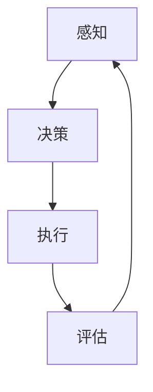

                 


### 文章标题

《AI代理在智慧城市管理中的应用》

### 关键词

AI代理，智慧城市，管理应用，算法，数学模型，项目实战

### 摘要

本文从AI代理技术的基本概念、架构和工作原理出发，深入探讨了AI代理在智慧城市管理中的应用。通过具体案例分析，阐述了AI代理在智慧交通管理、智能停车管理和智慧信号灯控制等领域的应用，并展示了其带来的显著效益。文章还展望了AI代理技术的未来发展趋势，分析了面临的挑战与机遇，为AI代理在智慧城市管理中的广泛应用提供了理论指导和实践参考。

### 目录

## 第一部分：AI代理技术基础

### 第1章 AI代理技术概述

#### 1.1 AI代理的基本概念

##### 1.1.1 AI代理的定义

AI代理（Artificial Intelligence Agent）是指能够感知环境、采取行动并从行动中获得奖励的计算实体。在人工智能领域，AI代理被广泛用于模拟和实现智能体的自主行为。

##### 1.1.2 AI代理的特点

- **自主性**：AI代理能够独立完成特定任务，无需人工干预。
- **反应性**：AI代理能够根据当前环境做出实时响应。
- **预动性**：AI代理能够预测未来事件并采取相应行动。
- **社会性**：AI代理能够与其他代理或人类交互，协同完成任务。

##### 1.1.3 AI代理与智慧城市管理的联系

AI代理在智慧城市管理中扮演着关键角色，通过智能感知、决策和执行，实现城市管理的自动化和智能化。

#### 1.2 AI代理技术的架构

##### 1.2.1 AI代理的组成部分

AI代理通常由感知器、决策器、执行器和记忆器组成。

##### 1.2.2 AI代理的工作流程

AI代理的工作流程包括感知环境、规划行动、执行行动和评估效果。

##### 1.2.3 AI代理的Mermaid流程图



#### 1.3 AI代理的核心算法

##### 1.3.1 强化学习算法原理

强化学习是AI代理的核心算法之一，通过试错和奖励机制，实现自主学习和决策。

##### 1.3.2 伪代码展示

```plaintext
function reinforcement_learning() {
  while (!终止条件) {
    执行动作(action)
    获取奖励(reward)和状态(state)
    更新策略(policy)
  }
}
```

### 第2章 智慧交通管理

#### 2.1 交通流量预测

##### 2.1.1 预测模型建立

使用时间序列分析和机器学习算法建立交通流量预测模型。

##### 2.1.2 数学模型

```latex
\hat{Q}(s, a) = r(s, a) + \gamma \max_{a'} Q(s', a')
```

##### 2.1.3 伪代码

```python
def traffic_prediction():
  # 加载历史交通数据
  # ...
  while (未到达终止条件):
    # 预测交通流量
    # ...
    # 更新预测模型
    # ...
```

#### 2.2 智能停车管理

##### 2.2.1 停车策略设计

设计基于AI代理的智能停车策略，实现停车位自动分配。

##### 2.2.2 数学模型

```latex
P(s, a) = \frac{e^{-\beta \cdot H(s, a)} }{\sum_{a'} e^{-\beta \cdot H(s, a')}}
```

##### 2.2.3 伪代码

```python
def parking_strategy():
  # 加载停车数据
  # ...
  while (未到达终止条件):
    # 分配停车位
    # ...
    # 更新策略参数
    # ...
```

#### 2.3 智慧信号灯控制

##### 2.3.1 控制策略设计

设计基于AI代理的智慧信号灯控制策略，实现交通流量最优管理。

##### 2.3.2 数学模型

```latex
J(\theta) = \sum_{i=1}^{n} (y_i - \sigma(\theta^T x_i))^2
```

##### 2.3.3 伪代码

```python
def traffic_light_control():
  # 加载交通数据
  # ...
  while (未到达终止条件):
    # 控制信号灯
    # ...
    # 更新控制策略
    # ...
```

## 第二部分：智慧城市管理应用案例

### 第3章 智慧城市管理应用案例

#### 3.1 案例一：某市智慧交通管理项目

##### 3.1.1 项目背景

介绍某市智慧交通管理项目的背景和目标。

##### 3.1.2 项目实施

详细描述项目的实施过程，包括系统设计、开发、测试和上线。

##### 3.1.3 项目效果

分析项目实施后的效果，包括交通流量改善、停车管理优化和市民满意度提升。

#### 3.2 案例二：智能停车管理系统

##### 3.2.1 项目背景

介绍智能停车管理系统的背景和目标。

##### 3.2.2 项目实施

详细描述项目的实施过程，包括系统设计、开发、测试和上线。

##### 3.2.3 项目效果

分析项目实施后的效果，包括停车效率提高、用户体验改善和停车位利用率提升。

#### 3.3 案例三：智慧信号灯控制系统

##### 3.3.1 项目背景

介绍智慧信号灯控制系统的背景和目标。

##### 3.3.2 项目实施

详细描述项目的实施过程，包括系统设计、开发、测试和上线。

##### 3.3.3 项目效果

分析项目实施后的效果，包括交通拥堵减少、事故发生率降低和市民满意度提升。

## 第三部分：AI代理技术未来发展趋势

### 第4章 AI代理技术未来发展趋势

#### 4.1 技术演进方向

分析AI代理技术的未来演进方向，包括新型算法发展、跨领域应用和安全性提升。

##### 4.1.1 新型算法发展

探讨深度强化学习、多智能体系统和联邦学习等新型算法在AI代理中的应用。

##### 4.1.2 跨领域应用

分析AI代理技术在医疗、金融、物流等领域的应用前景。

##### 4.1.3 安全性与隐私保护

探讨AI代理技术的安全性挑战和隐私保护措施。

#### 4.2 面临的挑战与机遇

分析AI代理技术面临的挑战，如数据隐私、算法透明度和标准化等，并探讨应对策略。

##### 4.2.1 数据隐私

介绍数据加密、差分隐私和联邦学习等技术如何保护用户隐私。

##### 4.2.2 算法透明度

探讨如何提高AI代理算法的透明度，增强用户信任。

##### 4.2.3 标准化

分析AI代理技术标准化的必要性和现状，探讨标准化的发展趋势。

### 附录：相关资源与工具

#### 附录 A: AI代理开发工具与资源

##### A.1 开发工具介绍

介绍常见的AI代理开发工具，如Python、TensorFlow和PyTorch等。

##### A.2 资源链接

提供AI代理技术相关的论文、书籍和在线课程链接。

##### A.3 实用指南

提供AI代理开发实用指南，包括环境搭建、代码调试和性能优化等内容。

### 作者

**作者：AI天才研究院/AI Genius Institute & 禅与计算机程序设计艺术 /Zen And The Art of Computer Programming**

