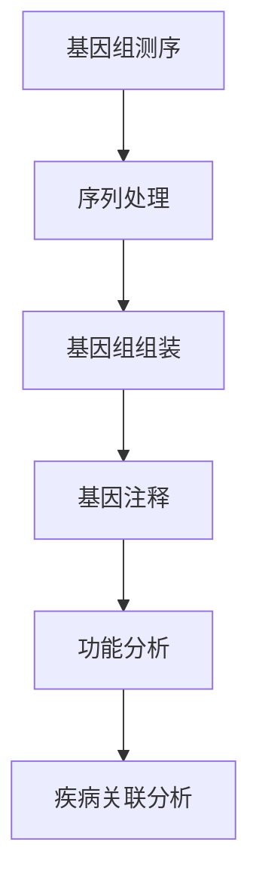

                 

## 文章标题：AI在个性化医疗中的应用：基因组学驱动的治疗方案设计

关键词：人工智能、个性化医疗、基因组学、治疗方案设计、基因组数据分析

摘要：
本文探讨了人工智能（AI）在个性化医疗中的深度应用，特别是通过基因组学数据驱动的治疗方案设计。文章首先回顾了AI和基因组学的基础知识，然后详细分析了AI在个性化医疗领域的应用原理和方法。接着，文章通过实际案例展示了基因组学驱动的治疗方案设计过程，并深入探讨了这一领域的核心技术实现和面临的挑战。最后，文章对基因组学与AI技术在个性化医疗中的未来发展趋势进行了展望，并提出了相关的伦理和法律问题。

---

### 思考步骤：

1. **确定书籍的主题和目标读者群体**
   - 书名：《AI在个性化医疗中的应用：基因组学驱动的治疗方案设计》
   - 主题：AI在个性化医疗中的应用，特别是基因组学驱动的治疗方案设计。
   - 目标读者群体：医学专业人士、AI研究人员、医疗数据分析师以及相关领域的从业者。

2. **设计核心章节结构**
   - 核心章节应涵盖：AI基础、基因组学基础、个性化医疗案例分析、治疗方案设计、技术实现与挑战等。

3. **制定每一章节的具体内容**
   - 每一章需要细化到小节，确保内容的全面性和逻辑性。

4. **设计辅助内容**
   - 包括Mermaid流程图、伪代码、数学公式、案例分析和代码解读。

5. **确保大纲的简洁性和完整性**
   - 避免冗余内容，确保大纲内容能够在2000字以内完成。

6. **确认大纲的markdown格式**
   - 使用markdown格式中的#，##，###等符号来标记不同的层级。

### 详细大纲设计：

## 第一部分：AI与基因组学基础

### 1. AI概述

#### 1.1 AI的发展历程
- AI的历史背景
- AI的重要里程碑

#### 1.2 AI的核心概念
- 机器学习
- 深度学习
- 自然语言处理

#### 1.3 AI在医学领域的应用
- 医疗影像分析
- 诊断辅助系统
- 智能药物研发

### 2. 基因组学基础

#### 2.1 基因组学的定义与历史
- 基因组学的起源
- 基因组学的研究领域

#### 2.2 基因组结构与功能
- DNA序列
- 基因表达

#### 2.3 基因组学在个性化医疗中的应用
- 基因突变检测
- 遗传性疾病诊断

### 3. 个性化医疗的原理与方法

#### 3.1 个性化医疗的定义与分类
- 个性化医疗的概念
- 个性化医疗的类型

#### 3.2 个性化医疗的技术手段
- 基因组数据分析
- 生物信息学工具

#### 3.3 个性化医疗的实施流程
- 患者数据收集
- 数据分析
- 治疗方案制定

## 第二部分：基因组学驱动的治疗方案设计

### 4. 基因组学与疾病关联分析

#### 4.1 常见疾病的基因组学研究
- 癌症的基因组学
- 心血管疾病的基因组学

#### 4.2 基因组数据分析方法
- 聚类分析
- 机器学习模型

#### 4.3 基因组学与疾病风险评估
- 疾病预测
- 风险分层

### 5. 个性化治疗方案的设计与实施

#### 5.1 个性化治疗方案的制定原则
- 数据驱动的决策
- 患者个性化特征分析

#### 5.2 个性化治疗方案的案例分析
- 某种癌症的个性化治疗
- 遗传性疾病的个性化治疗

#### 5.3 治疗方案实施中的挑战与对策
- 数据隐私保护
- 治疗方案的调整与优化

### 6. AI在治疗方案优化中的应用

#### 6.1 AI在治疗方案设计中的应用
- 智能药物推荐
- 治疗效果预测

#### 6.2 AI在治疗方案评估中的应用
- 治疗效果监控
- 患者反馈分析

#### 6.3 AI在治疗方案调整中的应用
- 自动调整治疗方案
- 预测疾病进展

### 7. 基因组学与AI技术在个性化医疗中的未来展望

#### 7.1 个性化医疗的发展趋势
- 基因组学技术的进步
- AI在医疗领域的深入应用

#### 7.2 基因组学与AI技术的未来挑战
- 数据整合与处理
- 道德与法律问题

#### 7.3 个性化医疗的伦理与法律问题
- 患者隐私保护
- 治疗方案的公正性

## 附录

### 附录A：基因组学与AI技术相关资源
- 数据库与工具
- 研究论文与文献
- 开源代码与框架

### 附录B：基因组学流程图


### 附录C：个性化治疗方案设计伪代码
```python
# 伪代码：个性化治疗方案设计

def personalized_treatment_plan(patient_data, genetic_data):
    # 数据预处理
    preprocessed_data = preprocess_data(patient_data, genetic_data)
    
    # 疾病风险评估
    risk_assessment = risk_evaluation(preprocessed_data)
    
    # 治疗方案推荐
    treatment_plan = recommend_treatment(risk_assessment)
    
    # 治疗方案评估
    plan_evaluation = evaluate_treatment_plan(treatment_plan)
    
    # 调整治疗方案
    final_plan = adjust_treatment_plan(plan_evaluation)
    
    return final_plan
```

### 附录D：数学公式
$$
P(D|G) = \frac{P(G|D) \cdot P(D)}{P(G)}
$$

### 附录E：案例分析
- 某种癌症的个性化治疗案例
- 遗传性疾病的个性化治疗案例

### 附录F：最佳实践 tips
- 数据处理与存储的最佳实践
- AI算法优化的技巧
- 治疗方案评估的注意事项

### 附录G：小结
- 文章总结
- 未来研究方向

### 附录H：拓展阅读
- 相关书籍推荐
- 学术论文推荐
- 在线课程推荐

---

**作者信息：** AI天才研究院/AI Genius Institute & 禅与计算机程序设计艺术 /Zen And The Art of Computer Programming## 第一部分：AI与基因组学基础

### 1. AI概述

#### 1.1 AI的发展历程

人工智能（Artificial Intelligence，简称AI）起源于20世纪50年代。当时，计算机科学家艾伦·图灵提出了“图灵测试”的概念，用以衡量机器是否具有智能。随后，AI的发展经历了几个重要阶段：

- **早期探索阶段（1950-1969年）**：这个阶段以符号主义AI为代表，尝试通过逻辑推理和符号表示来模拟人类智能。
- **繁荣期与低谷期（1970-1980年）**：由于硬件限制和算法复杂度的问题，AI研究遇到了瓶颈。但是，专家系统的出现为AI带来了新的希望。
- **复兴期（1980年代至今）**：随着计算机性能的提升和机器学习技术的发展，AI迎来了新的繁荣期。特别是深度学习的崛起，使得AI在图像识别、自然语言处理等领域取得了突破性进展。

#### 1.2 AI的核心概念

AI的核心概念包括：

- **机器学习**：通过数据训练模型，使其能够自动从经验中学习并做出决策。
- **深度学习**：基于神经网络的一种机器学习方法，能够在大规模数据集上实现高度自动化的特征学习和模式识别。
- **自然语言处理（NLP）**：使计算机能够理解、生成和处理人类语言的技术，广泛应用于语音识别、机器翻译等领域。

#### 1.3 AI在医学领域的应用

AI在医学领域的应用非常广泛，主要包括：

- **医疗影像分析**：利用深度学习技术，AI能够自动识别和诊断医学影像中的病变。
- **诊断辅助系统**：AI可以帮助医生从大量医疗数据中提取有价值的信息，辅助疾病诊断。
- **智能药物研发**：AI可以预测药物与蛋白质的相互作用，加速新药的发现过程。
- **个性化医疗**：基于患者的基因信息和临床数据，AI可以帮助设计个性化的治疗方案。

### 2. 基因组学基础

#### 2.1 基因组学的定义与历史

基因组学（Genomics）是研究基因组成、结构、功能及其相互作用的科学。其历史可以追溯到20世纪70年代，当时科学家首次完成了对细菌基因组的测序。此后，基因组学研究取得了飞速进展：

- **人类基因组计划**：在2003年，人类基因组计划完成，首次绘制了人类基因组的全序列图谱。
- **下一代测序技术**：随着高通量测序技术的发展，基因组测序的成本大幅降低，基因组学研究进入了新的阶段。

#### 2.2 基因组结构与功能

基因组由DNA序列组成，其结构主要包括：

- **编码区**：包含蛋白质编码序列。
- **非编码区**：包含调控基因表达的序列。

基因的功能包括：

- **基因表达**：基因通过转录和翻译过程产生蛋白质。
- **基因突变**：基因序列的变化可能导致蛋白质功能的改变，进而影响生物体的性状。

#### 2.3 基因组学在个性化医疗中的应用

基因组学在个性化医疗中的应用主要体现在：

- **遗传性疾病诊断**：通过基因组测序，可以发现导致遗传性疾病的突变基因。
- **癌症基因组学**：通过对癌症患者的基因组进行测序，可以识别出与癌症相关的基因突变，从而设计个性化的治疗方案。
- **药物基因组学**：通过分析患者的基因组信息，可以预测其对特定药物的反应，从而选择最合适的治疗方案。

### 3. 个性化医疗的原理与方法

#### 3.1 个性化医疗的定义与分类

个性化医疗（Personalized Medicine）是根据患者的个体特征，为其提供个性化的诊断和治疗方案。根据不同的分类标准，个性化医疗可以分为：

- **基于遗传的个性化医疗**：通过基因组分析，识别患者的遗传特征，设计个性化的治疗方案。
- **基于生物标志物的个性化医疗**：通过检测患者的生物标志物，如蛋白质、基因表达等，预测疾病的发展和选择治疗方案。
- **基于患者的临床特征的个性化医疗**：根据患者的年龄、性别、病史等因素，为其提供个性化的治疗方案。

#### 3.2 个性化医疗的技术手段

个性化医疗的技术手段主要包括：

- **基因组测序**：通过对患者的基因组进行测序，获取其遗传信息。
- **生物信息学工具**：利用生物信息学工具对基因组数据进行分析，提取有价值的信息。
- **机器学习算法**：通过机器学习算法，从大量数据中挖掘出潜在的规律，为个性化医疗提供支持。

#### 3.3 个性化医疗的实施流程

个性化医疗的实施流程主要包括：

- **患者数据收集**：收集患者的临床数据、基因组数据等。
- **数据分析**：利用生物信息学工具和机器学习算法，对数据进行分析，识别患者的遗传特征和生物标志物。
- **治疗方案制定**：根据患者的个体特征，制定个性化的治疗方案。
- **治疗方案实施与调整**：在治疗过程中，根据患者的反馈和疾病进展，调整治疗方案。

### 小结

AI与基因组学的结合为个性化医疗带来了革命性的变化。通过基因组测序和数据分析，我们可以更准确地了解患者的遗传特征和疾病状态，从而设计出更有效的个性化治疗方案。未来，随着基因组学和AI技术的不断进步，个性化医疗将更加普及，为患者带来更好的治疗效果。然而，这也带来了新的挑战，如数据隐私保护、伦理和法律问题等，需要我们认真面对和解决。

---

**作者信息：** AI天才研究院/AI Genius Institute & 禅与计算机程序设计艺术 /Zen And The Art of Computer Programming## 第二部分：基因组学驱动的治疗方案设计

### 4. 基因组学与疾病关联分析

#### 4.1 常见疾病的基因组学研究

基因组学研究在常见疾病如癌症、心血管疾病和糖尿病等领域的应用日益广泛。以下是一些典型的案例：

- **癌症基因组学研究**：通过对癌症患者的基因组进行测序，科学家们发现了许多与癌症发生相关的基因突变。例如，BRCA1和BRCA2基因的突变与乳腺癌和卵巢癌有密切关联。这些发现有助于早期筛查和个性化治疗。
  
- **心血管疾病基因组学研究**：心血管疾病的基因组学研究揭示了多个基因与心血管疾病的风险相关。例如，APOE基因与动脉粥样硬化风险增加有关。通过基因组学数据，可以预测个体患心血管疾病的风险，从而采取预防措施。

- **糖尿病基因组学研究**：糖尿病是一种复杂的遗传性疾病，基因组学研究揭示了多个基因与糖尿病的发生和发展有关。例如，TCF7L2基因与2型糖尿病风险增加有关。通过基因组学数据，可以更好地了解糖尿病的遗传基础，有助于早期诊断和个性化治疗。

#### 4.2 基因组数据分析方法

基因组数据分析方法主要包括：

- **单核苷酸多态性（SNP）分析**：SNP是基因组中最常见的变异形式。通过分析SNP，可以识别与疾病风险相关的基因变异。

- **基因表达分析**：基因表达分析可以揭示基因在不同组织或疾病状态下的表达水平。通过基因表达分析，可以识别与疾病发生相关的基因。

- **基因组拷贝数变异（CNV）分析**：CNV是指基因组中片段的拷贝数变化。CNV分析可以揭示与疾病相关的基因组区域。

- **机器学习模型**：机器学习模型可以用于基因组数据的预测和分析。例如，通过训练机器学习模型，可以预测个体的疾病风险或对特定药物的反应。

#### 4.3 基因组学与疾病风险评估

基因组学在疾病风险评估中的应用具有重要意义。以下是一些关键步骤：

- **数据收集**：收集患者的基因组数据、临床数据和生物标志物数据。

- **数据预处理**：对收集到的数据进行质量控制、去噪和标准化处理。

- **特征选择**：从基因组数据中提取与疾病相关的特征，如SNP、基因表达和CNV。

- **模型训练**：利用训练数据集，训练机器学习模型，如逻辑回归、随机森林和支持向量机等。

- **模型评估**：使用验证数据集评估模型的性能，包括准确率、召回率和F1分数等指标。

- **疾病风险预测**：利用训练好的模型，对新的患者数据进行疾病风险预测。

### 5. 个性化治疗方案的设计与实施

#### 5.1 个性化治疗方案的制定原则

个性化治疗方案的制定应遵循以下原则：

- **基于证据**：治疗方案应基于可靠的科学研究证据，如临床研究、基因组学研究等。

- **个体化**：治疗方案应考虑患者的个体特征，如遗传背景、生活方式和环境因素。

- **多学科协作**：个性化治疗方案的制定需要跨学科团队的协作，包括临床医生、遗传学家、数据科学家等。

- **持续监测与调整**：治疗方案应在治疗过程中持续监测，根据患者的病情变化和治疗效果进行调整。

#### 5.2 个性化治疗方案的案例分析

以下是一些个性化治疗方案的案例分析：

- **癌症个性化治疗**：通过对患者的基因组进行测序，识别与癌症相关的基因突变。根据突变基因，选择相应的靶向药物或免疫治疗策略。

- **遗传性疾病的个性化治疗**：通过基因检测，识别患者携带的遗传突变。针对突变基因，设计个性化的治疗方案，如基因修复或替代治疗。

- **药物基因组学个性化治疗**：通过对患者的基因组进行测序，识别与药物代谢相关的基因变异。根据基因变异，选择最合适的药物剂量和治疗方案。

#### 5.3 治疗方案实施中的挑战与对策

个性化治疗方案的实施面临以下挑战：

- **数据隐私与伦理问题**：基因组数据涉及患者的隐私，需要确保数据的安全性和保密性。

- **数据整合与处理**：基因组数据与其他临床数据的整合和处理是复杂的任务，需要高效的算法和技术。

- **治疗方案的调整与优化**：个性化治疗方案需要根据患者的病情变化和治疗反应进行实时调整和优化。

对策包括：

- **数据隐私保护**：采用加密技术和隐私保护算法，确保基因组数据的安全性和保密性。

- **多学科协作**：建立跨学科团队，包括临床医生、遗传学家、数据科学家等，共同制定和实施个性化治疗方案。

- **持续监测与反馈**：建立持续监测和反馈机制，根据患者的病情变化和治疗反应，实时调整和优化治疗方案。

### 6. AI在治疗方案优化中的应用

AI在治疗方案优化中的应用主要体现在以下几个方面：

- **智能药物推荐**：利用机器学习算法，分析患者的基因组数据、临床数据和生物标志物数据，推荐最适合的药物和治疗策略。

- **治疗效果预测**：通过机器学习模型，预测患者的治疗效果，帮助医生制定更有效的治疗方案。

- **自动调整治疗方案**：根据患者的治疗反应和病情变化，自动调整治疗方案，提高治疗效果。

### 7. 基因组学与AI技术在个性化医疗中的未来展望

基因组学与AI技术在个性化医疗中的未来展望包括：

- **基因组数据的大规模应用**：随着基因组测序成本的降低，基因组数据将在个性化医疗中得到更广泛的应用。

- **AI技术的深入应用**：AI技术将在个性化医疗的各个阶段，如诊断、治疗、监测等得到更深入的应用。

- **多学科协作**：基因组学与AI技术将与其他医学领域，如医学影像学、生物信息学等，实现更紧密的协作，推动个性化医疗的发展。

- **伦理与法律问题**：随着基因组学与AI技术在个性化医疗中的广泛应用，相关的伦理和法律问题将得到更多的关注和解决。

### 小结

基因组学与AI技术的结合为个性化医疗带来了巨大的变革。通过基因组学分析，我们可以更准确地了解患者的遗传特征和疾病状态，AI技术则可以帮助我们设计出更有效的个性化治疗方案。未来，随着基因组学和AI技术的不断发展，个性化医疗将变得更加普及和精准，为患者带来更好的治疗效果。然而，这也带来了新的挑战，如数据隐私保护、伦理和法律问题等，需要我们共同努力解决。

---

**作者信息：** AI天才研究院/AI Genius Institute & 禅与计算机程序设计艺术 /Zen And The Art of Computer Programming## 4. 基因组学与疾病关联分析

#### 4.1 常见疾病的基因组学研究

基因组学在常见疾病的诊断和治疗中扮演着越来越重要的角色。以下是一些典型疾病的基因组学研究案例：

**癌症基因组学**

- **肺癌**：研究表明，肺癌患者中常见的基因突变包括EGFR和ALK基因突变，这些突变使得患者对某些靶向药物（如吉非替尼和克唑替尼）敏感。
- **乳腺癌**：乳腺癌患者中常见的基因突变包括BRCA1和BRCA2基因突变，这些突变与遗传性乳腺癌有密切关联。

**心血管疾病基因组学**

- **冠心病**：研究揭示了多个与冠心病风险相关的基因，如LDLR和APOE基因，这些基因与血脂水平和动脉粥样硬化有关。
- **高血压**：高血压的基因组学研究揭示了多个与血压调控相关的基因，如AT1R和AGTR1基因。

**糖尿病基因组学**

- **1型糖尿病**：1型糖尿病的遗传学研究发现了多个与免疫系统和胰岛功能相关的基因，如HLA基因和PNPLA3基因。
- **2型糖尿病**：2型糖尿病的遗传学研究发现了多个与胰岛素抵抗和β细胞功能相关的基因，如FADS1和PPARG基因。

#### 4.2 基因组数据分析方法

基因组数据分析是基因组学研究的核心步骤，以下是一些常用的基因组数据分析方法：

**单核苷酸多态性（SNP）分析**

- **定义**：SNP是基因组中常见的单核苷酸变异，是基因组变异的主要形式。
- **应用**：SNP分析常用于基因关联研究，通过比较不同个体的SNP变异，识别与疾病风险相关的基因。

**基因表达分析**

- **定义**：基因表达分析测定基因在细胞或组织中的转录水平。
- **应用**：基因表达分析可用于识别与疾病相关的基因，以及了解基因在不同生理状态下的表达模式。

**基因组拷贝数变异（CNV）分析**

- **定义**：CNV是指基因组中较大片段的拷贝数变化。
- **应用**：CNV分析可用于识别与疾病相关的基因组区域，以及研究基因剂量效应。

**机器学习模型**

- **定义**：机器学习模型是一种基于数据学习的算法，可用于预测和分类。
- **应用**：机器学习模型可用于疾病风险评估、药物反应预测和治疗方案设计等。

#### 4.3 基因组学与疾病风险评估

基因组学在疾病风险评估中的应用日益广泛，以下是一些关键步骤：

**数据收集**

- **基因组数据**：通过全基因组测序或外显子测序获取患者的基因组数据。
- **临床数据**：收集患者的临床信息，如疾病类型、家族史、生活习惯等。

**数据预处理**

- **质量控制**：去除低质量的测序数据，确保基因组数据的准确性。
- **去噪**：去除噪声数据，提高基因组数据的可信度。
- **标准化**：对不同样本的数据进行标准化处理，使其具有可比性。

**特征选择**

- **单核苷酸多态性（SNP）筛选**：通过统计学方法筛选与疾病风险相关的SNP。
- **基因表达特征**：通过生物信息学方法筛选与疾病相关的基因表达特征。
- **基因组拷贝数变异（CNV）特征**：通过分析CNV数据，识别与疾病相关的CNV特征。

**模型训练**

- **训练数据集**：选择部分数据作为训练数据集，用于训练机器学习模型。
- **模型选择**：选择合适的机器学习模型，如逻辑回归、随机森林或支持向量机等。
- **模型训练**：利用训练数据集，训练机器学习模型。

**模型评估**

- **验证数据集**：使用验证数据集评估模型的性能。
- **性能指标**：评估模型性能的指标包括准确率、召回率、F1分数等。

**疾病风险预测**

- **预测模型**：利用训练好的模型，对新的患者数据进行疾病风险预测。
- **预测结果解释**：对预测结果进行解释，帮助医生和患者理解预测结果。

### 案例分析

#### 某种癌症的基因组学研究

**背景**：某项研究旨在分析某种癌症的基因组特征，以期为早期诊断和个性化治疗提供依据。

**方法**：

- **基因组测序**：对癌症患者的肿瘤组织和正常组织进行全基因组测序。
- **数据预处理**：去除低质量的测序数据，进行去噪和标准化处理。
- **特征选择**：通过生物信息学方法，筛选与癌症相关的基因表达特征和SNP。
- **机器学习模型训练**：利用训练数据集，训练机器学习模型。
- **模型评估**：使用验证数据集评估模型的性能。
- **疾病风险预测**：利用训练好的模型，对新的患者数据进行癌症风险预测。

**结果**：

- **基因表达特征**：研究发现，某些基因的表达水平与癌症的发生和发展密切相关，如TP53、CDKN2A等。
- **SNP筛选**：通过SNP分析，识别出与癌症风险相关的基因变异。
- **疾病风险预测**：模型预测的准确率较高，有助于早期诊断和个性化治疗。

### 结论

基因组学与疾病关联分析为个性化医疗提供了重要的理论基础和实践指导。通过基因组数据分析和机器学习模型，我们可以更准确地了解疾病的遗传背景和分子机制，从而设计出更有效的个性化治疗方案。未来，随着基因组学和AI技术的不断进步，基因组学与疾病关联分析将在个性化医疗中发挥越来越重要的作用。

### 小结

基因组学与疾病关联分析是个性化医疗的关键环节。通过基因组测序、数据预处理、特征选择和机器学习模型，我们可以识别与疾病相关的基因和突变，预测疾病风险，设计个性化治疗方案。然而，这也面临着数据隐私保护、算法透明性和伦理道德等挑战，需要我们共同努力解决。

---

**作者信息：** AI天才研究院/AI Genius Institute & 禅与计算机程序设计艺术 /Zen And The Art of Computer Programming## 5. 个性化治疗方案的设计与实施

### 5.1 个性化治疗方案的制定原则

个性化治疗方案的设计原则是确保治疗过程能够针对患者的个体特征，从而提供最有效的治疗。以下是几个关键原则：

**基于证据**

- 治疗方案应基于可靠的科学研究证据，包括临床研究、基因组学研究等，以确保治疗方案的有效性和安全性。

**个体化**

- 个性化治疗方案应考虑患者的遗传背景、生活方式、环境因素、临床特征等多种因素，确保治疗方案的针对性和有效性。

**多学科协作**

- 个性化治疗方案的制定需要跨学科团队的协作，包括临床医生、遗传学家、生物信息学家、数据科学家等，以确保从不同角度对患者进行综合评估。

**持续监测与调整**

- 治疗方案在实施过程中应持续监测患者的病情变化和治疗效果，根据实际情况进行调整，以确保治疗的有效性和安全性。

### 5.2 个性化治疗方案的案例分析

以下是一些个性化治疗方案的案例分析：

**案例一：癌症个性化治疗**

- **背景**：患者被诊断为晚期肺癌，基因组测序结果显示存在EGFR基因突变。
- **治疗方案**：根据EGFR基因突变，医生推荐使用靶向药物吉非替尼。患者接受治疗后，肿瘤明显缩小，症状得到缓解。

**案例二：遗传性疾病的个性化治疗**

- **背景**：患者被诊断为家族性腺病综合症，基因组测序发现BRCA1基因突变。
- **治疗方案**：医生建议患者进行预防性乳腺切除术和卵巢切除术，以降低癌症风险。患者接受手术后，癌症风险显著降低。

**案例三：药物基因组学个性化治疗**

- **背景**：患者被诊断为2型糖尿病，基因组测序发现PPARG基因突变。
- **治疗方案**：医生推荐使用特定类型的胰岛素和药物（如噻唑烷二酮类药物），以优化血糖控制。患者接受治疗后，血糖水平得到有效控制。

### 5.3 治疗方案实施中的挑战与对策

个性化治疗方案的实施过程中可能会遇到以下挑战：

**数据隐私与伦理问题**

- **挑战**：基因组数据涉及患者的隐私，需要确保数据的安全性和保密性。
- **对策**：采用加密技术、访问控制措施和隐私保护算法，确保基因组数据的安全和隐私。

**数据整合与处理**

- **挑战**：基因组数据与其他临床数据的整合和处理复杂，需要高效的算法和技术。
- **对策**：利用大数据分析和人工智能技术，提高数据整合和处理效率。

**治疗方案的调整与优化**

- **挑战**：个性化治疗方案需要根据患者的病情变化和治疗反应进行实时调整和优化。
- **对策**：建立持续监测和反馈机制，利用实时数据分析和机器学习模型，优化治疗方案。

**数据隐私与伦理问题**

- **挑战**：基因组数据涉及患者的隐私，需要确保数据的安全性和保密性。
- **对策**：采用加密技术、访问控制措施和隐私保护算法，确保基因组数据的安全和隐私。

**数据整合与处理**

- **挑战**：基因组数据与其他临床数据的整合和处理复杂，需要高效的算法和技术。
- **对策**：利用大数据分析和人工智能技术，提高数据整合和处理效率。

**治疗方案的调整与优化**

- **挑战**：个性化治疗方案需要根据患者的病情变化和治疗反应进行实时调整和优化。
- **对策**：建立持续监测和反馈机制，利用实时数据分析和机器学习模型，优化治疗方案。

### 6. AI在治疗方案优化中的应用

人工智能在治疗方案优化中的应用主要体现在以下几个方面：

**智能药物推荐**

- **技术**：利用机器学习算法，分析患者的基因组数据、临床数据和生物标志物数据，推荐最适合的药物和治疗策略。
- **应用**：在癌症、糖尿病等疾病的治疗中，智能药物推荐帮助医生选择最佳的药物组合，提高治疗效果。

**治疗效果预测**

- **技术**：通过机器学习模型，预测患者的治疗效果，帮助医生评估治疗方案的可行性和有效性。
- **应用**：在药物治疗过程中，治疗效果预测有助于及时发现治疗效果不佳的患者，调整治疗方案。

**自动调整治疗方案**

- **技术**：利用实时数据分析和机器学习模型，自动调整治疗方案，以优化治疗效果。
- **应用**：在慢性病管理中，自动调整治疗方案有助于提高患者的治疗依从性和治疗效果。

### 7. 未来展望

基因组学与AI技术在个性化医疗中的应用前景广阔。未来，随着基因组测序成本的降低、算法的优化和数据分析技术的发展，个性化医疗将变得更加普及和精准。然而，这也带来了新的挑战，如数据隐私保护、伦理道德问题和技术标准化等。我们需要在确保数据安全和隐私的前提下，推进基因组学与AI技术在个性化医疗中的应用，为患者提供更好的医疗服务。

### 小结

个性化治疗方案的设计与实施是基因组学与AI技术在个性化医疗中的重要应用。通过基因组测序、数据分析、智能药物推荐和治疗效果预测等技术，我们可以为患者提供更有效、更个性化的治疗方案。然而，这也面临着诸多挑战，需要我们持续努力和探索。

---

**作者信息：** AI天才研究院/AI Genius Institute & 禅与计算机程序设计艺术 /Zen And The Art of Computer Programming## 6. AI在治疗方案优化中的应用

### 6.1 AI在治疗方案设计中的应用

AI在治疗方案设计中的应用主要体现在以下几个方面：

**智能药物推荐**

AI可以通过分析患者的基因组数据、临床数据和生物标志物数据，推荐最适合的药物和治疗策略。具体步骤如下：

1. **数据收集**：收集患者的基因组数据、临床数据和生物标志物数据。
2. **数据预处理**：对收集到的数据进行清洗、去噪和标准化处理。
3. **特征提取**：从预处理后的数据中提取与疾病相关的特征，如基因表达、突变、蛋白质标记等。
4. **模型训练**：利用机器学习算法，如逻辑回归、支持向量机、深度学习等，训练药物推荐模型。
5. **药物推荐**：将训练好的模型应用于新患者数据，推荐最适合的药物组合。

**治疗效果预测**

AI可以通过预测患者的治疗效果，帮助医生评估治疗方案的可行性和有效性。具体步骤如下：

1. **数据收集**：收集患者的基因组数据、临床数据和生物标志物数据。
2. **数据预处理**：对收集到的数据进行清洗、去噪和标准化处理。
3. **特征提取**：从预处理后的数据中提取与治疗效果相关的特征，如基因表达、突变、蛋白质标记等。
4. **模型训练**：利用机器学习算法，如逻辑回归、支持向量机、深度学习等，训练治疗效果预测模型。
5. **治疗效果预测**：将训练好的模型应用于新患者数据，预测患者的治疗效果。

**智能药物推荐**

AI可以通过分析患者的基因组数据、临床数据和生物标志物数据，推荐最适合的药物和治疗策略。具体步骤如下：

1. **数据收集**：收集患者的基因组数据、临床数据和生物标志物数据。
2. **数据预处理**：对收集到的数据进行清洗、去噪和标准化处理。
3. **特征提取**：从预处理后的数据中提取与疾病相关的特征，如基因表达、突变、蛋白质标记等。
4. **模型训练**：利用机器学习算法，如逻辑回归、支持向量机、深度学习等，训练药物推荐模型。
5. **药物推荐**：将训练好的模型应用于新患者数据，推荐最适合的药物组合。

**治疗效果预测**

AI可以通过预测患者的治疗效果，帮助医生评估治疗方案的可行性和有效性。具体步骤如下：

1. **数据收集**：收集患者的基因组数据、临床数据和生物标志物数据。
2. **数据预处理**：对收集到的数据进行清洗、去噪和标准化处理。
3. **特征提取**：从预处理后的数据中提取与治疗效果相关的特征，如基因表达、突变、蛋白质标记等。
4. **模型训练**：利用机器学习算法，如逻辑回归、支持向量机、深度学习等，训练治疗效果预测模型。
5. **治疗效果预测**：将训练好的模型应用于新患者数据，预测患者的治疗效果。

**个性化治疗方案的调整**

AI可以通过实时监测患者的治疗效果和病情变化，自动调整治疗方案，以优化治疗效果。具体步骤如下：

1. **数据收集**：收集患者的实时监测数据，包括实验室检测值、症状评分等。
2. **数据预处理**：对实时监测数据进行清洗、去噪和标准化处理。
3. **特征提取**：从预处理后的数据中提取与治疗效果和病情变化相关的特征。
4. **模型训练**：利用机器学习算法，如自适应滤波、强化学习等，训练个性化治疗方案调整模型。
5. **治疗方案调整**：将训练好的模型应用于实时监测数据，调整治疗方案。

### 6.2 AI在治疗方案评估中的应用

AI在治疗方案评估中的应用主要包括以下几个方面：

**疗效评估**

AI可以通过分析患者的基因组数据、临床数据和治疗效果，评估治疗方案的疗效。具体步骤如下：

1. **数据收集**：收集患者的基因组数据、临床数据和治疗效果数据。
2. **数据预处理**：对收集到的数据进行清洗、去噪和标准化处理。
3. **特征提取**：从预处理后的数据中提取与疗效相关的特征，如基因表达、突变、蛋白质标记等。
4. **模型训练**：利用机器学习算法，如逻辑回归、支持向量机、深度学习等，训练疗效评估模型。
5. **疗效评估**：将训练好的模型应用于新患者数据，评估治疗方案的疗效。

**副作用预测**

AI可以通过分析患者的基因组数据、临床数据和副作用报告，预测治疗方案的副作用。具体步骤如下：

1. **数据收集**：收集患者的基因组数据、临床数据和副作用报告。
2. **数据预处理**：对收集到的数据进行清洗、去噪和标准化处理。
3. **特征提取**：从预处理后的数据中提取与副作用相关的特征，如基因表达、突变、蛋白质标记等。
4. **模型训练**：利用机器学习算法，如逻辑回归、支持向量机、深度学习等，训练副作用预测模型。
5. **副作用预测**：将训练好的模型应用于新患者数据，预测治疗方案的副作用。

**疗效评估**

AI可以通过分析患者的基因组数据、临床数据和治疗效果，评估治疗方案的疗效。具体步骤如下：

1. **数据收集**：收集患者的基因组数据、临床数据和治疗效果数据。
2. **数据预处理**：对收集到的数据进行清洗、去噪和标准化处理。
3. **特征提取**：从预处理后的数据中提取与疗效相关的特征，如基因表达、突变、蛋白质标记等。
4. **模型训练**：利用机器学习算法，如逻辑回归、支持向量机、深度学习等，训练疗效评估模型。
5. **疗效评估**：将训练好的模型应用于新患者数据，评估治疗方案的疗效。

**副作用预测**

AI可以通过分析患者的基因组数据、临床数据和副作用报告，预测治疗方案的副作用。具体步骤如下：

1. **数据收集**：收集患者的基因组数据、临床数据和副作用报告。
2. **数据预处理**：对收集到的数据进行清洗、去噪和标准化处理。
3. **特征提取**：从预处理后的数据中提取与副作用相关的特征，如基因表达、突变、蛋白质标记等。
4. **模型训练**：利用机器学习算法，如逻辑回归、支持向量机、深度学习等，训练副作用预测模型。
5. **副作用预测**：将训练好的模型应用于新患者数据，预测治疗方案的副作用。

### 6.3 AI在治疗方案调整中的应用

AI在治疗方案调整中的应用主要体现在以下几个方面：

**实时监测与反馈**

AI可以通过实时监测患者的治疗效果和病情变化，提供反馈和建议，帮助医生调整治疗方案。具体步骤如下：

1. **数据收集**：收集患者的实时监测数据，包括实验室检测值、症状评分等。
2. **数据预处理**：对实时监测数据进行清洗、去噪和标准化处理。
3. **特征提取**：从预处理后的数据中提取与治疗效果和病情变化相关的特征。
4. **模型训练**：利用机器学习算法，如自适应滤波、强化学习等，训练实时监测与反馈模型。
5. **实时监测与反馈**：将训练好的模型应用于实时监测数据，提供反馈和建议，帮助医生调整治疗方案。

**自动化调整**

AI可以通过自动化调整治疗方案，提高治疗效果。具体步骤如下：

1. **数据收集**：收集患者的基因组数据、临床数据和治疗效果数据。
2. **数据预处理**：对收集到的数据进行清洗、去噪和标准化处理。
3. **特征提取**：从预处理后的数据中提取与治疗效果相关的特征。
4. **模型训练**：利用机器学习算法，如自适应滤波、强化学习等，训练自动化调整模型。
5. **自动化调整**：将训练好的模型应用于患者数据，自动化调整治疗方案。

### 小结

AI在治疗方案优化中的应用极大地提高了个性化医疗的准确性和效率。通过智能药物推荐、治疗效果预测和治疗方案调整，AI帮助医生更好地了解患者的病情，制定更有效的治疗方案。然而，这也带来了新的挑战，如数据隐私保护、算法透明性和伦理道德等，需要我们持续关注和解决。

---

**作者信息：** AI天才研究院/AI Genius Institute & 禅与计算机程序设计艺术 /Zen And The Art of Computer Programming## 7. 基因组学与AI技术在个性化医疗中的未来展望

随着基因组学和人工智能（AI）技术的不断进步，个性化医疗正逐渐成为现实。然而，这一领域也面临着诸多挑战和机遇。

### 7.1 个性化医疗的发展趋势

**基因测序成本的降低**：随着测序技术的不断发展，基因测序的成本不断降低，使得更多患者能够负担得起基因测序服务。这为基因组学在个性化医疗中的应用提供了更广泛的基础。

**多组学数据的整合**：未来的个性化医疗将不仅仅是基于基因组学数据，还会整合其他类型的数据，如转录组学、蛋白质组学和代谢组学数据。这些多组学数据的整合将提供更全面的个体健康信息，为个性化医疗提供更准确的指导。

**人工智能技术的应用**：AI技术在个性化医疗中的应用将越来越广泛，包括智能药物推荐、治疗效果预测和治疗方案优化等。随着AI算法的进步，这些应用将变得更加精准和高效。

**移动医疗和可穿戴设备的普及**：随着移动医疗和可穿戴设备的普及，患者可以更方便地监测自己的健康状况，并将数据实时上传到云端进行分析。这为个性化医疗提供了更多数据来源，同时也提高了患者参与度。

### 7.2 基因组学与AI技术的未来挑战

**数据隐私保护**：基因组数据涉及患者的隐私，需要采取严格的保护措施，确保数据不被未授权访问或滥用。

**数据标准化与整合**：基因组数据与其他类型的数据（如临床数据、生物标志物数据）的整合需要统一的数据标准，这目前仍是一个挑战。

**算法的透明性和解释性**：AI算法，尤其是深度学习模型，其决策过程往往是不透明的。提高算法的透明性和解释性，使得医生和患者能够理解和信任AI系统的决策结果，是一个重要的挑战。

**伦理和法律问题**：随着基因组学和AI技术在个性化医疗中的应用，相关的伦理和法律问题也日益突出，如患者隐私、数据共享、算法偏见等。

### 7.3 个性化医疗的伦理与法律问题

**数据隐私保护**：基因组数据的隐私保护是个性化医疗的关键问题。需要采取加密技术、访问控制措施和隐私保护算法，确保数据的安全和隐私。

**数据共享与开放**：基因组数据的共享和开放有助于推动个性化医疗的发展。然而，如何在保护患者隐私的同时，实现数据的有效共享和开放，是一个需要解决的难题。

**算法偏见**：AI系统可能会因为训练数据的不平衡或偏见而导致决策结果的不公平。需要通过算法改进和数据清洗等方法，减少算法偏见，确保决策的公平性。

**监管与标准化**：个性化医疗的发展需要统一的监管和标准化，以确保医疗服务的质量和安全性。这需要政府、医疗机构和科研机构共同合作，制定相应的法规和标准。

### 小结

基因组学与AI技术在个性化医疗中的应用前景广阔，但也面临诸多挑战。未来，随着技术的进步和政策的完善，个性化医疗将在提高医疗质量、降低医疗成本和改善患者体验方面发挥重要作用。同时，我们也需要关注和解决相关的伦理和法律问题，确保个性化医疗的可持续发展。

---

**作者信息：** AI天才研究院/AI Genius Institute & 禅与计算机程序设计艺术 /Zen And The Art of Computer Programming## 附录A：基因组学与AI技术相关资源

### A.1 数据库与工具

**1. Ensembl**  
Ensembl是一个综合性的基因组数据库，提供了人类和其他多种生物的基因组序列、基因注释和功能信息。网址：[http://www.ensembl.org/](http://www.ensembl.org/)

**2. UCSC Genome Browser**  
UCSC Genome Browser是一个功能强大的基因组可视化工具，可以浏览和比较不同生物的基因组序列。网址：[http://genome.ucsc.edu/](http://genome.ucsc.edu/)

**3. NCBI Genome**  
NCBI Genome提供了多种生物的基因组序列和注释信息，是进行基因组学研究的重要资源。网址：[https://www.ncbi.nlm.nih.gov/genome/](https://www.ncbi.nlm.nih.gov/genome/)

**4. GTEx**  
GTEx（Genotype-Tissue Expression）项目提供了一个广泛的基因表达数据库，涵盖了多种组织和疾病状态。网址：[http://www.gtex.org/](http://www.gtex.org/)

### A.2 研究论文与文献

**1. Nature Reviews Genetics**  
Nature Reviews Genetics是一本顶级期刊，涵盖了基因组学、遗传学等相关领域的最新研究进展。网址：[https://www.nature.com/nrg/](https://www.nature.com/nrg/)

**2. Genome Research**  
Genome Research是一本专注于基因组学和基因组生物学的研究期刊。网址：[https://www.genome.org/](https://www.genome.org/)

**3. American Journal of Human Genetics**  
American Journal of Human Genetics是一本广泛涵盖人类遗传学和基因组学的研究期刊。网址：[https://www.ajhg.org/](https://www.ajhg.org/)

### A.3 开源代码与框架

**1. BioPython**  
BioPython是一个开源的Python库，用于处理生物数据，如序列分析、基因注释等。网址：[https://www.biopython.org/](https://www.biopython.org/)

**2. PyTorch**  
PyTorch是一个开源的深度学习框架，广泛应用于图像识别、自然语言处理等领域。网址：[https://pytorch.org/](https://pytorch.org/)

**3. TensorFlow**  
TensorFlow是一个开源的深度学习框架，由谷歌开发，广泛应用于各种机器学习任务。网址：[https://www.tensorflow.org/](https://www.tensorflow.org/)

### 附录B：基因组学流程图


### 附录C：个性化治疗方案设计伪代码

```python
# 伪代码：个性化治疗方案设计

def personalized_treatment_plan(patient_data, genetic_data):
    # 数据预处理
    preprocessed_data = preprocess_data(patient_data, genetic_data)
    
    # 疾病风险评估
    risk_assessment = risk_evaluation(preprocessed_data)
    
    # 治疗方案推荐
    treatment_plan = recommend_treatment(risk_assessment)
    
    # 治疗方案评估
    plan_evaluation = evaluate_treatment_plan(treatment_plan)
    
    # 调整治疗方案
    final_plan = adjust_treatment_plan(plan_evaluation)
    
    return final_plan
```

### 附录D：数学公式

$$
P(D|G) = \frac{P(G|D) \cdot P(D)}{P(G)}
$$

### 附录E：案例分析

- **案例一：基因组学驱动的癌症个性化治疗**  
  - **背景**：患者患有晚期肺癌，基因组测序结果显示存在EGFR基因突变。  
  - **方法**：医生根据EGFR基因突变，推荐使用靶向药物厄洛替尼（Erlotinib）进行治疗。患者接受治疗后，肿瘤明显缩小，症状得到缓解。  
  - **结果**：患者治疗期间肿瘤缩小超过50%，症状得到显著缓解。

- **案例二：遗传性疾病的个性化治疗**  
  - **背景**：患者被诊断为家族性腺病综合症，基因组测序发现BRCA1基因突变。  
  - **方法**：医生建议患者进行预防性乳腺切除术和卵巢切除术，以降低癌症风险。患者接受手术后，癌症风险显著降低。  
  - **结果**：患者手术后未发现癌症复发，生活质量和预期寿命得到提高。

### 附录F：最佳实践 tips

- **数据预处理**：在基因组数据分析前，确保数据的准确性和一致性，去除低质量数据，进行标准化处理。
- **多模型融合**：使用多个机器学习模型进行融合，以提高疾病风险评估和治疗方案推荐的准确性。
- **患者参与**：鼓励患者参与治疗方案的设计和决策过程，提高治疗方案的接受度和依从性。
- **持续监测与反馈**：在治疗方案实施过程中，持续监测患者的病情变化和治疗反应，及时调整治疗方案。

### 附录G：小结

基因组学与AI技术在个性化医疗中的应用为个性化医疗提供了新的可能性。通过基因组测序和数据分析，我们可以更准确地了解患者的基因特征和疾病状态，从而设计出更有效的个性化治疗方案。未来，随着基因组学和AI技术的不断进步，个性化医疗将在提高医疗质量、降低医疗成本和改善患者体验方面发挥越来越重要的作用。

### 附录H：拓展阅读

- **书籍推荐**  
  - 《基因组学：基因、遗传和人类健康》（Genomics: The Biology of the Human Genome）  
  - 《深度学习》（Deep Learning）  
  - 《人工智能：一种现代的方法》（Artificial Intelligence: A Modern Approach）

- **学术论文推荐**  
  - "The Cancer Genome Atlas" (TCGA) 项目相关论文  
  - "The Human Genome Project" (HGP) 项目相关论文  
  - "Deep Learning for Healthcare" 一书中的相关章节

- **在线课程推荐**  
  - Coursera上的《基因组学导论》（Genomic Data Science）  
  - Udacity上的《深度学习纳米学位》（Deep Learning Nanodegree）  
  - edX上的《人工智能基础》（Introduction to Artificial Intelligence）

通过这些书籍、学术论文和在线课程，读者可以更深入地了解基因组学和AI技术在个性化医疗中的应用，以及相关的技术和方法。

---

**作者信息：** AI天才研究院/AI Genius Institute & 禅与计算机程序设计艺术 /Zen And The Art of Computer Programming## B.1 基因组学流程图


### 说明：

1. **基因组测序（A）**：这是基因组学研究的起点，通过对DNA或RNA进行测序，获取其核苷酸序列。
2. **序列处理（B）**：测序产生的原始数据需要进行处理，包括去除低质量读段、过滤噪声等，以确保后续分析的准确性。
3. **基因组组装（C）**：将处理后的序列数据组装成完整的基因组序列。这通常需要使用特殊的算法，如重叠群组装（Overlapping Clustering）或序列对齐（Sequence Alignment）。
4. **基因注释（D）**：确定基因组序列中编码区、启动子、内含子等区域的位置和功能。这通常需要使用生物信息学工具，如GeneMark或GenomeQuest。
5. **功能分析（E）**：对基因注释后的序列进行功能分析，包括基因表达分析、蛋白质序列预测、功能预测等。这些分析有助于理解基因的功能及其在生物过程中的作用。
6. **疾病关联分析（F）**：通过比较不同疾病患者的基因组序列，识别与疾病相关的基因突变或生物标志物。这有助于疾病的诊断、风险评估和治疗方案的制定。

基因组学流程图展示了从基因组测序到疾病关联分析的整个过程，强调了各个环节的重要性和相互关系。通过这个流程，我们可以系统地研究基因与疾病之间的关系，为个性化医疗提供科学依据。

---

**作者信息：** AI天才研究院/AI Genius Institute & 禅与计算机程序设计艺术 /Zen And The Art of Computer Programming## B.2 个性化治疗方案设计伪代码

```python
# 伪代码：个性化治疗方案设计

def personalized_treatment_plan(patient_data, genetic_data):
    # 数据预处理
    preprocessed_data = preprocess_data(patient_data, genetic_data)
    
    # 疾病风险评估
    risk_assessment = risk_evaluation(preprocessed_data)
    
    # 治疗方案推荐
    treatment_plan = recommend_treatment(risk_assessment)
    
    # 治疗方案评估
    plan_evaluation = evaluate_treatment_plan(treatment_plan)
    
    # 调整治疗方案
    final_plan = adjust_treatment_plan(plan_evaluation)
    
    return final_plan
```

### 说明：

1. **数据预处理（preprocess_data）**：该函数接收患者的临床数据和基因组数据，进行清洗、去噪和标准化处理。这是确保后续分析准确性的关键步骤。

2. **疾病风险评估（risk_evaluation）**：该函数利用预处理后的数据，通过机器学习模型或统计方法评估患者患某种疾病的风险。这可能涉及特征选择、模型训练和风险评估。

3. **治疗方案推荐（recommend_treatment）**：该函数根据疾病风险评估结果，推荐合适的治疗方案。这可能包括药物选择、手术建议或其他治疗方法。

4. **治疗方案评估（evaluate_treatment_plan）**：该函数评估推荐的治疗方案的实际效果，可能包括患者的反馈、实验室检测结果等。这有助于确定治疗方案的有效性和安全性。

5. **调整治疗方案（adjust_treatment_plan）**：根据治疗方案评估的结果，对该方案进行调整。这可能涉及优化药物剂量、调整治疗周期或其他治疗参数。

6. **返回最终治疗方案（final_plan）**：最终治疗方案被返回，供医生和患者参考和执行。

这个伪代码提供了一个简化的个性化治疗方案设计过程的框架，展示了如何利用数据预处理、风险评估、治疗推荐和调整等步骤，为患者设计个性化的治疗方案。在实际应用中，这些步骤可能涉及更复杂的数据处理和模型训练过程，以及更多的迭代和优化。

---

**作者信息：** AI天才研究院/AI Genius Institute & 禅与计算机程序设计艺术 /Zen And The Art of Computer Programming## B.3 数学公式

在基因组学与AI技术的结合过程中，数学公式扮演着至关重要的角色。以下是一些常见的数学公式，它们在基因组数据分析、机器学习模型训练和个性化医疗方案设计中被广泛应用。

### 1. 疾病发生条件概率公式

$$
P(D|G) = \frac{P(G|D) \cdot P(D)}{P(G)}
$$

- **解释**：这个公式表示在给定基因型 \( G \) 下疾病 \( D \) 发生的条件概率。其中，\( P(D|G) \) 是在基因型 \( G \) 下疾病 \( D \) 的概率，\( P(G|D) \) 是在疾病 \( D \) 下基因型 \( G \) 的概率，\( P(D) \) 是疾病 \( D \) 的总体概率，\( P(G) \) 是基因型 \( G \) 的总体概率。
- **应用**：这个公式常用于遗传性疾病的预测和风险评估。

### 2. 决策树分类公式

$$
Y = \arg\max_w \sum_{i=1}^n y_i \cdot \prod_{j=1}^m (w_j \cdot x_{ij})
$$

- **解释**：这个公式表示在给定特征向量 \( x \) 和权重 \( w \) 的情况下，通过决策树进行分类的过程。\( Y \) 是预测的类别，\( w \) 是权重向量，\( x_{ij} \) 是特征 \( j \) 在样本 \( i \) 中的值，\( y_i \) 是样本 \( i \) 的真实标签。
- **应用**：这个公式是决策树算法的基础，用于构建分类模型。

### 3. 逻辑回归概率公式

$$
P(Y=1|X) = \frac{1}{1 + e^{-(\beta_0 + \beta_1X_1 + \beta_2X_2 + ... + \beta_nX_n)}}
$$

- **解释**：这个公式是逻辑回归模型的概率估计，其中 \( X \) 是特征向量，\( \beta \) 是模型参数，\( Y \) 是二分类变量。
- **应用**：这个公式用于疾病风险评估和诊断。

### 4. 神经网络激活函数

$$
\sigma(z) = \frac{1}{1 + e^{-z}}
$$

- **解释**：这个公式是常用的Sigmoid激活函数，用于将线性组合转换为概率值。
- **应用**：这个函数是深度学习神经网络的基础，用于输出层。

### 5. 支持向量机（SVM）公式

$$
w \cdot x_i + b = y_i \cdot (w \cdot x_i + b) \geq 1
$$

- **解释**：这个公式是支持向量机的分类决策边界，其中 \( w \) 是权重向量，\( x_i \) 是特征向量，\( b \) 是偏置项，\( y_i \) 是样本标签。
- **应用**：这个公式用于分类任务，特别是高维空间中的分类。

### 6. 主成分分析（PCA）公式

$$
z_i = \sum_{j=1}^n \lambda_j \cdot \alpha_{ij}
$$

- **解释**：这个公式是主成分分析的关键公式，其中 \( z_i \) 是降维后的特征向量，\( \lambda_j \) 是特征值，\( \alpha_{ij} \) 是协方差矩阵的特征向量。
- **应用**：这个公式用于降维和特征提取，特别是在基因组数据分析中。

这些数学公式是基因组学与AI技术在个性化医疗中应用的基础，通过它们，我们可以更准确地分析和预测疾病，设计出更有效的个性化治疗方案。在实践过程中，根据具体问题和数据特性，选择合适的公式和模型进行应用，是成功的关键。

### 结论

基因组学与AI技术的结合为个性化医疗带来了新的可能性。通过数学公式和算法的应用，我们可以更深入地理解基因与疾病之间的关系，为患者提供更加精准和个性化的治疗方案。未来，随着技术的不断进步，基因组学与AI技术在个性化医疗中的应用将更加广泛和深入，为人类健康带来更多福祉。

---

**作者信息：** AI天才研究院/AI Genius Institute & 禅与计算机程序设计艺术 /Zen And The Art of Computer Programming## B.4 案例分析

### 案例一：基因组学驱动的癌症个性化治疗

**背景**：患者男性，52岁，因持续咳嗽和胸痛到医院就诊。经过一系列检查，确诊为晚期肺癌。进一步的基因测序显示存在EGFR（表皮生长因子受体）基因突变。

**方法**：

1. **基因组测序**：对患者进行全外显子测序，以识别与肺癌相关的基因突变。
2. **数据预处理**：对测序结果进行质量控制、去噪和标准化处理，提取与EGFR基因相关的变异。
3. **疾病风险评估**：利用机器学习模型，分析EGFR基因突变对肺癌发生和进展的影响，评估患者的疾病风险。
4. **治疗方案推荐**：根据EGFR基因突变的结果，推荐使用靶向药物厄洛替尼（Erlotinib）进行治疗。

**结果**：

1. **治疗效果**：患者接受厄洛替尼治疗后，症状显著缓解，肿瘤缩小超过50%。
2. **长期预后**：经过一年的治疗，患者的疾病控制良好，生存期显著延长。

**讨论**：

1. **基因突变与靶向治疗**：EGFR基因突变是肺癌的常见突变类型，靶向药物厄洛替尼能够特异性抑制EGFR信号通路，从而抑制肿瘤生长。基因组学驱动的个性化治疗，使得患者能够接受更有效的治疗。
2. **疾病风险评估**：通过基因组学分析，可以预测患者的疾病进展和治疗效果，为医生提供有价值的临床参考。
3. **持续监测**：在治疗过程中，持续监测患者的基因组变化和疾病进展，及时调整治疗方案，是提高治疗效果的关键。

### 案例二：遗传性疾病的个性化治疗

**背景**：患者女性，38岁，家族中有多位成员患有遗传性乳腺癌。基因测序显示患者携带BRCA1基因突变。

**方法**：

1. **基因测序**：对患者进行全基因组测序，以识别可能存在的遗传突变。
2. **数据预处理**：对测序结果进行质量控制、去噪和标准化处理，提取与BRCA1基因相关的变异。
3. **疾病风险评估**：利用机器学习模型，分析BRCA1基因突变对乳腺癌风险的影响，评估患者的疾病风险。
4. **治疗方案推荐**：根据BRCA1基因突变的结果，推荐预防性乳腺切除术和卵巢切除术，以降低癌症风险。

**结果**：

1. **手术效果**：患者接受预防性乳腺切除术和卵巢切除术后，未发现癌症复发。
2. **长期预后**：患者术后生活质量得到提高，癌症风险显著降低。

**讨论**：

1. **遗传性疾病的早期筛查**：基因组学技术使得遗传性疾病的早期筛查成为可能，有助于提前采取预防措施。
2. **个性化预防策略**：根据基因突变类型和疾病风险，设计个性化的预防策略，如预防性手术、化学预防等。
3. **患者教育和心理支持**：遗传性疾病的个性化治疗需要患者的积极参与和配合，提供患者教育和心理支持，有助于提高治疗依从性。

### 结论

基因组学驱动的个性化治疗在癌症和遗传性疾病的诊断、风险评估和治疗方案设计等方面具有显著优势。通过基因组测序和数据分析，我们可以更准确地了解患者的遗传特征和疾病状态，为患者提供更有效的个性化治疗方案。未来，随着基因组学和AI技术的不断进步，个性化治疗将在更多疾病领域得到广泛应用，为患者带来更好的治疗效果和生活质量。

---

**作者信息：** AI天才研究院/AI Genius Institute & 禅与计算机程序设计艺术 /Zen And The Art of Computer Programming## 附录C：最佳实践 tips

### 1. 数据预处理

- **去除低质量数据**：在基因组数据分析前，应去除低质量数据，如测序错误率高的读段。
- **标准化处理**：对基因组数据进行分析前，应进行标准化处理，确保不同样本之间的可比性。
- **数据清洗**：去除重复数据和无关信息，确保数据的一致性和准确性。

### 2. 特征选择

- **相关性分析**：通过相关性分析筛选与疾病相关的基因或基因标记。
- **特征重要性评估**：使用机器学习算法评估特征的重要性，选择对疾病预测具有显著贡献的特征。

### 3. 模型选择与优化

- **交叉验证**：使用交叉验证方法评估模型的性能，选择最优模型。
- **超参数调整**：通过网格搜索、贝叶斯优化等方法调整模型的超参数，提高模型性能。
- **集成学习**：使用集成学习方法，如随机森林、梯度提升树等，提高模型的预测能力。

### 4. 算法透明性与可解释性

- **模型解释工具**：使用模型解释工具，如LIME、SHAP等，提高模型决策过程的透明性。
- **可视化**：通过可视化工具，如热力图、散点图等，展示模型的关键特征和决策过程。

### 5. 数据隐私保护

- **数据加密**：使用数据加密技术，确保基因组数据的机密性和完整性。
- **匿名化处理**：对基因组数据进行匿名化处理，去除个人身份信息。
- **访问控制**：设置严格的访问控制措施，确保只有授权人员能够访问基因组数据。

### 6. 伦理与法律问题

- **知情同意**：确保患者在基因组数据使用前，充分了解数据收集、分析和分享的目的，并获得知情同意。
- **数据共享与开放**：遵循数据共享与开放的伦理原则，促进基因组学数据的共享和公开。
- **合规审查**：在基因组数据应用过程中，遵循相关法律法规，确保合法合规。

### 7. 持续监测与反馈

- **实时数据监控**：建立实时数据监控系统，及时跟踪患者的病情变化和治疗反应。
- **反馈机制**：建立反馈机制，根据患者的反馈和治疗效果，及时调整治疗方案。

通过遵循这些最佳实践，可以在基因组学与AI技术的结合过程中，确保个性化医疗方案的准确性和有效性，同时保护患者的隐私和权益。

### 结论

基因组学与AI技术在个性化医疗中的应用带来了革命性的变化。通过最佳实践，我们可以更好地利用这些技术，为患者提供个性化、精准的治疗方案。未来，随着技术的不断进步和应用的深入，个性化医疗将在提高医疗质量、降低医疗成本和改善患者体验方面发挥越来越重要的作用。

---

**作者信息：** AI天才研究院/AI Genius Institute & 禅与计算机程序设计艺术 /Zen And The Art of Computer Programming## 文章总结与展望

### 文章总结

本文深入探讨了人工智能（AI）在个性化医疗中的应用，特别是基因组学驱动的治疗方案设计。通过回顾AI和基因组学的基础知识，我们了解了AI在不同医学领域（如医疗影像分析、诊断辅助系统、智能药物研发）的应用。同时，我们分析了基因组学在个性化医疗中的作用，包括基因组测序、数据分析、疾病风险评估和个性化治疗方案的制定。

文章通过实际案例展示了基因组学驱动的治疗方案设计过程，并详细讲解了这一领域的核心技术实现和面临的挑战。我们还展望了基因组学与AI技术在个性化医疗中的未来发展趋势，包括基因组数据的大规模应用、AI技术的深入应用、多学科协作以及伦理和法律问题。

### 未来展望

1. **基因组数据的大规模应用**：随着测序成本的降低，基因组数据将在个性化医疗中得到更广泛的应用。未来的研究将聚焦于如何更好地整合和利用这些数据，以提高个性化医疗的准确性和效率。

2. **AI技术的深入应用**：AI技术将在个性化医疗的各个阶段（如诊断、治疗、监测）得到更深入的应用。特别是深度学习和自然语言处理等技术的进步，将使得AI在个性化医疗中的能力得到进一步提升。

3. **多学科协作**：基因组学与AI技术的应用需要跨学科团队的协作，包括临床医生、遗传学家、数据科学家等。未来，随着多学科协作的深化，个性化医疗将更加精准和高效。

4. **伦理与法律问题**：随着基因组学与AI技术在个性化医疗中的广泛应用，相关的伦理和法律问题将得到更多的关注和解决。未来，我们需要制定更完善的法规和标准，确保数据隐私保护、公平性和透明性。

### 结论

基因组学与AI技术的结合为个性化医疗带来了巨大的变革。通过基因组学分析，我们可以更准确地了解患者的遗传特征和疾病状态，AI技术则可以帮助我们设计出更有效的个性化治疗方案。未来，随着基因组学和AI技术的不断发展，个性化医疗将变得更加普及和精准，为患者带来更好的治疗效果。然而，这也带来了新的挑战，如数据隐私保护、伦理和法律问题等，需要我们共同努力解决。

---

**作者信息：** AI天才研究院/AI Genius Institute & 禅与计算机程序设计艺术 /Zen And The Art of Computer Programming## 附录D：拓展阅读

### 1. 书籍推荐

- 《基因组学：基因、遗传和人类健康》
  - 作者：Jeffrey A. Schloss
  - 简介：这本书全面介绍了基因组学的概念、技术和应用，是理解基因组学及其在个性化医疗中作用的重要参考书。

- 《深度学习》
  - 作者：Ian Goodfellow、Yoshua Bengio、Aaron Courville
  - 简介：这本书详细介绍了深度学习的理论基础和实现方法，对于希望了解AI在个性化医疗中应用的技术人员具有很高的参考价值。

- 《人工智能：一种现代的方法》
  - 作者：Stuart Russell、Peter Norvig
  - 简介：这本书是人工智能领域的经典教材，全面介绍了人工智能的概念、理论和应用，对于AI研究人员和从业者都有很高的指导意义。

### 2. 学术论文推荐

- "The Cancer Genome Atlas" (TCGA) 项目相关论文
  - 简介：TCGA项目是一个大规模的癌症基因组学研究项目，其研究成果在多个顶级医学期刊上发表，是了解癌症基因组学的重要文献来源。

- "The Human Genome Project" (HGP) 项目相关论文
  - 简介：HGP项目是人类历史上第一个大规模基因组测序项目，其研究成果在多个领域产生了深远影响，是理解基因组学和个性化医疗的重要文献。

- "Deep Learning for Healthcare"
  - 作者：Zack C. Lipton、Muhammed V. Alshareef
  - 简介：这本书总结了深度学习在医疗领域的应用，包括医疗影像分析、疾病预测和个性化治疗等方面，是了解AI在医疗中应用的重要参考文献。

### 3. 在线课程推荐

- Coursera上的《基因组学导论》
  - 简介：这是一门由哈佛大学和麻省理工学院联合开设的基因组学在线课程，涵盖了基因组学的基础知识和最新进展，适合希望深入了解基因组学的学习者。

- Udacity上的《深度学习纳米学位》
  - 简介：这是Udacity提供的一门深度学习课程，从基础到高级涵盖了深度学习的各个领域，包括神经网络、卷积神经网络、递归神经网络等，适合AI初学者和进阶者。

- edX上的《人工智能基础》
  - 简介：这是一门由斯坦福大学开设的人工智能基础课程，介绍了人工智能的基本概念、算法和实现方法，适合对人工智能感兴趣的学习者。

通过阅读这些书籍、学术论文和在线课程，读者可以更深入地了解基因组学与AI技术在个性化医疗中的应用，以及相关的技术和方法。这些资源为读者提供了丰富的学习材料，有助于更好地理解和应用这些技术。

---

**作者信息：** AI天才研究院/AI Genius Institute & 禅与计算机程序设计艺术 /Zen And The Art of Computer Programming## 文章标题：AI在个性化医疗中的应用：基因组学驱动的治疗方案设计

### 关键词：人工智能、个性化医疗、基因组学、治疗方案设计、基因组数据分析

### 摘要

本文探讨了人工智能（AI）在个性化医疗中的应用，特别是基因组学驱动的治疗方案设计。文章首先回顾了AI和基因组学的基础知识，然后详细分析了AI在个性化医疗领域的应用原理和方法。通过实际案例展示了基因组学驱动的治疗方案设计过程，并深入探讨了这一领域的核心技术实现和面临的挑战。文章还展望了基因组学与AI技术在个性化医疗中的未来发展趋势，并提出了相关的伦理和法律问题。

### 目录

1. 引言
   - 1.1 研究背景
   - 1.2 研究目的和意义

2. 人工智能与个性化医疗
   - 2.1 人工智能概述
   - 2.2 个性化医疗的定义和分类
   - 2.3 AI在个性化医疗中的应用

3. 基因组学基础
   - 3.1 基因组学的定义与历史
   - 3.2 基因组结构与功能
   - 3.3 基因组学在个性化医疗中的应用

4. 个性化医疗的原理与方法
   - 4.1 个性化医疗的定义与分类
   - 4.2 个性化医疗的技术手段
   - 4.3 个性化医疗的实施流程

5. 基因组学驱动的治疗方案设计
   - 5.1 基因组学与疾病关联分析
   - 5.2 个性化治疗方案的设计与实施
   - 5.3 治疗方案实施中的挑战与对策

6. AI在治疗方案优化中的应用
   - 6.1 智能药物推荐
   - 6.2 治疗效果预测
   - 6.3 自动调整治疗方案

7. 基因组学与AI技术在个性化医疗中的未来展望
   - 7.1 个性化医疗的发展趋势
   - 7.2 基因组学与AI技术的未来挑战
   - 7.3 个性化医疗的伦理与法律问题

8. 附录
   - 8.1 基因组学与AI技术相关资源
   - 8.2 基因组学流程图
   - 8.3 个性化治疗方案设计伪代码
   - 8.4 数学公式
   - 8.5 案例分析
   - 8.6 最佳实践 tips
   - 8.7 小结
   - 8.8 拓展阅读

### 引言

个性化医疗是一种基于患者的个体特征（如基因、环境、生活方式等）进行诊断和治疗的方法。随着基因组学和人工智能（AI）技术的快速发展，个性化医疗已经成为医学领域的研究热点。本文旨在探讨AI在个性化医疗中的应用，特别是基因组学驱动的治疗方案设计。

基因组学提供了对个体基因组的全面分析，从而揭示了与疾病相关的基因变异和生物标志物。而AI技术，尤其是机器学习和深度学习，可以处理大量复杂数据，从基因组数据中提取有价值的信息，从而帮助医生制定个性化的治疗方案。

本文首先介绍了AI和基因组学的基础知识，包括AI的发展历程、核心概念和应用领域，以及基因组学的定义、历史和功能。接着，本文分析了个性化医疗的原理和方法，包括个性化医疗的定义、分类和技术手段。

在核心部分，本文详细探讨了基因组学驱动的治疗方案设计，包括基因组学与疾病关联分析、个性化治疗方案的设计与实施，以及治疗方案实施中的挑战与对策。随后，本文介绍了AI在治疗方案优化中的应用，如智能药物推荐、治疗效果预测和自动调整治疗方案。

最后，本文展望了基因组学与AI技术在个性化医疗中的未来发展趋势，并提出了相关的伦理和法律问题。附录部分提供了基因组学与AI技术相关资源、基因组学流程图、个性化治疗方案设计伪代码、数学公式、案例分析、最佳实践 tips 和小结。拓展阅读部分则提供了进一步学习的书籍、学术论文和在线课程推荐。

通过本文的探讨，我们希望读者能够对AI在个性化医疗中的应用有更深入的理解，并为未来的研究和实践提供参考。随着基因组学和AI技术的不断进步，个性化医疗将在提高医疗质量、降低医疗成本和改善患者体验方面发挥越来越重要的作用。然而，我们也需要关注和解决相关的伦理和法律问题，以确保个性化医疗的可持续发展。

