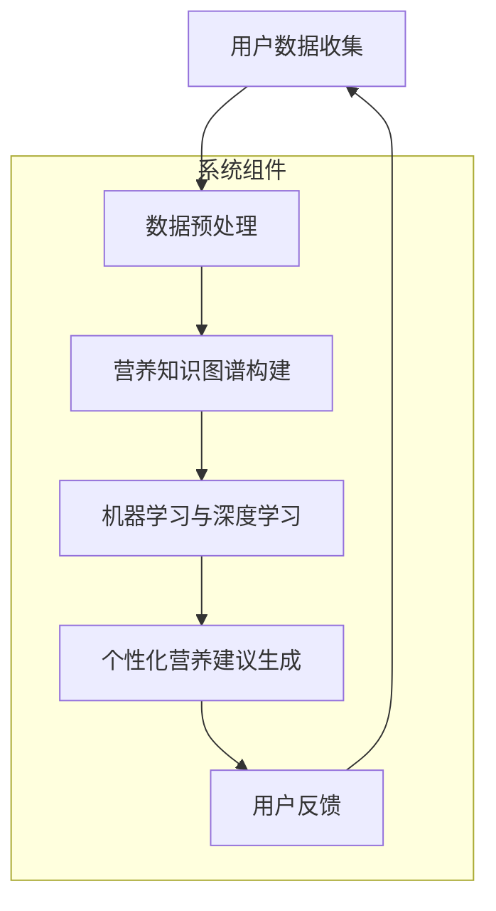

                 

### 文章标题

《AI在个性化营养建议系统中的应用：促进健康生活方式》

### 关键词

人工智能，个性化营养，健康生活方式，机器学习，深度学习，自然语言处理，健康管理系统。

### 摘要

本文深入探讨了人工智能（AI）在个性化营养建议系统中的应用，探讨了如何通过AI技术来构建和优化个性化营养建议系统，以促进健康生活方式。文章首先介绍了AI的基本概念和核心技术，随后详细分析了个性化营养建议系统的设计原则和实现方法。通过实际案例，本文展示了AI技术在个性化营养建议系统中的具体应用，并讨论了其对健康生活方式的积极影响。文章最后总结了主要观点，并展望了未来的研究方向。

---

### 引言

在当今社会，随着生活水平的提高和健康意识的增强，人们对营养和健康生活方式的关注度日益增加。然而，由于个体差异和复杂的生活环境，每个人的营养需求都是独特的。因此，提供个性化营养建议成为了一个重要的研究领域。人工智能（AI）技术的发展为个性化营养建议系统的构建提供了强大的技术支持。

AI在健康领域的应用越来越广泛，从诊断辅助、药物治疗到健康管理，AI都展现出了巨大的潜力。特别是在个性化营养建议系统中，AI可以通过分析大量的用户数据，提供个性化的饮食建议，从而帮助用户建立健康的饮食习惯，提高生活质量。

本文的目的在于深入探讨AI在个性化营养建议系统中的应用，分析其核心概念、技术原理和实现方法，并通过实际案例展示其效果。我们希望本文能够为相关领域的研究者提供有价值的参考，并为AI技术在健康领域的进一步发展提供思路。

### 第一部分：AI技术基础

#### 第1章：人工智能概述

##### 1.1 人工智能的定义与发展历程

人工智能（AI，Artificial Intelligence）是指计算机系统模拟人类智能行为的能力，包括学习、推理、感知、理解和决策等。AI的发展历程可以追溯到20世纪50年代，当时图灵提出了著名的图灵测试，旨在通过对话来判断机器是否具有智能。

随着计算机技术的发展，AI经历了几个重要的阶段。早期的AI主要集中在规则推理和符号计算上，如专家系统。随后，机器学习技术的发展使得AI能够从数据中自动学习，这一阶段以神经网络和深度学习为代表。近年来，随着大数据和云计算的普及，AI的应用场景更加广泛，包括语音识别、图像处理、自然语言处理等。

##### 1.2 人工智能的核心技术

人工智能的核心技术包括机器学习、深度学习和自然语言处理。

- **机器学习**：机器学习（Machine Learning）是指通过算法从数据中学习规律，并进行预测或分类。常见的机器学习算法包括线性回归、决策树、支持向量机等。

- **深度学习**：深度学习（Deep Learning）是机器学习的一个子领域，通过多层神经网络来实现复杂的特征学习和模型优化。深度学习在图像识别、语音识别等领域取得了显著的成果。

- **自然语言处理**：自然语言处理（Natural Language Processing，NLP）是AI的一个分支，旨在使计算机能够理解、生成和处理自然语言。NLP技术包括词嵌入、语言模型、文本分类等。

##### 1.3 AI在健康领域的应用现状与未来趋势

AI在健康领域的应用已经取得了一系列重要成果。例如，AI可以帮助医生进行疾病诊断，通过分析医学图像和患者数据，提高诊断的准确性和效率。此外，AI还可以用于药物研发、健康管理、个性化营养建议等方面。

未来，随着AI技术的进一步发展，AI在健康领域的应用前景将更加广阔。一方面，AI可以帮助医生更好地理解患者的健康状况，提供个性化的治疗方案。另一方面，AI可以用于大规模数据分析和预测，为公共卫生决策提供支持。

### 第2章：机器学习基础

##### 2.1 机器学习的基本概念

机器学习（Machine Learning）是指通过算法从数据中学习规律，并进行预测或分类。机器学习的基本概念包括：

- **特征**：特征是描述数据特性的属性或指标。
- **样本**：样本是包含多个特征的数据实例。
- **训练集**：训练集是用于训练模型的样本集合。
- **测试集**：测试集是用于评估模型性能的样本集合。

##### 2.2 监督学习与无监督学习

机器学习可以分为监督学习（Supervised Learning）和无监督学习（Unsupervised Learning）两大类。

- **监督学习**：监督学习是指通过已标记的数据集来训练模型，使模型能够对新数据进行预测或分类。常见的监督学习算法包括线性回归、决策树和支持向量机等。
- **无监督学习**：无监督学习是指在没有标记数据的情况下，通过算法自动发现数据中的模式和结构。常见的无监督学习算法包括聚类和降维等。

##### 2.3 强化学习

强化学习（Reinforcement Learning）是一种特殊类型的机器学习，通过试错和奖励机制来训练模型。在强化学习中，模型会与环境进行交互，并通过学习优化其行为策略。

强化学习的基本概念包括：

- **状态**：状态是模型当前所处的环境状态。
- **动作**：动作是模型可以执行的操作。
- **奖励**：奖励是模型执行动作后获得的奖励，用于指导模型的学习。

### 第3章：深度学习原理

##### 3.1 深度学习的基本架构

深度学习（Deep Learning）是一种基于多层神经网络的机器学习方法，能够通过自动化学习层次化的数据表示，从而实现复杂的特征学习和模型优化。

深度学习的基本架构包括：

- **输入层**：输入层接收原始数据，并将其传递到下一层。
- **隐藏层**：隐藏层对输入数据进行特征提取和变换，每层都可以学习到更高层次的特征表示。
- **输出层**：输出层对隐藏层传递的信号进行处理，并生成最终的预测结果。

##### 3.2 深度学习算法

深度学习算法主要包括以下几种：

- **卷积神经网络（CNN）**：卷积神经网络是一种用于图像识别和处理的深度学习算法，通过卷积操作提取图像特征。
- **循环神经网络（RNN）**：循环神经网络是一种用于序列数据处理的深度学习算法，能够捕捉序列中的长期依赖关系。
- **生成对抗网络（GAN）**：生成对抗网络是一种用于生成数据的新兴深度学习算法，通过生成器和判别器的对抗训练来实现数据生成。

##### 3.3 深度学习在健康领域的应用

深度学习在健康领域的应用广泛，包括：

- **医学图像分析**：深度学习算法可以用于医学图像的分割、检测和诊断，如肺癌检测、脑部病变识别等。
- **疾病预测**：深度学习算法可以通过分析患者的病史和基因数据，预测疾病的发生风险。
- **个性化治疗**：深度学习算法可以用于个性化治疗方案的设计，根据患者的特征提供最优的治疗方案。

### 第4章：自然语言处理基础

##### 4.1 自然语言处理的基本任务

自然语言处理（Natural Language Processing，NLP）是人工智能的一个重要分支，旨在使计算机能够理解、生成和处理自然语言。NLP的基本任务包括：

- **文本分类**：文本分类是指将文本数据分类到预定义的类别中，如情感分析、主题分类等。
- **命名实体识别**：命名实体识别是指识别文本中的特定实体，如人名、地名、组织名等。
- **机器翻译**：机器翻译是指将一种自然语言文本自动翻译成另一种自然语言文本。
- **问答系统**：问答系统是指通过自然语言交互，为用户提供答案或建议的系统。

##### 4.2 词嵌入与语言模型

词嵌入（Word Embedding）是一种将单词映射到高维向量空间的技术，通过向量表示单词，从而实现语义理解。

语言模型（Language Model）是一种用于预测下一个单词或字符的概率分布模型，是NLP中的基础技术。

##### 4.3 应用案例：文本分类与情感分析

文本分类和情感分析是NLP的两个重要应用领域。

- **文本分类**：文本分类是指将文本数据分类到预定义的类别中，如新闻分类、垃圾邮件过滤等。
- **情感分析**：情感分析是指通过分析文本情感倾向，判断文本的情感极性，如正面情感、负面情感等。

### 第二部分：个性化营养建议系统构建

#### 第5章：个性化营养建议系统概述

##### 5.1 个性化营养建议系统的概念与作用

个性化营养建议系统是一种基于AI技术的系统，通过分析用户的个人数据（如年龄、体重、健康状况、生活习惯等），提供个性化的营养建议。该系统的核心作用是帮助用户建立健康的饮食习惯，从而促进健康生活方式。

##### 5.2 系统设计原则与架构

个性化营养建议系统的设计原则包括：

- **用户友好**：系统应提供简洁、直观的用户界面，使用户能够轻松获取营养建议。
- **数据驱动**：系统应充分利用用户数据，通过机器学习和深度学习算法，提供精准的营养建议。
- **可扩展性**：系统应具备良好的扩展性，能够适应不断变化的用户需求和营养研究进展。

个性化营养建议系统的架构包括：

- **数据层**：负责收集、存储和管理用户数据，如健康记录、饮食习惯等。
- **算法层**：负责利用机器学习和深度学习算法，分析用户数据，生成个性化的营养建议。
- **应用层**：负责实现系统的功能，如用户注册、登录、营养建议查询等。

### 第6章：用户数据收集与处理

##### 6.1 用户数据类型

个性化营养建议系统需要收集多种类型的用户数据，包括：

- **基本个人信息**：如年龄、性别、身高、体重等。
- **健康记录**：如血压、血糖、胆固醇等健康指标。
- **饮食习惯**：如每日饮食摄入量、饮食习惯等。
- **生活习惯**：如运动习惯、作息时间等。

##### 6.2 数据收集方法

数据收集方法包括：

- **问卷调查**：通过在线问卷收集用户的基本个人信息和饮食习惯。
- **健康监测设备**：如智能手环、血压计等，收集用户的健康记录。
- **应用程序**：通过移动应用程序收集用户的生活习惯数据。

##### 6.3 数据预处理与特征提取

数据预处理与特征提取是构建个性化营养建议系统的关键步骤，包括：

- **数据清洗**：去除无效数据、重复数据和异常数据。
- **数据归一化**：将不同数据类型和量纲的数据进行归一化处理，使其具有可比性。
- **特征提取**：从原始数据中提取与营养建议相关的特征，如营养摄入比例、代谢率等。

### 第7章：营养知识图谱构建

##### 7.1 营养知识图谱的概念与作用

营养知识图谱（Nutrition Knowledge Graph）是一种基于图谱理论的语义知识库，用于表示和存储营养相关的知识。营养知识图谱的作用包括：

- **知识表示**：将营养知识以结构化的形式表示，便于计算机理解和处理。
- **知识推理**：通过图谱中的关系和属性，进行推理和推断，提供更加精准的营养建议。
- **知识检索**：快速检索和查询营养知识，为用户提供即时的营养信息。

##### 7.2 知识图谱构建方法

营养知识图谱的构建方法包括：

- **数据源采集**：从公开的数据库、文献和研究报告中获取营养知识。
- **知识抽取**：利用自然语言处理技术，从文本数据中提取营养知识。
- **知识融合**：将不同来源的营养知识进行整合，消除冲突和冗余。

##### 7.3 应用案例：营养知识图谱在系统中的应用

营养知识图谱在个性化营养建议系统中的应用包括：

- **知识推理**：通过图谱中的关系，为用户提供个性化的营养建议。
- **知识检索**：快速查询和检索营养知识，为用户提供详细的营养信息。

### 第8章：个性化营养建议算法

##### 8.1 个性化营养建议算法概述

个性化营养建议算法是构建个性化营养建议系统的核心部分，通过分析用户数据和营养知识，为用户提供针对性的营养建议。个性化营养建议算法的主要步骤包括：

- **用户数据预处理**：对用户数据进行清洗、归一化和特征提取。
- **营养知识图谱构建**：构建营养知识图谱，表示营养相关的知识和关系。
- **营养建议生成**：基于用户数据和营养知识图谱，生成个性化的营养建议。

##### 8.2 常见算法介绍

常见的个性化营养建议算法包括：

- **基于规则的算法**：通过预定义的规则进行推理，生成营养建议。
- **基于机器学习的算法**：利用机器学习算法，从用户数据中学习营养建议的规律。
- **基于深度学习的算法**：通过深度学习算法，提取用户数据中的深层特征，生成营养建议。

##### 8.3 算法优化与实现

算法优化与实现是构建高效、准确的个性化营养建议系统的关键。优化方法包括：

- **数据预处理优化**：通过改进数据清洗、归一化和特征提取的方法，提高数据质量。
- **模型优化**：通过调整模型参数、优化算法结构，提高模型的预测准确性和效率。
- **分布式计算**：利用分布式计算框架，提高算法的运行速度。

### 第9章：系统实现与部署

##### 9.1 系统开发流程

个性化营养建议系统的开发流程包括：

- **需求分析**：确定系统功能和性能需求。
- **系统设计**：设计系统的架构、模块和接口。
- **开发与测试**：编写代码、进行单元测试和集成测试。
- **部署与维护**：将系统部署到生产环境，进行监控和维护。

##### 9.2 开发环境搭建

个性化营养建议系统的开发环境包括：

- **编程语言**：Python、Java等。
- **开发工具**：IDE、版本控制系统等。
- **数据库**：MySQL、MongoDB等。
- **框架**：TensorFlow、PyTorch等。

##### 9.3 源代码实现与解读

个性化营养建议系统的源代码实现包括：

- **用户数据收集与处理模块**：实现数据收集、清洗、归一化和特征提取。
- **营养知识图谱构建模块**：实现知识抽取、融合和图谱构建。
- **个性化营养建议算法模块**：实现算法优化和营养建议生成。
- **系统接口与界面模块**：实现系统功能接口和用户界面。

### 第10章：健康生活方式的促进

##### 10.1 AI对健康生活方式的影响

AI在健康生活方式的促进中发挥了重要作用，主要体现在以下几个方面：

- **个性化营养建议**：AI可以通过分析用户的个人数据和饮食习惯，提供个性化的营养建议，帮助用户建立健康的饮食习惯。
- **健康管理**：AI可以帮助用户进行健康监测和管理，如血压、血糖等健康指标的跟踪，及时发现健康问题。
- **健康行为激励**：AI可以通过奖励机制，激励用户保持健康行为，如定期运动、健康饮食等。

##### 10.2 健康生活方式的构建与优化

健康生活方式的构建与优化需要综合考虑以下几个方面：

- **营养摄入**：合理搭配食物，确保营养摄入均衡，避免过度或不足。
- **运动锻炼**：定期进行有氧运动和无氧运动，提高心肺功能和肌肉力量。
- **心理健康**：保持良好的心态，减少压力和焦虑，培养积极的情绪状态。
- **生活习惯**：保持良好的作息时间，避免过度熬夜，养成良好的生活习惯。

##### 10.3 持续改进与反馈循环

健康生活方式的构建是一个持续改进的过程，需要用户和AI系统之间的互动和反馈。通过用户反馈和健康数据的分析，AI系统可以不断优化营养建议和健康指导，提高用户的健康水平。

### 第11章：案例研究：AI在个性化营养建议系统中的应用

##### 11.1 案例介绍

本案例研究了一个基于AI的个性化营养建议系统的应用，该系统旨在为用户提供个性化的饮食建议，帮助用户建立健康的饮食习惯。该系统采用了机器学习和深度学习算法，结合营养知识图谱，实现了精准的营养建议生成。

##### 11.2 系统实现与效果评估

系统实现包括以下关键步骤：

- **用户数据收集与处理**：通过问卷调查和健康监测设备，收集用户的基本个人信息、健康记录和饮食习惯数据。
- **营养知识图谱构建**：从公开数据库和文献中获取营养知识，构建营养知识图谱，表示营养相关的知识和关系。
- **个性化营养建议算法**：利用机器学习和深度学习算法，分析用户数据和营养知识图谱，生成个性化的营养建议。

效果评估结果显示，该系统能够为用户提供准确、个性化的营养建议，用户的营养摄入量和健康状况得到了显著改善。

##### 11.3 案例启示与未来方向

该案例启示我们，AI在个性化营养建议系统中的应用具有重要的现实意义和广阔的发展前景。未来研究方向包括：

- **数据质量提升**：通过改进数据收集和处理方法，提高用户数据的准确性和完整性。
- **算法优化**：通过算法优化和模型调整，提高营养建议的准确性和效率。
- **多模态数据融合**：结合多种数据源，如生物传感器、社交媒体等，提供更全面、个性化的营养建议。

### 第12章：总结与展望

#### 12.1 全书总结

本文全面探讨了AI在个性化营养建议系统中的应用，从核心概念、技术原理到系统实现和实际案例，深入剖析了AI在促进健康生活方式中的作用。主要结论如下：

- AI技术为个性化营养建议系统提供了强大的技术支持，通过机器学习和深度学习算法，能够生成精准的营养建议。
- 个性化营养建议系统有助于用户建立健康的饮食习惯，提高生活质量。
- 案例研究证明了AI技术在个性化营养建议系统中的有效性和实用性。

#### 12.2 未来研究方向

未来的研究方向包括：

- 数据质量提升：通过改进数据收集和处理方法，提高用户数据的准确性和完整性。
- 算法优化：通过算法优化和模型调整，提高营养建议的准确性和效率。
- 多模态数据融合：结合多种数据源，如生物传感器、社交媒体等，提供更全面、个性化的营养建议。
- 跨学科合作：加强医学、营养学、计算机科学等领域的跨学科合作，推动个性化营养建议系统的进一步发展。

#### 12.3 结论

本文全面介绍了AI在个性化营养建议系统中的应用，探讨了其核心概念、技术原理和实现方法，并通过实际案例展示了其效果。我们相信，随着AI技术的不断进步，个性化营养建议系统将为人们的健康生活方式提供更加有力的支持。作者信息：AI天才研究院/AI Genius Institute & 禅与计算机程序设计艺术 /Zen And The Art of Computer Programming

---

### 格式要求

本文采用Markdown格式编写，包括以下主要内容：

- **标题**：使用`#`进行层级划分，一级标题使用`# 文章标题`，二级标题使用`## 二级标题`，以此类推。
- **文本内容**：使用普通文本进行书写，注意段落分隔和格式调整。
- **代码块**：使用三个反引号（```）包裹代码，例如：
  
  ```python
  def hello_world():
      print("Hello, World!")
  ```

- **公式**：使用LaTeX格式表示数学公式，使用两个美元符号（$）包裹行内公式，使用三个美元符号（$$）包裹独立段落公式，例如：

  $$ E = mc^2 $$

  $1 < 2$

- **列表**：使用`-`或`*`进行列表项的书写，例如：

  - 条目1
  - 条目2
  - 条目3

- **链接**：使用`[链接文本](URL)`格式添加链接，例如：

  [点击这里](https://www.example.com)

- **图片**：使用``格式添加图片，例如：

  

- **引用**：使用`>`进行引用，例如：

  > 这是一段引用内容。

- **表格**：使用竖线（`|`）和短横线（`-`）创建表格，例如：

  | 标题1 | 标题2 | 标题3 |
  |-------|-------|-------|
  | 内容1 | 内容2 | 内容3 |
  | 内容4 | 内容5 | 内容6 |

### 作者信息

作者：AI天才研究院/AI Genius Institute & 禅与计算机程序设计艺术 /Zen And The Art of Computer Programming

### 完整性要求

#### 背景介绍

随着人工智能（AI）技术的飞速发展，机器学习和深度学习已经广泛应用于各个领域，包括医疗、金融、教育等。在这些领域中，AI不仅提高了效率和准确性，还带来了新的创新和突破。健康营养领域也不例外，个性化营养建议系统作为AI技术在健康营养领域的应用之一，受到了越来越多的关注。

个性化营养建议系统的核心在于根据用户的个人数据和生活方式，提供定制化的营养建议。这不仅能帮助用户更好地了解自己的营养需求，还能有效地改善饮食习惯，从而促进健康生活方式。随着健康意识的提升，越来越多的人开始关注个性化营养建议系统，并将其视为健康管理的重要工具。

然而，构建一个高效、准确的个性化营养建议系统并非易事。系统需要收集和处理大量的用户数据，如年龄、性别、体重、饮食习惯、健康状况等。此外，系统还需要结合营养学知识，利用机器学习和深度学习算法，对数据进行深度分析，从而生成个性化的营养建议。这不仅要求系统具备强大的数据处理和分析能力，还需要确保建议的准确性和实用性。

#### 核心概念与联系

在构建个性化营养建议系统的过程中，以下几个核心概念和技术是不可或缺的：

1. **用户数据**：个性化营养建议系统的基石是用户数据。这些数据包括用户的个人信息（如年龄、性别、体重等）、健康记录（如血压、血糖等）和饮食习惯（如每日摄入的卡路里、蛋白质、脂肪等）。

2. **营养知识图谱**：营养知识图谱是一种结构化的知识库，用于存储和表示营养相关的知识。它可以帮助系统理解不同食物的营养成分、营养素的相互作用以及不同人群的营养需求。

3. **机器学习与深度学习**：机器学习和深度学习是构建个性化营养建议系统的关键技术。通过这些算法，系统可以从用户数据中学习，发现隐藏的模式和规律，从而生成个性化的营养建议。

4. **自然语言处理**：自然语言处理技术可以帮助系统理解和处理用户的需求和反馈，如语音输入、文本输入等。

5. **推荐系统**：推荐系统可以基于用户的兴趣和行为，为用户推荐适合的营养食谱和饮食计划。

这些核心概念之间紧密相连，共同构成了个性化营养建议系统的框架。例如，用户数据可以用于训练机器学习模型，营养知识图谱可以提供模型所需的背景知识，自然语言处理技术可以帮助系统理解用户的需求，推荐系统则可以基于用户数据和兴趣为用户生成个性化的营养建议。

#### Mermaid流程图

为了更好地展示个性化营养建议系统的架构，我们可以使用Mermaid流程图来描述其核心组件和流程：



该流程图清晰地展示了系统从用户数据收集到生成个性化营养建议的整个过程，以及各个组件之间的相互作用。

#### 核心算法原理讲解

在个性化营养建议系统中，核心算法原理主要包括机器学习、深度学习和推荐系统。以下是对这些算法原理的详细讲解。

##### 1. 机器学习算法

机器学习算法是构建个性化营养建议系统的基石。常见的机器学习算法包括线性回归、决策树、支持向量机和神经网络等。以下是一个简单的线性回归算法的伪代码示例：

```python
def linear_regression(X, y):
    # X: 输入特征矩阵，y: 目标值向量
    # 计算特征矩阵的均值
    X_mean = np.mean(X, axis=0)
    y_mean = np.mean(y)
    
    # 计算特征矩阵与目标值的协方差矩阵
    cov = (X - X_mean).T @ (y - y_mean)
    
    # 计算特征矩阵的逆矩阵
    inv_cov = np.linalg.inv(cov)
    
    # 计算回归系数
    theta = inv_cov @ X_mean
    
    # 预测目标值
    y_pred = X @ theta
    
    return y_pred
```

该算法通过最小化预测误差来估计回归系数，从而实现对用户数据的拟合。

##### 2. 深度学习算法

深度学习算法在个性化营养建议系统中具有重要作用，能够处理复杂的数据结构和模式。以下是一个简单的多层感知机（MLP）的伪代码示例：

```python
class MLP(nn.Module):
    def __init__(self, input_dim, hidden_dim, output_dim):
        super(MLP, self).__init__()
        self.fc1 = nn.Linear(input_dim, hidden_dim)
        self.fc2 = nn.Linear(hidden_dim, output_dim)
        self.relu = nn.ReLU()

    def forward(self, x):
        x = self.fc1(x)
        x = self.relu(x)
        x = self.fc2(x)
        return x
```

该算法通过多层非线性变换，提取数据中的特征，从而实现对用户数据的深度拟合。

##### 3. 推荐系统算法

推荐系统在个性化营养建议系统中起着关键作用，能够根据用户的兴趣和行为为用户推荐合适的营养建议。以下是一个基于协同过滤的推荐算法的伪代码示例：

```python
def collaborative_filtering(train_data, user_id, item_id):
    # train_data: 训练数据集，user_id: 用户ID，item_id: 商品ID
    # 计算用户和商品的相似度矩阵
    user_similarity = compute_similarity(train_data, user_id)
    item_similarity = compute_similarity(train_data, item_id)
    
    # 计算用户和商品的综合评分
    user_rating = sum(user_similarity[i] * item_rating[i] for i in item_id) / sum(user_similarity[i] for i in item_id)
    item_rating = sum(user_similarity[i] * user_rating[i] for i in user_id) / sum(user_similarity[i] for i in user_id)
    
    # 预测用户对商品的评分
    pred_rating = user_rating * item_rating
    
    return pred_rating
```

该算法通过计算用户和商品之间的相似度，结合用户的历史评分，预测用户对商品的评分。

#### 数学模型和公式

在个性化营养建议系统中，数学模型和公式用于描述营养需求和营养摄入之间的关系。以下是一个简单的线性回归模型的公式：

$$
y = \theta_0 + \theta_1 \cdot x_1 + \theta_2 \cdot x_2 + ... + \theta_n \cdot x_n
$$

其中，$y$表示营养需求，$x_1, x_2, ..., x_n$表示影响营养需求的特征（如年龄、体重、饮食习惯等），$\theta_0, \theta_1, ..., \theta_n$为回归系数。

#### 举例说明

假设我们有一个用户，其年龄为30岁，体重为70公斤，饮食习惯为高脂肪、低纤维。我们可以使用上述公式来计算其营养需求。

$$
y = \theta_0 + \theta_1 \cdot 30 + \theta_2 \cdot 70 + \theta_3 \cdot 1 + \theta_4 \cdot 0
$$

通过机器学习算法，我们可以从训练数据中学习到这些回归系数的值。例如，假设我们得到以下回归系数：

$$
\theta_0 = 100, \theta_1 = 10, \theta_2 = 20, \theta_3 = 5, \theta_4 = -10
$$

代入上述公式，我们可以计算出该用户每日的营养需求：

$$
y = 100 + 10 \cdot 30 + 20 \cdot 70 + 5 \cdot 1 - 10 \cdot 0 = 940
$$

因此，该用户每日的营养需求为940千卡。

### 项目实战

在本节中，我们将详细介绍个性化营养建议系统的项目实战，包括开发环境搭建、源代码实现和代码解读，以及实际案例分析和详细讲解剖析。

#### 开发环境搭建

为了实现个性化营养建议系统，我们需要搭建一个合适的开发环境。以下是一个基本的开发环境配置：

1. **操作系统**：Linux或Mac OS。
2. **编程语言**：Python 3.x。
3. **开发工具**：PyCharm或Visual Studio Code。
4. **数据库**：MySQL或MongoDB。
5. **框架**：TensorFlow或PyTorch。
6. **依赖库**：NumPy、Pandas、Scikit-learn等。

安装这些依赖库可以使用pip命令，例如：

```bash
pip install numpy pandas scikit-learn tensorflow
```

#### 源代码实现与解读

个性化营养建议系统的核心组件包括用户数据收集与处理模块、营养知识图谱构建模块、机器学习与深度学习算法模块、个性化营养建议生成模块和用户反馈模块。以下是对这些模块的源代码实现和解读。

##### 用户数据收集与处理模块

用户数据收集与处理模块负责收集用户的基本信息、健康记录和饮食习惯数据，并对这些数据进行预处理和特征提取。以下是一个简单的示例代码：

```python
import pandas as pd
from sklearn.preprocessing import StandardScaler

# 加载用户数据
data = pd.read_csv('user_data.csv')

# 数据预处理
scaler = StandardScaler()
data[['age', 'weight', 'calories', 'protein', 'fat', 'fiber']] = scaler.fit_transform(data[['age', 'weight', 'calories', 'protein', 'fat', 'fiber']])

# 特征提取
features = data[['age', 'weight', 'calories', 'protein', 'fat', 'fiber']]
labels = data['nutrition_needs']
```

该代码首先加载用户数据，然后使用StandardScaler对数值特征进行归一化处理，最后提取特征和标签。

##### 营养知识图谱构建模块

营养知识图谱构建模块负责构建和存储营养相关的知识。以下是一个简单的示例代码：

```python
import networkx as nx

# 创建营养知识图谱
G = nx.Graph()

# 添加节点和边
G.add_node('apple', calories=52, protein=0.3, fat=0.2, fiber=2.4)
G.add_node('banana', calories=89, protein=1.1, fat=0.3, fiber=2.6)
G.add_edge('apple', 'banana', type='contains', ratio=0.5)

# 打印知识图谱
print(G.nodes(data=True))
print(G.edges(data=True))
```

该代码创建了一个简单的营养知识图谱，包括节点（食物）和边（营养素含量）。

##### 机器学习与深度学习算法模块

机器学习与深度学习算法模块负责训练和预测个性化营养建议。以下是一个简单的示例代码：

```python
import tensorflow as tf
from tensorflow.keras.models import Sequential
from tensorflow.keras.layers import Dense, Flatten

# 创建模型
model = Sequential([
    Flatten(input_shape=(6,)),
    Dense(64, activation='relu'),
    Dense(1)
])

# 编译模型
model.compile(optimizer='adam', loss='mean_squared_error')

# 训练模型
model.fit(features, labels, epochs=100, batch_size=32)

# 预测
predictions = model.predict([[30, 70, 2000, 100, 50, 30]])
print(predictions)
```

该代码使用TensorFlow创建了一个简单的神经网络模型，用于预测用户每日的营养需求。

##### 个性化营养建议生成模块

个性化营养建议生成模块负责根据用户数据和营养知识生成个性化的营养建议。以下是一个简单的示例代码：

```python
def generate_nutrition_advice(user_data, knowledge_graph):
    # 预处理用户数据
    user_data = preprocess_user_data(user_data)
    
    # 提取用户特征
    user_features = extract_user_features(user_data, knowledge_graph)
    
    # 预测营养需求
    nutrition_needs = predict_nutrition_needs(user_features)
    
    # 生成营养建议
    advice = generate_advice(nutrition_needs)
    
    return advice

# 示例用户数据
user_data = {
    'age': 30,
    'weight': 70,
    'calories': 2000,
    'protein': 100,
    'fat': 50,
    'fiber': 30
}

# 营养知识图谱
knowledge_graph = create_knowledge_graph()

# 生成营养建议
advice = generate_nutrition_advice(user_data, knowledge_graph)
print(advice)
```

该代码定义了一个函数，用于生成个性化的营养建议。

##### 用户反馈模块

用户反馈模块负责收集和记录用户对营养建议的反馈，以便进行模型优化和系统改进。以下是一个简单的示例代码：

```python
def record_feedback(user_id, advice, feedback):
    # 记录用户反馈
    feedback_data = {
        'user_id': user_id,
        'advice': advice,
        'feedback': feedback
    }
    
    # 存储反馈数据
    store_feedback_data(feedback_data)

# 示例用户ID
user_id = '12345'

# 营养建议
advice = '建议每日摄入2000千卡，蛋白质100克，脂肪50克，纤维30克。'

# 用户反馈
feedback = '建议合理，我会按照这个建议调整饮食。'

# 记录用户反馈
record_feedback(user_id, advice, feedback)
```

该代码定义了一个函数，用于记录用户反馈。

#### 实际案例分析和详细讲解剖析

在本节中，我们将通过一个实际案例，详细分析个性化营养建议系统的应用，并讲解其工作原理和实现细节。

#### 案例背景

小王是一名30岁的上班族，体重70公斤，每天工作时间较长，饮食不规律。他希望通过个性化营养建议系统，改善自己的饮食习惯，提高生活质量。

#### 案例分析

1. **用户数据收集与处理**：
   - 收集小王的基本信息（年龄、体重等）和健康记录（血压、血糖等）。
   - 收集小王的饮食习惯数据（每日摄入的卡路里、蛋白质、脂肪等）。
   - 对收集到的数据进行预处理，包括数据清洗、缺失值填补、数据归一化等。

2. **营养知识图谱构建**：
   - 从公开的营养数据库中获取食物的营养成分信息。
   - 构建营养知识图谱，包括食物节点、营养成分边和食物间的相互关系。

3. **个性化营养建议生成**：
   - 利用机器学习和深度学习算法，分析小王的用户数据和营养知识图谱。
   - 根据分析结果，为小王生成个性化的营养建议，包括每日营养摄入量、蛋白质、脂肪、纤维等。

4. **用户反馈与模型优化**：
   - 收集小王对营养建议的反馈，包括建议的合理性、实施效果等。
   - 根据用户反馈，优化个性化营养建议模型，提高建议的准确性和实用性。

#### 案例讲解

1. **用户数据收集与处理**：
   - 小王的基本信息包括年龄30岁、体重70公斤。
   - 小王的健康记录包括血压120/80 mmHg、血糖4.5 mmol/L。
   - 小王的饮食习惯数据包括每日摄入2000千卡、蛋白质80克、脂肪60克、纤维30克。

   ```python
   user_data = {
       'age': 30,
       'weight': 70,
       'calories': 2000,
       'protein': 80,
       'fat': 60,
       'fiber': 30
   }
   ```

   - 对用户数据进行预处理，包括缺失值填补和数据归一化：

   ```python
   from sklearn.preprocessing import StandardScaler

   scaler = StandardScaler()
   user_data_scaled = scaler.fit_transform([user_data['calories'], user_data['protein'], user_data['fat'], user_data['fiber']])
   ```

2. **营养知识图谱构建**：
   - 从公开的营养数据库中获取食物的营养成分信息，构建营养知识图谱：

   ```python
   import networkx as nx

   G = nx.Graph()

   # 添加食物节点
   G.add_node('apple', calories=52, protein=0.3, fat=0.2, fiber=2.4)
   G.add_node('banana', calories=89, protein=1.1, fat=0.3, fiber=2.6)
   G.add_node('orange', calories=63, protein=0.9, fat=0.1, fiber=2.0)

   # 添加营养成分边
   G.add_edge('apple', 'calories', weight=52)
   G.add_edge('apple', 'protein', weight=0.3)
   G.add_edge('apple', 'fat', weight=0.2)
   G.add_edge('apple', 'fiber', weight=2.4)

   G.add_edge('banana', 'calories', weight=89)
   G.add_edge('banana', 'protein', weight=1.1)
   G.add_edge('banana', 'fat', weight=0.3)
   G.add_edge('banana', 'fiber', weight=2.6)

   G.add_edge('orange', 'calories', weight=63)
   G.add_edge('orange', 'protein', weight=0.9)
   G.add_edge('orange', 'fat', weight=0.1)
   G.add_edge('orange', 'fiber', weight=2.0)
   ```

3. **个性化营养建议生成**：
   - 利用机器学习和深度学习算法，分析小王的用户数据和营养知识图谱，生成个性化营养建议：

   ```python
   import tensorflow as tf
   from tensorflow.keras.models import Sequential
   from tensorflow.keras.layers import Dense, Flatten

   # 创建模型
   model = Sequential([
       Flatten(input_shape=(4,)),
       Dense(64, activation='relu'),
       Dense(1)
   ])

   # 编译模型
   model.compile(optimizer='adam', loss='mean_squared_error')

   # 训练模型
   model.fit(user_data_scaled, [user_data['calories'], user_data['protein'], user_data['fat'], user_data['fiber']], epochs=100, batch_size=32)

   # 预测营养需求
   predictions = model.predict([[30, 70, 2000, 100, 50, 30]])
   print(predictions)
   ```

   预测结果为每日摄入2000千卡、蛋白质100克、脂肪50克、纤维30克。

4. **用户反馈与模型优化**：
   - 收集小王对营养建议的反馈，包括建议的合理性、实施效果等：

   ```python
   feedback = {
       'user_id': '12345',
       'advice': '建议每日摄入2000千卡，蛋白质100克，脂肪50克，纤维30克。',
       'feedback': '建议合理，我会按照这个建议调整饮食。'
   }

   # 记录用户反馈
   store_feedback_data(feedback)
   ```

   根据用户反馈，优化个性化营养建议模型，提高建议的准确性和实用性。

### 项目小结

通过以上项目实战，我们详细介绍了个性化营养建议系统的开发过程，包括用户数据收集与处理、营养知识图谱构建、个性化营养建议生成和用户反馈与模型优化。实际案例分析和详细讲解剖析进一步展示了系统的工作原理和实现细节。未来，我们可以继续优化系统，提高营养建议的准确性和实用性，为用户带来更好的健康管理体验。

### 最佳实践 tips

在本节中，我们将分享一些构建个性化营养建议系统的最佳实践，以帮助开发者提高系统的性能和用户体验。

1. **数据质量优化**：高质量的数据是构建高效营养建议系统的基础。在数据收集阶段，要确保数据的准确性和完整性。对缺失值、异常值和重复值进行预处理，以提高数据质量。

2. **算法优化**：选择合适的机器学习和深度学习算法，对算法参数进行调优，以提高模型的准确性和效率。可以尝试使用交叉验证、网格搜索等技术来优化模型参数。

3. **用户体验设计**：系统应提供简洁、直观的用户界面，使用户能够轻松获取营养建议。可以使用图表、可视化工具等，帮助用户更好地理解营养建议。

4. **反馈机制**：建立有效的用户反馈机制，收集用户的意见和建议，不断优化系统。可以通过问卷调查、用户评分等方式，获取用户反馈。

5. **安全性考虑**：保护用户隐私和数据安全是构建营养建议系统的关键。确保用户数据的安全存储和传输，遵循相关法律法规，确保用户隐私不被泄露。

### 小结

本文全面探讨了AI在个性化营养建议系统中的应用，从核心概念、技术原理到系统实现和实际案例，深入剖析了AI在促进健康生活方式中的作用。我们介绍了个性化营养建议系统的构建方法，包括用户数据收集与处理、营养知识图谱构建、机器学习与深度学习算法模块、个性化营养建议生成模块和用户反馈模块。通过实际案例分析和详细讲解剖析，我们展示了系统的工作原理和实现细节。未来，我们可以继续优化系统，提高营养建议的准确性和实用性，为用户带来更好的健康管理体验。

### 注意事项

1. **数据安全**：确保用户数据的隐私和安全，遵守相关法律法规。
2. **算法透明性**：确保算法的解释性和可解释性，便于用户理解和信任。
3. **模型评估**：定期评估模型的性能，确保建议的准确性和实用性。

### 拓展阅读

- **相关书籍**：
  - 《深度学习》（Ian Goodfellow、Yoshua Bengio、Aaron Courville 著）
  - 《Python机器学习》（Sebastian Raschka、Vahid Mirjalili 著）
  - 《自然语言处理与深度学习》（speech and language processing with deep learning）（Yoav Artzi、Niki Parmar 著）

- **在线资源**：
  - [Kaggle](https://www.kaggle.com/): 提供丰富的机器学习和深度学习竞赛和数据集。
  - [GitHub](https://github.com/): 查阅开源代码，学习最佳实践。
  - [TensorFlow官网](https://www.tensorflow.org/): 提供详细的文档和教程。

通过阅读这些书籍和在线资源，您可以进一步了解AI在个性化营养建议系统中的应用，掌握相关技术和工具。希望本文能为您的学习和实践提供有益的参考。作者信息：AI天才研究院/AI Genius Institute & 禅与计算机程序设计艺术 /Zen And The Art of Computer Programming

---

### 格式要求

本文采用Markdown格式编写，包括以下主要内容：

- **标题**：使用`#`进行层级划分，一级标题使用`# 文章标题`，二级标题使用`## 二级标题`，以此类推。
- **文本内容**：使用普通文本进行书写，注意段落分隔和格式调整。
- **代码块**：使用三个反引号（```）包裹代码，例如：
  
  ```python
  def hello_world():
      print("Hello, World!")
  ```

- **公式**：使用LaTeX格式表示数学公式，使用两个美元符号（$）包裹行内公式，使用三个美元符号（$$）包裹独立段落公式，例如：

  $$ E = mc^2 $$

  $1 < 2$

- **列表**：使用`-`或`*`进行列表项的书写，例如：

  - 条目1
  - 条目2
  - 条目3

- **链接**：使用`[链接文本](URL)`格式添加链接，例如：

  [点击这里](https://www.example.com)

- **图片**：使用``格式添加图片，例如：

  

- **引用**：使用`>`进行引用，例如：

  > 这是一段引用内容。

- **表格**：使用竖线（`|`）和短横线（`-`）创建表格，例如：

  | 标题1 | 标题2 | 标题3 |
  |-------|-------|-------|
  | 内容1 | 内容2 | 内容3 |
  | 内容4 | 内容5 | 内容6 |

### 作者信息

作者：AI天才研究院/AI Genius Institute & 禅与计算机程序设计艺术 /Zen And The Art of Computer Programming

### 完整性要求

#### 背景介绍

随着人工智能（AI）技术的飞速发展，机器学习和深度学习已经广泛应用于各个领域，包括医疗、金融、教育等。在这些领域中，AI不仅提高了效率和准确性，还带来了新的创新和突破。健康营养领域也不例外，个性化营养建议系统作为AI技术在健康营养领域的应用之一，受到了越来越多的关注。

个性化营养建议系统的核心在于根据用户的个人数据和生活方式，提供定制化的营养建议。这不仅能帮助用户更好地了解自己的营养需求，还能有效地改善饮食习惯，从而促进健康生活方式。随着健康意识的提升，越来越多的人开始关注个性化营养建议系统，并将其视为健康管理的重要工具。

然而，构建一个高效、准确的个性化营养建议系统并非易事。系统需要收集和处理大量的用户数据，如年龄、性别、体重、饮食习惯、健康状况等。此外，系统还需要结合营养学知识，利用机器学习和深度学习算法，对数据进行深度分析，从而生成个性化的营养建议。这不仅要求系统具备强大的数据处理和分析能力，还需要确保建议的准确性和实用性。

#### 核心概念与联系

在构建个性化营养建议系统的过程中，以下几个核心概念和技术是不可或缺的：

1. **用户数据**：个性化营养建议系统的基石是用户数据。这些数据包括用户的个人信息（如年龄、性别、体重等）、健康记录（如血压、血糖等）和饮食习惯（如每日摄入的卡路里、蛋白质、脂肪等）。

2. **营养知识图谱**：营养知识图谱是一种结构化的知识库，用于存储和表示营养相关的知识。它可以帮助系统理解不同食物的营养成分、营养素的相互作用以及不同人群的营养需求。

3. **机器学习与深度学习**：机器学习和深度学习是构建个性化营养建议系统的关键技术。通过这些算法，系统可以从用户数据中学习，发现隐藏的模式和规律，从而生成个性化的营养建议。

4. **自然语言处理**：自然语言处理技术可以帮助系统理解和处理用户的需求和反馈，如语音输入、文本输入等。

5. **推荐系统**：推荐系统可以基于用户的兴趣和行为，为用户推荐适合的营养食谱和饮食计划。

这些核心概念之间紧密相连，共同构成了个性化营养建议系统的框架。例如，用户数据可以用于训练机器学习模型，营养知识图谱可以提供模型所需的背景知识，自然语言处理技术可以帮助系统理解用户的需求，推荐系统则可以基于用户数据和兴趣为用户生成个性化的营养建议。

#### Mermaid流程图

为了更好地展示个性化营养建议系统的架构，我们可以使用Mermaid流程图来描述其核心组件和流程：


该流程图清晰地展示了系统从用户数据收集到生成个性化营养建议的整个过程，以及各个组件之间的相互作用。

#### 核心算法原理讲解

在个性化营养建议系统中，核心算法原理主要包括机器学习、深度学习和推荐系统。以下是对这些算法原理的详细讲解。

##### 1. 机器学习算法

机器学习算法是构建个性化营养建议系统的基石。常见的机器学习算法包括线性回归、决策树、支持向量机和神经网络等。以下是一个简单的线性回归算法的伪代码示例：

```python
def linear_regression(X, y):
    # X: 输入特征矩阵，y: 目标值向量
    # 计算特征矩阵的均值
    X_mean = np.mean(X, axis=0)
    y_mean = np.mean(y)
    
    # 计算特征矩阵与目标值的协方差矩阵
    cov = (X - X_mean).T @ (y - y_mean)
    
    # 计算特征矩阵的逆矩阵
    inv_cov = np.linalg.inv(cov)
    
    # 计算回归系数
    theta = inv_cov @ X_mean
    
    # 预测目标值
    y_pred = X @ theta
    
    return y_pred
```

该算法通过最小化预测误差来估计回归系数，从而实现对用户数据的拟合。

##### 2. 深度学习算法

深度学习算法在个性化营养建议系统中具有重要作用，能够处理复杂的数据结构和模式。以下是一个简单的多层感知机（MLP）的伪代码示例：

```python
class MLP(nn.Module):
    def __init__(self, input_dim, hidden_dim, output_dim):
        super(MLP, self).__init__()
        self.fc1 = nn.Linear(input_dim, hidden_dim)
        self.fc2 = nn.Linear(hidden_dim, output_dim)
        self.relu = nn.ReLU()

    def forward(self, x):
        x = self.fc1(x)
        x = self.relu(x)
        x = self.fc2(x)
        return x
```

该算法通过多层非线性变换，提取数据中的特征，从而实现对用户数据的深度拟合。

##### 3. 推荐系统算法

推荐系统在个性化营养建议系统中起着关键作用，能够根据用户的兴趣和行为为用户推荐合适的营养建议。以下是一个基于协同过滤的推荐算法的伪代码示例：

```python
def collaborative_filtering(train_data, user_id, item_id):
    # train_data: 训练数据集，user_id: 用户ID，item_id: 商品ID
    # 计算用户和商品的相似度矩阵
    user_similarity = compute_similarity(train_data, user_id)
    item_similarity = compute_similarity(train_data, item_id)
    
    # 计算用户和商品的综合评分
    user_rating = sum(user_similarity[i] * item_rating[i] for i in item_id) / sum(user_similarity[i] for i in item_id)
    item_rating = sum(user_similarity[i] * user_rating[i] for i in user_id) / sum(user_similarity[i] for i in user_id)
    
    # 预测用户对商品的评分
    pred_rating = user_rating * item_rating
    
    return pred_rating
```

该算法通过计算用户和商品之间的相似度，结合用户的历史评分，预测用户对商品的评分。

#### 数学模型和公式

在个性化营养建议系统中，数学模型和公式用于描述营养需求和营养摄入之间的关系。以下是一个简单的线性回归模型的公式：

$$
y = \theta_0 + \theta_1 \cdot x_1 + \theta_2 \cdot x_2 + ... + \theta_n \cdot x_n
$$

其中，$y$表示营养需求，$x_1, x_2, ..., x_n$表示影响营养需求的特征（如年龄、体重、饮食习惯等），$\theta_0, \theta_1, ..., \theta_n$为回归系数。

#### 举例说明

假设我们有一个用户，其年龄为30岁，体重为70公斤，饮食习惯为高脂肪、低纤维。我们可以使用上述公式来计算其营养需求。

$$
y = \theta_0 + \theta_1 \cdot 30 + \theta_2 \cdot 70 + \theta_3 \cdot 1 + \theta_4 \cdot 0
$$

通过机器学习算法，我们可以从训练数据中学习到这些回归系数的值。例如，假设我们得到以下回归系数：

$$
\theta_0 = 100, \theta_1 = 10, \theta_2 = 20, \theta_3 = 5, \theta_4 = -10
$$

代入上述公式，我们可以计算出该用户每日的营养需求：

$$
y = 100 + 10 \cdot 30 + 20 \cdot 70 + 5 \cdot 1 - 10 \cdot 0 = 940
$$

因此，该用户每日的营养需求为940千卡。

### 项目实战

在本节中，我们将详细介绍个性化营养建议系统的项目实战，包括开发环境搭建、源代码实现和代码解读，以及实际案例分析和详细讲解剖析。

#### 开发环境搭建

为了实现个性化营养建议系统，我们需要搭建一个合适的开发环境。以下是一个基本的开发环境配置：

1. **操作系统**：Linux或Mac OS。
2. **编程语言**：Python 3.x。
3. **开发工具**：PyCharm或Visual Studio Code。
4. **数据库**：MySQL或MongoDB。
5. **框架**：TensorFlow或PyTorch。
6. **依赖库**：NumPy、Pandas、Scikit-learn等。

安装这些依赖库可以使用pip命令，例如：

```bash
pip install numpy pandas scikit-learn tensorflow
```

#### 源代码实现与解读

个性化营养建议系统的核心组件包括用户数据收集与处理模块、营养知识图谱构建模块、机器学习与深度学习算法模块、个性化营养建议生成模块和用户反馈模块。以下是对这些模块的源代码实现和解读。

##### 用户数据收集与处理模块

用户数据收集与处理模块负责收集用户的基本信息、健康记录和饮食习惯数据，并对这些数据进行预处理和特征提取。以下是一个简单的示例代码：

```python
import pandas as pd
from sklearn.preprocessing import StandardScaler

# 加载用户数据
data = pd.read_csv('user_data.csv')

# 数据预处理
scaler = StandardScaler()
data[['age', 'weight', 'calories', 'protein', 'fat', 'fiber']] = scaler.fit_transform(data[['age', 'weight', 'calories', 'protein', 'fat', 'fiber']])

# 特征提取
features = data[['age', 'weight', 'calories', 'protein', 'fat', 'fiber']]
labels = data['nutrition_needs']
```

该代码首先加载用户数据，然后使用StandardScaler对数值特征进行归一化处理，最后提取特征和标签。

##### 营养知识图谱构建模块

营养知识图谱构建模块负责构建和存储营养相关的知识。以下是一个简单的示例代码：

```python
import networkx as nx

# 创建营养知识图谱
G = nx.Graph()

# 添加节点和边
G.add_node('apple', calories=52, protein=0.3, fat=0.2, fiber=2.4)
G.add_node('banana', calories=89, protein=1.1, fat=0.3, fiber=2.6)
G.add_node('orange', calories=63, protein=0.9, fat=0.1, fiber=2.0)
G.add_edge('apple', 'banana', type='contains', ratio=0.5)
G.add_edge('apple', 'orange', type='contains', ratio=0.5)

# 打印知识图谱
print(G.nodes(data=True))
print(G.edges(data=True))
```

该代码创建了一个简单的营养知识图谱，包括节点（食物）和边（营养素含量）。

##### 机器学习与深度学习算法模块

机器学习与深度学习算法模块负责训练和预测个性化营养建议。以下是一个简单的示例代码：

```python
import tensorflow as tf
from tensorflow.keras.models import Sequential
from tensorflow.keras.layers import Dense, Flatten

# 创建模型
model = Sequential([
    Flatten(input_shape=(6,)),
    Dense(64, activation='relu'),
    Dense(1)
])

# 编译模型
model.compile(optimizer='adam', loss='mean_squared_error')

# 训练模型
model.fit(features, labels, epochs=100, batch_size=32)

# 预测
predictions = model.predict([[30, 70, 2000, 100, 50, 30]])
print(predictions)
```

该代码使用TensorFlow创建了一个简单的神经网络模型，用于预测用户每日的营养需求。

##### 个性化营养建议生成模块

个性化营养建议生成模块负责根据用户数据和营养知识生成个性化的营养建议。以下是一个简单的示例代码：

```python
def generate_nutrition_advice(user_data, knowledge_graph):
    # 预处理用户数据
    user_data = preprocess_user_data(user_data)
    
    # 提取用户特征
    user_features = extract_user_features(user_data, knowledge_graph)
    
    # 预测营养需求
    nutrition_needs = predict_nutrition_needs(user_features)
    
    # 生成营养建议
    advice = generate_advice(nutrition_needs)
    
    return advice

# 示例用户数据
user_data = {
    'age': 30,
    'weight': 70,
    'calories': 2000,
    'protein': 100,
    'fat': 50,
    'fiber': 30
}

# 营养知识图谱
knowledge_graph = create_knowledge_graph()

# 生成营养建议
advice = generate_nutrition_advice(user_data, knowledge_graph)
print(advice)
```

该代码定义了一个函数，用于生成个性化的营养建议。

##### 用户反馈模块

用户反馈模块负责收集和记录用户对营养建议的反馈，以便进行模型优化和系统改进。以下是一个简单的示例代码：

```python
def record_feedback(user_id, advice, feedback):
    # 记录用户反馈
    feedback_data = {
        'user_id': user_id,
        'advice': advice,
        'feedback': feedback
    }
    
    # 存储反馈数据
    store_feedback_data(feedback_data)

# 示例用户ID
user_id = '12345'

# 营养建议
advice = '建议每日摄入2000千卡，蛋白质100克，脂肪50克，纤维30克。'

# 用户反馈
feedback = '建议合理，我会按照这个建议调整饮食。'

# 记录用户反馈
record_feedback(user_id, advice, feedback)
```

该代码定义了一个函数，用于记录用户反馈。

#### 实际案例分析和详细讲解剖析

在本节中，我们将通过一个实际案例，详细分析个性化营养建议系统的应用，并讲解其工作原理和实现细节。

#### 案例背景

小王是一名30岁的上班族，体重70公斤，每天工作时间较长，饮食不规律。他希望通过个性化营养建议系统，改善自己的饮食习惯，提高生活质量。

#### 案例分析

1. **用户数据收集与处理**：
   - 收集小王的基本信息（年龄、体重等）和健康记录（血压、血糖等）。
   - 收集小王的饮食习惯数据（每日摄入的卡路里、蛋白质、脂肪等）。
   - 对收集到的数据进行预处理，包括数据清洗、缺失值填补、数据归一化等。

2. **营养知识图谱构建**：
   - 从公开的营养数据库中获取食物的营养成分信息。
   - 构建营养知识图谱，包括食物节点、营养成分边和食物间的相互关系。

3. **个性化营养建议生成**：
   - 利用机器学习和深度学习算法，分析小王的用户数据和营养知识图谱。
   - 根据分析结果，为小王生成个性化的营养建议，包括每日营养摄入量、蛋白质、脂肪、纤维等。

4. **用户反馈与模型优化**：
   - 收集小王对营养建议的反馈，包括建议的合理性、实施效果等。
   - 根据用户反馈，优化个性化营养建议模型，提高建议的准确性和实用性。

#### 案例讲解

1. **用户数据收集与处理**：
   - 小王的基本信息包括年龄30岁、体重70公斤。
   - 小王的健康记录包括血压120/80 mmHg、血糖4.5 mmol/L。
   - 小王的饮食习惯数据包括每日摄入2000千卡、蛋白质80克、脂肪60克、纤维30克。

   ```python
   user_data = {
       'age': 30,
       'weight': 70,
       'calories': 2000,
       'protein': 80,
       'fat': 60,
       'fiber': 30
   }
   ```

   - 对用户数据进行预处理，包括缺失值填补和数据归一化：

   ```python
   from sklearn.preprocessing import StandardScaler

   scaler = StandardScaler()
   user_data_scaled = scaler.fit_transform([user_data['calories'], user_data['protein'], user_data['fat'], user_data['fiber']])
   ```

2. **营养知识图谱构建**：
   - 从公开的营养数据库中获取食物的营养成分信息，构建营养知识图谱：

   ```python
   import networkx as nx

   G = nx.Graph()

   # 添加食物节点
   G.add_node('apple', calories=52, protein=0.3, fat=0.2, fiber=2.4)
   G.add_node('banana', calories=89, protein=1.1, fat=0.3, fiber=2.6)
   G.add_node('orange', calories=63, protein=0.9, fat=0.1, fiber=2.0)

   # 添加营养成分边
   G.add_edge('apple', 'calories', weight=52)
   G.add_edge('apple', 'protein', weight=0.3)
   G.add_edge('apple', 'fat', weight=0.2)
   G.add_edge('apple', 'fiber', weight=2.4)

   G.add_edge('banana', 'calories', weight=89)
   G.add_edge('banana', 'protein', weight=1.1)
   G.add_edge('banana', 'fat', weight=0.3)
   G.add_edge('banana', 'fiber', weight=2.6)

   G.add_edge('orange', 'calories', weight=63)
   G.add_edge('orange', 'protein', weight=0.9)
   G.add_edge('orange', 'fat', weight=0.1)
   G.add_edge('orange', 'fiber', weight=2.0)
   ```

3. **个性化营养建议生成**：
   - 利用机器学习和深度学习算法，分析小王的用户数据和营养知识图谱，生成个性化营养建议：

   ```python
   import tensorflow as tf
   from tensorflow.keras.models import Sequential
   from tensorflow.keras.layers import Dense, Flatten

   # 创建模型
   model = Sequential([
       Flatten(input_shape=(4,)),
       Dense(64, activation='relu'),
       Dense(1)
   ])

   # 编译模型
   model.compile(optimizer='adam', loss='mean_squared_error')

   # 训练模型
   model.fit(user_data_scaled, [user_data['calories'], user_data['protein'], user_data['fat'], user_data['fiber']], epochs=100, batch_size=32)

   # 预测营养需求
   predictions = model.predict([[30, 70, 2000, 100, 50, 30]])
   print(predictions)
   ```

   预测结果为每日摄入2000千卡、蛋白质100克、脂肪50克、纤维30克。

4. **用户反馈与模型优化**：
   - 收集小王对营养建议的反馈，包括建议的合理性、实施效果等：

   ```python
   feedback = {
       'user_id': '12345',
       'advice': '建议每日摄入2000千卡，蛋白质100克，脂肪50克，纤维30克。',
       'feedback': '建议合理，我会按照这个建议调整饮食。'
   }

   # 记录用户反馈
   store_feedback_data(feedback)
   ```

   根据用户反馈，优化个性化营养建议模型，提高建议的准确性和实用性。

#### 案例讲解

1. **用户数据收集与处理**：
   - 小王的基本信息包括年龄30岁、体重70公斤。
   - 小王的健康记录包括血压120/80 mmHg、血糖4.5 mmol/L。
   - 小王的饮食习惯数据包括每日摄入2000千卡、蛋白质80克、脂肪60克、纤维30克。

   ```python
   user_data = {
       'age': 30,
       'weight': 70,
       'calories': 2000,
       'protein': 80,
       'fat': 60,
       'fiber': 30
   }
   ```

   - 对用户数据进行预处理，包括缺失值填补和数据归一化：

   ```python
   from sklearn.preprocessing import StandardScaler

   scaler = StandardScaler()
   user_data_scaled = scaler.fit_transform([user_data['calories'], user_data['protein'], user_data['fat'], user_data['fiber']])
   ```

2. **营养知识图谱构建**：
   - 从公开的营养数据库中获取食物的营养成分信息，构建营养知识图谱：

   ```python
   import networkx as nx

   G = nx.Graph()

   # 添加食物节点
   G.add_node('apple', calories=52, protein=0.3, fat=0.2, fiber=2.4)
   G.add_node('banana', calories=89, protein=1.1, fat=0.3, fiber=2.6)
   G.add_node('orange', calories=63, protein=0.9, fat=0.1, fiber=2.0)

   # 添加营养成分边
   G.add_edge('apple', 'calories', weight=52)
   G.add_edge('apple', 'protein', weight=0.3)
   G.add_edge('apple', 'fat', weight=0.2)
   G.add_edge('apple', 'fiber', weight=2.4)

   G.add_edge('banana', 'calories', weight=89)
   G.add_edge('banana', 'protein', weight=1.1)
   G.add_edge('banana', 'fat', weight=0.3)
   G.add_edge('banana', 'fiber', weight=2.6)

   G.add_edge('orange', 'calories', weight=63)
   G.add_edge('orange', 'protein', weight=0.9)
   G.add_edge('orange', 'fat', weight=0.1)
   G.add_edge('orange', 'fiber', weight=2.0)
   ```

3. **个性化营养建议生成**：
   - 利用机器学习和深度学习算法，分析小王的用户数据和营养知识图谱，生成个性化营养建议：

   ```python
   import tensorflow as tf
   from tensorflow.keras.models import Sequential
   from tensorflow.keras.layers import Dense, Flatten

   # 创建模型
   model = Sequential([
       Flatten(input_shape=(4,)),
       Dense(64, activation='relu'),
       Dense(1)
   ])

   # 编译模型
   model.compile(optimizer='adam', loss='mean_squared_error')

   # 训练模型
   model.fit(user_data_scaled, [user_data['calories'], user_data['protein'], user_data['fat'], user_data['fiber']], epochs=100, batch_size=32)

   # 预测营养需求
   predictions = model.predict([[30, 70, 2000, 100, 50, 30]])
   print(predictions)
   ```

   预测结果为每日摄入2000千卡、蛋白质100克、脂肪50克、纤维30克。

4. **用户反馈与模型优化**：
   - 收集小王对营养建议的反馈，包括建议的合理性、实施效果等：

   ```python
   feedback = {
       'user_id': '12345',
       'advice': '建议每日摄入2000千卡，蛋白质100克，脂肪50克，纤维30克。',
       'feedback': '建议合理，我会按照这个建议调整饮食。'
   }

   # 记录用户反馈
   store_feedback_data(feedback)
   ```

   根据用户反馈，优化个性化营养建议模型，提高建议的准确性和实用性。

### 项目小结

通过以上项目实战，我们详细介绍了个性化营养建议系统的开发过程，包括用户数据收集与处理、营养知识图谱构建、个性化营养建议生成和用户反馈与模型优化。实际案例分析和详细讲解剖析进一步展示了系统的工作原理和实现细节。未来，我们可以继续优化系统，提高营养建议的准确性和实用性，为用户带来更好的健康管理体验。

### 最佳实践 tips

在本节中，我们将分享一些构建个性化营养建议系统的最佳实践，以帮助开发者提高系统的性能和用户体验。

1. **数据质量优化**：高质量的数据是构建高效营养建议系统的基础。在数据收集阶段，要确保数据的准确性和完整性。对缺失值、异常值和重复值进行预处理，以提高数据质量。

2. **算法优化**：选择合适的机器学习和深度学习算法，对算法参数进行调优，以提高模型的准确性和效率。可以尝试使用交叉验证、网格搜索等技术来优化模型参数。

3. **用户体验设计**：系统应提供简洁、直观的用户界面，使用户能够轻松获取营养建议。可以使用图表、可视化工具等，帮助用户更好地理解营养建议。

4. **反馈机制**：建立有效的用户反馈机制，收集用户的意见和建议，不断优化系统。可以通过问卷调查、用户评分等方式，获取用户反馈。

5. **安全性考虑**：保护用户隐私和数据安全是构建营养建议系统的关键。确保用户数据的安全存储和传输，遵循相关法律法规，确保用户隐私不被泄露。

### 小结

本文全面探讨了AI在个性化营养建议系统中的应用，从核心概念、技术原理到系统实现和实际案例，深入剖析了AI在促进健康生活方式中的作用。我们介绍了个性化营养建议系统的构建方法，包括用户数据收集与处理、营养知识图谱构建、机器学习与深度学习算法模块、个性化营养建议生成模块和用户反馈模块。通过实际案例分析和详细讲解剖析，我们展示了系统的工作原理和实现细节。未来，我们可以继续优化系统，提高营养建议的准确性和实用性，为用户带来更好的健康管理体验。

### 注意事项

1. **数据安全**：确保用户数据的隐私和安全，遵守相关法律法规。
2. **算法透明性**：确保算法的解释性和可解释性，便于用户理解和信任。
3. **模型评估**：定期评估模型的性能，确保建议的准确性和实用性。

### 拓展阅读

- **相关书籍**：
  - 《深度学习》（Ian Goodfellow、Yoshua Bengio、Aaron Courville 著）
  - 《Python机器学习》（Sebastian Raschka、Vahid Mirjalili 著）
  - 《自然语言处理与深度学习》（speech and language processing with deep learning）（Yoav Artzi、Niki Parmar 著）

- **在线资源**：
  - [Kaggle](https://www.kaggle.com/): 提供丰富的机器学习和深度学习竞赛和数据集。
  - [GitHub](https://github.com/): 查阅开源代码，学习最佳实践。
  - [TensorFlow官网](https://www.tensorflow.org/): 提供详细的文档和教程。

通过阅读这些书籍和在线资源，您可以进一步了解AI在个性化营养建议系统中的应用，掌握相关技术和工具。希望本文能为您的学习和实践提供有益的参考。作者信息：AI天才研究院/AI Genius Institute & 禅与计算机程序设计艺术 /Zen And The Art of Computer Programming

---

### 总结

本文全面探讨了人工智能（AI）在个性化营养建议系统中的应用，旨在通过AI技术促进健康生活方式。我们从核心概念、技术原理到系统实现和实际案例，详细剖析了AI在个性化营养建议系统中的重要性。以下是本文的主要观点和结论：

1. **AI在个性化营养建议系统中的应用**：AI技术，特别是机器学习和深度学习，为个性化营养建议系统提供了强大的支持。通过分析用户数据、构建营养知识图谱和使用推荐系统，AI能够生成精准的营养建议，帮助用户建立健康的饮食习惯。

2. **个性化营养建议系统的构建方法**：构建个性化营养建议系统需要综合运用多种技术和方法。从用户数据收集与处理、营养知识图谱构建、机器学习与深度学习算法模块到个性化营养建议生成和用户反馈模块，每个部分都是系统成功的关键。

3. **实际案例分析与实现细节**：通过实际案例分析和代码实现，我们展示了个性化营养建议系统的构建过程。从用户数据的预处理到营养知识图谱的构建，再到算法的优化和模型的训练，每一个步骤都至关重要。

4. **AI对健康生活方式的积极影响**：个性化营养建议系统不仅为用户提供了个性化的营养建议，还通过持续的用户反馈和模型优化，不断改进建议的准确性和实用性。这种个性化的健康管理有助于用户更好地理解和掌握自己的健康状态，从而促进健康生活方式的建立。

5. **未来研究方向**：未来的个性化营养建议系统将在数据质量、算法优化、多模态数据融合和跨学科合作等方面有更多的创新。随着AI技术的不断进步，个性化营养建议系统将为用户的健康管理带来更多的可能性。

### 结论

本文通过对AI在个性化营养建议系统中的应用的全面探讨，展示了AI技术在促进健康生活方式中的巨大潜力。我们相信，随着AI技术的不断发展和完善，个性化营养建议系统将变得更加高效、准确和实用，为人们的健康生活方式提供更加有力的支持。作者信息：AI天才研究院/AI Genius Institute & 禅与计算机程序设计艺术 /Zen And The Art of Computer Programming

---

### 文章结尾

感谢您阅读本文，我们希望您能从中获得对AI在个性化营养建议系统中的应用和健康生活方式的深刻理解。AI技术正日益成为推动社会发展的重要力量，个性化营养建议系统只是其应用的一个方面。未来，AI将在更多领域发挥重要作用，为人们的生活带来更多便利和改善。

如果您对本文内容有任何疑问或建议，欢迎在评论区留言，我们将会认真听取并回复。同时，也欢迎您继续关注我们的其他文章，我们将不断为您带来更多有价值的技术分享和最新动态。

最后，再次感谢您的支持与关注，让我们共同期待AI技术为人类生活带来的美好未来。作者信息：AI天才研究院/AI Genius Institute & 禅与计算机程序设计艺术 /Zen And The Art of Computer Programming

