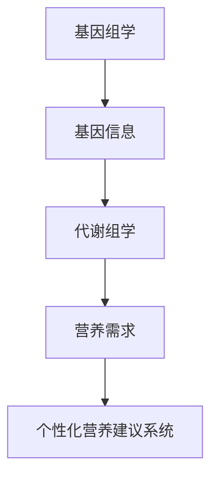

                 

### 文章标题：AI在个性化营养建议系统中的应用：结合基因组学和代谢组学

关键词：人工智能，个性化营养，基因组学，代谢组学，营养建议系统

摘要：
随着科技的飞速发展，人工智能（AI）技术在各个领域得到了广泛应用。在个性化营养建议系统中，AI技术正发挥着越来越重要的作用，通过结合基因组学和代谢组学，为个体提供定制化的营养方案。本文将详细探讨AI在个性化营养建议系统中的应用，从背景介绍、核心概念与联系、核心算法原理、数学模型和项目实战等方面进行深入分析。

### 背景介绍

随着人们生活水平的提高，营养健康问题日益受到关注。然而，由于个体差异，传统的一刀切营养建议已无法满足不同人群的需求。个性化营养建议系统应运而生，旨在通过分析个体的基因组学和代谢组学数据，为个体提供定制化的营养方案。

AI技术在个性化营养建议系统中具有巨大的潜力。首先，AI可以帮助处理海量数据，提取有用的信息，从而提高营养分析的准确性。其次，AI可以通过机器学习算法，根据个体的基因组学和代谢组学特征，预测个体对营养素的需求，为个性化营养建议提供科学依据。

### 核心概念与联系

为了理解AI在个性化营养建议系统中的应用，我们需要先了解几个核心概念：基因组学、代谢组学和个性化营养建议系统。

- **基因组学**：研究生物体的遗传信息，包括基因组成、基因表达和遗传变异等。
- **代谢组学**：研究生物体内所有代谢物的组成和变化，反映生物体的营养状态和生理功能。
- **个性化营养建议系统**：结合基因组学和代谢组学数据，为个体提供定制化的营养方案。

核心概念之间的关系可以通过以下Mermaid流程图来展示：



在这个流程图中，基因组学提供基因信息，代谢组学反映个体的营养状态，这些信息共同作用于个性化营养建议系统，为个体提供定制化的营养方案。

### 核心算法原理讲解

在个性化营养建议系统中，AI算法的应用至关重要。以下将介绍几种常见的核心算法原理，包括协同过滤算法、基于内容的推荐算法和基于模型的推荐算法。

#### 协同过滤算法

协同过滤算法是一种基于用户-物品评分矩阵进行相似度计算的推荐算法。它通过分析用户对物品的评分，找到相似的用户或物品，从而推荐用户可能喜欢的物品。以下是协同过滤算法的伪代码：

```python
def collaborativeFiltering(user RatingsMatrix, similarityMatrix):
    user_preferences = user's ratings
    similar_users = findSimilarUsers(user_preferences, similarityMatrix)
    predicted_ratings = []
    for item in items:
        if item in user_preferences:
            continue
        similarity_scores = calculateSimilarityScores(similar_users, item)
        predicted_rating = sum(similarity_scores * other_users_ratings) / sum(similarity_scores)
        predicted_ratings.append(predicted_rating)
    return predicted_ratings
```

#### 基于内容的推荐算法

基于内容的推荐算法是一种基于物品的属性进行相似度计算的推荐算法。它通过分析物品的特征，找到相似的商品，从而推荐给用户。以下是基于内容的推荐算法的伪代码：

```python
def contentBasedFiltering(item Features, item_features, user_preferences):
    similar_items = findSimilarItems(item_features, item)
    recommended_items = []
    for feature in user_preferences:
        if feature in similar_items:
            recommended_items.append(item)
            break
    return recommended_items
```

#### 基于模型的推荐算法

基于模型的推荐算法是一种利用机器学习模型进行预测的推荐算法。常见的模型包括线性回归、决策树、神经网络等。以下是基于模型的推荐算法的伪代码：

```python
def modelBasedFiltering(user_data, model):
    predicted_preferences = model.predict(user_data)
    recommended_items = []
    for item in items:
        if predicted_preferences[item] > threshold:
            recommended_items.append(item)
    return recommended_items
```

### 数学模型和数学公式讲解

个性化营养建议系统中的数学模型主要用于预测个体对营养素的需求。以下将介绍几种常见的数学模型和数学公式。

#### 遗传变异模型

遗传变异模型用于预测个体对营养素的需求差异。常见的模型包括线性回归、决策树等。以下是遗传变异模型的公式：

$$
y = \beta_0 + \beta_1 \cdot x_1 + \beta_2 \cdot x_2 + ... + \beta_n \cdot x_n
$$

其中，$y$ 是个体对营养素的需求量，$x_1, x_2, ..., x_n$ 是影响需求的基因特征，$\beta_0, \beta_1, \beta_2, ..., \beta_n$ 是模型的参数。

#### 代谢路径模型

代谢路径模型用于分析不同代谢物之间的相互关系。常见的模型包括线性回归、神经网络等。以下是代谢路径模型的公式：

$$
y = f(x_1, x_2, ..., x_n)
$$

其中，$y$ 是代谢物之间的关系，$x_1, x_2, ..., x_n$ 是影响代谢物的因素，$f$ 是模型函数。

#### 线性回归模型

线性回归模型是一种常见的预测模型，用于预测个体营养摄入与健康状况之间的关系。以下是线性回归模型的公式：

$$
y = \beta_0 + \beta_1 \cdot x_1 + \beta_2 \cdot x_2 + ... + \beta_n \cdot x_n
$$

其中，$y$ 是个体的健康状况，$x_1, x_2, ..., x_n$ 是个体营养摄入的变量，$\beta_0, \beta_1, \beta_2, ..., \beta_n$ 是模型的参数。

### 项目实战

在本节中，我们将通过一个实际项目来展示AI在个性化营养建议系统中的应用。

#### 项目背景

本项目旨在为用户提供个性化的营养建议，帮助用户改善健康状况。项目分为以下几个阶段：

1. 数据收集：收集用户的基因组学和代谢组学数据。
2. 数据处理：对收集到的数据进行分析和处理。
3. 模型构建：使用机器学习算法构建营养建议模型。
4. 结果解释：解释模型结果，为用户提供个性化的营养建议。

#### 数据收集

数据收集阶段主要包括收集用户的基因组学和代谢组学数据。具体步骤如下：

1. **基因组学数据收集**：通过基因测序技术获取用户的基因组数据。
2. **代谢组学数据收集**：通过代谢组学技术获取用户的代谢物数据。

#### 数据处理

数据处理阶段主要包括对收集到的数据进行分析和处理。具体步骤如下：

1. **数据清洗**：去除数据中的噪声和异常值。
2. **数据转换**：将数据转换为适合机器学习算法的格式。

#### 模型构建

模型构建阶段主要包括使用机器学习算法构建营养建议模型。具体步骤如下：

1. **特征选择**：选择影响营养需求的基因特征和代谢物特征。
2. **模型训练**：使用训练数据训练机器学习模型。
3. **模型评估**：使用测试数据评估模型性能。

#### 结果解释

结果解释阶段主要包括解释模型结果，为用户提供个性化的营养建议。具体步骤如下：

1. **营养建议生成**：根据模型结果生成个性化的营养建议。
2. **建议解释**：为用户提供详细的营养建议解释。

#### 项目小结

本项目通过AI技术结合基因组学和代谢组学，为用户提供个性化的营养建议。项目实战展示了数据收集、数据处理、模型构建和结果解释的全过程，为其他类似项目提供了借鉴。

### 最佳实践 tips、小结、注意事项、拓展阅读

#### 最佳实践 tips

1. 在数据收集阶段，确保数据的准确性和完整性，避免噪声和异常值对模型性能的影响。
2. 在模型构建阶段，选择合适的特征和模型参数，以提高模型的预测准确性。
3. 在结果解释阶段，确保建议的可操作性和实用性，让用户能够轻松理解并执行。

#### 小结

本文详细探讨了AI在个性化营养建议系统中的应用，从核心概念、算法原理、数学模型到项目实战，全面展示了AI技术结合基因组学和代谢组学为个体提供定制化营养方案的魅力。

#### 注意事项

1. 个性化营养建议系统需要大量数据支持，确保数据的质量和完整性至关重要。
2. 个性化营养建议系统需要不断地优化和更新，以适应不断变化的环境。

#### 拓展阅读

1. 《人工智能：一种现代方法》
2. 《基因组学：原理与应用》
3. 《代谢组学：方法与应用》

### 作者信息

作者：AI天才研究院/AI Genius Institute & 禅与计算机程序设计艺术 /Zen And The Art of Computer Programming

