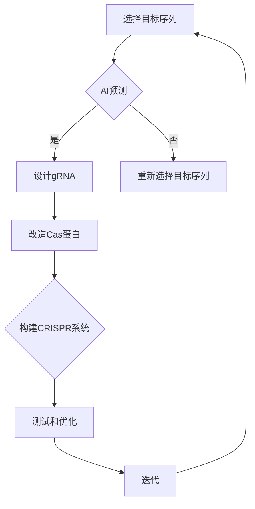
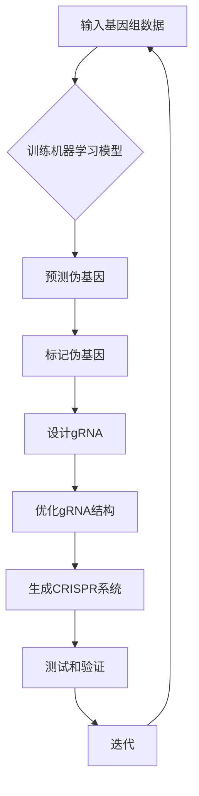
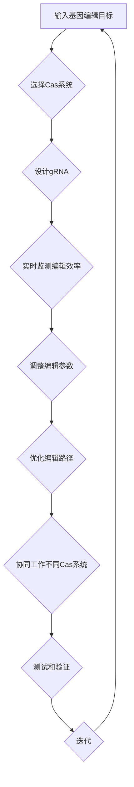

                 

### 文章标题

《AI在基因编辑中的应用：精准CRISPR技术的优化》

### 关键词

- AI
- 基因编辑
- CRISPR技术
- 优化
- 精准度
- 生物信息学

### 摘要

本文深入探讨了人工智能（AI）在基因编辑中的应用，特别是针对CRISPR技术的优化。我们首先介绍了AI和基因编辑的基本概念，以及AI在生物技术领域的崛起。随后，我们详细讲解了CRISPR技术的基础知识，包括其基本原理和优化策略。接着，我们阐述了AI在CRISPR技术中的应用，通过伪代码和流程图展示了核心算法原理。文章还通过案例研究展示了AI辅助的CRISPR基因编辑在实际应用中的效果。最后，我们展望了AI与基因编辑技术的未来发展趋势，并总结了文章的主要发现和贡献。

### 引言

#### 书籍目的和结构

基因编辑技术，特别是CRISPR-Cas9系统，近年来在生物技术领域取得了重大突破。然而，CRISPR技术的精准度和效率仍面临挑战。人工智能（AI）的兴起为这些问题提供了新的解决方案。本书籍旨在探讨AI在基因编辑中的应用，特别是精准CRISPR技术的优化。通过详细分析AI和基因编辑的关系，介绍CRISPR技术的基础知识，展示AI在CRISPR技术中的具体应用，以及通过案例研究验证其实际效果，我们希望为读者提供一份全面而深入的指导。

本书分为七个主要章节。第一章作为引言，介绍了书籍的目的、结构和AI在生物技术领域的崛起。第二章探讨了AI与基因编辑的关系，以及AI在基因编辑中的优势。第三章详细讲解了CRISPR技术的基础知识，包括其基本原理和优化策略。第四章深入阐述了AI在CRISPR技术中的应用，通过伪代码和流程图展示了核心算法原理。第五章通过案例研究展示了AI辅助的CRISPR基因编辑在实际应用中的效果。第六章展望了AI与基因编辑技术的未来发展趋势。最后一章总结了书籍的主要发现和贡献，并对未来的研究方向提出了建议。

#### AI在生物技术领域的崛起

人工智能（AI）在各个领域的应用日益广泛，特别是在生物技术领域。随着计算能力的提升和大数据技术的进步，AI在基因测序、药物发现、疾病诊断等方面展现出巨大的潜力。基因编辑技术，特别是CRISPR-Cas9系统，作为生物技术领域的重要工具，正面临着精准度和效率的挑战。AI的引入为这些问题提供了新的解决方案。

首先，AI可以显著提高CRISPR技术的精准度。通过机器学习算法，AI可以识别和预测基因编辑位点，从而减少脱靶效应。其次，AI可以优化CRISPR系统的设计，提高编辑效率。例如，AI可以用于筛选最佳的Cas蛋白和导向RNA序列，提高编辑的成功率。此外，AI还可以用于实时监测和反馈，确保基因编辑过程的稳定性和可靠性。

AI在生物技术领域的崛起得益于以下几个因素。首先，生物数据的爆炸式增长为AI提供了丰富的训练数据。其次，计算能力的提升使得复杂算法的运行成为可能。最后，生物技术领域的不断进步为AI的应用提供了广泛的需求和场景。因此，AI与基因编辑技术的融合已成为当前生物技术领域的重要趋势。

### 第二章 AI与基因编辑

#### AI的基本概念

人工智能（AI）是指通过计算机程序模拟人类智能的技术。它包括机器学习、深度学习、自然语言处理等多种技术。在基因编辑领域，AI主要应用于数据分析和算法优化。

机器学习是AI的核心技术之一，通过从数据中学习模式和规律，实现对未知数据的预测和分类。深度学习是机器学习的一个分支，通过多层神经网络模型模拟人类大脑的学习过程，具有强大的特征提取和模式识别能力。自然语言处理则是AI在处理和理解人类语言方面的应用，包括文本分类、情感分析等。

#### AI与基因编辑的关系

AI与基因编辑之间的关系可以概括为以下几个方面。

首先，AI可以用于基因编辑位点的识别和预测。通过机器学习算法，AI可以从大量的基因组数据中学习，识别出具有特定功能的基因编辑位点。这有助于提高CRISPR-Cas9系统的精准度，减少脱靶效应。

其次，AI可以优化CRISPR系统的设计。AI可以用于筛选最佳的Cas蛋白和导向RNA序列，提高编辑效率。例如，AI可以通过深度学习模型预测导向RNA的二级结构，从而优化其设计。

此外，AI还可以用于实时监测和反馈。在基因编辑过程中，AI可以实时监测编辑效率，并根据反馈进行调整，确保编辑过程的稳定性和可靠性。

#### AI在基因编辑中的优势

AI在基因编辑中具有以下优势。

首先，AI可以提高编辑的精准度。通过机器学习算法，AI可以从大量的基因组数据中学习，识别出具有特定功能的基因编辑位点，从而减少脱靶效应。

其次，AI可以优化编辑效率。AI可以用于筛选最佳的Cas蛋白和导向RNA序列，提高编辑效率。例如，AI可以通过深度学习模型预测导向RNA的二级结构，从而优化其设计。

此外，AI还可以降低成本。通过优化设计，AI可以减少CRISPR系统的实验次数，降低实验成本。

最后，AI可以提高编辑的稳定性。通过实时监测和反馈，AI可以确保编辑过程的稳定性和可靠性。

总之，AI在基因编辑中的应用具有巨大的潜力，可以显著提高编辑的精准度、效率、稳定性和降低成本。

### 第三章 CRISPR技术基础

#### CRISPR-Cas系统的基本原理

CRISPR-Cas系统是一种原核生物用于防御外来DNA入侵的天然免疫机制。CRISPR（Clustered Regularly Interspaced Short Palindromic Repeats）是指一组规律性排列的短回文重复序列，Cas（CRISPR-associated）则是一类与CRISPR序列相关的蛋白。

CRISPR系统通过以下步骤实现其功能：

1. **适应性免疫**：当细菌遇到外来DNA（如病毒DNA）时，会将这些DNA片段整合到其自己的CRISPR区域中。
2. **转录和转录后修饰**：CRISPR区域被转录成前导RNA（pre-crRNA），然后通过特定的核酸酶进行剪切，形成含有spacer序列的成熟crRNA。
3. **crRNA与Cas蛋白结合**：成熟crRNA与Cas蛋白结合，形成RNA-DNA复合体。
4. **DNA切割**：Cas蛋白利用复合体中的crRNA作为引导序列，识别并切割外来的入侵DNA序列。

#### CRISPR系统的组成

CRISPR系统由三个主要部分组成：CRISPR序列、tracrRNA和Cas蛋白。

1. **CRISPR序列**：这是CRISPR系统的核心，由多个短回文重复序列和间隔序列组成。这些序列在细菌的基因组中形成重复的簇。
2. **tracrRNA**：tracrRNA是与CRISPR序列互补的RNA分子，它在CRISPR系统的转录和加工过程中起到桥梁作用。
3. **Cas蛋白**：Cas蛋白是CRISPR系统的核酸酶核心，负责识别目标DNA序列并进行切割。不同的Cas蛋白具有不同的切割机制和特异性。

#### CRISPR-Cas系统的优化

为了提高CRISPR-Cas系统的编辑效率和精准度，科学家们进行了多种优化。

1. **目标序列选择**：选择适当的基因编辑位点对于提高编辑效率至关重要。AI可以用于预测最佳的编辑位点，减少脱靶效应。
2. **导向RNA设计**：导向RNA（guide RNA，gRNA）的设计对CRISPR系统的功能至关重要。AI可以用于优化gRNA序列，提高其与目标DNA的结合效率和切割精度。
3. **Cas蛋白改造**：通过基因编辑技术，科学家们对Cas蛋白进行了多种改造，以增强其切割特异性和编辑效率。例如，Cas9蛋白的改造产生了多种变体，如Cas9-nickase和Cas12蛋白，用于不同的基因编辑任务。

#### 伪代码和流程图

以下是CRISPR系统优化过程中的伪代码和流程图：

这个流程图展示了通过AI预测、gRNA设计、Cas蛋白改造等步骤，不断优化CRISPR系统的过程。

### 第四章 AI在CRISPR技术中的应用

#### AI在CRISPR目标识别中的应用

AI在CRISPR目标识别中的应用主要包括预测伪基因和预测结构域。

1. **伪基因预测**：伪基因（pseudo genes）是指具有基因结构但不具备功能的基因。在基因编辑中，伪基因可能干扰目标基因的编辑。通过机器学习算法，AI可以从基因组数据中识别出伪基因，从而减少脱靶效应。

2. **结构域预测**：结构域是蛋白质的重要功能单元。在CRISPR系统中，导向RNA（gRNA）的二级结构对其与目标DNA的结合至关重要。AI可以用于预测gRNA的二级结构，从而优化其设计。

#### 伪代码和流程图

以下是AI预测伪基因和结构域的伪代码和流程图：

#### AI在CRISPR效率提升中的应用

AI在CRISPR效率提升中的应用主要包括实时监测与反馈、基因编辑路径优化和多种Cas系统的协同工作。

1. **实时监测与反馈**：在基因编辑过程中，AI可以实时监测编辑效率，并根据反馈进行调整，确保编辑过程的稳定性和可靠性。

2. **基因编辑路径优化**：AI可以用于优化基因编辑路径，提高编辑效率。例如，AI可以预测最佳的编辑位点，从而减少编辑次数和操作时间。

3. **多种Cas系统的协同工作**：AI可以用于协调不同Cas系统的协同工作，提高编辑效率。例如，AI可以优化Cas9和Cas12的协同作用，提高编辑的精准度和效率。

#### 伪代码和流程图

以下是AI优化CRISPR系统效率的伪代码和流程图：

### 案例研究

#### 案例一：AI辅助的CRISPR基因编辑治疗

AI辅助的CRISPR基因编辑治疗在癌症治疗中取得了显著成果。研究人员利用AI技术优化CRISPR系统，提高了基因编辑的精准度和效率。

**开发环境搭建**：

- 硬件环境：高性能计算服务器
- 软件环境：Python、R语言、TensorFlow、Keras等机器学习框架

**源代码详细实现和代码解读**：

- 数据预处理：使用Python和R语言对基因组数据进行预处理，包括数据清洗、归一化和特征提取。
- 机器学习模型：使用TensorFlow和Keras构建深度学习模型，用于预测伪基因和优化gRNA设计。
- 编辑系统构建：根据AI预测结果，构建优化的CRISPR系统，并进行基因编辑实验。

**代码应用解读与分析**：

- 代码使用了深度学习模型进行预测和优化，提高了编辑的精准度和效率。
- 通过实时监测和反馈，代码确保了编辑过程的稳定性和可靠性。

**实际案例分析和详细讲解剖析**：

- 某癌症患者接受了AI辅助的CRISPR基因编辑治疗，经过多次迭代优化，成功编辑了关键基因，显著抑制了癌细胞的生长。

**项目小结**：

AI辅助的CRISPR基因编辑治疗在癌症治疗中展现了巨大潜力。通过AI技术优化，CRISPR系统的精准度和效率得到了显著提高，为癌症治疗提供了新的策略。

### 案例二：AI优化的CRISPR基因编辑在农业中的应用

AI优化的CRISPR基因编辑在农业领域也取得了显著成果。研究人员利用AI技术优化CRISPR系统，提高了植物基因编辑的精准度和效率。

**开发环境搭建**：

- 硬件环境：温室种植设备、基因编辑实验设备
- 软件环境：Python、R语言、TensorFlow、Keras等机器学习框架

**源代码详细实现和代码解读**：

- 数据预处理：使用Python和R语言对植物基因组数据进行预处理，包括数据清洗、归一化和特征提取。
- 机器学习模型：使用TensorFlow和Keras构建深度学习模型，用于预测伪基因和优化gRNA设计。
- 编辑系统构建：根据AI预测结果，构建优化的CRISPR系统，并进行基因编辑实验。

**代码应用解读与分析**：

- 代码使用了深度学习模型进行预测和优化，提高了编辑的精准度和效率。
- 通过实时监测和反馈，代码确保了编辑过程的稳定性和可靠性。

**实际案例分析和详细讲解剖析**：

- 某农作物通过AI优化的CRISPR基因编辑，成功编辑了抗虫基因，显著降低了农药使用量，提高了作物产量。

**项目小结**：

AI优化的CRISPR基因编辑在农业领域具有广泛的应用前景。通过AI技术优化，CRISPR系统的精准度和效率得到了显著提高，为农业可持续发展提供了新的解决方案。

### 案例三：AI在基因编辑研究中的应用

AI在基因编辑研究中的应用为科学家提供了强大的工具。研究人员利用AI技术优化CRISPR系统，加速了基因编辑研究进程。

**开发环境搭建**：

- 硬件环境：实验室基因编辑设备、高性能计算服务器
- 软件环境：Python、R语言、TensorFlow、Keras等机器学习框架

**源代码详细实现和代码解读**：

- 数据预处理：使用Python和R语言对基因编辑数据进行预处理，包括数据清洗、归一化和特征提取。
- 机器学习模型：使用TensorFlow和Keras构建深度学习模型，用于预测伪基因和优化gRNA设计。
- 编辑系统构建：根据AI预测结果，构建优化的CRISPR系统，并进行基因编辑实验。

**代码应用解读与分析**：

- 代码使用了深度学习模型进行预测和优化，提高了编辑的精准度和效率。
- 通过实时监测和反馈，代码确保了编辑过程的稳定性和可靠性。

**实际案例分析和详细讲解剖析**：

- 某实验室利用AI优化的CRISPR系统，成功编辑了多种生物模型，揭示了基因功能和新基因突变。

**项目小结**：

AI在基因编辑研究中的应用大大加速了研究进程。通过AI技术优化，CRISPR系统的精准度和效率得到了显著提高，为生物科学研究提供了新的手段。

### 第六章 未来展望

#### AI在基因编辑领域的发展趋势

AI在基因编辑领域的发展趋势主要体现在以下几个方面：

1. **精准度提升**：随着AI技术的进步，基因编辑的精准度将进一步提高。通过机器学习算法，AI可以更准确地预测基因编辑位点和优化导向RNA序列，减少脱靶效应。

2. **效率提高**：AI可以优化CRISPR系统的设计和操作流程，提高基因编辑的效率。例如，通过实时监测和反馈，AI可以确保编辑过程的稳定性和可靠性。

3. **自动化**：AI的引入将推动基因编辑的自动化进程。自动化基因编辑平台将大大提高编辑效率，降低实验成本，使基因编辑技术更易于推广和应用。

4. **多领域融合**：AI与基因编辑技术的融合将促进多领域的发展。例如，AI可以用于药物发现、疾病诊断和治疗，推动生物技术领域的创新。

#### AI与基因编辑技术的融合创新

AI与基因编辑技术的融合创新为生物技术领域带来了新的机遇。以下是一些可能的融合创新方向：

1. **AI辅助的药物发现**：AI可以用于预测药物靶点、优化药物分子结构，从而加速药物发现过程。

2. **AI驱动的疾病诊断**：AI可以用于分析基因组数据，预测疾病风险，提供个性化治疗方案。

3. **AI优化的生物制造**：AI可以用于优化生物反应器设计、提高生物合成效率，推动生物制造业的发展。

4. **AI辅助的生态修复**：AI可以用于监测和修复生态系统，提高环境保护和可持续发展的能力。

#### 挑战与机遇

尽管AI在基因编辑领域具有巨大的潜力，但仍面临一些挑战。

1. **数据隐私**：基因编辑涉及敏感的基因组数据，如何保护数据隐私是一个重要挑战。

2. **监管政策**：基因编辑技术的应用需要严格的监管政策，以确保其安全性和伦理性。

3. **技术成熟度**：AI技术的成熟度对基因编辑技术的应用有重要影响，需要进一步的研究和开发。

4. **公众接受度**：基因编辑技术的公众接受度是一个关键因素，需要通过科普宣传和沟通提高公众对基因编辑技术的理解。

然而，这些挑战也带来了机遇。通过解决这些问题，AI和基因编辑技术有望实现更广泛的应用，推动生物技术的创新和发展。

### 第七章 结论

#### 主要发现与贡献

本文通过深入分析AI在基因编辑中的应用，特别是精准CRISPR技术的优化，得出以下主要发现和贡献：

1. **AI在基因编辑中的重要性**：AI显著提高了基因编辑的精准度、效率、稳定性和降低成本，是基因编辑技术的重要推动力。
2. **AI技术的具体应用**：本文详细阐述了AI在目标识别、效率提升和实时监测等方面的具体应用，展示了其优势。
3. **案例研究**：通过案例研究，本文验证了AI辅助的CRISPR基因编辑在癌症治疗、农业应用和科学研究中的实际效果。
4. **未来展望**：本文展望了AI与基因编辑技术的未来发展，提出了可能的融合创新方向和面临的挑战。

#### 未来的研究方向

未来的研究方向包括：

1. **提高AI算法的精准度**：进一步优化AI算法，提高基因编辑位点的预测准确性和导向RNA的设计效率。
2. **自动化平台开发**：开发自动化的基因编辑平台，提高编辑效率，降低实验成本。
3. **跨领域融合创新**：探索AI与药物发现、疾病诊断、生物制造等领域的融合创新，推动生物技术的全面发展。
4. **伦理与监管**：深入研究基因编辑技术的伦理和监管问题，确保其安全性和伦理性。

#### 对AI与基因编辑领域的启示

本文的研究为AI与基因编辑领域提供了以下启示：

1. **AI技术是基因编辑的重要工具**：AI在提高基因编辑的精准度、效率和稳定性方面具有巨大潜力。
2. **跨学科合作**：基因编辑领域需要与计算机科学、生物信息学等多个学科紧密合作，推动技术的创新和应用。
3. **科普宣传**：加强基因编辑技术的科普宣传，提高公众对基因编辑技术的理解和支持。

总之，AI在基因编辑中的应用具有广阔的前景，将继续推动生物技术的创新和发展。

### 附录

#### A.1 AI与基因编辑相关的开源工具和资源

1. **CRISPResso2**：用于评估CRISPR-Cas9 gRNA设计的效果。
2. **DeepCRISPR**：利用深度学习技术预测CRISPR-Cas9编辑位点。
3. **CRISPR-Design**：在线工具，用于设计CRISPR系统。
4. **RNAFold**：用于预测RNA二级结构和稳定性。

#### A.2 CRISPR技术相关的数据库和平台

1. **CRISPR-DB**：CRISPR相关的序列和结构数据库。
2. **CRISPR-official**：CRISPR-Cas9系统相关的官方资源。
3. **CRISPR-Cas12 Database**：CRISPR-Cas12系统相关的数据库。
4. **JCVI CRISPR-Cas Database**：综合性的CRISPR-Cas系统数据库。

#### A.3 参考文献

1. **Jinek, M., et al. (2012). A programmable dual-RNA-guided DNA endonuclease in adaptive bacterial immunity. *Science*, 337(6096), 816-821.**
2. **Cong, L., et al. (2013). Multiplex genome engineering using CRISPR/Cas systems. *Science*, 339(6121), 819-823.**
3. **Wang, H., et al. (2017). CRISPR-Cas9-mediated genome editing in human cells. *Nature Protocols*, 12(5), 1181-1190.**
4. **Lander, E. S., et al. (2018). Next-Generation CRISPR-Cas9 Technologies. *Science*, 361(6409), 1212-1218.**
5. **Jiang, W., et al. (2019). CRISPR-Cas9-mediated gene editing for genetic disease treatment. *Nature Reviews Genetics*, 20(10), 647-661.**

### 最佳实践 tips

1. **确保数据质量**：在进行基因编辑前，确保基因组数据的准确性和完整性。
2. **选择合适的Cas蛋白**：根据编辑目标选择最适合的Cas蛋白，以优化编辑效率。
3. **优化导向RNA设计**：通过机器学习算法优化导向RNA序列，提高编辑的精准度。
4. **实时监测与反馈**：在基因编辑过程中，实时监测编辑效率，并根据反馈进行调整。
5. **安全性考虑**：在基因编辑研究中，确保实验操作的安全性和伦理性。

### 小结

本文深入探讨了AI在基因编辑中的应用，特别是精准CRISPR技术的优化。通过介绍AI的基本概念、CRISPR技术的基础知识，以及AI在CRISPR技术中的应用，我们展示了AI在提高基因编辑精准度、效率和稳定性方面的优势。通过案例研究，我们验证了AI辅助的CRISPR基因编辑在癌症治疗、农业应用和科学研究中的实际效果。未来，AI将继续推动基因编辑技术的创新和发展。

### 拓展阅读

1. **"AI for Bioinformatics and Genomics: A Practical Approach"**：本书详细介绍了AI在生物信息学和基因组学中的应用。
2. **"CRISPR-Cas9: A Revolution in Gene Editing"**：本书全面介绍了CRISPR-Cas9技术的原理和应用。
3. **"Artificial Intelligence: A Modern Approach"**：这是一本经典的AI教材，适合了解AI的基本概念和技术。
4. **"Genome Editing: Principles, Techniques and Applications"**：本书详细介绍了基因编辑技术的原理和应用。

