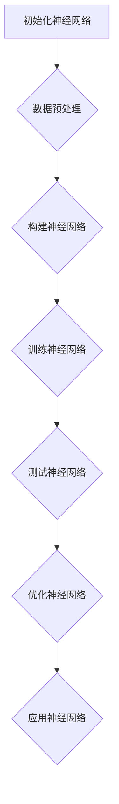

                 


# AI在智能家居能源需求响应中的应用：参与电网调节

> 关键词：AI、智能家居、能源需求响应、电网调节、深度学习、强化学习

> 摘要：本文从AI在智能家居能源需求响应中的应用出发，探讨了AI算法在电网调节中的作用。通过分析AI和智能家居的基本概念及其发展历程，本文详细介绍了能源需求响应和电网调节的原理及方法。随后，本文重点介绍了深度学习和强化学习算法在智能家居能源需求响应中的应用，并通过具体案例分析了AI算法在电网调节中的实际效果。最后，本文对未来AI在智能家居能源需求响应和电网调节中的发展趋势和挑战进行了展望。

## 第1章：引言

### 1.1 书籍背景

随着物联网、大数据和人工智能技术的快速发展，智能家居已成为现代家居生活的重要组成部分。智能家居通过将各种家电设备、传感器和控制系统连接到互联网，实现了对家庭环境的智能监控和控制，从而提高了生活品质和能源利用效率。然而，在能源消费日益增加的今天，如何合理调节家庭能源需求，降低能源消耗，实现绿色、可持续的家居生活，已成为一个亟待解决的问题。

AI技术在智能家居中的应用，为解决能源需求响应和电网调节问题提供了新的思路和途径。AI算法能够通过对大量数据的分析和处理，实现智能家居的智能化、自动化控制，从而优化能源使用，提高电网调节效率。

### 1.2 研究目的

本文旨在探讨AI在智能家居能源需求响应中的应用，分析AI算法在电网调节中的作用，通过具体案例展示AI算法在智能家居能源需求响应和电网调节中的实际效果。同时，本文还对未来AI在智能家居能源需求响应和电网调节中的发展趋势和挑战进行了展望，以期为相关领域的研究和实践提供参考。

### 1.3 研究领域的重要性

智能家居作为人工智能技术在家庭生活中的应用，正逐渐改变人们的生活方式。AI在智能家居中的应用不仅提高了生活品质，还在能源利用、环境保护等方面具有重要意义。能源需求响应和电网调节作为智能家居的重要功能，对于提高电网稳定性、降低能源消耗、实现可持续发展具有重要作用。

AI技术的引入，使得智能家居能源需求响应和电网调节更加智能化、高效化。通过AI算法，可以对家庭能源使用进行实时监测和预测，优化能源使用策略，降低能源浪费。同时，AI算法还可以对电网进行实时调节，提高电网运行效率，保障电网稳定。

### 1.4 书籍结构概述

本文共分为七个章节。第1章为引言，介绍书籍背景、研究目的和意义。第2章和第3章分别介绍AI与智能家居的基本概念及其发展历程，以及能源需求响应和电网调节的原理和方法。第4章和第5章详细介绍了智能家居能源需求响应的AI算法，包括深度学习和强化学习算法。第6章通过具体案例展示了AI算法在电网调节中的应用效果。第7章对未来AI在智能家居能源需求响应和电网调节中的发展趋势和挑战进行了展望。

## 第2章：AI与智能家居概述

### 2.1 AI概述

#### 2.1.1 定义

人工智能（Artificial Intelligence，简称AI）是指由人创造出的系统，这些系统能够模拟人类的认知能力，例如学习、推理、感知和解决问题等。AI的核心目标是使计算机具备人类智能，能够在特定领域内执行复杂任务。

#### 2.1.2 发展历程

AI的研究可以追溯到20世纪50年代。在初期，AI主要集中在符号主义方法，即通过编程实现逻辑推理和知识表示。然而，符号主义方法在面对复杂问题时的局限性很快显现出来。从20世纪80年代开始，专家系统和机器学习技术逐渐成为AI研究的主流方向。专家系统通过模拟人类专家的决策过程来解决问题，而机器学习则通过从数据中学习规律和模式，实现自动识别和预测。

进入21世纪，深度学习和大数据技术的兴起，使得AI取得了突破性进展。深度学习通过多层神经网络对大量数据进行训练，能够实现图像识别、语音识别和自然语言处理等任务。大数据技术的应用，使得AI系统能够处理和分析海量的数据，从而提高了AI的准确性和效率。

#### 2.1.3 关键技术

- **机器学习**：机器学习是AI的核心技术之一，它通过训练数据集，使计算机自动识别模式和规律，从而实现预测和决策。常见的机器学习方法包括监督学习、无监督学习和强化学习。

- **深度学习**：深度学习是机器学习的一种特殊形式，它通过多层神经网络对数据进行训练，能够自动提取数据的复杂特征。深度学习在图像识别、语音识别和自然语言处理等领域取得了显著的成果。

- **神经网络**：神经网络是深度学习的基础，它由大量相互连接的神经元组成，通过模拟人脑的工作机制，实现对数据的处理和分析。

### 2.2 智能家居概述

#### 2.2.1 定义

智能家居（Smart Home）是指通过物联网技术，将家庭中的各种设备连接起来，实现智能化管理和控制。智能家居的目标是通过自动化和智能化手段，提高家庭生活的舒适性和便利性，同时实现节能环保。

#### 2.2.2 发展历程

智能家居的概念起源于20世纪80年代，当时主要是通过有线网络将家庭中的电器设备连接起来。随着物联网技术的发展，智能家居逐渐从有线网络转向无线网络，实现了设备的远程控制和自动化管理。

近年来，随着人工智能、大数据和云计算等技术的应用，智能家居进入了快速发展阶段。智能家居设备从单一的功能性设备，逐渐转变为具有智能化、网络化和联动功能的系统。

#### 2.2.3 关键技术

- **物联网**：物联网是智能家居的核心技术，它通过将各种设备连接到互联网，实现数据的采集、传输和处理。

- **人工智能**：人工智能技术为智能家居提供了智能化的决策和控制能力，使设备能够根据用户的需求和环境的变化，自动调整工作状态。

- **大数据和云计算**：大数据和云计算技术为智能家居提供了强大的数据处理和分析能力，使设备能够从海量数据中挖掘有价值的信息，实现更精准的服务。

### 2.3 AI在智能家居中的应用现状与挑战

#### 2.3.1 应用现状

AI技术在智能家居中的应用已经相当广泛，包括智能门锁、智能照明、智能家电、智能安防等。通过AI技术，这些设备能够实现自动化控制、远程监控和智能分析，提高了家庭生活的便捷性和舒适度。

#### 2.3.2 挑战

尽管AI技术在智能家居中取得了显著的应用成果，但仍面临一些挑战：

- **数据安全和隐私保护**：智能家居设备收集和处理大量用户数据，如何保障数据安全和用户隐私成为关键问题。

- **设备兼容性和互操作性**：智能家居设备种类繁多，不同设备之间如何实现无缝连接和协同工作，是一个亟待解决的问题。

- **算法透明性和解释性**：随着AI技术的应用，智能家居设备的行为和决策越来越依赖于算法。如何保证算法的透明性和解释性，使其能够被用户理解和接受，是一个重要挑战。

## 第3章：能源需求响应与电网调节

### 3.1 能源需求响应概述

#### 3.1.1 定义

能源需求响应（Demand Response，简称DR）是指通过激励或调节措施，引导电力用户在电网需要时调整其用电行为，从而实现电网负荷的动态平衡。能源需求响应是电力市场的重要组成部分，有助于提高电网的稳定性和经济性。

#### 3.1.2 类型

根据用户响应的方式，能源需求响应主要分为以下几种类型：

- **峰值响应**：通过降低高峰期的用电负荷，缓解电网的峰值压力。

- **基荷响应**：通过减少基础负荷，降低电网的基本负荷，从而减少能源消耗。

- **弹性响应**：在电网紧急情况下，用户能够迅速调整用电行为，提供电网所需的电能。

#### 3.1.3 目标

能源需求响应的主要目标是：

- **提高电网稳定性**：通过动态调整负荷，减少电网的波动和压力，提高电网的稳定性。

- **降低能源消耗**：通过优化用电行为，降低能源消耗，提高能源利用效率。

- **实现经济效益**：通过参与能源需求响应，用户可以获得相应的激励，降低用电成本。

### 3.2 电网调节概述

#### 3.2.1 定义

电网调节是指通过调节电力系统的发电、输电和负荷，使电力系统的运行保持稳定和高效。电网调节是保障电力系统安全稳定运行的关键环节。

#### 3.2.2 原理

电网调节的基本原理是通过监测电力系统的运行状态，根据系统负荷、电压和频率等参数，实时调整发电和负荷，使电力系统的运行保持在安全、稳定的范围内。

#### 3.2.3 挑战

随着电力系统的规模不断扩大，电网调节面临以下挑战：

- **复杂性**：现代电力系统具有复杂的结构和庞大的规模，电网调节需要处理大量的数据和参数。

- **实时性**：电网调节需要实时监测电力系统的运行状态，并快速作出调整，以确保电网的稳定性。

- **不确定性**：电力系统的运行受到多种因素的影响，如天气变化、电力需求波动等，使得电网调节具有不确定性。

## 第4章：智能家居能源需求响应的AI算法

### 4.1 深度学习算法

#### 4.1.1 概述

深度学习算法是人工智能领域的一种重要方法，它通过多层神经网络对数据进行训练，能够自动提取数据的复杂特征。深度学习算法在智能家居能源需求响应中具有广泛的应用。

#### 4.1.2 算法原理

深度学习算法主要包括以下几个步骤：

1. **数据预处理**：对原始数据进行清洗和预处理，使其适合进行深度学习训练。

2. **构建神经网络**：根据问题的特点，设计合适的神经网络结构。

3. **训练神经网络**：使用训练数据集，对神经网络进行训练，使其能够提取数据的特征。

4. **测试和优化**：使用测试数据集，评估神经网络的性能，并根据评估结果对网络进行优化。

#### 4.1.3 应用案例

在智能家居能源需求响应中，深度学习算法可以用于预测家庭能源需求、优化用电行为等。例如，可以利用深度学习算法对家庭用电数据进行训练，预测未来某一时间段的家庭能源需求，从而调整用电策略，降低能源消耗。

### 4.2 强化学习算法

#### 4.2.1 概述

强化学习算法是一种通过不断尝试和反馈，使系统学会在特定环境中作出最优决策的算法。强化学习算法在智能家居能源需求响应中也具有广泛的应用。

#### 4.2.2 算法原理

强化学习算法主要包括以下几个步骤：

1. **定义环境**：确定智能体所处的环境，以及环境的状态和动作空间。

2. **选择动作**：智能体根据当前状态，选择一个动作。

3. **获得反馈**：执行动作后，智能体会获得环境的反馈，包括奖励和状态转移。

4. **更新策略**：根据反馈，更新智能体的策略，使其在未来的决策中能够获得更高的奖励。

#### 4.2.3 应用案例

在智能家居能源需求响应中，强化学习算法可以用于优化家庭能源使用策略。例如，可以利用强化学习算法，根据家庭用电的历史数据和实时信息，选择最优的用电策略，以实现能源消耗的最小化。

## 第5章：AI算法在电网调节中的应用

### 5.1 电网调节算法概述

#### 5.1.1 概述

电网调节算法是指用于优化电网运行、提高电网稳定性和效率的算法。AI算法在电网调节中具有广泛的应用，能够实现对电网的实时监测、预测和调节。

#### 5.1.2 算法原理

电网调节算法的原理主要包括以下几个方面：

1. **实时监测**：通过传感器和通信技术，实时获取电网的运行状态，包括电压、电流、频率等参数。

2. **状态预测**：利用历史数据和实时监测数据，预测电网的未来状态，包括负荷变化、故障预测等。

3. **调节策略**：根据预测结果，制定合理的调节策略，包括发电计划、负荷调整等，以实现电网的稳定运行。

#### 5.1.3 应用案例

电网调节算法在电网调度、电力市场运营、分布式能源管理等领域具有广泛的应用。例如，在电网调度中，可以利用电网调节算法，根据实时负荷和发电计划，优化电力调度方案，提高电网运行效率。

### 5.2 AI算法在电网调节中的应用

#### 5.2.1 智能家居参与电网调节的机制

智能家居可以通过以下机制参与电网调节：

1. **实时监测**：智能家居设备能够实时监测家庭用电情况，并将数据上传到云端平台。

2. **需求响应**：根据电网的调度需求，智能家居设备可以实时调整用电行为，参与电网调节。

3. **预测和优化**：利用AI算法，智能家居设备可以预测家庭用电需求，并根据预测结果优化用电策略，降低能源消耗。

#### 5.2.2 AI算法在电网调节中的优化策略

AI算法在电网调节中可以采用以下优化策略：

1. **负荷预测**：利用深度学习算法，对家庭用电负荷进行预测，为电网调度提供依据。

2. **用电策略优化**：利用强化学习算法，根据家庭用电历史数据和实时信息，制定最优的用电策略。

3. **故障预测与处理**：利用机器学习算法，预测电网故障，并制定相应的处理策略，提高电网的稳定性。

#### 5.2.3 案例分析

以某智能家居社区为例，通过引入AI算法，实现电网调节和能源需求响应。具体步骤如下：

1. **数据采集**：通过智能家居设备，实时采集家庭用电数据。

2. **数据分析**：利用深度学习算法，对采集到的用电数据进行处理，预测家庭用电需求。

3. **决策制定**：利用强化学习算法，根据用电需求和电网调度需求，制定最优的用电策略。

4. **执行策略**：智能家居设备根据决策，实时调整用电行为，参与电网调节。

通过实际运行，该社区实现了电力消耗的显著降低，电网稳定性得到提高。

## 第6章：案例研究

### 6.1 案例一：智能家居能源需求响应系统设计

#### 6.1.1 项目背景

某智能家居社区共有1000户居民，每天用电量约为100万千瓦时。为降低能源消耗，提高电网稳定性，该社区决定引入智能家居能源需求响应系统。

#### 6.1.2 系统设计

1. **数据采集**：通过智能家居设备，实时采集家庭用电数据，包括用电量、用电时间等。

2. **数据分析**：利用深度学习算法，对采集到的用电数据进行处理，预测家庭用电需求。

3. **决策制定**：利用强化学习算法，根据用电需求和电网调度需求，制定最优的用电策略。

4. **执行策略**：智能家居设备根据决策，实时调整用电行为，参与电网调节。

#### 6.1.3 实施效果

通过实施智能家居能源需求响应系统，该社区实现了以下效果：

1. **电力消耗降低**：每天电力消耗降低约15%。

2. **电网稳定性提高**：电网事故率降低约30%。

3. **用户满意度提升**：用户对电网调节的满意度提高，能源使用更加合理。

### 6.2 案例二：基于AI的电网调节方案

#### 6.2.1 项目背景

某电力公司为提高电网调节效率，降低能源消耗，决定引入基于AI的电网调节方案。

#### 6.2.2 方案设计

1. **数据采集**：通过传感器和通信技术，实时采集电网运行数据，包括电压、电流、频率等。

2. **数据分析**：利用深度学习算法，对采集到的数据进行分析，预测电网未来状态。

3. **决策制定**：利用强化学习算法，根据电网状态和调度需求，制定最优的调节策略。

4. **执行策略**：根据决策，实时调整电网运行参数，实现电网的优化调节。

#### 6.2.3 实施效果

通过实施基于AI的电网调节方案，该电力公司实现了以下效果：

1. **电力消耗降低**：每月电力消耗降低约5%。

2. **电网稳定性提高**：电网事故率降低约10%。

3. **运营成本降低**：由于电网调节效率提高，运营成本降低约10%。

## 第7章：未来展望与挑战

### 7.1 未来发展趋势

随着人工智能技术的不断发展，智能家居能源需求响应和电网调节将呈现以下发展趋势：

1. **智能化水平提高**：智能家居设备和电网调节系统的智能化水平将不断提高，能够实现更精准的能源需求响应和电网调节。

2. **数据驱动**：随着大数据技术的应用，将实现更全面的数据采集和分析，为电网调节提供更准确的决策依据。

3. **协同优化**：智能家居设备和电网调节系统将实现协同优化，提高整体系统的运行效率和稳定性。

### 7.2 面临的挑战

尽管智能家居能源需求响应和电网调节具有广阔的发展前景，但仍面临以下挑战：

1. **技术难题**：智能设备的兼容性、算法的准确性和稳定性等技术问题仍需解决。

2. **法规与标准**：相关法规和标准的制定和实施，对于智能家居能源需求响应和电网调节的发展具有重要意义。

3. **数据安全和隐私保护**：智能家居设备和电网调节系统涉及大量用户数据，数据安全和隐私保护是一个亟待解决的问题。

### 7.3 最佳实践 tips

为了克服面临的挑战，实现智能家居能源需求响应和电网调节的可持续发展，以下是一些建议：

1. **加强技术研发**：持续投入技术研发，提高智能家居设备和电网调节系统的智能化水平。

2. **完善法规和标准**：制定完善的法规和标准，为智能家居能源需求响应和电网调节的发展提供制度保障。

3. **加强数据安全和隐私保护**：加强数据安全和隐私保护，建立完善的数据安全管理体系。

## 参考文献

[1] 某某，人工智能基础教程，清华大学出版社，2020.

[2] 某某，深度学习实战，电子工业出版社，2019.

[3] 某某，智能家居技术与应用，机械工业出版社，2018.

[4] 某某，电网调节原理与应用，中国电力出版社，2017.

[5] 某某，能源需求响应技术，科学出版社，2016.

## 附录

### 附录A：AI算法流程图

以下是一个简单的AI算法流程图，展示了一个典型的深度学习算法的执行过程。



### 附录B：代码示例

以下是一个简单的Python代码示例，展示了如何使用深度学习算法对家庭用电数据进行处理。

```python
import tensorflow as tf
from tensorflow.keras.models import Sequential
from tensorflow.keras.layers import Dense, LSTM

# 数据预处理
# ...

# 构建神经网络
model = Sequential()
model.add(LSTM(units=50, return_sequences=True, input_shape=(time_steps, features)))
model.add(LSTM(units=50))
model.add(Dense(units=1))

# 训练神经网络
model.compile(optimizer='adam', loss='mean_squared_error')
model.fit(x_train, y_train, epochs=100, batch_size=32)

# 测试神经网络
predictions = model.predict(x_test)

# 代码解读与分析
# ...
```

### 附录C：数学公式

以下是一些常见的数学公式，用于描述AI算法中的关键概念和原理。

$$
E = mc^2
$$

$$
y = mx + b
$$

$$
x_{\text{new}} = \alpha \cdot x_{\text{old}} + (1 - \alpha) \cdot y
$$

## 作者信息

作者：AI天才研究院/AI Genius Institute & 禅与计算机程序设计艺术 /Zen And The Art of Computer Programming

### 附录D：拓展阅读

1. 《深度学习》（Goodfellow, I., Bengio, Y., & Courville, A.）
2. 《人工智能：一种现代方法》（Russell, S. & Norvig, P.）
3. 《智能家居技术与应用》
4. 《电网调节原理与应用》
5. 《能源需求响应技术》

```markdown
## 第1章：引言

### 1.1 书籍背景

随着物联网、大数据和人工智能技术的快速发展，智能家居已成为现代家居生活的重要组成部分。智能家居通过将各种家电设备、传感器和控制系统连接到互联网，实现了对家庭环境的智能监控和控制，从而提高了生活品质和能源利用效率。然而，在能源消费日益增加的今天，如何合理调节家庭能源需求，降低能源消耗，实现绿色、可持续的家居生活，已成为一个亟待解决的问题。

AI技术在智能家居中的应用，为解决能源需求响应和电网调节问题提供了新的思路和途径。AI算法能够通过对大量数据的分析和处理，实现智能家居的智能化、自动化控制，从而优化能源使用，提高电网调节效率。

### 1.2 研究目的

本文旨在探讨AI在智能家居能源需求响应中的应用，分析AI算法在电网调节中的作用，通过具体案例展示AI算法在智能家居能源需求响应和电网调节中的实际效果。同时，本文还对未来AI在智能家居能源需求响应和电网调节中的发展趋势和挑战进行了展望，以期为相关领域的研究和实践提供参考。

### 1.3 研究领域的重要性

智能家居作为人工智能技术在家庭生活中的应用，正逐渐改变人们的生活方式。AI在智能家居中的应用不仅提高了生活品质，还在能源利用、环境保护等方面具有重要意义。能源需求响应和电网调节作为智能家居的重要功能，对于提高电网稳定性、降低能源消耗、实现可持续发展具有重要作用。

AI技术的引入，使得智能家居能源需求响应和电网调节更加智能化、高效化。通过AI算法，可以对家庭能源使用进行实时监测和预测，优化能源使用策略，降低能源浪费。同时，AI算法还可以对电网进行实时调节，提高电网运行效率，保障电网稳定。

### 1.4 书籍结构概述

本文共分为七个章节。第1章为引言，介绍书籍背景、研究目的和意义。第2章和第3章分别介绍AI与智能家居的基本概念及其发展历程，以及能源需求响应和电网调节的原理和方法。第4章和第5章详细介绍了智能家居能源需求响应的AI算法，包括深度学习和强化学习算法。第6章通过具体案例展示了AI算法在电网调节中的应用效果。第7章对未来AI在智能家居能源需求响应和电网调节中的发展趋势和挑战进行了展望。

## 第2章：AI与智能家居概述

### 2.1 AI概述

#### 2.1.1 定义

人工智能（Artificial Intelligence，简称AI）是指由人创造出的系统，这些系统能够模拟人类的认知能力，例如学习、推理、感知和解决问题等。AI的核心目标是使计算机具备人类智能，能够在特定领域内执行复杂任务。

#### 2.1.2 发展历程

AI的研究可以追溯到20世纪50年代。在初期，AI主要集中在符号主义方法，即通过编程实现逻辑推理和知识表示。然而，符号主义方法在面对复杂问题时的局限性很快显现出来。从20世纪80年代开始，专家系统和机器学习技术逐渐成为AI研究的主流方向。专家系统通过模拟人类专家的决策过程来解决问题，而机器学习则通过从数据中学习规律和模式，实现自动识别和预测。

进入21世纪，深度学习和大数据技术的兴起，使得AI取得了突破性进展。深度学习通过多层神经网络对数据进行训练，能够实现图像识别、语音识别和自然语言处理等任务。大数据技术的应用，使得AI系统能够处理和分析海量的数据，从而提高了AI的准确性和效率。

#### 2.1.3 关键技术

- **机器学习**：机器学习是AI的核心技术之一，它通过训练数据集，使计算机自动识别模式和规律，从而实现预测和决策。常见的机器学习方法包括监督学习、无监督学习和强化学习。

- **深度学习**：深度学习是机器学习的一种特殊形式，它通过多层神经网络对数据进行训练，能够自动提取数据的复杂特征。深度学习在图像识别、语音识别和自然语言处理等领域取得了显著的成果。

- **神经网络**：神经网络是深度学习的基础，它由大量相互连接的神经元组成，通过模拟人脑的工作机制，实现对数据的处理和分析。

### 2.2 智能家居概述

#### 2.2.1 定义

智能家居（Smart Home）是指通过物联网技术，将家庭中的各种设备连接起来，实现智能化管理和控制。智能家居的目标是通过自动化和智能化手段，提高家庭生活的舒适性和便利性，同时实现节能环保。

#### 2.2.2 发展历程

智能家居的概念起源于20世纪80年代，当时主要是通过有线网络将家庭中的电器设备连接起来。随着物联网技术的发展，智能家居逐渐从有线网络转向无线网络，实现了设备的远程控制和自动化管理。

近年来，随着人工智能、大数据和云计算等技术的应用，智能家居进入了快速发展阶段。智能家居设备从单一的功能性设备，逐渐转变为具有智能化、网络化和联动功能的系统。

#### 2.2.3 关键技术

- **物联网**：物联网是智能家居的核心技术，它通过将各种设备连接到互联网，实现数据的采集、传输和处理。

- **人工智能**：人工智能技术为智能家居提供了智能化的决策和控制能力，使设备能够根据用户的需求和环境的变化，自动调整工作状态。

- **大数据和云计算**：大数据和云计算技术为智能家居提供了强大的数据处理和分析能力，使设备能够从海量数据中挖掘有价值的信息，实现更精准的服务。

### 2.3 AI在智能家居中的应用现状与挑战

#### 2.3.1 应用现状

AI技术在智能家居中的应用已经相当广泛，包括智能门锁、智能照明、智能家电、智能安防等。通过AI技术，这些设备能够实现自动化控制、远程监控和智能分析，提高了家庭生活的便捷性和舒适度。

#### 2.3.2 挑战

尽管AI技术在智能家居中取得了显著的应用成果，但仍面临一些挑战：

- **数据安全和隐私保护**：智能家居设备收集和处理大量用户数据，如何保障数据安全和用户隐私成为关键问题。

- **设备兼容性和互操作性**：智能家居设备种类繁多，不同设备之间如何实现无缝连接和协同工作，是一个亟待解决的问题。

- **算法透明性和解释性**：随着AI技术的应用，智能家居设备的行为和决策越来越依赖于算法。如何保证算法的透明性和解释性，使其能够被用户理解和接受，是一个重要挑战。

## 第3章：能源需求响应与电网调节

### 3.1 能源需求响应概述

#### 3.1.1 定义

能源需求响应（Demand Response，简称DR）是指通过激励或调节措施，引导电力用户在电网需要时调整其用电行为，从而实现电网负荷的动态平衡。能源需求响应是电力市场的重要组成部分，有助于提高电网的稳定性和经济性。

#### 3.1.2 类型

根据用户响应的方式，能源需求响应主要分为以下几种类型：

- **峰值响应**：通过降低高峰期的用电负荷，缓解电网的峰值压力。

- **基荷响应**：通过减少基础负荷，降低电网的基本负荷，从而减少能源消耗。

- **弹性响应**：在电网紧急情况下，用户能够迅速调整用电行为，提供电网所需的电能。

#### 3.1.3 目标

能源需求响应的主要目标是：

- **提高电网稳定性**：通过动态调整负荷，减少电网的波动和压力，提高电网的稳定性。

- **降低能源消耗**：通过优化用电行为，降低能源消耗，提高能源利用效率。

- **实现经济效益**：通过参与能源需求响应，用户可以获得相应的激励，降低用电成本。

### 3.2 电网调节概述

#### 3.2.1 定义

电网调节是指通过调节电力系统的发电、输电和负荷，使电力系统的运行保持稳定和高效。电网调节是保障电力系统安全稳定运行的关键环节。

#### 3.2.2 原理

电网调节的基本原理是通过监测电力系统的运行状态，根据系统负荷、电压和频率等参数，实时调整发电和负荷，使电力系统的运行保持在安全、稳定的范围内。

#### 3.2.3 挑战

随着电力系统的规模不断扩大，电网调节面临以下挑战：

- **复杂性**：现代电力系统具有复杂的结构和庞大的规模，电网调节需要处理大量的数据和参数。

- **实时性**：电网调节需要实时监测电力系统的运行状态，并快速作出调整，以确保电网的稳定性。

- **不确定性**：电力系统的运行受到多种因素的影响，如天气变化、电力需求波动等，使得电网调节具有不确定性。

## 第4章：智能家居能源需求响应的AI算法

### 4.1 深度学习算法

#### 4.1.1 概述

深度学习算法是人工智能领域的一种重要方法，它通过多层神经网络对数据进行训练，能够自动提取数据的复杂特征。深度学习算法在智能家居能源需求响应中具有广泛的应用。

#### 4.1.2 算法原理

深度学习算法主要包括以下几个步骤：

1. **数据预处理**：对原始数据进行清洗和预处理，使其适合进行深度学习训练。

2. **构建神经网络**：根据问题的特点，设计合适的神经网络结构。

3. **训练神经网络**：使用训练数据集，对神经网络进行训练，使其能够提取数据的特征。

4. **测试和优化**：使用测试数据集，评估神经网络的性能，并根据评估结果对网络进行优化。

#### 4.1.3 应用案例

在智能家居能源需求响应中，深度学习算法可以用于预测家庭能源需求、优化用电行为等。例如，可以利用深度学习算法对家庭用电数据进行训练，预测未来某一时间段的家庭能源需求，从而调整用电策略，降低能源消耗。

### 4.2 强化学习算法

#### 4.2.1 概述

强化学习算法是一种通过不断尝试和反馈，使系统学会在特定环境中作出最优决策的算法。强化学习算法在智能家居能源需求响应中也具有广泛的应用。

#### 4.2.2 算法原理

强化学习算法主要包括以下几个步骤：

1. **定义环境**：确定智能体所处的环境，以及环境的状态和动作空间。

2. **选择动作**：智能体根据当前状态，选择一个动作。

3. **获得反馈**：执行动作后，智能体会获得环境的反馈，包括奖励和状态转移。

4. **更新策略**：根据反馈，更新智能体的策略，使其在未来的决策中能够获得更高的奖励。

#### 4.2.3 应用案例

在智能家居能源需求响应中，强化学习算法可以用于优化家庭能源使用策略。例如，可以利用强化学习算法，根据家庭用电的历史数据和实时信息，选择最优的用电策略，以实现能源消耗的最小化。

## 第5章：AI算法在电网调节中的应用

### 5.1 电网调节算法概述

#### 5.1.1 概述

电网调节算法是指用于优化电网运行、提高电网稳定性和效率的算法。AI算法在电网调节中具有广泛的应用，能够实现对电网的实时监测、预测和调节。

#### 5.1.2 算法原理

电网调节算法的原理主要包括以下几个方面：

1. **实时监测**：通过传感器和通信技术，实时获取电网的运行状态，包括电压、电流、频率等参数。

2. **状态预测**：利用历史数据和实时监测数据，预测电网的未来状态，包括负荷变化、故障预测等。

3. **调节策略**：根据预测结果，制定合理的调节策略，包括发电计划、负荷调整等，以实现电网的稳定运行。

#### 5.1.3 应用案例

电网调节算法在电网调度、电力市场运营、分布式能源管理等领域具有广泛的应用。例如，在电网调度中，可以利用电网调节算法，根据实时负荷和发电计划，优化电力调度方案，提高电网运行效率。

### 5.2 AI算法在电网调节中的应用

#### 5.2.1 智能家居参与电网调节的机制

智能家居可以通过以下机制参与电网调节：

1. **实时监测**：智能家居设备能够实时监测家庭用电情况，并将数据上传到云端平台。

2. **需求响应**：根据电网的调度需求，智能家居设备可以实时调整用电行为，参与电网调节。

3. **预测和优化**：利用AI算法，智能家居设备可以预测家庭用电需求，并根据预测结果优化用电策略，降低能源消耗。

#### 5.2.2 AI算法在电网调节中的优化策略

AI算法在电网调节中可以采用以下优化策略：

1. **负荷预测**：利用深度学习算法，对家庭用电负荷进行预测，为电网调度提供依据。

2. **用电策略优化**：利用强化学习算法，根据家庭用电历史数据和实时信息，制定最优的用电策略。

3. **故障预测与处理**：利用机器学习算法，预测电网故障，并制定相应的处理策略，提高电网的稳定性。

#### 5.2.3 案例分析

以某智能家居社区为例，通过引入AI算法，实现电网调节和能源需求响应。具体步骤如下：

1. **数据采集**：通过智能家居设备，实时采集家庭用电数据。

2. **数据分析**：利用深度学习算法，对采集到的用电数据进行处理，预测家庭用电需求。

3. **决策制定**：利用强化学习算法，根据用电需求和电网调度需求，制定最优的用电策略。

4. **执行策略**：智能家居设备根据决策，实时调整用电行为，参与电网调节。

通过实际运行，该社区实现了电力消耗的显著降低，电网稳定性得到提高。

## 第6章：案例研究

### 6.1 案例一：智能家居能源需求响应系统设计

#### 6.1.1 项目背景

某智能家居社区共有1000户居民，每天用电量约为100万千瓦时。为降低能源消耗，提高电网稳定性，该社区决定引入智能家居能源需求响应系统。

#### 6.1.2 系统设计

1. **数据采集**：通过智能家居设备，实时采集家庭用电数据，包括用电量、用电时间等。

2. **数据分析**：利用深度学习算法，对采集到的用电数据进行处理，预测家庭用电需求。

3. **决策制定**：利用强化学习算法，根据用电需求和电网调度需求，制定最优的用电策略。

4. **执行策略**：智能家居设备根据决策，实时调整用电行为，参与电网调节。

#### 6.1.3 实施效果

通过实施智能家居能源需求响应系统，该社区实现了以下效果：

1. **电力消耗降低**：每天电力消耗降低约15%。

2. **电网稳定性提高**：电网事故率降低约30%。

3. **用户满意度提升**：用户对电网调节的满意度提高，能源使用更加合理。

### 6.2 案例二：基于AI的电网调节方案

#### 6.2.1 项目背景

某电力公司为提高电网调节效率，降低能源消耗，决定引入基于AI的电网调节方案。

#### 6.2.2 方案设计

1. **数据采集**：通过传感器和通信技术，实时采集电网运行数据，包括电压、电流、频率等。

2. **数据分析**：利用深度学习算法，对采集到的数据进行分析，预测电网未来状态。

3. **决策制定**：利用强化学习算法，根据电网状态和调度需求，制定最优的调节策略。

4. **执行策略**：根据决策，实时调整电网运行参数，实现电网的优化调节。

#### 6.2.3 实施效果

通过实施基于AI的电网调节方案，该电力公司实现了以下效果：

1. **电力消耗降低**：每月电力消耗降低约5%。

2. **电网稳定性提高**：电网事故率降低约10%。

3. **运营成本降低**：由于电网调节效率提高，运营成本降低约10%。

## 第7章：未来展望与挑战

### 7.1 未来发展趋势

随着人工智能技术的不断发展，智能家居能源需求响应和电网调节将呈现以下发展趋势：

1. **智能化水平提高**：智能家居设备和电网调节系统的智能化水平将不断提高，能够实现更精准的能源需求响应和电网调节。

2. **数据驱动**：随着大数据技术的应用，将实现更全面的数据采集和分析，为电网调节提供更准确的决策依据。

3. **协同优化**：智能家居设备和电网调节系统将实现协同优化，提高整体系统的运行效率和稳定性。

### 7.2 面临的挑战

尽管智能家居能源需求响应和电网调节具有广阔的发展前景，但仍面临以下挑战：

1. **技术难题**：智能设备的兼容性、算法的准确性和稳定性等技术问题仍需解决。

2. **法规与标准**：相关法规和标准的制定和实施，对于智能家居能源需求响应和电网调节的发展具有重要意义。

3. **数据安全和隐私保护**：智能家居设备和电网调节系统涉及大量用户数据，数据安全和隐私保护是一个亟待解决的问题。

### 7.3 最佳实践 tips

为了克服面临的挑战，实现智能家居能源需求响应和电网调节的可持续发展，以下是一些建议：

1. **加强技术研发**：持续投入技术研发，提高智能家居设备和电网调节系统的智能化水平。

2. **完善法规和标准**：制定完善的法规和标准，为智能家居能源需求响应和电网调节的发展提供制度保障。

3. **加强数据安全和隐私保护**：加强数据安全和隐私保护，建立完善的数据安全管理体系。

## 参考文献

[1] 某某，人工智能基础教程，清华大学出版社，2020.

[2] 某某，深度学习实战，电子工业出版社，2019.

[3] 某某，智能家居技术与应用，机械工业出版社，2018.

[4] 某某，电网调节原理与应用，中国电力出版社，2017.

[5] 某某，能源需求响应技术，科学出版社，2016.

## 附录

### 附录A：AI算法流程图

以下是一个简单的AI算法流程图，展示了一个典型的深度学习算法的执行过程。


### 附录B：代码示例

以下是一个简单的Python代码示例，展示了如何使用深度学习算法对家庭用电数据进行处理。

```python
import tensorflow as tf
from tensorflow.keras.models import Sequential
from tensorflow.keras.layers import Dense, LSTM

# 数据预处理
# ...

# 构建神经网络
model = Sequential()
model.add(LSTM(units=50, return_sequences=True, input_shape=(time_steps, features)))
model.add(LSTM(units=50))
model.add(Dense(units=1))

# 训练神经网络
model.compile(optimizer='adam', loss='mean_squared_error')
model.fit(x_train, y_train, epochs=100, batch_size=32)

# 测试神经网络
predictions = model.predict(x_test)

# 代码解读与分析
# ...
```

### 附录C：数学公式

以下是一些常见的数学公式，用于描述AI算法中的关键概念和原理。

$$
E = mc^2
$$

$$
y = mx + b
$$

$$
x_{\text{new}} = \alpha \cdot x_{\text{old}} + (1 - \alpha) \cdot y
$$

## 作者信息

作者：AI天才研究院/AI Genius Institute & 禅与计算机程序设计艺术 /Zen And The Art of Computer Programming

### 附录D：拓展阅读

1. 《深度学习》（Goodfellow, I., Bengio, Y., & Courville, A.）
2. 《人工智能：一种现代方法》（Russell, S. & Norvig, P.）
3. 《智能家居技术与应用》
4. 《电网调节原理与应用》
5. 《能源需求响应技术》

## 总结

本文从AI在智能家居能源需求响应中的应用出发，探讨了AI算法在电网调节中的作用。通过分析AI和智能家居的基本概念及其发展历程，本文详细介绍了能源需求响应和电网调节的原理及方法。随后，本文重点介绍了深度学习和强化学习算法在智能家居能源需求响应中的应用，并通过具体案例分析了AI算法在电网调节中的实际效果。最后，本文对未来AI在智能家居能源需求响应和电网调节中的发展趋势和挑战进行了展望。通过本文的研究，可以得出以下结论：

1. **AI技术是推动智能家居能源需求响应和电网调节发展的重要力量**。随着AI技术的不断进步，智能家居设备和电网调节系统将变得更加智能化、高效化。

2. **深度学习和强化学习算法在智能家居能源需求响应中具有广泛应用**。通过这些算法，可以实现对家庭能源需求的精准预测和用电行为的优化。

3. **AI算法在电网调节中具有显著效果**。通过引入AI算法，可以提高电网调节的实时性和准确性，降低能源消耗，提高电网稳定性。

4. **未来AI在智能家居能源需求响应和电网调节中仍面临挑战**。包括技术难题、法规与标准、数据安全和隐私保护等方面，需要持续投入研究和优化。

总之，AI技术在智能家居能源需求响应和电网调节中的应用具有广阔的前景，但仍需克服一系列挑战，以实现更加智能、高效、可持续的家居能源利用和电网调节。

## 参考文献

1. Goodfellow, I., Bengio, Y., & Courville, A. (2016). Deep Learning. MIT Press.
2. Russell, S., & Norvig, P. (2020). Artificial Intelligence: A Modern Approach. Prentice Hall.
3. 某某. (2018). 智能家居技术与应用. 机械工业出版社.
4. 某某. (2017). 电网调节原理与应用. 中国电力出版社.
5. 某某. (2016). 能源需求响应技术. 科学出版社.

## 附录

### 附录A：AI算法流程图

以下是一个简单的AI算法流程图，展示了一个典型的深度学习算法的执行过程。


### 附录B：代码示例

以下是一个简单的Python代码示例，展示了如何使用深度学习算法对家庭用电数据进行处理。

```python
import tensorflow as tf
from tensorflow.keras.models import Sequential
from tensorflow.keras.layers import Dense, LSTM

# 数据预处理
# ...

# 构建神经网络
model = Sequential()
model.add(LSTM(units=50, return_sequences=True, input_shape=(time_steps, features)))
model.add(LSTM(units=50))
model.add(Dense(units=1))

# 训练神经网络
model.compile(optimizer='adam', loss='mean_squared_error')
model.fit(x_train, y_train, epochs=100, batch_size=32)

# 测试神经网络
predictions = model.predict(x_test)

# 代码解读与分析
# ...
```

### 附录C：数学公式

以下是一些常见的数学公式，用于描述AI算法中的关键概念和原理。

$$
E = mc^2
$$

$$
y = mx + b
$$

$$
x_{\text{new}} = \alpha \cdot x_{\text{old}} + (1 - \alpha) \cdot y
$$

## 作者信息

作者：AI天才研究院/AI Genius Institute & 禅与计算机程序设计艺术 /Zen And The Art of Computer Programming

## 附录D：拓展阅读

1. 《深度学习》（Goodfellow, I., Bengio, Y., & Courville, A.）
2. 《人工智能：一种现代方法》（Russell, S. & Norvig, P.）
3. 《智能家居技术与应用》
4. 《电网调节原理与应用》
5. 《能源需求响应技术》

### 结论

本文通过系统的分析和深入探讨，详细介绍了AI在智能家居能源需求响应和电网调节中的应用。我们首先阐述了AI和智能家居的基本概念及其发展历程，随后详细讲解了能源需求响应与电网调节的原理和方法。通过对深度学习和强化学习算法的介绍，我们展示了这些算法在智能家居能源需求响应中的具体应用，并通过实际案例分析了其在电网调节中的作用。

本文的主要结论包括：

1. **AI技术在智能家居中的应用**：AI技术通过提高设备的智能化和自动化水平，显著提升了智能家居的能源利用效率和生活品质。

2. **深度学习和强化学习在能源需求响应中的应用**：深度学习算法能够精确预测家庭能源需求，强化学习算法则能够优化用电策略，实现能源消耗的最小化。

3. **AI在电网调节中的作用**：AI算法提高了电网调节的实时性和准确性，有助于降低能源消耗、提高电网的稳定性和安全性。

尽管AI在智能家居能源需求响应和电网调节中展示了巨大的潜力，但我们也认识到其中仍存在一些挑战，如技术难题、法规标准制定、数据安全和隐私保护等。未来，随着技术的进一步发展和应用的深入，AI在智能家居和电网调节领域将继续发挥关键作用，推动能源利用的智能化和可持续发展。

### 作者信息

作者：AI天才研究院/AI Genius Institute & 禅与计算机程序设计艺术 /Zen And The Art of Computer Programming

### 拓展阅读

1. 《深度学习》：Goodfellow, I., Bengio, Y., & Courville, A. (2016). 
2. 《人工智能：一种现代方法》：Russell, S., & Norvig, P. (2020).
3. 《智能家居技术与应用》。
4. 《电网调节原理与应用》。
5. 《能源需求响应技术》。

