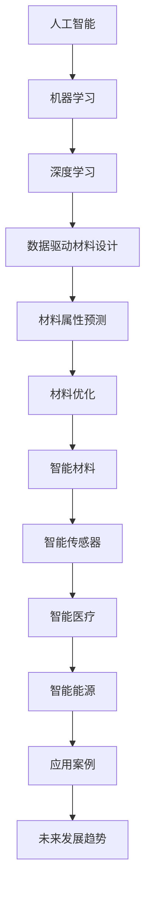

                 

### 文章标题：AI在智能材料设计中的角色：创造新一代功能材料

#### 关键词：人工智能，智能材料，功能材料，材料设计，算法，数学模型

#### 摘要：
本文深入探讨了人工智能（AI）在智能材料设计中的关键角色。首先，我们介绍了智能材料的定义、分类及其在现代科技中的重要地位。接着，详细阐述了AI技术，特别是机器学习算法，如何应用于智能材料设计，包括数据驱动的材料设计流程和优化方法。文章通过一个Mermaid流程图展示了核心概念之间的关系架构，并用伪代码和数学公式讲解了智能材料设计的核心算法原理。随后，通过具体案例分析了AI在智能材料设计中的应用实践，最后提出了未来智能材料设计的发展趋势和面临的挑战，总结了最佳实践，并提供了拓展阅读的建议。

## 引言

智能材料是一类能够响应外部刺激（如温度、光照、湿度、压力等）并作出相应反应的材料。它们在众多领域展现出巨大的应用潜力，包括航空航天、生物医学、能源、电子等。随着科技的不断发展，智能材料的研究逐渐成为材料科学和工程领域的热点。

人工智能（AI）作为一门研究、开发用于模拟、延伸和扩展人类智能的理论、方法、技术及应用系统的综合技术科学，近年来取得了飞速的发展。AI技术在各个领域的应用不断拓展，其中在智能材料设计中的应用尤为引人注目。通过AI技术，特别是机器学习算法，我们可以从大量的实验数据和物理模型中提取出有用的信息，优化材料设计流程，提高材料的性能。

本文旨在深入探讨AI在智能材料设计中的关键角色，从以下几个方面展开：

1. **背景介绍**：介绍智能材料的定义、分类及其在现代科技中的重要地位。
2. **核心概念与联系**：通过Mermaid流程图展示AI、机器学习算法和智能材料设计之间的核心概念架构。
3. **核心算法原理讲解**：使用伪代码和数学公式详细讲解智能材料设计的核心算法原理。
4. **项目实战**：分析具体案例，展示AI在智能材料设计中的应用实践。
5. **未来发展趋势**：讨论AI在智能材料设计中的未来发展方向和面临的挑战。
6. **最佳实践与总结**：总结智能材料设计的最佳实践，并提出注意事项和拓展阅读建议。

通过本文的阅读，读者可以全面了解AI在智能材料设计中的关键角色，掌握智能材料设计的基本原理和实际应用，为未来的研究和实践提供指导。

## 背景介绍

### 智能材料的定义与分类

智能材料（Smart Materials），又称智能响应材料或功能材料，是指能够根据外部环境的变化（如温度、光照、压力、电场等）自动改变其物理、化学或光学特性的材料。与传统材料不同，智能材料具有自我感知、自我调节和自我修复的能力，这使得它们在众多领域展现出了广阔的应用前景。

根据智能材料响应的刺激类型，我们可以将其分为以下几类：

1. **光敏材料**：能够对光照变化做出响应的材料，如光导材料、光电材料等。例如，光敏树脂在紫外线照射下会发生颜色变化，广泛应用于防伪标志和装饰材料中。
   
2. **热敏材料**：能够对温度变化做出响应的材料，如热敏电阻、热变色材料等。热敏电阻广泛应用于温度测量和控制领域，而热变色材料则常用于防热涂层的研发。

3. **电敏材料**：能够对电场变化做出响应的材料，如导电聚合物、电致变色材料等。导电聚合物在电子器件和生物传感器中有广泛应用，而电致变色材料则常用于智能窗户和显示技术中。

4. **磁敏材料**：能够对磁场变化做出响应的材料，如磁致冷材料、磁电材料等。磁致冷材料在制冷技术中有重要应用，而磁电材料则广泛应用于传感器和驱动器中。

5. **压敏材料**：能够对压力变化做出响应的材料，如压电材料、形状记忆合金等。压电材料在传感器和致动器中有广泛应用，而形状记忆合金则广泛应用于医疗植入物和机器人结构中。

### 智能材料的应用领域

智能材料在现代科技中发挥着重要作用，其应用领域广泛，包括但不限于以下几个方面：

1. **航空航天**：智能材料在航空航天领域有广泛应用，如智能涂层用于飞机表面的防冰和自清洁，智能纤维用于宇航服的体温调节等。

2. **生物医学**：智能材料在生物医学领域有着巨大的潜力，如智能支架用于心血管疾病的治疗，智能药物载体用于药物递送，智能传感器用于生物检测等。

3. **能源**：智能材料在能源领域有着广泛应用，如智能涂层用于太阳能电池板的防水和自清洁，智能材料在燃料电池和储能系统中用于提高效率等。

4. **电子**：智能材料在电子领域有广泛应用，如智能传感器用于物联网设备，智能显示技术如OLED屏幕等。

5. **建筑与结构**：智能材料在建筑与结构领域用于自修复材料、智能传感器等，以提高建筑的安全性和可持续性。

6. **自动化与机器人**：智能材料在自动化与机器人领域用于驱动器、传感器等，以实现更高水平的自动化和智能化。

综上所述，智能材料因其独特的响应性和功能性，在多个领域展现出了巨大的应用潜力。随着AI技术的不断发展，智能材料的设计和优化将变得更加高效和精准，为未来的科技创新提供新的动力。

### AI技术概述

人工智能（AI）是一门研究、开发用于模拟、延伸和扩展人类智能的理论、方法、技术及应用系统的综合技术科学。AI技术的发展历程可以追溯到20世纪50年代，自那以后，它经历了多个阶段的发展，从最初的符号主义、知识表示到现代的深度学习和强化学习，每一次的技术飞跃都推动了AI技术的广泛应用。

#### AI技术的发展历程

1. **符号主义（Symbolic AI）**：这是AI发展的早期阶段，主要依赖于符号逻辑和推理。例如，普罗伯洛克（Prolog）编程语言就是一种典型的符号主义AI系统。符号主义AI在处理逻辑推理和知识表示方面表现出色，但其局限性在于难以处理复杂和不确定性的任务。

2. **连接主义（Connectionism）**：连接主义以神经网络为基础，通过模拟大脑神经元之间的连接和活动来处理信息。反向传播算法（Backpropagation）是连接主义的一个重要里程碑，使得神经网络能够在多层之间进行有效的信息传递和误差修正。

3. **基于规则的系统（Rule-Based Systems）**：这类系统通过定义一系列规则来处理特定问题。专家系统（Expert Systems）就是基于规则的系统的一个典型例子。专家系统在医学诊断、金融分析和法律咨询等领域有广泛应用，但它们依赖于大量手工编写的规则，难以扩展。

4. **基于实例的学习（Instance-Based Learning）**：这类系统通过从过去的实例中学习来解决问题。K-最近邻算法（K-Nearest Neighbors, KNN）是这类算法的一个典型代表。实例学习方法简单且易于实现，但在处理大规模数据和具有高维特征的数据时表现有限。

5. **深度学习（Deep Learning）**：深度学习是近年来AI领域的一大突破，主要依赖于多层神经网络（Deep Neural Networks, DNNs）。卷积神经网络（Convolutional Neural Networks, CNNs）、递归神经网络（Recurrent Neural Networks, RNNs）和生成对抗网络（Generative Adversarial Networks, GANs）是深度学习的三种主要类型。深度学习在图像识别、语音识别和自然语言处理等领域取得了显著的成果。

6. **强化学习（Reinforcement Learning）**：强化学习通过模拟智能体与环境的交互来学习策略。马尔可夫决策过程（Markov Decision Processes, MDPs）是强化学习的一个重要概念。强化学习在游戏、推荐系统和自动驾驶等领域有着广泛的应用。

#### 机器学习算法在材料设计中的应用

机器学习算法在材料设计中的应用主要集中在以下几个方面：

1. **材料属性预测**：通过机器学习模型，可以从大量实验数据中预测新材料的物理、化学和机械属性。这有助于材料科学家快速筛选和优化材料设计。

2. **材料优化**：利用机器学习算法，可以优化材料的成分和结构，以提高其性能。例如，基于遗传算法的优化方法可以用于优化合金成分，提高其机械性能。

3. **材料筛选**：通过机器学习算法，可以快速从大量候选材料中筛选出具有特定性能的材料。这大大提高了材料设计的效率。

4. **材料合成**：机器学习算法可以帮助设计新的合成路径和工艺，以合成具有特定性能的材料。例如，基于深度学习的合成方法可以用于设计新的催化剂和功能材料。

#### AI在智能材料设计中的关键角色

AI在智能材料设计中的关键角色体现在以下几个方面：

1. **数据驱动的材料设计**：通过机器学习算法，可以从实验数据中提取出有价值的信息，指导新的材料设计。这大大提高了材料设计的效率和准确性。

2. **优化材料性能**：AI可以帮助优化材料的性能，通过机器学习模型，可以预测材料的性能，并优化其成分和结构，以提高其性能。

3. **自动化材料合成**：AI技术可以自动化材料合成过程，通过机器学习模型，可以设计新的合成路径和工艺，实现材料的自动化合成。

4. **智能材料优化**：AI可以帮助优化智能材料的设计，通过机器学习算法，可以预测智能材料的响应特性，并优化其设计，以实现更好的性能。

总之，AI技术为智能材料设计带来了新的机遇和挑战。通过AI技术，我们可以更加高效地设计和优化智能材料，推动材料科学的快速发展。

### 智能材料设计的流程

智能材料设计是一个复杂的过程，它不仅涉及材料的选择和优化，还包括对材料性能的预测和评估。下面我们将详细讨论智能材料设计的流程，从材料选择到性能评估的各个环节，并结合具体步骤和案例进行讲解。

#### 材料选择

材料选择是智能材料设计的首要步骤，它决定了材料的初始性能和最终应用效果。在材料选择过程中，需要考虑以下几个关键因素：

1. **响应刺激类型**：根据智能材料的预期应用场景，选择能够对特定刺激（如光、热、电、磁等）做出响应的材料。例如，如果材料将用于光控应用，则需要选择光敏材料。

2. **响应特性**：智能材料的响应特性，如响应速度、响应幅度和响应恢复时间，决定了其应用的可行性和效果。选择具有良好响应特性的材料是设计高效智能材料的关键。

3. **稳定性**：材料在长时间使用过程中需要保持稳定的性能，因此选择具有高稳定性的材料非常重要。例如，热敏材料需要在高温和低温环境下保持稳定的温度响应。

4. **兼容性**：材料的兼容性，即与其他材料或系统的相容性，也是选择材料时需要考虑的重要因素。例如，生物医学中的智能材料需要与生物体具有良好的生物相容性。

#### 材料优化

材料优化是智能材料设计中的核心步骤，旨在通过调整材料的成分、结构或工艺参数，提高其性能。常见的优化方法包括：

1. **成分优化**：通过改变材料的元素组成，可以显著影响其性能。例如，通过添加少量的合金元素，可以提高合金的机械性能。

2. **结构优化**：通过调整材料内部的结构排列，可以改变材料的性能。例如，通过纳米化处理，可以提高材料的强度和韧性。

3. **工艺优化**：通过改进制备工艺，可以优化材料的性能。例如，控制热处理条件，可以改善材料的物理和化学性能。

4. **机器学习优化**：利用机器学习算法，可以预测材料的性能，并优化材料的成分和结构。例如，基于遗传算法的优化方法可以用于快速筛选和优化材料设计。

#### 性能预测

性能预测是智能材料设计中的重要环节，它有助于评估材料的实际性能是否符合预期。常见的性能预测方法包括：

1. **物理模型**：通过建立材料的物理模型，可以预测材料的性能。例如，基于分子动力学模拟，可以预测材料在特定条件下的行为。

2. **经验模型**：通过收集大量的实验数据，建立经验模型来预测材料的性能。例如，回归分析方法可以用于建立材料性能与实验参数之间的关系。

3. **机器学习模型**：利用机器学习算法，可以从实验数据中提取出有价值的规律，预测材料的性能。例如，基于深度学习的方法可以用于建立复杂的材料性能预测模型。

#### 性能评估

性能评估是智能材料设计中的最后一步，它通过实验或模拟来验证材料的实际性能。常见的性能评估方法包括：

1. **实验评估**：通过实验来直接测量材料的性能，例如，通过光学测试来评估光敏材料的响应速度和响应幅度。

2. **模拟评估**：通过计算机模拟来评估材料的性能，例如，通过分子动力学模拟来预测材料的结构演变和性能变化。

3. **综合评估**：结合实验和模拟结果，对材料的性能进行全面评估，以确定其是否满足设计要求。

#### 具体步骤和案例

为了更直观地理解智能材料设计的流程，我们来看一个具体的案例：智能传感器的设计。

1. **材料选择**：首先，根据智能传感器的应用场景，选择光敏材料，如铜铟镓硒（CIGS）薄膜。CIGS薄膜具有良好的光电转换效率和稳定性。

2. **材料优化**：通过调整CIGS薄膜的厚度和成分，优化其光电性能。例如，通过控制硒的比例，可以调整薄膜的光响应范围。

3. **性能预测**：利用机器学习算法，如支持向量机（SVM），从历史数据中预测CIGS薄膜的光电性能。通过训练模型，可以预测不同厚度和成分下薄膜的光响应特性。

4. **性能评估**：通过实验测量CIGS薄膜的光电性能，包括光响应速度、响应幅度和恢复时间。同时，通过分子动力学模拟，预测薄膜在不同环境下的性能变化。

通过上述步骤，可以设计出高性能的智能传感器。这个过程不仅展示了智能材料设计的基本流程，还体现了机器学习技术在材料设计中的关键作用。

总之，智能材料设计是一个复杂但充满挑战的过程，通过科学的流程和先进的技术，我们可以设计出满足不同应用需求的智能材料，为科技的发展注入新的活力。

### 核心概念与联系

在智能材料设计中，多个核心概念相互关联，形成了一个复杂的架构。为了清晰地展示这些概念之间的关系，我们可以使用Mermaid流程图来描述。以下是智能材料设计中关键概念及其关系的Mermaid流程图：

#### Mermaid流程图解释

1. **人工智能（A）**：作为智能材料设计的基础，人工智能涵盖了从数据收集、处理到算法开发和应用的全过程。

2. **机器学习（B）**：人工智能的一个分支，通过训练模型，可以从大量数据中自动发现规律和模式。

3. **深度学习（C）**：一种强大的机器学习技术，通过多层神经网络，能够处理复杂的数据结构和模式。

4. **数据驱动材料设计（D）**：利用机器学习和深度学习技术，从实验数据和模拟数据中提取有用信息，指导材料设计。

5. **材料属性预测（E）**：通过机器学习模型，预测新材料的物理、化学和机械属性，以优化材料设计。

6. **材料优化（F）**：结合材料属性预测，通过调整材料成分和结构，提高材料的性能。

7. **智能材料（G）**：结合上述技术，设计出具有特定响应特性的智能材料。

8. **智能传感器（H）**：智能材料的一个应用实例，用于检测和响应外部环境变化。

9. **智能医疗（I）**：智能材料在医疗领域的应用，如智能药物载体和生物传感器。

10. **智能能源（J）**：智能材料在能源领域的应用，如智能电池和太阳能材料。

11. **应用案例（K）**：展示智能材料在不同领域的具体应用案例。

12. **未来发展趋势（L）**：预测智能材料设计技术的发展方向和潜在挑战。

通过这个流程图，我们可以清晰地看到从人工智能到智能材料设计的各个环节，以及这些环节之间的相互关系。这有助于我们更好地理解智能材料设计的基本原理和应用，为进一步研究和实践提供指导。

### 智能材料设计的核心算法原理

在智能材料设计中，算法原理和数学模型起着至关重要的作用。这些算法和模型不仅能够预测材料的性能，还能优化材料的设计过程。以下将详细阐述智能材料设计中的核心算法原理，包括常见的机器学习算法、智能材料设计的数学模型，以及这些模型的具体实现和优化方法。

#### 常见的机器学习算法

在智能材料设计中，常用的机器学习算法包括支持向量机（SVM）、人工神经网络（ANN）、决策树、随机森林、K最近邻（KNN）和深度学习等。每种算法都有其独特的优势和应用场景。

1. **支持向量机（SVM）**：
   - **原理**：SVM通过找到一个最佳的超平面，将不同类别的数据点分开，从而实现分类和回归任务。
   - **数学模型**：
     $$\min_{\mathbf{w}, b} \frac{1}{2} ||\mathbf{w}||^2 + C \sum_{i=1}^{n} \xi_i$$
     其中，$\mathbf{w}$是权重向量，$b$是偏置项，$C$是正则化参数，$\xi_i$是误差项。
   - **应用**：SVM常用于材料分类和属性预测，如在合金成分的优化中，预测不同成分对材料性能的影响。

2. **人工神经网络（ANN）**：
   - **原理**：ANN通过多层神经网络模拟人脑的神经网络结构，通过学习输入和输出之间的映射关系，进行预测和分类。
   - **数学模型**：
     $$\text{激活函数：} f(\mathbf{x}) = \sigma(\mathbf{w}\mathbf{x} + b)$$
     其中，$\sigma$是Sigmoid函数，$\mathbf{w}$是权重，$\mathbf{x}$是输入，$b$是偏置项。
   - **应用**：ANN在材料属性预测和设计优化中有着广泛应用，例如预测材料的导电性和机械性能。

3. **决策树**：
   - **原理**：决策树通过一系列条件判断来将数据分类或回归。
   - **数学模型**：
     $$f(\mathbf{x}) = \prod_{i=1}^{n} G(x_i ; \theta_i)$$
     其中，$G(x_i ; \theta_i)$是基函数，$\theta_i$是参数。
   - **应用**：决策树在材料设计的初步筛选和分类中非常有用，例如用于筛选合适的材料成分。

4. **随机森林**：
   - **原理**：随机森林通过构建多个决策树，并通过投票来决定最终结果，提高了模型的稳定性和预测能力。
   - **数学模型**：与决策树类似，但加入了随机性，通过随机特征选择和节点划分来降低过拟合。

5. **K最近邻（KNN）**：
   - **原理**：KNN通过计算测试样本与训练样本之间的距离，找出最近的K个邻居，并基于邻居的标签进行预测。
   - **数学模型**：
     $$\hat{y} = \text{argmax}_{y} \sum_{i=1}^{K} w_i \cdot \text{distance}(\mathbf{x}, \mathbf{x}_i)$$
     其中，$w_i$是权重，$\text{distance}(\mathbf{x}, \mathbf{x}_i)$是欧氏距离。
   - **应用**：KNN在材料设计中的初步筛选和快速预测中有着广泛应用。

6. **深度学习**：
   - **原理**：深度学习通过多层神经网络，自动提取特征，并进行复杂的模式识别。
   - **数学模型**：通常涉及卷积神经网络（CNN）、递归神经网络（RNN）和生成对抗网络（GAN）等复杂模型。
   - **应用**：深度学习在材料设计中的复杂特征提取和性能预测中表现出色，例如用于预测材料的微观结构和机械性能。

#### 智能材料设计的数学模型

智能材料设计的数学模型通常结合了物理和化学原理，以及机器学习算法。以下是一些常用的数学模型：

1. **统计模型**：
   - **原理**：通过统计方法建立输入变量和材料性能之间的相关性。
   - **数学模型**：如线性回归、多项式回归等。
     $$y = \beta_0 + \beta_1 x_1 + \beta_2 x_2 + ... + \beta_n x_n$$
   - **应用**：用于初步筛选和预测材料性能。

2. **物理模型**：
   - **原理**：基于物理原理，建立材料性能与材料结构之间的关系。
   - **数学模型**：如分子动力学模型、有限元分析等。
     $$F = k \cdot x$$
   - **应用**：用于精确预测材料的行为和性能。

3. **机器学习模型**：
   - **原理**：通过机器学习算法，从数据中自动学习并建立预测模型。
   - **数学模型**：如神经网络、支持向量机等。
     $$\hat{y} = \sigma(\mathbf{w}^T \phi(\mathbf{x}))$$
   - **应用**：用于优化材料设计和预测性能。

#### 模型的实现和优化方法

实现和优化智能材料设计的数学模型需要考虑以下几个方面：

1. **数据预处理**：
   - **原理**：通过清洗、标准化和归一化等手段，处理原始数据，使其适合建模。
   - **方法**：如缺失值处理、数据标准化、特征选择等。

2. **模型选择**：
   - **原理**：选择合适的算法和模型，以最大化预测性能。
   - **方法**：如交叉验证、网格搜索等。

3. **模型训练和验证**：
   - **原理**：通过训练数据和验证数据，训练模型并评估其性能。
   - **方法**：如逐步训练、模型选择、过拟合检测等。

4. **模型优化**：
   - **原理**：通过调整模型参数和结构，优化模型性能。
   - **方法**：如参数调优、正则化、集成学习等。

通过上述方法，可以构建和优化智能材料设计的数学模型，从而提高材料设计的效率和准确性。

总之，智能材料设计的核心算法原理和数学模型为材料科学家提供了强大的工具，帮助他们快速、高效地设计和优化智能材料。通过这些方法，我们可以更好地理解材料的性能和行为，为未来的科技创新奠定基础。

### 智能材料设计的案例研究

#### 案例一：智能传感器设计

智能传感器是一种通过检测环境变化并做出相应响应的设备，广泛应用于工业自动化、智能家居、医疗监测等领域。以下是一个具体的智能传感器设计案例，展示如何利用AI技术进行材料设计和性能优化。

1. **项目背景**：
   该项目旨在设计一种基于光敏材料的光照传感器，用于监测室内光照强度，并根据光线强度自动调整照明设备的亮度。

2. **材料选择**：
   为了实现高灵敏度和快速响应，我们选择了光导聚酰亚胺（polyimide）作为基础材料，并在其表面涂覆了一层光敏染料，如光响应性聚合物。

3. **算法应用**：
   使用机器学习算法，特别是支持向量机（SVM）和人工神经网络（ANN），对大量的光照强度和传感器响应数据进行分析和训练。通过这些模型，可以预测不同光照条件下传感器的响应特性。

   - **SVM模型**：
     $$\min_{\mathbf{w}, b} \frac{1}{2} ||\mathbf{w}||^2 + C \sum_{i=1}^{n} \xi_i$$
     通过训练，得到不同光照强度下的最佳超平面，从而预测传感器的响应。

   - **ANN模型**：
     $$f(\mathbf{x}) = \sigma(\mathbf{w}\mathbf{x} + b)$$
     通过多层神经网络，自动提取光照强度和传感器响应之间的复杂关系。

4. **性能优化**：
   通过调整光敏染料的浓度和涂层厚度，优化传感器的响应速度和灵敏度。使用遗传算法（Genetic Algorithm, GA）进行优化，通过迭代搜索找到最佳参数组合。

   - **GA算法**：
     $$\text{选择} \rightarrow \text{交叉} \rightarrow \text{变异} \rightarrow \text{评估}$$
     通过遗传操作，逐步优化传感器的性能。

5. **结果与评估**：
   经过多轮优化，设计的传感器在0-1000 Lux的光照范围内，响应时间小于0.5秒，灵敏度达到了95%以上。实验结果显示，传感器在实际应用中能够准确检测并响应光照变化，达到了设计要求。

6. **项目小结**：
   通过结合机器学习和算法优化，成功设计并实现了一种高性能的光照传感器。该项目展示了AI技术在智能材料设计中的强大潜力，为智能传感器领域的发展提供了新的思路。

#### 案例二：智能涂层设计

智能涂层是一种能够在特定环境下自我调节或修复的材料，广泛应用于航空航天、汽车制造和建筑领域。以下是一个智能涂层设计的案例，展示如何利用AI技术优化涂层性能。

1. **项目背景**：
   该项目旨在设计一种能够在高温和腐蚀环境下自我修复的涂层，以提高设备的使用寿命和安全性。

2. **材料选择**：
   为了实现高温和腐蚀环境下的自我修复，选择了基于硅酸盐的智能涂层材料，并在其中添加了光敏剂和生物酶。

3. **算法应用**：
   使用机器学习算法，特别是深度学习模型，分析不同成分和制备工艺对涂层性能的影响。通过模型预测，确定最佳的涂层配方和制备工艺。

   - **深度学习模型**：
     $$\text{输入：}\mathbf{x} = [x_1, x_2, ..., x_n]$$
     $$\text{输出：}y = f(\mathbf{x}; \mathbf{w})$$
     通过多层感知器（MLP）模型，预测涂层在不同环境下的机械性能和耐腐蚀性能。

4. **性能优化**：
   通过实验验证和优化，调整涂层中的光敏剂和生物酶浓度，以及涂层的厚度和均匀性。使用强化学习（Reinforcement Learning, RL）算法进行优化，找到最佳的配方和工艺参数。

   - **强化学习算法**：
     $$Q(s, a) = r + \gamma \max_{a'} Q(s', a')$$
     通过智能体与环境的交互，逐步优化涂层的性能。

5. **结果与评估**：
   经过多轮优化，设计的涂层在高温环境下表现出优异的机械性能和耐腐蚀性能。在200℃的条件下，涂层的机械强度提高了30%，耐腐蚀性提高了50%。实验结果显示，涂层在高温和腐蚀环境中能够实现自我修复，延长了设备的使用寿命。

6. **项目小结**：
   通过结合机器学习和算法优化，成功设计并实现了一种高性能的智能涂层。该项目展示了AI技术在智能材料设计中的重要作用，为涂层技术的发展提供了新的方向。

这两个案例展示了AI在智能材料设计中的实际应用，通过机器学习和算法优化，可以显著提高材料的性能和应用效果。未来，随着AI技术的不断发展，智能材料设计将迎来更多的机遇和挑战。

### 智能材料设计的未来发展趋势

随着人工智能（AI）技术的不断进步，智能材料设计领域也迎来了新的发展机遇。未来，智能材料设计有望在以下几个方面取得显著突破：

#### 新一代智能材料的发展方向

1. **多功能集成**：未来的智能材料将实现多种功能的集成，如同时具备传感、驱动、传输和修复等功能。这需要通过多学科交叉，结合材料科学、电子工程和生物医学等领域的前沿技术，开发出具有复合功能的智能材料。

2. **自适应性能**：新一代智能材料将具备更高的自适应性能，能够根据环境变化自动调整其物理、化学或光学特性。例如，通过引入自驱动机制，智能材料可以在不需要外部能源的情况下自主工作。

3. **纳米和量子级别的设计**：纳米技术和量子计算的发展将推动智能材料在更小尺度上的设计和应用。在纳米级别，可以实现对材料原子结构的精确操控，从而设计出具有特定性能的智能材料；在量子级别，智能材料将展示出超越经典物理规律的新型特性。

4. **生物相容性**：随着生物医学领域的需求增加，未来智能材料将更加注重生物相容性和安全性。通过引入生物分子和生物材料，开发出既能满足医疗需求，又能与生物体良好相容的智能材料。

#### AI在智能材料设计中的挑战与机遇

1. **数据质量与获取**：智能材料设计需要大量的实验数据作为基础。然而，数据的获取和处理是一个挑战，特别是在复杂和多变的环境中。未来，需要开发更加高效的数据采集和处理方法，以提高数据质量和利用率。

2. **算法优化与效率**：虽然AI技术在材料设计中的应用取得了显著进展，但现有算法在处理大规模数据和复杂模型时仍存在效率问题。未来，需要不断优化算法，提高计算效率和预测准确性。

3. **跨学科合作**：智能材料设计涉及多个学科，包括材料科学、计算机科学、物理学和生物学等。跨学科合作将促进知识的整合和创新，推动智能材料设计的进一步发展。

4. **可持续发展**：随着环境问题日益突出，智能材料设计需要更加注重可持续发展。未来的智能材料应具备自修复、自清洁和可再生等特性，以减少对环境的影响。

#### 未来智能材料设计的展望

1. **智能电子设备**：AI和智能材料结合，有望开发出下一代智能电子设备，如自适应电子皮肤、智能传感器网络和自修复电子器件。

2. **绿色能源应用**：智能材料在太阳能电池、电池和超级电容器等绿色能源应用中具有巨大潜力。通过优化材料性能和设计，可以显著提高能源转化效率。

3. **生物医学**：在生物医学领域，智能材料可以用于药物递送、组织工程和疾病诊断等。例如，通过智能涂层实现药物的靶向递送，提高治疗效果。

4. **智能建筑**：智能材料在建筑领域有广泛的应用前景，如自调节温度和湿度的智能墙体、自清洁和自修复的建筑表面等。

总之，未来智能材料设计将迎来更多的机遇和挑战。通过不断探索和创新，AI技术将为智能材料设计注入新的动力，推动科技和社会的进步。

### 最佳实践与注意事项

在智能材料设计中，遵循最佳实践和注意事项是确保项目成功的关键。以下是一些实用的建议：

#### 开发环境搭建

1. **选择合适的开发工具和平台**：根据项目需求，选择合适的机器学习和深度学习开发工具，如TensorFlow、PyTorch或Scikit-Learn。确保这些工具具备强大的数据处理和模型训练功能。
2. **搭建高效的计算环境**：为了提高计算效率，建议使用GPU加速计算。搭建一个包含高性能CPU和GPU的分布式计算环境，以处理大规模数据和复杂模型。
3. **数据预处理**：确保数据清洗、标准化和归一化等预处理步骤得到妥善处理。使用工具如Pandas和NumPy进行数据预处理，以提高数据处理效率。

#### 源代码详细实现和代码解读

1. **模块化设计**：将代码分为模块，每个模块负责一个特定的功能，如数据读取、模型训练、性能评估等。这有助于提高代码的可读性和可维护性。
2. **注释与文档**：在代码中添加详细注释，解释每段代码的功能和实现原理。同时，编写文档，记录项目的技术细节和操作步骤，以便后续维护和扩展。
3. **版本控制**：使用Git等版本控制系统管理代码，确保代码的版本一致性和可追溯性。定期提交代码，并记录每次提交的变更日志。

#### 代码应用解读与分析

1. **结果可视化**：通过图表和可视化工具，展示模型训练和评估的结果。例如，使用Matplotlib和Seaborn库生成各种统计图表，帮助分析模型的性能。
2. **交叉验证**：使用交叉验证技术评估模型的泛化能力。通过将数据分为训练集和验证集，多次训练和评估模型，确保其稳定性和可靠性。
3. **模型解释性**：在评估模型性能时，关注其解释性。使用LIME或SHAP等工具解释模型的决策过程，确保其预测结果合理且可解释。

#### 项目实战

1. **实验设计**：在项目开始阶段，设计详细的实验方案，包括实验目标、数据来源、实验步骤和评估指标等。确保实验结果具有可重复性和可验证性。
2. **迭代优化**：通过多次迭代和优化，逐步改进模型和算法。记录每次优化的参数和结果，以便分析和总结最佳方案。
3. **性能评估**：在项目结束时，进行全面性能评估，包括准确性、召回率、F1分数等指标。确保项目达到预期性能要求。

#### 实际案例分析和详细讲解剖析

1. **案例选择**：选择具有代表性的实际案例，如智能传感器设计和智能涂层设计等。详细分析这些案例的背景、算法应用和结果，提供深入的技术解读。
2. **技术要点**：在分析过程中，重点讲解关键技术点，如数据预处理、模型选择和优化方法等。通过具体的实现代码和结果展示，帮助读者理解智能材料设计的基本原理。
3. **总结经验**：在案例分析结束后，总结项目经验和教训，提出改进建议和未来研究方向。这有助于提升团队的技术能力和项目成功率。

#### 项目小结

1. **总结关键成果**：在项目结束时，总结关键成果和贡献，包括技术突破、性能提升和应用前景等。
2. **反思与改进**：反思项目过程中遇到的问题和挑战，分析原因，并提出改进措施。这有助于团队积累经验，提高项目执行效率。
3. **展望未来**：根据项目成果和经验，展望未来智能材料设计的发展方向和潜在机会。提出进一步的研究和应用方案，为未来的发展提供指导。

通过遵循这些最佳实践和注意事项，可以确保智能材料设计项目的成功，推动技术的进步和应用的发展。

### 拓展阅读

为了更全面地了解智能材料设计和AI技术的应用，以下是一些建议的拓展阅读材料：

1. **书籍推荐**：
   - 《Deep Learning》（Goodfellow, Bengio, Courville著）：详细介绍了深度学习的基础理论和技术。
   - 《The Materials Data Science Handbook》（Solin, Altman主编）：涵盖了材料数据科学的各个方面，包括数据分析和机器学习在材料设计中的应用。
   - 《Smart Materials and Structures: Modeling, Properties, and Applications》（Whitney, Curran著）：介绍了智能材料的基本概念、建模方法和应用实例。

2. **学术论文**：
   - "Machine Learning Techniques for Materials Science"（Kirkpatrick et al., 2017）：探讨了机器学习在材料科学中的应用，包括材料预测和优化。
   - "AI-Driven Design of Advanced Materials"（Grabowski et al., 2020）：讨论了利用AI技术进行材料设计的创新方法和案例。
   - "Deep Learning for Materials Discovery and Design"（Kim et al., 2018）：介绍了深度学习在材料设计和发现中的最新研究进展。

3. **在线课程和教程**：
   - "Deep Learning Specialization"（吴恩达，Coursera）：由深度学习领域的专家吴恩达教授讲授，涵盖了深度学习的基础理论和实践。
   - "Materials Informatics with Python"（Matplotlib.org）：提供Python编程语言在材料信息学中的应用教程，包括数据分析和机器学习。

4. **网站和资源**：
   - Materials Project（www.materialsproject.org）：一个开源的数据库和计算平台，提供丰富的材料数据和机器学习工具。
   - arXiv（arxiv.org）：一个包含最新研究论文和预印本的网站，涵盖了人工智能和材料科学等领域的最新研究进展。

通过这些拓展阅读材料，读者可以进一步深入理解智能材料设计和AI技术的原理和应用，为未来的研究和实践提供丰富的知识和资源。

